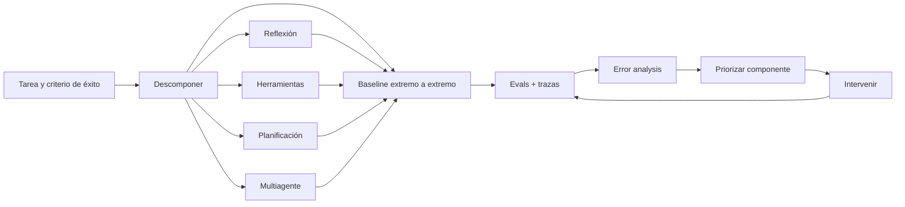
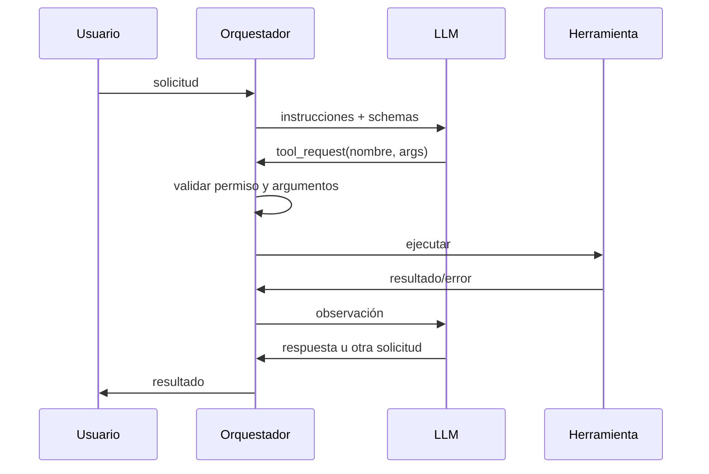

# Agentic AI — manual operativo para sistemas y agentes Codex

> **Estado:** *Agentic AI* y *Generative AI for Software Development* completos, reconciliados y auditados.
> **Fuentes primarias:** Andrew Ng, *Agentic AI*; Laurence Moroney y una conversación identificada con Andrew Ng, *Generative AI for Software Development*; DeepLearning.AI.
> **Cobertura verificada:** Agentic AI —5 módulos, 31 videos—; Software Development —3 cursos, 9 módulos, 144 unidades, 80 videos, 8 ejemplos de código, 34 lecturas y 22 evaluaciones certificables—.
> **Propósito:** diseñar, programar, evaluar y operar flujos agentivos que resuelvan tareas complejas mediante descomposición, reflexión, herramientas, planificación y colaboración multiagente.

## Cómo usar este documento

1. Para decidir si una tarea necesita agentes, usar **Árbol de decisión arquitectónico**.
2. Para diseñar un flujo, completar **Contrato del sistema** y **Ficha de componente**.
3. Para implementar, seguir **Bucle de ejecución** y los contratos de reflexión, herramientas o planificación aplicables.
4. Para mejorar resultados, usar **Evals → trazas → error analysis → intervención**; no cambiar componentes por intuición.
5. Para producción, aplicar **Puertas de salida**, **presupuestos**, **seguridad** y **observabilidad**.
6. Para encargar trabajo a Codex, copiar el **Contrato operativo para Codex**.

## Procedencia y límites

- **[NG]** síntesis fiel de la enseñanza de Andrew Ng en el curso; no implica transcripción literal.
- **[DLAI]** síntesis fiel de Laurence Moroney u otro contenido oficial identificado de DeepLearning.AI; no implica transcripción literal.
- **[IMPL]** especificación de ingeniería derivada de esas enseñanzas para convertirlas en código, pruebas y operación.
- **[EXT]** práctica adicional necesaria para un sistema profesional, pero no atribuida al curso.
- Las prácticas calificadas no se reproducen ni se resuelven. Los ejemplos públicos se representan por sus patrones, no por una copia de sus notebooks.
- La bienvenida no expuso contenido técnico sustantivo; las otras 30 videolecciones fueron comprobadas en sus transcripciones oficiales en inglés.
- Este documento cubre *Agentic AI* completo e incorpora, en el mismo archivo, *Generative AI for Software Development* sin duplicar los manuales de Transformers, RAG o Producción.
- No reemplaza documentación específica de proveedor, seguridad ofensiva, sistemas distribuidos ni diseño de infraestructura de baja latencia.

## Tres formulaciones literales breves

Andrew Ng resume el proceso con tres hábitos: “start by quickly building an end-to-end system”, “develop a habit of looking at traces” e “I often go back and forth between building and analyzing”.

El resto del documento traduce esas ideas al español y las convierte en procedimientos, sin fingir que es una transcripción literal.

## Modelo mental total



**[NG]** Un flujo agentivo es una aplicación que usa un LLM para ejecutar múltiples pasos de una tarea. Su cualidad fundamental no es la autonomía máxima, sino una secuencia útil de componentes que mejora el resultado.

**[NG]** La autonomía es un continuo. Un flujo fijo con pasos definidos puede ser agentivo; un agente que decide dinámicamente todos sus pasos lo es en mayor grado. Debatir una etiqueta binaria aporta menos que construir y evaluar el sistema.

**[IMPL]** Principio rector: usar el menor grado de autonomía que satisfaga la tarea y aumentar libertad solo cuando las evaluaciones demuestren que la secuencia fija limita el desempeño.

## Inventario compacto del curso

### Módulo 1 — Introduction to Agentic Workflows

- What is agentic AI?
- Degrees of autonomy.
- Benefits of agentic AI.
- Agentic AI applications.
- Task decomposition: Identifying the steps in a workflow.
- Evaluating agentic AI (evals).
- Agentic design patterns.
- Práctica: agente de investigación; configuración local opcional; quiz.

### Módulo 2 — Reflection Design Pattern

- Reflection to improve outputs of a task.
- Why not just direct generation?
- Chart generation workflow.
- Evaluating the impact of reflection.
- Using external feedback.
- Prácticas: generación de gráficos; mejora de SQL mediante reflexión; quiz y laboratorio calificado.

### Módulo 3 — Tool Use

- What are tools?
- Creating a tool.
- Tool syntax.
- Code execution.
- MCP.
- Prácticas: convertir funciones en herramientas; asistente de correo; quiz y laboratorio calificado.

### Módulo 4 — Practical Tips for Building Agentic AI

- Evaluations (evals).
- Error analysis and prioritizing next steps.
- More error analysis examples.
- Component-level evaluations.
- How to address problems you identify.
- Latency, cost optimization.
- Development process summary.
- Práctica: eval por componente para el agente de investigación; quiz.

### Módulo 5 — Patterns for Highly Autonomous Agents

- Planning workflows.
- Creating and executing LLM plans.
- Planning with code execution.
- Multi-agentic workflows.
- Communication patterns for multi-agent systems.
- Conclusion.
- Prácticas: agente de atención al cliente; equipo de investigación de mercado; quiz y trabajo final.

## Inventario verificado — Generative AI for Software Development

Certificado profesional de DeepLearning.AI impartido por Laurence Moroney, con conversación inicial junto a Andrew Ng. La ficha del programa declara 31 h 32 min y el catálogo general 35 h 32 min; se conserva la discrepancia y no se usa duración para inferir cobertura. El syllabus autenticado confirma:

| Curso | Módulos | Videos | Código | Lecturas | Evaluaciones | Unidades |
|---|---:|---:|---:|---:|---:|---:|
| 1. Introduction to Generative AI for Software Development | 3 | 29 | 2 | 13 | 7 | 51 |
| 2. Team Software Engineering with AI | 3 | 25 | 2 | 10 | 8 | 45 |
| 3. AI-Powered Software and System Design | 3 | 26 | 4 | 11 | 7 | 48 |
| **Total** | **9** | **80** | **8** | **34** | **22** | **144** |

**Ruta de extracción:** fundamentos y pair-programming → estructuras de datos y contexto de herramientas → testing, debugging, documentación y dependencias → configuración, bases de datos y patrones de diseño. Las evaluaciones se contabilizan, no se abren ni reproducen.

## Beneficios y límites del enfoque

- **[NG]** El beneficio principal es rendimiento: un modelo anterior dentro de un buen flujo agentivo puede superar a uno más nuevo usado mediante generación directa en algunas tareas.
- **[NG]** Los pasos independientes pueden ejecutarse en paralelo y terminar antes que un proceso humano estrictamente secuencial.
- **[NG]** La modularidad permite sustituir un buscador, herramienta o modelo de una etapa sin rehacer todo el sistema.
- **[NG]** Los flujos hacen posibles aplicaciones antes demasiado difíciles, pero no vuelven confiable cualquier interfaz. En computer use, páginas lentas o difíciles de interpretar aún pueden producir fallos; el curso no lo presenta como listo para toda misión crítica.
- **[IMPL]** Evaluar la contribución del flujo frente a la misma tarea con generación directa. Si no mejora calidad, capacidad o tiempo total, su complejidad no está justificada.

## 1. Árbol de decisión arquitectónico

```text
¿La salida correcta puede obtenerse con código determinista?
├─ sí -> usar código; no introducir un LLM
└─ no -> ¿una sola llamada cumple calidad, costo y latencia?
         ├─ sí -> generación directa
         └─ no -> ¿la tarea humana tiene pasos reconocibles?
                  ├─ sí -> flujo fijo descompuesto
                  └─ no -> planificación acotada

En cualquier rama:
- ¿falta información o una acción externa? -> herramienta
- ¿una crítica puede corregir la salida? -> reflexión medida
- ¿hay subroles realmente distintos? -> multiagente
- ¿no hay eval que demuestre la mejora? -> no añadir complejidad todavía
```

- **[NG]** Las tareas con un proceso claro suelen ser más sencillas de implementar de forma confiable: extraer campos de una factura y guardarlos; comprender una consulta de pedido, recuperar el registro y redactar una respuesta para revisión humana.
- **[NG]** La generación directa puede producir un resultado superficial. Imitar el proceso humano —bosquejo, investigación, borrador, revisión— permite más profundidad.
- **[NG]** Planificación y multiagentes amplían mucho lo posible, pero son menos controlables y previsibles.
- **[IMPL]** No usar “agente” como excusa para ocultar un pipeline. Representar explícitamente estados, transiciones, entradas, salidas, fallos y presupuestos.

### Escala de autonomía recomendada

| Nivel | Quién decide la secuencia | Adecuado para | Riesgo principal |
|---:|---|---|---|
| 0 | código determinista | reglas, cálculos y transformaciones exactas | rigidez |
| 1 | desarrollador | flujo LLM fijo y repetible | diseño incompleto |
| 2 | desarrollador + ramas LLM | selección entre rutas conocidas | clasificación errónea |
| 3 | LLM dentro de límites | plan dinámico y herramientas permitidas | trayectoria imprevisible |
| 4 | varios agentes | roles especializados y coordinación | costo, caos y atribución de errores |

**[IMPL]** Para tareas irreversibles, financieras, legales, de seguridad o que afectan a terceros, la autonomía práctica debe reducirse mediante aprobación, simulación, límites de permisos e idempotencia.

## 2. Descomposición de tareas

### Procedimiento

1. **[NG]** Describir cómo una persona competente resolvería la tarea; no comenzar por el framework.
2. **[NG]** Separar el proceso en pasos discretos.
3. **[NG]** Verificar que cada paso pueda ejecutarse mediante un LLM, una pieza corta de código, una función o una herramienta.
4. **[NG]** Construir la versión extremo a extremo más simple.
5. **[NG]** Inspeccionar la salida y subdividir solamente los pasos que sigan siendo demasiado difíciles.
6. **[IMPL]** Definir contrato, eval, fallo y observabilidad de cada paso.
7. **[IMPL]** Identificar qué pasos son independientes y pueden correr en paralelo.

### Tabla obligatoria de diseño

| Paso | Entrada | Salida tipada | Ejecutor | Criterio de éxito | Fallo recuperable | Efecto externo |
|---|---|---|---|---|---|---|
| ejemplo: extraer pedido | correo | `OrderIntent` | LLM | campos correctos | pedir aclaración | no |
| ejemplo: buscar registro | `order_id` | `OrderRecord` | herramienta | registro exacto | no encontrado | lectura |
| ejemplo: redactar | intención + registro | borrador | LLM | rúbrica de respuesta | regenerar | no |
| ejemplo: enviar | borrador aprobado | recibo | herramienta | API confirma | reintento idempotente | sí |

### Heurísticas de frontera

- **[NG]** Si una instrucción LLM acumula demasiadas responsabilidades, dividirla en dos o tres llamadas puede mejorar la obediencia.
- **[IMPL]** Separar percepción, razonamiento, decisión y acción cuando sus errores tienen causas o permisos diferentes.
- **[IMPL]** Mantener deterministas validación de schema, aritmética exacta, autorización, límites y commits.
- **[IMPL]** No fragmentar por estética: cada frontera añade latencia, costo, estado y otra posibilidad de fallo.

## 3. El ciclo profesional: construir y analizar

```text
prototipo seguro -> observar resultados y trazas -> crear eval pequeña
-> clasificar errores -> priorizar -> cambiar una cosa -> reevaluar
-> ampliar dataset con fallos nuevos -> desplegar gradualmente -> repetir
```

- **[NG]** Es difícil anticipar dónde fallará un sistema agentivo. Un prototipo rápido, seguro y razonable entrega evidencia antes que semanas de especulación.
- **[NG]** Al principio pueden bastar inspección manual y una intuición informada de las trazas.
- **[NG]** Al madurar, una evaluación de 10–20 ejemplos ya puede orientar mejor el desarrollo.
- **[NG]** Después conviene sistematizar error analysis y evaluaciones por componente.
- **[NG]** Construir y analizar son actividades igualmente importantes; analizar evita dedicar semanas o meses a un componente que no mejora el sistema.
- **[IMPL]** Cada cambio debe declarar hipótesis, métrica objetivo, dataset, costo permitido y condición de rechazo.

### Registro de experimento mínimo

```yaml
change_id: AG-000
hypothesis: "Si cambio X, mejorará Y porque Z"
baseline_version: "git/model/prompt/tool version"
candidate_version: "..."
eval_set_version: "..."
primary_metric: "..."
guardrails:
  - metric: "latency_p95_ms"
    max_regression: 0
  - metric: "unsafe_action_rate"
    max_value: 0
result: pass | fail | inconclusive
decision: promote | revise | discard
evidence: "enlace a reporte y trazas"
```

## 4. Evaluaciones de punta a punta

### Descubrir primero, formalizar después

- **[NG]** No es posible anticipar todos los fallos. Examinar salidas reales permite descubrir criterios como menciones indebidas a competidores, fechas erróneas o puntos importantes omitidos.
- **[NG]** Cuando aparece un fallo relevante, convertirlo en una evaluación que mida su frecuencia.
- **[IMPL]** El dataset de evaluación es memoria institucional: cada incidente representativo debe convertirse en un caso reproducible.

### Matriz de evals enseñada

| Evaluador | Ground truth por ejemplo | Uso |
|---|---:|---|
| código | sí | fecha, valor, ID o resultado exacto distinto en cada caso |
| código | no | regla global: longitud máxima, regex, schema, prohibición |
| LLM judge | sí | cobertura de puntos de referencia expresables de muchas maneras |
| LLM judge | no | rúbrica general de claridad, legibilidad o calidad visual |

### Preferencia de evaluador

1. **[NG]** Si el criterio es objetivo, escribir código.
2. **[NG]** Para texto o imágenes subjetivos, usar una rúbrica clara y un LLM como juez.
3. **[NG]** Varias preguntas binarias suelen ser más consistentes que una nota global de 1 a 5.
4. **[NG]** La comparación por pares puede sufrir sesgo de posición o redacción; no asumir que el juez es infalible.
5. **[IMPL]** Calibrar el juez contra una muestra anotada por personas y medir acuerdos y desacuerdos.

### Ejemplo de rúbrica binaria

```yaml
artifact: "respuesta de soporte"
criteria:
  - id: grounded
    question: "¿Cada afirmación sobre el pedido está respaldada por el registro?"
  - id: resolves_intent
    question: "¿Responde la intención principal del cliente?"
  - id: no_competitor
    question: "¿Evita mencionar competidores?"
  - id: actionable
    question: "¿Indica el siguiente paso cuando corresponde?"
scoring:
  pass: "todos los criterios críticos y >= 3/4 totales"
```

### Dataset de evaluación

- **[IMPL]** Separar `dev` para iteración y `holdout` para confirmar; no optimizar repetidamente sobre todo el conjunto.
- **[IMPL]** Incluir casos normales, límites, entradas incompletas, herramientas caídas, conflicto de fuentes y acciones denegadas.
- **[IMPL]** Versionar entrada, ground truth, rúbrica, juez, prompts, modelos, herramientas y seeds cuando existan.
- **[IMPL]** Reportar promedio y slices críticos; un promedio alto no compensa una tasa peligrosa en un slice de alto riesgo.

## 5. Trazas, error analysis y priorización

### Unidad de diagnóstico

Una traza debe permitir reconstruir:

```text
solicitud -> decisión/ruta -> prompts versionados -> llamadas de modelo
-> herramientas y argumentos -> observaciones -> revisiones -> acción -> resultado
```

**[EXT]** Redactar secretos y datos personales; almacenar IDs y hashes cuando el contenido bruto no sea necesario.

### Proceso de error analysis

1. **[NG]** Reunir ejemplos donde la salida final sea insatisfactoria; apartar inicialmente los correctos.
2. **[NG]** Leer los resultados intermedios de cada componente.
3. **[NG]** Comparar cada salida con lo que habría producido una persona experta con la misma entrada.
4. **[NG]** Atribuir el primer fallo causal, sin culpar a un componente posterior que recibió una entrada ya deficiente.
5. **[NG]** Registrar categorías en una hoja y contar frecuencias.
6. **[NG]** Priorizar componentes con errores frecuentes y una intervención viable.
7. **[IMPL]** Confirmar la hipótesis con una eval por componente antes de reemplazar arquitectura costosa.

### Hoja de análisis

| Caso | Fallo final | Primer componente causal | Categoría | Evidencia en traza | Impacto | Idea de mejora |
|---|---|---|---|---|---:|---|
| A | punto clave omitido | búsqueda web | fuentes débiles | no recuperó fuente primaria | alto | cambiar query/provider |
| B | fecha equivocada | PDF→texto | OCR | texto fuente incorrecto | alto | mejorar conversión |
| C | tono inadecuado | redactor | instrucción | facts correctos, estilo falla | medio | rúbrica + ejemplos |

### Puntuación de prioridad

```text
prioridad ≈ frecuencia × severidad × confianza causal × viabilidad de mejora
```

- **[NG]** Frecuencia sola no basta: un componente problemático sin una vía razonable de mejora puede quedar detrás de otro sobre el que sí se puede actuar.
- **[IMPL]** Tratar severidad crítica como puerta independiente; una acción destructiva rara no debe diluirse en el promedio.

### Árbol causal rápido

```text
salida mala
├─ ¿entrada original suficiente?
├─ ¿ruta/plan eligió los pasos correctos?
├─ ¿herramienta recibió argumentos correctos?
├─ ¿herramienta devolvió datos correctos?
├─ ¿modelo usó correctamente la observación?
├─ ¿reflexión detectó y corrigió el problema?
└─ ¿validador o aprobación debió bloquear la acción?
```

## 6. Evaluaciones por componente

- **[NG]** Una eval extremo a extremo puede ser costosa y ruidosa: la aleatoriedad de otros componentes puede ocultar una pequeña mejora local.
- **[NG]** Para búsqueda, un conjunto de fuentes de referencia permite medir cuántas recupera el componente sin ejecutar todo el agente.
- **[IMPL]** Toda frontera estable del flujo debería admitir replay con entradas guardadas y un evaluador local.

### Pirámide de pruebas

| Capa | Qué prueba | Ejemplos |
|---|---|---|
| contrato | forma y reglas deterministas | JSON schema, tipos, autorización |
| componente | calidad aislada | recall de retrieval, exactitud de extracción |
| integración | interacción de dos o más piezas | argumentos→tool→observación |
| extremo a extremo | utilidad final | tarea resuelta, rúbrica, costo, latencia |
| online | comportamiento real | éxito, abandono, escalamiento, incidente |

**[IMPL]** Un candidato se promueve solo si mejora la métrica objetivo y no rompe guardrails de seguridad, costo, latencia ni slices críticos.

## 7. Cómo intervenir después del diagnóstico

### Componente no LLM

- **[NG]** Ajustar sus parámetros: cantidad o fecha de resultados de búsqueda; `chunk_size` o umbral de similitud en retrieval; umbral de detección en visión.
- **[NG]** Probar otro proveedor o reemplazar el componente.
- **[IMPL]** Comparar con replay idéntico para aislar la diferencia.

### Componente LLM

Orden recomendado:

1. **[NG]** Mejorar instrucciones y hacer explícitos los requisitos.
2. **[NG]** Añadir ejemplos one-shot/few-shot pertinentes.
3. **[NG]** Probar otro modelo y elegir con evals.
4. **[NG]** Descomponer una llamada demasiado compleja.
5. **[NG]** Añadir generación + reflexión cuando el criterio sea criticable.
6. **[NG]** Considerar fine-tuning cuando las opciones anteriores no alcancen; es más complejo y costoso en tiempo de desarrollo.

**[IMPL]** Cambiar una familia de variables por experimento. Si se cambian modelo, prompt, retrieval y tools juntos, se pierde atribución causal.

## 8. Reflexión

### Patrón

```text
generar v1 -> criticar con criterios -> obtener feedback externo si existe
-> revisar -> validar -> terminar o repetir con límite
```

- **[NG]** El mismo modelo, otro modelo o un modelo de razonamiento puede actuar como crítico.
- **[NG]** Un modelo especializado en razonamiento puede ser más capaz para la crítica que el generador.
- **[NG]** La reflexión suele dar una mejora moderada, no perfección.
- **[NG]** Debe medirse frente a generación directa en un conjunto de evaluación reservado.
- **[NG]** Hay que decidir si la mejora compensa llamadas, costo y latencia adicionales.

### Feedback externo: elevar el techo

- **[NG]** Ejecutar código y devolver errores o resultados.
- **[NG]** Aplicar un detector determinista, por ejemplo regex para términos prohibidos.
- **[NG]** Buscar o verificar información en fuentes externas.
- **[NG]** Medir una condición exacta como conteo de palabras.

**[NG]** Este feedback aporta información nueva; por eso puede superar el techo de criticar solo el texto ya generado.

### Contrato de reflexión

```yaml
draft: "artefacto vN"
criteria:
  - correctness
  - completeness
  - clarity
external_evidence:
  - tests
  - tool_results
critic_output:
  issues:
    - criterion: "..."
      evidence: "..."
      correction: "..."
termination:
  pass_if: "todos los criterios críticos"
  max_rounds: 2
  stop_if_no_improvement: true
```

- **[IMPL]** Exigir que la crítica señale evidencia y una corrección; evitar “mejóralo” sin criterios.
- **[IMPL]** Conservar la mejor versión verificada, no necesariamente la última.
- **[IMPL]** Si el crítico y el generador comparten el mismo error sistemático, incorporar herramienta, juez diferente o revisión humana.

## 9. Herramientas y function calling

### Semántica correcta

- **[NG]** El LLM no ejecuta una función: solicita que el software la ejecute.
- **[NG]** El desarrollador implementa la función y la describe; el modelo elige si usarla y produce nombre y argumentos; el runtime ejecuta y devuelve la observación al modelo.
- **[NG]** El proceso puede repetirse con más herramientas hasta la respuesta final o un máximo de turnos.



### Schema de herramienta

```json
{
  "name": "get_order",
  "description": "Obtiene un pedido por su identificador; solo lectura.",
  "parameters": {
    "type": "object",
    "properties": {
      "order_id": {"type": "string", "pattern": "^[A-Z0-9-]+$"}
    },
    "required": ["order_id"],
    "additionalProperties": false
  }
}
```

### Reglas de diseño

- **[NG]** El nombre, la descripción, el docstring y los parámetros ayudan al modelo a decidir cuándo y cómo usar la función.
- **[IMPL]** Una herramienta debe hacer una tarea cohesiva y devolver estructura tipada, no prosa ambigua.
- **[IMPL]** Separar lectura de escritura y usar nombres que hagan visible el efecto.
- **[IMPL]** Validar schema, autorización, rango, tamaño y precondiciones fuera del LLM.
- **[IMPL]** Incluir errores explícitos y recuperables: `NOT_FOUND`, `DENIED`, `TIMEOUT`, `CONFLICT`, `INVALID_ARGUMENT`.
- **[IMPL]** Toda escritura debe ser idempotente o llevar `idempotency_key`.
- **[EXT]** Aplicar mínimo privilegio, allowlists, rate limits y aprobación para acciones sensibles.
- **[EXT]** Tratar resultados de tools, páginas y documentos como datos no confiables, no como instrucciones del sistema.

### Dispatcher de referencia

```python
def dispatch(request, registry, policy, budget):
    budget.consume_tool_call()
    spec = registry.require(request.name)
    args = spec.schema.validate(request.arguments)
    policy.authorize(tool=spec.name, args=args, effect=spec.effect)
    result = spec.execute(args, timeout=spec.timeout)
    return spec.result_schema.validate(result)
```

La estructura es independiente de Python: en baja latencia, el mismo contrato puede implementarse en Rust, C++ o Go.

## 10. Ejecución de código

- **[NG]** Dar al modelo capacidad de escribir y ejecutar código permite resolver cálculos y planes complejos sin crear una herramienta para cada operación.
- **[NG]** Si el código falla, devolver el error al modelo para que reflexione y reintente puede mejorar la exactitud.
- **[NG]** Ejecutar código arbitrario entraña pérdida o filtración de datos. El curso recomienda un sandbox y menciona Docker o E2B como ejemplos.
- **[NG]** Andrew relata un caso real en el que un agente eliminó archivos Python; el repositorio respaldado evitó daño permanente.

### Controles obligatorios

```yaml
sandbox:
  filesystem: ephemeral
  network: deny_by_default
  secrets: none
  cpu_seconds: 5
  memory_mb: 512
  wall_timeout_seconds: 10
  max_output_bytes: 100000
  allowed_packages: []
  persist_artifacts_only_after_validation: true
```

- **[IMPL]** Montar entradas como solo lectura y escribir únicamente en un directorio temporal explícito.
- **[IMPL]** No exponer credenciales de producción al proceso generado.
- **[IMPL]** Limitar intentos y tamaño de logs; devolver errores sanitizados.
- **[EXT]** Usar aislamiento de SO adecuado al riesgo; un contenedor no siempre constituye una frontera suficiente frente a código hostil.

## 11. MCP

- **[NG]** Model Context Protocol fue propuesto por Anthropic y adoptado ampliamente para ofrecer contexto, recursos y herramientas mediante una interfaz reutilizable.
- **[NG]** Sin un estándar, cada aplicación reimplementa integraciones con Slack, Drive, GitHub o PostgreSQL. MCP permite que servidores ofrezcan capacidades y que clientes las consuman.
- **[NG]** Una aplicación agentiva puede ser cliente MCP; un proveedor de recursos o acciones puede implementar un servidor MCP.
- **[IMPL]** MCP normaliza la conexión, no concede confianza automática. Cada servidor y cada tool siguen requiriendo evaluación, autorización y validación.

### Checklist de integración MCP

- inventariar servidor, dueño, versión y transporte;
- registrar tools/resources/prompts expuestos;
- clasificar cada operación como lectura, escritura o irreversible;
- definir permisos por agente y entorno;
- validar entradas y resultados;
- fijar timeout, retry y límites;
- probar servidor ausente, respuesta malformada y cambio de schema;
- registrar llamadas sin secretos;
- disponer de kill switch y alternativa manual.

## 12. Planificación

### Cuándo usarla

- **[NG]** Cuando no conviene codificar de antemano la secuencia y la tarea admite muchas consultas o rutas.
- **[NG]** La flexibilidad aumenta la variedad de tareas, pero reduce control y previsibilidad.
- **[NG]** Funciona especialmente bien en asistentes de programación agentivos; otras áreas siguen menos maduras.

### Plan estructurado

**[NG]** JSON permite al código posterior interpretar pasos, herramientas y argumentos de forma más clara que texto libre.

```json
{
  "goal": "resolver la solicitud",
  "steps": [
    {
      "id": "s1",
      "description": "obtener datos necesarios",
      "tool": "read_source",
      "arguments": {"source_id": "..."},
      "depends_on": []
    }
  ]
}
```

### Ejecutor seguro

```text
validar plan -> comprobar herramientas permitidas -> construir DAG
-> ejecutar pasos listos -> validar observaciones
-> replanificar solo ante condición prevista -> verificar objetivo
-> pedir aprobación antes de efecto sensible -> terminar
```

- **[IMPL]** El plan es una propuesta no confiable: el orquestador conserva control.
- **[IMPL]** Rechazar ciclos, dependencias inexistentes, herramientas prohibidas y argumentos inválidos.
- **[IMPL]** Fijar máximos de pasos, replanes, llamadas, tokens, costo y tiempo.
- **[IMPL]** Replanificar con la observación real, no fingir que un paso fallido tuvo éxito.

### Planificación mediante código

- **[NG]** El código puede expresar varias acciones y transformaciones con más riqueza que un plan textual o JSON.
- **[NG]** En resultados mostrados por el curso, code-as-action supera a JSON, y JSON supera a texto para las tareas examinadas; no es una garantía universal.
- **[NG]** Cuando la tarea puede resolverse programando, esta forma es poderosa y hereda la necesidad de sandbox.
- **[IMPL]** Preferir código para cálculo, filtrado y composición determinista; preferir tool calls explícitas cuando importen permisos y auditabilidad de cada efecto.

## 13. Sistemas multiagente

### Cuándo varios agentes sí aportan

- **[NG]** Pensar en un equipo de tres o cuatro roles puede facilitar la descomposición, igual que procesos o hilos facilitan estructurar software aun en una sola computadora.
- **[NG]** Los roles pueden reflejar especialidades humanas: investigador, diseñador, escritor, estadístico, editor o verificador.
- **[IMPL]** Un rol merece agente separado si tiene al menos una diferencia real en objetivo, contexto, herramientas, permisos, modelo o criterio de evaluación.
- **[IMPL]** Si solo cambia el nombre del prompt, mantener un componente único parametrizado.

### Patrones de comunicación

| Patrón | Flujo | Ventaja | Riesgo/uso |
|---|---|---|---|
| lineal | A → B → C | simple y auditable | una cadena propaga errores |
| jerárquico | manager ↔ especialistas | coordinación central clara | cuello de botella y contexto |
| jerarquía profunda | manager → submanager → workers | especialización compleja | difícil de depurar; menos común |
| todos con todos | cualquier agente ↔ cualquiera | exploración flexible | caótico e imprevisible |

- **[NG]** Lineal y jerárquico son los dos patrones más comunes presentados.
- **[NG]** Todos-con-todos puede ser aceptable cuando se tolera repetir una salida creativa, pero no cuando se necesita control alto.
- **[NG]** En un diseño manager–workers, el manager es también un agente: planifica, delega, recibe resultados y puede reflexionar sobre el artefacto final.

### Contrato de mensaje

```json
{
  "task_id": "...",
  "from": "manager",
  "to": "researcher",
  "objective": "...",
  "inputs": [{"ref": "artifact://..."}],
  "constraints": ["..."],
  "expected_output_schema": "ResearchReport.v1",
  "deadline": "...",
  "reply_to": "manager"
}
```

### Reglas de coordinación

- **[IMPL]** El manager no debe reescribir silenciosamente evidencia producida por especialistas.
- **[IMPL]** Pasar artefactos estructurados y referencias; evitar historiales completos duplicados.
- **[IMPL]** Definir propietario de decisión, condición de terminado y resolución de conflicto.
- **[IMPL]** Medir aporte marginal de cada agente con ablación: flujo completo frente a flujo sin ese rol.
- **[IMPL]** Limitar profundidad, fan-out, rondas y comunicación total.

## 14. Latencia y costo

- **[NG]** Primero lograr alta calidad; optimizar costo y latencia cuando el sistema realmente funciona. Calidad suele ser lo más difícil.
- **[NG]** Medir tiempo de cada paso para encontrar el camino crítico y las piezas con mayor margen.
- **[NG]** Paralelizar operaciones independientes, por ejemplo varias descargas web.
- **[NG]** Probar un modelo menor, un modelo más rápido o un proveedor con serving más veloz cuando una etapa lo permita.
- **[NG]** Calcular costo por paso: tokens de entrada/salida, llamadas API y cómputo.
- **[IMPL]** “Optimizar después” no significa operar sin límites; desde el prototipo fijar presupuestos de seguridad y máximos para evitar loops.

### Perfil por etapa

| Paso | p50 | p95 | tokens in/out | llamadas | costo | calidad local | paralelo |
|---|---:|---:|---:|---:|---:|---:|---|
| plan | | | | | | | no |
| retrieval | | | | | | | sí |
| síntesis | | | | | | | parcial |
| reflexión | | | | | | | no |

### Orden de optimización

1. Instrumentar la línea temporal y el costo por componente.
2. Eliminar trabajo que la eval demuestra innecesario.
3. Paralelizar ramas independientes.
4. Reducir rondas, contexto y salida sin perder calidad.
5. Enrutar tareas simples a modelos menores.
6. Cambiar proveedor/modelo con comparación reproducible.
7. **[EXT]** Añadir cache solo con clave, TTL, privacidad e invalidación correctos.
8. Revalidar calidad y slices después de cada cambio.

### Nota para sistemas de baja latencia

**[IMPL]** Un agente LLM no pertenece al hot path atómico de un order book. Puede analizar fuera de banda, explicar anomalías, generar consultas o asistir en operación; ingestión, normalización, secuenciación, reconstrucción y métricas microestructurales deben permanecer en código determinista de latencia acotada. La ruta externa de C++/Rust, concurrencia, redes y microestructura cubrirá ese dominio.

## 15. Estado, memoria y terminación

**[IMPL]** El curso se centra en patrones; para programarlos sin ambigüedad, modelar el agente como máquina de estados:

```text
RECEIVED -> VALIDATED -> PLANNED -> EXECUTING
                         ^            |
                         |          OBSERVED
                         |            |
                         +--REPLAN----+
                                      |
                    VERIFYING -> APPROVAL_REQUIRED
                         |              |
                       DONE          COMMITTED

cualquier estado -> FAILED | CANCELLED | BUDGET_EXHAUSTED
```

### Estado mínimo

```yaml
run_id: "..."
goal: "..."
status: RECEIVED
plan_version: 0
artifacts: []
observations: []
approvals: []
budgets:
  max_steps: 12
  max_tool_calls: 20
  max_reflections: 2
  max_replans: 2
  max_cost_usd: 0.50
  deadline_ms: 30000
```

### Condiciones de término

- objetivo verificado;
- criterio crítico incumplido y no recuperable;
- presupuesto agotado;
- dependencia ausente o permiso denegado;
- mismo error repetido sin nueva evidencia;
- cancelación solicitada;
- aprobación humana rechazada o expirada.

**[IMPL]** Nunca usar “el modelo dijo que terminó” como única condición de éxito. Verificar artefacto, efecto y recibo.

## 16. Seguridad y efectos

### Clasificación

| Clase | Ejemplo | Control mínimo |
|---|---|---|
| lectura pública | buscar documentación | validación y trazabilidad |
| lectura privada | consultar correo o DB | identidad, alcance y redacción |
| escritura reversible | crear borrador o branch | namespace aislado y rollback |
| escritura externa | enviar email o actualizar ticket | vista previa, idempotencia, aprobación según riesgo |
| irreversible/alto impacto | borrar, pagar, desplegar | autorización explícita y separación de funciones |

- **[IMPL]** El LLM propone; la política autoriza; la herramienta ejecuta; el verificador confirma.
- **[EXT]** Proteger contra prompt injection, exfiltración, confused deputy, SSRF, path traversal y escalamiento de privilegios.
- **[EXT]** No dar al agente permisos heredados del usuario si la tarea solo necesita un subconjunto.
- **[IMPL]** Mantener modo `dry_run` para mostrar plan, diff o efecto antes del commit.

## 17. Observabilidad y operación

### Métricas mínimas

```text
calidad: task_success, rubric_pass, component_accuracy, human_escalation
agente: steps/run, tool_calls/run, reflection_rounds, replans, loop_rate
tools: success, denied, timeout, invalid_args, side_effect_conflict
rendimiento: latency por paso y total p50/p95/p99, tokens, costo/run
seguridad: blocked_actions, approval_rate, policy_violations, data_leak incidents
producto: completion, abandonment, correction, user acceptance
```

### Logs y trazas

- IDs correlacionables de run, paso, modelo, prompt, tool y artefacto.
- Versiones de orquestador, schemas, políticas, modelos y evals.
- Argumentos y respuestas sanitizados.
- Motivo de cada transición, reintento, replanificación y finalización.
- Recibo del efecto externo y estado de compensación.

### Runbook de incidente

1. Bloquear nuevas acciones del tipo afectado.
2. Preservar trazas y versiones; redactar secretos.
3. Identificar alcance, usuarios, datos y efectos.
4. Revertir o compensar cuando sea posible.
5. Reproducir el caso en entorno aislado.
6. Atribuir el primer componente causal.
7. Añadir caso a eval y prueba de regresión.
8. Corregir, ejecutar suite y desplegar gradualmente.

## 18. Contrato operativo para Codex

Copiar y completar antes de delegar una tarea de ingeniería:

```yaml
role: "ingeniero de software/ML responsable del repositorio"
objective: "resultado observable, no actividad"
context:
  repository: "..."
  architecture: "..."
  relevant_files: []
constraints:
  - "preservar cambios ajenos"
  - "no modificar fuera del alcance"
permissions:
  read: []
  write: []
  external_actions: []
  approval_required: []
workflow:
  autonomy_level: 1
  required_steps:
    - inspect
    - establish_baseline
    - implement
    - test
    - review_diff
tools:
  allowed: []
  forbidden: []
quality:
  acceptance_criteria: []
  component_evals: []
  end_to_end_evals: []
  regression_suite: []
budgets:
  max_files_changed: null
  max_tool_calls: null
  time_limit: null
stop_conditions:
  - "objetivo verificado"
  - "permiso nuevo requerido"
  - "presupuesto agotado"
output:
  artifacts: []
  report:
    - outcome
    - files_changed
    - tests_run
    - residual_risks
```

### Instrucción ejecutiva compacta

```text
Inspecciona antes de cambiar. Construye un baseline reproducible. Divide el trabajo
en componentes con contratos claros. Usa herramientas solo dentro de permisos.
Después de cada cambio ejecuta la prueba más cercana; al final, la suite relevante.
Lee trazas y atribuye el primer fallo causal antes de modificar otra pieza. No declares
éxito por haber producido código: verifica criterios de aceptación, efectos y regresiones.
```

## 19. Arquitectura de referencia

```text
API/UI
  -> input validator
  -> orchestrator/state machine
       -> model gateway
       -> planner (opcional)
       -> tool registry + policy engine
       -> sandbox/code executor (opcional)
       -> artifact store
       -> evaluator/verifier
       -> approval service
  -> result/commit adapter

telemetry <- cada frontera
eval runner <- replay de componentes y extremo a extremo
```

### Interfaces esenciales

```text
Component.run(input, context) -> typed_output | typed_error
Tool.describe() -> schema + effect + permissions
Tool.execute(validated_args, idempotency_key) -> observation
Evaluator.score(input, output, reference?) -> metrics + evidence
Policy.authorize(identity, action, resource, context) -> allow | deny | require_approval
StateStore.append(run_id, event) -> durable_position
```

**[IMPL]** Eventos append-only facilitan replay y auditoría; el estado materializado puede reconstruirse a partir de ellos cuando el nivel de riesgo lo justifique.

## 20. Puertas de salida a producción

### Diseño

- [ ] tarea, usuario y valor definidos;
- [ ] nivel de autonomía justificado;
- [ ] flujo y fronteras de componentes explícitos;
- [ ] tools tipadas y efectos clasificados;
- [ ] condiciones de término y presupuestos definidos.

### Calidad

- [ ] baseline directo o no-agentivo comparado;
- [ ] evals end-to-end y por componente versionadas;
- [ ] error analysis sobre fallos reales;
- [ ] slices críticos y regresiones cubiertos;
- [ ] juez LLM calibrado si se usa.

### Seguridad

- [ ] mínimo privilegio;
- [ ] código generado aislado;
- [ ] validación independiente del LLM;
- [ ] acciones sensibles con aprobación/idempotencia;
- [ ] datos y logs sanitizados;
- [ ] kill switch probado.

### Operación

- [ ] latencia y costo perfilados por paso;
- [ ] timeouts, retries y backoff acotados;
- [ ] trazas correlacionables;
- [ ] rollout gradual y rollback;
- [ ] dueño, alertas y runbook definidos.

## 21. Antipatrones

| Antipatrón | Por qué falla | Corrección |
|---|---|---|
| máxima autonomía por defecto | imprevisibilidad innecesaria | flujo fijo primero |
| una llamada gigante | instrucciones compiten | descomponer por contrato |
| reflexión sin rúbrica | crítica genérica y loops | criterios + evidencia + límite |
| tools descritas vagamente | selección/argumentos erróneos | schema y doc claros |
| confiar en argumentos del LLM | efectos incorrectos | validar y autorizar fuera del modelo |
| evaluar solo salida final | causa oculta por otros pasos | trazas + eval por componente |
| cambiar todo a la vez | no hay atribución causal | experimento aislado |
| multiagente como teatro de roles | costo sin capacidad nueva | diferencias reales o un componente |
| optimizar costo antes de calidad | abarata un producto inútil | hacer que funcione, luego perfilar |
| usar LLM en hot path determinista | jitter y no determinismo | análisis fuera de banda |
| éxito declarado por el agente | puede no existir efecto correcto | verificador y recibo |

## 22. Ejemplos integrados

### Agente de investigación

```text
tema -> plan de investigación -> queries -> búsquedas paralelas
-> descarga -> selección de fuentes -> extracción de puntos
-> outline -> borrador -> editor/rúbrica -> informe Markdown
```

Evals: fuentes de referencia recuperadas, cobertura de puntos clave, citas respaldadas, calidad según rúbrica, costo y latencia. Error analysis distingue query, buscador, selección, lectura, síntesis y edición.

### Asistente de soporte

```text
correo -> extraer intención/datos -> leer pedido -> redactar borrador
-> validar grounding/política -> revisión humana si corresponde -> enviar
```

Evals: exactitud de intención y campos, registro correcto, afirmaciones respaldadas, resolución, tono, menciones prohibidas y tasa de escalamiento. El envío es un efecto separado e idempotente.

### Agente de programación

```text
objetivo -> inspección del repo -> plan verificable -> cambio pequeño
-> test/ejecución -> feedback externo -> reflexión -> siguiente cambio
-> suite relevante -> revisión del diff -> informe
```

Evals: criterios funcionales, tests, análisis estático, compatibilidad, rendimiento, seguridad y alcance del diff. La ejecución ocurre en workspace controlado y toda operación destructiva exige autorización.

## 23. Qué se puede construir con este documento

Un agente Codex puede derivar de aquí:

- una especificación de arquitectura y contratos;
- un orquestador con máquina de estados;
- schemas y dispatcher de tools;
- un bucle de reflexión con feedback de tests;
- un planificador JSON acotado;
- un manager multiagente con mensajes tipados;
- suites de evaluación por componente y end-to-end;
- observabilidad, presupuestos, gates de producción y runbooks.

No proporciona por sí solo:

- API exacta de un framework o proveedor concreto;
- arquitectura interna completa de LLM/Transformers;
- infraestructura distribuida de gran escala;
- seguridad adversarial exhaustiva;
- implementación de networking o trading de latencia ultrabaja.

Esas capas pertenecen a los documentos y cursos siguientes del mapa maestro.

## 24. Definición de terminado de un sistema agentivo

Un sistema no está terminado porque “responde”. Está terminado para una versión cuando:

1. la tarea y el nivel de autonomía están justificados;
2. sus componentes tienen entradas, salidas, fallos y dueños claros;
3. supera baseline y evals reservadas;
4. error analysis no revela un fallo dominante sin tratar;
5. herramientas y efectos respetan permisos;
6. loops, costo y latencia están acotados;
7. observabilidad permite reconstruir decisiones;
8. rollback, kill switch y escalamiento fueron probados;
9. los errores nuevos alimentan la siguiente iteración.

## 25. Auditoría de cobertura

| Módulo | Videos | Técnicas incorporadas | Estado |
|---|---:|---|---|
| 1. Introduction | 8 | definición, autonomía, beneficios, aplicaciones, descomposición, evals, cuatro patrones | completo |
| 2. Reflection | 5 | direct vs reflection, gráficos, evaluación, feedback externo | completo |
| 3. Tool use | 5 | tools, schemas, loop, code execution, sandbox, MCP | completo |
| 4. Practical tips | 7 | evals, trazas, error analysis, eval por componente, intervenciones, costo/latencia, proceso | completo |
| 5. Highly autonomous agents | 6 | planificación JSON/código, multiagentes, topologías, límites | completo |

**Total:** 31 videos inventariados; 30 con contenido técnico transcrito e incorporado; bienvenida excluida del cómputo técnico. Ningún módulo técnico quedó huérfano.

## 26. Relación con la biblioteca

- `DEEP_LEARNING_ANDREW_NG.md`: aprendizaje, arquitectura y diagnóstico de modelos.
- `ML_PRODUCTION_LLMOPS_EVALUATION.md`: ciclo de producción, datos, drift, despliegue y monitoreo.
- Este archivo: orquestación agentiva, tools, reflexión, planificación, multiagente y Codex.
- `PYTORCH_TRANSFORMERS_GENERATIVE_MODELS.md`: implementación moderna, depuración, optimización y despliegue de modelos.
- `NLP_RAG_RETRIEVAL_DATA.md`: retrieval, RAG y conocimiento para agentes.
- `AI_SECURITY_GOVERNANCE_PRIVACY.md`: autoridad para threat modeling, red teaming, guardrails, identidad, permisos, gobierno y privacidad.

## Regla final

```text
Descomponer antes de autonomizar.
Medir antes de opinar.
Leer trazas antes de cambiar.
Corregir el primer componente causal.
Añadir complejidad solo si mejora una eval.
Autorizar fuera del LLM.
Verificar el efecto antes de declarar éxito.
```

# Parte II — Generative AI for Software Development

## 27. Curso 1 · Módulo 1 — Introduction to Generative AI

### Alcance correcto

**[NG]** El programa no enseña principalmente a construir productos generativos; enseña a usar IA generativa para trabajar mejor como desarrollador en diseño, código, pruebas, debugging, dependencias, documentación y despliegue.

**[NG]** Andrew describe al LLM como compañero que ayuda a desbloquear tareas y reducir trabajo mecánico, pero cuyo resultado puede ser sólo “casi correcto”. La experiencia del desarrollador conserva —y puede aumentar— su valor: quien conoce el dominio puede especificar, detectar errores y decidir mejor. La dirección esperada es trabajar a mayor nivel de abstracción y supervisar más trabajo producido por IA.

**[IMPL]** No convertir cifras promocionales de productividad ni predicciones laborales en garantías. Medir en el equipo:

```text
lead time, review time, escaped defects, rework, test coverage,
security findings, developer satisfaction y costo total
```

Comparar tareas equivalentes y controlar experiencia, complejidad y calidad. Velocidad sin mantenibilidad o con más revisión no es productividad neta.

### Responsabilidad y privacidad

**[DLAI]** Un modelo local o interno puede habilitar proyectos cuyo código no puede enviarse a un servicio externo. **[IMPL]** “Local” no equivale automáticamente a privado o seguro: revisar licencia, telemetry, model/download supply chain, permisos del IDE, logs, cache, prompts y retención. En cualquier modalidad, la persona/equipo mantiene responsabilidad por el cambio aceptado.

```text
LLM propone; herramientas verifican; desarrollador decide;
CI protege; release gates autorizan; observabilidad confirma.
```

### Fundamentos que sí cambian la práctica

**[DLAI]** El curso repasa supervised learning y Transformer para explicar por qué el modelo puede analizar contexto y generar código. **[IMPL]** La teoría completa pertenece a los manuales ML/Deep Learning/Transformers; aquí sólo gobiernan estas consecuencias:

- el modelo aprendió patrones estadísticos de datos y código, no la intención privada del proyecto;
- attention permite relacionar partes del contexto, pero no garantiza comprender todo el repositorio;
- el output autoregresivo es plausible, no probado ni necesariamente actual;
- tokenizer/context window limitan cuánto código recibe y qué relaciones conserva;
- calidad de training data no sustituye requisitos, documentación ni ejecución actuales.

**Correcciones de nivel senior:** un LLM moderno no es necesariamente encoder–decoder; muchos generadores son decoder-only. “Procesar todo simultáneamente” aplica al entrenamiento/prefill con matices y no al decoding autoregresivo completo. Attention no demuestra razonamiento causal ni seguridad.

### Casos de uso, ordenados por riesgo

| Uso | Verificación mínima |
|---|---|
| explicación, aprendizaje, brainstorming | contrastar docs/fuente y ejecutar ejemplo |
| boilerplate, conversión de lenguaje, regex/SQL | tests y revisión de semántica/seguridad |
| refactor o algoritmo | equivalence/property/performance tests |
| dependencias/deployment | documentación primaria vigente + build limpio |
| code review/testing/security | herramienta especializada + humano; LLM no es scanner autoritativo |
| cambio con datos, auth, dinero o producción | threat model, integración, revisión experta y rollout controlado |

### Contrato de adopción

1. clasificar datos y repositorios autorizados para cada herramienta;
2. comenzar con tareas reversibles y evals observables;
3. medir baseline humano y workflow asistido;
4. obligar a producir diff pequeño y justificación verificable;
5. ejecutar tests, linters, type/security/dependency checks;
6. mantener revisión y ownership normales;
7. registrar fallos por categoría y mejorar instrucciones/contexto/tools;
8. ampliar autonomía sólo cuando calidad y costo superan gates.

### Gate C1M1 — introducción a GenAI

- 8 videolecciones/transcripciones contrastadas, incluida la conversación con Andrew Ng.
- 5 lecturas y 2 quizzes inventariados; quizzes no abiertos ni reproducidos.
- El repaso ML/Transformer se reconcilió con sus documentos autoridad y se conservó sólo su impacto en ingeniería de software.

## 28. Curso 1 · Módulo 2 — Pair-coding with an LLM

### Del pedido vago a una especificación ejecutable

**[DLAI]** Ser específico, aportar contexto, iterar, dar feedback y asignar una perspectiva orientan al modelo hacia una respuesta más útil. El conocimiento de lenguaje, librerías y negocio permite pedir y juzgar mejor. El código generado es un primer borrador que siempre se revisa y prueba.

**[IMPL]** Plantilla mínima:

```text
Objective:
Repository/module and current behavior:
Inputs/outputs and invariants:
Allowed APIs/dependencies/versions:
Security, performance and compatibility constraints:
Acceptance tests and edge cases:
Files allowed to change / forbidden scope:
Expected response: plan → minimal diff → tests → verification report
Unknowns that require inspection or clarification:
```

Dar suficiente contexto no significa volcar el repositorio. Priorizar contratos, archivos relevantes, símbolos, errores, tests y configuración. Excluir secretos, PII y archivos fuera de autorización. Si el modelo necesita estado vigente de una biblioteca, consultar documentación primaria actual.

### Bucle de pair-programming

```text
inspect → specify → propose → review diff → run feedback
→ classify failure → revise one cause → rerun → stop at gate
```

El feedback más valioso es externo y reproducible: compiler/type checker, failing test, stack trace, benchmark, static/security analysis o requisito incumplido. “No me gusta” sirve menos que una diferencia observable. No reenviar ciegamente logs con secretos.

### Roles: perspectiva, no credencial

**[DLAI]** Pedir una perspectiva de tutor, arquitecto, tester o especialista en seguridad cambia tono, detalle y aspectos examinados; combinar perspectivas puede ampliar la crítica.

**[IMPL]** El rol es un prompt prior, no evidencia de expertise. Un modelo que “actúa como experto” puede inventar APIs, vulnerabilidades o recomendaciones. Convertir roles en rúbricas separadas:

| Perspectiva | Preguntas verificables |
|---|---|
| implementador | ¿cumple contrato y estilo del repo? |
| tester | ¿qué particiones, límites, estados y propiedades faltan? |
| seguridad | ¿hay entrada no confiable, authz, secrets, injection, unsafe deserialization? |
| rendimiento | ¿complejidad, allocations, I/O, contention y benchmark? |
| mantenibilidad | ¿nombres, cohesión, compatibilidad, docs y diff mínimo? |

Ejecutar herramientas y revisión humana correspondientes; no aceptar consenso entre varios roles simulados como validación independiente si todos usan el mismo modelo/contexto.

### Reglas para código generado

1. pedir primero plan/supuestos cuando el cambio no sea trivial;
2. inspeccionar el repositorio antes de proponer APIs o convenciones;
3. limitar archivos y tamaño del diff;
4. exigir validación de inputs y manejo de errores según contrato, no boilerplate genérico;
5. pedir tests antes o junto al cambio y añadir casos que el modelo no sugirió;
6. ejecutar en sandbox/worktree controlado;
7. revisar dependencias, licencias, secrets y operaciones destructivas;
8. no aceptar comentarios/documentación que sólo repiten el código;
9. comprobar que el refactor preserva comportamiento y rendimiento relevante;
10. detener iteraciones cuando alcanza gate o cuando repetir no aporta señal.

### Evaluación y aprendizaje desde errores

Por tarea guardar objetivo, contexto proporcionado, modelo/tool/version, prompts esenciales, diff, resultados de herramientas, intervención humana, tiempo y resultado final. Taxonomía:

- especificación incompleta o ambigua;
- contexto/símbolo/versión ausente;
- API o dependencia inventada/obsoleta;
- lógica o edge case incorrecto;
- integración/compatibilidad;
- seguridad/privacidad;
- rendimiento/recursos;
- tests débiles que reflejan el mismo error del código;
- cambio fuera de alcance;
- explicación segura pero código incorrecto.

Corregir primero la causa dominante: contrato, selección de contexto, tool feedback, modelo o revisión. Convertir fallos recurrentes en tests, linters, reglas de repositorio o ejemplos de evaluación, no en prompts interminables.

En servicios multi-tenant, traces, prompts, tool results, diffs y aprobaciones permanecen datos del cliente bajo su contrato; no pasan por defecto a un corpus global ni a entrenamiento. Extraer primero el patrón no sensible —estado, capability, invariante, clase de ataque y oracle— y construir una regresión sintética. Cualquier reutilización cross-tenant exige propósito declarado, minimización/redacción, provenance, control de acceso, retención/borrado, defensa contra poisoning y el gate de `AI_SECURITY_GOVERNANCE_PRIVACY.md`; un hash de tenant o usuario no vuelve anónima una trayectoria rica.

### Gate C1M2 — pair-coding

- 8 videolecciones/transcripciones contrastadas.
- 1 ejemplo de código, 2 lecturas asistidas y 2 quizzes inventariados; evaluaciones no abiertas ni reproducidas.
- Prompting, feedback, roles, verificación, seguridad y error analysis quedaron convertidos en un workflow utilizable por Codex.

## 29. Curso 1 · Módulo 3 — Leveraging an LLM for Code Analysis

### Elegir la superficie por riesgo y alcance

**[DLAI]** Tres categorías forman un continuo:

| Superficie | Contexto/acciones | Fortaleza | Riesgo dominante |
|---|---|---|---|
| chat separado | sólo lo entregado; sin edición | claridad y control | contexto omitido, fricción/copiar-pegar |
| asistente IDE | archivo/errores/contexto seleccionado; edits aprobables | velocidad local | sobreestimar lo que vio; aceptar sin revisar |
| agente de código | explora, edita, ejecuta e itera | cambios multiarchivo y feedback real | alcance amplio, pérdida de comprensión/control |

**[DLAI]** La diferencia no es necesariamente inteligencia del modelo, sino infraestructura, contexto, permisos y capacidad de iterar. **[IMPL]** Elegir la menor autoridad que complete la tarea. Chat para explicación/diseño; IDE para cambios locales; agente para trabajo multiarchivo verificable con workspace, tests y límites.

### Context engineering para Codex

**[DLAI]** El modelo es stateless; herramientas reconstruyen memoria enviando historial, archivos, errores, búsquedas y otros artefactos. Context window tiene límite y el desempeño puede caer antes de llenarlo. Compactar resume o descarta información y puede perder decisiones.

**[IMPL]** No usar la conversación como fuente única de verdad. Externalizar estado duradero:

```text
repo instructions + architecture decisions + task contract
+ current plan/status + tests + types/schemas + source docs
+ exact errors/traces + diff
```

Protocolo:

1. localizar símbolos y archivos con búsqueda antes de cargar contenido;
2. cargar interfaces, callers, tests y configuración relevantes, no el repositorio completo;
3. registrar decisiones persistentes en el artefacto apropiado;
4. después de compactación, revalidar objetivo, constraints, plan y working tree;
5. empezar un contexto nuevo cuando la tarea cambie o el historial arrastre supuestos obsoletos;
6. medir tokens/costo, pero priorizar densidad y pertinencia sobre porcentaje bruto de ventana.

Una ventana grande no sustituye retrieval, selección ni jerarquía. Reasoning tokens y web/docs también consumen presupuesto; consultar APIs actuales sólo desde fuentes primarias.

### Autonomía, revisión y comprensión

**[DLAI]** A mayor automatización, más importantes son goal, boundaries, permissions, plan review, diff review y tests. El desarrollador sigue decidiendo qué se integra y debe poder explicar el sistema a alto nivel.

**[IMPL] Gates para agentes:**

- workspace y targets explícitos; lectura fuera de alcance prohibida;
- comandos/effects clasificados; destructive/external actions requieren autoridad;
- plan antes de cambios amplios y checkpoints por unidad coherente;
- diff pequeño, reversible y sin reformateos ajenos;
- tests relevantes más suite/regresiones proporcionales al riesgo;
- límites de pasos, tiempo, tokens y costo;
- detenerse ante requisitos, secretos, permisos o arquitectura ambiguos;
- handoff con archivos, pruebas, riesgos y trabajo restante, no una afirmación genérica de éxito.

### Usar fundamentos para interrogar, no para delegar criterio

**[DLAI]** Arrays, linked lists, trees, graphs y hash maps sirven para practicar un ciclo: implementar, preguntar por escala/seguridad, obtener alternativas, probar, romper y refinar. La lección central no es reimplementar bibliotecas estándar, sino usar al LLM para ampliar hipótesis sin abandonar el juicio propio.

| Estructura | Fortalezas reales | Preguntas de producción |
|---|---|---|
| array/vector dinámico | acceso indexado/cache locality | crecimiento, copies, bounds, memory layout |
| linked list | inserción/eliminación O(1) con nodo conocido | búsqueda O(n), pointer overhead, poor locality, concurrency |
| balanced search tree | orden/range ops O(log n) esperado | balance, duplicates, recursion, persistence/locking |
| graph | relaciones/rutas | representation, weights/direction, scale, cycles, algorithmic complexity |
| hash map | lookup/update promedio O(1) | collisions, adversarial keys, resize, memory, concurrency |

### Correcciones que un senior debe conservar

- Una lista de Python suele ser un array contiguo de **referencias**, no valores numéricos compactos; `array`, NumPy y estructuras nativas tienen layouts distintos.
- Linked-list insertion no es O(1) si antes hay que buscar la posición; balancear operaciones completas, memoria y cache locality.
- Una BST sin balance puede degradarse a O(n). El límite de recursión no se “sube” como defensa DoS: limitar inputs/profundidad, balancear y preferir iteración cuando corresponda.
- El stack recursivo crece por frames; no necesariamente copia el objeto completo almacenado en cada nodo.
- El GIL de Python no equivale a afirmar que todo graph implementation “hace lock”; concurrencia depende de runtime, estructura, I/O y operaciones.
- Dijkstra requiere pesos no negativos. Traveling Salesman es NP-hard; “visitar todos” necesita distinguir path/cycle, exactitud y heurística.
- Las colisiones hash son normales: una implementación correcta las resuelve; la seguridad exige considerar collision attacks y hashing adecuado, no pretender evitarlas por completo.
- `Counter` es una especialización de `dict`, pero elegirlo depende de semántica/operaciones; la escala se demuestra con profiling y arquitectura distribuida, no con opinión del modelo.

### Análisis de datos/código no confiable

El ejemplo de descargar URLs y contar texto abre riesgos generalizables:

- SSRF y esquemas/hosts/redirecciones no permitidos;
- ausencia de timeout, retry budget, size/content limits y cancellation;
- duplicados/provenance/licencias;
- Unicode, idioma, tokenización y regex con backtracking;
- memoria, parallelism, backpressure y partial failure;
- catch-all errors sin clasificación/observabilidad.

Pedir al LLM que busque riesgos produce candidatos. Los controles reales son allowlists, clientes endurecidos, resource limits, tests adversariales, scanners y threat model.

### Evaluation harness para asistencia de código

```text
task spec + repository fixture + hidden tests + performance/security cases
→ tool/model workflow
→ diff + commands + artifacts
→ functional score + regression + scope + maintainability
  + vulnerability + resource + cost/latency
```

Slices: cambio mono/multiarchivo; lenguaje/framework; contexto suficiente/insuficiente; bug/localización/refactor; API cambiante; algoritmo pequeño/grande; malicious input; flaky test. Comparar chat, IDE y agente con el mismo task set y authority budget.

### Gate del módulo y Curso 1

- 13 videolecciones/transcripciones contrastadas.
- 1 ejemplo de código, 6 lecturas/entornos y 3 evaluaciones inventariados; la asignación certificable no se abrió ni reprodujo.
- Herramientas, context window, permisos y análisis de estructuras quedaron conectados a contratos senior.
- **Gate del Curso 1:** 29 videos contrastados, 13 lecturas y 2 ejemplos de código inventariados; 7 evaluaciones certificables excluidas.

## 30. Curso 2 · Módulo 1 — Testing and Debugging

### El objetivo no es producir tests, sino evidencia

**[DLAI]** Probar desde el comienzo mejora calidad, reduce bugs y facilita el trabajo entre desarrollo, QA y seguridad. El LLM puede ampliar escenarios, estructurar casos y escribir código repetitivo, pero no sustituye el criterio que decide qué comportamiento debe existir.

La distinción que debe gobernar a Codex es:

| Capa | Pregunta | Evidencia mínima |
|---|---|---|
| requisito | ¿qué debe ocurrir y qué está prohibido? | especificación, ejemplo y contraejemplo |
| oráculo | ¿cómo reconocer el resultado correcto? | assert independiente del código evaluado |
| caso | ¿qué entrada/estado/ruta se ejercita? | precondición, acción, salida y efectos |
| ejecución | ¿qué ocurrió realmente? | comando, versión, seed, log y artefacto |
| diagnóstico | ¿por qué falló? | mecanismo causal reproducible |
| regresión | ¿el arreglo permanece y no rompe otra cosa? | test nuevo + suite relevante |

**[DLAI]** Una lección crítica del ejemplo de la lista de tareas es que todos los tests pueden pasar y, aun así, validar una funcionalidad equivocada: el test generado aceptaba tareas vacías porque copió el comportamiento actual en vez del requisito deseado. Nunca usar el código existente como único oráculo.

### Progresión de pruebas

1. **Explorar.** Usar el producto como lo haría una persona, intentar rutas normales, errores, límites y combinaciones no previstas. El LLM propone hipótesis; una persona conserva la intención del producto.
2. **Formalizar.** Convertir hallazgos en casos funcionales con precondición, entrada, salida, efectos y requisito trazable.
3. **Automatizar.** Llevar los casos estables al framework nativo —en el curso, `unittest` y `pytest`; en otros ecosistemas, el equivalente comprobado—.
4. **Aislar.** Reiniciar estado con fixtures; evitar dependencia de orden, tiempo, red o datos compartidos salvo que sean el objeto explícito del test.
5. **Parametrizar.** Cubrir clases de equivalencia y bordes sin duplicación accidental.
6. **Integrar.** Ejecutar la suite en CI con versiones fijadas y conservar el fallo completo.
7. **Mantener.** Cuando cambia el requisito, modificar primero el contrato y después código y tests; no “arreglar” una prueba solo para dejarla verde.

Matriz mínima de escenarios:

| Dimensión | Casos |
|---|---|
| camino normal | uno, varios, repetido, secuencia completa |
| límites | vacío, cero, máximo, mínimo, fuera de rango |
| tipo/formato | nulo, tipo erróneo, Unicode, encoding, payload malformado |
| estado | inexistente, duplicado, transición inválida, reintento |
| efectos | persistencia, idempotencia, rollback, consistencia |
| concurrencia | carrera, orden, doble envío, cancelación |
| fallo externo | timeout, rate limit, caída parcial, respuesta corrupta |
| abuso | entrada hostil, autorización indebida, agotamiento de recursos |

**[IMPL]** Un test propuesto por el mismo modelo que generó el código tiene riesgo de error correlacionado. Separar, cuando el riesgo lo justifique, autor de implementación, generador de casos, oráculo derivado del requisito y revisor.

### Bucle de depuración que aprende del error

```text
capturar fallo → reproducir → reducir → clasificar → formular hipótesis
→ medir/instrumentar → falsar hipótesis → corregir la causa mínima
→ agregar regresión → ejecutar alcance creciente → registrar aprendizaje
```

Registro mínimo:

```yaml
failure:
  expected: "contrato observable"
  actual: "resultado + excepción + efectos"
  reproducer: "comando o fixture mínimo"
  environment: "commit, runtime, OS, dependencias, seed"
  first_bad_boundary: "componente o transición"
  root_cause: "mecanismo demostrado; no síntoma"
  fix: "cambio mínimo y supuesto restaurado"
  regression_test: "id del test"
  adjacent_risks: ["casos hermanos revisados"]
  prevention: "tipo, lint, contrato, monitor o proceso"
```

**[IMPL]** Entregar al LLM el error completo, la entrada mínima, el fragmento relevante, el entorno y lo ya descartado. Pedir hipótesis ordenadas con observación que confirmaría o refutaría cada una. No aceptar una reescritura total antes de localizar la primera divergencia causal.

### Rendimiento: medir antes de optimizar

**[DLAI]** El curso usa `timeit` para tiempo de ejecución y `cProfile` para localizar la función dominante. El principio transferible es aportar al LLM el perfil real y pedir cambios sobre el cuello de botella observado, no solicitar “hazlo más rápido” sin contexto.

Procedimiento profesional:

1. Definir carga, volumen, hardware, presupuesto y métrica de usuario.
2. Construir un baseline repetible; separar warm-up de estado estable.
3. Medir distribución —p50/p95/p99 y throughput—, no solo un tiempo aislado.
4. Perfilar CPU, asignaciones, I/O, locks y llamadas externas según el sistema.
5. Cambiar una causa dominante por vez y comprobar equivalencia funcional.
6. Medir de nuevo con el mismo harness y guardar la comparación.
7. Añadir presupuesto/regresión de rendimiento solo si el entorno es estable.

**[DLAI]** En `timeit`, comprobar siempre `number`: su valor por defecto puede repetir una operación muchas veces y volver impráctica una medición costosa. **[EXT]** Para baja latencia, además controlar afinidad de CPU, frecuencia, GC, page faults, asignaciones, caché, jitter y backpressure; un microbenchmark de Python no demuestra comportamiento de producción.

### Seguridad: el LLM ayuda menos donde el costo de equivocarse es mayor

**[DLAI]** Los ataques, vulnerabilidades y parches cambian más rápido que el conocimiento incorporado a un modelo. Usar el LLM para iniciar preguntas, explicar hallazgos y proponer tests; no delegarle la seguridad ni tratar su rol de “experto” como credencial.

Flujo obligatorio:

```text
activos + actores + límites de confianza
→ threat model
→ scanners y tests actuales
→ hallazgo reproducible
→ severidad + exposición + reachability
→ corrección focalizada
→ revisión humana competente
→ retest + monitoreo continuo
```

En el ejemplo Flask deben investigarse, como mínimo: autenticación y autorización ausentes, exposición de registros y contraseñas, almacenamiento de secretos en texto plano, validación de entradas, inyección, XSS según el consumidor, errores, rate limiting y privilegios de base de datos. Una cadena hostil no prueba por sí sola SQL injection: hay que demostrar que alcanza una consulta insegura; un ORM parametrizado puede bloquear esa ruta y dejar otros fallos igualmente graves.

**[EXT]** Combinar threat modeling con SAST, DAST, análisis de composición, secret scanning, fuzzing y revisión manual. Ejecutar pruebas hostiles únicamente en entornos autorizados y aislados.

### Gate C2M1 — testing y debugging

- 10 videolecciones públicas contrastadas: conversación de curso, introducción y ocho lecciones de testing, rendimiento y seguridad.
- Se preservó la secuencia explorar → formalizar → automatizar → diagnosticar → regresión.
- Los dos ejemplos de código y las tres evaluaciones del módulo se inventariaron; las evaluaciones no se abrieron ni reprodujeron.
- El contrato impide confundir tests generados, perfiles o consejos del LLM con evidencia validada.

## 31. Curso 2 · Módulo 2 — Documentation

### Documentación como interfaz y mecanismo de diseño

**[DLAI]** La documentación reduce carga cognitiva, deuda técnica y fricción de onboarding; también obliga a pensar con mayor profundidad en el diseño. Debe ser clara, concisa, no redundante, adaptada a su audiencia, conforme al lenguaje y mantenida junto con el código.

Jerarquía práctica:

| Artefacto | Debe explicar | No debe hacer |
|---|---|---|
| nombres y tipos | estructura y significado local | esconder ambigüedad con prosa |
| comentario inline | por qué, invariante, excepción o trade-off | narrar una línea obvia |
| docstring/doc comment | propósito, parámetros, retorno, errores y contrato | inventar comportamiento no probado |
| README/guía | instalación, primer éxito, flujos y límites | duplicar cada referencia de API |
| referencia de API | superficie completa y versionada | sustituir conceptos o tutoriales |
| ADR | decisión, alternativas y consecuencias | reescribir el historial |
| runbook | diagnóstico, mitigación, rollback y escalado | prometer operación no ensayada |

**[DLAI]** El nivel de detalle cambia con la audiencia: un aprendiz puede necesitar comentarios didácticos que serían ruido para un equipo senior. El formato cambia por ecosistema: docstrings de Python —PEP 257 y estilo elegido—, Javadoc, JSDoc u otra convención oficial.

### Bucle de documentación asistida

1. Declarar audiencia, objetivo, versión, formato y fuente de verdad.
2. Dar al LLM únicamente el código, tipos, tests y decisiones relevantes.
3. Pedir un borrador que marque toda inferencia no demostrada.
4. Contrastar parámetros, retornos, excepciones, side effects, ejemplos y límites contra ejecución real.
5. Generar el formato nativo y compilarlo.
6. Revisar claridad, redundancia, enlaces y seguridad de ejemplos.
7. Versionar junto al cambio y asignar propietario.

**[DLAI]** El curso demuestra docstrings en estilos Google, NumPy/SciPy y reStructuredText, y usa Sphinx/autodoc para producir HTML y otros formatos. También muestra Javadoc y JSDoc como variantes. El patrón transferible es respetar la convención y el generador del lenguaje, no imponer una sintaxis universal.

**[IMPL]** Un generador puede producir documentación impecablemente formateada y semánticamente falsa. La fuente de verdad es la combinación de contrato aprobado, código actual y tests ejecutados; la fluidez del texto no es evidencia.

### Docs-as-code y prevención de deriva

Gate de CI recomendado:

```text
lint de docstrings + build de documentación + links
+ ejemplos ejecutables + schema/API diff
+ comprobación de símbolos públicos
→ preview revisable → publicación versionada
```

Reglas:

- Un cambio incompatible exige migración, deprecación y versión explícitas.
- Los snippets deben ser mínimos, seguros y ejecutables en un entorno limpio.
- No publicar secretos, endpoints internos, tokens, datos personales ni prompts con información sensible.
- Documentar timeouts, idempotencia, errores, límites y efectos, no solo el camino feliz.
- Si el LLM no puede demostrar una afirmación desde las fuentes entregadas, debe marcar `NEEDS_VERIFICATION`.
- Evitar la misma explicación en varios lugares; enlazar una fuente canónica.

### Contrato para Codex

```yaml
documentation_task:
  audience: "usuario | integrador | mantenedor | operador"
  artifact: "inline | API | guide | ADR | runbook"
  version: "commit/tag/API version"
  source_of_truth: ["spec", "code", "tests"]
  style: "convención del repositorio/lenguaje"
  required: ["purpose", "inputs", "outputs", "errors", "effects", "example", "limits"]
  forbidden: ["secrets", "claims without evidence", "obsolete APIs", "redundancy"]
  validation: ["build", "example execution", "link check", "human review"]
```

### Gate C2M2 — documentación

- 8 de 8 videolecciones públicas contrastadas.
- Comentarios inline, doc comments, documentación automática, Sphinx, variantes multilenguaje y mantenimiento en producción quedaron incorporados.
- Las dos evaluaciones se contabilizaron y se excluyeron de la extracción.
- La ampliación profesional agrega docs-as-code, ADR y runbooks como `[IMPL]/[EXT]`, sin atribuirlos al curso.

## 32. Curso 2 · Módulo 3 — Dependencies

### Modelo mental del grafo

**[DLAI]** Una dependencia acelera el trabajo al reutilizar código, pero liga el éxito del producto a versiones, mantenedores, dependencias transitivas y vulnerabilidades ajenas. El LLM puede orientar y explicar; el package manager, el resolver, los registros y los scanners aportan la evidencia actual.

Inventario mínimo por proyecto:

```yaml
dependency:
  name: "identidad canónica y registry"
  kind: "direct | transitive | dev | build | runtime | system"
  version_constraint: "rango declarado"
  resolved_version: "versión del lock"
  source: "registry/repository verificado"
  purpose: "capacidad realmente usada"
  license: "identificador y compatibilidad"
  maintenance: "actividad, release y soporte"
  security: "advisories, reachability, mitigation"
  owner: "equipo responsable"
  alternatives: ["remover", "stdlib", "otra biblioteca", "interno"]
```

### Aislamiento no equivale a reproducibilidad

**[DLAI]** Un entorno virtual separa dependencias de proyectos distintos y permite explorar versiones sin dañar otros entornos. En Python, el curso utiliza `venv`, `pip`, `pip freeze` y `pip-tools`; `requirements.in` expresa dependencias directas y `pip-compile` resuelve un `requirements.txt` que puede aplicarse con `pip-sync`.

**[IMPL]** Corrección senior: `venv` aísla paquetes de Python, pero no fija por sí solo intérprete, sistema operativo, arquitectura, bibliotecas nativas, índices, hashes ni artefactos de build. La reproducción requiere, según riesgo:

```text
runtime fijado + dependencias directas declaradas + lock transitivo
+ índices/orígenes + hashes + configuración + datos/migraciones
+ imagen o build reproducible + prueba en entorno limpio
```

`pip-sync` puede desinstalar paquetes no declarados: ejecutarlo solo dentro del entorno exacto y después de revisar el lock. Nunca instalar un nombre o comando sugerido por un LLM sin comprobarlo en el registry oficial; existen paquetes inexistentes, homónimos y typosquatting.

### Selección y actualización

Evaluar antes de adoptar:

| Eje | Pregunta |
|---|---|
| necesidad | ¿la capacidad justifica nueva superficie? |
| ajuste | ¿API, rendimiento y plataforma cumplen el contrato? |
| salud | ¿mantenedores, releases, issues y política de soporte están activos? |
| seguridad | ¿historial, advisories, permisos y transitivas son aceptables? |
| legal | ¿licencia y procedencia son compatibles? |
| operación | ¿observabilidad, rollback y actualización son viables? |
| salida | ¿cuál es el costo de removerla o reemplazarla? |

**[DLAI]** La fecha de corte del modelo y la escasez de material sobre bibliotecas oscuras elevan la posibilidad de respuestas obsoletas o alucinadas. Investigar versiones y breaking changes en documentación oficial, changelog, registry y repositorio; usar al LLM para resumir esa evidencia, no para reemplazarla.

### Resolver conflictos con prueba, no por recomendación

```text
reproducir en entorno limpio
→ obtener grafo y mensaje completo del resolver
→ identificar restricciones incompatibles y quién las introduce
→ buscar intersección soportada en fuentes actuales
→ elegir: actualizar, reducir, reemplazar, aislar o eliminar
→ regenerar lock
→ suite + integración + rendimiento + seguridad
→ rollout gradual y rollback
```

**[DLAI]** Cambiar una biblioteca por otra es una posible salida. **[IMPL]** No es una solución demostrada hasta verificar que elimina el conflicto, conserva semántica, seguridad, licencias y rendimiento. Pedir al LLM que refactorice `requests` a `httpx`, por ejemplo, no prueba que el nuevo grafo sea compatible.

Clasificar cada fallo para aprender:

- resolución imposible: restricciones de versión incompatibles;
- instalación/build: wheel, compilador, ABI, headers o plataforma;
- import/carga: paquete equivocado, path, símbolo o biblioteca nativa;
- runtime: API removida, configuración, side effect o transición inválida;
- semántica: instala y ejecuta, pero cambia resultados;
- operación: memoria, latencia, concurrencia o leak;
- seguridad/legal: advisory alcanzable, origen comprometido o licencia incompatible.

El registro del incidente debe conservar grafo anterior/nuevo, lock diff, primera versión mala, reproducer y criterio de rollback.

### Seguridad de cadena de suministro

**[DLAI]** Paquetes viejos, transitivas vulnerables y proyectos sin mantenimiento son riesgos recurrentes. El curso usa `pip-audit` y `npm audit` y recomienda emplear herramientas actuales en paralelo con el LLM; el modelo resulta más útil explicando y ayudando a remediar un hallazgo concreto que descubriendo vulnerabilidades por sí solo.

**[IMPL]** Precisión de herramientas:

- `pip-audit`: contrasta dependencias Python con advisories conocidos.
- `pip check`: verifica compatibilidad de requisitos instalados; no busca CVEs ni paquetes desactualizados.
- `pip list --outdated`: informa versiones más nuevas; “nuevo” no significa “seguro” ni “compatible”.
- `npm audit`: usa el ecosistema de advisories de npm; requiere triaje, porque severidad no equivale a reachability.

**[EXT]** Para producción, añadir SBOM, hashes, fuentes permitidas, revisión de scripts de instalación, provenance/firmas cuando existan, secret scanning, política de CVEs, SLA de parcheo y monitoreo continuo. Evitar actualizaciones automáticas ciegas; probar y desplegar con rollback.

### Gate del módulo y Curso 2

- 7 de 7 videolecciones públicas contrastadas: introducción, entornos virtuales, investigación, conflictos, seguridad, otros lenguajes y conclusión.
- Python (`venv`, pip/pip-tools/pip-audit) y JavaScript (npm) quedaron convertidos en un proceso independiente del ecosistema.
- 10 lecturas y 2 ejemplos de código del curso quedaron inventariados; las 8 evaluaciones certificables del Curso 2 no se abrieron ni reprodujeron.
- **Gate del Curso 2:** 25 de 25 videos contrastados; los tres módulos tienen contrato, procedimiento, límites y gate verificable.

## 33. Curso 3 · Módulo 1 — Data Serialization and Configuration-Driven Development

### Configuración como contrato, no como cajón de variables

**[DLAI]** Configuration-Driven Development (CDD) separa del núcleo de código decisiones que deben cambiar entre usuarios, entornos o despliegues. Aumenta flexibilidad y permite ajustes sin recompilar, pero añade archivos, estados y rutas de depuración; no es el paradigma correcto para todo proyecto.

Separación obligatoria:

| Clase | Ejemplos | Fuente recomendada |
|---|---|---|
| código | algoritmos, invariantes, autorización | repositorio + revisión |
| configuración no secreta | timeout, feature flag, endpoint permitido, formato | archivo/schema versionado o control plane |
| secreto | token, password, clave privada | secret manager/identidad de workload |
| dato de negocio | usuarios, órdenes, eventos | almacén con contrato y gobierno |
| artefacto | imagen, modelo, reporte | object/artifact store + metadata |

**[IMPL]** Aunque el prototipo del curso coloca la API key en JSON, una implementación real no debe versionar ni distribuir secretos junto con la configuración. Referenciar el secreto por nombre/identidad y resolverlo en runtime con mínimo privilegio.

### Contrato de configuración

```yaml
config_contract:
  schema_version: 3
  precedence: ["defaults", "file", "environment", "runtime override"]
  unknown_keys: "reject"
  missing_required: "fail_startup"
  validation: ["type", "range", "enum", "cross-field invariant"]
  secrets: "references only"
  reload: "restart | atomic hot reload"
  observability: ["version", "non-secret fingerprint", "validation result"]
  rollback: "last-known-good configuration"
```

Procedimiento:

1. Identificar qué cambia sin alterar invariantes del dominio.
2. Elegir formato por interoperabilidad, legibilidad, schema, tooling y riesgo.
3. Declarar schema, defaults, unidades, rangos, enums y compatibilidad.
4. Validar antes de iniciar o aplicar; no continuar con configuración parcial.
5. Resolver secretos fuera del archivo y redactarlos de logs/errores.
6. Aplicar de forma atómica; si hay hot reload, especificar consistencia entre threads/procesos.
7. Emitir versión/fingerprint no secreto y conservar rollback.
8. Probar matriz de entornos, configuración inválida y migraciones.

**[DLAI]** JSON ofrece interoperabilidad y estructura; YAML añade legibilidad y comentarios pero es sensible a indentación. **[EXT]** Elegir loaders seguros, limitar tamaño/profundidad y evitar tags que construyan objetos. Para configuración compleja, preferir schema y validación tipada sobre interpretación ad hoc.

### Serialización según frontera de confianza

**[DLAI]** Serializar convierte objetos en una representación almacenable o transferible. En Python, `json.load/dump` opera sobre archivos y `loads/dumps` sobre strings; `pickle` preserva objetos Python complejos, pero deserializar puede ejecutar código.

| Necesidad | Opción | Regla |
|---|---|---|
| intercambio humano/multilenguaje | JSON u otro formato de datos con schema | validar antes de usar |
| contrato binario entre servicios | formato con IDL/schema | compatibilidad hacia atrás/adelante |
| artefacto grande | object store + manifest | hash, MIME, tamaño y provenance |
| cache interna efímera | formato específico y versionado | invalidación y límites |
| `pickle` | solo objeto Python bajo control total | jamás cargar bytes no confiables |

**[IMPL]** No tratar un pickle como formato de intercambio seguro ni estable entre versiones. Para compartir imágenes y parámetros, suele ser mejor almacenar blobs con hashes y un manifest JSON que empaquetar objetos ejecutables opacos.

### El ejemplo de API como lección de evidencia

**[DLAI]** El curso muestra que el LLM generó primero una API obsoleta, omitió parámetros solicitados y luego inventó un valor de enum no admitido. La corrección surgió al consultar documentación actual, ejecutar, observar el error y guiar una modificación focalizada.

```text
capacidad deseada
→ documentación primaria/versionada
→ contrato de request/response
→ ejemplo mínimo ejecutable
→ test de errores, timeout y lote
→ externalizar parámetros válidos
→ registrar versión y deprecaciones
```

No hardcodear como “conocimiento” del manual un endpoint o SDK cambiante. Para cada proyecto, verificar documentación actual y generar tests contractuales. Nunca degradar una dependencia solo para acomodar código alucinado sin evaluar seguridad y compatibilidad.

### Gate C3M1 — serialización y configuración

- 8 de 8 videos contrastados: conversación, introducción, CDD, formatos, JSON/pickle, API, implementación y serialización de resultados.
- CDD quedó convertido en schema, precedencia, validación, secretos, reload, observabilidad y rollback.
- Se preservaron los errores reales del LLM como aprendizaje operativo, no como recetas obsoletas.
- Dos evaluaciones y dos ejemplos de código se inventariaron; las evaluaciones no se resolvieron ni reprodujeron.

## 34. Curso 3 · Módulo 2 — Databases

### El esquema nace de requisitos y patrones de acceso

**[DLAI]** Un motor rápido no compensa un esquema deficiente. El LLM puede convertir requisitos naturales en un primer esquema, ERD, código y datos sintéticos, acelerando la conversación; stakeholders y evidencia de workload deciden el diseño final.

Checklist de diseño:

```text
casos de uso + consultas/escrituras críticas + volumen/crecimiento
→ entidades, identidad y cardinalidad
→ claves, constraints y reglas temporales
→ normalización/denormalización justificadas
→ tipos, nullability y unidades
→ transacciones y consistencia
→ índices derivados del workload
→ retención, privacidad, backup y recuperación
→ migraciones compatibles y rollback
```

Contrato mínimo de tabla:

```yaml
table:
  purpose: "regla de negocio"
  primary_key: "estable y explícita"
  foreign_keys: ["relación + acción on delete/update"]
  constraints: ["unique", "check", "not null"]
  invariants: ["reglas multi-columna o transaccionales"]
  access_patterns: ["lecturas/escrituras críticas"]
  indexes: ["consulta que justifica cada uno"]
  lifecycle: "retención, borrado, migración"
```

**[DLAI]** SQLite y SQLAlchemy son adecuados para el prototipo liviano del curso. **[IMPL]** No inferir por ello escalabilidad, HA, concurrencia, seguridad o semántica de un motor de producción; comprobar el DBMS y driver reales.

### CRUD es un contrato transaccional

Para cada operación declarar:

- autenticación y autorización del actor;
- validación sintáctica y semántica;
- precondiciones y control de concurrencia;
- límites de transacción y nivel de aislamiento;
- idempotencia/reintentos y deduplicación;
- efectos, auditoría y datos sensibles;
- errores tipados y rollback;
- test de integridad, carrera y fallo parcial.

**[DLAI]** El curso destaca validación, inyección, manejo de errores, transacciones, concurrencia y audit logging, y usa el ORM para implementar CRUD. **[IMPL]** Corrección crítica: SQLAlchemy Core con parámetros enlazados también protege contra inyección; el ORM no es seguro si se interpola entrada en SQL raw. La propiedad decisiva es parametrizar valores y controlar identificadores/fragmentos estructurales, no “Core frente a ORM”. Validar datos sigue siendo necesario aunque la consulta esté parametrizada.

### Consultas y optimización basadas en planes

**[DLAI]** El LLM puede traducir una pregunta a joins, filtros, agregaciones y `GROUP BY`, y explicar `EXPLAIN`. También puede proponer índices, tipos y cache; cada propuesta debe medirse.

```text
consulta y SLO
→ datos/estadísticas representativos
→ plan real (`EXPLAIN`, y análisis seguro cuando corresponda)
→ filas estimadas vs reales + I/O + tiempo + locks
→ hipótesis: índice, query, schema, partición, cache
→ cambio aislado
→ benchmark de lectura y costo de escritura
→ regresión + rollout
```

Reglas senior:

- Indexar por predicados, joins, orden y selectividad observados; cada índice consume espacio y encarece escrituras.
- Un índice por nombre no vuelve automáticamente más rápida cualquier búsqueda por nombre; patrón, collation y plan importan.
- Elegir tipos por semántica, rango, precisión y motor; longitud de texto no es una optimización universal.
- Cachear exige clave completa, TTL/invalidation, coherencia, stampede control y presupuesto de memoria.
- Datos sintéticos ayudan al prototipo, pero no reproducen skew, cardinalidad, correlaciones ni concurrencia reales.
- Comparar p50/p95/p99 y throughput bajo carga; no extrapolar de una base diminuta.

### Depuración e incidentes

**[DLAI]** Investigar errores de conexión, constraints, transacciones y planes; capturar excepciones específicas, hacer rollback y habilitar logging útil. El LLM puede explicar el mensaje o el plan si recibe el contexto completo.

Runbook:

1. Capturar operación, error, transaction ID, versión, pool y DB target sin secretos.
2. Clasificar: conexión/pool, integridad, deadlock/lock, timeout, plan, migración, capacidad o corrupción.
3. Reproducir con query parametrizada y snapshot seguro de condiciones.
4. Revisar logs, métricas, locks, plan, estadísticas y cambio reciente.
5. Mitigar con rollback, circuit breaker, reducción de carga o cambio focalizado.
6. Verificar integridad y reconciliar efectos desconocidos antes de reintentar.
7. Agregar test, alerta o constraint que prevenga repetición.

**[EXT]** No registrar queries con tokens, contraseñas o PII sin redacción. Usar pooling y límites; una excepción impresa no constituye manejo operativo. Para un order book de baja latencia, una base relacional no debe asumirse como hot path: separar ingestión/event log, estado en memoria y persistencia/replay según requisitos.

### Gate C3M2 — bases de datos

- 9 de 9 videos inventariados y contrastados; el noveno es una orientación pública de un laboratorio calificado, sin abrir ni resolver su notebook.
- Setup, esquema, CRUD, consultas, optimización y debugging quedaron convertidos en contratos y runbooks.
- Se corrigió explícitamente la simplificación Core/ORM y se delimitó SQLite frente a producción.
- Un ejemplo de código, dos quizzes y un trabajo calificado se contabilizaron; no se reprodujeron soluciones.

## 35. Curso 3 · Módulo 3 — Software Design Patterns

### El patrón responde a fuerzas demostradas

**[DLAI]** Los patrones Gang of Four ofrecen vocabulario y soluciones reutilizables: creacionales para construcción, estructurales para composición y conductuales para interacción/responsabilidad. El LLM facilita descubrirlos, entenderlos y bosquejar una implementación.

Antes de adoptar uno, completar:

```yaml
pattern_decision:
  problem: "duplicación, acoplamiento o variación observada"
  forces: ["qué cambia", "qué debe permanecer estable"]
  candidate: "patrón o solución simple"
  alternatives: ["función", "composición", "framework existente", "no cambiar"]
  consequences: ["complejidad", "testabilidad", "estado", "concurrencia", "operación"]
  proof: ["failing example", "prototype", "tests", "review"]
  removal_cost: "cómo revertir si no aporta"
```

**[IMPL]** No premiar el número de patrones. Preferir la estructura más simple que hace explícita la variación real; un patrón prematuro transforma incertidumbre en jerarquías rígidas.

### Cuatro patrones del curso, con criterio senior

| Patrón | Usarlo cuando | Señal de abuso |
|---|---|---|
| Singleton | la identidad única es un invariante real dentro del scope definido | estado global oculto, tests acoplados, confundir proceso con sistema |
| Factory/Factory Method | creación varía y el consumidor no debe conocer tipos concretos | un `if` estable convertido en jerarquía innecesaria |
| Template Method | secuencia estable con algunos pasos especializados por herencia | hooks vacíos y subclases solo para anticipar cambios |
| Strategy | algoritmos intercambiables comparten contrato y se eligen en runtime | clases ceremoniales para una sola función |

#### Singleton y conexiones

**[DLAI]** El curso usa Singleton para configuración y una conexión de base compartida, y muestra que el LLM omitió una convención en su primera implementación. La enseñanza transferible es inspeccionar si el código cumple el patrón que afirma implementar.

**[IMPL]** Correcciones:

- Un método estático no es requisito universal de Singleton; importan identidad, construcción controlada y scope.
- “Uno” dentro de un proceso no significa uno entre procesos, workers o hosts.
- Deben resolverse thread safety, inicialización, teardown, fork y test isolation.
- Una única conexión puede serializar trabajo, expirar o fallar como punto único; en aplicaciones reales suelen corresponder pool y dependency injection con lifecycle explícito.
- Reducir conexiones no demuestra por sí mismo menor superficie de ataque; credenciales, red, permisos y consultas gobiernan el riesgo.

#### Factory

**[DLAI]** Factory desacopla creación de uso y permite construir variantes tras una interfaz. **[IMPL]** Elegir una compañía por si el identificador es `str` o `int` puede ocultar un problema de modelado; preferir discriminantes explícitos e identidades consistentes. Verificar si una función/registry basta antes de añadir clases abstractas.

#### Template Method y Strategy

**[DLAI]** Template Method fija el esqueleto y deja pasos a subclases; Strategy encapsula algoritmos intercambiables detrás de un contrato. **[IMPL]** Template acopla por herencia; Strategy favorece composición. Elegir según eje de variación, estado y lifecycle, no por familiaridad del LLM.

El ejemplo de calificación financiera es pedagógico, no una estrategia de inversión ni una validación de indicadores. Para cripto u order books, definir primero tiempo de evento, sesiones inexistentes, muestreo, gaps, unidades, liquidez y microestructura; cambiar una clase no resuelve la semántica del mercado.

### Refactor seguro asistido por LLM

**[DLAI]** Cambiar los cuatro patrones de una vez elevó el riesgo; el instructor vuelve a modificaciones patrón por patrón con explicación. Procedimiento:

1. Congelar comportamiento con characterization tests y métricas.
2. Mostrar al LLM el problema concreto, constraints y código mínimo.
3. Pedir alternativas, consecuencias y razón para no cambiar.
4. Implementar un patrón o seam por vez.
5. Revisar API, estado, concurrencia, errores y dependencia añadida.
6. Ejecutar suite, benchmark y diff arquitectónico.
7. Mantener solo si reduce una complejidad medida o habilita variación requerida.
8. Registrar la decisión en ADR y enseñar el nuevo vocabulario al equipo.

### Gate del módulo y Curso 3

- 9 de 9 videos contrastados: introducción, panorama GoF, Singleton, análisis, conexión, Factory, Template Method, Strategy y conclusión.
- Los patrones quedaron ligados a problema, fuerzas, consecuencias, pruebas y reversibilidad.
- Un ejemplo de código y dos evaluaciones se inventariaron; no se reprodujeron.
- **Gate del Curso 3:** 26 de 26 videos contrastados, 11 lecturas y 4 ejemplos de código inventariados; 7 evaluaciones certificables excluidas.

## 36. Contrato transversal — software asistido por IA

### Flujo de punta a punta


Orden obligatorio para Codex:

1. Leer repositorio, instrucciones, contrato, tests y fuentes actuales.
2. Expresar objetivo, no objetivos, inputs, outputs, invariantes y riesgo.
3. Elegir el menor cambio y el menor grado de autonomía suficiente.
4. Separar hechos observados, hipótesis del LLM y decisiones humanas.
5. Implementar con límites de autoridad, privacidad y recursos.
6. Ejecutar tests funcionales, regresión, seguridad y rendimiento proporcionales.
7. Analizar fallos por causa; no parchear outputs ni silenciar tests.
8. Actualizar documentación, lock/config/schema y runbook afectados.
9. Entregar evidencia: diff, comandos, resultados, riesgos y rollback.
10. En producción, observar y alimentar nuevos errores al dataset de evaluación.

### Instrucción compacta reutilizable

```yaml
codex_task:
  objective: "resultado verificable"
  non_goals: ["fuera de alcance"]
  authority:
    read: ["rutas/sistemas"]
    write: ["rutas autorizadas"]
    forbidden: ["secretos", "producción", "evaluaciones", "acciones destructivas"]
  sources_of_truth: ["spec", "current code", "tests", "primary docs"]
  invariants: ["seguridad", "datos", "compatibilidad", "latencia"]
  environment: "runtime, OS, versions, constraints"
  acceptance:
    functional: ["casos y oráculos"]
    negative: ["bordes y abuso"]
    quality: ["mantenibilidad y docs"]
    operational: ["SLO, observabilidad, rollback"]
  process:
    - "inspeccionar y reproducir"
    - "proponer hipótesis/opciones"
    - "cambio mínimo"
    - "ejecutar y analizar"
    - "regresión y entrega de evidencia"
  stop_conditions: ["falta de autoridad", "secreto", "contrato ambiguo de alto impacto", "riesgo no mitigado"]
```

### Aprender de los errores del algoritmo y del agente

No guardar solo “falló/pasó”. Convertir cada error en una unidad reutilizable:

```text
entrada + contexto + resultado esperado + resultado real
+ primera divergencia + causa raíz + fix
+ test de regresión + slice/taxonomía + prevención
```

Agrupar por mecanismo, no por mensaje superficial: requisito/oráculo, datos, algoritmo, integración, estado/concurrencia, dependencia/configuración, seguridad, rendimiento u operación. Priorizar por frecuencia × impacto × capacidad de intervención. Volver a ejecutar el mismo conjunto después de cada cambio para distinguir mejora local de regresión global.

**[NG] + [DLAI]** Esto conecta la disciplina de trazas y error analysis de Andrew Ng con la práctica de Laurence Moroney: el LLM amplía hipótesis y acelera trabajo repetitivo; la ingeniería conserva especificación, evidencia, decisión y responsabilidad.

### Auditoría final del certificado

| Curso | Videos contrastados | Resultado operativo |
|---|---:|---|
| 1. Introduction to Generative AI for Software Development | 29/29 | prompting, pair-programming, contexto, revisión y análisis de código |
| 2. Team Software Engineering with AI | 25/25 | testing/debugging, rendimiento, seguridad, documentación y dependencias |
| 3. AI-Powered Software and System Design | 26/26 | configuración/serialización, bases de datos y patrones |
| **Total** | **80/80** | **contrato senior de software asistido por IA** |

- 8 ejemplos de código y 34 lecturas se inventariaron por su función; no se copiaron notebooks.
- 22 evaluaciones certificables se contabilizaron y excluyeron; solo se verificó la orientación pública en video necesaria para cerrar el inventario.
- La procedencia se mantiene separada: `[NG]`, `[DLAI]`, `[IMPL]` y `[EXT]`.
- Simplificaciones pedagógicas con impacto profesional quedaron corregidas explícitamente: oráculos, reproducibilidad, scanners, secretos, serialización, SQL parametrizado, optimización y Singleton/conexiones.
- El contenido permite a un agente producir requisitos, código, tests, diagnóstico y handoff; no reemplaza experiencia específica de seguridad, bases de datos, sistemas distribuidos ni baja latencia.

## 37. Práctica pública xAI — arquitectura de un agente de programación

**[CODE] Frontera de evidencia.** `xai-org/grok-build@19d42e35c07a9c9244f03f6df0c4c353f970d4f9`. El repositorio sincroniza una parte de un monorepo mayor; su código propio declara Apache-2.0 y conserva avisos/licencias de componentes derivados de terceros. Permite inspeccionar un runtime Rust, CLI/TUI, definiciones de agentes, tools, sesiones, hooks, plugins, MCP y modos headless/agent; no revela el entrenamiento del modelo ni toda la infraestructura interna. El README declara soporte de build en Windows como best-effort y no probado en esa revisión.

### Definición declarativa separada del runtime

**[CODE]** Una definición de agente combina frontmatter estructurado y cuerpo Markdown. Puede fijar modelo/configuración, tools, modo de permisos, skills, incorporación de instrucciones del repositorio, requisitos de finalización y política de retry/recovery. La definición se descubre por scopes con precedencia; el runtime resuelve nombres y construye el prompt efectivo.

**[IMPL] Contrato mínimo portable:**

```yaml
agent_definition:
  name: "estable y único"
  purpose: "resultado y límites"
  model_policy: {}
  tools_allowlist: []
  tools_denylist: []
  permission_mode: "interactivo|plan|deny-by-default|automatización-controlada"
  skills: []
  repository_instructions: true
  completion_requirement:
    predicate: "condición verificable"
    retries: 0
  resource_limits: {}
  output_schema: {}
```

Validar schema y valores al cargar, mostrar la configuración efectiva y registrar provenance de cada capa. Una definición local de mayor prioridad no debe elevar permisos silenciosamente; la política organizacional mantiene veto.

### Run loop como máquina de estados

La práctica observable separa `Agent`, builder/configuración, registro/bridge de tools y estado de sesión. El bucle profesional debe registrar transiciones, no sólo mensajes:

```text
initialize context/config/tools
→ request model turn
→ parse text/tool intents
→ authorize each effect
→ execute with deadline/cancellation
→ append typed result + trace
→ evaluate completion/limits
→ continue | compact | suspend | terminate
```

Cada tool call conserva ID, arguments validados, decisión de autorización, start/end, output o error tipado y relación con el turno. Repetir un tool result exige idempotencia o una decisión explícita de replay; nunca asumir que “no llegó respuesta” significa “no ocurrió”.

### Sesión durable, rewind y compaction

**[CODE]** Grok Build implementa sesiones, replay/rewind, compaction, memoria, tareas de background, subagentes y worktrees/checkpoints. El patrón generalizable exige distinguir:

- log canónico append-only de hechos y tool effects;
- vista materializada que puede reconstruirse;
- resumen/compaction derivado, nunca única fuente de verdad para auditoría;
- rewind conversacional frente a compensación de side effects externos;
- estado foreground/background con ownership, cancelación y recolección;
- contexto heredado por subagente frente a autoridad concedida explícitamente.

**[IMPL] Tests:** crash/restart entre intención y resultado; tool result duplicado/tardío; compaction idempotente y con referencias preservadas; rewind sin “deshacer” ficticiamente efectos externos; cancelación durante I/O; límites de concurrencia; subagente fallido/huérfano; compatibilidad de schema de sesión.

### Modos de integración y frontera de protocolo

TUI, ejecución headless/CI y un servidor/protocolo de agente comparten core pero tienen diferentes contratos de aprobación, streaming y lifecycle. MCP, hooks, plugins y LSP son adaptadores de frontera: autenticar peers, validar schemas, limitar tiempo/bytes/concurrencia, versionar capacidades y registrar cada efecto.

**Gate operacional para Codex:**

1. golden conversations y fake tools deterministas;
2. pruebas de parser/dispatcher/config precedence;
3. autorización positiva, negativa y por composición de comandos;
4. replay/crash/compaction/cancellation;
5. budget de tokens, wall time, tool calls, subagentes y output;
6. trazas correlacionadas modelo→decisión→tool→artifact;
7. soak test sin tareas, procesos o sesiones huérfanos;
8. evaluación end-to-end con éxito, seguridad, costo y recuperación.

Fuentes fijadas: [Grok Build](https://github.com/xai-org/grok-build/blob/19d42e35c07a9c9244f03f6df0c4c353f970d4f9/README.md), [runtime de agentes](https://github.com/xai-org/grok-build/blob/19d42e35c07a9c9244f03f6df0c4c353f970d4f9/crates/codegen/xai-grok-agent/README.md) y [avisos de tools](https://github.com/xai-org/grok-build/blob/19d42e35c07a9c9244f03f6df0c4c353f970d4f9/crates/codegen/xai-grok-tools/THIRD_PARTY_NOTICES.md).

## Estado de incorporación — Generative AI for Software Development

- [x] Programa, instructor, 3 cursos, 9 módulos y 144 unidades verificados.
- [x] Curso 1 · Módulo 1 — Introduction to Generative AI.
- [x] Curso 1 · Módulo 2 — Pair-coding with an LLM.
- [x] Curso 1 · Módulo 3 — Leveraging an LLM for code analysis.
- [x] Curso 2 · Módulos 1–3 — testing/debugging, documentación y dependencias.
- [x] Curso 3 · Módulos 1–3 — configuración, bases de datos y patrones.
- [x] Auditoría transversal y contrato final de software asistido por IA.
