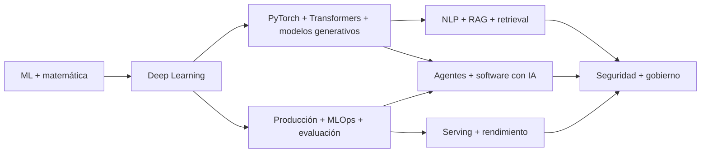

# AI Engineering — mapa maestro de incorporación

> **Estado:** selección DeepLearning.AI y línea base industrial cerradas; preflight transversal de seguridad agentiva y aprendizaje multi-cliente completado el 2026-08-22. Código/prácticas externas fijadas complementan sin reatribuir la enseñanza.
> **Objetivo:** convertir los programas de DeepLearning.AI en una biblioteca mínima, trazable y operativa para estudiar, diseñar, programar, revisar y mantener sistemas reales con agentes Codex.

## Cómo usar este índice

Para historial y entrenamiento de modelos en proyectos consumidores: aplicar primero `markdown_system/PROJECT_HISTORY_MODEL_TRAINING_CONTRACT.md` (clarificación V366). NEW inicia sin historial; EXISTING lo inventaría en su propio ámbito. El objetivo es entrenar/adaptar un modelo elegido por proyecto, con dataset privado, evaluación independiente y promoción explícita; memoria/RAG/evals no lo sustituyen. No solicitar corpus real para preparar esta biblioteca ni incorporar datos/modelos privados a su distribución. Código y modelo requieren admisión; el contrato no es un pipeline implementado. V288 queda como investigación histórica; T2805/T2807 conservan la ejecución pendiente.

1. Leer este archivo para elegir el documento necesario.
2. Cargar solamente ese documento y, si corresponde, el núcleo de Deep Learning.
3. No cargar toda la biblioteca por defecto: aumenta tokens, mezcla niveles y empeora decisiones.
4. En cada documento, distinguir siempre enseñanza de la fuente, traducción de ingeniería y extensión externa.

Para ejecución de herramientas OpenAI en proyectos Go, consultar `implementation_packs/GO_OPENAI_RESPONSES_TOOL_ADAPTER.md`, `implementation_packs/GO_CONNECTED_CONVERSATION_RUNTIME.md`, `implementation_packs/GO_PG_CONTACT_CHANNEL_IDENTITY.md` y `implementation_packs/GO_PG_OUTBOUND_DELIVERY_FENCE.md`: Responses valida tools server-side; el runtime añade autorización/presupuesto/replay/handoff; identidad resuelve el lead sin usar texto; outbound bloquea reenvío tras un efecto incierto. Sus PASS locales no sustituyen proveedor/IdP/evals/receipts/target productivos.

## Convención global

- **[NG]** Paráfrasis fiel de Andrew Ng o de contenido oficial del programa indicado; no es una cita literal.
- **[DLAI]** Paráfrasis fiel de otro instructor o socio oficial de DeepLearning.AI.
- **[IMPL]** Conversión operativa de la enseñanza a diseño, código, pruebas, métricas o procesos.
- **[EXT]** Conocimiento externo al curso. Nunca atribuirlo a Andrew Ng ni a DeepLearning.AI.
- **[PENDIENTE]** Tema identificado pero todavía no verificado contra su fuente primaria.
- **[CODE]**, **[SPEC]**, **[ACADEMIC]**, **[PROD]** y **[MEASURED]**: evidencia externa trazable según `ENGINEERING_EXECUTION_PLAYBOOK.md`; indican respectivamente código inspeccionable, especificación, publicación académica, práctica declarada de producción y resultado medido bajo un ambiente concreto.

## Mapa documental mínimo

| Documento maestro | Pregunta que resuelve | Fuentes principales | Estado |
|---|---|---|---|
| `DEEP_LEARNING_ANDREW_NG.md` | ¿Cómo construir, entrenar y diagnosticar redes neuronales? | Deep Learning Specialization | completo |
| `ML_PRODUCTION_LLMOPS_EVALUATION.md` | ¿Cómo convertir un modelo en un sistema confiable y mejorarlo con datos reales? | Machine Learning in Production; cobertura transversal de LLMOps/evaluación enlazada | completo y auditado |
| `AGENTIC_AI_SOFTWARE_ENGINEERING_CODEX.md` | ¿Cómo construir agentes, herramientas, memoria, evaluaciones y flujos de programación? | Agentic AI; Generative AI for Software Development; suplementos | ambas fuentes completas, reconciliadas y auditadas |
| `PYTORCH_TRANSFORMERS_GENERATIVE_MODELS.md` | ¿Cómo implementar y desplegar modelos modernos? | PyTorch for Deep Learning; Transformers in Practice; GenAI with LLMs; Fine-tuning & RL | cinco fuentes curriculares completas y auditadas |
| `MACHINE_LEARNING_SPECIALIZATION_AND_MATH_FOUNDATIONS.md` | ¿Qué modelo clásico o fundamento matemático corresponde y por qué? | Machine Learning Specialization; Mathematics for ML & DS | ambas especializaciones completas y auditadas |
| `NLP_RAG_RETRIEVAL_DATA.md` | ¿Cómo representar, recuperar, evaluar y usar conocimiento textual? | NLP Specialization; Retrieval Augmented Generation | ambas fuentes completas y auditadas; primera capa industrial Faiss/DiskANN incorporada |
| `AI_INFERENCE_PERFORMANCE_HARDWARE.md` | ¿Cómo servir modelos con restricciones de memoria, costo y latencia? | vLLM; SGLang; cuantización; on-device; hardware; JAX | selección DLAI completa y auditada |
| `AI_SECURITY_GOVERNANCE_PRIVACY.md` | ¿Cómo limitar riesgos, accesos y comportamientos de sistemas de IA? | red teaming; guardrails; agent governance; federated learning; NIST/OWASP agent security 2026 | selección DLAI completa, auditada y actualizada |

## Orden de incorporación, uno por uno

El orden prioriza impacto profesional inmediato, dependencia conceptual y reducción de duplicados.

| Paso | Curso o conjunto | Documento receptor | Resultado exigido |
|---:|---|---|---|
| 0 | Deep Learning Specialization | `DEEP_LEARNING_ANDREW_NG.md` | núcleo DL existente |
| 1 | Machine Learning in Production | `ML_PRODUCTION_LLMOPS_EVALUATION.md` | ciclo completo, error analysis, datos, despliegue y monitoreo |
| 2 | Agentic AI | `AGENTIC_AI_SOFTWARE_ENGINEERING_CODEX.md` | patrones agentivos independientes de framework |
| 3 | PyTorch for Deep Learning | `PYTORCH_TRANSFORMERS_GENERATIVE_MODELS.md` | implementación, depuración, exportación y deployment modernos |
| 4 | Machine Learning Specialization | `MACHINE_LEARNING_SPECIALIZATION_AND_MATH_FOUNDATIONS.md` | ML clásico, recomendadores, anomalías y RL básico |
| 5 | Mathematics for ML and Data Science | `MACHINE_LEARNING_SPECIALIZATION_AND_MATH_FOUNDATIONS.md` | álgebra, cálculo, probabilidad y estadística operativas |
| 6 | Transformers in Practice | `PYTORCH_TRANSFORMERS_GENERATIVE_MODELS.md` | comportamiento interno y eficiencia de Transformers |
| 7 | Generative AI with Large Language Models | `PYTORCH_TRANSFORMERS_GENERATIVE_MODELS.md` | ciclo de vida de LLM |
| 8 | Fine-tuning & RL for LLMs | `PYTORCH_TRANSFORMERS_GENERATIVE_MODELS.md` | post-training y alineación |
| 9 | Natural Language Processing Specialization | `NLP_RAG_RETRIEVAL_DATA.md` | NLP clásico y moderno, secuencias y atención |
| 10 | Retrieval Augmented Generation | `NLP_RAG_RETRIEVAL_DATA.md` | arquitectura RAG, evaluación y producción |
| 11 | Generative AI for Software Development | `AGENTIC_AI_SOFTWARE_ENGINEERING_CODEX.md` | programación, pruebas y diseño asistidos por IA |
| 12 | Cursos cortos seleccionados | documento correspondiente | actualizar huecos sin crear documentos redundantes |

**Avance actual:** pasos 0 a 12 completos y auditados. La selección DeepLearning.AI queda cerrada con 1.186 videolecciones inventariadas en ocho manuales. La fase externa posee trece núcleos generales auditados y se enruta desde `SYSTEMS_ENGINEERING_MASTER_MAP.md` sin atribuir ese conocimiento a DeepLearning.AI. `ENGINEERING_EXECUTION_PLAYBOOK.md` aporta el contrato ejecutable; implementaciones concretas conservan sus propios gates y evidencia.

## Auditoría transversal global — 2026-08-21

### Alcance comprobado

| Documento | Fuente base incorporada | Unidad curricular | Estado transversal |
|---|---|---:|---|
| `DEEP_LEARNING_ANDREW_NG.md` | Deep Learning Specialization | 5 cursos, 17 módulos, 194 videos | completo |
| `ML_PRODUCTION_LLMOPS_EVALUATION.md` | Machine Learning in Production | 3 semanas, 41 videos | curso base completo |
| `AGENTIC_AI_SOFTWARE_ENGINEERING_CODEX.md` | Agentic AI | 5 módulos, 31 videos | curso base completo |
| `AGENTIC_AI_SOFTWARE_ENGINEERING_CODEX.md` | Generative AI for Software Development | 3 cursos, 9 módulos, 144 unidades, 80 videos | completo y auditado; 8 ejemplos de código y 34 lecturas inventariados, 22 evaluaciones excluidas |
| `PYTORCH_TRANSFORMERS_GENERATIVE_MODELS.md` | PyTorch for Deep Learning | 3 cursos, 12 módulos, 77 videos | curso base completo |
| `PYTORCH_TRANSFORMERS_GENERATIVE_MODELS.md` | Transformers in Practice | 3 módulos, 19 videos | completo y auditado; 18 transcripciones técnicas |
| `PYTORCH_TRANSFORMERS_GENERATIVE_MODELS.md` | Generative AI with Large Language Models | 3 semanas, 69 unidades, 47 videos | completo y auditado; 3 prácticas públicas y 3 evaluaciones excluidas |
| `PYTORCH_TRANSFORMERS_GENERATIVE_MODELS.md` | Finetuning Large Language Models | 9 videos, 6 ejemplos de código | completo y auditado; 1 evaluación excluida |
| `PYTORCH_TRANSFORMERS_GENERATIVE_MODELS.md` | Reinforcement Learning From Human Feedback | 6 videos, 4 ejemplos de código | completo y auditado; 1 evaluación excluida |
| `MACHINE_LEARNING_SPECIALIZATION_AND_MATH_FOUNDATIONS.md` | Machine Learning Specialization | 3 cursos, 10 semanas, 151 videos | completo y auditado |
| `MACHINE_LEARNING_SPECIALIZATION_AND_MATH_FOUNDATIONS.md` | Mathematics for ML and Data Science | 3 cursos, 11 semanas, 219 videos | completo y auditado; 190 transcripciones técnicas directas |
| `NLP_RAG_RETRIEVAL_DATA.md` | Natural Language Processing Specialization | 4 cursos, 14 semanas, 412 unidades, 176 videos | completa y auditada; 38 ejemplos de código inventariados y 20 evaluaciones excluidas |
| `NLP_RAG_RETRIEVAL_DATA.md` | Retrieval Augmented Generation (RAG) | 5 módulos, 77 unidades, 49 videos | completo y auditado; 9 ejemplos de código y 10 evaluaciones excluidas |
| `AI_INFERENCE_PERFORMANCE_HARDWARE.md` | Fast & Efficient LLM Inference with vLLM | 9 videos, 3 ejemplos de código | completo y auditado; 1 evaluación excluida |
| `AI_INFERENCE_PERFORMANCE_HARDWARE.md` | Efficient Inference with SGLang: Text and Image Generation | 7 videos, 3 ejemplos de código | completo y auditado; 1 evaluación excluida |
| `AI_INFERENCE_PERFORMANCE_HARDWARE.md` | Quantization in Depth | 18 videos, 13 ejemplos de código | completo y auditado; 1 evaluación excluida |
| `AI_INFERENCE_PERFORMANCE_HARDWARE.md` | Introduction to on-device AI | 7 videos, 4 ejemplos de código | completo y auditado; 1 evaluación excluida |
| `AI_INFERENCE_PERFORMANCE_HARDWARE.md` | Build and Train an LLM with JAX | 7 videos, 4 ejemplos de código | completo y auditado; 1 evaluación excluida |
| `AI_SECURITY_GOVERNANCE_PRIVACY.md` | Red Teaming LLM Applications | 7 videos, 5 ejemplos de código | completo y auditado; 1 evaluación excluida |
| `AI_SECURITY_GOVERNANCE_PRIVACY.md` | Safe and Reliable AI via Guardrails | 10 videos, 7 ejemplos de código | completo y auditado; 1 evaluación excluida |
| `AI_SECURITY_GOVERNANCE_PRIVACY.md` | Governing AI Agents | 9 videos | completo y auditado; 1 evaluación excluida |
| `AI_SECURITY_GOVERNANCE_PRIVACY.md` | Intro to Federated Learning | 7 videos, 5 ejemplos de código | completo y auditado; 1 evaluación excluida |
| `AI_SECURITY_GOVERNANCE_PRIVACY.md` | Federated Fine-tuning of LLMs with Private Data | 6 videos, 3 ejemplos de código | completo y auditado; 1 evaluación excluida |

Total consolidado: **1.186 videolecciones inventariadas** en ocho documentos operativos. El total es la suma de las 23 filas curriculares anteriores; las unidades sin transcripción utilizable y las exclusiones se declaran dentro de cada archivo y no se presentan como evidencia literal.

### Autoridad por tema

| Si la pregunta principal es… | Documento autoridad | Los demás documentos aportan… |
|---|---|---|
| arquitectura, matemática, optimización, bias/variance, CNN o secuencias | `DEEP_LEARNING_ANDREW_NG.md` | implementación y operación |
| scoping, datos, error analysis, deployment, drift o monitoreo | `ML_PRODUCTION_LLMOPS_EVALUATION.md` | modelo y orquestación |
| reflexión, tools, MCP, planificación, multiagentes o evals agentivas | `AGENTIC_AI_SOFTWARE_ENGINEERING_CODEX.md` | modelo base y producción |
| tensores, `Dataset`/`DataLoader`, training loop, profiling, ONNX o compresión | `PYTORCH_TRANSFORMERS_GENERATIVE_MODELS.md` | teoría y ciclo de producto |
| lifecycle LLM, prompting, pretraining, SFT/PEFT, RLHF o aplicación del modelo | `PYTORCH_TRANSFORMERS_GENERATIVE_MODELS.md` | producción, agentes y evaluación transversal |
| regresión, clasificación clásica, árboles, clustering, anomalías, recomendadores o RL introductorio | `MACHINE_LEARNING_SPECIALIZATION_AND_MATH_FOUNDATIONS.md` | deep learning, implementación y producción |
| álgebra lineal, cálculo, probabilidad, estimación o inferencia para ML | `MACHINE_LEARNING_SPECIALIZATION_AND_MATH_FOUNDATIONS.md` | aplicación en modelos y operación |
| NLP clásico, secuencias, traducción, summarization, QA o búsqueda textual | `NLP_RAG_RETRIEVAL_DATA.md` | Deep Learning para fundamentos; PyTorch/Transformers para implementación moderna |
| TTFT/ITL, KV cache, cuantización, serving, deployment on-device, CPU/GPU/NPU o benchmark de hardware | `AI_INFERENCE_PERFORMANCE_HARDWARE.md` | PyTorch/Transformers para arquitectura; ML Production para ciclo desplegado |
| prompt injection, guardrails, identidad, permisos, gobierno, PII, red teaming o privacidad federada | `AI_SECURITY_GOVERNANCE_PRIVACY.md` | Agentes para workflow; Producción para ciclo operativo; NLP/RAG para retrieval |

### Resolución de solapamientos

| Aparente tensión | Resolución consistente |
|---|---|
| Agentic AI recomienda priorizar calidad antes que costo; producción exige límites | durante exploración se optimiza primero utilidad, pero nunca se opera sin presupuestos; antes de producción costo, latencia y seguridad son gates |
| prototipo rápido frente a ingeniería responsable | prototipo mínimo, aislado y sin fuga de datos; despliegue solamente después de evaluación, auditoría y rollback |
| DLS explica algoritmos; PyTorch ofrece abstracciones | usar DLS para razonar y PyTorch para ejecutar, conservando contratos de shapes, loss, gradientes y métricas |
| DLS y Machine Learning Specialization comparten redes, bias/variance y error analysis | Machine Learning Specialization gobierna fundamentos y selección clásica; DLS gobierna redes profundas; ML Production gobierna el ciclo desplegado |
| evals agentivas frente a evaluación ML | las primeras miden trayectorias, tools y artefactos; la segunda mide datos/modelo/producto; ambas comparten datasets versionados y error analysis |
| modelos/LLM frente a order book atómico | IA queda fuera del hot path determinista; sistemas, redes y microestructura gobiernan esa ruta y el ML sólo consume snapshots/features fuera del path crítico salvo evidencia contraria |
| preprocesamiento NLP agresivo frente a modelos contextuales | preservar señal por defecto y eliminarla sólo tras una ablación; normalización/tokenizer forman parte del modelo versionado |
| métricas automáticas de lenguaje frente a calidad real | perplexity/BLEU/ROUGE/EM son componentes, no veredictos; añadir evidencia, slices, calibración y revisión humana según riesgo |
| tests generados frente a comportamiento correcto | derivar oráculos de requisitos independientes; un test verde puede codificar el mismo error que la implementación |
| configuración flexible frente a secretos y reproducibilidad | versionar schema y configuración no secreta; resolver secretos externamente, validar y conservar rollback |
| ORM frente a SQL seguro | la seguridad depende de parámetros enlazados y control de estructura; ni Core es inseguro por definición ni ORM protege SQL raw interpolado |
| Singleton de conexión frente a producción concurrente | el patrón pedagógico no reemplaza pooling, lifecycle, transacciones ni dependency injection; medir el scope real de unicidad |
| modelo cuantizado más pequeño frente a serving más rápido | verificar kernels y hardware; menos bytes no garantizan menor latencia ni mayor goodput |
| dtype de almacenamiento frente a dtype de cómputo | declarar ambos y el acumulador; packing o pesos INT8 no demuestran que el matmul se ejecute en baja precisión |
| granularidad fina frente a compresión nominal | sumar escalas, zero-points, padding y capas excluidas; comparar bytes del artefacto y HBM pico reales |
| on-device frente a privacidad garantizada | procesar localmente reduce egress, pero permisos, logs, analytics, backups, outputs y dispositivo comprometido siguen en el threat model |
| latencia del modelo frente a FPS de la aplicación | presupuestar captura, pre/postproceso, copies, cola, inferencia y render; medir ejecución sostenida y frame age |
| PSNR alto frente a calidad equivalente | PSNR sólo mide semejanza numérica apropiada para ciertas salidas; exigir además métricas de tarea, slices y decisiones finales |
| scanner/guardrail frente a sistema seguro | son controles parciales con falsos positivos/negativos; autorización determinista, threat model, red team y respuesta a incidentes siguen siendo obligatorios |
| identidad del agente frente a autorización | autenticar service principal o usuario no concede permiso universal; autorizar cada tool, recurso, tenant y acción con least privilege |
| más clientes frente a mejor aprendizaje | amplían cobertura potencial, no permiso ni calidad automática; separar telemetría, evidencia, evals y entrenamiento con provenance, tenant isolation, poisoning/leakage gates y promoción reversible |
| federated learning frente a privacidad | mantener datos locales reduce centralización, pero updates pueden filtrar; declarar threat model, secure aggregation/DP y accounting `(ε,δ)` |
| perplexity baja frente a membership | es señal de predictibilidad, no prueba de pertenencia; calibrar ataques con miembros/no-miembros y métricas ROC independientes |
| perplexity/benchmark público frente a calidad del producto | usarlos como evidencia parcial; exigir evals del dominio, slices, seguridad e incertidumbre |
| logprobs frente a confianza | son probabilidades internas de tokens, no probabilidad calibrada de corrección; calibrar antes de decidir riesgo |
| KV cache frente a complejidad lineal | evita reproyectar K/V antiguos, pero cada query aún atiende al historial; separar proyecciones, score work, bytes y latencia |
| cache exacta de texto frente a cache de difusión | KV/prefix reuse preserva la computación prevista; reutilizar predicciones de denoising es aproximado y exige gates perceptuales |
| algoritmo matemáticamente correcto frente a pipeline de IA correcto | probar la rutina y su complejidad no valida datos, objetivo, calidad ni producto; combinar oráculos/invariantes con evals del modelo y error analysis |
| arquitectura genérica frente a lifecycle de IA | arquitectura gobierna boundaries, qualities y operación; manuales de IA gobiernan datos/modelo/evals. Model registry, RAG, agent o feature pipeline no se eligen sin ambos contratos |
| data pipeline verde frente a dataset/modelo válido | job success y schema checks no prueban representatividad, leakage, labels ni calidad de decisión; Data Engineering gobierna provenance/time/quality y manuales IA gobiernan slices/evals/model behavior |
| modelo reproducible frente a artefacto desplegable reproducible | seed/checkpoint/dataset no fijan compiler, CUDA, native extensions, package y target; Toolchains gobierna build/ABI/provenance y manual IA gobierna equivalencia/calidad |
| inferencia on-device frente a producto nativo correcto | accuracy/latencia del modelo no prueban startup, frame budget, battery, thermal, permission, lifecycle ni update; Nativo gobierna app/device y manual IA conserva model/data/eval contract |

### Resultado

- No se detectaron contradicciones técnicas materiales entre los ocho manuales operativos. Las aparentes tensiones de nivel pedagógico quedaron resueltas mediante supuestos y correcciones explícitas.
- Procedencia `[NG]`, `[DLAI]`, `[IMPL]` y `[EXT]` permanece separada.
- Los bloques Markdown están balanceados y no se detectó mojibake ni caracteres de reemplazo.
- Las referencias a los ocho documentos operativos corresponden a archivos existentes; no queda ningún receptor DLAI inexistente.
- Las secciones declaradas como ampliación futura son alcance planificado, no huecos ocultos en los cursos marcados como base completa.
- La selección DeepLearning.AI queda cerrada: las fuentes de inferencia/JAX y las cinco fuentes de seguridad–gobernanza–privacidad fueron reconciliadas sin duplicar fundamentos. Los temas externos de sistemas, hardware profundo, ciberseguridad y producto permanecen separados por autoridad, pero su núcleo v1 ya está disponible en el mapa de sistemas.

### Capa de práctica industrial pública

La teoría DLAI no se reescribe ni se atribuye a empresas. Los deltas implementados se integran en el documento autoridad, marcados `[CODE]`, con commit/licencia/límites. Primera revisión fijada:

| Fuente | Revisión/licencia observada | Delta incorporado | Receptor autoridad | Límite explícito |
|---|---|---|---|---|
| `xai-org/x-algorithm` | `28e414f535e4b5a50ca12ee87674e7649e50c7ad`, Apache-2.0 | funnel For You, Phoenix retrieval/ranking, semantic IDs, candidate isolation, sequence packing, multiacción, visibility | Machine Learning + ML Production + Inference | no publica feeds/checkpoints/telemetría/orquestación productiva completa |
| `xai-org/grok-1` | `7050ed204b8206bb8645c7b7bbef7252f79561b0`, Apache-2.0 | MoE top-k, JAX, sharding y cuantización como oracle de inferencia | PyTorch/Transformers + Inference | sin training stack, servidor o prueba de eficiencia; MoE publicado es deliberadamente sencillo |
| `xai-org/grok-build` | `19d42e35c07a9c9244f03f6df0c4c353f970d4f9`, Apache-2.0 para código propio + avisos de terceros | runtime agentivo, definición, tools, sesiones, compaction, subagentes, permisos y sandbox | Agentic AI + AI Security | export parcial de monorepo; no revela entrenamiento ni toda la plataforma interna |
| `xai-org/xai-proto` | `723dd2aa22d17be35617463837dc47cda008d90e`, Apache-2.0 | contrato protobuf público | Backend/API | no demuestra internals del servicio |
| `xai-org/xai-sdk-python` | `4dab6a449736890a70d20bc886221a4219ff6ae7`, Apache-2.0 | SDK gRPC sync/async, streaming, deadlines/retries y telemetría | Backend/API + Agentic AI | wrapper cliente, no arquitectura del backend |
| `xai-org/grok-prompts` | `a7c186f5ccac95875c0041aed60398f6ecb6d6c7`, AGPL-3.0 | prompts/configuración pública | sólo referencia de producto/política | no es algoritmo, modelo ni training recipe; no se reproduce en el corpus |
| `xai-org/xai-cookbook` | `01d842179c4c41c326bd8ce8aa65edce9c9c231d`, licencia Beta Testing observada | ejemplos de API | referencia condicionada | no usar como código reusable sin revisar términos aplicables |

Repositorios auxiliares `grok-build-plugin-cc` y `plugin-marketplace` se inventariaron, pero sólo se incorporará un patrón cuando cubra un vacío material; cada plugin conserva sus propios términos. “Publicado por xAI” no significa “escrito personalmente por Elon Musk” ni “stack interno completo”.

Retrieval ya suma dos implementaciones líderes fijadas por revisión: Faiss/Meta `7059eaf7da7eddda62e71367e684d4bdedd7f94f` y DiskANN/Microsoft `860cf47bc11b6c2b938818773831a9374553d976`, ambas MIT. El delta vive en `NLP_RAG_RETRIEVAL_DATA.md`: exact oracle, familias de índice/compresión, memoria–disco–GPU, updates/filtros y benchmark A/A–A/B. No se trasladaron claims comparativos del README como garantías del producto.

### Perfiles de carga para ahorrar tokens

| Trabajo | Cargar |
|---|---|
| entrenar o depurar una red | Deep Learning + PyTorch |
| llevar un modelo a producción | ML Production + sección de deployment de PyTorch |
| construir un agente de software | Agentic AI + ML Production; PyTorch solo si opera modelos propios |
| visión o NLP aplicado | Deep Learning + sección de dominio de PyTorch |
| arquitectura, sampling, KV cache o serving de Transformers | PyTorch/Transformers + ML Production |
| desplegar, cuantizar o benchmarkear un LLM | AI Inference + ML Production; añadir PyTorch/Transformers para internals del modelo |
| seleccionar, adaptar o alinear un LLM | Parte III de PyTorch/Transformers + ML Production; añadir Agentes si ejecutará tools |
| ML clásico, tabular, anomalías o recomendadores | Machine Learning; añadir ML Production si se desplegará |
| derivar o revisar matemática de un modelo/experimento | sólo Machine Learning + fundamentos matemáticos; añadir el manual de dominio al implementar |
| NLP clásico, tagging, traducción, summarization o QA | NLP/RAG; añadir PyTorch/Transformers para implementación y ML Production al desplegar |
| búsqueda semántica o RAG | NLP/RAG + ML Production para el ciclo organizacional + Seguridad para ACL/injection/PII |
| seguridad, permisos, privacidad o gobierno de IA | Seguridad; añadir Agentes para la trayectoria y ML Production para despliegue/monitoreo |
| producto web con IA | manual de IA del dominio + ML Production + Backend/API + Frontend; añadir Seguridad/SRE/cloud siempre que haya usuarios/datos reales |
| agente con herramientas y side effects | Agentic AI + Backend/API + Seguridad/SRE/cloud; añadir Frontend si existe human approval/control UI |
| plataforma de seguridad/control para agentes | AI Security + Agentic AI + Backend/API + Seguridad/SRE/cloud + Arquitectura; usar `ENGINEERING_EXECUTION_PLAYBOOK.md` para evidencia, release y operación |
| RAG desplegado | NLP/RAG + ML Production + Backend/API + Bases de datos + Seguridad/SRE/cloud; Frontend sólo para experiencia de búsqueda/citas |
| order book de baja latencia | Microestructura + Sistemas/rendimiento + Redes; añadir Backend/Datos/Seguridad según ingestión, control y persistencia; IA fuera del hot path por defecto |
| estructura, algoritmo o problema combinatorio | Algoritmos/estructuras; añadir Sistemas para costo físico y el manual de dominio que define la semántica |
| diseñar o evolucionar un sistema de IA completo | Arquitectura/system design + manual de IA autoridad + ML Production; añadir fronteras físicas/seguridad/producto atravesadas |
| ingestión, lake/warehouse, ETL, lineage, mart o métrica | Data Engineering/Analytics + autoridad de source/storage/stream; añadir manual IA sólo si el consumidor es modelo/RAG/eval |
| empaquetar runtime/model server/native ML extension | Toolchains/builds + Inference/GPU + Seguridad; ML Production conserva rollout/evals y artifact de modelo separado |
| aplicación móvil/escritorio con IA on-device | manual de IA del dominio + Nativo + Toolchains; añadir Inference/GPU si hay acelerador y Seguridad siempre que procese datos sensibles |

Los nombres de sistemas de esta tabla se resuelven en `SYSTEMS_ENGINEERING_MASTER_MAP.md`. Cargar sólo el manual autoridad y las fronteras que realmente cruza el proyecto; no cargar la biblioteca completa “por seguridad”.

## Protocolo obligatorio para incorporar un curso

Cada curso pasa por las mismas puertas:

1. **Inventario:** duración, módulos, lecciones, prácticas, evaluaciones e instructor.
2. **Fuente:** recorrer el contenido público y comprobar transcripciones o notas oficiales disponibles.
3. **Extracción inteligente:** conservar decisiones, técnicas, ecuaciones, ejemplos, advertencias y patrones de error; eliminar saludo, promoción y repetición pedagógica.
4. **Procedencia:** marcar `[NG]`, `[DLAI]`, `[IMPL]`, `[EXT]` o `[PENDIENTE]`.
5. **Integración:** ubicar cada idea en un único documento maestro; enlazar en vez de duplicar.
6. **Operacionalización:** convertir teoría en runbooks, contratos, pruebas, métricas, puertas de salida y criterios de rollback.
7. **Auditoría:** comparar el documento contra el inventario completo y registrar huecos verificables.
8. **Compresión:** retirar redundancias sin perder ninguna decisión que pueda cambiar diseño, diagnóstico o implementación.

## Definición de terminado

Un curso queda `completo` solamente cuando:

- todas sus unidades públicas están inventariadas;
- sus enseñanzas técnicas relevantes están incorporadas;
- las prácticas accesibles están representadas sin reproducir evaluaciones;
- teoría y traducción de ingeniería no se confunden;
- existen procedimientos de diagnóstico y no solo descripciones;
- un agente puede convertir el documento en requisitos, código y pruebas;
- se declaran los límites que el curso no cubre;
- una revisión final no encuentra módulos huérfanos ni afirmaciones atribuidas sin evidencia.

## Relación global

## Frontera y continuación

La biblioteca DeepLearning.AI seleccionada ya quedó completada. La ruta externa de algoritmos, sistemas operativos, concurrencia, C++/Rust, SIMD, CPU/GPU/CUDA, redes, sistemas distribuidos, bases de datos internas, streaming, SRE, ciberseguridad, microestructura de mercados, frontend y aplicaciones nativas también tiene núcleo v1 cerrado y se gobierna desde `SYSTEMS_ENGINEERING_MASTER_MAP.md`.

Para iniciar un producto y combinar conocimiento con implementaciones públicas, usar `CODEX_ELITE_PROJECT_BOOTSTRAP.md`. Todo código externo se filtra mediante `PUBLIC_CODE_ARCHITECTURE_ADMISSION_STANDARD.md`; la existencia de un modelo, agente, SDK o ejemplo público no autoriza su reutilización ni demuestra su arquitectura productiva.

Esos dominios externos no se mezclarán silenciosamente con Andrew Ng: conservan fuentes, etiquetas y documentos propios.

V367: investigación oficial de entrenamiento prioriza TRL/SFT y PEFT opcional como DISCOVERED; torchtune/torchforge fuera de primera línea por mantenimiento, torchtitan diferido por scope/runtime. Identidades/artefactos sólo observados en metadata, no adquiridos/admitidos. RESEARCH_INCOMPLETE/FAIL663; TEST09 sigue bloqueado. Evidencia reconstruction_evidence/HISTORY_TRAINING_SOURCE_RESEARCH_V367.md y training_gap_v367/record.json. No pedir corpus privado para esta preparación de biblioteca.

V367 distribución181: los registros training_gap_v367 se conservan íntegros, con SHA-256, como secciones del reporte HISTORY_TRAINING_SOURCE_RESEARCH_V367.md; materializarlos sólo en raíz aislada de investigación. No son nuevos archivos sueltos del release ni un pack admitido.

V373: opt-in HISTORY-MODEL-TRAINING-PIPELINE0.1.0/17files, HISTORY_MODEL_TRAINING_PACK_PLAN2packs/21files;26policy tests and actual earlier synthetic SFT/evaluation/rollback. Final exact reconstruction/bootstrap/E2E and TEST09 decision are recorded in reconstruction_evidence/HISTORY_MODEL_TRAINING_CONTROL_V373.md. NEW requires no history; EXISTING keeps data/model private with its own authority/quality/runtime gates. No automatic training, provider call or deployment. SDK component selection precedes AUTHORED glue; see HISTORY_TRAINING_SDK_QUALIFICATION_V373.md and HISTORY_TRAINING_SDK_GAP_V373.md. Integral franchise remains67/754.

V400: encuestas conectadas con PostgreSQL/OIDC/Next, recuperación GET,4navegadores/8respuestas/8POST y retención CLI1/1/0.23archivos nuevos AUTHORED, packs GO-CUSTOMER-SURVEY-API0.1.0 y TS-CUSTOMER-SURVEY-PORTAL0.1.0, CONDITIONED.45/48sin promoción; TEST02/03/07 siguen abiertos. Ver reconstruction_evidence/CONNECTED_CUSTOMER_SURVEYS_V400.md.
