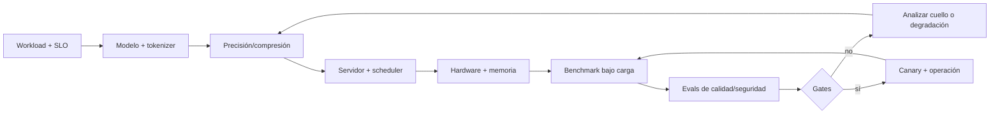

# AI Inference, Performance & Hardware — manual operativo para Codex

> **Estado:** fuentes DeepLearning.AI de inferencia, cuantización, edge y JAX completas, reconciliadas y auditadas.
> **Fuentes primarias:** Cedric Clyburn/Red Hat; Richard Chen/RadixArk y LMSys; Marc Sun y Younes Belkada/Hugging Face; Krishna Sridhar/Qualcomm; Chris Achard/Google; cursos de DeepLearning.AI.
> **Cobertura:** 48 videolecciones, 27 ejemplos de código y 5 quizzes certificables excluidos.
> **Propósito:** seleccionar, optimizar, desplegar y medir inferencia de modelos con contratos explícitos de calidad, latencia, throughput, memoria y costo.

## Cómo usar este documento

1. Definir workload y SLO antes de elegir modelo, precisión, hardware o servidor.
2. Estimar pesos, KV cache y memoria de runtime con **Modelo de capacidad**.
3. Obtener baseline sin compresión y aplicar **Optimización del modelo** solo con evals independientes.
4. Diseñar serving mediante **Scheduler, PagedAttention y prefix caching**.
5. Ejecutar **Benchmark reproducible** con carga representativa y percentiles.
6. Promover únicamente si supera los gates de calidad, rendimiento, seguridad y costo.
7. Para encargar la implementación a Codex, usar el **Contrato de inferencia**.

## Procedencia y límites

- **[DLAI]** síntesis fiel del curso de Cedric Clyburn/DeepLearning.AI; no implica transcripción literal.
- **[IMPL]** conversión de la enseñanza en contratos, pruebas, runbooks y decisiones implementables.
- **[EXT]** ampliación profesional no atribuida al curso.
- Los ejemplos se representan por su patrón; no se copian notebooks ni se abre/resuelve el quiz.
- Versiones, flags, modelos, kernels, rutas API y soporte de hardware cambian. Verificar siempre documentación primaria de la versión desplegada.
- Este manual trata inferencia de modelos. No convierte un LLM en componente apto para el hot path determinista de un order book.

## 1. Modelo mental de inferencia



**[DLAI]** El sistema debe equilibrar calidad, performance y costo. Optimizar solo una dimensión puede volver inútil el despliegue: un modelo rápido pero incorrecto, preciso pero fuera del SLO o barato pero inestable no está listo.

**[IMPL]** La unidad de decisión no es “el modelo”, sino una configuración completa:

```text
model revision + tokenizer + chat template + precision/quantization
+ engine/version/flags + kernels + hardware/topology
+ prompt/output distribution + concurrency/arrival process
+ quality dataset + SLO + cost window
```

Cambiar cualquier elemento invalida comparaciones no controladas.

## 2. Workload y SLO primero

Ficha obligatoria:

```yaml
inference_workload:
  use_case: "chat | RAG | code | extraction | batch | agent"
  model_revision: "immutable id"
  prompt_tokens: {p50: 0, p95: 0, p99: 0, max: 0}
  output_tokens: {p50: 0, p95: 0, p99: 0, max: 0}
  arrival: "constant | poisson | trace replay | burst"
  request_rate: {steady_rps: 0, peak_rps: 0}
  concurrency: {steady: 0, peak: 0}
  streaming: true
  shared_prefix_rate: 0.0
  tenants: 0
  quality_slices: ["dominio", "idioma", "longitud", "riesgo"]
  slo:
    ttft_p99_ms: 0
    itl_p99_ms: 0
    e2e_p99_ms: 0
    min_output_tok_s: 0
    max_error_rate: 0.0
    min_quality: 0.0
    max_cost_per_useful_request: 0.0
```

Métricas:

- **TTFT:** desde recepción hasta primer token; incluye cola y prefill.
- **ITL/TPOT:** tiempo entre tokens posteriores; refleja fluidez de decode.
- **E2E:** tiempo total de la petición.
- **Throughput:** requests/s y tokens/s; separar input, output y total.
- **Queue time:** saturación/admission control, no capacidad del modelo.
- **Goodput:** trabajo que cumple simultáneamente SLO y calidad.

**[DLAI]** Reportar p50, p95 y p99: el promedio oculta usuarios lentos. Los umbrales del curso son ejemplos pedagógicos, no estándares universales.

## 3. Inferencia y jerarquía de memoria

**[DLAI]** La generación autoregresiva procesa el prompt y produce luego un token por paso. Los pesos permanecen en memoria; las claves y valores de atención se guardan en KV cache para evitar recomputar el historial en cada capa.

Fases:

| Fase | Trabajo dominante | Métrica crítica |
|---|---|---|
| carga | leer pesos, inicializar runtime/kernels | startup/readiness |
| prefill | procesar tokens de entrada en paralelo | TTFT, input tok/s |
| decode | generar token a token y leer pesos/KV repetidamente | ITL, output tok/s |
| scheduling | mezclar admisiones, prefill y decode | queue time, goodput, fairness |

**[EXT]** Prefill suele ser más compute-bound y decode más memory-bandwidth-bound, pero medir el modelo, batch y hardware reales; no asumirlo como ley absoluta.

### Modelo de capacidad

Pesos aproximados:

```text
M_weights ≈ parameters × bits_per_weight / 8
```

KV cache aproximada por token y secuencia:

```text
M_KV/token ≈ 2 × layers × kv_heads × head_dim × bytes_per_KV_element
M_KV/request ≈ M_KV/token × (prompt_tokens + generated_tokens)
```

Capacidad útil:

```text
M_available = HBM_total × utilization_target
              - weights - runtime_workspace - graphs - allocator_reserve

active_token_capacity ≈ M_available / M_KV_per_token
```

**[DLAI]** Los pesos son costo fijo; KV cache crece con tokens activos y concurrencia. **[IMPL]** No dimensionar usando solo esos dos términos: runtime, activaciones temporales, kernels, CUDA graphs, fragmentación, comunicación y margen ante picos también consumen memoria.

Registrar:

- GPU, arquitectura, HBM, bandwidth y topology/interconnect;
- driver, runtime, kernel y engine versions;
- tensor/data/pipeline parallelism;
- dtype de pesos, activaciones y KV cache;
- max model length, utilization target y block size;
- memoria idle, warm y en pico; OOM/recompute/preemption.

## 4. Optimización del modelo

### Cuantización

**[DLAI]** Cuantizar reduce bits de pesos y, en algunos esquemas, activaciones. Menos bytes pueden reducir HBM, tráfico de memoria y cantidad de GPUs; acelerar compute exige kernels y aceleradores compatibles.

| Esquema | Efecto principal | Riesgo |
|---|---|---|
| W8A16/W4A16 | pesos menores; activaciones altas | dequant overhead, calidad a pocos bits |
| W8A8/FP8 | pesos y compute en menor precisión | hardware/kernel/model support |
| sparsity estructurada | omitir pesos según patrón soportado | speedup nulo sin kernel/hardware adecuado |

**[DLAI]** El curso presenta round-to-nearest como baseline y calibración mediante AWQ/GPTQ; usa LLM Compressor para una receta W4A16 sobre capas lineales, preservando componentes sensibles.

Procedimiento:

1. Fijar modelo, tokenizer y baseline de calidad/rendimiento.
2. Elegir esquema compatible con hardware, engine y modelo.
3. Seleccionar calibración representativa del tráfico, sin contaminar el conjunto de evaluación.
4. Cuantizar y guardar receta, tool version, revision y hashes.
5. Verificar tamaño real; no inferirlo solo de la relación de bits.
6. Ejecutar perplexity como smoke signal y evals del caso de uso.
7. Benchmarkear en el hardware objetivo; “más pequeño” no implica “más rápido”.
8. Comparar costo por resultado útil y conservar rollback al baseline.

**[IMPL]** La calidad no queda demostrada por una salida visual, perplexity ni recuperación promedio de benchmarks. Evaluar tareas, slices, seguridad, formato, calibración y casos adversariales. Una mejora pequeña en un benchmark puede ser ruido; reportar incertidumbre y protocolo.

### Registro de experimento

```yaml
compression_run:
  base_model: "repo@revision"
  recipe: "algorithm + scheme + exclusions"
  calibration: "dataset@version, slices, samples, seq_len"
  artifacts: ["hashes", "size_bytes", "format"]
  quality_delta: {primary: 0.0, worst_slice: 0.0}
  performance_delta: {ttft_p99: 0.0, itl_p99: 0.0, goodput: 0.0}
  cost_delta: 0.0
  decision: "reject | experiment | canary | promote"
```

## 5. Serving eficiente

### Continuous batching

**[DLAI]** Un batch estático espera al request más largo y deja slots ociosos. Continuous batching reprograma trabajo a nivel de iteración/token: cuando termina una secuencia, otra puede ocupar capacidad sin esperar al batch completo.

Trade-offs:

- batches mayores elevan utilización/throughput pero pueden empeorar TTFT/colas;
- requests largos pueden afectar fairness;
- límites de tokens son más informativos que contar solo requests;
- admission control y backpressure deben impedir OOM y colapso de cola;
- prioridades requieren política explícita y tests de starvation.

### PagedAttention

**[DLAI]** PagedAttention divide KV cache en bloques no contiguos y usa una tabla para mapear bloques lógicos de cada secuencia a memoria física. Reduce preasignación y fragmentación, habilitando más secuencias activas.

**[IMPL]** No afirmar “cero desperdicio”: el último bloque puede quedar parcialmente vacío y existen metadata, copy-on-write y overhead de scheduling. Medir utilización, preemptions y recomputación con la versión real.

### Prefix caching

**[DLAI]** Requests con prefijos tokenizados idénticos pueden reutilizar KV ya calculada; beneficia system prompts extensos, few-shot, contexto RAG repetido y conversaciones con historia común.

Gate de uso:

- medir hit rate y tokens realmente reutilizados;
- incluir modelo, tokenizer, adapters y parámetros relevantes en la identidad del cache;
- impedir reutilización indebida entre tenants o contextos sensibles;
- invalidar al cambiar plantilla, revisión o permisos;
- comparar ahorro con memoria retenida y churn;
- generar benchmarks sin repeticiones accidentales cuando se mide baseline.

### API compatible y observabilidad

**[DLAI]** vLLM puede exponer una API compatible con OpenAI y métricas Prometheus de requests, cola, tokens y uso de KV cache.

**[IMPL]** “Compatible” no significa equivalencia completa de rutas, schemas, errores, streaming, sampling ni embeddings para todo modelo. Mantener contract tests por versión.

Métricas mínimas:

```text
request rate + success/error/cancel
queue/running/preempted requests
prompt/generation tokens
TTFT + ITL/TPOT + E2E distributions
KV/cache utilization + prefix hit tokens
GPU HBM/utilization/power/temperature
OOM + retries + restarts + model load/readiness
```

**[IMPL]** Logprobs son probabilidades normalizadas del modelo bajo una decodificación, no “confianza” epistemológica ni probabilidad de que una respuesta sea correcta. Calibrar contra etiquetas del dominio antes de usarlas para abstención o riesgo.

## 6. Benchmark y evaluación

**[DLAI]** El curso usa GuideLLM para carga y `lm-eval` para calidad. La secuencia correcta es definir SLO, medir baseline, estresar con tráfico realista y evaluar el modelo optimizado en tareas relevantes.

### Perfiles de tráfico

| Perfil | Qué aísla |
|---|---|
| synchronous | latencia sin concurrencia/cola |
| fixed concurrency | comportamiento con streams paralelos |
| constant rate | carga estable y capacidad |
| Poisson | llegadas independientes con variación |
| sweep | curva completa hasta saturación |
| trace replay `[EXT]` | bursts, longitudes y correlaciones reales |

Manifest obligatorio:

```yaml
benchmark:
  timestamp: "UTC"
  model_stack: "model/tokenizer/precision/engine revisions"
  hardware: "GPU count/type/topology, CPU, RAM, storage"
  software: "driver/runtime/kernel/container"
  server_flags: {}
  warmup: "requests/tokens/time"
  traffic: "profile, rate, concurrency, duration"
  prompts: "dataset/version/token distributions/prefix reuse"
  outputs: "token distribution/stop rules/streaming"
  measurements: ["TTFT", "ITL", "E2E", "goodput", "errors", "cost"]
  raw_artifacts: ["JSON", "CSV", "metrics", "logs"]
```

Reglas:

1. Generador de carga fuera del cuello de botella medido.
2. Warm-up explícito; separar cold start y steady state.
3. Duración y muestras suficientes para p99 e intervalos de confianza.
4. Medir achieved load, no solo offered load; incluir errores/timeouts.
5. Fijar longitudes reales; una pareja 32/16 tokens no representa RAG o agentes.
6. Evitar cache hits accidentales o declararlos como escenario separado.
7. Buscar el knee donde cola y tail latency crecen de forma no lineal.
8. Repetir corridas y comparar misma máquina/condiciones.
9. Ejecutar calidad con dataset completo o incertidumbre declarada.
10. Usar benchmarks públicos para comparabilidad y evals privadas para aptitud real.

### Gate de promoción

```text
quality ≥ threshold en global y slices críticos
AND safety/format/grounding no empeoran
AND TTFT/ITL/E2E p99 cumplen al peak load
AND error/OOM/preemption dentro del presupuesto
AND goodput y cost/useful-request mejoran
AND operación, rollback y observabilidad están probados
```

## 7. Producción y seguridad

**[IMPL]** El servidor de desarrollo no es una frontera de producción. Añadir:

- autenticación de servicio, autorización/tenancy, TLS y network policy;
- límites de prompt, output, concurrencia, tasa, tiempo y tamaño de payload;
- validación de modelo/tokenizer/chat template y allowlist de revisions;
- aislamiento y política de caches/adapters;
- backpressure, load shedding, retry budget y cancelación;
- readiness solo tras carga/warm-up; graceful drain y shutdown;
- canary, shadow, rollback y pinning de artefactos;
- logs redactados, trazas, métricas y alertas por SLO;
- escaneo de imágenes/dependencias y provenance de pesos.

Autoalojar puede mejorar control y residencia de datos, pero no garantiza seguridad: amplía responsabilidades sobre parches, red, identidades, modelos, logs y supply chain.

### Runbook de saturación/OOM

1. Confirmar si el aumento está en llegadas, tokens de entrada/salida o cache retention.
2. Revisar cola, KV utilization, HBM, preemptions, TTFT/ITL y errores.
3. Aplicar load shedding/admission control antes del OOM repetitivo.
4. Reducir límites/concurrencia o deshabilitar configuración reciente con rollback.
5. Separar requests largos/prioridades si el análisis demuestra head-of-line pressure.
6. Escalar solo después de medir que el cuello responde a más réplicas/GPU.
7. Preservar trace y reproducir el workload antes de cambiar engine/modelo.
8. Agregar regresión de capacidad y actualizar límites/SLO.

## 8. Contrato de inferencia para Codex

```yaml
codex_inference_task:
  objective: "SLO + calidad + costo verificables"
  non_goals: []
  workload: "manifest versionado"
  baseline: "stack y resultados actuales"
  allowed_changes: ["model", "quantization", "engine flags", "hardware"]
  invariants: ["API", "quality", "safety", "tenant isolation"]
  authority:
    read: ["configs", "metrics", "artifacts"]
    write: ["workspace/benchmark environment"]
    forbidden: ["production mutation", "secrets", "unapproved model downloads"]
  experiments:
    one_factor_or_declared_matrix: true
    raw_results_required: true
    rollback_required: true
  acceptance:
    quality: {}
    performance: {}
    reliability: {}
    cost: {}
  deliverables:
    - "capacity calculation"
    - "reproducible commands/config"
    - "raw + summarized metrics"
    - "quality and safety deltas"
    - "decision, risks and rollback"
```

Instrucción ejecutiva:

```text
No optimices por intuición ni por una cifra aislada. Reproduce el baseline,
declara workload y SLO, identifica si el límite es memoria, bandwidth,
compute, scheduling o calidad, cambia una variable controlada, ejecuta carga
y evals, compara goodput/costo y entrega evidencia reproducible con rollback.
```

## 9. Frontera con sistemas atómicos

Para monitoreo de order books:

- captura, normalización, secuenciación, checksum y estado del libro pertenecen a un pipeline determinista;
- la ruta crítica requiere estructuras cache-friendly, control de asignaciones, concurrencia y protocolos del exchange;
- el servidor LLM puede consumir snapshots/eventos fuera del hot path para explicación, clasificación o investigación;
- nunca bloquear ingestión o actualización del libro esperando inferencia;
- medir staleness y asociar cada salida del modelo con event/sequence/time range;
- cualquier acción financiera requiere controles externos y no se autoriza por una respuesta del modelo.

Este curso mejora inferencia de LLM; no enseña microestructura, kernel bypass, lock-free, SIMD ni redes de mercado. Esos temas permanecen en la ruta externa especializada.

## 10. Auditoría de cobertura

| Lección | Resultado incorporado |
|---|---|
| Introduction | pesos, KV cache y ciclo optimize–deploy–benchmark |
| Why Efficient Deployment Matters | SLO, TTFT, ITL, throughput y trade-offs |
| Inference & Memory Fundamentals | autoregresión, atención, KV y jerarquía GPU |
| LLM Optimization Fundamentals | cuantización, activaciones, sparsity y hardware |
| Optimizing with LLM Compressor | receta, calibración, tamaño y perplexity |
| Serving Part I | continuous batching, PagedAttention y prefix caching |
| Serving Part II | API compatible, concurrencia y métricas |
| Benchmarking and Evaluation | carga, percentiles, GuideLLM y `lm-eval` |
| Conclusion | gate integrado de calidad, performance y costo |

- **9/9 videolecciones contrastadas.**
- **3/3 ejemplos de código inventariados por su función.**
- **1 quiz certificable excluido.**
- Simplificaciones corregidas: self-hosting/seguridad, logprobs/confianza, fragmentación, cuantización/calidad, compatibilidad API y benchmark pequeño/producción.

## 11. SGLang — reutilización entre requests y difusión

### Aporte diferencial de SGLang

**[DLAI]** *Efficient Inference with SGLang: Text and Image Generation* implementa atención y KV cache desde cero, extiende la reutilización entre requests mediante RadixAttention y aplica el principio “detectar cómputo redundante y eliminarlo” al denoising de modelos de difusión.

Relación sin duplicación:

| Problema | vLLM ya cubre | SGLang añade |
|---|---|---|
| KV dentro de una secuencia | gestión eficiente y PagedAttention | implementación pedagógica de Q/K/V y prefill/decode |
| prefijos repetidos | prefix caching y métricas | longest-prefix match mediante radix tree |
| scheduling | continuous batching | reutilización integrada al árbol de requests |
| multimodal | depende del modelo/runtime | pipeline y cache aproximada de difusión |
| futuro | serving y disaggregated prefill/decode | JAX, RL rollouts, agentes pausables y engine unificado |

El servidor se elige por workload y benchmark, no por esta tabla ni por popularidad.

### Precisión conceptual de KV cache

**[DLAI]** En prefill se calculan K/V del prompt; durante decode se calculan K/V solo para el token nuevo y se reutiliza el historial almacenado. Esto evita volver a proyectar todos los tokens anteriores.

**[IMPL]** Corrección crítica: KV cache no convierte todo el costo de atención de una secuencia de cuadrático a lineal. Evita recomputar proyecciones K/V, pero cada query nueva todavía atiende al historial; sin técnicas adicionales, el trabajo total de atención a lo largo de un decode sigue creciendo aproximadamente con la suma de longitudes. Distinguir:

```text
token projections recomputed
attention score work
bytes read from KV
wall-clock latency
```

Una reducción en la primera cantidad no demuestra la misma reducción en las demás. La salida matemática debería preservarse, pero kernels, precisiones y orden de operaciones pueden introducir diferencias numéricas; usar tolerancias y tests de generación, no exigir identidad universal bit a bit.

### RadixAttention

**[DLAI]** Un radix tree organiza secuencias tokenizadas por prefijo. Para cada request:

```text
traverse longest common prefix
→ reuse KV blocks matched
→ compute only unmatched suffix
→ store new path/KV
→ evict under memory pressure
```

El árbol permite mantener varias ramas —documentos, system prompts o historiales— y recuperar el prefijo más largo aunque lleguen intercaladas.

Métricas correctas:

```text
request hit rate
token hit ratio = cached_prefix_tokens / prompt_tokens
saved prefill tokens/s
TTFT delta en hits y misses
cache HBM bytes + eviction/recompute
goodput/cost con y sin cache
```

Un hit corto puede aportar casi nada; un único hit sobre miles de tokens puede ser muy valioso. Medir tokens y tiempo ahorrados, no solo porcentaje de requests.

### Diseño de prompts para reutilización

**[IMPL]** El match depende de tokens iniciales exactos. Para elevar reutilización sin cambiar semántica:

1. Colocar bloques estables y autorizados antes de contenido variable cuando la plantilla lo permita.
2. Fijar tokenizer, chat template, whitespace, special tokens y model revision.
3. Versionar system prompts y documentos; una modificación invalida la rama.
4. Separar prefijos por tenant, ACL, adapter y política de datos.
5. No reordenar contexto si altera atención, recency o instrucciones.
6. Benchmarkear el tráfico real: la entropía de prefijos decide el beneficio.

Contrato de cache:

```yaml
prefix_cache:
  identity: ["model_revision", "tokenizer", "template", "adapter", "tenant/security domain"]
  eligibility: "datos no revocados y reutilización autorizada"
  eviction: "política + presupuesto HBM"
  invalidation: ["model/prompt/document/ACL change"]
  isolation_test: true
  metrics: ["token_hit_ratio", "saved_prefill", "TTFT", "evictions", "bytes"]
```

**[EXT]** Un cache compartido puede convertirse en canal lateral o retener contexto revocado. Eliminar el texto de la respuesta no elimina KV residente. Exigir aislamiento, lifecycle, threat model y pruebas de no cruce entre tenants.

### RAG y agentes

**[DLAI]** Documentos repetidos, system prompts y conversaciones multi-turn son candidatos naturales. **[IMPL]** En RAG, resultados y orden suelen variar; diseñar el cache después de medir repetición exacta y sin violar ACL. No sacrificar relevancia para fabricar hits.

En agentes stop-and-go:

- preservar contexto/KV durante herramientas puede reducir el próximo prefill;
- liberar o preemptar recursos durante tool latency puede mejorar utilización;
- historial creciente eleva HBM y puede degradar atención/calidad;
- una pausa larga cambia la economía entre retener KV y recomputar;
- el scheduler necesita fairness, cancellation y budgets por trayectoria.

Registrar por paso `tool_time`, `queue_time`, `prefill_tokens`, `cached_tokens`, `decode_tokens` y `KV residency`. Optimizar la latencia crítica de la trayectoria completa, no solo tokens/s del modelo.

### Diffusion: cache aproximada

**[DLAI]** El pipeline del curso separa:

```text
text encoding → latent/noise initialization → timestep schedule
→ iterative denoising → VAE decode
```

El denoising concentra la mayor parte del cómputo. El ejemplo compara predicciones de ruido consecutivas mediante diferencia L2 relativa y, si son suficientemente parecidas, reutiliza una predicción en el paso siguiente. El scheduler continúa avanzando; por eso es una aproximación, no una eliminación exacta como KV cache.

Gate de diffusion caching:

1. Fijar modelo, sampler/scheduler, steps, guidance, resolución y seed.
2. Establecer baseline de tiempo, memoria y calidad.
3. Definir threshold/política con conjunto de calibración representativo.
4. Medir cantidad/posición de pasos omitidos y speedup real.
5. Evaluar pares baseline/cache en prompts, estilos, resoluciones y seeds.
6. Incluir similitud perceptual, prompt adherence, artefactos, seguridad y revisión humana.
7. Rechazar si el peor slice cruza el límite aunque el promedio parezca igual.
8. Versionar política y permitir desactivación/rollback.

**[IMPL]** Dos imágenes visualmente similares no prueban equivalencia. Tampoco una métrica automática única decide calidad estética o seguridad. Una threshold elegida “por intuición” solo sirve para experimentar.

### Paralelismo y hardware

**[DLAI]** El curso presenta engines multimodales, un port SGLang/JAX, optimización de rollouts de RL, serving para agentes y abstracciones entre chips como fronteras activas.

**[IMPL]** Correcciones:

- La generación es secuencial entre tokens, pero una petición individual sí puede usar tensor/pipeline parallelism, speculative decoding u otras técnicas; más dispositivos añaden comunicación y no garantizan menor latencia.
- “Un engine/un call para todo” es una dirección arquitectónica, no garantía actual de una memoria, scheduler o semántica uniforme para texto, imagen y audio.
- Algoritmos portables no eliminan kernels, compiladores, collectives y límites específicos del acelerador.
- Las cifras sobre porcentaje de tiempo de RL, adopción o proveedores son ejemplos temporales; medir el stack actual.

### Selección vLLM frente a SGLang

Ejecutar el mismo harness y comparar:

| Eje | Evidencia |
|---|---|
| compatibilidad | modelo, quantization, adapters, structured output, API |
| latencia | TTFT/ITL/E2E por longitud y carga |
| capacidad | goodput, KV pressure, preemption, OOM |
| reuse | token hit ratio con el trace real |
| multimodal | calidad y tiempo por pipeline, no solo soporte nominal |
| operación | métricas, tracing, autoscaling, upgrades, rollback |
| seguridad | auth boundary, tenant/cache isolation, provenance |
| costo | infraestructura por request útil y margen de pico |

No migrar porque un microbenchmark de prefijos repetidos sea mejor. Incluir tráfico con misses, variación de longitud, bursts, cancelaciones y datasets de calidad.

### Correcciones transversales del curso

- Una respuesta completa o parte de ella sí puede cachearse cuando semántica, autorización y frescura lo permiten; no toda inferencia exige recomputar siempre.
- Diez veces más usuarios no implica necesariamente diez veces el costo gracias a batching, cache y escalas no lineales; dimensionar por trace y goodput.
- KV cache intercambia cómputo por memoria/bandwidth; no “elimina” el costo del contexto.
- Prefijos parcialmente comunes solo aportan si el ahorro supera lookup, residency y eviction.
- El LRU automático no exime de configurar memoria, monitorear churn ni diseñar aislamiento.

### Gate SGLang

| Lección | Resultado incorporado |
|---|---|
| Introduction | KV, RadixAttention y serving texto/imagen |
| Overview | costo, latency/throughput e inference layer |
| LLM Fundamentals | atención, prefill/decode y KV desde cero |
| Advanced Optimization | radix tree, longest prefix, reuse/store/evict |
| SGLang Diffusion | pipeline, temporal redundancy y cache aproximada |
| Future of Inference | multimodal, JAX, RL, agentes y chips |
| Conclusion | referencia al ecosistema oficial |

- **7/7 videolecciones contrastadas.**
- **3/3 ejemplos de código inventariados por su función.**
- **1 quiz certificable excluido.**
- **Gate combinado:** vLLM y SGLang comparten fundamentos, pero sus aportes diferenciales quedaron unidos sin duplicación narrativa.

## 12. Quantization in Depth — compresión implementada desde cero

**Fuente curricular verificada:** [Quantization in Depth](https://www.deeplearning.ai/short-courses/quantization-in-depth/), 18 videos, 13 ejemplos de código y 1 quiz evaluado excluido; instructores Marc Sun y Younes Belkada, en colaboración con Hugging Face.

### Aporte diferencial y límite

**[DLAI]** Marc Sun y Younes Belkada desarrollan la cuantización lineal desde sus ecuaciones, comparan modo y granularidad, construyen un cuantizador W8A16 para capas densas y muestran packing de pesos de 2 bits. El método es agnóstico a modalidad solamente en el sentido de que puede reemplazar capas `Linear`; no cuantiza automáticamente convoluciones ni cualquier operación del modelo.

**[IMPL]** Los notebooks enseñan el mecanismo, no constituyen un kernel optimizado. Una implementación que convierte pesos enteros al dtype de activación en cada `forward` puede ahorrar almacenamiento persistente y aun ser más lenta o usar memoria temporal adicional. Para prometer aceleración se requiere un kernel fusionado compatible con esquema, layout, arquitectura y acelerador, seguido de benchmark.

### Matemática mínima que debe conservar el código

Para un valor real `r`, entero cuantizado `q`, escala positiva `s` y zero-point entero `z`:

```text
q = clamp(round(r / s) + z, q_min, q_max)
r_hat = s × (q - z)
error = r - r_hat
```

Modo asimétrico:

```text
s = (r_max - r_min) / (q_max - q_min)
z = clamp(round(q_min - r_min / s), q_min, q_max)
```

Modo simétrico:

```text
a = max(abs(r_min), abs(r_max))
s = a / q_max
z = 0
```

**[DLAI]** El modo asimétrico aprovecha todo el rango entero y representa el cero real mediante `z`; el simétrico elimina ese metadato y simplifica el cálculo, pero desperdicia niveles cuando la distribución está desplazada —por ejemplo, activaciones no negativas—. El curso usa con frecuencia simétrico a 8 bits y señala que a 2–4 bits suele ser necesario estudiar asimétrico.

**[IMPL]** Invariantes y casos límite:

- convertir `q` a un tipo ancho antes de restar `z`; operar en `int8` puede desbordar;
- manejar `r_max == r_min`, escala cero, tensor vacío, `NaN` e infinitos;
- declarar política de rounding, clipping y saturación: son parte del algoritmo;
- guardar escala/zero-point, eje, group size, dtype, shape y versión junto a los pesos;
- medir error antes y después de clipping, globalmente y por capa/canal;
- no comparar únicamente una salida visual ni un promedio de error.

### Granularidad: precisión a cambio de metadatos

| Esquema | Parámetros de cuantización | Ventaja | Costo/riesgo |
|---|---|---|---|
| per-tensor | un `s` y, si aplica, un `z` | mínimo metadato | un outlier afecta todo el tensor |
| per-channel | uno por eje/canal | aísla rangos distintos | eje y broadcasting deben ser correctos |
| per-group | uno por cada `g` valores | mayor adaptación local | más metadata, padding y complejidad de kernel |

**[DLAI]** Reducir la granularidad suele disminuir error porque los outliers afectan un bloque menor. El costo efectivo no es sólo `b` bits por peso:

```text
effective_bits/weight ≈ b_weight
                        + b_scale / group_size
                        + b_zero_point / group_size
                        + padding_overhead
```

Ejemplo del curso: W4 simétrico, escala FP16 y grupos de 32 equivale a `4 + 16/32 = 4.5` bits por peso antes de padding y otros metadatos.

**[IMPL]** Para una matriz `Linear` con layout `[out_features, in_features]`, especificar si “per-channel” significa por canal de salida u otro eje. Probar shapes y broadcasting con tensores no cuadrados; un resultado numérico plausible no detecta necesariamente un eje invertido.

### Ruta de ejecución W8A16/W8A8

**[DLAI]** En weights-only se almacenan pesos enteros, pero el cálculo se realiza en punto flotante tras convertir/decuantizar; al cuantizar también activaciones puede usarse aritmética entera, si el hardware la soporta. El cuantizador pedagógico W8A16:

1. calcula escalas simétricas por canal con pesos promovidos a FP32;
2. guarda pesos `int8` y escalas mediante buffers sin gradiente;
3. reemplaza recursivamente capas `nn.Linear` por una clase cuantizada;
4. conserva bias y permite excluir módulos sensibles;
5. en `forward`, lleva pesos al dtype de entrada, ejecuta la operación lineal y aplica escalas/bias.

**[IMPL]** Checklist para convertirlo en componente real:

- clonar o recargar un baseline inmutable: la demostración modifica el modelo *in place*;
- preservar device, dtype, bias, shared/tied weights, hooks, parametrizations y nombres de `state_dict`;
- seleccionar exclusiones con ablación por capa; dejar `lm_head` intacta es una heurística del ejemplo, no una ley;
- probar logits/salidas de capas, generación larga y slices de dominio; los errores autoregresivos pueden acumularse;
- medir HBM/RAM pico durante conversión, carga, warm-up y serving;
- cargar directamente el artefacto cuantizado mediante esqueleto/meta-device cuando no cabe el modelo original;
- versionar config, código de módulos cuantizados, esquema y hashes; no cargar pesos remotos no confiables;
- usar formato seguro cuando sea posible y validar claves, shapes y tamaños antes de asignar el `state_dict`.

### Packing de pesos de baja precisión

**[DLAI]** Si el framework no ofrece almacenamiento nativo de 2 o 4 bits, guardar cada valor en `uint8` anula gran parte del ahorro. Con `b` divisor de 8, un byte contiene `n = 8/b` valores. Packing desplaza cada valor `b × j` posiciones y los combina; unpacking desplaza a la derecha y aplica `mask = 2^b - 1`.

Contrato reproducible:

```text
input values ∈ [0, 2^b - 1]
values_per_byte = 8 / b
packed_bytes = ceil(number_of_values / values_per_byte)
unpack(pack(x, b), b, original_shape) == x
```

**[IMPL]** Guardar shape y padding originales. Testear round-trip, límites, longitudes no divisibles y shapes multidimensionales. Los dos bucles pedagógicos son correctos para explicar bits, no para producción; vectorizar o usar kernels probados. Packing reduce almacenamiento/transporte, pero no acelera inferencia si el runtime debe desempaquetar y materializar pesos antes de cada matmul.

### Outliers y métodos posteriores

**[DLAI]** Los modelos grandes pueden exhibir activaciones de gran magnitud que vuelven frágil una cuantización min–max uniforme. El curso presenta tres familias:

- **LLM.int8():** separa componentes outlier para cómputo en mayor precisión y procesa la parte restante en INT8;
- **SmoothQuant:** reescala activaciones y pesos para trasladar parte de la dificultad de cuantizar activaciones hacia los pesos en W8A8;
- **AWQ:** usa datos de calibración/activaciones para identificar canales o pesos salientes y aplicar escalado protector antes de cuantizar.

También señala GPTQ, QLoRA y otros métodos como continuación, sin desarrollarlos desde cero. **[IMPL]** “Sin degradación” es un resultado condicionado al modelo, dataset, configuración y métrica del estudio original; jamás una garantía del artefacto propio.

### Selección y análisis de errores

```text
baseline sin cuantizar
→ histograma/rango/outliers por capa y slice
→ matriz {bits × modo × granularidad × exclusiones}
→ error local (MSE/relative/cosine/saturation)
→ eval end-to-end independiente
→ benchmark en kernel/hardware objetivo
→ costo por resultado útil
→ reject, canary o promote con rollback
```

Preguntas que debe contestar cada corrida:

1. ¿La pérdida nace en clipping, rounding, outliers, un eje incorrecto o acumulación autoregresiva?
2. ¿Qué capas/canales y qué slices de datos concentran la regresión?
3. ¿El dataset de calibración representa producción y está separado de evaluación?
4. ¿El ahorro observado incluye escalas, zero-points, padding, capas excluidas y workspace?
5. ¿El kernel ejecuta realmente el dtype bajo o sólo almacena compacto y dequantiza?
6. ¿Mejoraron TTFT, ITL, goodput y costo al peak load sin violar calidad?

### Gate de compatibilidad hardware

| Configuración | Evidencia obligatoria |
|---|---|
| W8A16 weights-only | formato/layout aceptado, dequant/fusión y pico de memoria |
| W8A8/INT8 compute | instrucciones/tensor cores, kernel y acumulador soportados |
| W4/W2 packed | loader, layout y kernel low-bit exactos; costo de unpack medido |
| per-group/asimétrica | soporte de escalas/zero-points por grupo en el runtime |
| artefacto portable | compatibilidad comprobada por engine, versión y acelerador |

No inferir compatibilidad desde el dtype del archivo. El camino real es `storage format → loader → layout → kernel → accumulator → hardware`.

### Auditoría de cobertura de cuantización

| Lección | Resultado incorporado |
|---|---|
| Introduction / Overview | alcance, compresión, modalidad y límites |
| Quantize and De-quantize a Tensor | ecuaciones, clamp, dequant y error |
| Get the Scale and Zero Point | extremos, derivación y zero-point representable |
| Symmetric vs Asymmetric Mode | utilización de rango, simplicidad y metadata |
| Finer Granularity | trade-off precisión/metadata |
| Per Channel / Per Group | eje, broadcasting, outliers y costo efectivo |
| Quantizing Weights & Activations | storage frente a dtype de cómputo |
| Custom Build an 8-Bit Quantizer | capa W8A16, buffers, escalas y forward |
| Replace PyTorch Layers | recorrido recursivo, exclusiones e in-place mutation |
| Quantize Open Source Model | texto/visión, memoria y acumulación de error |
| Load Quantized Weights | `state_dict`, meta-device y carga directa |
| Weights Packing | razón, restricciones y overhead |
| Packing / Unpacking 2-Bit | shifts, máscara y round-trip |
| Beyond Linear Quantization | outliers, LLM.int8(), SmoothQuant y AWQ |
| Conclusion | continuidad hacia métodos y runtimes reales |

- **18/18 videolecciones contrastadas.**
- **13/13 ejemplos de código inventariados por su función.**
- **1 quiz certificable excluido.**
- Correcciones añadidas: kernel pedagógico/producción, speedup no garantizado, eje explícito, degeneración de escala, capas excluidas, acumulación autoregresiva, packing/storage y afirmaciones condicionadas de calidad.

## 13. Introduction to on-device AI — del modelo a una aplicación edge

**Fuente curricular verificada:** [Introduction to on-device AI](https://www.deeplearning.ai/short-courses/introduction-to-on-device-ai/), 7 videos, 4 ejemplos de código y 1 quiz evaluado excluido; instructor Krishna Sridhar, en colaboración con Qualcomm.

### Cuándo on-device es una decisión de sistema

**[DLAI]** Ejecutar cerca del sensor puede reducir ida y vuelta a la nube, aprovechar cómputo ya disponible, disminuir costo remoto y evitar enviar datos crudos. También permite personalización local. Los dominios mostrados incluyen audio, cámara, sensores, robótica, automoción, IoT y aplicaciones generativas.

**[IMPL]** Elegir edge sólo si el sistema completo mejora. Comparar:

| Eje | Pregunta de decisión |
|---|---|
| latencia | ¿mejora p95/p99 incluyendo captura, pre/postproceso, cola y render? |
| disponibilidad | ¿debe funcionar offline o con conectividad degradada? |
| privacidad | ¿qué datos, logs, telemetría o outputs todavía abandonan el dispositivo? |
| energía/térmica | ¿mantiene rendimiento sostenido sin drenar batería ni hacer throttling? |
| capacidad | ¿caben artefacto, runtime, activaciones y buffers en dispositivos mínimos? |
| calidad | ¿la conversión/cuantización conserva métricas por slice y dispositivo? |
| operación | ¿cómo se distribuyen, firman, versionan y revierten modelo/runtime? |
| costo | ¿el ahorro de nube supera desarrollo, QA de matriz y soporte? |

On-device, cloud e híbrido son opciones arquitectónicas, no una jerarquía universal.

### Pipeline obligatorio de deployment

```text
modelo eager + pre/postprocesado versionados
→ capturar grafo con inputs representativos
→ convertir/compilar para runtime + target
→ inspeccionar placement y fallbacks CPU/GPU/NPU
→ validar numerics y calidad en dispositivo físico
→ perfilar latencia, memoria, energía y temperatura
→ empaquetar modelo + runtime + delegates
→ canary por matriz de dispositivos
→ telemetría, rollback y actualización firmada
```

**[DLAI]** El curso organiza el trabajo en cuatro pasos: graph capture, compilación para el dispositivo, validación numérica y medición en hardware físico. La práctica utiliza `torch.jit.trace`, Qualcomm AI Hub y un Samsung Galaxy como ejemplo; genera un artefacto compatible con el runtime solicitado.

**[IMPL]** El grafo capturado es un contrato:

```yaml
edge_graph_contract:
  model_revision: "immutable id"
  exporter_and_opset: "tool@version"
  inputs:
    names: []
    dtype: {}
    layout: "NCHW | NHWC | other"
    shapes: {min: {}, typical: {}, max: {}, dynamic_axes: []}
    ranges_and_normalization: {}
  outputs: {names: [], dtype: {}, shape: {}, semantics: {}}
  preprocessing: "color space, resize, crop, normalize"
  postprocessing: "threshold, resize, decode, smoothing"
  target: "OS/device/chip/runtime/delegate versions"
  unsupported_ops_policy: "reject | rewrite | declared fallback"
```

Tracing con un ejemplo puede fijar shapes o perder ramas dependientes de datos. Ejecutar paridad entre eager y grafo sobre mínimos, típicos, máximos, casos límite y cada rama relevante; no asumir que “exportó” equivale a “capturó toda la semántica”.

### Runtime, CPU, GPU y NPU

**[DLAI]** CPU ofrece flexibilidad general; GPU favorece trabajo paralelo; NPU especializa operaciones de redes con alta eficiencia. TensorFlow Lite, ONNX Runtime y Qualcomm AI Engine aparecen como runtimes de ejemplo. Delegates/backends asignan operaciones a unidades disponibles y pueden hacer fallback a CPU.

**[IMPL]** Estas recomendaciones y compatibilidades son temporales. La unidad desplegable real es:

```text
model artifact + runtime/version + delegate/backend
+ operator set/layout/precision + OS/device/chip/driver
```

Un solo operador no soportado puede fragmentar el grafo, insertar conversiones/copies y borrar la ganancia del NPU. Registrar por operador o subgrafo:

- unidad asignada y razón de fallback;
- tiempo, dtype, layout y conversiones;
- bytes transferidos entre CPU/GPU/NPU;
- workspace y memoria pico;
- errores de compilación/runtime por dispositivo.

No imponer “usar NPU” como dogma: elegir la partición que cumpla calidad, latencia sostenida, energía y compatibilidad.

### Presupuesto de tiempo real

Para una fuente de `F` frames por segundo:

```text
frame_budget_ms = 1000 / F
```

A 30 FPS hay aproximadamente 33,3 ms por frame. **[IMPL]** Ese presupuesto se reparte:

```text
capture + color conversion + resize/normalize + copies
+ queue + inference + output decode/postprocess + render/synchronization
≤ frame_budget
```

Si no alcanza:

1. medir cada etapa con timestamps del mismo reloj;
2. reducir copias y cambios de layout antes de culpar al modelo;
3. separar hilos/cadenas sin acumular cola infinita;
4. descartar o coalescer frames viejos cuando importa frescura;
5. probar menor resolución/modelo/precisión con gates de calidad;
6. medir ejecución sostenida, no sólo un burst frío de segundos.

Métricas mínimas: p50/p95/p99 end-to-end, FPS útil, frame age/drop rate, cold start, HBM/RAM, tamaño instalado/descargado, energía por inferencia, temperatura, frecuencia y throttling.

### Validación numérica y de tarea

**[DLAI]** La demostración compara salida PyTorch y salida del teléfono con PSNR. El valor superior a 30 dB y los resultados cercanos a 60 dB son umbrales/resultados del ejemplo de segmentación, no reglas para todo modelo.

Gate correcto:

| Nivel | Evidencia |
|---|---|
| tensor | max/mean error, relative error, cosine, PSNR cuando corresponda |
| tarea | IoU/mIoU, accuracy, F1, WER, perceptual score u otra métrica propia |
| slices | iluminación, movimiento, ruido, clases raras, idiomas, dispositivos |
| sistema | decisiones finales, estabilidad temporal, errores y UX |

Usar exactamente el mismo input y pre/postprocesado al comparar host/target. Una máscara visualmente parecida o PSNR alto puede ocultar cambios de clase cerca de un threshold; la métrica de tarea decide.

### Cuantización aplicada al edge

**[DLAI]** El curso aplica post-training quantization con datos de calibración y compara con quantization-aware training cuando la primera no alcanza. La demostración W8A8 de segmentación reduce aproximadamente 55 MB a 13 MB y muestra cerca de 3,7–4× de speedup en un dispositivo/configuración concretos.

**[IMPL]** No generalizar esas cifras. Las ecuaciones, modos, granularidades, packing y análisis de outliers están en la sección 12. Para edge, añadir:

1. calibración representativa de sensor, estación, iluminación, demografía y casos difíciles;
2. evaluación separada; no usar las mismas imágenes para calibrar y declarar calidad;
3. exportar con el esquema que el runtime/delegate implemente realmente;
4. perfilar dispositivo objetivo, fallbacks y energía;
5. comparar FP32/FP16/INT8 con el mismo pipeline y carga sostenida;
6. usar QAT sólo si el costo de entrenamiento se justifica y PTQ no pasa el gate.

“Cuatro veces menos bits” aproxima el almacenamiento de pesos, no el tamaño final de app ni la aceleración: runtime, metadata, capas no cuantizadas, assets y kernels también cuentan.

### Integración Android y cámara

**[DLAI]** La aplicación didáctica sigue:

```text
camera RGB/YUV
→ GPU: conversión, resize y normalización
→ NPU/runtime: inferencia
→ GPU: upsample, smoothing/threshold y overlay
→ display
```

El proyecto debe empaquetar o descargar modelo, runtime y delegates CPU/GPU/NPU. La inferencia se invoca mediante APIs nativas/C++ o Java según el runtime.

**[IMPL]** Contrato de integración:

- lifecycle de cámara, app en background y recursos nativos sin fugas;
- buffers preasignados, ownership y sincronización explícitos;
- orientación, aspect ratio, color space, stride y layout probados;
- backpressure y política de drop; nunca procesar indefinidamente frames obsoletos;
- UI/render fuera de la ruta que alimenta inferencia;
- feature detection por dispositivo y fallback funcional medido;
- descarga atómica, firma/hash, compatibilidad, rollback y modelo mínimo embebido;
- observabilidad agregada y redactada, sin capturar imágenes/audio sensibles por defecto.

### Matriz de dispositivos y operación

No validar únicamente el teléfono de desarrollo:

```yaml
device_matrix:
  tiers: [minimum_supported, representative, flagship]
  dimensions:
    - OS/API level
    - chip/GPU/NPU generation
    - RAM/storage
    - runtime/delegate/driver
    - thermal and battery state
  tests:
    - install/startup/artifact load
    - operator placement and fallback
    - numerical + task parity
    - cold/warm/sustained performance
    - background/foreground/interruption
    - corrupted/incompatible update and rollback
```

Promover por cohortes; detener rollout si suben crash/ANR, carga fallida, fallback, latencia, consumo o regresión de calidad.

### Privacidad y seguridad

**[IMPL]** Procesar localmente reduce exposición de datos crudos, pero no garantiza privacidad. Revisar permisos, backups, logs, analytics, crash reports, cachés, screenshots, memoria compartida y outputs sincronizados. Además:

- autenticar y firmar actualizaciones de modelo/runtime;
- impedir downgrade a artefactos vulnerables;
- verificar provenance, hashes y compatibilidad antes de activar;
- asumir que un atacante con control del dispositivo puede inspeccionar el modelo;
- mantener decisiones de alto riesgo bajo controles externos y auditables.

### Contrato para Codex

```yaml
codex_edge_deployment:
  objective: "calidad y latencia sostenidas en la matriz soportada"
  baseline: "eager/cloud artifact + evals"
  targets: "device matrix versionada"
  graph_contract: "inputs/outputs/pre/post/opset"
  allowed_runtimes_and_delegates: []
  latency_budget_ms: {capture: 0, preprocess: 0, inference: 0, postprocess: 0, render: 0}
  acceptance:
    numerical: {}
    task_quality: {}
    p99_and_fps: {}
    memory_energy_thermal: {}
    install_and_update: {}
  required_artifacts:
    - "compiled models + hashes"
    - "operator placement/fallback report"
    - "raw device profiles and evals"
    - "compatibility matrix"
    - "signed rollout and rollback procedure"
```

### Auditoría de cobertura on-device

| Lección | Resultado incorporado |
|---|---|
| Introduction | conversión, hardware heterogéneo, validación y cuantización |
| Why on-device | costo, eficiencia, privacidad, personalización y ciclo en dispositivo |
| Deploying Segmentation Models | selección de arquitectura, frame budget, device-in-loop y PSNR |
| Preparing for Deployment | graph capture, compilación, runtimes, placement, perfil y paridad |
| Quantizing Models | PTQ, calibración, QAT, W8A8 y medición en dispositivo |
| Device Integration | cámara, pre/inference/post, delegates, packaging y demo sostenida |
| Conclusion | flujo end-to-end |
| Appendix — Building the App | práctica inventariada; integración Android, sin video |

- **7/7 videolecciones contrastadas.**
- **4/4 ejemplos de código inventariados por su función.**
- **1 quiz certificable excluido.**
- Correcciones añadidas: privacidad no automática, cifra 4× no universal, PSNR dependiente de tarea, presupuesto end-to-end, tracing/ramas, fallback/copies, matriz de dispositivos y térmica sostenida.

## 14. Build and Train an LLM with JAX — compilación y ejecución funcional

**Fuente curricular verificada:** [Build and Train an LLM with JAX](https://www.deeplearning.ai/short-courses/build-and-train-an-llm-with-jax/), 7 videos, 4 ejemplos de código y 1 quiz evaluado excluido; instructor Chris Achard, en colaboración con Google.

### Aporte diferencial de JAX

**[DLAI]** JAX combina una interfaz similar a NumPy con transformaciones componibles: diferenciación automática, compilación XLA y vectorización. El curso construye un MiniGPT de aproximadamente 20 millones de parámetros con Flax/NNX, Grain, Optax y Orbax; cubre arquitectura, datos, entrenamiento, checkpoint e inferencia.

No se duplica aquí la arquitectura Transformer ni el training loop general, documentados en `PYTORCH_TRANSFORMERS_GENERATIVE_MODELS.md`. El aporte es el modelo mental funcional y su contrato con compilador/acelerador.

### Transformaciones y semántica

| Primitiva | Función | No significa |
|---|---|---|
| `grad` / `value_and_grad` | derivar una función escalar y obtener valor+gradiente | que efectos mutables o código Python arbitrario sean diferenciables |
| `jit` | trazar y compilar para shapes/dtypes/configuración observados | que toda función sea más rápida o compile una sola vez universalmente |
| `vmap` | vectorizar una función sobre ejes de batch | repartir automáticamente el trabajo entre dispositivos |
| sharding | distribuir arrays/cómputo según mesh y especificación | escalado ilimitado sin comunicación ni cambios de memoria |

**[IMPL]** Diseñar el núcleo como función observablemente pura:

```text
(parameters, optimizer_state, rng_state, batch)
→ (loss/metrics, new_parameters, new_optimizer_state, new_rng_state)
```

Declarar qué es array dinámico y qué argumento es estático. Cambios de shape, dtype, estructura PyTree o argumentos estáticos pueden disparar recompilación. Medir por separado:

```text
trace/compile latency
first execution
steady-state execution
host↔device transfer
collectives/communication
```

Una comparación que incluye compilación sólo en JAX o sincroniza un backend pero no otro es inválida.

### XLA y hardware

**[DLAI]** XLA convierte funciones JAX para CPU, GPU o TPU y reutiliza el ejecutable compilado. JAX expone mecanismos de sharding de datos y modelo para múltiples aceleradores.

**[IMPL]** Correcciones a simplificaciones del curso:

- “mismo código” expresa portabilidad de alto nivel, no igualdad de kernels, precisión, memoria ni rendimiento;
- `jit` puede fusionar y optimizar, pero también añadir compile time, recompilaciones o picos de memoria;
- `vmap` vectoriza; el paralelismo entre chips requiere mesh/sharding y collectives explícitos o inferidos;
- escalar a más chips exige comprobar particionabilidad, bandwidth, latencia de interconnect, balance y input pipeline;
- PyTorch también soporta derivadas de orden superior; la ventaja de JAX es composicional/fucional, no imposibilidad universal del otro framework;
- “cualquier cantidad de chips” es aspiracional: límites de memoria, topología, compilador, cuotas y eficiencia siguen vigentes.

Manifest:

```yaml
jax_run:
  jax_xla_versions: "pinned"
  platform: "cpu | cuda | rocm | tpu"
  devices_and_topology: "count/type/interconnect"
  precision_policy: "params/compute/accumulator"
  mesh_and_partition_specs: {}
  input_shapes_and_dtypes: {}
  compilation_cache: "path/key/lifecycle"
  compile_time_s: 0
  steady_tokens_s: 0
  host_device_transfer_s: 0
  collective_time_s: 0
  peak_memory_bytes: 0
```

### Datos: Grain y shapes estables

**[DLAI]** La práctica tokeniza historias, crea secuencias de longitud fija, usa `IndexSampler`, batching y `DataLoader`, y carga perezosamente para no desbordar memoria del acelerador. Shapes estables facilitan compilación reutilizable.

**[IMPL]** Requisitos:

- versionar tokenizer, EOS/PAD, longitud, truncation y sample order;
- separar input `tokens[:-1]` y target `tokens[1:]` sin leakage;
- enmascarar padding tanto en atención como en loss;
- prefetch con límite y medir si CPU/input es el cuello;
- shardear por la unidad estadística correcta y evitar duplicados entre hosts;
- guardar cursor/epoch/seed para reanudación reproducible.

Corrección crítica: el ID `0` de GPT-2 es un token válido, no un PAD semántico. Rellenar con cero sólo es seguro si atención y pérdida lo enmascaran inequívocamente; de lo contrario el modelo aprende padding como datos.

### Entrenamiento y estado

**[DLAI]** El curso usa cross-entropy con labels enteras, schedule warmup+cosine, AdamW, un `train_step` compilado y `value_and_grad`. Flax/NNX representa módulos; Optax conserva estado del optimizador separado; Orbax guarda/restaura PyTrees y permite especificar sharding de restore.

Gate de implementación:

1. verificar causal mask, padding mask y shift con batch diminuto;
2. sobreajustar un conjunto mínimo antes de compilar entrenamiento largo;
3. loguear loss, grad norm, LR, tokens/s, compile count y memoria;
4. mantener optimizer, step, RNG, tokenizer/config y data cursor en checkpoint;
5. guardar de forma atómica y validar restore en proceso limpio;
6. restaurar con sharding compatible o realizar migración explícita;
7. comparar logits/checkpoint antes y después con tolerancias por dtype.

Un checkpoint sólo de parámetros permite inferencia, pero no garantiza reanudación exacta de entrenamiento.

### Selección JAX frente a PyTorch

| Elegir JAX cuando… | Mantener PyTorch cuando… |
|---|---|
| transformaciones funcionales/componibles son centrales | el equipo y ecosistema ya resuelven el workload |
| TPU/XLA y sharding JAX están medidos como ventaja | kernels/modelos requeridos tienen mejor soporte probado |
| se necesita control de compilación/particionado a escala | compile latency o shapes dinámicos dominan |
| el stack Flax–Optax–Orbax–Grain está operable | migrar añadiría dos stacks sin beneficio de SLO |

Decidir con el mismo modelo, datos, precisión, hardware, warm-up, sincronización y métricas. No migrar por afiliación del curso ni por benchmark no reproducible.

### Cierre de hardware dentro de DeepLearning.AI

La revisión del catálogo vigente no encontró un curso dedicado que profundice CUDA, escritura de kernels, roofline, jerarquía cache/HBM, SIMD o topologías/collectives. La cobertura interna queda deliberadamente compuesta:

```text
vLLM/SGLang → memoria, scheduling, KV y serving
Quantization in Depth → representación, packing y kernels requeridos
On-device AI → CPU/GPU/NPU, runtime, placement y fallback
JAX → XLA, compilación, vectorización y sharding
```

Esto cierra la **selección DeepLearning.AI**, no la formación completa en arquitectura de computadores. La profundidad externa de CUDA/Triton, roofline, NCCL, NUMA y profiling de kernels quedó incorporada y auditada en `GPU_ACCELERATED_COMPUTING.md`; MPI, coherencia de cache CPU y sistema operativo permanecen bajo los manuales de redes y sistemas.

### Auditoría de cobertura de JAX

| Lección | Resultado incorporado |
|---|---|
| Introduction | JAX, XLA, CPU/GPU/TPU y stack del curso |
| Overview of JAX | `grad`, `jit`, `vmap`, ecosistema y sharding conceptual |
| Building the Architecture | NNX, embeddings, causal attention y MiniGPT |
| Data Loading | Grain, tokenización, lazy loading, batching y shapes fijas |
| Training and Saving | loss, Optax, schedule, step compilado y Orbax |
| Final MiniGPT | restore, `SingleDeviceSharding`, generación e interfaz |
| Conclusion | flujo build–train–checkpoint–inference |

- **7/7 videolecciones contrastadas.**
- **4/4 ejemplos de código inventariados por su función.**
- **1 quiz certificable excluido.**
- Correcciones añadidas: `vmap`/multi-device, recompilación, portabilidad/hardware, derivadas de PyTorch, padding ID 0, checkpoint completo y benchmark sincronizado.

## 15. Cobertura completada del mismo manual

- [x] Fast & Efficient LLM Inference with vLLM.
- [x] Efficient Inference with SGLang — RadixAttention, prefix reuse y serving multimodal.
- [x] Quantization in Depth — matemática, granularidad, cuantizador W8A16 y packing low-bit.
- [x] Introduction to on-device AI — grafo, compilación, validación, CPU/GPU/NPU e integración Android.
- [x] Hardware/accelerators — cobertura DLAI reconciliada y profundidad CUDA/kernel/topology cerrada recíprocamente con `GPU_ACCELERATED_COMPUTING.md`.
- [x] Build and Train an LLM with JAX — transformaciones, XLA, training stack y límites de sharding.
- [x] Auditoría transversal de inferencia, hardware, serving, producción y seguridad.

### Cierre transversal

- PyTorch/Transformers gobierna arquitectura y training; JAX añade semántica funcional/XLA sin reemplazar esa autoridad.
- ML Production gobierna SLO, rollout, drift y ciclo organizacional; este manual gobierna capacidad, runtime y hardware.
- Seguridad gobierna identidad, cache/tenant isolation, provenance de artefactos y threat model; rendimiento nunca permite omitirlos.
- On-device reduce egress pero no garantiza privacidad; cuantización reduce representación pero no garantiza speedup; más chips no garantizan escalado.
- El hot path de order books continúa fuera de un LLM y de esta selección DLAI.
- El scheduler de inferencia posee KV cache, batching, calidad y SLO; el manual GPU posee streams, engine/context, allocator, topology y completion. Enqueue no autoriza responder, y menor kernel time no basta si queue/TTFT/TPOT/goodput, calidad, aislamiento u OOM empeoran.

## 16. Práctica pública xAI — modelo JAX, kernels y serving Rust

**[CODE] Evidencia fijada:** `xai-org/x-algorithm@28e414f535e4b5a50ca12ee87674e7649e50c7ad` y `xai-org/grok-1@7050ed204b8206bb8645c7b7bbef7252f79561b0`, ambos Apache-2.0. Phoenix publica modelo/training JAX, implementaciones de atención especializadas y un motor gRPC en Rust; Grok-1 publica un oracle JAX de inferencia deliberadamente no optimizado. Esta diferencia impide confundir **código correcto de referencia** con **ruta de producción eficiente**.

### Separar cuatro niveles de evidencia

| Nivel | Pregunta | Evidencia exigida |
|---|---|---|
| semántica | ¿logits/masks/routing son correctos? | oracle pequeño, golden outputs, invariantes |
| kernel | ¿el operador mejora el workload objetivo? | benchmark sincronizado por shapes/dtype/hardware |
| engine | ¿scheduling, RPC y memoria sostienen carga? | goodput, colas, tails, errores, soak/OOM |
| producto | ¿la optimización conserva utilidad y seguridad? | evals/slices, canary, rollback, métricas de negocio |

Un resultado de un nivel no demuestra los siguientes. El MoE sencillo de Grok-1 puede validar el checkpoint aunque sea impráctico; un kernel rápido puede ser irrelevante si la cola, transferencia, compilación o RPC dominan.

### Secuencias variables y kernels especializados

**[CODE]** Phoenix ofrece rutas de atención de ranking con Pallas y CuTe DSL, además de sequence packing/variable-length attention. El contrato transferible no es copiar un kernel específico, sino preservar:

- offsets, lengths y límites de cada secuencia;
- máscara de candidate isolation y padding;
- layout, alineación, divisibilidad, dtype y acumulador;
- equivalencia forward/backward contra oracle;
- dispatch explícito por arquitectura, shape y capacidad soportada;
- fallback correcto cuando el kernel especializado no aplica.

**Gate:** property tests sobre particiones aleatorias, secuencias vacías/máximas, padding adversarial y candidatos permutados; comparación numérica por dtype; benchmark warm/cold con sincronización; profiler de compute/memory/launch; prueba multi-device y fallback. Rechazar speedups que cambien logits, orden o calibración fuera de tolerancia.

### Serving como release compuesto

La ruta publicada conecta un índice asociado al checkpoint, semantic-ID lookup, retrieval top-K y ranking mediante contratos gRPC. Para Codex, tratar como unidad compatible:

```text
binary/engine + protobuf
+ model/checkpoint + sharding
+ feature/action schema
+ semantic-ID encoder/codebooks
+ candidate index/snapshot
+ kernel/runtime versions
```

Medir por etapa `queue`, compute, serialization, transfer y end-to-end; reportar p50/p95/p99/max, goodput dentro del SLO, errores/timeouts, memoria pico, compilaciones y costo. Probar version skew, deadline/cancelación, payload inválido, índice desactualizado, restore, restart y degradación/fallback.

Fuentes fijadas: [Phoenix](https://github.com/xai-org/x-algorithm/blob/28e414f535e4b5a50ca12ee87674e7649e50c7ad/phoenix/README.md), [training](https://github.com/xai-org/x-algorithm/blob/28e414f535e4b5a50ca12ee87674e7649e50c7ad/phoenix/TRAINING.md) y [Grok-1](https://github.com/xai-org/grok-1/blob/7050ed204b8206bb8645c7b7bbef7252f79561b0/README.md).

### Contraste público Meta — separar eficiencia local y de escala

**[PROD]** Meta descompone la eficiencia de training distribuido como:

```text
E2E_MFU = Local_MFU × Scaling_Ratio
```

`Local_MFU` aísla kernels, precisión y mapping al hardware en una GPU; `Scaling_Ratio` cuantifica cuánto se conserva al distribuir, incluyendo comunicación, imbalance, stragglers y recomputation. Esta descomposición evita optimizar collectives cuando el kernel local es malo o celebrar un kernel que colapsa al escalar.

En workloads de recomendación con secuencias jagged, Meta reporta que recetas creadas para LLM densos no transfieren automáticamente: padding, longitudes asimétricas, sparse embeddings y mezcla de atención cambian occupancy, memoria y comunicación. Sus kernels JFA/GDPA, precisión baja y paralelismo se tratan como co-design específico, no como defaults universales.

**[IMPL] Gate:** medir un dispositivo y luego `n` dispositivos con mismo trabajo útil; reportar MFU local/E2E, scaling ratio, tokens o ejemplos válidos/s, tiempo en input/compute/communication/checkpoint, imbalance, memoria y calidad. Comparar distribuciones reales de shape con benchmark sintético y registrar cualquier aproximación numérica junto con su rango válido.

Fuente: [GEM Training](https://engineering.fb.com/2026/08/03/ml-applications/training-gem-at-llm-scale-meta-ads-recommendation-foundation-model/).

## Regla final

La optimización válida aumenta **goodput por costo** sin violar calidad, seguridad ni SLO. El benchmark decide; el nombre del modelo, el tamaño teórico o la recomendación del LLM no deciden.
