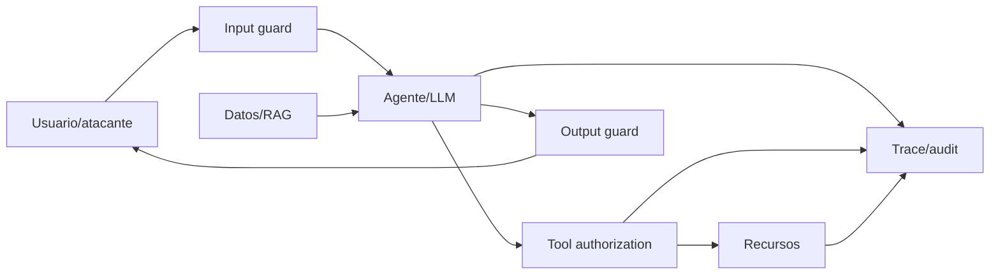

# AI Security, Governance & Privacy — manual operativo para Codex

> **Estado:** selección DeepLearning.AI completa, reconciliada y auditada.
> **Cobertura:** 39 videolecciones, 20 ejemplos de código y 5 quizzes certificables excluidos.
> **Fuentes:** *Red Teaming LLM Applications*; *Safe and Reliable AI via Guardrails*; *Governing AI Agents*; *Intro to Federated Learning*; *Federated Fine-tuning of LLMs with Private Data*.
> **Propósito:** construir sistemas de IA con amenazas, identidades, permisos, controles, privacidad, evidencia y respuesta a incidentes explícitos.

## Cómo usar este documento

1. Definir sistema, datos, acciones, actores y daño antes de elegir controles.
2. Dibujar trust boundaries y crear el registro de amenazas.
3. Aplicar controles deterministas en la capa más cercana al recurso.
4. Añadir guardrails probabilísticos como defensa adicional, nunca como única autorización.
5. Red-teamear el sistema desplegable completo y convertir fallos en regresiones.
6. Promover sólo con identidad, least privilege, auditoría, privacidad y rollback probados.
7. Encargar cambios a Codex mediante el **Contrato de seguridad**.

## Procedencia y límites

- **[DLAI]** paráfrasis fiel de las fuentes e instructores; no es transcripción literal.
- **[IMPL]** traducción a contratos, pruebas, métricas y operación profesional.
- **[EXT]** ampliación externa necesaria para evitar sobreafirmaciones.
- Los notebooks se conservan por patrón, no se copian; los quizzes no se abrieron ni resolvieron.
- Los productos del curso son ejemplos: Giskard, Guardrails AI, Databricks/Unity Catalog/MLflow y Flower pueden reemplazarse si se preservan los contratos.
- Esta selección cubre seguridad de aplicaciones de IA, gobierno de agentes y privacidad federada. No sustituye AppSec, seguridad de red/cloud, criptografía aplicada, respuesta forense ni normativa legal.

## 1. Modelo de riesgo antes del modelo de IA



Manifest mínimo:

```yaml
ai_threat_model:
  purpose_and_non_goals: []
  assets: ["datos", "identidades", "secrets", "modelo", "acciones", "reputación"]
  actors: ["usuario", "insider", "tenant", "proveedor", "agente", "atacante externo"]
  trust_boundaries: []
  data_classes: ["public", "internal", "confidential", "restricted"]
  entry_points: ["prompt", "RAG", "file", "tool", "API", "model/update"]
  actions_and_blast_radius: []
  threats: []
  controls_and_owners: []
  residual_risk_and_acceptor: []
  evidence: ["tests", "traces", "audit logs", "incidents"]
```

No empezar por “¿qué guardrail instalo?”. Un control sin amenaza, activo, owner y criterio de fallo definidos produce seguridad decorativa.

## 2. Red teaming de aplicaciones LLM

### Qué se prueba

**[DLAI]** Benchmarks de conocimiento no prueban seguridad. El riesgo de una aplicación depende de su contexto, prompt, retrieval, datos, tools y acciones. Las fuentes trabajan con:

- prompt injection/jailbreak y extracción del system prompt;
- disclosure de datos o infraestructura sensible;
- toxicidad, sesgo/estereotipos y contenido ilícito;
- hallucination/grounding deficiente;
- off-topic y reglas específicas del producto;
- service disruption y excessive agency.

**[IMPL]** Añadir supply chain, autorización rota, confused deputy, indirect prompt injection desde documentos/tools, cross-tenant leakage, poisoning, denial of wallet y exfiltración por canales laterales según el sistema.

### Proceso reproducible

```text
scope + reglas de compromiso
→ arquitectura, assets, actores y categorías de daño
→ reconnaissance y casos normales
→ ataques manuales adaptativos
→ automatización y variaciones
→ explotación segura y medición de impacto
→ deduplicar/triage/remediar
→ retest + regresión + monitoreo
```

Registro por caso:

```yaml
red_team_case:
  id: "stable"
  threat: "category + actor + goal"
  preconditions: []
  payload_or_strategy: "versioned"
  target_stack: "model/prompt/RAG/tools/versions"
  repetitions: 0
  outcome: "pass | fail | flaky | inconclusive"
  impact: "data/action/tenant/cost"
  severity_and_likelihood: {}
  evidence: "redacted trace"
  owner_and_fix: {}
  regression_id: ""
```

**[DLAI]** La automatización puede usar bibliotecas de ataques, scanners y LLMs para generar adversariales o clasificar respuestas. Es una primera capa; el assessment completo conserva exploración humana y scope específico.

**[IMPL]** Un LLM atacante/juez comparte sesgos y puede producir falsos positivos/negativos. Calibrarlo contra etiquetas humanas, fijar versión/prompt, conservar outputs, repetir por no determinismo y no declarar ausencia de vulnerabilidad porque un scanner no encontró fallos.

## 3. Guardrails como defensa en profundidad

**[DLAI]** Un guardrail valida explícitamente input u output mediante un validator; varios validators forman un guard. Puede usar reglas, NER, embeddings, clasificadores, NLI o llamadas a otro LLM. Ante fallo puede bloquear, redactar, reintentar, re-preguntar o enrutar.

Ubicación:

| Capa | Controles típicos | Límite |
|---|---|---|
| input | tamaño, schema, PII, jailbreak, topic | no controla datos recuperados después |
| retrieval | ACL, tenant, provenance, content scanning | texto autorizado aún puede ser malicioso |
| pre-tool | schema, allowlist, autorización, policy | el modelo no debe decidir su propio permiso |
| post-tool | resultado, sensibilidad, taint/provenance | no revierte una acción ya ejecutada |
| output | grounding, PII, formato, safety | bloquear tarde puede haber filtrado por stream/log |

### Grounding mediante NLI

**[DLAI]** La práctica divide la respuesta, recupera fuentes cercanas y clasifica cada oración como entailment, contradiction o neutral. Contradiction/neutral se tratan como no fundamentadas.

**[IMPL]** Entailment respecto de una fuente no demuestra verdad, actualidad, autorización ni exhaustividad. La recuperación puede omitir la evidencia correcta; NLI falla en números, negación, tablas y contexto largo. Evaluar precision/recall por slice, citar la fuente usada y permitir abstención.

### PII y políticas de contenido

- Detectar/redactar PII en input, contenido recuperado, tool results, output, logs y traces.
- Clasificar por jurisdicción y propósito; NER no reconoce todos los secretos ni quasi-identifiers.
- Redacción no reemplaza minimización, ACL, cifrado, retention ni acuerdos con proveedores.
- Topic/competitor guards son políticas del producto, no seguridad universal; exact match pierde alias y embeddings pueden bloquear menciones legítimas.
- Streaming requiere buffering suficiente para no emitir el secreto antes de detectarlo.

### Gate de un guardrail

```text
dataset normal + adversarial + edge cases
→ TP/FP/FN/TN por slice
→ impacto de cada acción de fallo
→ latencia/costo/disponibilidad
→ bypass adaptativo
→ shadow
→ canary
→ monitoreo de drift y rollback
```

Fail-open/fail-closed debe decidirse por amenaza y disponibilidad. Un guardrail externo caído no puede transformar silenciosamente una operación financiera o destructiva en “permitida”.

## 4. Gobierno de agentes

**[DLAI]** Los cuatro pilares del curso son lifecycle management, risk management, security y observability. El ejemplo gobierna datos, funciones, agente, evaluación y deployment mediante catálogo, clasificación, permisos, identidad y trazas.

### Catálogo y datos

Patrón transferible:

```text
catalogar asset + owner + clasificación
→ crear vista/consulta purpose-built
→ aplicar row/column policy y masking en la fuente
→ exponer función/tool estrecha
→ conceder EXECUTE/SELECT mínimo a identidad del agente
→ auditar input, objeto, resultado y decisión
```

Los tags documentan sensibilidad pero no imponen control por sí solos. Una vista puede saltarse si existe acceso a tabla base; reforzar políticas en el objeto autoritativo. Tools con SQL/API deben parametrizar valores, limitar filas/campos/tiempo y aplicar autorización independientemente del prompt.

### Identidad

**[DLAI]** El curso distingue usuario, grupo y service principal; presenta identidad automática, on-behalf-of-user y service principal precreado. Para producción demuestra una identidad dedicada con permisos mínimos.

**[IMPL]** Elegir semántica explícita:

- **service identity:** acciones uniformes del sistema; owner y blast radius claros;
- **on behalf of user:** preservar permisos del llamador y consentimiento;
- **doble autorización:** identidad del servicio **y** usuario deben poder realizar la acción sensible.

Nunca usar credencial admin humana. Separar identidad por agente/entorno, usar credenciales cortas, secret manager, egress allowlist y revocación. Autorizar cada tool call con recurso, tenant, acción y propósito; autenticar al agente no autoriza todo lo que puede pedir.

### Evaluación, deployment y observabilidad

- versionar código, prompt, modelo, tools, dependencias, datos y permisos;
- evaluar respuesta, selección/argumentos/orden de tools, grounding, PII, costo y latencia;
- usar dataset dorado independiente; LLM judges requieren calibración humana;
- trazar spans de modelo/retrieval/tool con IDs y redacción;
- registrar modelo/agent artifact y lineage antes del endpoint;
- desplegar con identidad prevista desde el primer canary; probar permisos negativos;
- convertir eval thresholds en monitoreo, sin confundir trace completo con logging de secretos.

## 5. Federated learning y privacidad

### Algoritmo base

**[DLAI]** El servidor mantiene el modelo global; clientes reciben parámetros, entrenan con datos locales y devuelven updates. El servidor agrega y repite rounds. FedAvg pondera updates por cantidad de ejemplos.

```text
for each round:
  sample eligible clients
  send global model/config
  train locally
  validate/clip/protect update
  aggregate accepted updates
  evaluate global + client slices
```

Decisiones: client sampling, local epochs/LR, non-IID data, stragglers/dropout, aggregation, evaluación y criterios de convergencia. Más pasos locales reducen comunicación pero pueden aumentar client drift.

### Privacidad: afirmación exacta

**[DLAI]** Los datos crudos permanecen en su ubicación, pero updates pueden filtrar membership, atributos o ejemplos reconstruidos. Federated learning **no garantiza privacidad por sí solo**.

Controles:

| Control | Protege principalmente | Supuesto/costo |
|---|---|---|
| central DP | individuos frente al modelo publicado | agregador confiable; clipping+noise; utilidad |
| local DP | update antes del servidor | más ruido/menor utilidad |
| secure aggregation | update individual frente al servidor | protocolo, quorum/dropout y metadata |
| cifrado transporte | red | endpoints aún ven datos permitidos |
| robust aggregation `[EXT]` | poisoning/Byzantine clients | puede degradar con heterogeneidad |

DP debe declarar unidad protegida, clipping norm, sampling, noise, `(ε, δ)`, accountant, rounds y composición. “Se añadió ruido” no es una garantía medible.

### Bandwidth y PEFT

**[DLAI]** Aproximación por corrida:

```text
bytes ≈ rounds × selected_clients_per_round
        × (model_bytes_sent + update_bytes_received)
```

La demostración obtiene 212 MB para un round, dos clientes y 53 MB en cada dirección. Compresión, sparsification, cuantización, menos rounds y más pasos locales reducen tráfico con trade-offs.

En LLMs, federated fine-tuning combina FL + PEFT/LoRA + DP: se congelan pesos base y se intercambian adapters pequeños. Los ahorros de cientos/miles de veces del curso dependen de modelo, rank, precisión, clientes y qué se distribuye; medir bytes reales, no adoptar la cifra.

### Evaluación de fuga

**[DLAI]** El curso ilustra extracción/membership usando generación y perplexity, y compara modelos central/federado con ROC.

**[IMPL]** Perplexity baja no prueba pertenencia: texto frecuente o duplicado también puede ser predecible. Un resultado de tres ejemplos no demuestra privacidad. Usar miembros/no-miembros independientes, ataques calibrados, ROC-AUC/TPR a FPR baja, canaries y múltiples adversarios; la garantía formal proviene del mecanismo DP/accounting, no de que un ataque concreto falle.

## 6. Gate combinado de producción

```text
threat model aprobado
AND identidad/least privilege + negative tests
AND data classification/retention/provenance
AND red-team coverage + remediaciones verificadas
AND guardrail FP/FN/latencia dentro de presupuesto
AND tool authorization y blast-radius limits
AND traces/audit redactados y accionables
AND privacidad declarada con supuestos/métricas
AND incident response + rollback ejercitados
```

### Runbook de incidente

1. Detener o degradar la capacidad afectada; revocar identidad/secret si corresponde.
2. Preservar evidencia redactada, versiones, trace IDs y ventana temporal.
3. Determinar tenants/datos/acciones alcanzados; no inferir alcance desde una sola respuesta.
4. Rotar credenciales, invalidar caches/artefactos y parchear la frontera correcta.
5. Notificar y escalar conforme a política/legal; no usar el LLM como decisor.
6. Reproducir ataque, agregar regresión y ejecutar red team de variantes.
7. Restaurar por canary y monitorear recurrencia.

## 7. Contrato de seguridad para Codex

```yaml
codex_ai_security_task:
  objective: "riesgo y control verificables"
  system_boundary: "components/data/tools/tenants"
  authority:
    read: []
    write: ["workspace aislado"]
    forbidden: ["producción", "secrets", "datos personales", "acciones externas"]
  threats_and_acceptance: []
  identities_and_permissions: []
  data_classes_and_retention: []
  required_tests:
    - "authorization positive/negative"
    - "prompt injection/direct+indirect"
    - "cross-tenant and PII leakage"
    - "tool misuse and excessive agency"
    - "guardrail FP/FN and bypass"
    - "audit/rollback/incident drill"
  deliverables:
    - "threat model + evidence"
    - "minimal controls and configs"
    - "raw eval/red-team results"
    - "residual risks, owner and rollback"
```

## 7.1 Práctica pública xAI — autorización y sandbox de agentes

**[CODE] Evidencia fijada:** `xai-org/grok-build@19d42e35c07a9c9244f03f6df0c4c353f970d4f9`, en particular su guía pública de permisos y seguridad. Es una implementación observable, no prueba de seguridad universal ni sustituto del threat model del proyecto.

### Decisión por capas, con veto monotónico

El patrón publicado separa hooks previos, reglas, grants recordados, autoaprobaciones de lectura y una política del modo de sesión. Entre reglas combinadas prevalece `deny > ask > allow`; una capa local no puede neutralizar un veto más fuerte.

```text
request tipado
→ hook/policy organizacional con capacidad de veto
→ reglas deny/ask/allow de todos los scopes
→ grant estrecho, vigente y contextual
→ clasificación read-only segura
→ política default del modo
→ sandbox/runtime enforcement
→ ejecución + audit event
```

**[IMPL] Regla:** autorización lógica y aislamiento del sistema operativo son controles distintos. Una allowlist textual no impide por sí misma escapar por symlink, subprocess, shell expansion, interpreter, red, FFI o dependencia comprometida. Aplicar workspace boundary resuelto, identidad mínima, filesystem/network/process policy y límites de recursos en la capa de ejecución.

### Comandos compuestos y autoridad heredada

**[CODE]** La guía evalúa segmentos de comandos encadenados y mantiene excepciones para construcciones que pueden ejecutar código aunque parezcan lectura. También documenta que ciertas restricciones del modo plan del padre no alcanzan automáticamente a todos los subagentes.

**[IMPL] Consecuencia:**

- parsear con la gramática real del shell o evitar shell y usar `argv` tipado;
- autorizar cada segmento, redirección, sustitución y proceso secundario;
- resolver paths canónicos y revalidarlos en el momento de uso;
- no inferir read-only desde el nombre del binario: plugins, hooks y configuración pueden ejecutar;
- calcular la autoridad efectiva de cada subagente/tool desde cero; heredar contexto no implica heredar ni restringir permisos correctamente;
- separar “no preguntar” de “permitir”: automatización no interactiva necesita deny-by-default o límites deterministas, no aprobación implícita.

### Matriz mínima de pruebas

| Riesgo | Prueba obligatoria |
|---|---|
| precedencia | reglas contradictorias entre scopes; el veto conserva prioridad |
| composición | comando seguro seguido por segmento prohibido, pipe, redirección y sustitución |
| paths | `..`, symlink/junction, case/Unicode, TOCTOU y mount/reparse boundary |
| subagentes | parent plan/read-only con child write-capable; autoridad no se eleva |
| grants | expiración, project scope, argumentos distintos y comando peligroso |
| sandbox | filesystem, red, procesos, recursos, secrets y escape por tool indirecta |
| auditoría | identidad, policy revision, decisión, efecto, resultado y redacción de datos |

Fuente fijada: [Permissions and safety](https://github.com/xai-org/grok-build/blob/19d42e35c07a9c9244f03f6df0c4c353f970d4f9/crates/codegen/xai-grok-pager/docs/user-guide/22-permissions-and-safety.md). La arquitectura agentiva y las pruebas de sesión permanecen en `AGENTIC_AI_SOFTWARE_ENGINEERING_CODEX.md`; host, IAM y sandbox de infraestructura permanecen en `SECURITY_SRE_CLOUD_INFRASTRUCTURE.md`.

## 7.2 Seguridad agentiva 2026 y aprendizaje multi-cliente

**[SPEC] Frontera de evidencia.** NIST AI 800-5 resume respuestas públicas a una RFI: documenta consenso observado sobre amenazas nuevas y barreras de adopción, pero no es una certificación ni un control profile completo. El concept paper de NCCoE identifica como problemas explícitos identidad, autorización, auditoría, no repudio y prompt injection de agentes. OWASP Top 10 for Agentic Applications 2026 ofrece un punto de partida revisado por la comunidad; tampoco demuestra seguridad del sistema desplegado.

### Autoridad verificable por ejecución

Cada efecto conserva una cadena que pueda explicar y limitar quién actuó:

```text
principal humano/servicio
→ identidad única de agente + instancia/sesión
→ tarea, propósito, tenant y environment
→ policy revision + capability estrecha y temporal
→ tool/recurso/argumentos normalizados
→ decisión allow/deny/ask y aprobador cuando aplica
→ efecto observado + receipt/trace
→ estado final, revocación y rollback posible
```

- Autenticar al agente no prueba que represente al usuario ni que pueda ejecutar la acción.
- Una sesión no comparte autoridad automáticamente con subagentes, plugins, hooks o MCP servers.
- El audit log debe distinguir intención, decisión y efecto real; una tool puede fallar después del efecto o responder antes de que sea durable.
- No repudio útil exige integridad, identidad y reloj/contexto suficientes, además de acceso separado; un log editable por el mismo agente no alcanza.
- Guardrails probabilísticos inspeccionan contenido; un policy enforcement point determinista concede o niega capabilities.

### Demostración de riesgo segura

Una evaluación comercial o técnica se ejecuta únicamente con autorización escrita, entorno aislado, recursos ficticios y secretos canary. Comparar el mismo escenario sin/con controles: indirect prompt injection, tool/MCP no confiable, permiso excesivo, acción compuesta, exfiltración señuelo, replay y revocación. Medir attack success, blast radius, acciones sin atribución, tiempo de detección/revocación, cobertura de auditoría, falsos bloqueos y degradación de latencia. Nunca provocar destrucción, persistencia o acceso a datos reales para “demostrar valor”.

### Flywheel sin convertir clientes en training data

Clasificar cada artefacto antes de almacenarlo o reutilizarlo:

| Carril | Ejemplo | Regla por defecto |
|---|---|---|
| operación del cliente | prompt, tool result, diff, secret match, trace | tenant aislado; mínimo, redactado y con retención |
| incidente/evidencia | timeline, receipt, decisión de policy | acceso restringido; preservación y borrado según contrato/legal |
| regresión | patrón sintetizado, ataque canary, invariante | reutilizable sólo si no reconstruye datos/identidad del cliente |
| mejora global | regla, detector, modelo o policy candidate | provenance, contribución acotada, holdout y promoción controlada |
| entrenamiento | ejemplos o updates derivados de uso | carril independiente y autorizado; nunca consecuencia automática de telemetría |

Un identificador hash/pseudónimo sigue pudiendo enlazarse con repositorios, paths, tiempos, código o secuencias. Agregación, anonimización, privacidad diferencial o federated learning sólo se acreditan bajo threat model y medición; no se infieren del nombre de la técnica.

**Gate obligatorio del learning loop:** propósito y términos por clase de dato; minimización y redacción antes de persistir; separación lógica/criptográfica por tenant; provenance y deletion lineage; límites de retención/acceso/egress; deduplicación y defensa contra poisoning/Sybil; máximo aporte por tenant; holdout que no comparte incidente raíz; leakage y membership tests cuando aplica; métricas por slice; shadow/canary; rollback y revocación de artefactos derivados. La mejora no se promueve si aumenta exfiltración, falsos bloqueos, privilegio, costo o impacto residual aunque suba una métrica promedio.

Fuentes externas verificadas el 2026-08-22: [NIST AI 800-5](https://www.nist.gov/publications/summary-analysis-responses-request-information-regarding-security-considerations-ai), [NCCoE — identidad y autoridad de agentes](https://www.nist.gov/news-events/news/2026/02/new-concept-paper-identity-and-authority-software-agents) y [OWASP Top 10 for Agentic Applications 2026](https://genai.owasp.org/resource/owasp-top-10-for-agentic-applications-for-2026/).

## 8. Auditoría curricular

| Fuente | Cobertura incorporada | Inventario |
|---|---|---:|
| Red Teaming LLM Applications | vulnerabilidades, técnicas manuales, escala, LLM attacker/judge y assessment | 7 videos, 5 códigos, 1 quiz excluido |
| Safe and Reliable AI via Guardrails | RAG failures, validators/guards, NLI, topic, PII y políticas | 10 videos, 7 códigos, 1 quiz excluido |
| Governing AI Agents | cuatro pilares, catálogo, identidad, tools, eval, lineage y deployment | 9 videos, 0 códigos declarados, 1 quiz excluido |
| Intro to Federated Learning | FedAvg, tuning, DP, ataques y bandwidth | 7 videos, 5 códigos, 1 quiz excluido |
| Federated Fine-tuning of LLMs with Private Data | central vs federado, PEFT, DP, leakage y communication | 6 videos, 3 códigos, 1 quiz excluido |

- **39/39 videolecciones contrastadas.**
- **20/20 ejemplos de código inventariados por función.**
- **5 quizzes certificables excluidos.**
- Tensiones corregidas: benchmark/seguridad, scanner/garantía, guardrail/autorización, entailment/verdad, catálogo/enforcement, autenticación/autorización, FL/privacidad, perplexity/membership y demo/garantía general.

### Cierre transversal con la biblioteca

| Frontera | Resolución |
|---|---|
| Agentes | la trayectoria y tools se diseñan allí; identidad, autorización, blast radius y auditoría se aprueban aquí |
| Aprendizaje multi-cliente | ML Production diseña datasets/promoción; operación, consentimiento/contrato, tenant isolation, leakage y poisoning se aprueban aquí |
| NLP/RAG | retrieval y calidad se diseñan allí; ACL, indirect injection, PII y provenance se aprueban aquí |
| ML Production | despliegue/drift se gobiernan allí; threat model, incidentes y riesgo residual se aprueban aquí |
| Inferencia/edge | rendimiento y hardware se eligen allí; tenant isolation, artefactos, telemetría y privacidad se aprueban aquí |
| Deep Learning/LLMs | arquitectura y entrenamiento se explican allí; leakage, red team y controles de uso se aprueban aquí |

## Regla final

El LLM propone; las fronteras deterministas autentican, autorizan, limitan, registran y permiten revertir. Ningún prompt, guardrail, scanner, catálogo o protocolo aislado demuestra seguridad: el sistema se aprueba por amenazas explícitas y evidencia independiente bajo su configuración desplegada.
