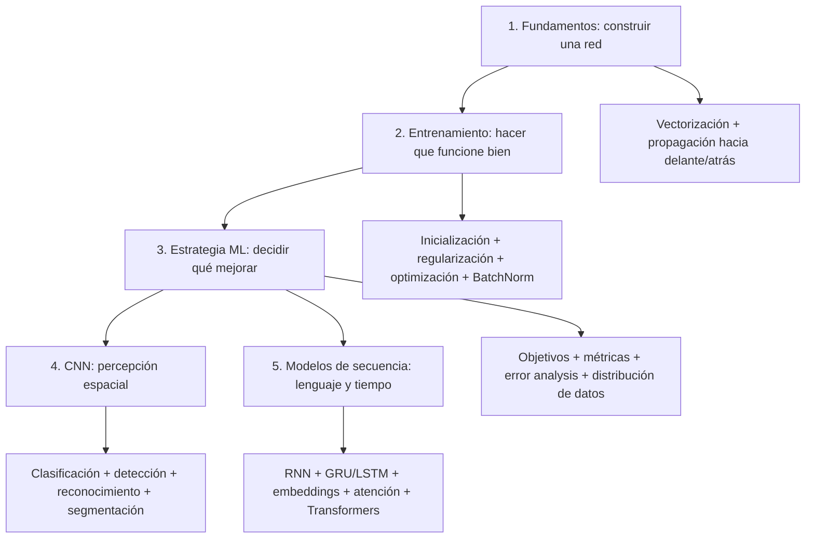

# Deep Learning Specialization — mapa mental y manual operativo

> **Estado:** auditoría transversal técnica y compresión completadas el 2026-08-20.
> **Fuente primaria:** Andrew Ng, *Deep Learning Specialization* (DeepLearning.AI), edición actualizada con TensorFlow 2.
> **Propósito:** referencia compacta para estudiar, diseñar, programar, revisar y dirigir sistemas de deep learning; no sustituye la práctica ni las clases.

## Cómo usar este documento sin desperdiciar tokens

1. Leer primero **Modelo mental total**, **Sistema operativo transversal** y **Reglas compactas para agentes**.
2. Cargar solo el curso que corresponde a la tarea: C1 construcción matemática; C2 entrenamiento; C3 diagnóstico y estrategia; C4 visión; C5 secuencias/Transformers.
3. Ante un fallo, ir primero al procedimiento **aprender de los errores del algoritmo**, no cambiar arquitectura por intuición.
4. Para producción, combinar `[NG]` con `[IMPL]`; usar `[EXT]` únicamente cuando la restricción externa esté realmente presente.

## Estado y límites verificables

| Capa | Cobertura verificable |
|---|---|
| Estructura | 5/5 cursos, 17/17 módulos y 194/194 videolecciones inventariadas contra el catálogo oficial actual |
| Núcleo técnico | conceptos, ecuaciones, decisiones, prácticas y fallos principales de C1–C5 incorporados y auditados transversalmente |
| Uso profesional | contratos, pruebas, runbooks y criterios de salida derivados de las enseñanzas, separados por procedencia |
| Compresión | redundancias de estado retiradas; inventario y decisiones conservados en un único Markdown |
| Límite | no es una transcripción literal exhaustiva ni reproduce evaluaciones; `[NG]` identifica síntesis fiel, no cita textual |

**Regla de honestidad:** inventariar una lección no equivale a transcribirla. Este archivo preserva lo que cambia una decisión de diseño, implementación o diagnóstico; no afirma contener cada frase pronunciada durante las 127 h 29 min.

## Convención de procedencia

- **[NG]** Paráfrasis fiel de una enseñanza atribuible a Andrew Ng o al contenido oficial de la especialización; no implica literalidad.
- **[IMPL]** Traducción directa de esa enseñanza a una regla de implementación.
- **[EXT]** Extensión de ingeniería fuera del curso (por ejemplo Rust/C++, order books o baja latencia). Nunca atribuirla a Andrew Ng.
- Una afirmación sin evidencia suficiente queda marcada **[PENDIENTE]**; no completar huecos por memoria o inferencia.
- Inventarios y nombres de temas son estructura, no afirmaciones técnicas. En los runbooks, todo paso no marcado es `[IMPL]`; cualquier ampliación externa conserva `[EXT]` explícito.

## Modelo mental total



La disciplina global es: definir el problema y la métrica; construir un baseline correcto; medir train/dev/test; localizar el cuello de botella; cambiar una causa controlable; volver a medir; escalar solo después de validar.

## Sistema operativo transversal

| Fase | Pregunta que decide | Evidencia mínima | Puerta de salida |
|---|---|---|---|
| 1. Blanco | ¿qué comportamiento real debe mejorar? | población target, métrica optimizing y restricciones satisficing | objetivo no ambiguo |
| 2. Datos | ¿qué aprenderá y dónde operará? | contrato, linaje, slices y splits sin leakage | train/dev/test representan su función |
| 3. Baseline | ¿cuál es el primer sistema correcto? | implementación simple, costo y métrica reproducibles | extremo a extremo funciona |
| 4. Corrección | ¿las matemáticas y el pipeline son válidos? | shapes, finitud, gradient check, micro-overfit y golden cases | bugs básicos descartados |
| 5. Diagnóstico | ¿domina bias, variance, mismatch, etiquetado o serving? | gaps y revisión manual de errores | cuello de botella localizado |
| 6. Intervención | ¿qué cambio ataca esa causa? | hipótesis, ablation y presupuesto controlado | efecto medido en dev y slices |
| 7. Especialización | ¿CNN, secuencia, transferencia o pipeline modular? | estructura del dato y error observado | complejidad justificada |
| 8. Producción | ¿se conserva el comportamiento bajo restricciones reales? | equivalencia train/serve, latencia, memoria, drift y rollback | SLO y criterios de aceptación cumplidos |

**[IMPL] Bucle indivisible:** `observar -> categorizar -> estimar impacto -> priorizar -> intervenir -> medir -> convertir fallos en regresiones`. Si una etapa no produce evidencia, el siguiente cambio es especulación.

## Curso 1 — Neural Networks and Deep Learning

> **Cobertura estructural:** 45/45 videos inventariados (6 + 19 + 12 + 8). La síntesis técnica siguiente cubre el camino docente y las cinco prácticas de programación: Python/NumPy, regresión logística, red plana de una capa oculta, red profunda paso a paso y aplicación profunda.

### Inventario compacto — Curso 1

- **M1 (74 min):** Welcome; What is a Neural Network?; Supervised Learning with Neural Networks; Why is Deep Learning taking off?; About this Course; entrevista a Geoffrey Hinton.
- **M2 (161 min):** Binary Classification; Logistic Regression; Logistic Regression Cost Function; Gradient Descent; Derivatives; More Derivative Examples; Computation Graph; Derivatives with a Computation Graph; Logistic Regression Gradient Descent; Gradient Descent on `m` Examples; Vectorization; More Vectorization Examples; Vectorizing Logistic Regression; Vectorizing its Gradient Output; Broadcasting in Python; Python/NumPy Vectors; Jupyter; derivación opcional del costo; entrevista a Pieter Abbeel.
- **M3 (109 min):** Neural Networks Overview; Representation; Computing Output; Vectorizing Multiple Examples; Vectorized Implementation; Activation Functions; Why Non-Linear Activations?; Activation Derivatives; Gradient Descent; Backpropagation Intuition; Random Initialization; entrevista a Ian Goodfellow.
- **M4 (64 min):** Deep L-layer Network; Forward Propagation; Matrix Dimensions; Why Deep Representations?; Building Blocks; Forward/Backward Propagation; Parameters vs Hyperparameters; relación con el cerebro.

### Módulo 1: Introduction to Deep Learning

- Bienvenida y mapa del campo.
- Qué está impulsando el deep learning y qué tipos de redes corresponden a datos estructurados, imágenes y secuencias.
- **[NG]** La escala de datos, cómputo y redes permite seguir mejorando donde algoritmos tradicionales se saturan.

### Módulo 2: Neural Networks Basics

- Clasificación binaria y notación: ejemplos, características, etiquetas, dimensiones y matrices.
- Regresión logística como red de una neurona: `z = wᵀx + b`, `a = sigmoid(z)`.
- Función de pérdida y costo; descenso por gradiente; derivadas y grafo computacional.
- Vectorización de ejemplos, broadcasting y eliminación de bucles explícitos.
- Propagación hacia delante y hacia atrás para regresión logística.
- **[IMPL]** Declarar dimensiones y convenciones de ejes antes de escribir operaciones; comprobarlas en cada límite de módulo.
- **[IMPL]** Expresar el camino crítico como operaciones de tensores, evitando bucles por ejemplo en Python.

#### Contrato matemático mínimo

Para `m` ejemplos, cada columna es un ejemplo:

```text
X ∈ R^(n_x × m)       Y ∈ {0,1}^(1 × m)
w ∈ R^(n_x × 1)       b ∈ R
Z = wᵀX + b           A = σ(Z)
J = -(1/m) Σ[y log(a) + (1-y) log(1-a)]
dZ = A-Y
dw = (1/m) X dZᵀ      db = (1/m) Σ dZ
w := w-αdw            b := b-αdb
```

- **[NG]** La pérdida mide un ejemplo y el costo promedia el conjunto. La pérdida logarítmica penaliza con fuerza predicciones confiadas pero erróneas y hace que el costo de la regresión logística sea convexo respecto de `w,b`.
- **[NG]** Un grafo computacional organiza el cálculo de izquierda a derecha y las derivadas de derecha a izquierda mediante la regla de la cadena.
- **[IMPL]** Invariantes: `Z.shape == A.shape == Y.shape == (1,m)` y `dw.shape == w.shape`; no aceptar broadcasting accidental que altere esos contratos.
- **[IMPL]** Usar vectores columna explícitos; evitar arrays NumPy de forma `(n,)`, porque su transposición no cambia la forma y oculta errores.
- **[IMPL]** Verificar la vectorización comparando con una versión escalar pequeña y midiendo tiempo; después retirar la versión lenta del camino productivo.

### Módulo 3: Shallow Neural Networks

- Red de una capa oculta; forma matricial de forward propagation.
- Funciones de activación y sus derivadas; unidades ocultas con activaciones no lineales.
- Backpropagation vectorizada.
- Inicialización aleatoria para romper simetría.
- **[IMPL]** No inicializar todas las unidades ocultas de forma idéntica: aprenderían la misma función.
- **[IMPL]** Verificar formas y gradientes antes de optimizar rendimiento.

#### Bloque de una capa oculta

```text
Z[1] = W[1]X + b[1]        A[1] = g[1](Z[1])
Z[2] = W[2]A[1] + b[2]     A[2] = σ(Z[2])
dZ[2] = A[2]-Y
dW[2] = (1/m)dZ[2]A[1]ᵀ    db[2] = (1/m)Σ dZ[2]
dZ[1] = W[2]ᵀdZ[2] ⊙ g'[1](Z[1])
dW[1] = (1/m)dZ[1]Xᵀ       db[1] = (1/m)Σ dZ[1]
```

- **[NG]** Sin activación no lineal, componer capas lineales sigue produciendo una transformación lineal; la profundidad no aporta la representación buscada.
- **[NG]** `tanh` suele ser preferible a sigmoid en capas ocultas por estar centrada en cero; sigmoid conserva una función natural en salida binaria. ReLU evita buena parte de la saturación positiva, aunque su derivada es cero en la región negativa.
- **[NG]** En la red plana del curso, inicializar `W` con valores aleatorios pequeños rompe simetría; `b` puede empezar en cero.
- **[IMPL]** No generalizar “pequeños” como escala universal: en redes profundas usar inicialización escalada por `fan_in` —He para ReLU, Xavier-like para `tanh`— como se desarrolla en el Curso 2.
- **[IMPL]** Cachear únicamente lo requerido por backward (`A_prev`, `W`, `b`, `Z`) y comprobar gradientes numéricamente en redes diminutas.

### Módulo 4: Deep Neural Networks

- Redes profundas, notación por capas y bloques `LINEAR -> ACTIVATION`.
- Forward y backward propagation generalizados; almacenamiento de caches intermedias.
- Parámetros frente a hiperparámetros.
- Representaciones jerárquicas: capas sucesivas componen características de mayor nivel.
- Construcción práctica de redes de dos capas y de `L` capas.

#### Patrón reusable de `L` capas

```text
LINEAR_FORWARD: Z[l] = W[l]A[l-1] + b[l]
ACTIVATION_FORWARD: A[l] = g[l](Z[l])
LINEAR_BACKWARD:
  dW[l] = (1/m)dZ[l]A[l-1]ᵀ
  db[l] = (1/m)Σ dZ[l]
  dA[l-1] = W[l]ᵀdZ[l]
```

- Dimensiones: `W[l] ∈ R^(n[l] × n[l-1])`, `b[l] ∈ R^(n[l] × 1)`, `A[l] ∈ R^(n[l] × m)`.
- **[NG]** La profundidad permite reutilizar y componer características: detectores simples alimentan representaciones progresivamente más abstractas.
- **[NG]** Los parámetros (`W`, `b`) se aprenden; hiperparámetros como capas, unidades, learning rate e iteraciones gobiernan el aprendizaje y se eligen mediante desarrollo iterativo.
- **[IMPL]** Arquitectura de software: `initialize -> L_model_forward -> compute_cost -> L_model_backward -> update_parameters`; cada función devuelve valores y caches con formas comprobables.
- **[IMPL]** Pruebas mínimas antes de entrenar: formas por capa; costo finito; gradientes numéricos; descenso del costo en un lote fijo; capacidad de sobreajustar un conjunto diminuto; inferencia determinista.

### Curso 1 — flujo de implementación profesional

#### 1. Contrato de datos

- **[NG]** En la convención del curso, cada columna de `X` es un ejemplo; una imagen RGB de `(height,width,3)` se aplana a `n_x = height*width*3` características.
- **[IMPL]** Transformar y normalizar con una función única compartida por train/dev/test; registrar orden de canales, rango, dtype y forma.
- **[IMPL]** No permitir leakage: el ejemplo puede transformarse igual en todos los splits, pero cualquier estadística aprendida se ajusta solo con train.

```text
prepare(raw) -> X[n_x,m], Y[1,m]
assert finite(X) && labels_valid(Y)
assert X_train.rows == X_dev.rows == model.n_x
```

#### 2. API mínima, independiente del lenguaje

```text
initialize(layer_dims, seed) -> parameters
linear_forward(A_prev, W, b) -> Z, cache
activation_forward(Z, kind) -> A, cache
model_forward(X, parameters) -> AL, caches
compute_cost(AL, Y) -> scalar
model_backward(AL, Y, caches) -> gradients
update(parameters, gradients, learning_rate) -> parameters
predict(X, parameters, threshold=0.5) -> labels
train(X, Y, config) -> parameters, history
```

- **[IMPL]** Cada función valida forma, dtype y finitud en modo debug; el modo producción puede retirar checks costosos tras pruebas suficientes.
- **[IMPL]** No mezclar cálculo de gradientes con actualización: separarlos permite gradient checking, otros optimizadores y pruebas unitarias.
- **[IMPL]** `history` conserva costo, métrica, learning rate y pasos; nunca depender solo del último valor.

#### 3. Orden de depuración enseñable

1. Confirmar `X`, `Y`, escalado y correspondencia ejemplo-etiqueta.
2. Confirmar dimensiones capa por capa.
3. Ejecutar forward con parámetros fijos y comparar resultados esperados.
4. Confirmar costo escalar, finito y compatible con `AL/Y`.
5. Ejecutar backward y comparar formas.
6. Aplicar gradient checking en un caso diminuto.
7. Sobreajustar deliberadamente pocos ejemplos.
8. Recién entonces entrenar el dataset completo y optimizar velocidad.

#### 4. Fallos que un agente debe buscar activamente

| Síntoma | Causa probable | Verificación/acción |
|---|---|---|
| todas las unidades ocultas aprenden igual | `W` inicializada en ceros/constante | comprobar diversidad de filas; inicialización aleatoria |
| formas “funcionan” pero resultado incorrecto | broadcasting accidental | asserts exactos; revisar eje de suma y `keepdims` |
| `w.T` no cambia nada | vector NumPy `(n,)` | remodelar a `(n,1)` |
| `log(0)`, `NaN` o `Inf` | probabilidades extremas/numerical stability | inspeccionar logits; clipping solo con criterio explícito |
| costo oscila o diverge | learning rate alto, datos sin escalar o gradiente incorrecto | probar lote fijo, reducir `α`, gradient check |
| costo casi no cambia | `α` bajo, saturación, gradiente cero o update omitido | medir normas de `dW/db` y delta de parámetros |
| train y predicción discrepan | preprocessing o parámetros diferentes | reutilizar pipeline y artifact exactos |
| deep model no supera baseline | bug, capacidad/optimización o datos | primero corrección y overfit pequeño; luego diagnóstico bias/variance |

#### 5. Criterios de finalización del componente

- Tests unitarios para sigmoid/ReLU y bloques linear/activation forward/backward.
- Gradient difference dentro de tolerancia definida para un caso pequeño.
- Costo decrece en un lote fijo con configuración conocida.
- El modelo puede memorizar un microdataset coherente.
- Predicción por lote coincide con predicción ejemplo por ejemplo dentro de tolerancia.
- Serializar/deserializar parámetros preserva predicciones.
- Benchmark separa preprocessing, forward, backward y actualización.

#### 6. Traducción a desempeño Senior

- **[NG]** Vectorizar reduce el tiempo entre una idea y su resultado; ese ciclo iterativo rápido es una ventaja práctica central.
- **[IMPL]** Antes de portar a GPU, Rust o C++, fijar tests numéricos contra una referencia simple. La optimización no puede cambiar contratos ni tolerancias sin evidencia.
- **[EXT]** Para baja latencia: preasignar buffers, fijar layouts contiguos, evitar conversiones y medir colas/copias además del kernel. Esta ingeniería no pertenece al Curso 1, pero conserva su principio de vectorización y verificación.

## Curso 2 — Improving Deep Neural Networks

> **Cobertura estructural:** 37/37 videos inventariados (15 + 11 + 11). Prácticas: Initialization, Regularization, Gradient Checking, Optimization Methods y TensorFlow Introduction.

### Inventario compacto — Curso 2

- **M1 (131 min):** Train/Dev/Test Sets; Bias/Variance; Basic Recipe; Regularization; Why Regularization Reduces Overfitting?; Dropout; Understanding Dropout; Other Regularization Methods; Normalizing Inputs; Vanishing/Exploding Gradients; Weight Initialization; Numerical Gradient Approximation; Gradient Checking; Implementation Notes; entrevista a Yoshua Bengio.
- **M2 (92 min):** Mini-batch Gradient Descent; Understanding Mini-batches; Exponentially Weighted Averages; su intuición y bias correction; Momentum; RMSprop; Adam; Learning-rate Decay; Local Optima; entrevista a Yuanqing Lin.
- **M3 (103 min):** Tuning Process; Appropriate Scale; Pandas vs. Caviar; Normalizing Activations; Batch Norm in a Network; Why Batch Norm Works?; Test Time; Softmax Regression; Training Softmax; Frameworks; TensorFlow.

### Módulo 1: Practical Aspects of Deep Learning

- División train/dev/test y coherencia entre distribuciones relevantes.
- Diagnóstico de bias y variance.
- Inicialización: ceros, aleatoria y escalada Xavier/He según activación.
- Regularización L2 y dropout invertido.
- Data augmentation y early stopping, con sus compromisos.
- Normalización de entradas.
- Vanishing/exploding gradients y gradient checking.
- **[NG]** Antes de ajustar técnicas, identificar si el problema dominante es bias, variance u optimización.
- **[IMPL]** Gradient checking es una prueba de corrección, no parte del entrenamiento normal.

#### Árbol de diagnóstico y controles

```text
¿train error demasiado alto frente a Bayes/human-level? -> high avoidable bias
  probar: red mayor, más tiempo/mejor optimización, arquitectura adecuada
¿dev error mucho mayor que train error? -> high variance
  probar: más datos, regularización, arquitectura adecuada
```

- **[NG]** Este “basic recipe” es una secuencia de diagnóstico; no presupone que todas las acciones sean útiles en todos los problemas.
- **[NG]** Normalizar entradas mejora la geometría del costo: medias cercanas a cero y escalas comparables permiten pasos de gradiente menos oscilantes.
- **[NG]** L2 añade `λ/(2m) Σ||W[l]||²`; en backward agrega `(λ/m)W[l]` y tiende a reducir pesos, limitando la complejidad efectiva.
- **[NG]** Inverted dropout conserva cada unidad con probabilidad `keep_prob` y divide activaciones por `keep_prob` durante training; en test no se aplica dropout ni reescalado adicional.
- **[IMPL]** Dropout introduce aleatoriedad: fijar semilla para depuración, desactivarlo durante gradient checking y asegurar modos explícitos `train/eval`.
- **[IMPL]** Gradient check: aplanar parámetros y gradientes; aproximar cada componente con diferencia central; comparar mediante una diferencia relativa normalizada. Usarlo con una red pequeña y retirarlo del entrenamiento por su costo.

### Módulo 2: Optimization Algorithms

- Mini-batch gradient descent.
- Exponentially weighted averages.
- Momentum, RMSprop y Adam.
- Learning-rate decay y mínimos locales/saddle points.
- **[IMPL]** Medir costo y estabilidad por actualización y por época; comparar algoritmos bajo presupuestos equivalentes.

#### Actualizaciones esenciales

```text
g_t = ∇_θ J_t
Momentum: v_t := β₁v_{t-1} + (1-β₁)g_t;  θ_t := θ_{t-1}-αv_t
RMSprop:  s_t := β₂s_{t-1} + (1-β₂)g_t²; θ_t := θ_{t-1}-αg_t/(sqrt(s_t)+ε)
Adam: v_hat_t = v_t/(1-β₁^t); s_hat_t = s_t/(1-β₂^t)
      θ_t := θ_{t-1}-α v_hat_t/(sqrt(s_hat_t)+ε)
```

- **[NG]** En un promedio exponencial `v_t=βv_{t-1}+(1-β)θ_t`, la memoria efectiva es aproximadamente `1/(1-β)` observaciones; al inicio, `v_hat_t=v_t/(1-β^t)` corrige el sesgo hacia cero.
- **[NG]** Mini-batches permiten avanzar antes de procesar todo el dataset; el costo se vuelve más ruidoso, pero el entrenamiento puede ser mucho más rápido.
- **[NG]** Momentum suaviza direcciones oscilantes; RMSprop ajusta el paso por componente; Adam combina ambos mecanismos.
- **[NG]** Learning-rate decay reduce el paso cuando el entrenamiento se acerca a una región útil; una forma enseñada es `α_epoch=α₀/(1+decay_rate×epoch)`, aunque la agenda se elige experimentalmente.
- **[NG]** En espacios de muchas dimensiones, los puntos críticos suelen ser saddle points más que malos mínimos locales; las mesetas aún pueden frenar el aprendizaje y Momentum/Adam ayudan a atravesarlas.
- **[IMPL]** Barajar de forma reproducible, particionar sin perder ejemplos y no mezclar el eje de features con el de ejemplos.
- **[IMPL]** En Adam, incrementar `t` una vez por actualización, aplicar bias correction antes del paso y usar de forma consistente la convención mostrada: `sqrt(s_hat)+ε`.

### Módulo 3: Hyperparameter Tuning, Batch Normalization and Frameworks

- Prioridades de hiperparámetros y muestreo aleatorio en escalas apropiadas.
- Estrategias panda/caviar: un modelo ajustado con atención frente a muchos experimentos paralelos.
- Batch normalization y ajuste de distribuciones internas.
- Softmax para clasificación multiclase.
- Introducción a frameworks y TensorFlow 2.
- **[IMPL]** Registrar configuración, semilla, datos, métrica y artefacto de cada experimento; cambiar deliberadamente, no “tocar perillas” sin hipótesis.

- **[NG]** No muestrear uniformemente hiperparámetros cuya influencia es logarítmica: para learning rate, elegir primero un exponente uniforme y después elevar la base.
- **[NG]** La prioridad típica comienza por learning rate; el valor exacto depende del problema y debe comprobarse experimentalmente.
- **[NG]** BatchNorm aprende `γ` y `β` sobre activaciones normalizadas; durante inferencia usa estimaciones acumuladas de media y varianza, no estadísticas del mini-batch actual.
- **[NG]** Softmax produce probabilidades normalizadas para clases mutuamente excluyentes; la pérdida multiclase correspondiente es cross-entropy.
- **[IMPL]** Contratos de inferencia: congelar estadísticas de BatchNorm, desactivar dropout, impedir actualizaciones de parámetros y verificar resultados repetibles para una entrada fija.

### Curso 2 — runbook profesional de entrenamiento

#### 1. Diagnosticar antes de aplicar técnicas

```text
baseline humano/Bayes (si existe)
        ↓ comparar
train error ── gap de avoidable bias
        ↓ comparar
dev error   ── gap de variance
        ↓ comparar
test error  ── posible sobreajuste a dev
        ↓ comparar
producción  ── mismatch o métrica incorrecta
```

- **[NG]** No responder automáticamente “más datos” o “más regularización”. La acción depende del gap dominante.
- **[IMPL]** Reportar error absoluto y gaps; segmentarlos por clase/slice y acompañarlos con intervalos o variabilidad entre semillas cuando la decisión lo amerite.
- **[IMPL]** Si train y dev no comparten distribución, no atribuir su diferencia íntegra a variance: aplicar el esquema `training-dev` del Curso 3.

#### 2. Inicialización según activación

```text
W[l] = random_normal * sqrt(2 / n[l-1])      # He, ReLU
W[l] = random_normal * sqrt(1 / n[l-1])      # Xavier-like, tanh
b[l] = 0
```

- **[NG]** La escala busca evitar que activaciones y gradientes crezcan o se desvanezcan exponencialmente con la profundidad; no elimina completamente el problema.
- **[IMPL]** Medir por capa media, desviación, fracción de ceros, norma de activación y norma de gradiente en los primeros pasos.
- **[IMPL]** Test: con entradas normalizadas, ninguna capa debería producir sistemáticamente `NaN/Inf` ni colapsar toda su varianza desde la inicialización.

#### 3. Regularización como decisión, no ritual

```text
J_regularized = J_data + λ/(2m) Σ_l ||W[l]||²_F
dW[l]         = dW_data[l] + λ/m * W[l]

D[l] ~ Bernoulli(keep_prob)
A[l] = (A[l] * D[l]) / keep_prob             # training
A[l] = A[l]                                  # inference
```

- **[NG]** L2 y dropout atacan variance por mecanismos distintos; dropout evita depender demasiado de una característica/unidad concreta y puede interpretarse como regularización adaptativa.
- **[NG]** Data augmentation agrega ejemplos plausibles mediante transformaciones que preservan la etiqueta; su diseño depende del dominio.
- **[NG]** Early stopping mezcla dos objetivos —optimizar costo y reducir variance—, por lo que Andrew expresa preferencia por controles más ortogonales cuando existe cómputo suficiente.
- **[IMPL]** Definir qué transformaciones preservan realmente la etiqueta; una augmentación inválida es corrupción de datos, no regularización.
- **[IMPL]** Registrar `λ`, `keep_prob`, política de augmentación y criterio de parada como parte del artefacto reproducible.

#### 4. Gradient checking correcto

```text
gradapprox[i] = (J(θ+εe_i) - J(θ-εe_i)) / (2ε)
difference = ||grad-gradapprox||₂ / (||grad||₂ + ||gradapprox||₂)
```

- **[NG]** Usar diferencia central, no unilateral, por su mejor aproximación.
- **[NG]** Comparar todos los parámetros reunidos en un vector y volver a mapear cualquier discrepancia a su tensor/capa.
- **[NG]** No usar gradient checking durante entrenamiento: es demasiado lento.
- **[NG]** Incluir regularización en `J` y en el gradiente; desactivar dropout durante el chequeo porque su aleatoriedad cambia la función evaluada.
- **[NG]** Si es necesario, repetir el chequeo después de entrenar algunos pasos: un bug puede no manifestarse cerca de la inicialización.
- **[NG]** En el caso pequeño de doble precisión mostrado en el curso, `ε≈10^-7` es un punto de partida para la diferencia central; no confundir este `ε` con el de Adam.
- **[IMPL]** La tolerancia depende de dtype, escala y operación; investigar patrones por capa en vez de aprobar ciegamente un umbral global.

#### 5. Mini-batches y optimizadores

- **[NG]** Tamaño de batch extremo: batch completo ofrece descenso estable pero una actualización costosa; tamaño 1 es stochastic gradient descent y pierde vectorización. Elegir un punto intermedio compatible con memoria y velocidad.
- **[NG]** Barajar y particionar; un último mini-batch menor sigue siendo válido.
- **[NG]** Momentum usa un promedio exponencial de gradientes; RMSprop, de cuadrados; Adam combina ambos con bias correction.
- **[NG]** Valores iniciales típicos de Adam enseñados: `β1=0.9`, `β2=0.999`, `ε=10^-8`; el learning rate sigue requiriendo ajuste.
- **[IMPL]** Estado del optimizador forma parte del checkpoint si se pretende reanudar training de manera equivalente.
- **[IMPL]** Comparar optimizadores con mismo split, seed set, presupuesto de actualizaciones/cómputo y regla de selección.

#### 6. Ajuste de hiperparámetros

1. Elegir métrica y presupuesto.
2. Ordenar hiperparámetros por impacto esperado.
3. Definir distribuciones de muestreo; usar escala log para magnitudes como `α`.
4. Ejecutar búsqueda gruesa.
5. Acotar región prometedora y hacer búsqueda fina.
6. Repetir con varias semillas los candidatos finalistas.
7. Evaluar test una sola vez después de fijar la decisión.

- **[NG]** Muestreo aleatorio explora combinaciones más informativas que una grid cuando solo algunos hiperparámetros importan mucho.
- **[NG]** “Panda”: cuidar un modelo y ajustar durante largo tiempo cuando el cómputo es limitado. “Caviar”: entrenar muchos modelos en paralelo cuando hay recursos.
- **[IMPL]** Guardar también experimentos fallidos: evitan repetir regiones descartadas y permiten explicar la decisión.

#### 7. BatchNorm y frontera train/eval

```text
μ_B = mean(Z, batch)              σ²_B = variance(Z, batch)
Z_norm = (Z-μ_B)/sqrt(σ²_B+ε)
Z_tilde = γ Z_norm + β
```

- **[NG]** `γ` y `β` permiten recuperar una escala/desplazamiento adecuados; normalizar no obliga a media cero y varianza uno en la salida final del bloque.
- **[NG]** Con BatchNorm, el bias anterior a la normalización se vuelve redundante porque la media lo cancela y `β` aporta el desplazamiento.
- **[NG]** En inferencia no se puede depender de estadísticas de un mini-batch —puede existir un solo ejemplo—; se usan promedios acumulados durante training.
- **[IMPL]** Tests: una predicción no debe depender de qué otros ejemplos compartan el lote en modo eval; cambiar a eval no debe modificar parámetros ni running statistics.

#### 8. Softmax y pérdida multiclase

```text
a_i = exp(z_i) / Σ_j exp(z_j)
L = -Σ_i y_i log(a_i)
dZ_output = A_output - Y
```

- **[IMPL]** Usar implementación `log-softmax/cross-entropy` estable, restando el máximo logit cuando se implemente manualmente.
- **[IMPL]** No usar softmax para etiquetas independientes multi-label; allí cada salida necesita una probabilidad independiente.

#### 9. Selección de framework

- **[NG]** Evaluar facilidad de programación y depuración, velocidad, capacidad de despliegue y apertura/gobernanza; un benchmark aislado no decide todo el ciclo de vida.
- **[IMPL]** Encapsular el framework detrás de contratos de datos, métricas y artefactos. La lógica de evaluación no debe quedar inseparable de una API concreta.

#### 10. Criterios de finalización de training

- Pipeline reproducible desde dataset versionado hasta checkpoint.
- Curvas train/dev y learning rate registradas; mejor checkpoint seleccionado solo con dev.
- Modos train/eval probados para dropout y BatchNorm.
- Reanudación de checkpoint reproduce la trayectoria dentro de tolerancia.
- Métricas globales y slices críticos; error analysis de los fallos restantes.
- Pruebas contra `NaN/Inf`, gradientes explosivos y batches degenerados.
- Coste, memoria, throughput y latencia de inferencia medidos en hardware objetivo.

## Curso 3 — Structuring Machine Learning Projects

> **Cobertura estructural:** 24/24 videos inventariados (13 + 11). Este curso condensa experiencia de Andrew Ng construyendo y desplegando productos de deep learning; su objetivo explícito es entrenar decisiones de liderazgo técnico.

### Inventario compacto — Curso 3

- **M1 (100 min):** Why ML Strategy; Orthogonalization; Single-number Metric; Satisficing vs Optimizing Metric; Train/Dev/Test Distributions; Dev/Test Size; When to Change Sets/Metrics; Human-level Performance; Avoidable Bias; Understanding/Surpassing Human-level Performance; Improving Performance; entrevista a Andrej Karpathy.
- **M2 (132 min):** Carrying Out Error Analysis; Incorrect Labels; Build the First System Quickly; Different Distributions; Bias/Variance with Mismatched Distributions; Addressing Data Mismatch; Transfer Learning; Multi-task Learning; End-to-end Learning y cuándo usarlo; entrevista a Ruslan Salakhutdinov.

### Módulo 1: ML Strategy

- Orthogonalization: separar los controles que afectan objetivos distintos.
- Métricas únicas de optimización y restricciones satisficing.
- Distribuciones para dev/test y tamaño de esos conjuntos.
- Cuándo cambiar métricas o conjuntos.
- Comparación con rendimiento humano, Bayes error y avoidable bias.
- **[NG]** La métrica y los conjuntos dev/test deben representar el objetivo real que el equipo quiere optimizar.
- **[IMPL]** Una métrica offline excelente no compensa una métrica que no representa producción.

#### Tablero de decisión

```text
Objetivo real -> distribución target -> dev/test coherentes -> métrica única
            -> baseline -> diagnóstico -> acción prioritaria -> nuevo experimento
```

- **[NG]** Orthogonalization busca que cada “perilla” controle un objetivo reconocible: encajar train; generalizar a dev; generalizar a test; funcionar en el mundo real.
- **[NG]** Si importan varias métricas, elegir una como optimizing y convertir las demás en satisficing constraints cuando sea posible.
- **[NG]** Dev y test deben proceder de la misma distribución y representar los datos futuros donde realmente importa rendir bien.
- **[NG]** El tamaño de test debe permitir una estimación suficientemente confiable del rendimiento final; no existe obligación moderna de usar siempre divisiones 70/30.
- **[NG]** Si una métrica premia un comportamiento indeseado, cambiar métrica y/o dev set antes de seguir optimizando el modelo equivocado.
- **[NG]** `avoidable_bias ≈ train_error - Bayes_or_human_proxy`; `variance ≈ dev_error - train_error`, siempre interpretando si las distribuciones son comparables.
- **[NG]** El rendimiento humano aproxima mejor el error de Bayes en tareas donde personas expertas son competentes. Al superar ese nivel, la estimación y la intuición humana pierden precisión; buscar slices donde humanos aún sean mejores puede restaurar una señal útil.
- **[IMPL]** Una propuesta técnica senior debe declarar: objetivo, población target, métrica optimizing, restricciones, baseline, incertidumbre y criterio de aceptación.

### Módulo 2: ML Strategy

- Error analysis manual para priorizar categorías de fallo.
- Datos incorrectamente etiquetados.
- Diferencias entre distribuciones de entrenamiento y dev/test.
- Training-dev set para separar variance de data mismatch.
- Transfer learning, multi-task learning y condiciones que los hacen útiles.
- End-to-end learning: ventajas, necesidad de datos y pérdida de componentes diseñados a mano.
- **[NG]** Decidir el siguiente trabajo usando evidencia del error, no intuición aislada.
- **[IMPL]** Convertir error analysis en una tabla de categorías, frecuencia, impacto y costo estimado de corrección.

### Procedimiento profesional para aprender de los errores del algoritmo

Esta es la pieza que convierte fallos en dirección de ingeniería:

1. **[NG] Construir pronto:** implementar rápidamente un primer sistema y establecer train/dev/test y una métrica; no esperar a diseñar una solución perfecta.
2. **[NG] Reunir errores reales:** muestrear aproximadamente cien ejemplos del dev set que el algoritmo clasificó mal (o tantos como permita el tiempo).
3. **[NG] Revisar manualmente:** observar cada ejemplo y crear columnas de causas superpuestas: etiqueta incorrecta, entrada borrosa, subgrupo, objeto parecido, contexto, etc.
4. **[NG] Dejar evolucionar la taxonomía:** nuevas categorías surgirán mientras se examinan casos; volver atrás y reclasificar cuando aporte información.
5. **[NG] Calcular el techo:** para una categoría `c`, estimar `share_c = errores_c / errores_revisados` y `ganancia_absoluta_máxima_aprox ≈ dev_error × share_c`. Es un límite optimista, no una promesa de corrección.
6. **[NG] Priorizar:** comparar prevalencia y potencial de mejora con costo, tiempo y viabilidad. Atacar primero la dirección con mayor valor esperado.
7. **[NG] Formular una intervención:** más datos del subgrupo, relabeling, cambio de representación, arquitectura, regularización o componente específico.
8. **[IMPL] Ejecutar un experimento controlado:** cambiar una causa principal, registrar configuración y medir globalmente y por slice.
9. **[IMPL] Convertir fallos nuevos en regresiones:** cada error importante corregido debe alimentar un conjunto de casos, una prueba o un monitor; evitar que reaparezca silenciosamente.
10. **[NG] Repetir:** error analysis es iterativo; al mejorar el sistema cambia la composición relativa de los errores y, por tanto, la prioridad.

Plantilla compacta:

| `sample_id` | esperado/predicho | categorías | etiqueta fiable | severidad | hipótesis | acción candidata |
|---|---|---|---|---|---|---|
| … | … | múltiples permitidas | sí/no/dudosa | baja/alta | causa probable | dato/modelo/pipeline |

Principios de interpretación:

- **[NG]** Mirar ejemplos concretos suele revelar categorías y soluciones que no aparecen en una métrica agregada.
- **[NG]** Elegir categorías accionables ayuda, pero también se permiten categorías todavía sin solución: el objetivo es desarrollar intuición sobre el sistema.
- **[NG]** Las categorías pueden superponerse; sus porcentajes no tienen por qué sumar 100 %. El conteo sirve para priorizar, no para forzar una taxonomía excluyente.
- **[NG]** No limpiar automáticamente todas las etiquetas. Comparar primero la fracción de error causada por etiquetas incorrectas con el resto de oportunidades.
- **[NG]** Si se corrigen etiquetas de dev, aplicar el mismo proceso coherente a test; considerar también ejemplos que el modelo clasificó correctamente, porque pueden estar mal etiquetados sin aparecer entre los “errores”.
- **[NG]** Train puede tolerar cierto ruido si corregirlo no es prioritario, pero dev/test requieren consistencia para evaluar decisiones.
- **[NG]** Si domina avoidable bias, repetir el análisis sobre ejemplos de train que el modelo resuelve mal puede revelar por qué ni siquiera ajusta su distribución; mantener separado ese análisis del dev set.
- **[IMPL]** Test no dirige iteraciones. Si su resultado cambia una decisión, el equipo ha empezado a usarlo como dev y necesita un nuevo test independiente para una estimación final limpia.

#### Separar variance de data mismatch

Cuando training proviene de una distribución distinta de dev/test:

```text
human/Bayes proxy -> train -> training-dev -> dev -> test
                    |bias|    |variance|      |data mismatch| |dev overfit|
```

- Crear **training-dev** con la misma distribución que training, pero sin entrenar con esos ejemplos.
- `training-dev - train` orienta sobre variance.
- `dev - training-dev` orienta sobre data mismatch.
- **[NG]** Para mismatch, hacer error analysis comparando ejemplos y estudiar qué propiedades difieren; después intentar datos más representativos o síntesis cuidadosamente diseñada.
- **[IMPL]** En datos temporales, reemplazar splits aleatorios ingenuos por cortes que respeten tiempo, entidad y condiciones de despliegue; esto es una extensión de la exigencia de representar la distribución target.

#### Transfer, multi-task y end-to-end

- **[NG] Transfer learning:** útil cuando la tarea origen posee muchos más datos y comparte características de bajo nivel con la tarea destino; reemplazar/adaptar la salida y hacer fine-tuning según datos disponibles.
- **[NG] Multi-task learning:** útil cuando varias tareas comparten representaciones, se dispone de etiquetas por tarea y una red suficientemente grande puede aprenderlas conjuntamente; la pérdida puede ignorar etiquetas ausentes por ejemplo.
- **[NG] End-to-end:** reduce componentes diseñados a mano y puede capturar la función más directamente, pero suele necesitar muchos datos y elimina estructura/intermedios potencialmente útiles.
- **[IMPL]** Elegir pipeline modular cuando se necesiten contratos observables, datos intermedios abundantes o diagnóstico localizado; elegir end-to-end cuando exista suficiente evidencia y datos para que aprenda el mapeo completo.

### Checklist de desempeño Senior DL

> **[EXT]** Responsabilidades profesionales derivadas de la disciplina del curso; no se presentan como citas de Andrew.

- Traducir una necesidad de producto a una métrica verificable y slices críticos.
- Diseñar datasets y splits sin leakage, con linaje, versión y criterios de calidad.
- Construir baselines y ablations; justificar complejidad con evidencia.
- Depurar datos, modelo, optimización y serving como subsistemas separados.
- Estimar costo de entrenamiento/inferencia, memoria, throughput, latencia y degradación aceptable.
- Definir pruebas: unitarias tensoriales, gradientes, integración, reproducibilidad, regresión de métricas y seguridad operacional.
- Evaluar offline/online, calibración, drift, data mismatch y fallos por subgrupo.
- Documentar decisiones, incertidumbre, riesgos y plan de rollback.
- Comunicar por qué una acción tiene prioridad y qué observación la refutaría.
- Dirigir la iteración del equipo a partir de errores reales, no de preferencias arquitectónicas.

## Curso 4 — Convolutional Neural Networks

> **Cobertura estructural:** 51/51 videos inventariados (12 + 14 + 14 + 11). Prácticas: convolución paso a paso/aplicación, ResNet, transferencia con MobileNet, YOLO, U-Net, reconocimiento facial y neural style transfer.

### Inventario compacto — Curso 4

- **M1 (140 min):** Computer Vision; Edge Detection; más detectores; Padding; Stride; Convolutions over Volume; una capa convolucional; redes simples; Pooling; ejemplo CNN; Why Convolutions?; entrevista a Yann LeCun.
- **M2 (127 min):** Case Studies; Classic Networks; ResNets y su intuición; `1x1`; motivación/arquitectura Inception; MobileNet y su arquitectura; EfficientNet; implementaciones open source; Transfer Learning; Data Augmentation; estado de Computer Vision.
- **M3 (110 min):** Localization; Landmarks; Detection; Sliding Windows convolucional; Bounding Boxes; IoU; NMS; Anchors; YOLO; Region Proposals; segmentación con U-Net; Transposed Convolutions; intuición/arquitectura U-Net.
- **M4 (75 min):** Face Recognition; One-shot Learning; Siamese Networks; Triplet Loss; Verification; Neural Style Transfer; qué aprenden las CNN; costo total, content cost y style cost; generalizaciones 1D/3D.

### Módulo 1: Foundations of CNNs

- Convoluciones, filtros, padding, stride y dimensiones de salida.
- Convolución sobre volumen, múltiples filtros y capas convolucionales.
- Pooling y construcción de una CNN completa.
- Motivos de eficacia: parameter sharing y sparsity of connections.

#### Contratos de convolución

Para entrada `n_H × n_W × n_C`, filtro `f × f × n_C`, padding `p` y stride `s`:

```text
n_H_out = floor((n_H + 2p - f)/s) + 1
n_W_out = floor((n_W + 2p - f)/s) + 1
n_C_out = número de filtros
Z[i,j,k] = sum(A_prev[slice(i,j)] ⊙ W[:,:,:,k]) + b[k]
parameters = (f² n_C_prev + 1) n_C_out
```

- **[NG]** Cada filtro atraviesa toda la profundidad de la entrada y produce un canal; varios filtros aprenden detectores distintos.
- **[NG]** Padding preserva información de bordes y puede conservar tamaño espacial; stride reduce resolución. Si la fracción no es entera, la convención del curso aplica `floor`.
- **[NG]** Pooling reduce dimensiones espaciales por canal y no aprende parámetros; max pooling conserva la activación dominante de una región.
- **[NG]** Parameter sharing y sparse connectivity reducen drásticamente parámetros frente a una capa fully connected y codifican una prioridad apropiada para imágenes.
- **[IMPL]** Contratos: canales del filtro iguales a canales de entrada; sesgo broadcast solo sobre batch/espacio; verificar orden `NHWC/NCHW` en cada frontera.
- **[IMPL]** Muchas librerías implementan correlación cruzada —sin voltear el kernel— aunque la API diga “convolution”. Con filtros aprendidos el modelo sigue siendo válido, pero una prueba manual debe usar la misma convención.
- **[IMPL]** Testear convolución y pooling con tensores pequeños calculables a mano antes de usar kernels acelerados.

### Módulo 2: Deep Convolutional Models — Case Studies

- Arquitecturas clásicas y redes muy profundas.
- Residual networks y conexiones skip.
- Redes `1x1`, Inception y MobileNet.
- Transfer learning, data augmentation y estado del arte/open-source implementations.
- **[IMPL]** Empezar con una implementación/arquitectura probada y adaptar; no recrear innecesariamente todo desde cero.

#### Arquitecturas y eficiencia

- **[NG]** Estudiar casos clásicos permite reutilizar patrones: convoluciones sucesivas, reducción espacial progresiva, aumento de canales y clasificadores finales.
- **[NG]** Residual block: `A[l+2] = g(F(A[l]) + A[l])`. El skip ofrece un camino identidad fácil de aprender; añadir profundidad no obliga a degradar la representación si el bloque residual aprende cerca de cero.
- **[NG]** Para sumar skip y rama principal, sus formas deben coincidir; cuando no coinciden se usa una proyección aprendida en el shortcut.
- **[NG]** Una convolución `1×1` combina canales en cada posición y permite reducir/aumentar profundidad con poco costo.
- **[NG]** Inception evalúa operaciones de distintas escalas en paralelo y concatena resultados; bottlenecks `1×1` controlan el costo.
- **[NG]** MobileNet usa depthwise separable convolution: filtra cada canal por separado y luego mezcla canales con `1×1`, reduciendo operaciones y parámetros.
- **[NG]** EfficientNet escala conjuntamente profundidad, ancho y resolución con una regla coordinada.
- **[NG]** Cuando los datos etiquetados son limitados, transfer learning, implementaciones probadas y augmentación aportan una ventaja mayor; ejemplos visuales enseñados incluyen flips/crops y cambios de color que preserven la etiqueta.
- **[IMPL]** Para transferencia: cargar pesos confiables; sustituir head; congelar backbone al comienzo; entrenar head; descongelar capas superiores gradualmente con learning rate menor; comparar contra backbone congelado.
- **[IMPL]** Nunca asumir que “pretrained” garantiza compatibilidad: documentar normalización, resolución, canales, licencia y dominio origen.

#### Regla senior para usar código abierto

- **[NG]** En visión suele ser más productivo comenzar por una implementación abierta de una arquitectura reconocida que reimplementarla completa.
- **[IMPL]** Verificar commit/versión, paper asociado, preprocesamiento, formato de pesos, métricas reproducibles y pruebas de equivalencia antes de convertirla en dependencia.
- **[EXT]** Crear un modelo propio solo cuando una restricción medida —latencia, memoria, dominio, licencia o hardware— justifique el costo de mantenimiento.

### Módulo 3: Object Detection

- Localización, detección por puntos de referencia y sliding windows.
- Bounding boxes, intersection over union y non-max suppression.
- Anchor boxes y familia YOLO.
- Segmentación semántica y U-Net.

#### De clasificación a detección

```text
y = [p_c, b_x, b_y, b_h, b_w, class_1, ..., class_C]
IoU(A,B) = area(A ∩ B) / area(A ∪ B)
```

- **[NG]** Localization añade coordenadas a una clasificación; detection localiza múltiples instancias y debe resolver número variable de objetos.
- **[NG]** La implementación convolucional de sliding windows comparte cómputo, pero una cuadrícula gruesa limita precisión de cajas.
- **[NG]** YOLO asigna un objeto a la celda que contiene su centro y predice objectness, caja y clases en una pasada.
- **[NG]** Anchor boxes permiten especializar predictores por formas y representar varios objetos asociados a una celda; su selección sigue siendo una decisión de diseño.
- **[NG]** NMS filtra baja confianza, conserva la caja de mayor score y suprime cajas restantes con IoU alto; se repite según la convención por clase.
- **[NG]** El score específico de clase combina confianza en que exista un objeto y probabilidad condicional de clase: `score_c = p_c × P(class_c | object)`.
- **[NG]** Los métodos basados en region proposals restringen las regiones a evaluar en vez de barrer cada ventana; reducen búsqueda redundante, aunque las variantes históricas difieren en velocidad y arquitectura.
- **[IMPL]** Distinguir cuatro umbrales/objetivos: objectness, score por clase, IoU de matching durante training e IoU de supresión durante postproceso.
- **[IMPL]** Métricas globales no bastan: medir precisión/recall por clase, tamaño, oclusión, distancia y condición; revisar falsos positivos y negativos manualmente.

#### Segmentación y U-Net

- **[NG]** Semantic segmentation predice una clase por píxel, no una lista de cajas.
- **[NG]** Transposed convolution aumenta resolución mediante una operación aprendida; no es simplemente “deshacer” de forma exacta una convolución previa.
- **[NG]** U-Net combina un encoder contractivo con un decoder expansivo y skip connections que recuperan detalle espacial de capas tempranas.
- **[IMPL]** Contratos: máscara y logits deben compartir resolución final; clases y etiqueta ignore deben estar definidas; resize de máscaras usa interpolación que no invente clases.
- **[IMPL]** Evaluar IoU/Dice por clase y revisar bordes, objetos pequeños, clases ausentes y máscaras vacías.

### Módulo 4: Face Recognition and Neural Style Transfer

- Verificación frente a reconocimiento facial.
- One-shot learning, Siamese networks y triplet loss.
- Content cost y style cost usando activaciones internas.
- Convoluciones en una y tres dimensiones como generalización del patrón.

#### Verificación, reconocimiento y embeddings

- **[NG]** Verification responde si dos imágenes pertenecen a la misma persona; recognition busca quién es dentro de una base y agrega una exigencia mayor de exactitud.
- **[NG]** One-shot learning motiva aprender una función de similitud/embedding en vez de reentrenar un clasificador por cada identidad nueva.
- **[NG]** Siamese networks comparten parámetros para producir embeddings comparables.

```text
L(A,P,N) = max(||f(A)-f(P)||² - ||f(A)-f(N)||² + α, 0)
```

- **[NG]** Triplet loss acerca anchor/positive y separa anchor/negative al menos por margen `α`; elegir triplets útiles —no trivialmente fáciles— es crucial para aprender.
- **[NG]** Otra formulación aprende una salida binaria de “misma persona” a partir de pares de embeddings; en ambos casos la meta es una función de similitud reutilizable para identidades nuevas.
- **[IMPL]** Normalizar embeddings según la arquitectura, calibrar el umbral con dev y evaluar falsos accepts/rejects según riesgo; no fijar el umbral usando test.
- **[EXT]** En biometría real se necesitan consentimiento, seguridad de plantillas, anti-spoofing, análisis demográfico y cumplimiento legal; estos requisitos exceden el curso.

#### Neural style transfer

```text
J(G) = α J_content(C,G) + β J_style(S,G)
J_content[l] = ||a_C[l]-a_G[l]||²_F / (4 n_H n_W n_C)
Gram(A) = A Aᵀ, con A remodelada como canales × posiciones
J_style[l] = ||Gram(A_S[l])-Gram(A_G[l])||²_F / (4 n_C² (n_H n_W)²)
J_style = Σ_l w_l J_style[l]
```

- **[NG]** Capas profundas representan contenido de alto nivel; correlaciones entre canales mediante matrices de Gram capturan estilo.
- **[NG]** Se mantienen fijos los parámetros de la CNN y se optimizan los píxeles de la imagen generada `G`.
- **[NG]** El patrón convolucional se extiende a señales 1D y volúmenes 3D conservando localidad y compartición de parámetros, pero cambiando los ejes y el costo del kernel.
- **[IMPL]** Registrar capas elegidas, pesos de contenido/estilo, normalización y rango de imagen; estos hiperparámetros cambian radicalmente el resultado.

### Curso 4 — runbook profesional de visión

1. Definir tarea exacta: clasificación, localización, detección, segmentación, verificación o retrieval.
2. Definir unidad de anotación y política para ambigüedad, oclusión, objetos truncados y clases múltiples.
3. Crear splits por entidad/escena/tiempo para evitar que casi duplicados crucen conjuntos.
4. Construir baseline con backbone probado y preprocessing reproducible.
5. Medir por slices visuales; hacer error analysis sobre falsos positivos/negativos y errores de localización.
6. Aplicar transferencia/augmentación justificadas por los errores observados.
7. Calibrar thresholds y postproceso solo con dev.
8. Probar invariancias esperadas y sensibilidad a transformaciones no válidas.
9. Medir memoria, FLOPs aproximados, throughput y latencia end-to-end incluyendo decode/resize/NMS.
10. Exportar y comparar el artefacto de serving contra el framework de entrenamiento.

### Curso 4 — fallos y pruebas críticas

| Riesgo | Prueba/mitigación |
|---|---|
| leakage por frames vecinos o misma identidad | split por video, escena, sujeto o tiempo |
| formato de cajas inconsistente | round-trip y visualización `xyxy/xywh`, normalizado/píxeles |
| augmentación cambia etiqueta/caja/máscara | transformación conjunta y tests geométricos |
| NMS elimina objetos reales | evaluar IoU/score por clase y escenas densas |
| clase dominante oculta fallos | métricas por clase/tamaño y matriz de confusión |
| train/serve preprocessing distinto | golden inputs comparados extremo a extremo |
| modelo rápido, pipeline lento | perfilar decode, copia, resize, inferencia y postproceso |
| rostro correcto con umbral incorrecto | calibración ROC/FAR/FRR en distribución target |

## Curso 5 — Sequence Models

> **Cobertura estructural:** 37/37 videos inventariados (12 + 10 + 10 + 5). Prácticas: 8 assignments de programación más 3 laboratorios no calificados; cubren RNN paso a paso, modelado de caracteres, música, embeddings/debiasing, Emojify, traducción con attention, trigger-word detection y Transformer con preprocesamiento, NER y question answering.

### Inventario compacto — Curso 5

- **M1 (112 min):** Why Sequence Models?; Notation; RNN; BPTT; tipos de RNN; Language Model/Generation; Sampling; Vanishing Gradients; GRU; LSTM; Bidirectional RNN; Deep RNNs.
- **M2 (99 min):** Word Representation; Using/Properties of Embeddings; Embedding Matrix; Learning Embeddings; Word2Vec; Negative Sampling; GloVe; Sentiment Classification; Debiasing.
- **M3 (98 min):** Basic seq2seq Models; Most Likely Sentence; Beam Search y refinamientos; Error Analysis; BLEU; Attention Intuition/Model; Speech Recognition; Trigger-word Detection.
- **M4 (42 min):** Transformer Intuition; Self-Attention; Multi-Head Attention; Transformer Network; conclusión.

### Módulo 1: Recurrent Neural Networks

- Notación de secuencias y RNN forward/backward through time.
- Modelos many-to-one, one-to-many y many-to-many.
- Language modeling y generación de secuencias.
- Sampling; vanishing gradients.
- GRU, LSTM y RNN bidireccionales/profundas.
- Aplicaciones: modelado de caracteres y generación musical.

#### Contrato de una RNN

```text
a<t> = tanh(W_aa a<t-1> + W_ax x<t> + b_a)
y_hat<t> = softmax(W_ya a<t> + b_y)
L = Σ_t L<t>(y<t>, y_hat<t>)
```

Gates esenciales —convención donde `Γ_u=1` acepta el candidato—:

```text
GRU:  Γ_u=σ(W_u[a_prev,x]+b_u); Γ_r=σ(W_r[a_prev,x]+b_r)
      a_tilde=tanh(W_c[Γ_r⊙a_prev,x]+b_c)
      a=Γ_u⊙a_tilde+(1-Γ_u)⊙a_prev

LSTM: Γ_f=σ(W_f[a_prev,x]+b_f); Γ_u=σ(W_u[a_prev,x]+b_u)
      Γ_o=σ(W_o[a_prev,x]+b_o); c_tilde=tanh(W_c[a_prev,x]+b_c)
      c=Γ_f⊙c_prev+Γ_u⊙c_tilde; a=Γ_o⊙tanh(c)
```

- **[NG]** Los parámetros se comparten a través del tiempo, permitiendo manejar longitudes variables y reutilizar patrones temporales.
- **[NG]** BPTT propaga el gradiente por la cadena temporal; las multiplicaciones repetidas favorecen vanishing/exploding gradients.
- **[NG]** GRU y LSTM introducen gates y un camino de memoria que facilita conservar dependencias largas; una RNN bidireccional usa pasado y futuro cuando la aplicación permite ver la secuencia completa.
- **[NG]** Gradient clipping limita la norma/magnitud del gradiente cuando explota; no resuelve por sí solo el vanishing gradient, que motiva las unidades con gates.
- **[NG]** Language modeling estima probabilidades de tokens condicionadas por el prefijo; sampling realimenta la salida elegida para generar una secuencia.
- **[IMPL]** Contratos: distinguir batch, tiempo, vocabulario y hidden size; declarar `batch_first/time_first`; propagar máscaras y longitudes; resetear estado entre secuencias independientes.
- **[IMPL]** Para streaming causal no usar información futura ni una BiRNN; mantener estado por stream con política explícita de expiración/reset.

### Módulo 2: NLP and Word Embeddings

- Representaciones densas y propiedades de los embeddings.
- Analogías y similitud mediante operaciones vectoriales.
- Word2vec: skip-gram y negative sampling; alternativas para evitar el softmax completo.
- GloVe.
- Transferencia con embeddings y mitigación de sesgos.
- Aplicaciones prácticas como clasificación de emociones.

#### Embeddings y objetivos de aprendizaje

```text
cosine(u,v) = (uᵀv)/(||u||₂ ||v||₂)
J_negative_sampling = -log σ(e_oᵀe_c) - Σ_k log σ(-e_kᵀe_c)
J_GloVe = Σ_{i,j:X_ij>0} f(X_ij)(e_iᵀe'_j + b_i + b'_j - log X_ij)²
```

- **[NG]** One-hot trata palabras como símbolos sin noción de cercanía; embeddings densos sitúan conceptos relacionados en un espacio donde se pueden transferir relaciones.
- **[NG]** Similitud coseno y analogías vectoriales sirven para inspeccionar relaciones; una analogía busca el vector más cercano a `e_b-e_a+e_c`, excluyendo las palabras de entrada.
- **[NG]** La matriz de embeddings contiene un vector por palabra; seleccionar una columna/fila equivale a una lookup eficiente, no a multiplicar necesariamente por un one-hot materializado.
- **[NG]** Word2Vec aprende prediciendo contexto/objetivo; negative sampling reemplaza un softmax completo costoso por unas pocas decisiones binarias positivas/negativas.
- **[NG]** GloVe relaciona productos internos de embeddings con estadísticas globales de coocurrencia.
- **[NG]** Transferir embeddings preentrenados ayuda especialmente cuando el dataset supervisado de destino es pequeño.
- **[NG]** Los embeddings pueden codificar sesgos sociales del corpus; proyectar/neutralizar/equalize ilustra mitigación, no garantiza eliminar todas las formas de sesgo.
- **[IMPL]** Fijar vocabulario, normalización, token especial, índice de padding/OOV y versión del embedding como parte del modelo.
- **[IMPL]** Evaluar vecinos/analogías solo como diagnóstico; la métrica final debe corresponder a la tarea y examinar daños por subgrupo.

### Módulo 3: Sequence Models and Attention

- Encoder-decoder y beam search.
- Evaluación de traducción con BLEU.
- Error analysis de beam search.
- Attention model.
- Reconocimiento de voz, trigger-word detection y datos de audio.

#### Decodificación y error analysis

- **[NG]** En traducción se busca la secuencia completa más probable; elegir greedy el token más probable en cada paso puede descartar una secuencia globalmente mejor.
- **[NG]** Beam search conserva `B` candidatos; mayor beam aumenta costo y puede mejorar búsqueda, pero no corrige un modelo probabilístico deficiente.
- **[NG]** Normalización por longitud evita favorecer excesivamente secuencias cortas; el hiperparámetro controla la penalización.
- **[NG]** Error analysis de beam search compara la probabilidad asignada a una referencia humana con la salida del decoder: si el modelo prefiere la salida incorrecta, mejorar el modelo; si prefería la referencia pero no la encontró, mejorar búsqueda.
- **[NG]** BLEU permite comparar una traducción con múltiples referencias mediante precisión de n-gramas y penalización por brevedad; es útil a escala de corpus, no prueba calidad semántica completa.
- **[IMPL]** Registrar score crudo, score normalizado, longitud, beam y razón de parada para reproducir errores de decoding.

```text
logP(y|x) = Σ_t log P(y<t> | x, y<1>,...,y<t-1>)
score_length_norm = logP(y|x) / T^α
```

- **[NG]** La convención concreta de normalización es un hiperparámetro de decoding; comparar valores de `α` y beam width con dev, no con test.

#### Attention

```text
e<t,t'> = score(s<t-1>, a<t'>)
α<t,t'> = softmax_t'(e<t,t'>)
context<t> = Σ_t' α<t,t'> a<t'>
```

- **[NG]** Attention permite al decoder ponderar distintas posiciones del encoder para cada salida, evitando comprimir toda la entrada en un único vector fijo.
- **[IMPL]** Enmascarar padding antes del softmax; comprobar que pesos válidos sumen uno y que posiciones enmascaradas reciban probabilidad cero.
- **[IMPL]** Visualizar atención puede ayudar a depurar alineación, pero no debe confundirse automáticamente con una explicación causal.

#### Audio y trigger words

- **[NG]** Audio puede representarse mediante espectrogramas; speech recognition mapea una señal larga a una secuencia de texto.
- **[NG]** Trigger-word detection puede formularse como etiquetado temporal, marcando ventanas posteriores a la palabra activadora.
- **[IMPL]** Splits por hablante/dispositivo/ambiente; augmentación con ruido y reverberación que respeten el caso real; métricas de falsos accepts por hora y misses por evento además de accuracy por frame.

### Módulo 4: Transformer Network

- Self-attention y multi-head attention.
- Positional encoding, residual connections y normalización.
- Arquitectura encoder-decoder Transformer.
- Aplicaciones: named entity recognition y question answering; tokenización Hugging Face.

#### Self-attention y arquitectura

```text
Q = XW_Q; K = XW_K; V = XW_V
Attention(Q,K,V) = softmax(QKᵀ / sqrt(d_k)) V
MultiHead = Concat(head_1,...,head_h) W_O
PE(pos,2i)=sin(pos/10000^(2i/d)); PE(pos,2i+1)=cos(pos/10000^(2i/d))
```

- **[NG]** Self-attention permite que cada posición combine información de otras posiciones en paralelo; el escalado por `sqrt(d_k)` evita logits excesivamente grandes.
- **[NG]** Varias cabezas aprenden relaciones distintas; positional encoding aporta orden porque attention por sí sola no lo codifica.
- **[NG]** El Transformer usa bloques de multi-head attention, feed-forward, residual connections y normalización; el decoder añade máscara causal y atención al encoder.
- **[IMPL]** Aplicar máscara de padding y máscara causal antes del softmax; verificar broadcast para batch/cabezas/query/key.
- **[IMPL]** Full self-attention materializa scores `T×T`; medir memoria y cómputo al aumentar longitud en vez de extrapolar solo desde secuencias cortas.
- **[IMPL]** Tokenizador y modelo son un solo contrato: versión, vocabulario, normalización, truncation, padding, special tokens y offsets deben viajar juntos.
- **[IMPL]** Para NER preservar alineación token↔palabra; para QA preservar offsets token↔carácter y validar spans después del truncado.

### Curso 5 — runbook profesional de secuencias

1. Definir causalidad: ¿puede usarse contexto futuro o debe operar online?
2. Definir unidad/tokenización, límites, OOV, padding y longitud máxima.
3. Dividir datos por tiempo, autor/hablante/entidad para evitar leakage contextual.
4. Construir baseline simple: n-gram/linear/RNN pequeña o modelo preentrenado congelado según tarea.
5. Validar máscaras, estados y shapes antes de entrenar.
6. Medir teacher-forced loss y calidad de decoding por separado.
7. Hacer error analysis por longitud, rareza, idioma/acento, ruido y patrón temporal.
8. Calibrar beam/thresholds con dev; no con test.
9. Medir costo de tokenización, estado recurrente, first-token latency y throughput end-to-end cuando corresponda.
10. **[EXT]** En Transformers autoregresivos modernos, medir también memoria y costo del KV cache; esta técnica de serving no forma parte del núcleo original de la especialización.
11. Probar streaming/chunking y reinicios de estado bajo condiciones reales.

### Curso 5 — fallos y pruebas críticas

| Riesgo | Prueba/mitigación |
|---|---|
| padding participa en loss/attention | máscaras y test de invariancia al padding extra |
| leakage futuro en modelo causal | máscara triangular y prueba perturbando tokens futuros |
| estado RNN contamina otra secuencia | reset/detach explícito por stream/batch |
| exposure bias/decoding pobre | separar error del modelo de error de búsqueda |
| tokenizador difiere en serving | golden strings, ids, offsets y round-trip |
| truncado elimina respuesta/entidad | métricas por longitud y ventanas con overlap |
| embeddings amplifican sesgo | evaluación por slices y revisión de daños |
| beam grande empeora salida | comparar score normalizado y calidad en dev |
| atención produce `NaN` | máscaras válidas y al menos una key disponible |
| audio parece preciso por frames negativos | métricas por evento y falsas activaciones/hora |

## Reglas compactas para agentes de programación

1. **[NG] Definir el blanco:** distribución real, métrica de optimización y restricciones satisficing.
2. **[NG] Crear un baseline:** pipeline simple, correcto y medible antes de complejidad.
3. **[NG] Separar datos:** train para aprender; dev para decidir; test para estimar generalización final.
4. **[NG] Diagnosticar:** distinguir avoidable bias, variance, data mismatch y ruido/etiquetado.
5. **[NG] Priorizar:** error analysis antes de invertir en datos, arquitectura o cómputo.
6. **[NG] Vectorizar:** representar lotes y operaciones como álgebra de tensores.
7. **[NG] Estabilizar:** normalización, inicialización apropiada y seguimiento del costo; **[IMPL] verificar** la implementación con gradient checking y micro-overfit.
8. **[NG] Optimizar:** mini-batches y un optimizador adecuado; ajustar learning rate con mayor prioridad que hiperparámetros secundarios.
9. **[NG] Reutilizar:** transfer learning e implementaciones confiables cuando el dominio y los datos lo permitan.
10. **[NG] Iterar:** volver a analizar los errores cuando cambia el sistema; **[IMPL]** ejecutar una hipótesis principal medible por ciclo y conservar resultados.

### Contrato mínimo para encargar una implementación a un agente

```yaml
problema_y_poblacion_target: ""
contrato_de_entrada_salida: "shapes, dtype, unidades, rango, orden y causalidad"
metrica_optimizing: ""
restricciones_satisficing: "latencia, memoria, recall, seguridad u otras"
baseline_y_resultado_actual: ""
diagnostico_dominante: "bug | bias | variance | mismatch | labels | serving"
hipotesis_del_cambio: "causa -> intervención -> efecto esperado"
pruebas_obligatorias: "unitarias, shapes, finitud, micro-overfit, integración, regresión"
evidencia_de_salida: "config, seed, datos, métricas globales/slices, costo y artefacto"
```

**[IMPL]** El agente no debe “mejorar el modelo” sin completar este contrato. Debe entregar código más pruebas y mediciones; si la evidencia refuta la hipótesis, conserva el resultado y vuelve al diagnóstico.

## Vocabulario operativo inglés ↔ español

Los términos ingleses son los nombres canónicos usados en el curso; las equivalencias españolas explican su función y no son citas textuales.

| English | Español operativo |
|---|---|
| example / feature / label | ejemplo / característica de entrada / etiqueta objetivo |
| logits / activations | valores previos a la salida probabilística / activaciones de una capa |
| loss / cost | pérdida de un ejemplo / promedio o agregado sobre ejemplos |
| forward propagation / backpropagation | cálculo de predicción / propagación de derivadas hacia atrás |
| parameters / hyperparameters | valores aprendidos / decisiones que gobiernan arquitectura y entrenamiento |
| learning rate / step / epoch | tamaño del paso / actualización / pasada completa por train |
| mini-batch | subconjunto vectorizado usado en una actualización |
| train / dev / test set | ajuste de parámetros / selección de decisiones / estimación final |
| avoidable bias / variance | distancia al rendimiento alcanzable / brecha de generalización train→dev |
| Bayes error / human-level proxy | error óptimo teórico / aproximación humana útil cuando corresponde |
| training-dev / data mismatch | control con distribución de train / brecha entre distribuciones |
| L2 regularization / dropout | penalización de pesos / apagado aleatorio en training para controlar variance |
| gradient checking | comparación del gradiente analítico con diferencia numérica central |
| transfer / multi-task / end-to-end learning | reutilizar representación / aprender tareas juntas / aprender el mapeo completo |
| error analysis / slice | revisión manual categorizada / subconjunto significativo de evaluación |
| objectness / bounding box / IoU / NMS | presencia de objeto / caja / solapamiento / supresión de duplicados |
| embedding / similarity | representación densa / cercanía bajo una métrica definida |
| greedy / beam search / length normalization | decodificación local / búsqueda con candidatos / corrección por longitud |
| attention / self-attention / causal mask | ponderar posiciones / hacerlo dentro de la secuencia / impedir acceso al futuro |
| throughput / latency / drift | caudal / demora por solicitud o evento / cambio de distribución **[EXT]** |

## Derivación separada: sistemas de baja latencia y order books

> Todo este apartado es **[EXT]** hasta enlazar cada decisión con un principio confirmado del curso.

- El curso enseña eficiencia numérica y vectorización, no garantiza latencia determinista ni procesamiento “atómico”.
- “Atómico” en un libro de órdenes significa que cada evento deja un estado íntegro y reproducible; no es sinónimo de vectorización ni una propiedad que aporte una red neuronal.
- Separar dos planos:
  - **hot path:** recepción, ordenamiento por secuencia, actualización determinista del libro y métricas incrementales;
  - **model path:** extracción de ventanas/estado, inferencia y análisis sin bloquear el hot path.
- Para comprender un order book, definir primero la tarea: reconstrucción correcta, detección de régimen/anomalías, embeddings de estado o clasificación descriptiva; no confundirla con predicción rentable.
- Invariantes del hot path: secuencia esperada, política snapshot+delta, bids/asks ordenados, cantidades no negativas, timestamps de evento/recepción separados, detección de gaps y replay determinista.
- Métricas de comprensión/operación: divergencia contra snapshot o checksum, gaps/duplicados/reordenamientos, staleness, profundidad y desequilibrio por nivel, colas, backpressure y latencia por etapa.
- Mantener el estado del libro en estructuras preasignadas, evitar asignaciones y copias en el camino crítico, medir `p50/p95/p99/max`, jitter, throughput y pérdida/reordenamiento de mensajes.
- Publicar al model path snapshots inmutables o deltas versionados mediante una frontera no bloqueante; la inferencia nunca debe decidir si se aplica correctamente un evento del mercado.
- Python puede servir para investigación y entrenamiento. Para el camino crítico, evaluar Rust/C++ y bindings o un servicio de inferencia independiente.
- Aplicar la disciplina de Andrew Ng: métrica realista, baseline, conjuntos que respeten el tiempo, error analysis por régimen y una intervención por experimento. En este dominio puede no existir un proxy humano/Bayes útil; no inventarlo.

## Auditoría final de entrega

- **Estructura:** 5 cursos, 17 módulos y 194 videolecciones coinciden con la página oficial vigente.
- **Cobertura:** fundamentos, entrenamiento, estrategia, visión y secuencias forman un recorrido de punta a punta sin huecos curriculares principales.
- **Matemática:** formas, costos, backprop, regularización, optimizadores, convolución, triplet loss, RNN, attention y Transformer revisados en conjunto.
- **Disciplina profesional:** contratos, gates de corrección, error analysis, criterios de decisión y pruebas están listos para convertir tareas en instrucciones de programación.
- **Cruce GPU:** `GPU_ACCELERATED_COMPUTING.md` gobierna kernels, streams, memoria y profiling; este manual conserva la autoridad sobre train/dev/test, baseline, error analysis y métrica de modelo. Ningún speedup se acepta si cambia sin aprobación la curva, tolerancia, calidad global o slices, y todo cambio de dtype/kernel/paralelismo requiere comparación reproducible contra la referencia.
- **Procedencia:** enseñanzas, derivaciones y extensiones están separadas mediante `[NG]`, `[IMPL]` y `[EXT]`; no quedan afirmaciones técnicas marcadas `[PENDIENTE]`.
- **Límites:** los fundamentos del curso no sustituyen documentación del framework, benchmarks en hardware target ni técnicas posteriores al temario. Las diapositivas oficiales advierten que pueden no reflejar los videos más recientes; ante conflicto prevalece el video.

## Fuentes de control

- Especialización y esquema completo: <https://www.deeplearning.ai/specializations/deep-learning>
- C1 — Neural Networks and Deep Learning: <https://www.coursera.org/learn/neural-networks-deep-learning>
- C2 — Improving Deep Neural Networks: <https://www.coursera.org/learn/deep-neural-network>
- C3 — Structuring Machine Learning Projects: <https://www.coursera.org/learn/machine-learning-projects>
- C4 — Convolutional Neural Networks: <https://www.coursera.org/learn/convolutional-neural-networks>
- C5 — Sequence Models: <https://www.coursera.org/learn/nlp-sequence-models>
- Estrategia ampliada del propio Andrew Ng: <https://home-wordpress.deeplearning.ai/wp-content/uploads/2022/03/andrew-ng-machine-learning-yearning.pdf>
- Recursos y diapositivas oficiales: <https://www.deeplearning.ai/resources>
