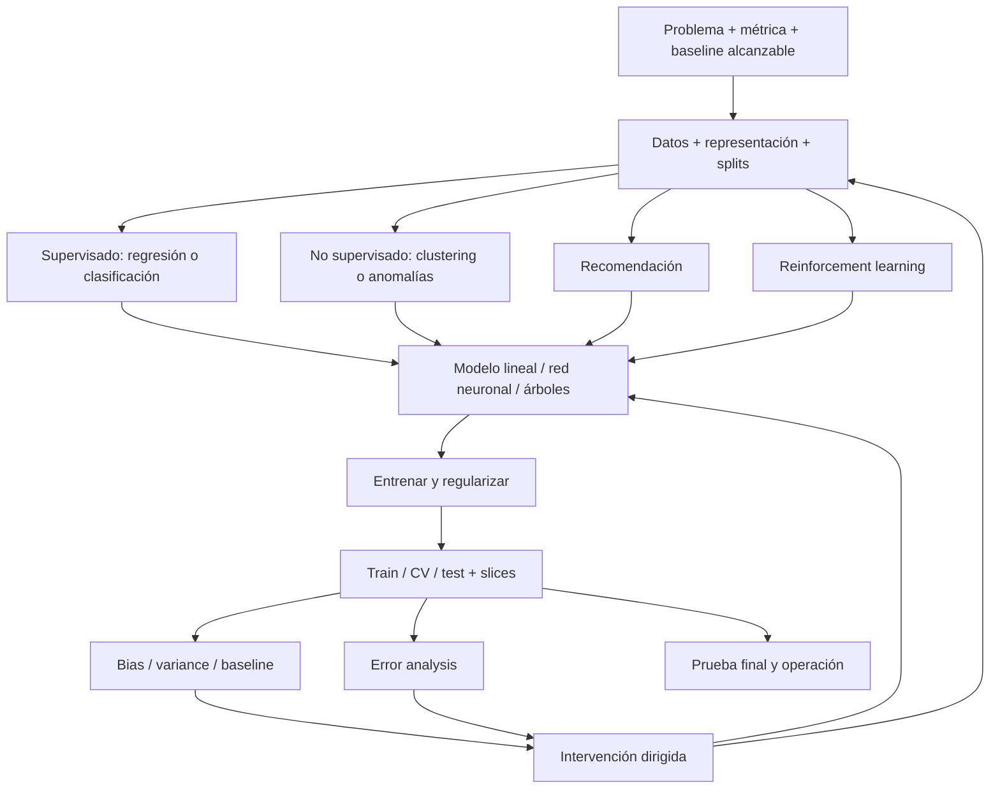

# Machine Learning Specialization + Mathematics for Machine Learning and Data Science — manual operativo

> **Estado:** *Machine Learning Specialization* y *Mathematics for Machine Learning and Data Science* completas, reconciliadas y auditadas.
> **Fuentes primarias:** Andrew Ng, *Machine Learning Specialization*; Luis Serrano, *Mathematics for Machine Learning and Data Science*; DeepLearning.AI + Stanford Online.
> **Cobertura verificada:** ML: 3 cursos, 10 semanas, 151 videos, 32 ejemplos de código y 42 evaluaciones; Matemáticas: 3 cursos, 11 semanas, 219 videos, 23 ejemplos de código y 20 evaluaciones.
> **Propósito:** referencia compacta para diseñar, implementar, diagnosticar y revisar sistemas de machine learning; prioriza decisiones que cambian código y resultados.

## Procedencia y límites

- **[NG]** síntesis fiel de una explicación de Andrew Ng o del contenido oficial; no significa transcripción literal.
- **[DLAI]** síntesis fiel de Luis Serrano o del contenido oficial de la especialización matemática; tampoco significa cita literal.
- **[IMPL]** traducción de esa enseñanza a código, pruebas, contratos o decisiones de ingeniería.
- **[EXT]** extensión profesional no atribuida al curso.
- Las evaluaciones no se reproducen ni se resuelven. Los laboratorios se representan por el patrón técnico que enseñan.
- La estructura completa de los 10 módulos y sus decisiones técnicas fue comprobada en la plataforma. El documento es una síntesis operacional, no una reproducción frase por frase.

## Cómo usar este documento

1. Para construir un baseline, usar **Pipeline mínimo correcto** y el bloque del algoritmo elegido.
2. Para mejorar un sistema, comenzar en **Diagnóstico que decide qué hacer después**.
3. Para aprender de fallos reales, ejecutar **Error analysis operativo** antes de cambiar arquitectura.
4. Para encargar implementación a Codex, copiar **Contrato para Codex** y completar sus campos.
5. Para deep learning avanzado, combinar este archivo con `DEEP_LEARNING_ANDREW_NG.md`; para producción, con `ML_PRODUCTION_LLMOPS_EVALUATION.md`.

## Mapa mental total



**[NG] Disciplina central:** el primer modelo rara vez alcanza el rendimiento deseado. El trabajo profesional consiste en usar diagnósticos para decidir qué cambio promete mayor impacto, repetir el ciclo y evitar meses de esfuerzo en una causa menor.

## Inventario compacto verificado

| Curso | Semana | Núcleo técnico |
|---|---:|---|
| 1. Supervised Machine Learning | 1 | definición de ML; supervisado/no supervisado; regresión lineal; costo; descenso por gradiente |
| 1 | 2 | múltiples variables; vectorización; escalado; tasa de aprendizaje; feature engineering; regresión polinómica |
| 1 | 3 | clasificación; regresión logística; frontera de decisión; log loss; regularización |
| 2. Advanced Learning Algorithms | 1 | intuición de redes; capas; forward propagation; TensorFlow; implementación NumPy; vectorización |
| 2 | 2 | entrenamiento; activaciones; multiclass/softmax; estabilidad numérica; Adam; backpropagation |
| 2 | 3 | train/CV/test; selección de modelo; bias/variance; learning curves; error analysis; datos; transfer learning; métricas con clases desbalanceadas |
| 2 | 4 | árboles; entropía e information gain; variables continuas/categóricas; regression trees; bagging; random forest; XGBoost |
| 3. Unsupervised, Recommenders, RL | 1 | K-means; anomalías gaussianas; evaluación y elección de features |
| 3 | 2 | collaborative filtering; content-based filtering; retrieval/ranking; ética; PCA |
| 3 | 3 | MDP; retorno; política; función Q; Bellman; DQN; replay buffer; target network; ε-greedy; soft updates |

Verificación adicional de plataforma:

- Curso 1 recorrido de punta a punta: 74 materiales, incluidos 42 videos.
- Curso 2: 95 materiales visibles, 77 gratuitos y 18 asociados a certificado/labs.
- Curso 3: 64 materiales visibles, 51 gratuitos y 13 asociados a certificado/labs.
- Los conteos de materiales incluyen videos, lecturas, quizzes y laboratorios; no deben confundirse con las 151 videolecciones oficiales.

## Pipeline mínimo correcto

| Fase | Decisión | Evidencia exigida |
|---|---|---|
| 1. Objetivo | qué salida cambia una decisión real | unidad de predicción, población, horizonte, costo de errores |
| 2. Baseline | qué nivel es alcanzable y qué sistema simple comparar | humano, sistema anterior, heurística o referencia experta |
| 3. Datos | qué representa cada fila y cuándo está disponible cada feature | esquema, linaje, leakage audit, distribución por slice |
| 4. Split | qué se usa para ajustar, decidir y estimar resultado final | train, cross-validation y test separados por la unidad causal correcta |
| 5. Modelo | cuál es la familia más simple compatible con el patrón | hipótesis, capacidad, regularización, costo computacional |
| 6. Entrenamiento | si costo y gradientes se comportan correctamente | curva de costo, finitud, shapes, micro-overfit, seed |
| 7. Diagnóstico | qué limita el rendimiento | baseline→train, train→CV, categorías de error, learning curves |
| 8. Intervención | qué cambio ataca esa causa | experimento controlado, ablation, métrica y presupuesto |
| 9. Selección | qué variante generaliza mejor | CV únicamente; test intacto hasta el cierre |
| 10. Entrega | si funciona bajo restricciones reales | test final, slices, latencia, memoria, reproducibilidad y rollback |

## 1. Fundamentos supervisados

### Regresión lineal

Hipótesis de una variable:

```text
f_w,b(x) = w x + b
```

Costo cuadrático medio usado para entrenar:

```text
J(w,b) = (1 / 2m) Σ_i (f_w,b(x_i) - y_i)^2
```

Actualización simultánea:

```text
w := w - α ∂J/∂w
b := b - α ∂J/∂b
```

**[NG]** La derivada indica dirección y magnitud local; `α` determina el tamaño del paso. Un costo que oscila o crece suele indicar una tasa excesiva o un bug. Un descenso muy lento puede justificar mayor `α`, mejor escalado o un optimizador distinto.

**[NG]** En *batch gradient descent*, cada actualización calcula el gradiente usando los `m` ejemplos. Las variantes mini-batch o stochastic usan subconjuntos; no mezclar sus curvas y frecuencias de actualización al comparar tasas de aprendizaje.

**[NG] Diagnóstico de `α`:** si el costo no disminuye ni siquiera con una tasa deliberadamente diminuta, sospechar primero un bug —por ejemplo, signo incorrecto—. Para elegir la tasa real, probar una progresión multiplicativa aproximada (`0.001`, `0.003`, `0.01`, …) hasta observar un extremo demasiado lento y otro inestable; elegir la mayor tasa que descienda rápida y consistentemente, o una ligeramente menor.

**[NG] Convergencia:** no adivinar un número universal de iteraciones. Graficar `J` después de cada actualización simultánea; detener cuando se estabilice. Un test automático `|ΔJ| < ε` es posible, pero elegir `ε` puede ser más difícil que inspeccionar la curva y establecer una tolerancia justificada.

**[NG] Geometría del objetivo:** el costo cuadrático de la regresión lineal es convexo y posee un único mínimo global; con una tasa adecuada, gradient descent converge hacia él. Esto no se generaliza a objetivos no convexos, que pueden contener mínimos locales. Aun con `α` fija, los pasos se reducen cerca de un mínimo porque el gradiente se aproxima a cero.

**[IMPL] Pruebas mínimas:**

- `J` debe ser escalar, finito y no negativo.
- actualizar `w` y `b` con gradientes calculados antes de modificar ninguno;
- comparar el gradiente analítico con diferencias finitas en un caso diminuto;
- exigir que un dataset sintético lineal recupere parámetros cercanos a los generadores;
- registrar costo inicial/final y no aceptar entrenamiento silencioso.

### Múltiples variables y vectorización

```text
f_w,b(x) = wᵀx + b
∂J/∂w_j = (1/m) Σ_i (f(x_i)-y_i)x_j^(i)
∂J/∂b   = (1/m) Σ_i (f(x_i)-y_i)
```

**[NG]** Vectorizar hace el código más corto y permite aprovechar operaciones numéricas optimizadas. Features con escalas muy distintas producen contornos alargados y pueden ralentizar el descenso.

**[NG] Ecuación normal:** puede resolver regresión lineal sin iteraciones ni elección de `α`, pero es específica de esta familia, no se extiende a otros algoritmos y se vuelve lenta con muchas features. En trabajo real puede aparecer dentro de implementaciones maduras; gradient descent conserva mayor generalidad y escalabilidad.

Estandarización habitual:

```text
x_j' = (x_j - μ_j) / σ_j
```

**[IMPL]** Ajustar `μ` y `σ` sólo con train; persistirlos; aplicar exactamente la misma transformación en CV, test y serving. Prohibir `fit_transform` fuera de train.

**[NG]** También pueden usarse división por máximo o mean normalization. El objetivo práctico no es forzar un intervalo exacto, sino evitar features con órdenes de magnitud muy distintos; rangos aproximados como `[-3,3]` o `[-0.3,0.3]` suelen ser razonables.

### Feature engineering y polinomios

**[NG]** Las features pueden expresar conocimiento del problema: combinar dimensiones, crear razones o usar potencias permite que un modelo lineal represente una relación no lineal en el espacio original.

**[IMPL]** Cada feature derivada necesita:

- definición matemática y unidad;
- disponibilidad en tiempo de inferencia;
- tratamiento de cero, nulos, infinito y extremos;
- prueba contra leakage temporal;
- ablation que demuestre valor en CV.

**[NG]** En regresión polinómica, escalar después de crear `x²`, `x³`, etc.; aun si `x` está acotada, sus potencias pueden diferir por muchos órdenes de magnitud. Validar además que la forma elegida respete comportamiento plausible del dominio fuera del rango observado.

### Regresión logística

```text
z = wᵀx + b
g(z) = 1 / (1 + e^-z)
f(x) = g(z)
ŷ = 1 si f(x) ≥ τ; de otro modo 0
```

Pérdida binaria:

```text
L(f,y) = -y log(f) - (1-y) log(1-f)
```

**[NG]** La salida sigmoide se interpreta entre 0 y 1; el umbral convierte score en decisión y debe elegirse por el costo de errores, no por costumbre.

**[IMPL]** Usar una implementación estable desde logits; no calcular `log(sigmoid(z))` manualmente para valores extremos. Separar la calibración del score de la política de umbral y comprobar calibración antes de tratar `0.7` como frecuencia empírica de 70%.

Frontera para un umbral `τ`:

```text
ŷ = 1 si sigmoid(z) ≥ τ
equivale a z ≥ log(τ / (1-τ))
para τ=0.5, la frontera es wᵀx+b = 0
```

**[NG]** Sin features transformadas, esa frontera es lineal; polinomios e interacciones permiten fronteras curvas. **[IMPL]** El umbral operativo cambia qué lado se clasifica como positivo y desplaza la frontera; no reentrenar sólo para cambiar un costo de decisión.

**[NG]** Binary cross-entropy es la forma compacta de la pérdida logística, tiene fundamento de máxima verosimilitud y produce un objetivo convexo para logistic regression. Sus gradientes se parecen a los de regresión lineal:

```text
∂J/∂w_j = (1/m) Σ_i (sigmoid(wᵀx_i+b)-y_i)x_ij
∂J/∂b   = (1/m) Σ_i (sigmoid(wᵀx_i+b)-y_i)
```

La diferencia decisiva está en `f(x)=sigmoid(wᵀx+b)`; mantener actualizaciones simultáneas, vectorizar y escalar features también aplica aquí.

### Regularización

```text
J_reg(w,b) = J(w,b) + (λ / 2m) Σ_j w_j²
```

**[NG]** Penalizar pesos reduce la influencia excesiva de features y combate overfitting. Un `λ` demasiado alto fuerza underfitting; uno demasiado bajo deja demasiada varianza.

**[NG]** Tres vías básicas contra overfitting son más datos pertinentes, selección de menos features y regularización. La selección puede descartar información útil; regularizar conserva las features pero reduce su influencia. En gradient descent regularizado, cada peso recibe además un factor de contracción aproximado `1-αλ/m` por paso.

**[IMPL]** Seleccionar `λ` con CV. No regularizar el sesgo salvo que la formulación elegida lo requiera explícitamente. Registrar la convención exacta porque librerías distintas escalan la penalización de modo diferente.

Gradiente regularizado para cada peso:

```text
∂J_reg/∂w_j = ∂J_data/∂w_j + (λ/m)w_j
```

## 2. Redes neuronales: implementación compacta

Para una capa `l`:

```text
z^[l] = W^[l] a^[l-1] + b^[l]
a^[l] = g^[l](z^[l])
```

**[IMPL] Convención de shapes:** son equivalentes `z = W @ a + b` con `W:(n_units,n_prev)` y `z = a @ W + b` con `W:(n_prev,n_units)`. El ejemplo NumPy del curso apila pesos por columnas; otros textos/frameworks usan filas. Declarar una convención y probarla: mezclar ambas puede producir resultados erróneos o broadcasting silencioso.

Contrato general de multiplicación:

```text
A:(m,k) @ W:(k,n) -> Z:(m,n)
Z[i,j] = dot(A[i,:], W[:,j])
```

**[NG]** Vectorizar una capa como `Z=A@W+b; A_out=g(Z)` reemplaza loops por multiplicaciones que CPU/GPU ejecutan eficientemente y fue esencial para escalar deep learning. **[IMPL]** Afirmar que coincidan las dimensiones internas `k`, que `b` tenga `(1,n)` o broadcasting deliberado y que la salida sea `(m,n)`.

**[NG]** Cada neurona aplica una función a las activaciones anteriores; una red compone capas para aprender representaciones. La inferencia es forward propagation; el entrenamiento agrega pérdida, gradientes y actualización.

**[NG] Límite de la analogía biológica:** las redes neuronales nacieron inspiradas de manera muy simplificada en neuronas biológicas, pero las redes actuales no son modelos fieles de cómo aprende el cerebro. No derivar decisiones de arquitectura de una imitación biológica especulativa: la práctica moderna prioriza principios de ingeniería y evidencia experimental. Su expansión se explica en gran parte por más datos, redes mayores y cómputo acelerado —incluidas GPU—, no por una comprensión completa del cerebro.

**[NG] Representation learning:** una red puede verse como un predictor cuya entrada final son features aprendidas por las capas anteriores. En visión, capas tempranas pueden responder a bordes, las siguientes a partes y las profundas a configuraciones mayores; al cambiar el dataset cambian las representaciones. No imponer nombres semánticos a neuronas ocultas salvo que una medición los sostenga.

**[IMPL]** Comparar features manuales y aprendidas mediante ablations. Inspeccionar activaciones ayuda a formular hipótesis, pero una visualización convincente no sustituye rendimiento en CV, robustness por slices ni tests causales de la representación.

**[NG] Inferencia en framework:** construir cada capa densa con su número de unidades y activación, aplicar la primera a `x` y alimentar cada activación a la siguiente. Los pesos aprendidos deben cargarse antes de inferir; convertir el score final en una clase mediante un umbral es una decisión posterior y opcional. **[IMPL]** Probar que el preprocesamiento, el orden de features, los pesos y el umbral de serving coincidan con entrenamiento.

**[NG] Datos y shapes:** TensorFlow espera normalmente batches como matrices `(m,n_features)`: un único ejemplo conserva shape `(1,n_features)`, no `(n_features,)`. Una capa con `u` unidades devuelve `(m,u)`; una salida escalar por ejemplo sigue siendo `(m,1)`. **[IMPL]** No depender de broadcasting implícito; afirmar rank, shape y dtype en los límites NumPy↔tensor.

**[NG] Receta de framework:** `Sequential` encadena capas, `compile` declara la pérdida/optimizador, `fit` minimiza el costo y `predict` ejecuta forward propagation. Usar librerías maduras en producción, pero comprender forward, loss, backprop y shapes para poder diagnosticar resultados inesperados.

**[NG] Computation graph y autodiff:** forward evalúa nodos de entradas a `J`; backprop recorre el grafo en sentido inverso y reutiliza derivadas mediante la regla de la cadena. Para un grafo con `N` operaciones y `P` parámetros, obtiene todos los gradientes en orden aproximado `N+P`, frente a perturbar cada parámetro con un costo del orden de `N×P`. **[IMPL]** Usar diferencias finitas sólo como prueba pequeña del backprop/autodiff, no como entrenador.

Selección de activación:

- `ReLU` como opción usual en capas ocultas;
- `sigmoid` para una salida binaria;
- `linear` para regresión sin cota;
- `ReLU` para regresión cuya salida sólo puede ser no negativa;
- `softmax` para clases mutuamente excluyentes.

**[NG]** ReLU es el default práctico en capas ocultas: es barata y evita las dos regiones saturadas de sigmoid que pueden ralentizar el gradiente. Activaciones alternativas sólo se justifican con evidencia.

Softmax:

```text
a_j = exp(z_j) / Σ_k exp(z_k)
```

**[IMPL] Estabilidad:** usar cross-entropy desde logits (`from_logits=True` o equivalente) o restar `max(z)` antes de exponenciar. La capa final queda lineal durante entrenamiento; aplicar sigmoid/softmax explícitamente cuando se necesiten probabilidades. Comprobar finitud; exigir suma aproximadamente uno sólo a softmax, nunca a sigmoides multilabel independientes.

**[NG] Multiclass versus multilabel:** softmax con `K` salidas y categorical cross-entropy corresponde a una sola clase entre `K`; cada probabilidad depende de todos los logits. Usar la variante *sparse* cuando `y` es un índice entero y la no sparse cuando es one-hot. Si un ejemplo puede tener varias etiquetas simultáneas, usar `K` sigmoides y pérdidas binarias —o clasificadores separados—, porque cada salida responde una pregunta binaria independiente. **[IMPL]** Hacer fallar el pipeline si la codificación de labels contradice esta semántica.

**[NG]** Adam adapta la escala de actualización por parámetro y suele converger más rápido que gradient descent básico; sigue necesitando una tasa de aprendizaje razonable y validación.

**[NG] Capas no densas:** una capa convolucional conecta cada unidad sólo con una región local. Esa estructura puede reducir cómputo, necesidad de datos y overfitting cuando la localidad es una propiedad real —imagen o señal temporal—. La arquitectura es una hipótesis sobre conectividad, no sólo una elección de cantidad de neuronas.

**[IMPL] Contrato de entrenamiento:**

```text
entrada -> transformación ajustada en train -> forward -> loss estable
       -> backward -> chequeo de gradientes/finitud -> optimizer step
       -> métricas train/CV -> checkpoint por criterio declarado
```

Puertas antes de ampliar la red:

- un batch atraviesa el pipeline con shapes declarados;
- el modelo sobreajusta un conjunto diminuto;
- loss y gradientes son finitos;
- labels y outputs usan la misma codificación;
- baseline lineal y heurístico están registrados;
- la complejidad mayor ataca un diagnóstico observado.

## 3. Diagnóstico que decide qué hacer después

Definir:

```text
E_base  = error del rendimiento alcanzable
E_train = error de entrenamiento
E_cv    = error de validación cruzada

bias_gap     = E_train - E_base
variance_gap = E_cv - E_train
```

| Señal | Diagnóstico dominante | Intervenciones candidatas |
|---|---|---|
| `bias_gap` grande | high bias / underfitting | mayor capacidad, mejores features, menor regularización, entrenar mejor |
| `variance_gap` grande | high variance / overfitting | más datos pertinentes, regularización, menor capacidad, augmentation válida |
| ambos grandes | bias y variance | resolver primero optimización/capacidad; luego generalización |
| gaps pequeños pero métrica inaceptable | baseline, labels, objetivo o distribución incorrectos | redefinir métrica/datos, revisar ruido irreducible y slices |

**[NG] Mapeo de intervenciones:** más datos, menos features o mayor `λ` atacan principalmente high variance; features adicionales, términos polinómicos o menor `λ` atacan high bias. Reducir el dataset para aparentar menor error de train no resuelve bias y suele empeorar generalización.

**[NG]** No se juzga `E_train` contra cero cuando la tarea contiene ambigüedad o ruido. Se compara con un nivel razonablemente alcanzable: desempeño humano, sistema anterior, competidor medible o estimación experta.

### Learning curves

Trazar `E_train(m)` y `E_cv(m)` al aumentar el tamaño de train.

- errores altos y cercanos que se estabilizan: más datos probablemente no resuelvan high bias;
- train bajo y CV sensiblemente mayor: más datos pueden reducir high variance;
- curvas aún cambiando: extrapolar con cautela y comprar datos por etapas;
- curvas anómalas: revisar split, duplicados, leakage, labels y pipeline.

**[NG]** Construir la curva exige reentrenar con varios tamaños de muestra y puede ser costoso; no siempre hace falta ejecutarla completa. Su valor principal es decidir si comprar más datos tiene una vía plausible de reducir el gap observado.

**[NG] Lectura correcta:** al crecer `m`, el error de train puede subir porque resulta más difícil ajustar todos los ejemplos, mientras el de CV suele bajar; normalmente `E_cv ≥ E_train`. Importan el nivel al que convergen y la brecha entre ambos, no que train empeore por sí solo.

**[NG] Redes grandes y diagnóstico:** con regularización apropiada, una red mayor suele igualar o superar a una menor; su daño principal puede ser costo de entrenamiento e inferencia. Una receta útil —no universal— es aumentar capacidad hasta reducir high bias y, si aparece un gap train→CV, buscar más datos pertinentes o regularización. Volver a medir porque el diagnóstico puede cambiar tras cada intervención.

### Selección de modelo y test

**[NG]** Train ajusta parámetros; CV elige grado, arquitectura, regularización e hiperparámetros; test estima una sola vez el rendimiento del procedimiento seleccionado. Elegir repetidamente con test lo convierte de hecho en otro conjunto de validación.

**[NG]** El costo optimizado puede incluir regularización, pero `J_train`, `J_cv` y `J_test` deben medir el error predictivo sin añadir esa penalización. En clasificación puede usarse pérdida o tasa de clasificación errónea, siempre que la definición sea idéntica entre splits.

**[IMPL]** Toda corrida debe guardar: versión de datos, split, seed, features, hiperparámetros, métrica primaria, slices, costo y hash del código.

**[NG]** Un diagnóstico puede llevar tiempo, pero evita inversiones mucho mayores en la intervención equivocada. No recolectar datos, agregar features, aumentar capacidad o cambiar `λ` antes de determinar si el límite dominante es bias, variance, baseline, labels o distribución.

## 4. Error analysis operativo

**[NG]** Después de bias/variance, revisar manualmente los errores de CV es uno de los diagnósticos más valiosos. Las categorías observadas muestran qué cambio puede afectar más casos y cuáles ideas tendrían impacto máximo pequeño.

### Protocolo

1. Congelar una versión del modelo y de CV.
2. Extraer falsos positivos, falsos negativos y errores de alta pérdida.
3. Si hay demasiados, muestrear al azar aproximadamente 100–200 casos; conservar el método y la seed.
4. Revisar cada ejemplo con contexto suficiente para decidir si el fallo es del modelo, label, dato, métrica o producto.
5. Crear categorías durante la revisión; permitir que un caso pertenezca a varias.
6. Contar frecuencia, severidad y slice; no quedarse con anécdotas.
7. Estimar techo de impacto: aun arreglando una categoría perfectamente, ¿cuánto puede mover la métrica?
8. Formular una intervención específica: datos dirigidos, feature, label policy, modelo, umbral o regla de producto.
9. Elegir por impacto esperado, costo, riesgo y capacidad de prueba.
10. Ejecutar una ablation, medir CV/slices/costo y convertir errores corregidos en regresiones permanentes.

Tabla mínima:

| `example_id` | real | predicción/score | categorías | severidad | slice | causa probable | intervención | ¿label dudoso? |
|---|---:|---:|---|---|---|---|---|---|

Priorización derivada:

```text
priority ≈ frecuencia × severidad × probabilidad_de_corrección
           / (costo × riesgo)
```

**[IMPL]** Esta fórmula organiza juicio; no pretende una probabilidad calibrada. Documentar supuestos y sensibilidad.

### Anti-patrones

- recolectar “más datos de todo” sin saber qué errores dominan;
- desarrollar una feature sofisticada para una categoría rara;
- elegir sólo ejemplos llamativos y perder representatividad;
- usar test para explorar errores durante el desarrollo;
- mezclar label errors con model errors;
- celebrar la métrica global mientras un slice crítico empeora;
- cambiar varias causas simultáneamente y perder atribución.

## 5. Ciclo iterativo de desarrollo

```text
arquitectura inicial
-> implementar y entrenar
-> medir baseline/train/CV/slices
-> bias/variance + error analysis
-> elegir una causa controlable
-> cambiar modelo, datos o features
-> volver a medir
```

**[NG]** Elegir una dirección prometedora puede acelerar un proyecto de forma radical frente a invertir meses en una idea de impacto pequeño. Los diagnósticos deben preceder a la intervención.

Registro de experimento:

```yaml
hypothesis: ""
observed_failure: ""
diagnostic_evidence: ""
single_change: ""
primary_metric: ""
guardrails: []
slices: []
compute_budget: ""
expected_result: ""
actual_result: ""
decision: keep|revert|investigate
```

## 6. Ingeniería de datos dirigida

**[NG]** Si error analysis identifica una categoría dominante, obtener más ejemplos de esa categoría puede rendir mucho más que ampliar indiscriminadamente todo el dataset.

### Tres mecanismos

- **Recolección dirigida:** buscar y etiquetar ejemplos del slice problemático.
- **Data augmentation:** transformar un ejemplo preservando su label.
- **Síntesis:** crear ejemplos nuevos cuando sea posible modelar el proceso generador con suficiente realismo.

Regla de validez:

```text
transformación válida = preserva el label
                     ∧ representa variaciones esperables en operación/test
```

**[NG]** Ruido aleatorio sin parecido con la distribución objetivo suele ser menos útil. Augmentation debe imitar distorsiones plausibles: rotaciones/warping en visión, ruido ambiental o canal degradado en audio, etc.

**[IMPL]** Para datos tabulares o temporales, no trasladar augmentations de imagen por analogía. Definir invariantes del dominio y probar que la transformación no introduce futuros, viola conservación ni cambia el target.

**[NG]** Un enfoque data-centric mejora de forma sistemática la información que alimenta algoritmos ya maduros: consistencia de labels, cobertura de slices, ejemplos dirigidos y representaciones apropiadas.

### Transfer learning

**[NG]** Preentrenar en una tarea relacionada con más datos y ajustar en la tarea objetivo puede producir una gran mejora cuando el dataset objetivo es pequeño, siempre que las entradas compartan estructura útil.

**[IMPL]** Comparar contra entrenamiento desde cero; decidir qué capas congelar; usar menor learning rate al ajustar; vigilar negative transfer y mismatch.

**[NG]** El preentrenamiento y la tarea objetivo deben compartir el tipo de entrada útil —imagen con imagen, audio con audio, texto con texto—. Con muy pocos ejemplos puede convenir congelar el backbone y entrenar sólo la cabeza; con más datos, ajustar todas las capas desde los pesos preentrenados.

## 7. Métricas para clases desbalanceadas

```text
precision = TP / (TP + FP)
recall    = TP / (TP + FN)
F1        = 2PR / (P + R)
```

**[NG]** Accuracy puede ocultar fracaso cuando la clase positiva es rara. Mover el umbral intercambia precision y recall; la elección depende del costo relativo de falsos positivos y falsos negativos.

**[IMPL]** Reportar matriz de confusión, PR curve, métrica por slice y volumen absoluto de decisiones. Estimar candidatos de umbral con CV, pero declarar primero el costo o utilidad que define el punto aceptable: CV no puede inventar esa preferencia. Usar F1 sólo cuando ponderar precision y recall simétricamente represente el objetivo. Bloquear el umbral antes de test.

## 8. Árboles y ensembles

Entropía binaria:

```text
H(p) = -p log₂(p) - (1-p) log₂(1-p)
```

Information gain:

```text
IG = H(parent) - [w_left H(left) + w_right H(right)]
```

**[NG]** Un árbol elige splits que aumentan pureza; las condiciones de parada controlan complejidad. Una categórica con `K` valores puede convertirse en `K` indicadores one-hot. Para una continua, ordenar valores, evaluar como candidatos los puntos medios entre observaciones y escoger el umbral con mayor information gain.

**[NG]** Si el mejor information gain queda por debajo de un umbral útil, continuar dividiendo añade tamaño y riesgo de overfitting sin suficiente reducción de impureza.

**[NG] Construcción recursiva:** en cada nodo, evaluar splits, elegir el mayor information gain, repartir ejemplos y repetir sobre cada hijo. Detener por pureza, profundidad máxima, ganancia mínima o cantidad mínima de ejemplos. Mayor profundidad aumenta capacidad y riesgo de overfitting; validar los controles de complejidad.

Ensembles:

- bagging entrena árboles sobre muestras bootstrap del mismo tamaño: se muestrea con reemplazo, por lo que algunos ejemplos se repiten y otros no aparecen;
- random forest además restringe features por split para diversificar;
- boosted trees entrenan secuencialmente para corregir errores anteriores;
- XGBoost añade una implementación eficiente, regularización y opciones prácticas.

**[IMPL]** En tabular, comparar siempre baseline lineal, árbol y boosted trees antes de justificar una red. Auditar leakage, importancias inestables, calibración, latencia y degradación por datos faltantes.

**[NG]** En random forest, cada nodo considera un subconjunto aleatorio de features —una heurística común es aproximadamente `sqrt(n_features)`—. Decenas o alrededor de cien árboles suelen capturar la mayor ganancia; más árboles no suelen perjudicar la métrica, pero presentan retornos decrecientes y mayor costo.

**[NG]** Un árbol aislado puede cambiar por completo ante una modificación mínima del dataset. Un ensemble agrega árboles distintos mediante voto o promedio y reduce la dependencia de cualquier estructura individual; la diversidad de los árboles es parte del mecanismo, no ruido que deba eliminarse.

**[NG] Regression tree:** cada hoja predice la media de los targets que llegaron a ella. El split elige la mayor reducción de varianza, análoga a la reducción de entropía en clasificación.

### Matriz de elección verificada

| Condición | Preferencia inicial | Razón `[NG]` |
|---|---|---|
| tabular/estructurado, clasificación o regresión | ensemble de árboles; normalmente XGBoost | entrenamiento rápido y desempeño competitivo |
| imagen, audio, video o texto | red neuronal | aprovecha estructura no organizada como tabla |
| datos mixtos o transferencia desde gran preentrenamiento | red neuronal | transferencia y entrenamiento conjunto de componentes |
| presupuesto extremadamente restringido | árbol pequeño | puede ser más barato y, si es realmente pequeño, interpretable |
| ensemble grande | no prometer interpretabilidad directa | cientos de árboles con cientos de nodos dejan de ser legibles |

**[NG]** Entrenar rápido importa porque acorta el ciclo `modelo → diagnóstico → intervención`. La familia no se elige sólo por accuracy final, sino también por la velocidad con que permite aprender del sistema.

## 9. Aprendizaje no supervisado y anomalías

### K-means

```text
repetir:
  asignar cada x al centroide más cercano
  reemplazar cada centroide por la media de sus puntos
```

Objetivo:

```text
J = (1/m) Σ_i ||x_i - μ_c(i)||²
```

**[NG]** K-means puede converger a óptimos locales; usar múltiples inicializaciones y conservar la de menor costo. Elegir `K` por utilidad del downstream, conocimiento del problema o elbow cuando sea informativo.

**[NG]** El *elbow* es sólo una pista y muchas curvas de distorsión decrecen suavemente sin un codo claro. No forzar una interpretación: comparar valores de `K` mediante el trade-off real de calidad, costo y utilidad posterior.

**[NG]** Clustering trabaja sólo con `x`, sin labels `y`, y busca estructura por similitud. K-means puede ser útil incluso sin grupos naturalmente separados —por ejemplo, para diseñar talles representativos—; el cluster no debe interpretarse automáticamente como una clase real del mundo.

**[NG]** Inicializar cada centroide con un ejemplo de train elegido al azar (`K < m`), no con un punto arbitrario del espacio. Repetir con seeds distintas. Minimizar `J` no sirve para escoger `K`, porque la distorsión casi siempre cae al añadir clusters; decidir `K` por el trade-off del uso posterior.

**[NG] Invariante de depuración:** cada asignación al centroide más cercano y cada actualización al promedio de su cluster no puede aumentar la distorsión. Si `J` sube entre iteraciones, existe un bug; si deja de bajar, el algoritmo convergió o alcanzó precisión suficiente.

**[NG] Cluster vacío:** si ningún ejemplo queda asignado a `μ_k`, la media no está definida. Eliminar ese cluster es una salida común; si el producto exige exactamente `K`, reinicializarlo con una política declarada y volver a comprobar costo, estabilidad y utilidad.

### Anomaly detection

Modelo independiente básico:

```text
p(x) = Π_j Normal(x_j; μ_j, σ_j²)
anomalía si p(x) < ε
```

Estimación con train normal:

```text
μ_j  = (1/m) Σ_i x_j^(i)
σ_j² = (1/m) Σ_i (x_j^(i) - μ_j)²
p(x) = Π_j [1 / √(2πσ_j²)] exp(-(x_j-μ_j)² / (2σ_j²))
```

**[NG]** El producto modela cada feature con su propia gaussiana y suele funcionar incluso cuando la independencia no es exacta. Una sola densidad marginal extremadamente pequeña puede reducir mucho `p(x)`. Elegir features indicativas, ajustar `μ,σ²` sólo con train normal y seleccionar `ε` con CV etiquetado.

**[NG]** Ajustar la distribución con ejemplos normales, usar CV con anomalías conocidas para elegir `ε` y features, y reservar test para evaluación final. Es preferible a supervisado cuando hay muy pocas anomalías positivas y aparecen tipos nuevos; supervisado gana cuando hay suficientes positivos representativos y patrones recurrentes.

**[NG]** La diferencia no es sólo el conteo: anomaly detection modela normalidad para encontrar fallos todavía no vistos; supervisado aprende cómo se parecen los positivos futuros a positivos históricos. Pueden coexistir —supervisado para defectos conocidos y anomalías para modos nuevos—.

**[IMPL]** Transformar features muy sesgadas, eliminar redundancia extrema, vigilar drift y evaluar recall a un presupuesto explícito de falsas alarmas.

**[NG]** En fraude, fabricación o infraestructura, un score anómalo normalmente activa revisión, inspección o autenticación adicional; por sí solo no prueba fraude o avería. **[IMPL]** Tratar `p(x)` como densidad/model score para ordenar y umbralizar, no como probabilidad calibrada de que el evento sea correcto o fraudulento.

**[NG]** Inspeccionar histogramas y, si ayuda al ajuste gaussiano, probar transformaciones como `log(x+c)` o potencias. Aplicar exactamente la misma transformación fuera de train. Después revisar anomalías omitidas: preguntar qué propiedad humana las hace extrañas y convertir esa propiedad en una feature —por ejemplo una razón entre dos mediciones—.

## 10. Recommender systems

### Collaborative filtering

```text
ŷ(i,j) = w_jᵀ x_i + b_j
```

Aprende vectores de item `x_i` y usuario `w_j` usando interacciones observadas, con regularización. Mean normalization ayuda cuando algunos usuarios o items tienen pocas calificaciones.

**[NG]** La máscara `R(i,j)` distingue pares observados de faltantes: el objetivo sólo suma ratings conocidos. Collaborative filtering aprende simultáneamente preferencias de usuarios y features de items porque múltiples usuarios califican items compartidos; content-based, en cambio, parte de features laterales de ambos lados para aprender el match.

Objetivo compacto sobre pares observados `R(i,j)=1`:

```text
J = 1/2 Σ_(i,j:R=1) (w_jᵀx_i + b_j - y_ij)²
    + λ/2 Σ_j ||w_j||² + λ/2 Σ_i ||x_i||²
```

**[NG]** Aquí también se aprenden las features latentes de los items: las valoraciones compartidas por múltiples usuarios permiten optimizar conjuntamente vectores de usuarios e items.

Para feedback binario observado:

```text
P(y_ij=1) = sigmoid(w_jᵀx_i + b_j)
J = Σ_(i,j:R=1) BCE(y_ij, P(y_ij=1)) + regularización
```

**[NG]** `1` puede significar click, compra, favorito o permanencia después de una exposición; `0`, no interacción después de haber sido mostrado; y desconocido, que el usuario no fue expuesto. Un par no observado no es automáticamente negativo. **[IMPL]** Registrar impresión, política de exposición y definición temporal del label: sin ello el dataset confunde preferencia con oportunidad de observar.

Mean normalization por item:

```text
μ_i = media de ratings observados del item i
y'_ij = y_ij - μ_i
ŷ_ij = w_jᵀx_i + b_j + μ_i
```

**[NG]** Así, un usuario nuevo sin historial recibe inicialmente el promedio de cada item en vez de cero. No resuelve por sí solo un item completamente nuevo; para eso se necesitan contenido, exploración u otra política de cold start.

Ítems relacionados por features latentes:

```text
d²(i,k) = ||x_i - x_k||²
vecinos(i) = K items con menor d²
```

**[NG]** Las coordenadas latentes individuales suelen ser difíciles de interpretar, pero el vector completo conserva similitud útil. Recuperar varios vecinos permite construir “ítems similares”; collaborative filtering sigue limitado por cold start y por no incorporar naturalmente información lateral.

**[NG] Implementación de objetivo personalizado:** cuando el algoritmo no encaja en capas estándar, implementar explícitamente `J(X,W,b)`, registrar los parámetros como variables, obtener gradientes por autodiferenciación y aplicarlos con Adam. **[IMPL]** Verificar la máscara `R`, la regularización y los gradientes en un caso diminuto; que el framework derive no garantiza que el objetivo esté bien formulado.

### Content-based filtering

Aprende representaciones de usuario e item desde sus features y usa similitud, por ejemplo dot product, para puntuar pares. Facilita recomendaciones para items nuevos con metadatos.

**[NG] Arquitectura two-tower:** una red transforma features del usuario en `v_u` y otra transforma features del item en `v_i`; sus capas internas pueden diferir, pero sus salidas deben tener la misma dimensión. Normalizar ambos vectores a norma L2 igual a uno puede mejorar el aprendizaje. El score es `v_uᵀv_i` —o sigmoid del producto para labels binarios— y ambas torres se entrenan juntas con la pérdida de pares observados.

**[NG]** Las features de entrada de usuario e item pueden tener dimensiones y significados distintos; sólo los embeddings finales deben coincidir. Entrenar ambas torres con una única pérdida conjunta. Los embeddings de items y sus vecinos pueden precomputarse; aun con deep learning, el diseño de features laterales sigue siendo trabajo de alto impacto.

### Arquitectura de gran catálogo

```text
retrieval de candidatos -> ranking preciso -> filtros/reglas -> presentación
```

**[NG]** Recuperar todo el catálogo puede ser demasiado costoso; primero se generan candidatos por múltiples fuentes y después se rankean con un modelo más rico.

**[NG]** Las representaciones de items pueden precomputarse; al llegar un usuario se calcula su vector una vez y se puntúan sólo los candidatos recuperados. Aumentar candidatos suele mejorar cobertura y relevancia, pero eleva latencia: elegir el tamaño con experimentos offline, no por intuición.

**[IMPL]** Separar objetivos de corto plazo de valor para usuario; medir diversidad, novelty, cobertura, cold start, sesgo de exposición y feedback loops. Registrar por qué un candidato entró y por qué obtuvo su score.

**[NG]** El objetivo elegido determina el comportamiento y el daño posible: maximizar clicks, margen o tiempo de permanencia no equivale a servir al usuario. Revisar feedback loops, filtrar usos dañinos, explicar el criterio de recomendación cuando sea posible e incorporar perspectivas diversas antes de desplegar.

### Práctica pública xAI — retrieval y ranking de Phoenix

**[CODE] Frontera de evidencia.** Esta sección deriva del código y la documentación públicos de `xai-org/x-algorithm` fijados en el commit `28e414f535e4b5a50ca12ee87674e7649e50c7ad` —licencia Apache-2.0—, especialmente `README.md`, `phoenix/README.md`, `phoenix/TRAINING.md` y el código de `phoenix/xrex`. Describe patrones observables de la publicación, no la totalidad de la plataforma interna de X/xAI ni resultados de calidad o escala que el repositorio no permite reproducir.

**[CODE] Pipeline observable:**

```text
fuentes in-network + fuentes out-of-network
→ retrieval paralelo (Phoenix/otras fuentes)
→ hydration de usuario, historial y candidatos
→ filtros previos
→ ranking Transformer multiacción
→ combinación explícita de scores
→ diversidad/ajustes y top-K
→ visibilidad/eligibilidad
→ mezcla de superficies y side effects
```

La lección transferible es separar responsabilidades y conservar provenance por candidato: fuente, versión de features, filtros aplicados, scores por objetivo, score compuesto y motivo de descarte. Que una publicación no sea elegible no es una puntuación baja; ranking decide orden y visibility decide si puede mostrarse.

#### Identidad semántica y cold start de contenido

**[CODE]** Phoenix representa posts mediante **semantic IDs** obtenidos de un embedding multimodal y cuantización residual: seis códigos discretos, cada uno en `[0,256)`. Cada nivel cuantiza el residuo que dejaron los anteriores; no equivale a asignar una clase humana ni garantiza identidad estable entre versiones del codebook.

```text
z = encoder(contenido_multimodal)
residuo_0 = z
para nivel l:
  sid_l = argmin_k ||residuo_l - codebook_l[k]||²
  residuo_(l+1) = residuo_l - codebook_l[sid_l]
```

**[IMPL] Gate:** versionar encoder, codebooks y asignaciones; medir error de reconstrucción, estabilidad temporal, cobertura, colisiones funcionales y calidad downstream. Comparar contra IDs hash y embeddings continuos. Nunca mezclar semantic IDs producidos por codebooks incompatibles ni interpretar cercanía de códigos como semántica sin evaluación.

#### Ranking consistente mediante aislamiento de candidatos

**[CODE]** En el ranker publicado, usuario e historial forman contexto compartido; cada candidato puede atender ese contexto y a sí mismo, pero no a otros candidatos. Así el score de un item no cambia sólo porque otro item entró en el mismo batch, propiedad útil para cache, reproducibilidad y pruebas.

```text
contexto ↔ contexto
candidato_i → contexto + candidato_i
candidato_i ↛ candidato_j, para i ≠ j
```

**[IMPL] Tests:** permutar candidatos, añadir un candidato irrelevante y cambiar batch packing no deben alterar logits de los candidatos originales más allá de la tolerancia numérica. Verificar la máscara tanto en entrenamiento como en serving y probar que ningún índice/padding permite atención cruzada accidental.

#### Secuencias irregulares y objetivos múltiples

**[CODE]** Phoenix empaqueta varias secuencias en una fila física y usa atención variable-length para evitar pagar padding como tokens reales. El modelo predice múltiples acciones binarias y señales continuas como dwell time. Los pesos de ranking multiplican probabilidades predichas o valores continuos predichos; no multiplican conteos brutos de eventos.

```text
score(u,i) = Σ_a weight_a · prediction_a(u,i) + ajustes declarados
```

**[IMPL]** Para cada cabeza declarar label, ventana, elegibilidad, pérdida, calibración, peso, signo y métrica. Auditar conflictos entre objetivos y sensibilidad del orden a los pesos. Sequence packing exige offsets/lengths correctos, máscara sin fuga entre sesiones y equivalencia contra una implementación densa en casos pequeños.

#### Optimización y límite de la publicación

**[CODE]** El entrenamiento publicado combina un optimizador denso —la configuración principal de ranking incluye Muon— con sparse rowwise AdaGrad para filas de embeddings referenciadas. También ofrece datos sintéticos deterministas, checkpoint/restore y una ruta retrieval→ranking por gRPC. Eso demuestra una composición ejecutable, no que Muon sea universalmente superior ni que el harness sintético reproduzca calidad, tráfico, fiabilidad o costo de producción.

**Contrato para Codex al construir un recomendador:**

1. fijar catálogo, unidad de exposición, historia disponible y freshness;
2. conservar un oracle exacto en un catálogo pequeño antes de ANN/retrieval aproximado;
3. probar invariancia del ranker a composición y packing del batch;
4. medir recall@K de retrieval y calidad/calibración/slices del ranking por separado;
5. reportar latencia y goodput por etapa, tamaño del funnel y costo por request;
6. evaluar objetivos positivos, negativos y continuos con guardrails de diversidad, seguridad y producto;
7. separar ranking, eligibility/visibility y presentación en contratos auditables;
8. desplegar pesos, codebooks, índice y modelo como artefactos compatibles y reversibles.

Fuentes fijadas: [arquitectura For You](https://github.com/xai-org/x-algorithm/blob/28e414f535e4b5a50ca12ee87674e7649e50c7ad/README.md), [Phoenix](https://github.com/xai-org/x-algorithm/blob/28e414f535e4b5a50ca12ee87674e7649e50c7ad/phoenix/README.md) y [entrenamiento](https://github.com/xai-org/x-algorithm/blob/28e414f535e4b5a50ca12ee87674e7649e50c7ad/phoenix/TRAINING.md).

#### Contraste público Meta — dos topologías válidas

**[PROD]** Meta documenta dos decisiones complementarias que impiden convertir la arquitectura xAI en dogma:

- **Index-as-Model/SilverTorch:** ANN, eligibility, scoring y reranking se expresan como módulos tensor-in/tensor-out dentro de un modelo PyTorch compilable, reduciendo fronteras/movimiento y permitiendo GPU co-design. Es apropiado cuando la composición unificada mejora goodput/costo/calidad bajo el mismo SLO; concentra blast radius y exige equivalencia, actualización de índices y observabilidad internas.
- **modelo offline + ranker online:** una representación pesada de historial se calcula asincrónicamente y el ranker online la combina con señales frescas y candidato/contexto. Permite escalar profundidad offline sin cargar toda la latencia en cada request, pero introduce staleness, lineage, refresh y fallback como contratos.

**[IMPL] Decisión:** comparar microservicios, modelo unificado y offline/online con el mismo catálogo, calidad, freshness, top-K, end-to-end p99, goodput, memoria, costo, failure isolation y velocidad de cambio. No elegir por número publicado: los resultados de Meta pertenecen a su workload y hardware.

Fuentes: [SilverTorch](https://engineering.fb.com/2026/05/26/ml-applications/silvertorch-index-as-model-new-retrieval-paradigm-recommendation-systems/) y [multi-stage sequence modeling](https://engineering.fb.com/2026/08/05/ml-applications/from-user-sequences-to-scaling-laws-a-multi-stage-architecture-for-metas-ads-ranking/).

## 11. PCA

**[NG]** PCA encuentra ejes que capturan gran variación y proyecta los datos a menos dimensiones. Puede servir para visualización y compresión, pero no debe usarse automáticamente para prevenir overfitting.

**[IMPL]** Estandarizar cuando las escalas no son comparables; ajustar PCA sólo en train; elegir componentes por varianza explicada y rendimiento downstream; conservar un baseline sin PCA.

**[NG]** Centrar cada feature en cero antes de PCA y escalar cuando las unidades difieren. Cada componente es un eje unitario; `z = Uᵀx` proyecta y `x_hat = Uz` reconstruye aproximadamente. PCA trata todas las `x` simétricamente y no usa `y`; no es regresión lineal.

**[NG] Flujo en código:** escalar si los rangos difieren; `fit` obtiene los ejes y centra automáticamente en implementaciones como scikit-learn; revisar `explained_variance_ratio_`; y `transform` proyecta. Hoy su uso más habitual es visualizar datos en dos o tres dimensiones. Compresión y aceleración de modelos supervisados fueron usos más comunes en algoritmos antiguos; no asumir que PCA ayudará a una red moderna, porque también añade costo y puede descartar señal útil.

## 12. Reinforcement learning

Elementos:

```text
state s, action a, reward r, discount γ, policy π, return
G_t = r_t + γr_(t+1) + γ²r_(t+2) + ...
```

**[NG]** RL se usa cuando es difícil proporcionar la acción correcta para cada estado, pero sí puede evaluarse el resultado mediante una recompensa. La recompensa declara *qué* comportamiento se desea, no *cómo* lograrlo; diseñarla exige representar éxitos, fallos, costo y seguridad sin atajos indeseados.

```text
transición: (s, a, r, s', done)
política:   a = π(s)
objetivo:   maximizar E[G_t]
```

**[NG]** Un estado terminal entrega su recompensa final y corta el episodio. Un MDP asume que el futuro depende del estado actual, no del camino usado para llegar. En un entorno estocástico, `s'` y el retorno son aleatorios: se maximiza el retorno esperado, no una trayectoria afortunada.

**[NG]** `γ` cercano a uno valora más recompensas lejanas; uno menor favorece resultados inmediatos. También posterga el peso de recompensas negativas. La política óptima puede cambiar radicalmente al modificar `γ` o el reward, por lo que ambos forman parte de la especificación del producto, no son meros hiperparámetros.

**[NG]** Los estados prácticos suelen ser vectores continuos —posición, velocidad, orientación, contactos— y pueden mezclar variables continuas y binarias. El contrato del estado debe contener suficiente información para sostener aproximadamente la propiedad de Markov.

Ecuación de Bellman para la función acción-valor óptima:

```text
Q*(s,a) = E[r + γ max_a' Q*(s',a')]
```

**[NG]** `Q*(s,a)` es el retorno esperado al tomar `a` una vez en `s` y actuar óptimamente después. Si se conoce, la política óptima elige `argmax_a Q*(s,a)`. Esta relación transforma el problema de control en aprender valores de acciones, pero no elimina los riesgos de estimación o exploración.

Deep Q-learning aproxima `Q(s,a)` con una red y entrena contra un target Bellman.

```text
observar transición (s,a,r,s')
guardar en replay buffer
muestrear mini-batch
y = r                         si terminal
    r + γ max_a' Q_target(s',a') en otro caso
minimizar (Q_online(s,a) - y)²
actualizar target gradualmente
```

**[NG]** Los targets se construyen a partir de experiencia, convirtiendo temporalmente RL en un problema supervisado sobre pares `(entrada, target)`. El replay buffer limita memoria, reutiliza transiciones y permite muestrearlas sin depender sólo de la secuencia más reciente.

Estabilizadores centrales:

- replay buffer para reducir correlación entre muestras;
- target network para que el objetivo cambie más lentamente;
- `ε`-greedy para equilibrar exploración y explotación;
- mini-batches y soft updates para entrenamiento más estable.

Soft update de una target network:

```text
θ_target := τ θ_new + (1-τ) θ_target, con τ pequeño
```

**[NG]** Sustituir de golpe la función Q por una estimación nueva y ruidosa puede provocar oscilación o divergencia; aceptar gradualmente los parámetros mejora la estabilidad.

**[NG]** Una Q-network eficiente recibe `s` y produce en una sola inferencia `Q(s,a)` para todas las acciones discretas; evita repetir la red por acción y acelera tanto `argmax` como el target de Bellman.

**[NG]** En `ε`-greedy se actúa aleatoriamente con probabilidad `ε` y de forma greedy el resto. Puede comenzarse con exploración alta y reducirla gradualmente. RL es especialmente sensible: una mala elección puede multiplicar el tiempo de aprendizaje o impedirlo, no sólo hacerlo un poco más lento.

**[NG]** RL es potente pero difícil de hacer funcionar, dependiente del reward y de muchas decisiones de implementación; el curso lo presenta como fundamento, no como garantía de aplicación universal. Un resultado en simulación o videojuego no prueba funcionamiento físico: la transferencia al mundo real puede ser sorprendentemente difícil. En aplicaciones actuales, supervisado y no supervisado son herramientas útiles con mucha mayor frecuencia.

**[IMPL] Auditoría del reward:** simular políticas triviales y adversariales; verificar que sobrevivir, demorar una penalización, explotar un estado terminal o repetir una acción barata no produzca retornos altos por accidente. Reportar media, dispersión, peores episodios, restricciones violadas y sensibilidad a `γ`, no sólo el mejor retorno.

**[EXT]** En mercados, no desplegar una política que opere capital por haber superado un simulador. Se requieren microestructura fiel, costos, slippage, latencia, límites, off-policy evaluation, paper trading y controles independientes.

## 13. Aplicación a sistemas de baja latencia

La especialización enseña cómo aprender y diagnosticar; no enseña programación lock-free, kernel bypass ni microestructura de exchanges.

**[EXT] Separación recomendada:**

```text
hot path determinista:
feed -> decode -> validate sequence -> update order book -> metrics/rules

cold path analítico:
events/snapshots -> features -> modelo -> explicación/alerta -> evaluación
```

- Mantener Python/ML fuera del camino que actualiza el book si rompe el presupuesto de latencia.
- Usar ML para clasificación, detección de anomalías, comprensión de régimen o priorización, con outputs acotados y observables.
- Medir `p50/p95/p99/max`, asignaciones, colas, drops y staleness además de precisión.
- Tratar ordering, gaps de secuencia y timestamps como contratos del sistema, no como features opcionales.
- Validar modelos por período y régimen; nunca usar futuros al construir features o splits.

## 14. Runbook de fallo

1. Reproducir el fallo con versión de datos/modelo y seed.
2. Verificar esquema, units, labels, leakage, shapes, NaN/Inf y equivalencia train/serve.
3. Comparar contra baseline alcanzable, train y CV.
4. Diagnosticar bias/variance y revisar learning curves.
5. Ejecutar error analysis estratificado por tipo, severidad y slice.
6. Estimar el impacto máximo de cada categoría.
7. Elegir una intervención que ataque una causa; definir métrica y guardrails antes de correr.
8. Medir ablation y costo; revertir si no mejora el criterio predefinido.
9. Convertir los casos corregidos en pruebas de regresión.
10. Tocar test sólo cuando el procedimiento quede congelado.

## 14.1 Puerta ética previa al despliegue

**[NG]** No existe un checklist mecánico que garantice ética, pero sí una disciplina preventiva:

1. reunir perspectivas diversas y anticipar daños, especialmente sobre grupos vulnerables;
2. consultar estándares y guías del sector;
3. convertir cada riesgo identificado en un slice o auditoría medible antes de desplegar;
4. corregir los problemas encontrados, no aceptarlos como promedio global;
5. preparar mitigación y rollback antes del incidente;
6. monitorear daño después del despliegue y actuar con rapidez;
7. abandonar un proyecto cuando su caso económico depende de un uso que empeora la vida de las personas.

## 15. Contrato para Codex

```markdown
### Objetivo
- Decisión real que soporta:
- Unidad de predicción:
- Población/horizonte:

### Datos
- Esquema, unidades y linaje:
- Disponibilidad en inferencia:
- Split y prevención de leakage:
- Slices críticos:

### Baselines
- Rendimiento alcanzable:
- Heurística/modelo simple:
- Métrica primaria y guardrails:

### Diagnóstico actual
- E_base / E_train / E_cv:
- Bias gap / variance gap:
- Learning-curve evidence:
- Categorías de error con conteos:

### Cambio autorizado
- Hipótesis causal:
- Única intervención:
- Presupuesto de cómputo/latencia/memoria:

### Entregables
- Código modular y configuración reproducible.
- Tests unitarios, golden cases y prueba anti-leakage.
- Entrenamiento/evaluación deterministas dentro de lo posible.
- Reporte global, por slice, error analysis y costo.
- Decisión keep/revert con evidencia.

### Restricciones
- No usar test para iterar.
- No aumentar complejidad sin diagnóstico.
- No mezclar cambios en datos y modelo en la misma ablation.
- No atribuir extensiones [IMPL]/[EXT] a Andrew Ng.
```

## 16. Checklist senior de aceptación

- [ ] El objetivo y el costo de cada error están definidos.
- [ ] Existe baseline alcanzable y baseline implementado.
- [ ] Train/CV/test respetan tiempo, entidad y causalidad.
- [ ] Toda transformación se ajusta sólo con train.
- [ ] El pipeline pasa micro-overfit, finitud, shapes y golden cases.
- [ ] La familia de modelo se compara contra una alternativa simple.
- [ ] `E_base`, `E_train` y `E_cv` están registrados.
- [ ] Bias/variance conduce la siguiente acción.
- [ ] Los errores de CV fueron revisados y cuantificados.
- [ ] Datos adicionales apuntan a categorías útiles.
- [ ] Umbral y métrica reflejan costos del producto.
- [ ] Se reportan slices, incertidumbre y costo computacional.
- [ ] Test permanece intacto hasta congelar el procedimiento.
- [ ] Los fallos corregidos quedan como regresiones.
- [ ] Producción tiene observabilidad, límites y rollback.

## Auditoría de cierre — Machine Learning Specialization

| Curso | Cobertura estructural | Contenido técnico contrastado |
|---|---|---|
| C1 | 3/3 semanas | supervisado/regresión/clasificación y no supervisado; costo cuadrático convexo, batch gradient descent/actualización simultánea, vectorización, scaling, convergencia/learning rate y ecuación normal; feature engineering/polinomios, probabilidad y frontera logística, binary cross-entropy/gradientes, regularización lineal/logística y alternativas contra overfitting |
| C2 | 4/4 semanas | representación jerárquica/forward/inferencia/shapes/framework y límite de la analogía biológica; álgebra/vectorización, computation graph/backprop, activaciones y capas locales, multiclass/multilabel/softmax estable, Adam, evaluación sin penalización, splits, bias/variance/regularización, baseline, learning curves, decisiones diagnósticas, ciclo iterativo, error analysis, datos, transfer learning, métricas desbalanceadas, full cycle, ética, entropía/recursión/categóricas/continuas, criterios de parada, classification/regression trees y bootstrap/ensembles |
| C3 | 3/3 semanas | clustering/K-means/cluster vacío, formulación gaussiana y algoritmo/evaluación/selección/features de anomalías, collaborative/content-based filtering, máscara de observación/feedback implícito, autodiff, two-tower/vecinos latentes, mean normalization, retrieval/ranking, ética, PCA en código, MDP/política/retorno esperado, estados continuos/estocasticidad, función Q/Bellman, DQN/replay, Q-network, `ε`-greedy, soft updates y límites de RL |

La auditoría transversal final comprobó:

1. las 151 videolecciones oficiales están representadas por inventario o decisión técnica;
2. ninguna paráfrasis se presenta como cita literal;
3. ecuaciones, convenciones y signos son consistentes;
4. no hay contradicciones materiales con `DEEP_LEARNING_ANDREW_NG.md` ni `ML_PRODUCTION_LLMOPS_EVALUATION.md`;
5. las extensiones de baja latencia, mercados o ingeniería están separadas de las atribuciones `[NG]`;
6. el documento conserva densidad suficiente para funcionar como contexto de Codex sin convertirse en una transcripción extensa.

## Parte II — Mathematics for Machine Learning and Data Science

> **Estado:** especialización completa y auditada; 190 de 219 videolecciones contrastadas directamente y 29 resueltas por inventario/decisión de alcance documentada.

### Integración sin duplicaciones

La especialización matemática no repetirá los algoritmos de la Parte I. Cada concepto se incorporará sólo cuando aporte una de estas capas:

1. **definición y geometría:** qué objeto matemático representa el algoritmo;
2. **derivación:** por qué la fórmula o actualización es válida;
3. **condiciones y fallos:** cuándo existe, es identificable, estable o numéricamente segura;
4. **implementación:** shapes, complejidad, invariantes y pruebas para código;
5. **decisión profesional:** qué diagnóstico, entrevista o diseño permite resolver.

### Inventario oficial

| Curso | Semanas | Núcleo |
|---|---:|---|
| Linear Algebra for Machine Learning and Data Science | 4 | sistemas lineales; eliminación; vectores; transformaciones lineales; determinantes; autovalores y autovectores |
| Calculus for Machine Learning and Data Science | 3 | derivadas y optimización; gradientes y gradient descent; redes neuronales y método de Newton |
| Probability & Statistics for Machine Learning & Data Science | 4 | probabilidad y distribuciones; variables múltiples; muestreo y estimación; intervalos de confianza y pruebas de hipótesis |

Total oficial: **3 cursos, 11 semanas, 219 videolecciones, 23 ejemplos de código y 20 evaluaciones calificadas**.

### Curso 1 — Álgebra lineal

#### Sistemas lineales, geometría y singularidad

Forma matricial:

```text
A x = b
A: (m,n), x: (n,1), b: (m,1)
```

**[DLAI]** Cada ecuación lineal restringe las soluciones a una recta, plano o hiperplano. Resolver el sistema equivale a encontrar su intersección: un único punto, infinitos puntos o ninguna intersección. En ML, las filas representan observaciones/restricciones y las columnas, variables o features; escribir el sistema como matriz evita expandir manualmente cada ecuación.

**[DLAI]** Para una matriz cuadrada, filas o columnas linealmente dependientes implican singularidad. Una fila dependiente no aporta una restricción nueva: puede expresarse como combinación lineal de las demás.

```text
A no singular ⇔ det(A) ≠ 0 ⇔ Ax=0 sólo tiene x=0
A singular    ⇔ det(A) = 0 ⇔ existe x≠0 con Ax=0
```

**[IMPL] Distinción obligatoria:** la singularidad es una propiedad de `A` y no cambia al sustituir `b` por cero. Sin embargo, la consistencia sí depende de `b`: con una `A` singular, `Ax=b` puede tener infinitas soluciones o ninguna. No inferir el número de soluciones mirando únicamente `det(A)`.

Para `2×2`:

```text
A = [[a,b],[c,d]]
det(A) = ad - bc
```

**[DLAI]** En una matriz triangular, el determinante es el producto de la diagonal. La regla visual de diagonales envolventes sirve para `3×3`, no es una fórmula general para dimensiones mayores.

**[IMPL] Contrato numérico:** no resolver un sistema calculando `A⁻¹b` ni usar `det(A)==0` con igualdad flotante. Usar `solve` para sistemas cuadrados bien condicionados, `lstsq` para sistemas sobredeterminados/noisy y descomposiciones apropiadas. Verificar residual `||Ax-b||`, rango, finitud y condicionamiento; una matriz casi singular puede ser invertible en teoría e inestable en cómputo.

**Conexión sin duplicación:** la Parte I ya define `ŷ=Xw+b` y el costo de regresión. Aquí se añade por qué un sistema exacto puede identificar parámetros, por qué dependencia entre columnas destruye identificabilidad y por qué datos ruidosos requieren una solución aproximada de mínimos cuadrados en lugar de exigir `Xw=y` exactamente.

#### Eliminación, rango y consistencia

Operaciones elementales que preservan el conjunto de soluciones cuando se aplican a la matriz aumentada `[A|b]`:

1. intercambiar dos filas;
2. multiplicar una fila por un escalar no nulo;
3. sumar a una fila un múltiplo de otra.

**[DLAI]** Gaussian elimination transforma el sistema a forma escalonada; los pivotes revelan cuántas restricciones independientes contiene. Gauss–Jordan continúa hasta forma escalonada reducida, donde cada pivote es uno y es el único elemento no nulo de su columna.

```text
r = rank(A) = cantidad de pivotes
nullity(A) = n - r                 # n = cantidad de columnas
rank(A) + nullity(A) = n
```

**[IMPL] Regla general:** rank–nullity suma el número de columnas, aunque en ejemplos cuadrados filas y columnas coincidan. Para `A:(m,n)`:

```text
solución única       ⇔ rank(A) = rank([A|b]) = n
infinitas soluciones ⇔ rank(A) = rank([A|b]) < n
sin solución         ⇔ rank(A) < rank([A|b])
```

**[DLAI]** Una fila que se reduce a `[0 … 0 | 0]` es redundante; `[0 … 0 | c]` con `c≠0` demuestra contradicción. Cada variable no pivote aporta un grado de libertad.

Efecto sobre el determinante:

```text
swap de filas             -> cambia el signo
fila *= k, k≠0            -> determinante *= k
fila_i += k * fila_j      -> determinante no cambia
```

**[IMPL] Estabilidad:** la eliminación manual explica el algoritmo, pero una implementación robusta debe pivotar para evitar dividir por cero o por valores diminutos. No formar la inversa. Usar rutinas LAPACK/BLAS mediante `solve`, QR o SVD; comparar el residual relativo y estimar condición/rango con tolerancias dependientes de escala.

Forma escalonada (*REF*):

- las filas nulas están al final;
- cada pivote queda estrictamente a la derecha del pivote de la fila anterior;
- debajo de cada pivote hay ceros;
- el rango es la cantidad de pivotes.

Forma escalonada reducida (*RREF*) agrega pivotes iguales a uno y ceros también por encima de ellos. **[IMPL]** RREF es única y útil para razonar sobre solución/espacios; no suele ser la vía más eficiente ni estable para resolver sistemas grandes.

```text
Gaussian elimination:
  [A|b] -> REF con pivoting -> back-substitution

Gauss–Jordan:
  [A|b] -> RREF             -> solución/parametrización directa
```

**[DLAI]** Toda operación debe aplicarse también a `b`; reducir sólo `A` preserva singularidad y rango, pero pierde la información necesaria para decidir consistencia y recuperar la solución.

**[IMPL] Implementación robusta de eliminación:**

1. en la columna activa, elegir como pivote una fila con valor absoluto grande;
2. intercambiarla con la fila actual;
3. si el pivote está bajo una tolerancia relativa a escala, tratarlo como candidato a rango deficiente;
4. eliminar entradas inferiores sin redondeos manuales;
5. resolver triangularmente y comprobar `||Ax-b||/(||A||||x||+||b||)`;
6. rechazar NaN/Inf y reportar condición, rango efectivo y método utilizado.

**[IMPL] Complejidad:** para una matriz cuadrada densa `n×n`, factorizar/eliminar cuesta orden `O(n³)` y resolver nuevos vectores `b` reutilizando la factorización cuesta `O(n²)` por vector. Si hay muchos `b`, factorizar una vez; si `A` es dispersa o estructurada, usar un solver que preserve esa estructura.

#### Vectores, normas y producto punto

```text
||x||₁ = Σ_i |x_i|
||x||₂ = sqrt(Σ_i x_i²) = sqrt(xᵀx)
d_p(x,y) = ||x-y||_p
xᵀy = Σ_i x_i y_i = ||x||₂ ||y||₂ cos(θ)
```

**[DLAI]** Un vector representa magnitud y dirección; suma/resta operan por componente y multiplicar por un escalar cambia su tamaño —y su sentido si el escalar es negativo—. Dos vectores son ortogonales exactamente cuando su producto punto es cero.

**Conexiones con la Parte I:**

- `L1` y `L2` definen distancias distintas y también penalizaciones con comportamientos diferentes;
- `wᵀx` mide la proyección firmada de `x` sobre la dirección de `w` y genera los hiperplanos de decisión lineales;
- cosine similarity compara dirección ignorando escala, útil para embeddings cuando esa invariancia corresponde al dominio;
- distancia y similitud no son intercambiables sin normalización y una semántica declarada.

```text
cos_sim(x,y) = (xᵀy) / (||x||₂ ||y||₂)
```

**[IMPL] Contratos numéricos:** exigir misma dimensión y dtype compatible; definir qué ocurre con vectores de norma cero; usar un `ε` sólo con una política explícita; acumular productos en precisión suficiente y comprobar overflow/underflow. En vecinos o recomendación, validar offline que normalizar no elimine información de magnitud útil.

Producto matriz–vector:

```text
A:(m,n), x:(n,) -> y:(m,)
y_i = row_i(A)ᵀ x
y   = Σ_j x_j column_j(A)
```

**[DLAI]** La lectura por filas muestra `m` productos punto; la lectura por columnas muestra una combinación lineal. **[IMPL]** Probar ambas en un caso pequeño es una excelente prueba de orientación: detecta transposes accidentales, orden de features incorrecto y broadcasting silencioso.

#### Transformaciones lineales, composición e inversa

Una transformación `T` es lineal si:

```text
T(u+v) = T(u) + T(v)
T(cu)  = cT(u)
```

Por ello `T(0)=0`. **[DLAI]** En bases estándar, la columna `j` de `A` es la imagen de `e_j`; conocer qué hace la transformación a los vectores de la base determina `T(x)=Ax` para cualquier `x`.

**[IMPL] Límite semántico:** `Ax+b` con `b≠0` es una transformación **afín**, no lineal estricta, porque desplaza el origen. Usar “capa lineal” como nombre de framework no debe ocultar esta diferencia matemática.

Composición:

```text
x --A--> Ax --B--> B(Ax)
T_B ∘ T_A  ↔  BA

A:(m,n), B:(p,m) -> BA:(p,n)
```

**[DLAI]** El orden algebraico es inverso al orden narrado de aplicación: primero `A`, después `B`, produce `BAx`. **[IMPL]** La multiplicación matricial es asociativa pero, en general, no conmutativa; cambiar `BA` por `AB` puede alterar significado o ni siquiera ser dimensionalmente válido.

```text
IA = A = AI
A⁻¹A = I = AA⁻¹
```

Para una matriz cuadrada:

```text
A invertible ⇔ rank(A)=n ⇔ det(A)≠0 ⇔ null(A)={0}
```

**[DLAI]** La transformación inversa deshace la original. Una transformación singular aplasta al menos una dirección, pierde información y no admite inversa bilateral.

**[IMPL]** Una inversa bilateral ordinaria exige matriz cuadrada y rango completo. Matrices rectangulares pueden tener inversas laterales bajo condiciones especiales; para mínimos cuadrados o rango deficiente se usan QR/SVD y, conceptualmente, la pseudoinversa. No formar `A⁻¹` para resolver `Ax=b`.

**[IMPL] Pruebas de transformación:**

- verificar columnas mediante `A @ e_j`;
- afirmar shapes antes de componer;
- comprobar identidad e inversa con error relativo, no igualdad exacta;
- probar linealidad con varios `u,v,c` y separar explícitamente el bias;
- para transformaciones que deberían conservar norma/ángulos, medir esa invariante en vez de inferirla visualmente.

**Conexión con redes:** una capa calcula `z=Wa+b` y luego aplica una activación. Componer sólo capas afines produce otra transformación afín y puede colapsarse en una sola capa; las activaciones no lineales aportan la capacidad de representar fronteras no lineales. Esta sección justifica algebraicamente las reglas de shapes y activaciones ya establecidas en la Parte I.

#### Imagen, rango y determinante como transformación

```text
image(A) = {Ax : x pertenece al dominio} = span(columnas de A)
rank(A)  = dim(image(A))
```

**[DLAI]** La imagen o rango de una transformación es el conjunto de salidas que puede producir. En dos dimensiones, una transformación de rango `2` alcanza un plano; una de rango `1` aplasta todas las entradas sobre una recta; una de rango `0`, sobre un punto. La singularidad expresa precisamente esa pérdida de dimensión e información.

**[DLAI]** El determinante es el factor de escala **orientado** de áreas en `2D` y de volúmenes en dimensiones mayores. `|det(A)|` mide cuánto escala el volumen; el signo indica si se conserva o invierte la orientación; `det(A)=0` significa que el volumen colapsa porque alguna dimensión desapareció.

```text
det(BA)     = det(B) det(A)
det(I)      = 1
det(A⁻¹)    = 1 / det(A)        # sólo si A es invertible
```

**[DLAI]** La regla del producto se entiende componiendo transformaciones: si `A` escala áreas por `det(A)` y después `B` por `det(B)`, la composición `BA` las escala por el producto. Por eso, si cualquiera de las matrices es singular, el producto también lo es. Como `AA⁻¹=I`, los factores de escala de una matriz invertible y su inversa deben cancelarse.

**[IMPL] Uso numérico correcto:**

- no calcular un determinante para decidir rango, estabilidad o invertibilidad en punto flotante; usar SVD/QR, rango efectivo y número de condición;
- para log-densidades gaussianas u otras dimensiones altas, usar `slogdet` o una factorización apropiada en vez de `log(det(A))`, que puede desbordar, subdesbordar o perder el signo;
- en matrices simétricas definidas positivas, preferir Cholesky: `logdet(A)=2·Σ log(diag(L))` cuando `A=LLᵀ`;
- comprobar la convención de composición y orientación con casos pequeños antes de optimizar una cadena de transformaciones.

**Conexión con ML:** dependencia exacta o aproximada entre features contrae el volumen de los datos y empeora la identificabilidad. Regularización, reducción dimensional o rediseño de features pueden mejorar el problema, pero responden a objetivos distintos: no deben aplicarse automáticamente sin diagnosticar señal, ruido y condición.

#### Bases, span e independencia lineal

```text
span(v₁,…,vₖ) = {Σᵢ αᵢvᵢ : αᵢ escalares}

B es base de V ⇔ span(B)=V y B es linealmente independiente
dim(V) = cantidad de vectores de cualquier base de V
```

**[DLAI]** El *span* es todo lo alcanzable mediante combinaciones lineales. Una base es un conjunto generador mínimo: cubre el espacio sin direcciones redundantes. Dos vectores colineales pueden generar una recta, pero juntos no son base de ella; tres vectores pueden generar un plano, pero no formar una base si uno depende de los otros.

**[DLAI]** La independencia lineal significa que ningún vector del conjunto puede escribirse como combinación de los demás. Agregar un vector dependiente no cambia el span. En un espacio de dimensión `d`, cualquier conjunto con más de `d` vectores es dependiente.

**[IMPL] Consecuencias de ingeniería:**

- columnas dependientes en una matriz de diseño significan parámetros no identificables, no “más información”;
- una base mal condicionada puede ser independiente en teoría y aun amplificar violentamente el error numérico;
- no comprobar independencia mediante comparaciones exactas o determinantes: usar rango efectivo, valores singulares y tolerancias ligadas a escala;
- conservar nombres, orden y unidades de features al cambiar de base; una multiplicación dimensionalmente válida puede seguir siendo semánticamente errónea.

#### Autovalores, autovectores y diagonalización

```text
Av = λv, v≠0
det(A - λI) = 0
(A - λI)v = 0
```

**[DLAI]** Un autovector es una dirección que la transformación no rota ni inclina: sólo la escala por su autovalor. Si existe una base completa de autovectores, `A` se vuelve una colección de escalados al expresar las entradas en esa eigenbasis. Esto permite trasladar trabajo al cambio de coordenadas y simplificar aplicaciones repetidas de la transformación.

```text
A = VΛV⁻¹
Aᵏ = VΛᵏV⁻¹
```

**[DLAI]** Los autovalores son las raíces del polinomio característico; para cada `λ`, sus autovectores no nulos pertenecen a `null(A-λI)`. Un autovector representa una dirección, por lo que cualquier múltiplo no nulo describe la misma. Sólo matrices cuadradas tienen autovalores en este sentido.

**[DLAI]** Un autovalor repetido no garantiza suficientes direcciones independientes. Si la suma de dimensiones de los eigenspaces es menor que `n`, la matriz es defectiva y no posee eigenbasis completa. Autovalores distintos sí producen autovectores linealmente independientes.

**[IMPL] Contrato espectral:**

- no construir el polinomio característico para matrices reales de producción; usar solvers `eig/eigh` o métodos iterativos especializados;
- para matrices reales simétricas, usar `eigh`: autovalores reales y una base ortonormal; para matrices no simétricas pueden aparecer valores/vectores complejos y gran sensibilidad;
- verificar cada par con `||Av-λv||/(||A||||v||)` y no comparar signos: `v` y `-v` son equivalentes;
- eigenvectors cercanos pueden rotar mucho ante perturbaciones cuando el *eigengap* es pequeño; validar subespacios, no coordenadas individuales;
- si sólo se necesitan pocos componentes de una matriz grande o dispersa, usar métodos truncados; no materializar una descomposición densa completa.

#### Proyección y PCA

Para datos `X:(n,d)` y una dirección unitaria `u:(d,)`:

```text
score = X u                     # (n,)
proyección reconstruida = (X u)uᵀ
```

Para `k` direcciones **ortonormales** en `V:(d,k)`:

```text
Z = X V                         # coordenadas (n,k)
X̂ = Z Vᵀ                        # reconstrucción (n,d)
VVᵀ                             # proyector ortogonal al subespacio
```

**[DLAI]** Proyectar reduce columnas conservando observaciones. PCA elige el subespacio que mantiene la mayor dispersión: primero centra los datos, construye su matriz de covarianza, obtiene sus autovectores y conserva las direcciones asociadas con mayor varianza.

```text
μ  = mean(X_train, axis=0)
Xc = X - μ
C  = XcᵀXc / (n-1)
C vᵢ = λᵢvᵢ
λ₁ ≥ λ₂ ≥ … ≥ 0
Vₖ = [v₁ … vₖ]
Z  = Xc Vₖ
```

**[DLAI]** La diagonal de `C` contiene varianzas y sus entradas fuera de la diagonal, covarianzas; `C` es simétrica. Sus autovectores principales dan las direcciones de máxima varianza y sus autovalores cuantifican esa varianza. Conservar los `k` autovalores **más grandes** minimiza la información geométrica perdida bajo la formulación de PCA.

```text
explained_variance_ratio_i = λᵢ / Σⱼ λⱼ
retención(k) = Σ_{i=1..k} λᵢ / Σⱼ λⱼ
error_reconstrucción = ||Xc - XcVₖVₖᵀ||²_F
```

**[IMPL] Implementación senior:**

1. dividir primero en train/validation/test; ajustar `μ`, escalado y componentes **sólo con train**;
2. decidir entre centrar únicamente o también estandarizar: sin estandarización dominan las unidades con mayor varianza; con ella cambia la pregunta estadística;
3. preferir SVD de `Xc` a formar `C` cuando sea más estable o eficiente: `Xc=UΣVᵀ` y `λᵢ=σᵢ²/(n-1)`;
4. elegir `k` con varianza explicada, error de reconstrucción, coste y desempeño downstream; no por un umbral universal;
5. serializar juntos media, escala, componentes, orden de features, versión y dtype; aplicar exactamente la misma transformación en inferencia;
6. monitorear drift de media/covarianza, varianza explicada y error de reconstrucción; PCA no descubre causalidad ni garantiza separabilidad para la tarea;
7. para streaming o alta dimensión, considerar PCA incremental o SVD aleatorizada y medir su error contra una referencia offline.

**[IMPL] Pruebas mínimas:** `VₖᵀVₖ≈I`, componentes ordenados por autovalor descendente, shapes exactos, media de `Xc≈0`, reconstrucción no empeora al aumentar `k` y `k=d` reconstruye dentro de tolerancia. Los signos de las componentes pueden invertirse entre ejecuciones sin cambiar el subespacio.

**Conexión sin duplicación:** la Parte I presenta PCA como técnica no supervisada; aquí queda justificado por proyección, covarianza y espectro. En un order book, PCA puede comprimir snapshots o estudiar factores de variación, pero no sustituye la preservación explícita de causalidad temporal, secuencia, niveles, lado del libro ni latencia.

#### Sistemas dinámicos discretos y estado estacionario

Con la convención del curso —probabilidades de salida por columna—:

```text
xₜ₊₁ = P xₜ
xₜ   = Pᵗ x₀
P_ij ≥ 0,  Σ_i P_ij = 1
Pπ = π,  Σ_i π_i = 1              # estado estacionario
```

**[DLAI]** Una matriz de transición de Markov propaga un vector de estado probabilístico. Cuando las iteraciones se estabilizan, el equilibrio es un autovector asociado con `λ=1`. La misma idea espectral permite modelar navegación entre páginas y motiva aplicaciones como PageRank.

**[IMPL] Condición crítica:** que `P` sea estocástica garantiza la existencia de `λ=1`, pero no que cualquier estado inicial converja a un único equilibrio. Unicidad y convergencia requieren hipótesis adicionales —por ejemplo, irreducibilidad y aperiodicidad en una cadena finita—. Estados absorbentes, clases desconectadas o periodicidad cambian el resultado.

**[IMPL] Para código:** declarar si la matriz es column-stochastic o row-stochastic; validar no negatividad y sumas dentro de tolerancia; normalizar el vector sin ocultar errores grandes; detener por residual `||Px-x||` y cambio entre iteraciones; medir el *spectral gap*, porque controla la velocidad de mezcla. En streams, versionar la matriz y evitar mezclar estados calculados bajo transiciones distintas.

### Curso 2 — Cálculo

#### Derivada: cambio, sensibilidad y tangente

```text
f'(x) = lim_{h→0} [f(x+h)-f(x)] / h
f(x+h) = f(x) + f'(x)h + o(h)
```

**[DLAI]** La derivada es la tasa instantánea de cambio: se obtiene haciendo cada vez más pequeño el intervalo de una tasa promedio y coincide geométricamente con la pendiente de la tangente. En ML permite medir cómo cambia una pérdida cuando se modifica un parámetro y, por tanto, buscar modelos con menor error.

**[DLAI]** Una pendiente cero convierte al punto en candidato a máximo o mínimo, pero no prueba cuál de ellos es ni que sea global. En una función compleja puede haber muchos mínimos locales y otros puntos estacionarios.

```text
(c f)'       = c f'
(f+g)'       = f' + g'
(fg)'        = f'g + fg'
(g∘h)'(x)    = g'(h(x)) h'(x)
(f⁻¹)'(y)    = 1 / f'(f⁻¹(y))
d(xᵃ)/dx     = a xᵃ⁻¹
d(eˣ)/dx     = eˣ
d(log x)/dx  = 1/x                  # x>0
d(sin x)/dx  = cos x
d(cos x)/dx  = -sin x
```

**[DLAI]** La regla de la cadena multiplica las sensibilidades locales de una composición. En notación de Leibniz, si temperatura depende de altura y altura de tiempo, `dT/dt=(dT/dh)(dh/dt)`; el mismo principio se extiende a cualquier cadena de funciones.

**[IMPL] Condiciones que el código debe respetar:**

- derivabilidad implica continuidad, pero continuidad no garantiza derivabilidad; esquinas, discontinuidades y bordes del dominio requieren tratamiento explícito;
- `f'(x)=0` no cubre extremos en fronteras ni puntos no diferenciables y no distingue mínimo, máximo o silla;
- `log(x)` exige `x>0`; divisiones, potencias fraccionarias e inversas también tienen dominios que deben validarse;
- en redes con ReLU, el punto `0` usa un subgradiente elegido por el framework; documentar que no es una derivada clásica única;
- una derivada grande significa sensibilidad local, no por sí sola importancia causal ni efecto global.

#### Diferenciación simbólica, numérica y automática

**[IMPL] Selección profesional:**

| Método | Ventaja | Riesgo/uso adecuado |
|---|---|---|
| simbólico | expresión exacta y simplificable | explosión algebraica; útil en derivaciones pequeñas |
| diferencias finitas | independiente del framework; excelente oráculo de prueba | error de truncamiento y redondeo; no para entrenar modelos grandes |
| autodiff forward | coste proporcional a cantidad de direcciones de entrada | Jacobian-vector products y pocas entradas |
| autodiff reverse | un backward da gradiente de una salida escalar respecto de muchos parámetros | memoria del grafo; base de backpropagation |

```text
central_difference ≈ [f(x+h)-f(x-h)]/(2h)
relative_error = ||g_auto-g_num|| / max(1, ||g_auto||, ||g_num||)
```

No elegir `h` “lo más pequeño posible”: un `h` grande introduce truncamiento y uno diminuto sufre cancelación. Gradient checking debe usar un caso pequeño, `float64`, parámetros muestreados, modo determinista y sin discontinuidades cercanas; nunca quedar activo en el hot path.

#### Optimización escalar y pérdida cuadrática

```text
J(x) = Σᵢ (x-aᵢ)²
J'(x) = 2Σᵢ(x-aᵢ)
x* = mean(a₁,…,aₙ)
```

**[DLAI]** Minimizar la suma de distancias cuadradas conduce a la media. El ejemplo geométrico de ubicar una casa respecto de varias líneas eléctricas muestra por qué squared loss penaliza más los errores grandes y por qué su mínimo se obtiene anulando la derivada.

**[IMPL]** La media y MSE son sensibles a outliers; que el mínimo analítico exista no implica que squared loss represente el coste real. Elegir MAE, Huber, cuantiles u otra función debe responder a la distribución de errores y al objetivo del sistema, no a conveniencia algebraica.

#### Máxima verosimilitud, log-loss y estabilidad

Para `h` éxitos y `t` fracasos Bernoulli:

```text
L(p)     = pʰ(1-p)ᵗ
log L(p) = h log p + t log(1-p)
p_MLE    = h/(h+t)
NLL(p)   = -log L(p)
```

**[DLAI]** Maximizar el producto de probabilidades equivale a maximizar su logaritmo porque `log` es monótono. El log convierte productos difíciles en sumas, simplifica derivadas y evita que el producto de muchas probabilidades pequeñas colapse numéricamente. Minimizar negative log-likelihood produce la log-loss usada en clasificación.

```text
BCE(y,p) = -[y log p + (1-y)log(1-p)]
```

**[IMPL] Implementación estable:** no calcular primero `sigmoid(z)` y luego aplicar logs ingenuos. Usar una operación fusionada *binary-cross-entropy with logits*, equivalente a:

```text
BCEWithLogits(z,y) = max(z,0) - z·y + log1p(exp(-|z|))
```

Esto evita `log(0)`, overflow de `exp` y gradientes contaminados por clipping arbitrario. Promediar o sumar debe ser una decisión explícita porque cambia la escala del gradiente. Verificar targets, pesos de clase, reducción y enmascarado; reportar además calibración y métricas de negocio, ya que una NLL menor no garantiza el mejor umbral operativo.

#### Derivadas parciales, gradiente y plano tangente

Para `f:ℝᵈ→ℝ`:

```text
∂f/∂xᵢ = derivada variando xᵢ y manteniendo las demás coordenadas fijas
∇f(x)  = [∂f/∂x₁,…,∂f/∂x_d]ᵀ
f(x+Δ) ≈ f(x) + ∇f(x)ᵀΔ
```

**[DLAI]** Cada derivada parcial es la pendiente de una sección de la superficie. Reunirlas en el gradiente describe el plano tangente. El gradiente apunta hacia el mayor ascenso local y el gradiente negativo, hacia el mayor descenso local para un paso pequeño.

**[DLAI]** En un extremo interior diferenciable, todas las derivadas parciales se anulan. Resolver `∇f=0` genera candidatos; después hay que distinguir mínimos, máximos y puntos silla, además de examinar límites y fronteras.

**[IMPL] Convenciones:** declarar si los gradientes son vectores fila o columna y mantener esa convención en Jacobianos y batches. El gradiente depende de la parametrización y de la escala de cada coordenada; normalizar features y usar precondicionamiento/optimizadores adaptativos puede cambiar drásticamente la geometría de entrenamiento.

#### Gradient descent: mecanismo, convergencia y diagnóstico

```text
θ₀ = inicialización
θₜ₊₁ = θₜ - αₜ ∇J(θₜ)
```

**[DLAI]** Gradient descent evita resolver analíticamente `∇J=0`: evalúa el gradiente en el punto actual y repite pasos en sentido opuesto. Un learning rate grande puede sobrepasar o divergir; uno demasiado pequeño puede tardar excesivamente. En objetivos no convexos, distintas inicializaciones pueden llegar a mínimos distintos y no existe garantía general de hallar el global.

**Conexión con la Parte I:** allí ya están las actualizaciones de regresión y la guía de learning curves. Aquí se fija por qué el signo es negativo, por qué la magnitud del gradiente adapta localmente el paso y por qué squared loss sobre una recta produce un paisaje sobre sus parámetros `(w,b)`.

**[IMPL] Contrato de entrenamiento:**

1. definir de forma inequívoca `J` y su reducción —suma o media— antes de elegir `α`;
2. verificar gradientes en un problema diminuto y luego registrar `loss`, `||g||`, `||Δθ||/||θ||` y learning rate;
3. abortar o aislar el batch ante NaN/Inf; usar clipping sólo después de diagnosticar la causa y registrar su frecuencia;
4. usar scheduler, momentum o Adam como decisiones experimentales, no como sustitutos de escalado, inicialización y una loss correcta;
5. separar criterio de parada de una mera actualización pequeña: ésta también puede significar saturación, mala escala o learning rate ínfimo;
6. validar en datos no vistos; minimizar train loss no determina generalización ni utilidad del sistema.

Para una función `L`-smooth convexa, un paso suficientemente pequeño permite garantías de descenso; para una función fuertemente convexa se obtienen tasas más fuertes. **[IMPL]** Las redes profundas no satisfacen globalmente esas hipótesis, pero conocerlas explica por qué curvatura, condición y learning rate interactúan.

```text
comprobar descenso esperado: J(θₜ₊₁) ≤ J(θₜ) en full-batch y α pequeño
convergencia de primer orden: ||∇J(θ)|| ≤ ε
estabilidad de parámetros: ||Δθ|| / max(1,||θ||) ≤ ε_θ
```

En SGD la loss de cada minibatch fluctúa: evaluar tendencias suavizadas y métricas de validación. Reinicios múltiples son una herramienta posible para problemas pequeños, pero en deep learning la inicialización, el ruido estocástico, los schedules y los ensembles suelen ser controles más prácticos que intentar demostrar un mínimo global.

#### Perceptrón, loss y derivadas reutilizables

Regresión lineal de una observación:

```text
z = wᵀx + b
ŷ = z
L = 1/2 (ŷ-y)²
∂L/∂z = ŷ-y
∂L/∂w = (ŷ-y)x
∂L/∂b = ŷ-y
```

Clasificación binaria:

```text
ŷ = σ(z),  σ(z)=1/(1+e⁻ᶻ)
σ'(z)=σ(z)(1-σ(z))
L = -[y log ŷ + (1-y)log(1-ŷ)]
∂L/∂z = ŷ-y
```

**[DLAI]** El perceptrón combina entradas ponderadas y bias. En regresión deja la suma como salida; en clasificación aplica sigmoid para producir un valor entre cero y uno. La combinación sigmoid + log-loss simplifica por regla de la cadena el gradiente respecto del logit a `ŷ-y`.

**[IMPL]** Esta cancelación algebraica no autoriza una implementación separada e inestable: calcular BCE directamente desde logits conserva el mismo gradiente sin saturar primero probabilidades flotantes. `ŷ` sólo debe interpretarse como probabilidad si la formulación, los datos y la calibración respaldan esa semántica.

#### Backpropagation como regla de la cadena eficiente

Para una capa `l`:

```text
zˡ = Wˡaˡ⁻¹ + bˡ
aˡ = φˡ(zˡ)

δᴸ   = ∂L/∂zᴸ
δˡ   = (Wˡ⁺¹ᵀ δˡ⁺¹) ⊙ φˡ'(zˡ)
∂L/∂Wˡ = δˡ aˡ⁻¹ᵀ
∂L/∂bˡ = δˡ
```

**[DLAI]** Una red neuronal organiza perceptrones en capas. Entrenarla exige medir cómo cada peso y bias afecta la loss. Backpropagation recorre las dependencias en sentido inverso, multiplica derivadas locales mediante la regla de la cadena y reutiliza cantidades ya calculadas en vez de recomputar cada camino completo.

**[IMPL] Lo que Codex debe preservar:**

- forward y backward deben usar exactamente la misma convención de shapes, broadcasting, reducción y activación;
- acumular gradientes cuando un valor alimenta varias ramas; backprop no elige un solo camino;
- no hacer mutaciones *in-place* de tensores requeridos por el backward;
- separar `train()`/`eval()` para dropout y batch normalization, y limpiar/acumular gradientes de forma deliberada;
- comprobar una capa manual en `float64`, luego confiar en autodiff y perfilar memoria/cómputo;
- vigilar distribución de activaciones y gradientes por capa para detectar saturación, vanishing/exploding gradients y unidades muertas.

**Conexión sin duplicación:** `DEEP_LEARNING_ANDREW_NG.md` contiene la arquitectura y disciplina completas de redes profundas. Esta sección sólo aporta la derivación matemática mínima que permite revisar una implementación, construir una operación diferenciable propia o depurar un backward incorrecto.

#### Segunda derivada, Hessiano y curvatura

```text
H_f(x)_{ij} = ∂²f / (∂xᵢ∂xⱼ)
```

**[DLAI]** La segunda derivada mide cómo cambia la pendiente; en varias variables, el Hessiano reúne todas las segundas derivadas parciales. Bajo regularidad suficiente, las derivadas cruzadas coinciden y `H` es simétrico.

En un punto estacionario `∇f(x*)=0`:

```text
H ≻ 0  (todos λᵢ>0)   -> mínimo local estricto
H ≺ 0  (todos λᵢ<0)   -> máximo local estricto
H indefinido           -> punto silla
algún λᵢ=0             -> test inconcluso
```

**[IMPL]** No calcular todos los autovalores de un Hessiano gigante para entrenar una red. Usar productos Hessiano-vector, estimaciones espectrales o diagnósticos locales sólo cuando la decisión los justifique. “Curvatura positiva” debe referirse a una región/dirección o a definitud, no a una intuición visual global.

#### Método de Newton y segundo orden

Para raíces:

```text
xₜ₊₁ = xₜ - f(xₜ)/f'(xₜ)
```

Para optimización escalar y multivariable:

```text
xₜ₊₁ = xₜ - f'(xₜ)/f''(xₜ)
H(θₜ) Δₜ = ∇J(θₜ)
θₜ₊₁ = θₜ - Δₜ
```

**[DLAI]** Newton aproxima localmente la función mediante su tangente para hallar raíces; aplicado al gradiente, usa la segunda derivada o el Hessiano para buscar un punto estacionario. Cerca de una solución bien comportada puede converger en muy pocas iteraciones.

**[IMPL] Uso seguro:**

- resolver el sistema lineal `HΔ=g`; jamás formar `H⁻¹`;
- comprobar que el paso sea de descenso; un Hessiano indefinido o casi singular puede dirigir a una silla, máximo o salto enorme;
- emplear damping, line search o trust region cuando la aproximación cuadrática local no sea confiable;
- el Hessiano denso cuesta `O(p²)` memoria y una resolución directa `O(p³)` para `p` parámetros: es inviable en redes grandes;
- considerar Gauss–Newton, L-BFGS, conjugate gradient o Hessian-vector products cuando se necesita curvatura aproximada;
- detener por gradiente, progreso y residual del sistema, no sólo por número de iteraciones.

Newton no reemplaza universalmente a gradient descent: cambia coste por iteración, memoria, sensibilidad a la inicialización y supuestos sobre curvatura. La comparación correcta usa tiempo hasta una métrica objetivo, memoria máxima y robustez, no sólo cantidad de pasos.

**Cobertura operativa del Curso 2:** derivadas elementales y dominios; reglas de suma, producto y cadena; optimización de squared/log loss; parciales, gradiente y gradient descent; perceptrón, redes y backpropagation; segunda derivada, Hessiano y Newton. Se excluyeron quizzes y evaluaciones, tal como exige el alcance.

### Curso 3 — Probabilidad y Estadística

#### Espacio muestral, eventos y reglas básicas

```text
0 ≤ P(A) ≤ 1
P(Ω)=1
P(Aᶜ)=1-P(A)
P(A∪B)=P(A)+P(B)-P(A∩B)
```

**[DLAI]** Un experimento produce un resultado incierto; el espacio muestral contiene todos los resultados posibles y un evento, los resultados de interés. Cuando los resultados son equiprobables, la probabilidad es la cantidad favorable dividida por la cantidad total. La frecuencia observada se aproxima a la probabilidad teórica al repetir el experimento muchas veces.

**[DLAI]** Para eventos disjuntos `A∩B=∅`, la probabilidad de la unión es la suma. Si pueden coincidir, se resta la intersección para no contarla dos veces. El complemento suele simplificar problemas del tipo “al menos uno”.

**[IMPL] Distinciones obligatorias:**

- *disjuntos* significa que no pueden ocurrir juntos; *independientes*, que observar uno no cambia la probabilidad del otro;
- dos eventos disjuntos con probabilidad positiva no son independientes;
- contar casos sólo funciona si son equiprobables; en datos observacionales se necesita un modelo de muestreo explícito;
- una probabilidad describe incertidumbre bajo supuestos, no una garantía para una realización individual.

#### Independencia y condicionamiento

```text
P(A|B) = P(A∩B)/P(B)             # P(B)>0
P(A∩B) = P(A|B)P(B)
A ⟂ B  ⇔ P(A∩B)=P(A)P(B)
```

**[DLAI]** Independencia significa que conocer un evento no modifica la probabilidad del otro. Para repeticiones independientes, la probabilidad de que todas ocurran es el producto de sus probabilidades. La probabilidad condicional restringe el universo a los casos donde la evidencia `B` ocurrió.

**[IMPL]** Independencia marginal no implica independencia condicional, ni a la inversa. En series temporales, usuarios, instrumentos o snapshots vecinos casi nunca es seguro tratar filas como i.i.d.; una partición aleatoria puede filtrar información. Definir la unidad independiente real y dividir por tiempo, grupo o entidad según el mecanismo generador.

#### Bayes, prevalencia y evidencia

```text
P(A|B) = P(B|A)P(A) / P(B)
P(B)   = Σᵢ P(B|Aᵢ)P(Aᵢ)
```

Para enfermedad `D` y test positivo `+`:

```text
P(D|+) = sensibilidad·prevalencia /
         [sensibilidad·prevalencia + tasa_FP·(1-prevalencia)]
```

**[DLAI]** Un test con 99% de acierto puede producir una probabilidad posterior de enfermedad menor al 1% cuando la enfermedad es extremadamente rara: la enorme población sana genera más falsos positivos que verdaderos positivos. Bayes actualiza un prior mediante la verosimilitud de la evidencia y lo convierte en posterior.

**[IMPL] Lectura profesional:** no confundir `P(B|A)` con `P(A|B)`. Reportar matriz de confusión, sensibilidad, especificidad, precision/PPV y prevalencia en la población de despliegue. Si cambia el base rate, cambia el posterior aunque sensibilidad y especificidad permanezcan iguales. Costes asimétricos determinan el umbral operativo; accuracy aislada es insuficiente.

**[IMPL] Salidas de ML:** muchos clasificadores se entrenan para aproximar una probabilidad condicional, pero su score no queda calibrado por definición. Medir reliability diagrams, Brier/log loss y calibración por segmento; ajustar temperatura, isotonic o Platt sólo con validación separada. En modelos generativos, maximizar likelihood de datos tampoco garantiza factualidad, utilidad ni ausencia de modos espurios.

#### Naive Bayes y cómputo en log-space

```text
P(y|x₁,…,x_d) ∝ P(y) ∏ᵢ P(xᵢ|y)     # independencia condicional asumida

score(y) = log P(y) + Σᵢ log P(xᵢ|y)
posterior = softmax(scores)
```

**[DLAI]** Naive Bayes reemplaza una distribución conjunta difícil de estimar por el producto de probabilidades de features condicionadas a la clase. La hipótesis de independencia suele ser falsa —las palabras dependen entre sí—, pero simplifica radicalmente el cálculo y aun puede funcionar bien.

**[IMPL] Implementación:** usar log-probabilidades y `logsumexp`; aplicar smoothing para que una feature nunca observada no anule toda la clase; estimar priors sólo con train; elegir Bernoulli, multinomial o Gaussian NB según la semántica de features. Evaluar calibración y error por segmento: buenos rankings no garantizan probabilidades fiables ni estabilidad ante drift de vocabulario/prevalencia.

#### Variables aleatorias, PMF, PDF y CDF

**[DLAI]** Una variable aleatoria asigna un valor numérico a un resultado incierto. Es discreta si sus valores posibles son contables y continua si puede tomar cualquier valor de un intervalo. Una distribución describe conjuntamente todos esos valores y sus probabilidades.

```text
PMF: p_X(x)=P(X=x),  p_X(x)≥0,  Σ_x p_X(x)=1
PDF: f_X(x)≥0,       ∫ f_X(x)dx=1
CDF: F_X(x)=P(X≤x),  0≤F≤1, no decreciente

P(a<X≤b)=F_X(b)-F_X(a)
P(a≤X≤b)=∫_a^b f_X(x)dx             # caso continuo
```

**[DLAI]** En una variable continua, `P(X=x)=0`: la altura de la PDF es densidad, no probabilidad. La probabilidad de un intervalo es el área bajo la curva. La CDF acumula probabilidad; en una distribución discreta salta en los valores con masa y en una continua no tiene esos saltos.

**[IMPL]** Una densidad puede superar `1` y seguir siendo válida si integra a `1`. No comparar directamente valores de PDF de variables con unidades distintas. Para colas, usar `sf/logsf` en lugar de `1-cdf`, y `logpdf/logpmf` para likelihoods extensas; evita cancelación y underflow.

#### Bernoulli y binomial

```text
X ~ Bernoulli(p)
P(X=x)=pˣ(1-p)¹⁻ˣ, x∈{0,1}
E[X]=p, Var(X)=p(1-p)

K ~ Binomial(n,p)
P(K=k)=C(n,k)pᵏ(1-p)ⁿ⁻ᵏ
C(n,k)=n!/[k!(n-k)!]
E[K]=np, Var(K)=np(1-p)
```

**[DLAI]** Bernoulli modela un ensayo de éxito/fracaso. La binomial cuenta éxitos en `n` ensayos independientes con la misma probabilidad `p`; el coeficiente binomial cuenta las posiciones posibles de esos éxitos. Un dado también puede verse como Bernoulli si “éxito” significa obtener una cara concreta.

**[IMPL] Verificar antes de usar binomial:** `n` fijo, ensayos comparables, resultado binario, `p` constante e independencia. Heterogeneidad de `p`, dependencia temporal o sobredispersión invalidan el modelo simple; considerar Poisson-binomial, beta-binomial, modelos jerárquicos o series temporales según la causa.

#### Uniforme, normal y chi-cuadrado

```text
X ~ Uniform(a,b):
f(x)=1/(b-a), a≤x≤b
E[X]=(a+b)/2, Var(X)=(b-a)²/12

X ~ Normal(μ,σ²):
f(x)=exp[-(x-μ)²/(2σ²)] / (σ√(2π))
Z=(X-μ)/σ ~ Normal(0,1)

Q=Σ_{i=1..k} Z_i², Z_i iid~Normal(0,1)
Q ~ χ²(k)
```

**[DLAI]** La uniforme asigna igual densidad a todo el intervalo. La normal queda determinada por centro `μ` y dispersión `σ`; estandarizar permite comparar escalas. La chi-cuadrado surge al sumar cuadrados de normales estándar independientes y sus grados de libertad indican cuántos términos contribuyen.

**[IMPL] Supuestos, no estética:** que un histograma parezca una campana no demuestra normalidad. Revisar mecanismo, QQ-plot, colas, asimetría, multimodalidad y dependencia. Estandarizar no vuelve normal una distribución ni elimina outliers. Ajustar media/escala exclusivamente con train y preservar unidades cuando importan para la interpretación.

#### Muestreo e inverse transform

```text
U ~ Uniform(0,1)
X = F⁻¹(U)  ⇒  X sigue la distribución F
```

**[DLAI]** Para muestrear una distribución discreta, se divide `[0,1]` según sus masas y se localiza un uniforme en esos intervalos. La misma idea con la inversa de la CDF se extiende a variables continuas.

**[IMPL] Reproducibilidad y validez:** usar un generador explícito, registrar seed y algoritmo, separar streams de train/test/simulación y probar frecuencias, momentos y soporte. Datos sintéticos muestreados de un modelo ajustado no crean información nueva ni reemplazan observaciones independientes; heredan sesgos, errores de modelo y riesgos de privacidad del conjunto original.

#### Esperanza y tendencia central

```text
discreta:   E[g(X)] = Σ_x g(x)p_X(x)
continua:   E[g(X)] = ∫ g(x)f_X(x)dx
linealidad: E[aX+bY+c] = aE[X]+bE[Y]+c

Var(aX+bY)=a²Var(X)+b²Var(Y)+2ab·Cov(X,Y)
si X⟂Y: Var(aX+bY)=a²Var(X)+b²Var(Y)
si además X,Y son gaussianas: aX+bY también es gaussiana
```

**[DLAI]** La esperanza o media es el promedio ponderado por probabilidades y puede imaginarse como el punto de equilibrio de la distribución. La mediana divide la probabilidad en mitades y el modo es el valor de mayor masa o densidad. Un outlier extremo puede desplazar fuertemente la media sin afectar tanto la mediana.

**[DLAI]** La esperanza representa un promedio de largo plazo, no el resultado “esperable” de una sola realización; incluso puede ser un valor que la variable discreta nunca toma. La linealidad de la esperanza no requiere independencia. Para una función `g`, se transforman los valores y se conservan sus probabilidades: no hace falta derivar primero la distribución de `g(X)`.

**[IMPL] Decisión descriptiva:** reportar media y desviación para distribuciones aproximadamente simétricas, y mediana/IQR o cuantiles cuando hay asimetría, colas pesadas o outliers. El modo depende de bins/bandwidth en estimaciones continuas. Ninguna medida aislada describe multimodalidad o riesgo de cola. Al sumar latencias, no sumar desviaciones estándar: sumar varianzas sólo si la covarianza es cero; en sistemas compartidos, carga y red suelen estar correlacionadas.

#### Varianza, desviación estándar y estandarización

```text
μ = E[X]
Var(X) = E[(X-μ)²] = E[X²]-E[X]²
SD(X)  = √Var(X)
Var(aX+b)=a²Var(X)
Z=(X-μ)/σ  ⇒  E[Z]=0, SD(Z)=1
```

**[DLAI]** La varianza es la desviación cuadrática media respecto de la esperanza; diferencia distribuciones con igual centro pero distinta dispersión. La desviación estándar recupera las unidades originales. Para una normal, aproximadamente 68%, 95% y 99.7% de la masa están dentro de una, dos y tres desviaciones estándar.

**[DLAI]** Estandarizar resta la media y divide por la desviación estándar. Centra la distribución en cero y la lleva a desviación uno, lo que permite comparar variables con magnitudes diferentes.

**[IMPL]** La regla 68–95–99.7 es específica de la normal, no un detector universal de anomalías. En muestras se debe declarar `ddof`/denominador; con datos constantes `σ=0` requiere una política. Usar algoritmos numéricamente estables —Welford o variantes paralelas— en streaming, porque `E[X²]-E[X]²` puede sufrir cancelación catastrófica.

Para datos de producción, ajustar `μ,σ` sólo con train, versionarlos con el pipeline y monitorear drift. En order books, estadísticas rolling deben ser causales y conocer su ventana, reloj, warm-up y tratamiento de gaps; nunca utilizar observaciones futuras.

#### Momentos, asimetría y colas

```text
skewness = E[((X-μ)/σ)³]
kurtosis = E[((X-μ)/σ)⁴]
```

**[DLAI]** Media, varianza y skewness pueden coincidir en dos distribuciones que, sin embargo, tienen comportamientos de cola muy distintos. El cuarto momento estandarizado —kurtosis— es sensible a valores muy alejados del centro y ayuda a distinguir colas finas de colas pesadas.

**[IMPL]** Las convenciones de kurtosis difieren: algunas bibliotecas reportan kurtosis total —normal=`3`— y otras exceso —normal=`0`—. Declararlo siempre. Momentos altos son extremadamente inestables con muestras finitas; acompañarlos con cuantiles extremos, expected shortfall, bootstrap y sensibilidad a outliers en sistemas de riesgo.

#### EDA: cuantiles, box plot, KDE, violin y Q–Q

```text
Q(p)=inf{x : F(x)≥p}
IQR=Q3-Q1
límites Tukey: [Q1-1.5·IQR, Q3+1.5·IQR]

KDE_h(x)=(1/(n·h)) Σᵢ K((x-xᵢ)/h)
```

**[DLAI]** Los cuantiles dividen datos ordenados por proporción; la mediana es `Q(0.5)`. Un box plot resume cuartiles, mediana, IQR y puntos más allá de los whiskers. KDE aproxima una densidad superponiendo kernels sobre las observaciones; un violin plot combina esa forma con estadísticas de un box plot. Un Q–Q plot compara cuantiles empíricos con los de una distribución de referencia: alineación aproximada apoya compatibilidad y curvatura sistemática revela asimetría o diferencias de cola.

**[IMPL] Lectura sin autoengaño:**

- las definiciones/interpolaciones de cuantiles y whiskers cambian entre bibliotecas; fijar método y versión;
- un punto fuera de `1.5·IQR` es una bandera descriptiva, no prueba de error ni autorización para borrarlo;
- histograma depende de bins y KDE de kernel/bandwidth: inspeccionar varias escalas y conservar datos crudos;
- KDE puede asignar densidad fuera del soporte —por ejemplo precios negativos—; usar transformación o kernels con frontera cuando importe;
- violin plots con pocos datos pueden inventar una forma visual suave; mostrar `n` y, cuando sea posible, puntos observados;
- Q–Q es diagnóstico, no demostración de normalidad; en muestras enormes detecta desviaciones irrelevantes y en pequeñas carece de potencia;
- **corrección conceptual:** regresión logística no exige features gaussianas. Las hipótesis de distribución pertenecen al modelo/estimador concreto —por ejemplo Gaussian NB o errores de una regresión lineal para inferencia—, no a toda técnica que use esos datos.

EDA debe ejecutarse por split, tiempo, entidad y segmento, siempre antes de transformar de forma irreversible. Registrar missingness, duplicados, unidades, soporte, cardinalidad, colas y relaciones; una gráfica global puede ocultar leakage, Simpson y cambios de régimen.

#### Distribuciones conjuntas, marginales y condicionales

```text
discreta:   p_X(x)=Σ_y p_{X,Y}(x,y)
continua:   f_X(x)=∫ f_{X,Y}(x,y)dy

p_{Y|X}(y|x)=p_{X,Y}(x,y)/p_X(x)
f_{Y|X}(y|x)=f_{X,Y}(x,y)/f_X(x)
```

**[DLAI]** Una distribución conjunta describe varias variables a la vez. Marginalizar elimina una variable sumando o integrando sobre ella; condicionar fija la evidencia, toma la sección correspondiente y la normaliza para que vuelva a sumar o integrar uno.

**[IMPL]** Marginalizar y condicionar responden preguntas distintas: `P(Y)` describe la población completa y `P(Y|X=x)` el subgrupo definido por evidencia. Comparar condicionales observacionales no demuestra efecto causal; confusores, selección y collider bias pueden invertir asociaciones.

#### Covarianza, correlación y matriz de covarianza

```text
Cov(X,Y)=E[(X-E[X])(Y-E[Y])]=E[XY]-E[X]E[Y]
Cov(X,X)=Var(X)
Corr(X,Y)=Cov(X,Y)/(σ_X σ_Y)

Σ_ij=Cov(X_i,X_j)
Σ=E[(X-μ)(X-μ)ᵀ]
```

**[DLAI]** Covarianza positiva indica que las variables tienden a crecer juntas; negativa, que una aumenta cuando la otra disminuye. La correlación estandariza por ambas desviaciones y queda entre `-1` y `1`, permitiendo comparar relaciones medidas en escalas distintas. La matriz de covarianza reúne varianzas en la diagonal y covarianzas fuera de ella.

**[IMPL] Corrección crítica:** `Corr(X,Y)=0` significa ausencia de asociación **lineal**, no independencia general. Independencia implica covarianza cero cuando los momentos existen; el recíproco sólo vale bajo hipótesis adicionales —por ejemplo, para componentes conjuntamente gaussianos—. Tampoco correlación implica causalidad.

**[IMPL] Robustez:** Pearson es sensible a outliers, no linealidad y mezcla de regímenes. Inspeccionar scatter/hexbin, Spearman/Kendall, segmentos y retardos temporales. En series financieras, la correlación contemporánea puede ocultar lead–lag, autocorrelación y cambios de régimen; estimar con ventanas causales y reportar incertidumbre.

**Conexión con PCA:** la sección de Álgebra Lineal usa `Σ` para obtener componentes principales. Aquí se añade su significado probabilístico. `Σ` debe ser simétrica y semidefinida positiva; autovalores negativos grandes suelen revelar errores de cálculo, missing-data inconsistente o inestabilidad numérica.

#### Normal multivariada

```text
X ~ N(μ,Σ)

f(x)=exp[-1/2 (x-μ)ᵀΣ⁻¹(x-μ)] /
     [(2π)^(d/2) det(Σ)^(1/2)]
```

**[DLAI]** En varias dimensiones, `μ` fija el centro y `Σ` la dispersión, orientación y dependencia de la campana. Con covarianza diagonal, las curvas de nivel se alinean con los ejes; covarianzas no nulas las alargan y rotan. El determinante refleja el volumen de dispersión.

**[IMPL] Implementación estable:** no formar `Σ⁻¹` ni `det(Σ)` directamente. Resolver con Cholesky cuando `Σ` sea definida positiva, calcular Mahalanobis mediante sistemas triangulares y `logdet` desde la diagonal. Regularizar sólo con una política explícita (`Σ+εI` o shrinkage), registrar `ε` y diagnosticar colinealidad. Si `Σ` es singular, la distribución vive en un subespacio y la densidad ordinaria en `ℝᵈ` no aplica.

#### Población, muestra y representatividad

**[DLAI]** La población es el conjunto completo sobre el que se quiere concluir; la muestra es el subconjunto observado. En ML, cualquier dataset es una muestra del universo de casos posibles, aunque sea enorme. Su utilidad depende de representar la distribución de despliegue, no sólo de su tamaño.

```text
población: N, μ, σ², p
muestra:   n, x̄, s², p̂

x̄ = (1/n)Σᵢxᵢ
p̂ = éxitos/n
s² = Σᵢ(xᵢ-x̄)²/(n-1)
```

**[DLAI]** La media y proporción muestrales estiman sus parámetros poblacionales. Para la varianza, sustituir la media desconocida por `x̄` y dividir por `n` subestima sistemáticamente; la corrección de Bessel `n-1` produce el estimador insesgado habitual.

**[IMPL]** “Aleatorio” no corrige coverage bias, non-response, survivorship ni cambios de población. Muestreo sin reemplazo también es válido; cuando la fracción muestral no es despreciable requiere la corrección de población finita. En datos agrupados o temporales, el tamaño efectivo puede ser mucho menor que el número de filas.

#### Ley de grandes números, error estándar y CLT

Para observaciones i.i.d. con media `μ` y varianza finita `σ²`:

```text
x̄_n → μ                              # ley de grandes números
E[x̄_n]=μ
Var(x̄_n)=σ²/n
SE(x̄_n)=σ/√n

√n(x̄_n-μ)/σ ⇒ Normal(0,1)           # teorema central del límite
```

**[DLAI]** Al aumentar el tamaño de una muestra aleatoria independiente, la media muestral tiende a acercarse a la media poblacional. Si se repite el procedimiento de tomar `n` observaciones y promediarlas, la distribución de esos promedios se vuelve aproximadamente normal y su dispersión disminuye como `1/√n`, aun cuando la población original no sea normal bajo las condiciones del teorema.

**[IMPL] Distinción:** LLN trata consistencia; CLT, la distribución del error escalado. Ninguno elimina sesgo sistemático. La regla `n≈30` es sólo heurística: asimetría, colas pesadas, dependencia y rare events pueden exigir muchísimo más, y con varianza infinita el CLT clásico no aplica.

**[IMPL] Para streams/order books:** estimar autocorrelación y effective sample size; usar block bootstrap o errores HAC cuando corresponda. Milisegundos consecutivos no son mil observaciones independientes. Determinar la unidad experimental antes de calcular intervalos o significancia.

#### Estimación puntual y máxima verosimilitud

```text
L(θ;x)=p(x|θ)=∏ᵢp(xᵢ|θ)
ℓ(θ;x)=log L=Σᵢlog p(xᵢ|θ)
θ̂_MLE=argmax_θ ℓ(θ;x)
```

**[DLAI]** MLE elige el escenario o modelo bajo el cual los datos observados son más verosímiles. Se maximiza `P(datos|modelo)`, no la probabilidad posterior del modelo. El logaritmo transforma productos de likelihoods independientes en sumas y conserva el máximo.

```text
Bernoulli: p̂_MLE = (1/n)Σᵢxᵢ
Normal:    μ̂_MLE = x̄
           σ̂²_MLE = (1/n)Σᵢ(xᵢ-x̄)²
```

**[DLAI]** Con ruido gaussiano independiente y varianza constante alrededor de una recta, maximizar likelihood equivale a minimizar la suma de residuos cuadrados; ése es el puente probabilístico hacia regresión lineal.

**[IMPL]** Likelihood es función de `θ` con los datos fijos; no es una distribución de probabilidad sobre `θ`. MLE puede ser sesgado en muestras pequeñas —la varianza gaussiana usa `n`, mientras el estimador insesgado usa `n-1`—. Elegir estimador según objetivo, no mezclar fórmulas.

**[IMPL] Checklist de modelo:** declarar independencia, distribución de ruido, homocedasticidad y mecanismo de muestreo; inspeccionar residuos y desempeño fuera de muestra. Si el ruido es Laplace, minimizar MAE corresponde mejor; si es heterocedástico, modelar su escala. Optimizar una likelihood mal especificada con gran precisión no corrige el modelo.

#### Regularización como prior y MAP

```text
p(θ|D) ∝ p(D|θ)p(θ)
θ̂_MAP = argmax_θ [log p(D|θ)+log p(θ)]

prior gaussiano θ~N(0,τ²I) -> penalización L2
prior Laplace              -> penalización L1
prior uniforme             -> MAP coincide con MLE en el soporte
```

**[DLAI]** El prior representa creencias antes de los datos; Bayes produce el posterior combinando prior y likelihood. MAP toma el modo de ese posterior. Con pocos datos, priors diferentes pueden dar estimaciones distintas; al acumular evidencia, el likelihood suele ganar influencia.

**[DLAI]** Penalizar coeficientes grandes puede interpretarse como asignar mayor probabilidad previa a modelos simples. Bajo likelihood gaussiano y prior gaussiano sobre pesos, maximizar el posterior equivale a squared loss con regularización L2.

**[IMPL] Consecuencias:**

- MAP entrega un punto y pierde la incertidumbre del posterior completo; no presentarlo como inferencia bayesiana exhaustiva;
- la fuerza `λ` depende de escala de loss, varianza del ruido, prior, tamaño de batch y convención suma/media;
- no regularizar bias por reflejo; decidirlo según el prior y la parametrización;
- seleccionar `λ` con validación anidada o evidencia apropiada, sin mirar test;
- documentar si el prior es conocimiento real, weakly informative o sólo una herramienta de control.

En producción, comparar MLE/MAP no sólo por train loss: evaluar calibración, estabilidad entre muestras, sensibilidad al prior, generalización y coste de inferencia.

#### Posterior completo, actualización secuencial y conjugación

Para datos Bernoulli y un prior beta:

```text
θ ~ Beta(a,b)
xᵢ|θ ~ Bernoulli(θ), i=1..n
k=Σᵢxᵢ

θ|D ~ Beta(a+k, b+n-k)
media posterior = (a+k)/(a+b+n)
MAP = (a+k-1)/(a+b+n-2)              # si a+k>1 y b+n-k>1
```

**[DLAI]** El enfoque frecuentista interpreta probabilidad mediante repetición y estima parámetros fijos desde la muestra; el bayesiano representa incertidumbre sobre parámetros mediante distribuciones. El posterior combina likelihood y prior. Al recibir nuevos lotes, el posterior anterior puede convertirse en el prior siguiente; para observaciones condicionalmente independientes, actualizar en bloques o todo junto produce el mismo resultado matemático.

**[DLAI]** En el ejemplo de moneda, una uniforme sobre `θ∈[0,1]` y ocho caras en diez lanzamientos producen un posterior beta cuya moda coincide con el MLE `0.8`. Un prior informativo desplaza la estimación, especialmente con poca evidencia; al acumular datos compatibles, la likelihood suele dominar.

**[IMPL] Disciplina bayesiana:**

- “uniforme” depende de la parametrización y no significa ausencia universal de información;
- revisar predictive prior/posterior, sensibilidad a hiperparámetros y calibración, no sólo el MAP;
- un intervalo creíble posterior sí admite una afirmación probabilística condicionada al modelo y prior; no confundirlo con el intervalo frecuentista anterior;
- en streaming, actualización secuencial sólo es válida bajo el modelo de dependencia declarado; concept drift requiere olvido, cambio de régimen o un modelo dinámico explícito, no descartar evidencia arbitrariamente;
- trabajar con log-densidades, normalización estable y muestreo diagnosticado cuando no exista conjugación; convergencia computacional no garantiza un modelo adecuado.

#### Intervalos de confianza y margen de error

Para una media con observaciones independientes y desviación poblacional conocida:

```text
SE(x̄)=σ/√n
IC_(1-α): x̄ ± z_(1-α/2)·σ/√n
MOE=z_(1-α/2)·σ/√n
n ≥ (z_(1-α/2)·σ/MOE_objetivo)²       # redondear hacia arriba
```

Si `σ` es desconocida y el modelo normal/i.i.d. es defendible:

```text
T=(x̄-μ)/(s/√n) ~ t_(n-1)
IC_(1-α): x̄ ± t_(1-α/2,n-1)·s/√n
```

Para una proporción, la aproximación normal elemental del curso es:

```text
p̂=x/n
IC_Wald: p̂ ± z_(1-α/2)·√[p̂(1-p̂)/n]
```

**[DLAI]** El intervalo expresa la estimación más un margen asociado a la variabilidad muestral. Al desconocer `σ`, sustituirla por `s` introduce incertidumbre adicional: la distribución t de Student tiene colas más pesadas y se aproxima a la normal al crecer los grados de libertad.

**[IMPL] Interpretación exacta:** un procedimiento de 95% produce intervalos que contienen el parámetro fijo en aproximadamente 95% de repeticiones compatibles con sus supuestos. Una vez observado el intervalo frecuentista, no significa que exista “95% de probabilidad” de que el parámetro esté dentro. Esa afirmación requiere un intervalo creíble y un modelo bayesiano.

**[IMPL] Diseño y límites:**

- menor margen exige mayor `n` cuadráticamente; reducirlo a la mitad requiere aproximadamente cuatro veces más observaciones;
- aumentar `n` reduce error aleatorio, no sesgo de medición, selección, leakage ni confusión;
- estimar `σ` con piloto o evidencia histórica comparable y ajustar por pérdidas, clustering, multiplicidad y unidad de randomización;
- el intervalo Wald para proporciones puede cubrir mal y hasta salir de `[0,1]`, en especial con `n` pequeño o `p̂` extremo; preferir Wilson, Agresti–Coull o exacto según el contrato;
- para colas, métricas sesgadas o muestras pequeñas, usar el intervalo apropiado —bootstrap o transformación, entre otros—, no aplicar mecánicamente la fórmula normal;
- en series dependientes, reemplazar `n` nominal por información efectiva o usar block bootstrap/HAC; intervalos estrechos construidos con ticks correlacionados son falsa precisión.

#### Contraste de hipótesis: contrato de decisión

```text
H₀: modelo/base de referencia
H₁: desviación de interés
α = P(rechazar H₀ | H₀ verdadera)       # control de error tipo I
β(θ) = P(no rechazar H₀ | θ∈H₁)         # error tipo II para un efecto θ
potencia(θ)=1-β(θ)

p-value = P_H₀(T tan o más extremo que T_obs)
rechazar H₀ si p ≤ α                    # regla fijada antes de mirar datos
```

**[DLAI]** `H₀` y `H₁` se formulan sobre la población; el estadístico es una variable aleatoria y el estadístico observado, su valor en la muestra. Una prueba derecha, izquierda o bilateral depende de la pregunta. Los valores críticos son cuantiles bajo `H₀`; la decisión por región crítica debe coincidir con la decisión por valor p.

**[DLAI]** Un falso positivo rechaza una `H₀` verdadera; un falso negativo no la rechaza cuando existe el efecto. Con `n` fijo, endurecer `α` suele reducir falsos positivos a costa de potencia. El tamaño de muestra, la variabilidad y el efecto mínimo relevante determinan cuán probable es detectar una diferencia real.

**[IMPL] Reglas no negociables:**

- `p` **no** es `P(H₀|datos)`, ni la probabilidad de que el resultado sea “por azar”; se calcula suponiendo `H₀` y un modelo de muestreo;
- no rechazar `H₀` significa evidencia insuficiente, no demostrar igualdad ni ausencia de efecto;
- rechazar `H₀` no prueba causalidad, importancia práctica ni que `H₁` sea literalmente cierta en todos sus detalles;
- fijar antes del experimento hipótesis, cola, `α`, métrica primaria, efecto mínimo detectable, tamaño y regla de parada; elegirlos después de mirar resultados invalida el error nominal;
- reportar estimación del efecto, intervalo de confianza, valor p, potencia/diseño, supuestos y coste de errores; una etiqueta “significativo/no significativo” no basta;
- una prueba unilateral sólo es válida si un efecto opuesto no habría llevado también a reclamar éxito; si ambas direcciones importan, usar bilateral.

#### Estadísticos z, t y comparaciones

Media, `σ` conocida y condiciones apropiadas:

```text
Z=(x̄-μ₀)/(σ/√n)
```

Media, `σ` desconocida y datos aproximadamente normales/i.i.d.:

```text
T=(x̄-μ₀)/(s/√n) ~ t_(n-1) bajo H₀
```

Dos grupos independientes, sin asumir varianzas iguales —Welch—:

```text
T=[(x̄-ȳ)-Δ₀] / √(sₓ²/nₓ+sᵧ²/nᵧ)

ν ≈ (sₓ²/nₓ+sᵧ²/nᵧ)² /
     [(sₓ²/nₓ)²/(nₓ-1)+(sᵧ²/nᵧ)²/(nᵧ-1)]
```

Datos pareados, analizando `dᵢ=xᵢ-yᵢ`:

```text
T=(d̄-Δ₀)/(s_d/√n) ~ t_(n-1)
```

Dos proporciones bajo `H₀:p_A=p_B`, con aproximación normal válida:

```text
p̂_pool=(x_A+x_B)/(n_A+n_B)
Z=(p̂_A-p̂_B) /
  √[p̂_pool(1-p̂_pool)(1/n_A+1/n_B)]
```

**[DLAI]** La t cuantifica la incertidumbre de reemplazar `σ` por `s`. En dos muestras independientes, la diferencia de medias usa el error estándar de ambos grupos; en datos pareados, el problema se reduce a una prueba de una muestra sobre las diferencias.

**[IMPL] Selección del test:**

| Diseño/objetivo | Herramienta base | Comprobaciones esenciales |
|---|---|---|
| una media | z o t de una muestra | muestreo, independencia, forma/`n`, outliers |
| dos medias independientes | Welch t por defecto | grupos independientes, varianza/colas, efecto e IC |
| antes/después o pares naturales | t pareada sobre diferencias | correspondencia correcta, distribución de diferencias |
| una/dos proporciones | binomial/Wilson o z | conteos esperados, denominador, independencia |
| distribución no compatible | método robusto/permutación/bootstrap | qué hipótesis prueba realmente, exchangeability |

No usar una t pareada para observaciones independientes ni una t independiente para pares: se pierde o se inventa varianza. No convertir medidas repetidas por usuario en filas independientes. Para múltiples tratamientos, segmentos, horizontes o checkpoints, controlar FWER/FDR y distinguir análisis confirmatorio de exploratorio.

#### A/B testing como sistema, no como una llamada estadística

**[DLAI]** A/B testing comprende proponer variantes, asignar sujetos aleatoriamente, exponer cada grupo, medir resultados y aplicar la prueba adecuada. La t es sólo una herramienta posible para medias; conversiones requieren una comparación de proporciones u otro modelo compatible.

**[IMPL] Protocolo senior:**

1. definir unidad de randomización —usuario, cuenta, sesión, mercado— y evitar contaminación entre grupos;
2. registrar hipótesis causal, métrica primaria, guardrails, efecto mínimo útil, `α`, potencia, duración y criterio de exclusión/parada;
3. validar instrumentación, exposición, identidad y *sample-ratio mismatch* antes de mirar el efecto;
4. ejecutar el tiempo suficiente para cubrir ciclos del negocio; no detener al primer `p<0.05`;
5. estimar diferencia absoluta y relativa con IC; revisar heterogeneidad preespecificada y costes, no sólo promedio global;
6. corregir múltiples variantes/métricas y análisis secuencial; separar claramente hallazgos exploratorios;
7. comprobar novelty effects, interferencia, attrition, bots, missingness y cambio de composición;
8. decidir despliegue por efecto práctico, incertidumbre, riesgos y reversibilidad; luego monitorear persistencia y guardrails.

Para reducir varianza sin sesgo, pueden emplearse covariables **pretratamiento** —estratificación o CUPED—; jamás features afectadas por la variante. Si la métrica es ratio, heavy-tailed o por usuario con actividad desigual, la unidad de análisis y el estimador deben reflejar su estructura.

#### Implementación de referencia y pruebas mínimas

```python
from dataclasses import dataclass
from math import sqrt
from scipy import stats

@dataclass(frozen=True)
class MeanTest:
    estimate: float
    ci_low: float
    ci_high: float
    statistic: float
    p_value: float
    n: int

def one_sample_mean_test(x, mu0: float, alpha: float = 0.05) -> MeanTest:
    """Prueba bilateral t; x debe ser una unidad experimental i.i.d. válida."""
    x = list(map(float, x))
    n = len(x)
    if n < 2:
        raise ValueError("se requieren al menos dos unidades independientes")
    mean = sum(x) / n
    var = sum((v - mean) ** 2 for v in x) / (n - 1)
    if var == 0:
        raise ValueError("varianza cero: definir una política de degeneración")
    se = sqrt(var / n)
    t_obs = (mean - mu0) / se
    p = 2.0 * stats.t.sf(abs(t_obs), df=n - 1)
    q = stats.t.ppf(1.0 - alpha / 2.0, df=n - 1)
    effect = mean - mu0
    return MeanTest(effect, effect - q*se, effect + q*se, t_obs, p, n)
```

**[IMPL] Tests del código y del análisis:**

- contrastar contra `scipy.stats.ttest_1samp` y casos calculados a mano;
- comprobar invariancia al permutar observaciones y transformación coherente de unidades;
- verificar colas con `sf`, no `1-cdf`, y valores extremos sin `NaN` silencioso;
- probar `n<2`, varianza cero, `NaN/Inf`, duplicados, pesos y alternativas unilateral/bilateral;
- simular bajo `H₀` para verificar tasa de rechazo cercana a `α` y bajo efectos definidos para verificar potencia;
- conservar dataset/versionado, plan previo, seed, ventanas temporales, paquete/versión y salida completa del estimador.

#### Diagnóstico estadístico para ML y sistemas en streaming

**[IMPL]** Aplicar inferencia a ML requiere que la unidad aleatoria sea el caso que se generalizará: seeds, folds, usuarios o periodos, no cada predicción correlacionada. Comparar modelos sobre los mismos casos favorece análisis pareado; para métricas no lineales, usar bootstrap pareado por la unidad independiente o tests específicos.

En order books y baja latencia:

- separar *event time*, *exchange time* y *receive time*; latencia y reorderings cambian la muestra observada;
- evitar overlapping windows como réplicas independientes; agrupar por bloques/regímenes y estimar effective sample size;
- predefinir ventanas, instrumentos, fees, colas y criterios de calidad; cualquier selección posterior induce sesgo;
- reportar efecto y estabilidad por carga, volatilidad y régimen, con intervalos ajustados a dependencia;
- distinguir detectar un cambio estadístico de poder reaccionar dentro del presupuesto de latencia y riesgo.

**Cobertura operativa del Curso 3:** probabilidad elemental y condicional; Bayes y Naive Bayes; variables y distribuciones; momentos; dependencia multivariada; muestreo, LLN y CLT; MLE/MAP; intervalos; pruebas z/t, errores y potencia; comparaciones y A/B testing. Quizzes, labs calificados y evaluaciones permanecen fuera del alcance.

## Auditoría de cierre — Mathematics for Machine Learning and Data Science

| Curso | Cobertura estructural | Resultado operativo |
|---|---|---|
| Álgebra Lineal | 4/4 semanas | sistemas, eliminación, rango, bases, transformaciones, determinantes, espectro, PCA y contratos numéricos |
| Cálculo | 3/3 semanas | derivación, reglas, gradientes, optimización, backpropagation, curvatura, Hessiano y Newton seguro |
| Probabilidad y Estadística | 4/4 semanas | probabilidad/Bayes, distribuciones, EDA, dependencia, muestreo, estimación, inferencia y experimentación |

La auditoría final comprobó:

1. las 219 unidades de video están inventariadas; 190 expusieron una transcripción técnica utilizable y fueron contrastadas directamente;
2. las 29 restantes no originan afirmaciones exclusivas: su resultado técnico ya estaba representado por otra lección oficial o quedó como unidad sin transcripción utilizable/decisión de exclusión;
3. los 23 ejemplos de código fueron inventariados; sus principios accesibles quedaron operacionalizados sin reproducir notebooks ni soluciones de evaluación;
4. las 20 evaluaciones calificadas permanecen fuera del corpus y no se modificó progreso, cuenta ni entrega alguna;
5. fórmulas, shapes, unidades, supuestos y estabilidad numérica fueron comparados transversalmente con la Parte I y el manual de Deep Learning;
6. simplificaciones pedagógicas potencialmente peligrosas —correlación cero, interpretación de `p`, normalidad, intervalos y reglas `n≈30`— tienen corrección profesional explícita;
7. cada extensión para producción, baja latencia u order books está marcada `[IMPL]` y no se atribuye al instructor;
8. el documento permite derivar requisitos, código, pruebas y diagnósticos sin cargar una transcripción extensa.
