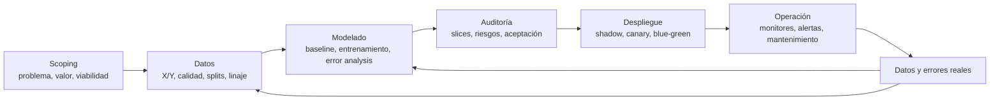

# Machine Learning in Production — manual operativo de producción, evaluación y mejora

> **Estado:** curso base y cobertura transversal incorporados, reconciliados y auditados.
> **Fuente primaria:** Andrew Ng, *Machine Learning in Production*, DeepLearning.AI.
> **Cobertura verificada:** 3 semanas; 41 videolecciones inventariadas; 40 transcripciones técnicas revisadas; 4 prácticas de código más un proyecto final visibles en el temario; 5 evaluaciones informadas por el catálogo.
> **Propósito:** convertir un modelo útil en un sistema desplegable, observable, auditable y capaz de aprender sistemáticamente de sus errores.

## Cómo usar este documento

1. Para iniciar un proyecto, usar **Contrato de proyecto** y **Runbook de punta a punta**.
2. Si el modelo no mejora, usar **Error analysis y priorización** antes de cambiar la arquitectura.
3. Antes de producción, ejecutar **Auditoría previa al despliegue**.
4. Para incidentes o degradación, usar **Monitoreo, drift y mantenimiento**.
5. Para encargar trabajo a Codex, copiar el **Contrato operativo para agentes** y completar sus campos.

## Estado, procedencia y límites

- **[NG]** indica síntesis fiel de la enseñanza de Andrew Ng; no transcripción literal.
- **[IMPL]** convierte esa enseñanza en una especificación ejecutable.
- **[EXT]** identifica prácticas adicionales no presentadas como contenido del curso.
- Las evaluaciones no se reproducen ni resuelven.
- La lección de bienvenida no expuso una transcripción técnica; las otras 40 videolecciones sí fueron verificadas mediante el panel oficial de transcripción en inglés.
- Las diapositivas oficiales enlazadas desde el foro advierten que pueden estar desactualizadas respecto de los videos; por ello, los videos y sus transcripciones fueron tratados como autoridad.
- Este curso enseña el ciclo de producción ML. No sustituye formación profunda en infraestructura distribuida, seguridad, cloud, serving de LLM o ingeniería de baja latencia.

## Modelo mental total



**[NG]** Principio rector: el primer despliegue no es el final. El tráfico real revela información nueva y obliga a continuar el ciclo de datos, análisis de errores, reentrenamiento, validación y despliegue.

## Inventario compacto del curso

### Semana 1 — Overview of the ML Lifecycle and Deployment

- Welcome.
- Steps of an ML Project.
- Case study: speech recognition.
- Course outline.
- Key challenges.
- Deployment patterns.
- Monitoring.
- Pipeline monitoring.
- Prácticas: desplegar un modelo de deep learning; desplegarlo con Docker y un servicio cloud.

### Semana 2 — Modeling Challenges and Strategies

- Modeling overview.
- Key challenges.
- Why low average error isn't good enough.
- Establish a baseline.
- Tips for getting started.
- Error analysis example.
- Prioritizing what to work on.
- Skewed datasets.
- Performance auditing.
- Data-centric AI development.
- A useful picture of data augmentation.
- Data augmentation.
- Can adding data hurt?
- Adding features.
- Experiment tracking.
- From big data to good data.
- Práctica: A Journey Through Data.

### Semana 3 — Data Definition and Baseline

- Why is data definition hard?
- More label ambiguity examples.
- Major types of data problems.
- Small data and label consistency.
- Improving label consistency.
- Human level performance (HLP).
- Raising HLP.
- Obtaining data.
- Data pipelines.
- Metadata, data provenance and lineage.
- Balanced train/dev/test splits.
- What is scoping?
- Scoping process.
- Diligence on feasibility and value.
- Diligence on value.
- Milestones and resourcing.
- Final project overview.
- Prácticas: Data Labeling y proyecto completo del ciclo ML.

## 1. El producto es el sistema, no el modelo

- **[NG]** Un sistema ML está compuesto por código, datos, hiperparámetros, software de producción, interfaces y mecanismos de operación.
- **[NG]** Una métrica de test alta no demuestra que el producto satisfaga la necesidad real.
- **[NG]** Producción agrega problemas estadísticos —drift, slices, clases raras— y problemas de software —latencia, throughput, cómputo, logging, seguridad e integración—.
- **[IMPL]** Ningún modelo está listo si solo existe un notebook o un checkpoint. Debe existir un contrato extremo a extremo desde la entrada real hasta la acción y la observación posterior.

### Tres hitos de modelado

1. **[NG]** Ajustar training: comprobar que modelo, optimización y datos permiten aprender al menos el entrenamiento.
2. **[NG]** Generalizar a dev/test: medir fuera de los ejemplos utilizados para ajustar parámetros.
3. **[NG]** Satisfacer el objetivo real: verificar métricas de aplicación, slices críticos, restricciones de software y valor.

**[IMPL]** Puerta de diagnóstico: si falla el hito 1, no atribuirlo a producción ni a drift. Si pasa 1 y falla 2, investigar generalización, distribución y datos. Si pasa 2 y falla 3, la métrica, los slices o la formulación no representan la aplicación.

## 2. Scoping: elegir el problema correcto

### Proceso

1. **[NG]** Identificar problemas de negocio o aplicación; no comenzar por una tecnología de IA.
2. **[NG]** Separar problema y solución. Preguntar primero qué debería funcionar mejor; después explorar si ML es una solución adecuada.
3. **[NG]** Pensamiento divergente: producir varias oportunidades posibles.
4. **[NG]** Pensamiento convergente: comparar y seleccionar una o pocas opciones.
5. **[NG]** Hacer diligence de viabilidad técnica y valor.
6. **[NG]** Definir métricas, hitos, recursos, integraciones y cronograma.

### Matriz de viabilidad

| Tipo de problema | Nuevo sistema | Mejora de sistema existente |
|---|---|---|
| Datos no estructurados | comparar con desempeño humano usando exactamente la misma entrada disponible para el algoritmo | comparar HLP, desempeño actual e historial de progreso |
| Datos estructurados | comprobar que existen features realmente predictivas de `Y` | buscar nuevas features predictivas y revisar la tasa histórica de mejora |

- **[NG]** Si una persona no puede resolver la tarea con exactamente la información que recibirá el modelo, mejorar sensor, entrada o formulación puede ser más útil que insistir con arquitectura.
- **[NG]** En datos estructurados, correlaciones deseadas no garantizan información predictiva suficiente.
- **[NG]** El historial de progreso de un sistema ayuda a estimar la dificultad del siguiente salto; no prometer mejoras arbitrarias sin baseline.

### Cadena de valor

```text
objetivo de entrenamiento -> métrica ML -> métrica de producto -> comportamiento del usuario -> valor
```

- **[NG]** Ingeniería suele controlar mejor el lado izquierdo y negocio suele valorar el derecho.
- **[NG]** Las partes deben acordar métricas intermedias defendibles.
- **[NG]** Un cálculo aproximado que conecte una mejora ML con el efecto de producto es preferible a una promesa sin mecanismo causal.
- **[NG]** La viabilidad económica no basta: un proyecto que no ayuda o produce daño justificable puede y debe descartarse.

### Contrato de proyecto

```yaml
business_problem: ""
user_or_process_affected: ""
decision_or_action_enabled: ""
input_x_available_at_inference: ""
target_y_and_label_source: ""
ml_metric: ""
critical_slices: []
software_constraints:
  latency: ""
  throughput: ""
  memory_compute: ""
business_or_social_metric: ""
baseline_plan: ""
feasibility_evidence: ""
data_sources_and_permissions: []
risks_and_ethical_constraints: []
milestones: []
owners_and_dependencies: []
go_no_go_criteria: []
```

## 3. Datos: definir `X` y `Y` antes de acumular ejemplos

### Ambigüedad y consistencia

- **[NG]** Varias convenciones de etiquetado pueden ser razonables; mezclar convenciones arbitrariamente confunde al algoritmo.
- **[NG]** Preguntar qué información contiene `X`, si su calidad es suficiente y si una persona puede determinar `Y` desde esa misma entrada.
- **[NG]** Cuando la discordancia proviene de una definición ambigua, reunir a labelers y especialistas, acordar una regla y documentarla.
- **[NG]** Si dos clases no necesitan separarse y no pueden etiquetarse consistentemente, considerar fusionarlas.
- **[NG]** Si existen casos genuinamente ambiguos, una clase explícita de `borderline`, `unknown` o `unintelligible` puede ser más honesta y consistente que forzar una respuesta.
- **[NG]** Votar entre muchas etiquetas ruidosas puede servir, pero no sustituye mejorar primero las instrucciones; Andrew lo presenta como un recurso sobreutilizado.

### Ciclo de consistencia

```text
seleccionar casos difíciles
-> etiquetado independiente por varias personas
-> medir desacuerdo
-> discutir causa
-> corregir X, taxonomía o instrucciones
-> relabeling dirigido
-> volver a medir
```

### Cuatro contextos de datos

| | Datos pequeños | Datos grandes |
|---|---|---|
| No estructurados | revisar ejemplos y consistencia casi individualmente; HLP y augmentación suelen ser útiles | escalar procesos de labeling y augmentación; auditar long tail y slices raros |
| Estructurados | diseñar features y revisar cada señal; el baseline humano suele ser débil | enfatizar procesos, calidad de features, datos históricos y monitoreo |

- **[NG]** `10 000` ejemplos es una frontera pedagógica aproximada, no una ley; indica cuándo inspeccionar todo manualmente empieza a ser costoso.
- **[NG]** Un dataset grande puede esconder pequeños conjuntos críticos en su cola larga.

### Obtener datos sin bloquear la iteración

- **[NG]** Conseguir pronto un conjunto inicial suficiente para entrenar y analizar errores; no pasar semanas recolectando datos a ciegas si un prototipo puede revelar qué hace falta.
- **[NG]** Inventariar fuentes con cantidad, costo monetario, tiempo, calidad, permisos, privacidad y restricciones regulatorias.
- **[NG]** Etiquetar internamente al comienzo puede ser caro pero aumenta la intuición del equipo; después escalar a especialistas, outsourcing o crowdsourcing según la tarea.
- **[NG]** No multiplicar el dataset más de aproximadamente `10x` en una sola apuesta sin volver a entrenar y analizar; incrementos menores también son válidos.

| Fuente | Cantidad | Tiempo | Costo | Calidad esperada | Permiso/privacidad | Riesgo de distribución |
|---|---:|---:|---:|---|---|---|
| existente | | | | | | |
| nueva captura | | | | | | |
| labeling | | | | | | |
| compra/licencia | | | | | | |
| síntesis/augmentación | | | | | | |

### Splits pequeños y representatividad

- **[NG]** En datasets pequeños, un split aleatorio puede producir proporciones muy diferentes de clases entre train, dev y test.
- **[NG]** Balancear explícitamente las proporciones relevantes mejora la estabilidad de la evaluación.
- **[IMPL]** Balancear no significa copiar ejemplos entre splits. Mantener independencia por entidad, tiempo o grupo para impedir leakage.
- **[EXT]** Para datos temporales o mercados, preservar orden temporal y evitar que estados futuros aparezcan en features o etiquetas del pasado.

## 4. Baseline y comienzo eficiente

### Fuentes de baseline

- desempeño humano para tareas no estructuradas donde personas son competentes;
- literatura y resultados públicos comparables;
- implementación open source razonable;
- prototipo simple y rápido;
- sistema anterior ya desplegado.

- **[NG]** Un baseline indica qué puede ser posible y ayuda a priorizar; no debe convertirse en meses de búsqueda del algoritmo más reciente.
- **[NG]** Para un producto práctico, una solución razonable con buenos datos puede superar a una arquitectura excelente con datos deficientes.
- **[NG]** Si todavía se investiga viabilidad, puede ser válido ignorar temporalmente alguna restricción de deployment para establecer el baseline; cuando la viabilidad está clara, incorporarla al diseño.

### Sanity checks obligatorios

1. **[NG]** Intentar sobreajustar un solo ejemplo cuando la salida es compleja.
2. **[NG]** Sobreajustar un subconjunto pequeño —por ejemplo 10 o 100 ejemplos— antes del entrenamiento costoso.
3. **[IMPL]** Verificar shapes, tipos, rango, finitud, determinismo controlado y alineación `X/Y`.
4. **[IMPL]** Comparar una predicción manual o golden case extremo.
5. **[IMPL]** Confirmar que la métrica empeora al permutar etiquetas o inutilizar features; si no, puede existir leakage.

## 5. Error analysis: aprender de los errores del algoritmo

### Procedimiento de error analysis

1. Construir pronto un primer sistema extremo a extremo.
2. Muestrear errores del dev set; alrededor de cien suele dar señal inicial sin exigir revisar todo.
3. Examinar cada caso y asignar etiquetas de causa no excluyentes.
4. Crear nuevas categorías cuando aparezcan patrones y volver a etiquetar casos previos si es útil.
5. Medir frecuencia, dificultad, severidad y margen respecto del baseline.
6. Elegir uno o pocos slices accionables.
7. Formular una intervención concreta sobre datos, features, modelo o pipeline.
8. Ejecutar un experimento controlado y registrar el resultado.
9. Repetir: al corregir una familia de errores cambia la composición del error restante.

### Tabla de análisis

| `sample_id` | `expected` | `predicted` | tags/categorías | etiqueta confiable | severidad | hipótesis | intervención |
|---|---|---|---|---|---|---|---|
| | | | | sí/no/dudosa | | | |

### Priorización

Para un slice `c`:

```text
uplift_promedio_aprox(c) = prevalencia(c) * margen_de_mejora(c)
margen_de_mejora(c) = baseline(c) - desempeño_modelo(c)
```

- **[NG]** La cuenta es una orientación, no una fórmula total de decisión.
- **[NG]** Considerar también facilidad de mejora e importancia del slice.
- **[NG]** Recolectar “más datos” sin categoría ni hipótesis suele ser menos eficiente que recolectar los datos indicados por el error analysis.

### Datasets desbalanceados

```text
precision = TP / (TP + FP)
recall    = TP / (TP + FN)
F1        = 2 * precision * recall / (precision + recall)
```

- **[NG]** Accuracy puede ocultar un clasificador inútil que siempre predice la clase mayoritaria.
- **[NG]** Elegir precision, recall, F1 u otra combinación según el costo real de falsos positivos y falsos negativos.
- **[NG]** En multiclase con clases raras, medir cada clase importante por separado.
- **[IMPL]** Registrar también soporte por slice e intervalos de incertidumbre; una métrica sobre pocos casos no tiene la misma confianza que otra sobre miles.

## 6. Desarrollo data-centric

### Modelo-céntrico y data-céntrico

- **[NG]** Modelo-céntrico: mantener datos fijos e iterar sobre arquitectura/código.
- **[NG]** Data-céntrico: mantener inicialmente una implementación razonable y mejorar de forma sistemática cobertura, consistencia y representatividad de datos.
- **[NG]** Ambos enfoques son válidos; el segundo suele estar subutilizado en producto.

### Augmentación útil

Antes de generar o incorporar ejemplos, comprobar:

1. ¿El ejemplo es realista para la distribución objetivo?
2. ¿El mapeo `X -> Y` sigue siendo claro para una persona o baseline competente?
3. ¿El modelo actual falla en ese tipo de ejemplo?
4. ¿El error analysis mostró que ese slice importa?

- **[NG]** Esta comprobación evita reentrenar repetidamente solo para descubrir que la augmentación era inútil.
- **[NG]** Para datos no estructurados, un modelo suficientemente capaz y etiquetas correctas rara vez empeora al agregar datos, aunque cambie la distribución de training.
- **[NG]** Puede empeorar si el modelo no tiene capacidad suficiente o si `X -> Y` es ambiguo y la augmentación distorsiona las probabilidades de casos ambiguos.
- **[NG]** Técnicas sofisticadas de síntesis pueden ser excesivas si transformaciones simples producen datos realistas y útiles.

### Datos estructurados

- **[NG]** Crear nuevos usuarios, productos o entidades ficticias suele ser menos natural que en imagen o audio.
- **[NG]** Error analysis puede señalar nuevas features: atributos del usuario, producto, contexto o interacción.
- **[NG]** Deep learning reduce feature engineering en datos no estructurados, pero las features diseñadas continúan siendo importantes en muchos problemas estructurados, especialmente sin datasets masivos.

### De big data a good data

**[NG]** Un dataset útil para producción combina cuatro propiedades:

1. cubre los casos importantes y sus slices;
2. define `Y` de forma consistente;
3. recibe feedback oportuno desde producción;
4. posee un tamaño razonable para la tarea, sin asumir que volumen compensa definiciones deficientes.

## 7. Human-Level Performance bien utilizado

- **[NG]** HLP ayuda a estimar error irreducible y a priorizar cuando humanos pueden resolver la tarea con la misma entrada.
- **[NG]** Si la ground truth proviene de una medición externa —por ejemplo una prueba clínica—, comparar humano y algoritmo contra ella es informativo.
- **[NG]** Si la ground truth es otra etiqueta humana, un HLP bajo puede medir desacuerdo entre convenciones, no dificultad intrínseca.
- **[NG]** Un algoritmo puede aparentar superar HLP al aprender la convención mayoritaria sin producir una salida más útil.
- **[NG]** Para construir producto, mejorar las instrucciones y elevar HLP puede ser más valioso que intentar “vencer” a humanos con etiquetas inconsistentes.

**[IMPL]** Regla: cuando HLP sea inesperadamente bajo, auditar definición de `Y`, acuerdo inter/intra-labeler, información de `X` y origen de ground truth antes de fijarlo como techo.

## 8. Experimentos, pipelines y reproducibilidad

### Registro mínimo de experimento

```yaml
experiment_id: ""
hypothesis: ""
code_version: ""
data_version: ""
preprocessing_version: ""
model_and_hyperparameters: {}
randomness_controls: {}
compute_environment: ""
global_metrics: {}
slice_metrics: {}
artifacts: []
observations: ""
decision: keep|reject|investigate
next_action: ""
```

- **[NG]** Texto o spreadsheet sirven al comienzo; al crecer el equipo o el número de experimentos, migrar a una herramienta formal.
- **[NG]** Registrar suficiente información para reproducir: código, dataset, hiperparámetros, resultados y, cuando sea posible, el modelo entrenado.
- **[NG]** Recursos, visualizaciones y análisis profundos son útiles, pero la prioridad es no perder la historia experimental.

### POC frente a producción

- **[NG]** POC: priorizar comprobar que la aplicación es viable. Puede tolerar pasos manuales si se documentan suficientemente.
- **[NG]** Producción: hacer reproducibles y mantenibles los pasos de preprocessing y pipeline; aquí se justifican herramientas más robustas.
- **[IMPL]** La transición POC -> producción es una reingeniería explícita, no asumir que el notebook experimental es el servicio final.

### Provenance, lineage y metadata

- **[NG]** Provenance: de dónde vino cada dato.
- **[NG]** Lineage: qué transformaciones y modelos lo convirtieron en un artefacto posterior.
- **[NG]** Metadata: información sobre el dato —momento, origen, sensor, línea, versión, labeler— útil para trazabilidad y error analysis.
- **[NG]** Guardar metadata a tiempo suele ser barato; reconstruirla después puede ser imposible.

```text
source_id -> raw_version -> transformations[] -> feature_version
          -> label_definition_version -> split_version -> model_version
          -> deployment_version -> prediction/log -> feedback
```

## 9. Auditoría previa al despliegue

### Procedimiento previo al despliegue

1. **[NG]** Reunir al equipo y, en aplicaciones críticas, asesores externos o expertos de dominio.
2. **[NG]** Enumerar cómo podría fallar el sistema.
3. **[NG]** Definir slices y métricas capaces de detectar cada fallo.
4. **[NG]** Revisar accuracy, falsos positivos/negativos, clases raras, equidad y errores especialmente dañinos.
5. **[NG]** Acordar con producto o negocio que riesgos y métricas son los apropiados.
6. **[NG]** Corregir antes de desplegar cuando el audit revele un problema.

| Riesgo | Slice/población | Métrica | Umbral | Evidencia | Acción si falla |
|---|---|---|---|---|---|
| | | | | | |

### Puertas de aceptación

- métrica global cumple el baseline acordado;
- slices críticos cumplen mínimos independientes;
- falsos positivos y negativos respetan costos de aplicación;
- clases raras de alta severidad no desaparecen en el promedio;
- train y serving aplican el mismo contrato de entrada;
- latencia, throughput, memoria y costo cumplen restricciones;
- privacidad, seguridad y permisos de datos fueron revisados;
- existen logging, monitoreo, rollback y responsables de incidentes.

## 10. Despliegue gradual

| Patrón | Uso | Decisión real del modelo | Ventaja |
|---|---|---:|---|
| shadow | comparar con humano o sistema actual | no | observar errores sin afectar decisiones |
| canary | introducir versión nueva | pequeña fracción | limitar impacto y ganar evidencia |
| blue-green | reemplazar versión completa | cambia mediante router | rollback rápido manteniendo versión anterior |

- **[NG]** Comenzar con poco tráfico, monitorear y ampliar gradualmente.
- **[NG]** Mantener rollback cuando exista un sistema anterior.
- **[NG]** Pensar automatización como espectro: humano -> shadow -> asistencia -> automatización parcial -> automatización completa.
- **[NG]** En automatización parcial, enviar a personas los casos inciertos; esas decisiones humanas pueden alimentar el siguiente ciclo de datos.
- **[IMPL]** El grado de automatización debe depender de evidencia, severidad y capacidad de recuperación, no de una preferencia estética por “full AI”.

### Restricciones de software

Antes de elegir arquitectura de serving, responder:

- ¿predicción en tiempo real o batch?
- ¿cloud, edge o navegador?
- ¿qué CPU/GPU, memoria y costo están disponibles?
- ¿cuál es el presupuesto de latencia del modelo dentro del presupuesto total?
- ¿cuál es el throughput requerido?
- ¿qué se puede registrar respetando privacidad?
- ¿qué nivel de seguridad exige la información?

## 11. Monitoreo, drift y mantenimiento

### Clases de métricas

| Capa | Ejemplos | Qué detecta |
|---|---|---|
| software | latencia, memoria, CPU/GPU, throughput, errores, carga | salud del servicio |
| entrada | missing values, volumen, longitud, brillo, distribución de categorías | cambio en `P(X)` o captura |
| salida | tasa de nulos, scores, clases, confianza, repetición del usuario | cambio de comportamiento del modelo |
| producto | abandono, correcciones, CTR, escalamiento humano | utilidad posterior a la predicción |
| calidad tardía | precision, recall, error por slice cuando llega ground truth | degradación real |

- **[NG]** Para elegir monitores, enumerar primero todo lo que podría salir mal y después buscar estadísticas que lo detecten.
- **[NG]** Es válido comenzar con muchas métricas y eliminar las que no aportan señal.
- **[NG]** Ajustar métricas y umbrales con experiencia operativa; el conjunto correcto suele emerger iterativamente.

### Drift

- **[NG]** Data drift: cambia la distribución de entrada `P(X)`.
- **[NG]** Concept drift: cambia la relación deseada entre `X` e `Y`, `P(Y|X)`.
- **[NG]** Ambos pueden ser graduales o súbitos.
- **[NG]** Los cambios B2B pueden ser abruptos cuando una empresa modifica procesos, sensores o materiales; los cambios agregados de millones de consumidores suelen ser más lentos, salvo shocks colectivos.

### Pipeline monitoring

Cuando existen componentes encadenados, cada salida intermedia es una entrada posterior:

```text
raw input -> detector/filter -> representation/profile -> predictor -> product action
```

- **[NG]** Un cambio pequeño aguas arriba puede degradar un modelo posterior aunque este no haya cambiado.
- **[NG]** Monitorear software, inputs y outputs en cada componente crítico, no solo el resultado final.
- **[IMPL]** Versionar los contratos intermedios y registrar qué versión produjo cada evento.

### Política de reentrenamiento

- **[NG]** El reentrenamiento manual es más común y permite error analysis y validación antes de publicar.
- **[NG]** Automatizar reentrenamiento y despliegue solo cuando la aplicación, señales y controles lo justifican.
- **[IMPL]** Separar `detectar degradación`, `proponer candidato`, `validar candidato` y `promover a producción`; no convertir una alarma en publicación automática sin puertas.

## 12. Runbook de punta a punta

### Fase 0 — escoger

- definir problema real, usuario y decisión;
- generar varias soluciones posibles;
- evaluar viabilidad, valor, ética y datos;
- escribir criterios `go/no-go`.

### Fase 1 — contratar datos

- definir `X`, `Y`, unidad de observación y momento de inferencia;
- identificar fuente de ground truth;
- acordar instrucciones y casos ambiguos;
- diseñar train/dev/test representativos e independientes;
- registrar provenance, lineage y metadata.

### Fase 2 — baseline

- elegir implementación simple o open source;
- ejecutar micro-overfit y sanity checks;
- medir globalmente y por slices iniciales;
- registrar código, datos, hiperparámetros y artefactos.

### Fase 3 — iterar con evidencia

- revisar errores reales;
- crear taxonomía de causas;
- estimar margen, frecuencia, importancia y facilidad;
- modificar una causa controlable;
- volver a medir y guardar el experimento.

### Fase 4 — auditar

- enumerar fallos y daños posibles;
- evaluar clases raras, slices, fairness y casos desproporcionadamente importantes;
- obtener acuerdo de expertos y producto;
- bloquear publicación si una puerta crítica falla.

### Fase 5 — desplegar

- elegir shadow, canary o blue-green;
- fijar grado de automatización y fallback humano;
- validar recursos, latencia, throughput, seguridad y privacidad;
- activar logging, dashboard, alertas y rollback.

### Fase 6 — operar y aprender

- observar software, datos, outputs, producto y calidad tardía;
- investigar alertas por componente y slice;
- incorporar feedback autorizado;
- reentrenar, auditar y desplegar nuevamente cuando la evidencia lo demande.

## 13. Árbol de diagnóstico

| Síntoma | Primera pregunta | Evidencia | Próxima acción |
|---|---|---|---|
| no ajusta ni un ejemplo | ¿hay bug, label incorrecto o salida mal formulada? | micro-overfit, shapes, loss | corregir pipeline/código |
| train malo | ¿baseline alcanzable y datos suficientes? | gap contra HLP/baseline | modelo, optimización o calidad de train |
| train bueno, dev malo | ¿variance, leakage inverso o mismatch? | splits y slices | regularización, datos representativos |
| promedio bueno, producto malo | ¿métrica o slice crítico invisible? | error analysis y auditoría | redefinir evaluación/objetivo |
| clase rara ignorada | ¿accuracy es engañosa? | confusion matrix, P/R/F1 | métrica y datos por clase |
| degrada después de publicar | ¿software, data drift o concept drift? | monitores por capa | reparar, rollback o reentrenar |
| modelo posterior degrada | ¿cambió un componente upstream? | métricas y versiones intermedias | localizar el primer contrato alterado |
| equipo no reproduce resultado | ¿faltan versiones o artefactos? | registro experimental | reconstruir y formalizar tracking |
| labelers discrepan | ¿Y es ambigua o X insuficiente? | acuerdo inter/intra-labeler | instrucciones, clases o sensor |
| recolección crece sin mejora | ¿los datos atacan errores prioritarios? | tags y uplift estimado | recolección dirigida |

## 14. Contrato operativo para agentes Codex

Al encargar una tarea de ML en producción, proporcionar:

```yaml
task: ""
source_of_truth: ""
business_goal: ""
input_contract: {}
output_contract: {}
label_definition: ""
splits_and_leakage_constraints: []
baseline: {}
critical_slices: []
primary_metric: ""
satisficing_metrics: {}
latency_throughput_budget: {}
privacy_security_constraints: []
deployment_pattern: shadow|canary|blue-green|undecided
monitoring_requirements: []
rollback_condition: ""
allowed_files_and_services: []
deliverables: []
```

### Conducta exigida al agente

1. No cambiar arquitectura antes de verificar contrato de datos, baseline y error predominante.
2. Proponer una hipótesis falsable para cada cambio importante.
3. Conservar una versión reproducible de código, datos, configuración y resultados.
4. Reportar métricas globales y de slices, nunca solo un promedio conveniente.
5. Transformar errores críticos corregidos en tests, golden cases o monitores.
6. No promover un modelo automáticamente si faltan auditoría, rollback o límites de operación.
7. Marcar explícitamente toda suposición, evidencia ausente o extensión externa al curso.

### Entrega mínima del agente

- implementación y configuración;
- pruebas unitarias y de integración del pipeline;
- resultados reproducibles;
- error analysis resumido;
- comparación contra baseline;
- auditoría de slices críticos;
- plan de despliegue y rollback;
- catálogo de monitores y responsables;
- limitaciones y siguiente experimento recomendado.

## 15. Checklist de revisión Senior

### Problema

- [ ] La necesidad real está separada de la solución ML.
- [ ] Viabilidad, valor y ética fueron evaluados.
- [ ] Métricas ML, software y producto están conectadas.

### Datos

- [ ] `X`, `Y`, ground truth y momento de inferencia son inequívocos.
- [ ] Labelers comparten una definición documentada.
- [ ] Splits son representativos y no tienen leakage.
- [ ] Dataset, transformaciones, metadata y lineage están versionados.

### Modelo

- [ ] Existe baseline y micro-overfit exitoso.
- [ ] Cada experimento es reproducible.
- [ ] Error analysis dirige la siguiente intervención.
- [ ] Clases raras y slices críticos tienen métricas propias.

### Producción

- [ ] Train/serve mantienen el mismo contrato.
- [ ] Latencia, throughput, memoria y costo fueron medidos.
- [ ] Despliegue es gradual y reversible.
- [ ] Monitores cubren software, entradas, salidas y producto.
- [ ] Existe respuesta definida para drift, alarma y degradación.

## 16. Relación con Deep Learning Specialization

| DLS | Machine Learning in Production | Resultado combinado |
|---|---|---|
| bias/variance y métricas | baseline y tres hitos | localizar si falla aprendizaje, generalización o aplicación |
| error analysis | tags, uplift, auditoría y data iteration | convertir errores en prioridades y experimentos |
| train/dev/test | balance, lineage y distribución real | evaluación reproducible y representativa |
| optimización de redes | restricciones de deployment | modelo suficientemente bueno dentro de recursos reales |
| estrategia ML | scoping y cadena de valor | elegir no solo cómo mejorar, sino qué merece construirse |

Consultar `DEEP_LEARNING_ANDREW_NG.md` para arquitectura, entrenamiento, bias/variance, CNN, secuencias y Transformers. Este documento comienza donde un modelo debe transformarse en un producto operable.

## 17. Cobertura transversal resuelta

Los huecos que originalmente se reservaron para ampliaciones quedaron cubiertos sin duplicar este manual:

| Tema | Documento autoridad |
|---|---|
| LLMOps y testing automatizado | este manual para ciclo ML; `AGENTIC_AI_SOFTWARE_ENGINEERING_CODEX.md` para software/evals |
| evaluación y debugging generativo | `PYTORCH_TRANSFORMERS_GENERATIVE_MODELS.md` + manual agentivo |
| observabilidad de RAG y agentes | `NLP_RAG_RETRIEVAL_DATA.md` + manual agentivo |
| serving, caching, cuantización y costo | `AI_INFERENCE_PERFORMANCE_HARDWARE.md` |
| seguridad, gobierno y privacidad | `AI_SECURITY_GOVERNANCE_PRIVACY.md` |

Los cursos cortos de proveedor que recorren nuevamente estas capas quedan excluidos por solapamiento, no pendientes. Este documento conserva la autoridad sobre scoping, datos, error analysis, deployment, drift y monitoreo del producto ML.

## 18. Práctica pública xAI — operar un funnel de recomendación

**[CODE] Evidencia:** `xai-org/x-algorithm@28e414f535e4b5a50ca12ee87674e7649e50c7ad`, Apache-2.0. La publicación permite inspeccionar el pipeline For You y ejecutar una versión pequeña de Phoenix con datos sintéticos. No publica feeds de producción, checkpoints internos, telemetría, orquestación multihost completa ni una receta que pruebe la escala real.

### Contratos y observabilidad por etapa

En un funnel `retrieval → hydration → filtering → ranking → selection → visibility`, un promedio final no localiza el fallo. Cada candidato debe llevar un rastro compacto:

```text
request/session/version
source + retrieval_score + retrieved_at
feature_versions + missing/stale flags
pre_filter decisions
predictions por acción + calibración
score compuesto + ajustes + rank
visibility decision + policy/label versions
selected/presented + exposición + outcome tardío
```

**[IMPL] Métricas mínimas:** cobertura y recall@K por fuente; unión/duplicados del pool; missingness/freshness de hydration; drop rate y razón por filtro; calibración y slices por cabeza; distribución y sensibilidad del score compuesto; diversidad/autoría; latencia, cola, errores y costo por etapa; exposición y outcomes con delay declarado.

### Separar política de ranking y política de visibilidad

**[CODE]** El repositorio implementa ranking y visibility filtering como responsabilidades distintas. La práctica generalizable es que el modelo no debe aprender silenciosamente una política que necesita reglas deterministas, versionado, explicación, auditoría o respuesta inmediata a incidentes.

**[IMPL] Gate:**

- versionar por separado modelo, pesos de objetivos, filtros y reglas;
- ejecutar tests positivos/negativos de cada regla y de su precedencia;
- shadowear cambios de modelo y política con logs comparables;
- canary por tráfico/slice y rollback independiente cuando sea posible;
- verificar que filtros previos no sesguen la evaluación sin quedar registrados;
- medir false allow/false block sobre datasets adjudicados, no sólo volumen filtrado.

### Artefactos acoplados que deben promoverse juntos

Phoenix hace visibles dependencias entre checkpoint, índice de candidatos, semantic IDs/codebooks, feature schema y contratos gRPC. Una promoción válida debe declarar una matriz de compatibilidad y probar restore en proceso limpio:

```text
model revision
↔ tokenizer/feature schema/action schema
↔ encoder + semantic-ID codebooks/snapshot
↔ candidate index/snapshot
↔ serving binary + protobuf revision
↔ ranking weights + visibility policy revision
```

Si un elemento puede actualizarse independientemente, definir compatibilidad hacia atrás/adelante y comportamiento durante version skew. Si no, promoverlos como release unit atómica y conservar rollback del conjunto.

### Aprender de los errores del funnel

Para cada resultado incorrecto localizar la **primera divergencia**: candidato ausente en source, perdido en retrieval, feature inválida, filtro incorrecto, predicción mal calibrada, combinación de objetivos, top-K, política de visibilidad o presentación. Convertir el caso en una regresión de la etapa responsable y volver a ejecutar el pipeline completo para detectar efectos secundarios.

Fuente fijada: [x-algorithm](https://github.com/xai-org/x-algorithm/blob/28e414f535e4b5a50ca12ee87674e7649e50c7ad/README.md) y [Phoenix](https://github.com/xai-org/x-algorithm/blob/28e414f535e4b5a50ca12ee87674e7649e50c7ad/phoenix/README.md).

### Contraste público Meta — registry como control operacional

**[PROD]** Instagram describe un registry central para más de mil modelos que une función de negocio, tipo, criticidad, baseline/holdout y activos como training flow, checkpoint e inference service. Esa metadata alimenta monitoreo y respuesta; no es sólo un catálogo de pesos.

**[IMPL] Entrada mínima de registry:** owner/on-call; producto/funnel/slice; criticidad y máximo impacto; model/data/code/config/runtime revisions; baseline/holdout y fallback permitido; dependencias upstream/downstream; SLI/SLO y alertas; última promoción/eval; rollout/kill switch; retention/deprecation. Rechazar modelos huérfanos y criticidad autoasignada sin criterio común.

Gate: simular indisponibilidad de un modelo experimental y del baseline; el operador debe identificar impacto, owner, alternativa y acción sin conocimiento tribal. Alertas se derivan de criticidad y SLO, mientras el registry mismo tiene freshness, audit, access control y disaster recovery.

Fuente: [Journey to 1000 models](https://engineering.fb.com/2025/05/21/production-engineering/journey-to-1000-models-scaling-instagrams-recommendation-system/).

## 19. Learning loop multi-cliente: evidencia antes que acumulación

Más clientes pueden descubrir más estados, errores y ataques, pero el efecto no es automático. Volumen adicional también introduce duplicados, distribuciones incompatibles, clientes dominantes, labels ambiguos, poisoning y datos cuyo uso no está autorizado. Tratar el “data flywheel” como una hipótesis del sistema:

```text
evento autorizado y mínimo
→ clasificación por tenant/propósito/sensibilidad
→ causa e invariante, no copia indiscriminada del payload
→ caso sintético o corpus de eval autorizado
→ dedupe + provenance + quarantine
→ baseline/candidate sobre holdout independiente y slices
→ privacy/security/cost gate
→ shadow/canary
→ promoción o rollback
```

Separar siempre telemetría operacional, evidencia de incidente, eval corpus y training data. Un cliente puede autorizar que sus datos operen el servicio sin autorizar entrenamiento global; una cláusula contractual tampoco vuelve los datos correctos, representativos o resistentes a poisoning. Mantener deletion lineage hasta datasets, features, embeddings, checkpoints y caches según el compromiso aplicable; cuando eliminar un efecto aprendido sea técnicamente imposible o no esté prometido, declararlo antes de recolectar.

### Gate de mejora global

- unidad de split por cliente/incidente/tiempo para evitar leakage entre variantes del mismo caso;
- máximo aporte y métricas por tenant/slice, incluyendo clientes pequeños y casos críticos;
- provenance, licencia/términos, label owner y razón de inclusión;
- quarantine de nuevas fuentes, detección de duplicados/outliers y revisión de cambios de distribución;
- eval de attack success, false allow/deny, calidad, calibración, latencia y costo;
- leakage/membership y red team cuando el artefacto puede memorizar datos;
- artifact identity conjunta de datos/modelo/policy/eval/runtime;
- rollout reversible y capacidad de bloquear una fuente o revisión contaminada.

La mejora transferible preferida es un patrón verificable —taxonomía, policy, invariante, test o caso sintético— antes que el contenido crudo de otro cliente. `AI_SECURITY_GOVERNANCE_PRIVACY.md` gobierna autorización, aislamiento y privacidad; este manual gobierna error analysis, representatividad, evaluación y promoción.

## Fuentes de control

- Curso oficial: <https://www.deeplearning.ai/courses/machine-learning-in-production>
- Plataforma de lecciones: <https://learn.deeplearning.ai/courses/machine-learning-in-production/>
- Notas oficiales enlazadas por DeepLearning.AI: <https://community.deeplearning.ai/t/mlep-lecture-notes/54446>
- Curso alternativo en Coursera: <https://www.coursera.org/learn/introduction-to-machine-learning-in-production>

## Auditoría final del curso base

- [x] Tres semanas y 41 videolecciones inventariadas.
- [x] Cuarenta lecciones técnicas contrastadas con su transcripción oficial en inglés.
- [x] Laboratorios y proyecto final identificados sin reproducir evaluaciones.
- [x] Scoping, datos, modelado, error analysis, auditoría, deployment y monitoreo incorporados.
- [x] Enseñanza y traducción operativa separadas por etiquetas.
- [x] Contratos, runbook, árbol de diagnóstico y checklist Senior añadidos.
- [x] Ampliaciones transversales resueltas y enlazadas sin duplicación.
