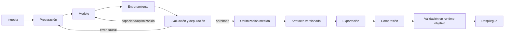

# PyTorch, Transformers y modelos generativos — manual operativo

> **Estado:** *PyTorch for Deep Learning Professional Certificate*, *Transformers in Practice*, *Generative AI with Large Language Models*, *Finetuning Large Language Models* y *Reinforcement Learning From Human Feedback* completos y auditados.
> **Fuentes primarias actuales:** Laurence Moroney, *PyTorch for Deep Learning*; Sharon Zhou/AMD —antes Lamini—, *Transformers in Practice* y *Finetuning Large Language Models*; Antje Barth, Chris Fregly, Shelbee Eigenbrode y Mike Chambers/AWS, *Generative AI with Large Language Models*; Nikita Namjoshi/Google Cloud, *Reinforcement Learning From Human Feedback*; intervenciones identificadas de Andrew Ng; DeepLearning.AI.
> **Cobertura verificada:** PyTorch: 3 cursos, 12 módulos, 77 videos y 74 transcripciones técnicas. Transformers in Practice: 3 módulos, 19 videos, 18 transcripciones técnicas, 8 ejemplos de código y 6 evaluaciones inventariados; la conversación introductoria no expuso transcripción utilizable. Generative AI with LLMs: 3 semanas, 69 unidades, 47 videos/transcripciones, 3 ejemplos de código y 3 evaluaciones inventariados. Finetuning LLMs: 9 videos/transcripciones, 6 ejemplos de código y 1 evaluación inventariados. RLHF: 6 videos/transcripciones, 4 ejemplos de código y 1 evaluación inventariados.
> **Propósito:** convertir teoría de deep learning en implementaciones PyTorch correctas, depurables, eficientes, interpretables, portables y listas para evaluación/despliegue.

## Cómo usar este documento

1. Para un proyecto nuevo, seguir **Runbook extremo a extremo**.
2. Si el código falla, empezar por **Contrato del tensor** y **Playbook de depuración**.
3. Si el modelo aprende mal, usar **Diagnóstico de entrenamiento** antes de aumentar arquitectura.
4. Si funciona pero es lento, usar **Perfilado y optimización**; no adivinar el cuello de botella.
5. Para visión, NLP, Transformers o modelos generativos, cargar solamente la sección del dominio.
6. Para producción, ejecutar **Contrato de artefacto** y **Puertas de despliegue**.
7. Para delegar implementación a Codex, copiar el **Contrato operativo**.

## Procedencia y límites

- **[DLAI]** síntesis fiel del instructor identificado —Laurence Moroney, Sharon Zhou, Antje Barth, Chris Fregly, Shelbee Eigenbrode, Mike Chambers o Nikita Namjoshi— y del contenido oficial del curso correspondiente.
- **[NG]** reservado para una enseñanza atribuida directamente a Andrew Ng; las conversaciones introductorias no se presentan como fuente técnica detallada.
- **[IMPL]** conversión a especificación, código, prueba o proceso de ingeniería.
- **[EXT]** práctica profesional adicional no atribuida al certificado.
- No se reproducen ni se resuelven evaluaciones calificadas. Los labs se representan por la habilidad que entrenan.
- El documento no es una referencia de cada API. Antes de programar contra una versión concreta, consultar la documentación oficial de PyTorch y de las librerías usadas.
- El núcleo teórico de redes, optimización, CNN, secuencias y error analysis está en `DEEP_LEARNING_ANDREW_NG.md`; aquí se evita duplicarlo y se enfatiza implementación.

## Modelo mental total



**[DLAI]** El certificado usa seis etapas: ingesta de datos, preparación, construcción del modelo, entrenamiento, evaluación/depuración y despliegue.

**[IMPL]** El objeto de ingeniería no es solo `nn.Module`: es la combinación versionada de datos, transforms, arquitectura, pesos, configuración, métricas y contrato de inferencia.

## Inventario completo y compacto

### Curso 1 — PyTorch: Fundamentals

**Módulo 1 — Getting Started with PyTorch**

- Why PyTorch?; The Building Blocks of Neural Networks; The ML Pipeline.
- Building a Simple Neural Network; Activation Functions; Tensors; Tensor Math and Broadcasting.
- Labs: red simple, no linealidad y tensores.

**Módulo 2 — The PyTorch Workflow**

- Decoding a Secret Message.
- Overview of the ML Pipeline with PyTorch, partes Data y Models.
- Loss; Optimizers and Gradients; Device Management.
- Image Classification, preparación/modelo y entrenamiento/evaluación.
- Lab: primer clasificador de imágenes.

**Módulo 3 — Data Management in PyTorch**

- Introduction to Data Pipelines; Data Access; Transform Pipelines; DataLoader; Bugproof Pipelines.
- Lab y proyecto: gestión de datos y pipeline robusto.

**Módulo 4 — Core Neural Network Components**

- CNNs, filtros/patrones/feature maps y arquitectura completa.
- Train a CNN for Image Classification.
- Dynamic Graphs; Modular Architectures; Model Inspecting and Debugging.
- Labs: CNN, inspección, depuración y modularización.

### Curso 2 — PyTorch: Techniques and Ecosystem Tools

**Módulo 1 — Hyperparameter Optimization**

- Evaluation Metrics; Introduction to Optimization; Learning Rate Schedulers.
- Tuning Hyperparameters; Flexible Architecture Design.
- Hyperparameter Optimization with Optuna; Optimizing Model Efficiency.
- Labs: learning rate/métricas, schedulers, Optuna y eficiencia frente a desempeño.

**Módulo 2 — Working with Images using TorchVision**

- Introduction to TorchVision; Transforms; preprocessing y augmentation.
- TorchVision Datasets; Models; Transfer Learning and Fine Tuning.
- Utility Functions for Visualization.
- Labs: preprocessing, datasets, modelos, visualización y estrategias de transfer learning.

**Módulo 3 — Working with Text using Hugging Face**

- Introduction to NLP with PyTorch; Tokenization; Using a Pretrained Tokenizer.
- Tensorization; Introduction to Embeddings; Implementing Embeddings in PyTorch.
- Building a Simple Text Classifier; Fine Tuning Pretrained Text Classification Models.
- Labs: tokenización, embeddings estáticos/contextuales, clasificador y fine-tuning.

**Módulo 4 — Efficient Training Pipelines**

- Introduction to Efficient Data Pipelines; Batching and Other DataLoader Settings.
- Profiling; Optimizing Training Loops; What Else Can You Do with Lightning?
- Labs: DataLoader eficiente, profiling, Lightning y optimización avanzada.

### Curso 3 — PyTorch: Advanced Architectures and Deployment

**Módulo 1 — Designing Custom Architectures**

- Custom Architectures; Siamese Networks; ResNet; DenseNet.
- Labs: aprendizaje de similitud, ResNet y DenseNet.

**Módulo 2 — Specialized Approaches to Vision**

- CNNs: Feature Maps and Receptive Fields.
- Saliency Maps; Class Activation Maps.
- Diffusion; Image Generation Walkthrough.
- Labs: interpretación CNN, saliency/CAM y Stable Diffusion.

**Módulo 3 — Specialized Approaches to NLP**

- Transformers; Attention; Encoders; Decoders; Encoder–Decoder.
- Labs: self-attention, encoder para clasificación y decoder.

**Módulo 4 — Preparing Models for Deployment**

- Model Serialization and Version Control; Exporting Models with ONNX.
- Pruning; Static and Dynamic Quantization; Quantization Aware Training.
- Labs: MLflow, ONNX, pruning y cuantización; proyecto de optimización para flota inteligente.

### Reconciliación de contadores

| Elemento | Catálogo | Temario expandido observado |
|---|---:|---:|
| videos | 77 | 77 |
| code examples | 11 | 35 enlaces únicos etiquetados `Code Example` |
| assignments | 24 | 12 practice quizzes + 7 graded quizzes + 5 graded code assignments |

**[IMPL]** Para cobertura se adopta el temario expandido cuando contradice un resumen de portada, y se conserva la discrepancia en vez de ocultarla.

## 1. Runbook extremo a extremo

1. Definir tarea, unidad de ejemplo, métrica primaria, restricciones y baseline.
2. Inspeccionar datos y separar train/validation/test sin leakage.
3. Implementar `Dataset`, transforms y `DataLoader` con contratos explícitos.
4. Probar una muestra y un único batch antes de entrenar.
5. Implementar el modelo más simple capaz de aprender.
6. Ejecutar un forward con shapes esperadas.
7. Intentar sobreajustar un batch pequeño para validar gradientes y loss.
8. Entrenar registrando loss, métricas, learning rate, tiempo y memoria.
9. Evaluar en `model.eval()` y `torch.no_grad()`/`inference_mode()`.
10. Analizar errores y slices; cambiar una causa por experimento.
11. Perfilar antes de optimizar throughput o memoria.
12. Guardar checkpoint reproducible y exportar solo un candidato aprobado.
13. Comparar PyTorch frente al runtime exportado y comprimido.
14. Medir accuracy, latencia, tamaño y memoria en el hardware objetivo.

## 2. Contrato del tensor

**[DLAI]** Shape, dtype y device explican una gran proporción de los errores iniciales de PyTorch. El framework no mueve automáticamente modelo y datos entre dispositivos.

Cada frontera debe documentar:

```yaml
name: images
shape: [batch, channels, height, width]
dtype: float32
device: same_as_model
value_range: [0.0, 1.0]
normalization:
  mean: [0.485, 0.456, 0.406]
  std: [0.229, 0.224, 0.225]
requires_grad: false
semantics: "RGB, channel-first"
```

### Invariantes

- **[DLAI]** La primera dimensión suele ser batch; el resto debe coincidir con lo esperado por la capa.
- **[DLAI]** Broadcasting alinea dimensiones compatibles y evita loops, pero puede ocultar un shape incorrecto que “funciona”.
- **[DLAI]** Modelo y batch deben estar en el mismo device; CUDA es el camino NVIDIA y MPS existe para Apple Silicon.
- **[IMPL]** Verificar además rango, unidades, orden de ejes, contigüidad cuando la operación lo exige y presencia de NaN/Inf.
- **[IMPL]** No usar `reshape` para silenciar un error sin demostrar que preserva la semántica.

### Assertions de frontera

```python
def assert_batch(x, y, *, classes: int) -> None:
    assert x.ndim == 4 and x.shape[1] in (1, 3)
    assert y.ndim == 1 and x.shape[0] == y.shape[0]
    assert x.dtype == torch.float32
    assert y.dtype == torch.long
    assert x.device == y.device
    assert torch.isfinite(x).all()
    assert 0 <= int(y.min().item()) and int(y.max().item()) < classes
```

## 3. Datos: `Dataset` → transforms → `DataLoader`

### Responsabilidades

| Pieza | Debe hacer | No debe hacer |
|---|---|---|
| `Dataset` | localizar una muestra, leerla, asociar label/metadata | cargar todo en RAM sin necesidad |
| transforms | convertir, redimensionar, augmentar, normalizar en orden | aplicar augmentations estocásticas al test |
| `DataLoader` | batching, shuffle, workers, prefetch, entrega | definir la semántica del label |

- **[DLAI]** Datos reales pueden tener nombres genéricos, labels separados, tamaños variables, formatos externos e imágenes corruptas.
- **[DLAI]** El orden de transforms importa. Para apilar un batch, los tensores necesitan dimensiones compatibles.
- **[DLAI]** Train, validation y test tienen funciones distintas: aprender, elegir configuración y estimar generalización final.
- **[DLAI]** Augmentation ayuda a robustez frente a variaciones reales; debe preservar la clase.
- **[DLAI]** Un único batch de prueba detecta errores antes de desperdiciar horas de entrenamiento.

### Pipeline robusto

```text
manifest validado
-> split reproducible
-> Dataset devuelve (tensor, target, sample_id)
-> transform de train o eval
-> DataLoader
-> inspección de batch
-> forward de humo
```

### Checklist de datos

- [ ] IDs únicos y labels dentro del vocabulario.
- [ ] archivos ausentes/corruptos contados y política definida.
- [ ] splits sin duplicados ni entidades compartidas indebidamente.
- [ ] transforms visualizadas sobre varias muestras.
- [ ] normalización coincide con pretraining cuando se transfieren pesos.
- [ ] `shuffle=True` solo donde corresponde.
- [ ] último batch y tamaños no divisibles probados.
- [ ] workers inicializables en el SO objetivo.
- [ ] una excepción conserva `sample_id` y causa.

**[IMPL]** No ocultar silenciosamente muestras corruptas: omitirlas puede mantener vivo el job, pero registrar conteo, IDs y umbral que aborte si la calidad de datos se degrada.

## 4. Construcción de modelos

### `nn.Sequential` frente a `nn.Module`

- **[DLAI]** `Sequential` es adecuado para una cadena lineal simple.
- **[DLAI]** Una clase `nn.Module` separa capas en `__init__` y flujo en `forward`, permitiendo múltiples entradas/salidas, ramas, reutilización y control dinámico.
- **[DLAI]** PyTorch construye grafos de cómputo dinámicamente al ejecutar; el control de flujo Python puede formar parte del forward.
- **[DLAI]** Modularizar patrones repetidos mejora legibilidad, reutilización e inspección.

```python
class Classifier(nn.Module):
    def __init__(self, in_features: int, hidden: int, classes: int):
        super().__init__()
        self.features = nn.Sequential(
            nn.Linear(in_features, hidden),
            nn.ReLU(),
            nn.Dropout(0.2),
        )
        self.head = nn.Linear(hidden, classes)

    def forward(self, x: torch.Tensor) -> torch.Tensor:
        return self.head(self.features(x))  # logits, no softmax for CrossEntropyLoss
```

### Selección de arquitectura

- lineal: relación simple y baseline;
- MLP: features tabulares o representación ya aplanada;
- CNN: estructura espacial local e invariancia útil;
- Siamese: aprender similitud mediante ramas con pesos compartidos;
- ResNet: conexiones residuales que facilitan flujo de gradiente en profundidad;
- DenseNet: concatenar representaciones previas para reutilizar features;
- Transformer: relaciones globales en secuencias mediante atención.

**[IMPL]** Elegir la arquitectura por estructura de datos, objetivo y restricciones; no por novedad.

## 5. Bucle de entrenamiento correcto

```python
def train_epoch(model, loader, loss_fn, optimizer, device):
    model.train()
    total_loss = 0.0
    for x, y in loader:
        x, y = x.to(device), y.to(device)
        optimizer.zero_grad(set_to_none=True)
        logits = model(x)
        loss = loss_fn(logits, y)
        if not torch.isfinite(loss):
            raise FloatingPointError(f"non-finite loss: {loss.item()}")
        loss.backward()
        optimizer.step()
        total_loss += loss.detach().item() * x.shape[0]
    return total_loss / len(loader.dataset)

@torch.inference_mode()
def evaluate(model, loader, loss_fn, device):
    model.eval()
    # acumular loss y predicciones sin construir grafo
```

- **[DLAI]** Secuencia conceptual: medir con loss, diagnosticar contribuciones mediante `backward`, actualizar con `optimizer.step`.
- **[DLAI]** Los gradientes se acumulan; `zero_grad` evita sumar batches accidentalmente. La acumulación deliberada es una técnica distinta.
- **[DLAI]** Adam es un buen punto de partida frecuente; no copiar sin análisis un learning rate ajustado para SGD.
- **[DLAI]** Cross entropy corresponde a clasificación multiclase y recibe logits.
- **[IMPL]** Dividir la loss por tamaño efectivo correcto cuando se usa gradient accumulation.

### Scheduler

- **[DLAI]** Un learning rate variable puede avanzar rápido al principio y refinar después.
- **[IMPL]** Registrar LR por epoch/step y llamar `scheduler.step()` en el momento que exige su tipo; un scheduler por métrica no tiene el mismo contrato que uno por paso.

## 6. Evaluación y diagnóstico

### Elegir métrica por costo de error

| Objetivo | Métricas candidatas |
|---|---|
| clases equilibradas y costos similares | accuracy, macro metrics |
| falso positivo costoso | precision, specificity |
| falso negativo costoso | recall/sensitivity |
| desbalance | precision/recall/F1, PR-AUC, matriz de confusión |
| ranking/probabilidad | ROC/PR-AUC, calibración, log loss |
| dispositivo limitado | calidad + latencia + memoria + tamaño + energía |

- **[DLAI]** Optimizar exige primero un objetivo claro; accuracy no representa todas las aplicaciones.
- **[DLAI]** En producción y edge, eficiencia puede ser tan importante como calidad.
- **[IMPL]** Mantener una métrica primaria y guardrails; no seleccionar el mejor ensayo después de mirar muchas métricas sin criterio previo.

### Orden de diagnóstico

```text
¿el código ejecuta?
-> shapes/dtype/device
-> datos/labels/transforms/splits
-> ¿sobreajusta un batch?
-> loss/activación/salida compatibles
-> gradientes presentes y finitos
-> learning rate/optimizer
-> train vs eval mode
-> capacidad/regularización
-> distribución y errores por slice
```

### Síntomas

| Síntoma | Primera comprobación |
|---|---|
| loss no cambia | gradientes, LR, parámetros en optimizer, targets |
| loss explota/NaN | LR, normalización, dtype, logits, clipping si procede |
| train alto/dev bajo | leakage, augmentation, regularización, datos |
| accuracy aleatoria | labels, orden de clases, salida/loss, shuffle |
| resultados cambian en inferencia | `eval()`, dropout, batch norm, preprocesado |
| GPU ociosa | DataLoader, transferencia, CPU transforms, batch size |

## 7. Hyperparameter optimization

### Familias

- **[DLAI]** Arquitectura: capas, canales/neuronas, kernels, activaciones.
- **[DLAI]** Entrenamiento: learning rate, optimizer, scheduler, batch size.
- **[DLAI]** Regularización: weight decay, dropout, early stopping, batch normalization.

### Proceso con Optuna

```text
definir objective reproducible
-> samplear espacio con tipos/rangos correctos
-> construir modelo configurable
-> entrenar con presupuesto comparable
-> informar métrica de validación
-> podar ensayos débiles
-> conservar trial, seed, config y artefacto
-> reentrenar/confirmar candidato en protocolo final
```

- **[DLAI]** Diseñar la arquitectura para aceptar parámetros es requisito práctico de una búsqueda limpia.
- **[DLAI]** Una búsqueda exhaustiva crece combinatoriamente; herramientas de optimización exploran con mayor eficiencia.
- **[IMPL]** No usar test para seleccionar hiperparámetros.
- **[IMPL]** Registrar también costo: una ganancia mínima puede no justificar memoria o latencia mayores.

## 8. Visión con TorchVision

### Preprocesado

- `ToTensor`/conversión a tensor y rango coherente;
- resize/crop compatibles con el modelo;
- normalización correcta;
- augmentation solo en train y semánticamente válida;
- `Compose` con orden explícito.

- **[DLAI]** TorchVision ofrece datasets, transforms, modelos preentrenados y utilidades de visualización.
- **[DLAI]** Visualizar entradas, augmentations, predicciones, bounding boxes o máscaras descubre errores que las métricas no explican.

### Transfer learning

- **[DLAI]** Capas tempranas de una red visual aprenden features generales; modelos preentrenados reducen necesidad de datos y cómputo.
- **[IMPL]** Reemplazar head para la nueva tarea, congelar backbone como baseline y luego descongelar bloques gradualmente si la eval lo justifica.
- **[IMPL]** Usar LR menor en capas preentrenadas y comprobar que los parámetros deseados tienen `requires_grad=True` y están en el optimizer.
- **[IMPL]** Alinear transforms y normalización con los pesos seleccionados.

## 9. NLP con PyTorch y Hugging Face

### Pipeline

```text
texto -> tokenización -> IDs + attention mask -> embeddings
-> encoder/pooling -> head -> logits -> métrica
```

- **[DLAI]** Los IDs son identificadores, no significado. Embeddings posicionan tokens en un espacio continuo.
- **[DLAI]** GloVe/FastText ofrecen representaciones estáticas; BERT produce representaciones contextuales.
- **[DLAI]** Tokenizers preentrenados gestionan subwords y tokens especiales; padding hace rectangular el batch y masking distingue contenido de relleno.
- **[DLAI]** Un clasificador simple puede agregar embeddings y aplicar una capa de salida; fine-tuning de un modelo preentrenado incorpora conocimiento semántico más rico.

### Contratos que no deben romperse

- tokenizer y checkpoint compatibles;
- vocabulario y special token IDs versionados;
- truncation/padding y `max_length` explícitos;
- attention mask propagada;
- label mapping estable;
- pooling definido, no implícito;
- texto bruto y normalización auditables.

## 10. CNN avanzadas e interpretabilidad

- **[DLAI]** La profundidad amplía receptive fields: filtros locales pueden representar regiones grandes mediante composición.
- **[DLAI]** Saliency usa sensibilidad de la predicción respecto de píxeles; CAM pondera feature maps para señalar regiones relevantes.
- **[DLAI]** Las visualizaciones ayudan a preguntar qué información usa el modelo, no demuestran por sí solas causalidad ni corrección.
- **[IMPL]** Comparar mapas entre clases, casos correctos/erróneos y perturbaciones; buscar dependencia de fondo, marcas o atajos.
- **[EXT]** Tratar explicabilidad como evidencia diagnóstica, no como garantía de seguridad o equidad.

## 11. Transformers desde componentes

### Atención

```text
Q = XWq, K = XWk, V = XWv
scores = QKᵀ / sqrt(d_k)
weights = softmax(scores + mask)
output = weights V
```

- **[DLAI]** Self-attention permite que cada token incorpore contexto de otros tokens.
- **[DLAI]** Multi-head attention aprende varias relaciones en paralelo.
- **[DLAI]** El encoder combina atención, residual/normalización y feed-forward para enriquecer representaciones.
- **[DLAI]** El decoder genera el siguiente token y usa causal masking para no mirar el futuro.
- **[DLAI]** Encoder-only favorece análisis/clasificación; decoder-only generación; encoder–decoder transformación condicionada como traducción.

### Shape ledger

```text
token_ids:       [B, T]
embeddings:      [B, T, D]
Q,K,V por head:  [B, H, T, Dh]
attention:       [B, H, T, T]
hidden:          [B, T, D]
logits:          [B, T, Vocab]
```

**[IMPL]** En cada implementación de atención, probar shapes, máscara causal, máscara de padding, suma de probabilidades y ausencia de acceso a tokens futuros.

## 12. Difusión e imagen generativa

- **[DLAI]** El proceso forward añade ruido gradualmente; el modelo aprende el proceso inverso de denoising.
- **[DLAI]** Stable Diffusion combina representación del texto, proceso de difusión y decodificación de imagen mediante herramientas listas para usar.
- **[IMPL]** Registrar checkpoint, scheduler, seed, prompt, negative prompt, steps, guidance, resolución y dtype para reproducibilidad.
- **[IMPL]** Medir memoria y latencia; usar inferencia sin gradientes y precisión adecuada al hardware.
- **[EXT]** Añadir controles de licencia, procedencia de datos, seguridad del contenido y evaluación humana según aplicación.

## 13. Perfilado y optimización de entrenamiento

**[DLAI]** Mejor hardware no es siempre la solución. Primero localizar si el cuello está en disco/CPU, transferencia, GPU, forward, backward u optimizer.

### DataLoader

- `batch_size`: mejora paralelismo hasta agotar memoria o perjudicar generalización;
- `num_workers`: paraleliza carga/preprocesado, con rendimiento dependiente del SO y storage;
- `pin_memory`: facilita transferencias CPU→GPU en CUDA;
- `prefetch_factor`: prepara batches futuros;
- **[IMPL]** `persistent_workers` puede evitar reinicio por epoch cuando convenga.

### Training loop

- **[DLAI]** Mixed precision usa formatos menores donde son seguros y mantiene precisión donde se necesita estabilidad.
- **[DLAI]** Gradient accumulation simula un batch efectivo mayor con microbatches.
- **[DLAI]** Profiling revela tiempo y uso de hardware; pequeñas ineficiencias repetidas dominan jobs largos.
- **[DLAI]** Lightning separa lógica del modelo e infraestructura de entrenamiento y reduce boilerplate.

### Protocolo de optimización

```text
baseline reproducible
-> profiler trace
-> ordenar operaciones por tiempo/memoria
-> hipótesis única
-> cambio pequeño
-> medir throughput + calidad + memoria
-> conservar o revertir
```

Métricas: muestras/s, step time p50/p95, GPU utilization, host→device time, memoria pico, tiempo por epoch, costo y métrica de validación.

## 14. Serialización y versionado

### Qué guardar

```python
checkpoint = {
    "model_state": model.state_dict(),
    "optimizer_state": optimizer.state_dict(),
    "scheduler_state": scheduler.state_dict(),
    "epoch": epoch,
    "global_step": global_step,
    "best_metric": best_metric,
    "config": config,
    "label_map": label_map,
}
torch.save(checkpoint, path)
```

- **[DLAI]** `state_dict` es el mecanismo preferido para pesos y estado entrenable; recrear la arquitectura antes de cargar.
- **[DLAI]** MLflow permite registrar experimentos y gestionar modelos a lo largo del tiempo.
- **[IMPL]** Guardar código/commit, versión de librerías, schema de entrada, transforms, dataset y métricas junto al artefacto.
- **[EXT]** No cargar checkpoints no confiables mediante mecanismos de deserialización capaces de ejecutar código.

### Reanudación reproducible

Restaurar modelo, optimizer, scheduler, scaler de mixed precision, epoch/step y estados RNG cuando se exige continuidad exacta.

## 15. ONNX y portabilidad

- **[DLAI]** ONNX permite llevar un modelo fuera del entorno Python/PyTorch a runtimes y dispositivos distintos.
- **[IMPL]** Exportar en `eval()`, con entrada representativa, nombres y ejes dinámicos explícitos cuando sean requisito.
- **[IMPL]** Validar no solo que exporta: comparar outputs sobre un corpus de paridad y medir en el runtime objetivo.

```text
checkpoint aprobado
-> reconstruir + cargar
-> eval mode
-> exportar
-> checker/runtime load
-> paridad numérica por casos
-> benchmark de latencia/memoria
-> empaquetar pre/postprocesado y metadata
```

## 16. Pruning y cuantización

### Pruning

- **[DLAI]** Unstructured pruning pone pesos individuales a cero.
- **[DLAI]** Structured pruning elimina unidades o filtros completos y puede traducirse mejor en aceleración real.
- **[IMPL]** Sparsity nominal no garantiza menor latencia; el runtime/hardware debe explotar el patrón.
- **[IMPL]** Fine-tune después de podar si es necesario y medir calidad por slice.

### Quantization

- **[DLAI]** Reducir de FP32 a INT8 puede acercar el tamaño a una cuarta parte y acelerar inferencia, con posible pérdida de precisión.
- **[DLAI]** Dynamic quantization calcula ciertos rangos en ejecución; static quantization usa calibración previa.
- **[DLAI]** Quantization-aware training simula cuantización durante entrenamiento para que el modelo se adapte al redondeo.

### Matriz de decisión de compresión

| Técnica | Costo de preparación | Recuperación de calidad | Caso típico |
|---|---:|---:|---|
| dynamic PTQ | bajo | limitada | capas compatibles, baseline rápido |
| static PTQ | medio | mejor calibración | activaciones y hardware objetivo conocidos |
| QAT | alto | generalmente mayor | pérdida PTQ inaceptable |
| structured pruning | medio/alto | requiere fine-tuning | acelerar arquitectura soportada |

**[IMPL]** La aceptación requiere calidad, tamaño, memoria y latencia reales. Un archivo menor no equivale automáticamente a un sistema más rápido.

## 17. Contrato de artefacto desplegable

```yaml
model:
  name: "..."
  architecture_version: "..."
  weights_sha256: "..."
framework:
  pytorch: "..."
input:
  names: ["input"]
  shape: ["B", 3, 224, 224]
  dtype: float32
  preprocessing_version: "..."
output:
  type: logits
  label_map_version: "..."
quality:
  eval_set: "..."
  metrics: {}
runtime:
  format: pytorch | onnx
  target: "..."
  precision: fp32 | fp16 | int8
  latency_p95_ms: null
  peak_memory_mb: null
limits:
  supported_batch: [1, 32]
  known_failure_slices: []
```

## 18. Playbook de depuración

### Error de shape

1. imprimir/registrar shape al entrar y salir de cada bloque;
2. confirmar orden de ejes y batch;
3. calcular dimensiones tras convolution/pooling;
4. usar un summary/hook para localizar la primera divergencia;
5. corregir el contrato, no insertar `view(-1)` a ciegas.

### Error de device/dtype

1. comprobar primer parámetro del modelo y batch;
2. mover modelo una vez y cada batch en el loop;
3. targets de cross entropy como `long`;
4. revisar constantes/tensores creados dentro de `forward`;
5. comprobar compatibilidad de mixed precision.

### Out of memory

1. reducir microbatch;
2. usar mixed precision;
3. gradient accumulation si se necesita batch efectivo;
4. evitar retener grafos o tensores con gradiente en logs;
5. perfilar memoria por etapa;
6. checkpointing/arquitectura menor solo después.

### Entrenamiento lento

1. medir DataLoader frente a compute;
2. revisar GPU utilization y transferencias;
3. ajustar workers, pinning, prefetch y batch;
4. usar profiler;
5. cambiar una variable y volver a medir.

### Métrica engañosa

1. matriz de confusión y distribución de clases;
2. baseline trivial;
3. precision/recall por clase;
4. leakage y duplicados entre splits;
5. slices y ejemplos concretos.

## 19. Contrato operativo para Codex

```yaml
objective: "implementar o mejorar un sistema PyTorch verificable"
task:
  type: train | evaluate | debug | optimize | export
  data_contract: "path o especificación"
  model_contract: "path o especificación"
baseline:
  command: "..."
  metrics: {}
constraints:
  devices: [cpu, cuda]
  max_memory_mb: null
  latency_p95_ms: null
  model_size_mb: null
  reproducibility: required
required_checks:
  - one_sample
  - one_batch
  - forward_shape
  - overfit_small_batch
  - train_eval_modes
  - regression_eval
permissions:
  may_download_weights: false
  may_modify_data: false
  may_publish_model: false
deliverables:
  - code
  - tests
  - config
  - metrics_report
  - residual_risks
```

### Instrucción compacta

```text
Inspecciona primero el contrato de datos, tensores y modelo. Reproduce el baseline.
Prueba una muestra, un batch y un forward antes de entrenar. Si no aprende, intenta
sobreajustar un batch y diagnostica datos, loss, gradientes, optimizer y modos. Si es
lento, perfila; no optimices por intuición. Versiona config y artefactos. Para exportar
o comprimir, compara outputs y métricas en el runtime y hardware objetivo. No declares
éxito solo porque el job terminó.
```

## 20. Pruebas mínimas

```text
test_dataset_sample_contract
test_transform_output_shape_range
test_split_disjointness
test_dataloader_one_batch
test_model_forward_shape
test_loss_finite_and_backward
test_parameters_change_after_step
test_small_batch_can_overfit
test_eval_is_deterministic_with_fixed_input
test_checkpoint_roundtrip
test_export_parity
test_quantized_quality_and_latency_budget
```

## 21. Puertas de despliegue

### Datos/modelo

- [ ] schema, splits y transforms versionados;
- [ ] label map congelado;
- [ ] shapes/dtypes/devices probados;
- [ ] métrica primaria y slices aprobados;
- [ ] análisis de errores revisado.

### Artefacto

- [ ] checkpoint carga desde proceso limpio;
- [ ] inferencia usa `eval()` y no construye gradientes;
- [ ] pre/postprocesado empaquetado;
- [ ] hash y procedencia registrados;
- [ ] rollback conserva versión anterior.

### Exportación/optimización

- [ ] paridad PyTorch–runtime dentro de tolerancia;
- [ ] calidad posterior a pruning/quantization aprobada;
- [ ] latencia p50/p95/p99 medida en target;
- [ ] memoria y tamaño dentro de presupuesto;
- [ ] batch dinámico/estático probado según contrato.

### Operación

- [ ] métricas, logs y versión del modelo observables;
- [ ] entradas inválidas rechazadas;
- [ ] límites de recursos y timeout definidos;
- [ ] canary/rollback probado;
- [ ] dueño y runbook de incidente asignados.

## 22. Antipatrones

| Antipatrón | Consecuencia | Corrección |
|---|---|---|
| entrenar antes de probar un batch | horas perdidas | smoke test completo |
| transforms distintos sin registrar | train/serve skew | pipeline versionado |
| modelo y datos en devices distintos | runtime error | device único explícito |
| softmax antes de cross entropy | contrato incorrecto | entregar logits |
| olvidar `zero_grad` | gradientes acumulados | loop canónico |
| usar test para tuning | estimación optimista | validación separada |
| HPO sin arquitectura parametrizable | código frágil | config→model factory |
| optimizar sin profiler | mejora en lugar equivocado | medir camino crítico |
| congelar backbone y olvidar optimizer | no aprende lo esperado | verificar parámetros entrenables |
| guardar solo pesos sin metadata | artefacto irreproducible | bundle/registro |
| ONNX exporta, entonces “funciona” | divergencia silenciosa | corpus de paridad |
| tamaño menor = latencia menor | supuesto falso | benchmark en target |
| interpretar saliency como causalidad | confianza excesiva | evidencia múltiple |

## 23. Qué habilita este documento

Con este manual, Codex puede comenzar a:

- implementar un pipeline PyTorch de entrenamiento/evaluación;
- diseñar contratos de tensors y tests de shape/device/dtype;
- construir `Dataset`, transforms y `DataLoader` robustos;
- depurar loss, gradientes y modos train/eval;
- parametrizar modelos y ejecutar HPO;
- aplicar transfer learning en visión o NLP;
- implementar y comprobar bloques CNN/Transformer;
- perfilar DataLoader y loop de entrenamiento;
- versionar checkpoints, exportar ONNX y validar paridad;
- evaluar pruning y cuantización contra presupuestos reales.

Para un proyecto concreto aún necesita: dataset/schema real, objetivo, constraints, hardware/runtime, versiones de dependencias y criterios de aceptación. El documento aporta el método; no inventa esos requisitos.

## 24. Auditoría de cobertura — PyTorch

| Curso | Videos | Transcripciones técnicas | Módulos | Estado |
|---|---:|---:|---:|---|
| PyTorch: Fundamentals | 27 | 26 | 4 | completo |
| Techniques and Ecosystem Tools | 29 | 28 | 4 | completo |
| Advanced Architectures and Deployment | 21 | 20 | 4 | completo |
| **Total** | **77** | **74** | **12** | **curso base completo** |

Los únicos videos sin transcripción técnica fueron las tres conversaciones introductorias entre Laurence Moroney y Andrew Ng. Todas las lecciones técnicas fueron incorporadas; las prácticas y evaluaciones se inventariaron sin reproducir respuestas.

## 25. Relación con la biblioteca

- `DEEP_LEARNING_ANDREW_NG.md`: fundamento matemático y metodológico de las arquitecturas.
- `ML_PRODUCTION_LLMOPS_EVALUATION.md`: datos, error analysis, despliegue, drift y operación.
- `AGENTIC_AI_SOFTWARE_ENGINEERING_CODEX.md`: uso de modelos y herramientas en flujos agentivos.
- Este archivo: implementación PyTorch y *Transformers in Practice* completos, más primera base de modelos generativos.
- Próximas ampliaciones aquí: *Generative AI with Large Language Models* y fine-tuning/RL para LLM.

## Regla de cierre — Parte I

```text
Contrato antes de cómputo.
Un batch antes de un epoch.
Baseline antes de tuning.
Error analysis antes de arquitectura.
Profiler antes de optimización.
Paridad antes de deployment.
Medición en target antes de afirmar eficiencia.
```

# Parte II — Transformers in Practice

## 26. Inventario y propósito

| Módulo | Núcleo | Unidades visibles |
|---|---|---:|
| 1. Observed behavior | bucle autorregresivo, sampling, estructura, grounding y razonamiento | 9 videos, 4 visualizaciones, 1 lectura, 2 evaluaciones |
| 2. LLM internals and attention | atención, posición, capas y decoding intermedio | 4 videos, 4 ejemplos de código, 1 lectura, 2 evaluaciones |
| 3. Scaling and deploying | GPU, cuantización, KV cache, FlashAttention, speculative decoding y fallos operativos | 6 videos, 3 ejemplos de código, 1 lectura, 2 evaluaciones |

**[DLAI]** El curso busca que un ingeniero pueda razonar sobre comportamiento, depurar fallos y decidir cómo desplegar Transformers sin tratarlos como una caja negra. Se centra en modelos generativos *decoder-only*, hoy dominantes para LLM, y conecta salida observable, arquitectura y hardware.

Las evaluaciones calificadas están inventariadas pero excluidas. Las visualizaciones y labs se representan por el concepto y el contrato que entrenan, no por sus respuestas.

## 27. Módulo 1 — Comportamiento observado

### Bucle autorregresivo y verdadero estado visible

```text
prompt + system/chat template + historial -> tokens de contexto
logits_t = model(contexto_≤t)
p_t = softmax(logits_t)
token_t ~ política_de_decodificación(p_t)
contexto_≤t+1 = contexto_≤t || token_t
parar por EOS, max_new_tokens o límite de contexto
```

**[DLAI]** Una respuesta no aparece completa: se construye un token por forward pass. El nuevo token vuelve al contexto y condiciona todas las decisiones siguientes. El modelo sólo observa los tokens presentes en su ventana —incluidos system prompt, plantilla de chat, herramientas e historial—; no posee por sí mismo una memoria estática fuera de ella.

**[IMPL] Consecuencias de sistema:**

- registrar la plantilla y tokenizer exactos: etiquetas incompatibles cambian el comportamiento aunque los pesos sean iguales;
- separar `input_tokens`, tokens de razonamiento, `output_tokens` y tokens reservados para herramientas;
- definir `EOS`, secuencias de parada, `max_new_tokens` y política al agotar contexto; truncar silenciosamente puede eliminar instrucciones o evidencia;
- medir *time to first token* y latencia por token: una salida de `m` tokens ejecuta `m` pasos autorregresivos, aunque KV cache evite recalcular todo;
- “memoria” conversacional es contexto gestionado por el sistema; resumir o recuperar historial introduce pérdida y debe evaluarse.

**[DLAI] Lectura oficial:** tokenización —BPE y variantes— explica por qué texto visualmente parecido puede consumir tokens distintos. **[IMPL]** Presupuestar y truncar por el tokenizer del checkpoint, no por caracteres o palabras; probar Unicode, código, idiomas, números y tokens especiales. Tokenizer, vocabulary y chat template son parte inseparable del modelo.

### Decodificación: probabilidad no es verdad

Con temperatura `T>0`:

```text
p_i(T)=exp(z_i/T) / Σⱼ exp(z_j/T)

greedy: argmax_i p_i
top-k:  renormalizar sobre los k tokens más probables
top-p:  menor conjunto ordenado cuya masa acumulada alcanza p
beam:   mantener varias secuencias parciales por score acumulado
```

**[DLAI]** Greedy es casi determinista y puede ser repetitivo. Temperatura baja concentra la distribución; temperatura alta la aplana. `top-k` limita cantidad y `top-p` adapta esa cantidad a la masa disponible. El proveedor puede no exponer todos los controles y puede combinarlos internamente.

**[IMPL] Contrato de sampling:**

- tratar `T=0` como un modo greedy definido por el runtime, no evaluar literalmente `z/0`;
- declarar orden de aplicación de temperatura, penalizaciones y filtros, porque implementaciones distintas pueden divergir;
- después de enmascarar, renormalizar en precisión estable y garantizar al menos un token válido;
- fijar seed sólo da reproducibilidad bajo mismo modelo, kernel, paralelismo y runtime; no prometer determinismo universal;
- evaluar configuración por tarea: extracción/código suele favorecer baja entropía; ideación puede tolerar diversidad;
- beam search puede favorecer secuencias globalmente probables, pero aumenta cómputo/memoria y no garantiza factualidad ni diversidad;
- reportar calidad junto con longitud, repeticiones, tasa de formato válido, latencia y costo.

El modelo selecciona según patrones probabilísticos, no mediante un verificador de corrección. Un token temprano equivocado cambia el contexto, puede desviar lenguaje, algoritmo o hechos, y no existe backtracking automático. Cálculo, búsqueda y validación deben delegarse a herramientas deterministas cuando corresponda.

### Salidas estructuradas: restringir sintaxis, validar semántica

**[DLAI]** Pedir JSON en el prompt no garantiza JSON. En constrained decoding, un esquema se compila a estados válidos; después de cada token se enmascaran continuaciones incompatibles. Esto puede garantizar conformidad sintáctica, pero no que valores, hechos o decisiones sean correctos; restringir opciones incluso puede deteriorar la exactitud de la respuesta.

```text
schema versionado
   -> gramática/FSM
   -> máscara de tokens válidos por estado
   -> sampling renormalizado
   -> parseo
   -> validación semántica y de negocio
   -> aceptar | reparar con límite | rechazar
```

**[IMPL] Puertas obligatorias:**

- usar tipos cerrados, rangos, enums y campos requeridos; prohibir propiedades inesperadas cuando el contrato lo permita;
- versionar schema junto con prompt/modelo y probar compatibilidad hacia atrás;
- diferenciar `syntax_valid`, `schema_valid` y `business_valid`;
- no ejecutar SQL, código ni tool calls sólo porque el JSON parsea: aplicar autorización, allowlists e idempotencia;
- limitar reparaciones/reintentos y conservar el error original; un parser tolerante no debe ocultar degradación;
- mantener un corpus adversarial de Unicode, escapes, campos faltantes, payloads enormes e instrucciones hostiles.

### Grounding y RAG: condicionamiento blando

**[DLAI]** Información posterior al entrenamiento, privada o poco representada debe introducirse en el contexto. Puede venir de documentos adjuntos, búsqueda, tools, knowledge graphs o RAG. En RAG, documentos se fragmentan y embeben; la consulta recupera chunks relevantes que se agregan al prompt. Esto reduce ciertos errores, pero no obliga al modelo a obedecer la evidencia.

Fallos destacados por el curso:

- documentos obsoletos y actuales recuperados juntos producen contradicción;
- chunking ingenuo separa condición, excepción o solución del fragmento recuperado;
- recuperar sólo por similitud puede omitir autoridad, versión y cobertura;
- la información importante puede perder influencia en el centro de contextos largos —*lost in the middle*—;
- el modelo puede preferir patrones de pretraining e ignorar contexto correcto.

**[IMPL] Pipeline evaluable:**

```text
ingesta -> parseo estructural -> chunks con identidad/versión
       -> índice híbrido -> retrieve amplio -> filtros ACL/fecha
       -> rerank -> deduplicar/contradicciones -> ensamblar contexto
       -> generar con citas -> verificar soporte -> responder/abstenerse
```

Medir separadamente recall de recuperación, precisión/ranking, cobertura de evidencia, fidelidad de citas, groundedness, exactitud final, abstención, latencia y costo. Nunca evaluar solamente la respuesta final: clasificar si el fallo nació en ingesta, chunking, embedding, filtro, ranking, ensamblaje, generación o verificación.

Para dominios médico, legal o financiero, RAG no sustituye validación, políticas ni revisión competente. Documentos recuperados son entrada no confiable: aplicar ACL antes de recuperación y resistir prompt injection contenida en las fuentes.

Las lecturas oficiales incluyen jailbreaks de contexto largo: probar ataques *many-shot*, delimitación de contenido, conflicto entre fuentes e instrucciones ocultas. Más contexto también amplía superficie de ataque.

### Razonamiento como cómputo intermedio

**[DLAI]** Los tokens intermedios pueden crear contexto útil para descomponer, depurar y autocorregir una tarea. También pueden iniciar una cadena equivocada y reforzarla. Algunos sistemas descartan esos tokens entre turnos para ahorrar contexto; otros conservan un resumen que evita repetir caminos fallidos.

**[IMPL] Uso profesional:**

- asignar razonamiento adicional sólo cuando mejora la métrica objetivo más que su costo/latencia;
- no tratar una cadena fluida como evidencia ni como log interno fiel del mecanismo del modelo;
- pedir resultados verificables —tests, cálculos, citas, artefactos— y conservar un resumen de decisiones, no depender de razonamiento oculto;
- dar al agente bucles explícitos `proponer -> ejecutar herramienta -> observar -> corregir`, con presupuesto y condición de salida;
- impedir que reflexión reintente indefinidamente o convierta una suposición en “hecho” por repetición;
- evaluar answer-only y reasoning-enabled sobre el mismo corpus, por categoría de error y con tool use equivalente.

### Runbook del Módulo 1

1. congelar modelo, tokenizer, plantilla, prompt, tools y política de sampling;
2. ejecutar un dataset versionado con seeds/configuraciones repetidas;
3. registrar tokens, stop reason, formato, evidencia usada, tool calls, costo y latencias;
4. clasificar fallos: conocimiento ausente, recuperación, token temprano, formato, razonamiento, herramienta o política;
5. aplicar la intervención mínima correspondiente: contexto, constrained decoding, tool/verifier, sampling o modelo;
6. volver a ejecutar corpus general, slices y regresiones del error corregido;
7. promover sólo si mejora la métrica objetivo sin romper guardrails ni presupuesto.

**Cobertura del Módulo 1:** ocho lecciones técnicas contrastadas; conversación inicial sin transcripción técnica utilizable; cuatro visualizaciones inventariadas y dos evaluaciones excluidas.

## 28. Módulo 2 — Internals, atención y logits

### Del token ID a una representación contextual

**[DLAI]** El mismo token empieza con el mismo embedding aprendido sin importar el contexto. Atención transforma esa representación usando otros tokens visibles; distintas heads pueden aprender relaciones diferentes y sus resultados se combinan. Las analogías “query pregunta, key anuncia y value contiene” son intuiciones, no roles semánticos impuestos a cada head.

En código real no se materializa el one-hot: `Embedding(token_id)` selecciona la fila correspondiente. Para self-attention causal:

```text
X: [B,T,D]
Q=XW_Q, K=XW_K, V=XW_V
S=QKᵀ/√d_h + causal_mask + padding_mask
A=softmax(S, dim=-1)
head=A·V
MHA=Concat(head₁,…,head_H)W_O
```

**[IMPL] Invariantes:**

- `A[b,h,t,j]=0` para toda posición futura `j>t` y para padding no visible;
- aplicar máscara antes de softmax con un valor compatible con dtype; una fila completamente enmascarada necesita política explícita para evitar `NaN`;
- softmax siempre sobre el eje de keys y en precisión suficiente;
- comprobar `D`, `H`, `d_h`, número de KV heads y layout: MHA, grouped-query attention y multi-query attention no comparten necesariamente `H_q=H_kv`;
- dropout debe estar desactivado en inferencia y los kernels optimizados deben validarse contra una referencia pequeña.

El tensor conceptual `[B,H,T,T]` ayuda a razonar, pero kernels eficientes no deben materializarlo completo. Es cuadrático en secuencia y suele ser el principal objetivo de FlashAttention.

### Posición y RoPE

**[DLAI]** Self-attention sin señal adicional no distingue por sí sola todas las permutaciones. Positional embeddings absolutos pueden sumarse a embeddings de token; RoPE rota pares de componentes de `Q` y `K` según posición, haciendo que su producto dependa naturalmente del desplazamiento relativo.

```text
q'_(pos)=RoPE(q,pos)
k'_(pos)=RoPE(k,pos)
score(i,j)=q'_i · k'_j
```

**[IMPL] Corrección crítica:** RoPE evita una tabla absoluta rígida, pero **no garantiza** calidad arbitraria más allá de la longitud de entrenamiento. Extrapolación depende de frecuencias, scaling/interpolation, distribución de entrenamiento, atención y runtime. Probar perplexity/recall y tareas *needle-in-a-haystack* por posición y longitud; que el servidor acepte más tokens no significa que el modelo los utilice bien.

El causal mask también aporta información ordinal implícita; arquitecturas “NoPE” muestran que posición explícita y capacidad de inferir orden son decisiones separadas. Registrar tipo de posición, `rope_theta`, scaling y límite entrenado como parte del artefacto.

### Bloque Transformer completo

**[DLAI]** Atención mezcla información entre posiciones. El MLP transforma cada posición independientemente, normalmente proyectando a una dimensión mayor, aplicando una no linealidad y regresando a `D`. Los residuales permiten que capas profundas aprendan actualizaciones sobre una representación que continúa circulando.

Forma moderna típica —los detalles cambian por checkpoint—:

```text
X <- X + Attention(Norm(X))
X <- X + MLP(Norm(X))

SwiGLU(x) = [SiLU(xW_gate) ⊙ (xW_up)]W_down
```

**[IMPL]** No omitir normalización sólo porque un diagrama pedagógico la simplifica. Identificar pre-norm/post-norm, RMSNorm/LayerNorm, biases, activation, dimensión intermedia, dropout y residual dtype desde la configuración oficial. La mayoría de parámetros puede residir en embeddings/MLP; el porcentaje exacto depende de vocabulario, weight tying, MoE y arquitectura.

Interpretaciones como “capas tempranas capturan superficie y tardías significado” son tendencias diagnósticas, no una interfaz estable. Edición de pesos o circuitos necesita pruebas causales, generalización por prompts y control de efectos colaterales.

### LM head, weight tying y entrenamiento paralelo

```text
H_final: [B,T,D]
logits = Norm(H_final) · W_vocabᵀ + b      # [B,T,V]
p(next|context)=softmax(logits[:,-1,:])

loss = CrossEntropy(
    logits[:, :-1, :],
    token_ids[:, 1:],
    ignore_index=pad_id
)
```

**[DLAI]** Durante inferencia normalmente se usan logits de la última posición. Durante entrenamiento causal se predice el token siguiente en todas las posiciones en paralelo porque la máscara impide mirar el futuro. El LM head proyecta a un logit por token del vocabulario y puede compartir pesos con la tabla de embeddings para reducir parámetros.

**[IMPL]** Weight tying es frecuente, no obligatorio. Verificar `tie_word_embeddings`, normalización final, vocabulario y bias en el checkpoint real. No aplicar softmax antes de `CrossEntropyLoss`; la implementación estable trabaja con logits. En mixed precision, comprobar finitud y acumulación de loss.

### Interpretabilidad con límites

**[DLAI]** Attention maps y logit lens permiten observar patrones o proyectar estados intermedios al vocabulario. Pueden mostrar cómo ciertas predicciones emergen con profundidad, pero el propio curso los presenta como herramientas de investigación, no como lectura literal de lo que “piensa” el modelo.

**[IMPL]** Una attention weight alta no demuestra importancia causal. Comparar con ablations, activation patching, gradients, perturbaciones y baselines; documentar la normalización usada por logit lens —la proyección directa puede estar fuera de distribución respecto de capas intermedias—. Ninguna visualización reemplaza evals conductuales.

### Pruebas mínimas del forward causal

1. comparar implementación didáctica y `scaled_dot_product_attention` en tensores pequeños;
2. modificar tokens futuros y verificar invariancia de logits anteriores;
3. comprobar paridad con y sin padding para tokens válidos;
4. verificar shapes MHA/GQA, `contiguous/view/transpose` y gradientes finitos;
5. probar secuencias `T=1`, máximo permitido y lotes con longitudes distintas;
6. comparar logits del modelo antes/después de optimizar kernel, cuantizar o exportar;
7. registrar tolerancias por dtype y hardware, no exigir igualdad bit a bit sin fundamento.

**Cobertura del Módulo 2:** cuatro lecciones técnicas contrastadas; cuatro ejemplos de código/visualización inventariados y dos evaluaciones excluidas.

## 29. Módulo 3 — Escalado y despliegue

### Presupuesto de memoria y cuello de botella real

**[DLAI]** Un modelo de `P` parámetros en FP32 requiere aproximadamente `4P` bytes sólo para pesos: 70B ronda 280 GB decimales. Cada token generado ejecuta el modelo de nuevo. GPU ofrece cómputo paralelo y VRAM, pero mover pesos/datos entre memoria y unidades de cómputo puede limitar más que los FLOPs.

```text
memoria_pesos ≈ P · bits_peso/8 + escalas/metadata

memoria_KV ≈ B · L · T · 2 · H_kv · D_head · bytes_elemento
               batch capas tokens K+V heads_KV dimensión_head

VRAM_total ≥ pesos + KV + activaciones/workspace
             + buffers_runtime + fragmentación + margen
```

**[IMPL]** La estimación `P·bytes` es un piso, no capacidad final. Incluir embeddings no compartidos, cuantización por grupos, kernels, NCCL, CUDA graphs, allocator y picos de carga. Medir:

- **TTFT** (*time to first token*): dominado con frecuencia por queueing y prefill;
- **TPOT/ITL**: tiempo entre tokens durante decode;
- latencia end-to-end `p50/p95/p99`, tokens/s por request y agregados;
- requests/s, goodput dentro del SLO, VRAM pico, utilización, ancho de banda y rechazos;
- distribución de input/output tokens y concurrencia, no sólo sus promedios.

Prefill procesa muchos tokens en paralelo y suele tener mayor intensidad aritmética; decode de batch pequeño suele ser bandwidth-bound porque lee grandes pesos para producir pocos tokens. Confirmarlo con profiler/roofline en el hardware objetivo.

### Cuantización con criterio

**[DLAI]** Cuantizar representa pesos con menos bits y escalas auxiliares. Reduce memoria y tráfico; hardware compatible también puede acelerar cálculo. Modelo pequeño significa menos parámetros; modelo cuantizado conserva arquitectura/cantidad y reduce representación. La menor precisión puede alterar logits y acumular degradación, por lo que implementaciones reales mantienen operaciones sensibles en mayor precisión.

**[IMPL] Matriz de decisión:**

| Variante | Reduce | Riesgo/uso |
|---|---|---|
| weight-only INT8/INT4 | pesos y bandwidth | decode; dequant/kernel puede limitar |
| weight+activation | pesos, activaciones y compute | requiere calibración más cuidadosa |
| KV-cache quantization | memoria por secuencia/concurrencia | sensibilidad por capa/head/contexto |
| PTQ | costo de conversión bajo | validar outliers y corpus de calibración |
| QAT | adapta pesos a error cuantizado | entrenamiento/costo y pipeline mayores |

Usar escalas per-channel/per-group cuando el runtime lo soporte; registrar esquema, group size, calibration data, dtype de acumulación y kernels. `4-bit` no equivale exactamente a `0.5 bytes/parámetro` por metadata y padding. Menor tamaño **no garantiza** menor latencia: benchmark batch, prompt/output y concurrencia reales.

Puerta de aceptación: paridad por logits/top-k cuando sea útil, calidad task-level y por slices, calibración, formato/tool calls, memoria, TTFT, TPOT, throughput, energía/costo. Código y razonamiento suelen revelar degradaciones que un benchmark promedio oculta.

### KV cache: cómputo por memoria

**[DLAI]** En prefill se calculan `K,V` del prompt en todas las capas. Durante decode, el token nuevo necesita una query nueva, pero puede reutilizar keys/values anteriores; la caché crece con contexto y compite con pesos por VRAM, limitando concurrencia.

**[IMPL] Corrección de complejidad:** KV cache evita reproyectar y reejecutar el prefijo completo, pero la atención del token nuevo todavía lee un historial que crece con `T`. El costo de atención por paso es lineal en contexto y el total de generar una secuencia puede seguir siendo cuadrático en longitud. No describirlo como “todo el decode se vuelve O(T)” sin especificar qué operación se cuenta.

Políticas necesarias:

- paged/block KV para reducir fragmentación y compartir prefijos cuando sea seguro;
- radix/prefix caching para reutilizar prefijos comunes con identidad fuerte de prompt/modelo/tenant;
- límites separados para input, output y total; admisión basada en memoria reservada, no en promedio;
- eviction/swap/recompute explícitos y observables;
- aislar tenants y no reutilizar prefijos entre usuarios sin identidad, ACL y borrado correctos;
- compatibilidad exacta con modelo, adapter, RoPE/scaling, dtype y posición; una caché incompatible corrompe silenciosamente logits.

### FlashAttention: optimización IO-aware

**[DLAI]** Atención ingenua materializa matrices `T×T` de scores y probabilidades en HBM/VRAM. FlashAttention trabaja por tiles en memoria rápida y mantiene estadísticas online para softmax; evita escribir esos intermediarios completos y produce el mismo resultado matemático, no una aproximación deliberada.

```text
atención estándar: compute O(T²D), memoria intermedia O(T²)
FlashAttention:     compute O(T²D), memoria intermedia cercana a O(TD)
                   con muchas menos transferencias HBM <-> SRAM
```

**[IMPL]** “Exacto” admite diferencias de redondeo por orden de reducción/dtype. Verificar tolerancias, máscaras, dropout, GQA, longitudes y backward. FlashAttention reduce IO y memoria; no elimina la complejidad cuadrática del cómputo de atención densa. El speedup depende de longitud, head dimension, dtype, batch, GPU y kernel; un fallback silencioso debe aparecer en telemetría.

### Speculative decoding sin cambiar la distribución

**[DLAI]** Un draft model barato propone varios tokens; el target evalúa las posiciones propuestas en paralelo. Si ambos coinciden lo suficiente, se aceptan varios tokens por paso caro. Con la regla de aceptación/corrección apropiada, la distribución final puede ser idéntica a muestrear sólo del target.

Para token propuesto `x~q`:

```text
aceptar con probabilidad min(1, p(x)/q(x))
si se rechaza, muestrear de r(y) ∝ max(p(y)-q(y), 0)
descartar propuestas posteriores al primer rechazo
```

**[IMPL]** La garantía exige algoritmo exacto, distribuciones y tokenizer compatibles; aceptar sólo cuando argmax coincide es otra variante y no preserva necesariamente sampling. Medir acceptance rate, tokens aceptados por paso target, costo del draft, transferencia/sincronización, memoria adicional y latencia de cola. Un draft de familia similar puede aceptar más, pero se elige empíricamente. Desactivar si la sobrecarga supera el ahorro.

Variantes como múltiples heads de borrador pueden evitar cargar un segundo modelo, pero cambian entrenamiento, aceptación y kernels. No trasladar automáticamente garantías o speedups del algoritmo clásico.

### Serving concurrente y paralelismo

**[DLAI]** Réplicas del modelo permiten data parallelism; dynamic batching agrupa solicitudes; model parallelism divide modelos que no caben en una GPU. Frameworks de serving suelen implementar estas técnicas y deben configurarse según carga, no recrearse sin necesidad.

**[IMPL] Arquitectura mínima:**

```text
gateway/auth/rate limits
  -> admission + scheduler/continuous batching
  -> replicas o tensor/pipeline/expert parallel
  -> streaming de tokens y cancelación
  -> métricas, traces, eval sampling y rollback
```

- continuous batching incorpora/finaliza requests entre pasos de decode y suele superar batches estáticos;
- throughput alto puede empeorar TTFT/TPOT: definir SLO y goodput antes de maximizar ocupación;
- separar pools por longitud/prioridad evita head-of-line blocking;
- aplicar backpressure, límites de cola, deadlines, cancelación que libere KV y load shedding;
- tensor/pipeline parallel añaden comunicación; medir interconnect, bubbles y fallos parciales;
- separar pools de prefill y decode puede especializar hardware y scheduling, pero añade transferencia de KV, coordinación y nuevas colas;
- autoscaling debe considerar queue depth, tokens pendientes y tiempo de carga, no sólo GPU utilization.

### La brecha laboratorio–producción

**[DLAI]** Promedios iguales pueden ocultar distribuciones de fallo opuestas. Benchmarks limpios, cortos y con temperatura cero no representan prompts ambiguos, conversaciones largas, sampling real ni usuarios que intentan salir del dominio previsto. Se deben estudiar colas y comportamiento bajo uso real.

**[IMPL] Evals y observabilidad:**

- reproducir configuración real de sampling, herramientas, RAG, plantillas y límites;
- incluir typos, contradicciones, multi-turn, long context, abuso, jailbreak y tareas fuera de alcance;
- medir calidad por categoría y severidad, no sólo media; conservar fallos catastróficos como regresiones;
- unir traces de request, retrieval, tool calls, GPU/scheduler y resultado de eval sin registrar secretos;
- monitorear cambios de distribución, errores de formato/tool, groundedness, abstención y safety junto con SLO;
- canary/shadow, comparación pareada, rollback automático y artefactos versionados para cada cambio.

### Frontera para baja latencia y order books

**[IMPL]** Transformers pueden resumir incidentes, clasificar eventos o asistir análisis fuera de banda. No deben entrar en el hot path determinista de ingestión, reconstrucción o riesgo de un order book salvo que un presupuesto medido y un análisis de fallos lo justifiquen. Allí importan jitter, worst-case latency, allocation, orden causal y recuperación; un throughput promedio de LLM no satisface ese contrato.

**Cobertura del Módulo 3:** seis lecciones técnicas contrastadas —hardware, cuantización, KV cache, FlashAttention, speculative decoding y producción—; tres ejemplos de código/visualización inventariados y dos evaluaciones excluidas.

## 30. Auditoría de cierre — Transformers in Practice

| Módulo | Videos | Transcripciones técnicas | Ejemplos de código | Evaluaciones excluidas | Estado |
|---|---:|---:|---:|---:|---|
| Observed behavior | 9 | 8 | 4 | 2 | completo |
| LLM internals and attention | 4 | 4 | 4 | 2 | completo |
| Scaling and deploying | 6 | 6 | 3 visibles en temario expandido | 2 | completo |
| **Total oficial de catálogo** | **19** | **18** | **8** | **6** | **completo** |

El temario expandido presenta una diferencia de conteo en ejemplos —cuatro en Módulo 1, cuatro en Módulo 2 y tres en Módulo 3— frente a los ocho informados por la tarjeta oficial. Se conserva la discrepancia en lugar de inventar una reconciliación.

La auditoría transversal comprobó que:

1. las 18 lecciones técnicas fueron contrastadas con su transcripción oficial en inglés;
2. las tres lecturas complementarias oficiales fueron revisadas y sus rutas relevantes —tokenización, serving, seguridad y variantes modernas— quedaron representadas;
3. la conversación introductoria no aportó una transcripción utilizable y no origina atribuciones técnicas;
4. atención, máscaras, shapes y LM head son consistentes con la sección PyTorch y el manual de Deep Learning;
5. correcciones sobre RoPE, complejidad de KV cache, exactitud numérica de FlashAttention y garantías de speculative decoding están explícitas;
6. optimizaciones se subordinan a profiler, paridad, calidad por slice y benchmark en hardware/carga objetivo;
7. labs y evaluaciones no fueron reproducidos ni resueltos, y la cuenta/progreso permanecieron sin cambios.

# Parte III — Generative AI with Large Language Models

## 31. Alcance, inventario y modelo mental

Este bloque convierte el curso de DeepLearning.AI/AWS en un sistema de decisión para construir aplicaciones con LLM. No duplica la implementación de atención, tokenización, sampling, RAG, serving o seguridad ya desarrollada en las Partes I–II; las conecta con selección, adaptación y alineación del modelo.

| Semana | Videos | Código público | Quiz excluido | Lecturas | Núcleo |
|---|---:|---:|---:|---:|---|
| 1. Casos, lifecycle y pretraining | 16 | 1 | 1 | 7 | arquitectura, prompting, datos, cómputo, scaling y dominio |
| 2. Fine-tuning y evaluación | 10 | 1 | 1 | 4 | instruction tuning, métricas, benchmarks, PEFT/LoRA/soft prompts |
| 3. RL y aplicaciones | 21 | 1 | 1 | 5 | preferencias, PPO, RLAIF, despliegue, RAG, tools, PAL/ReAct y Responsible AI |
| **Total verificado** | **47** | **3** | **3** | **16** | **69 unidades** |

**Procedencia específica.** Salvo indicación `[NG]`, las enseñanzas de esta Parte son paráfrasis fieles `[DLAI]` de los instructores AWS. `[NG]` se limita a intervenciones identificables de Andrew Ng en las introducciones; no significa transcripción literal. `[IMPL]` añade el contrato profesional necesario para programar y operar el sistema. Los números del curso son puntos de partida históricos, no garantías universales.


**[DLAI]** El modelo es una pieza de la aplicación: infraestructura, fuentes externas, orquestación, interfaz, seguridad, evaluación y feedback completan el producto.

**[NG]** Los LLM son una tecnología de propósito general. El camino habitual del desarrollador es comenzar con prompting; si alcanza un techo medido, adaptar el modelo —a menudo con LoRA u otra técnica eficiente— y decidir conscientemente entre un modelo grande generalista y uno menor especializado. Un LLM suele ser más valioso como motor de razonamiento conectado a fuentes y APIs que como base de datos de hechos.

## 32. Lifecycle: la escalera mínima que resuelve el problema

### Contrato antes del modelo

**[DLAI]** Acotar el caso de uso reduce decisiones y permite elegir un modelo, dataset y métrica adecuados. La evaluación acompaña cada iteración; no es el paso final.

**[IMPL]** Antes de probar modelos, escribir:

```yaml
task:
  input_contract: tipos, tamaño, idioma, sensibilidad
  output_contract: esquema, evidencia, abstención, límites
quality:
  primary_metric: métrica ligada a utilidad
  slices: dominio, dificultad, longitud, idioma, riesgo
  forbidden_failures: daño, fuga, acción no autorizada
operations:
  latency_slo: p50/p95/p99
  throughput_and_concurrency: carga esperada y pico
  cost_budget: por solicitud y mensual
  privacy_residency_retention: restricciones
fallback: regla determinista, humano, modelo alternativo o rechazo
```

### Orden de decisión

1. **Baseline sin LLM:** regla, búsqueda, clasificador o software determinista si basta.
2. **Modelo existente + prompt:** zero-shot; luego ejemplos solamente si aportan mejora medida.
3. **Contexto externo:** RAG para conocimiento, tools para cálculo/estado/acciones. No entrenar hechos cambiantes dentro de pesos.
4. **Ajuste eficiente:** LoRA/adapter/prompt tuning si falta conducta, formato, estilo o especialización estable.
5. **Full fine-tuning:** sólo si la ganancia supera memoria, entrenamiento, almacenamiento y regresión de capacidades.
6. **Continued pretraining o desde cero:** únicamente cuando datos, vocabulario/licencia/control y evidencia experimental lo justifiquen.
7. **Preference optimization/alineación:** cuando el objetivo depende de preferencias humanas o políticas y existe un protocolo de evaluación independiente.
8. **Compresión/despliegue:** después de aprobar calidad; optimizar contra la carga y el hardware reales.

No promover una etapa porque “suena más avanzada”. Cada salto requiere: hipótesis, baseline congelado, dataset versionado, presupuesto, prueba pareada y criterio de rollback.

## 33. Semana 1 — Pretraining, cómputo, scaling y dominio

### Objetivo de entrenamiento y familia de arquitectura

**[DLAI]** El pretraining es autosupervisado sobre gran volumen de texto no estructurado. Encoder-only aprende representaciones bidireccionales mediante enmascarado; decoder-only predice causalmente el token siguiente; encoder–decoder reconstruye o transforma una entrada —por ejemplo, span corruption en T5—. La elección debe seguir a la tarea, no a la popularidad del checkpoint.

| Familia | Objetivo típico | Ajuste natural | Verificar |
|---|---|---|---|
| encoder-only | masked/denoising LM | clasificación, extracción, embeddings | pooling, tokenizer, longitud |
| decoder-only | causal next-token | generación y prompting general | chat template, causal mask, stop tokens |
| encoder–decoder | denoising/seq2seq | traducción, resumen, transformación | prefijo de tarea, labels y decoder start |

La taxonomía es una guía, no una prohibición: un decoder grande puede resolver clasificación y un encoder–decoder puede generar. El checkpoint y su entrenamiento real mandan.

### Datos: calidad antes de terabytes

**[DLAI]** Datos web requieren filtrado, deduplicación y tratamiento de sesgo/contenido dañino; el curso ilustra que una fracción pequeña de tokens recolectados puede sobrevivir a la curación.

**[IMPL] Pipeline auditable:**

```text
licencia/consentimiento/procedencia
 -> normalizar y detectar idioma/formato
 -> eliminar secretos, PII y contenido no permitido
 -> calidad + spam + seguridad
 -> deduplicación exacta y semántica
 -> prevención de contaminación train/eval
 -> mezcla y pesos por fuente/dominio
 -> tokenizar con versión fija
 -> manifest, hashes, conteos y reporte de descartes
```

Registrar cobertura, duplicación, distribución temporal, toxicidad, PII, licencias y composición por grupo. “Sólo 1–3 % queda” es una observación del curso, no un objetivo de descarte. No borrar ejemplos raros valiosos sólo por parecer outliers.

### Presupuesto de memoria y precisión

**[DLAI]** FP32 ocupa cuatro bytes por parámetro; pesos de 1B ≈ 4 GB decimales. Entrenar exige además gradientes, activaciones, estados del optimizador y temporales, por lo que el total puede ser varias veces los pesos. FP16 reduce rango; BF16 conserva el rango exponencial de FP32 con menor precisión de mantisa; INT8 exige escalas/esquema de cuantización.

```text
M_train ≈ pesos + gradientes + estados_optimizer
          + activaciones + temporales + comunicación + margen

M_pesos ≈ P · bytes_dtype                 # sólo piso
M_Adam_mixed ≠ una constante universal    # depende de master weights, optimizer y sharding
```

**[IMPL]** No presupuestar siempre “24 bytes/parámetro”: activation checkpointing, optimizer, sequence/batch, AMP, ZeRO/FSDP y framework cambian el total. Medir el pico en el entrenamiento real. Quantization-aware training, mixed precision y post-training quantization no son sinónimos.

### Paralelismo: qué problema resuelve cada técnica

- **DDP/data parallel:** réplica completa del modelo por GPU; divide batches y sincroniza gradientes. Escala throughput si todo el estado cabe por dispositivo.
- **ZeRO/FSDP:** fragmenta estados del optimizador, gradientes y, en el nivel completo, parámetros. Reduce redundancia a cambio de all-gather/reduce-scatter, latencia y complejidad.
- **Tensor/pipeline parallel:** divide operaciones o capas cuando sharding de datos no basta; introduce comunicación y bubbles.
- **Activation checkpointing/offload:** cambia cómputo o tráfico CPU/NVMe por memoria.

Elegir con un perfil de `compute`, VRAM pico, ancho de banda/interconnect, utilización, tiempo por step y eficiencia de escalado. Más GPUs pueden empeorar costo/step si comunicación y stragglers dominan.

### Scaling laws sin convertir una curva en dogma

**[DLAI]** Pérdida, parámetros, tokens y cómputo muestran relaciones empíricas aproximables por power laws. Chinchilla mostró que varios modelos grandes estaban subentrenados y popularizó, para su régimen experimental, una proporción cercana a 20 tokens por parámetro. BloombergGPT usó esas leyes como guía, pero disponibilidad de datos financieros impuso un entrenamiento menor al óptimo calculado.

**[IMPL]** `20 tokens/parámetro` no es ley física ni receta contemporánea universal. Cambian arquitectura, calidad/mezcla/repetición de datos, objetivo, tokenizer, horizonte de inferencia, costo de serving y política de sobreentrenar modelos pequeños. Hacer pilotos de distintas escalas y ajustar:

```text
loss(N,D,C) + downstream_evals + inference_TCO
sujeto a: C_train, datos utilizables, plazo, energía, licencia y SLO
```

El óptimo del negocio puede preferir más tokens y menos parámetros para abaratar inferencia, aunque no coincida con el óptimo de pérdida por cómputo de entrenamiento.

### Adaptación de dominio: no saltar directo a pretraining desde cero

**[DLAI]** Derecho, medicina, ciencia y finanzas poseen términos y usos idiosincráticos; BloombergGPT ilustra combinar corpus general y financiero bajo restricciones reales.

**[IMPL] Orden de prueba:**

1. medir base model por slices del dominio;
2. mejorar prompt, terminología y recuperación de fuentes;
3. instruction tuning con ejemplos internos aprobados;
4. continued/domain-adaptive pretraining sobre corpus curado;
5. adaptar tokenizer sólo si fragmentación y cobertura lo justifican;
6. pretraining desde cero únicamente con escala, licencia, talento y ventaja demostrada.

La afirmación pedagógica “dominio especializado ⇒ entrenar desde cero” es demasiado fuerte. RAG, continued pretraining o fine-tuning suelen ser opciones anteriores, más baratas y comprobables.

### Contrato del Lab 1

**[DLAI]** DialogSum + FLAN-T5 ejercita inspección de diálogo/resumen humano, tokenización, zero/one/few-shot, plantillas de instrucción y configuración de generación.

**[IMPL]** Convertirlo en experimento reproducible: split fijo, template versionado, truncation report, `max_new_tokens`, estrategia/seed, latencia/costo y comparación ciega contra base humana. El comentario de que más de cinco o seis ejemplos suele dejar de ayudar es experiencia del instructor, no umbral: dibujar la curva calidad–tokens–latencia y decidir.

## 34. Semana 2 — Instruction tuning y evaluación útil

### Supervised fine-tuning

**[DLAI]** Instruction tuning entrena pares prompt–respuesta para transformar capacidad de continuación en seguimiento de instrucciones. El proceso usa train/validation/test y actualiza pesos por cross-entropy. Un ajuste monotarea puede mejorar con pocos cientos o miles de ejemplos, pero puede degradar otras capacidades; mezclar tareas y formulaciones favorece generalización.

```text
x = template(instrucción, entrada, contexto)
y = respuesta objetivo
loss = CE(logits_model(x, y_<t), y_t) sólo sobre tokens objetivo válidos
```

**[IMPL] Contrato de datos SFT:**

- separar por entidad, conversación, documento y tiempo; nunca permitir variantes del mismo caso entre splits;
- validar roles, delimitadores, chat template, EOS, truncación y masking de prompt/padding;
- deduplicar ejemplos y detectar contaminación del benchmark;
- definir quién produjo la respuesta, con qué política, fuentes y revisión;
- equilibrar tareas/idiomas/dificultad y registrar sampling weights;
- conservar negativos, abstenciones y correcciones de fallos reales;
- evaluar capacidades de retención, no suponer que multitask elimina catastrophic forgetting.

“500–1.000 ejemplos” y “50–100 mil multitarea” son escalas ilustrativas del curso. La muestra efectiva depende de diversidad, ruido, modelo, distancia del dominio y objetivo. Construir learning curves antes de comprar más etiquetas.

### El ciclo que aprende de errores

Ésta es la unidad operativa que debe guiar a Codex:

```text
1. congelar eval y baseline
2. ejecutar con trazas suficientes
3. muestrear fallos y éxitos por slices
4. etiquetar causa raíz, no sólo síntoma
5. contar impacto/frecuencia y priorizar
6. proponer el cambio mínimo causal
7. agregar el fallo a regresión independiente
8. reentrenar/reconfigurar
9. comparar pareado + retención + seguridad + SLO
10. promover, canary o revertir; repetir
```

Taxonomía mínima: datos ausentes/incorrectos; contaminación; template/tokenizer; truncación; recuperación; instrucción ambigua; capacidad; optimización; formato; grounding; tool selection/arguments; política/safety; serving. No ajustar pesos para corregir un bug del pipeline.

### Evals: una métrica nunca es el producto

**[DLAI]** ROUGE compara solapamiento para resumen; BLEU, n-gramas para traducción. Son baratas y diagnósticas, pero pueden puntuar bien texto incorrecto. GLUE/SuperGLUE, MMLU, BIG-bench y HELM ilustran evaluación de capacidades y dimensiones múltiples; los resultados sólo son comparables bajo protocolo equivalente y sin contaminación.

**[IMPL] Matriz de evaluación:**

| Capa | Qué medir |
|---|---|
| determinista | JSON/schema, citas válidas, unit tests, invariantes, ejecución |
| referencia | ROUGE/BLEU/BERTScore u otra métrica específica, nunca aislada |
| modelo/juez | rúbrica explícita, orden aleatorio, calibración contra humanos, sesgo/varianza |
| humana | utilidad, corrección, cobertura, preferencia y severidad de fallo |
| safety | toxicidad, jailbreak, privacidad, sesgo, sobre-rechazo y daño por slice |
| operación | TTFT/TPOT, p95/p99, throughput/goodput, errores, VRAM y costo |
| regresión | tareas objetivo **y** capacidades que deben conservarse |

Usar intervalos de confianza, pruebas pareadas, tamaño de efecto y casos adversariales. Un leaderboard saturado no demuestra inteligencia general; un promedio puede ocultar un fallo catastrófico minoritario.

## 35. PEFT — LoRA, soft prompts y decisión de adaptación

### LoRA con contrato matemático

**[DLAI]** LoRA congela `W` y aprende dos matrices de bajo rango. Los adapters son pequeños, intercambiables y pueden fusionarse para inferencia.

```text
W' = W + ΔW
ΔW = (α/r) · B A

W ∈ R^(d_out×d_in)
A ∈ R^(r×d_in), B ∈ R^(d_out×r)
parámetros entrenables = r(d_in+d_out), con r << min(d_in,d_out)
```

**[IMPL]** Registrar `target_modules`, rank, alpha, dropout, bias, dtype, quantization, tokenizer/base revision y estado merged/unmerged. Probar `q/k/v/o`, MLP y embeddings según arquitectura; no asumir que atención contiene la mayoría de parámetros —en muchos Transformers el MLP domina— ni que `r=4..32` será óptimo. Rank es hiperparámetro experimental.

Si se fusiona `ΔW`, la latencia puede ser casi la del base; servir muchos adapters sin fusionar añade kernels, memoria, batching/roteo y riesgo de mezclar tenants. Un adapter sólo es compatible con la revisión exacta del modelo base.

### Prompt tuning y QLoRA

**[DLAI]** Prompt tuning aprende vectores continuos que se anteponen a embeddings y mantiene congelado el modelo. Es extremadamente compacto; el curso muestra que su calidad histórica se acercaba a full tuning al crecer el modelo. QLoRA combina base cuantizada con adapters LoRA para reducir memoria.

**[IMPL]** Soft prompts no son texto interpretable, consumen posiciones/contexto y pueden transferir mal. Compararlos con prefix tuning, adapters y LoRA bajo igual presupuesto. En QLoRA distinguir:

- almacenamiento cuantizado del base;
- dtype de dequantización/cómputo;
- adapters y optimizer entrenables;
- esquema/grupo de cuantización y paged optimizer;
- paridad tras merge/export —no todos los runtimes permiten la misma fusión—.

### Matriz de decisión de PEFT

| Método | Elegir cuando | Riesgo principal |
|---|---|---|
| prompt/RAG/tools | falta contexto o acceso a datos/acciones | pipeline y grounding |
| soft prompt | muchas tareas compactas, modelo suficientemente capaz | calidad/interpretabilidad/contexto |
| LoRA/adapter | conducta o dominio estable con cómputo limitado | compatibilidad y serving multi-adapter |
| full SFT | PEFT deja brecha material y hay presupuesto | memoria, regresión y artefactos grandes |
| continued pretraining | lenguaje/conocimiento de dominio no cubierto | datos, forgetting y costo |

### Contrato del Lab 2

**[DLAI]** El laboratorio compara FLAN-T5 original, full SFT y LoRA en DialogSum; usa templates, `Trainer`, conteo de parámetros y ROUGE. El ejemplo reduce el adapter a ~14 MB y entrena cerca del 1,4 % de los parámetros, con pequeña brecha respecto del ajuste completo en ese experimento.

**[IMPL]** Esos valores describen ese checkpoint/configuración. Una implementación senior debe guardar seeds, splits, learning curves, checkpoint selection, memoria/tiempo/energía, pruebas por slice y calidad humana. Quince ejemplos o ROUGE por sí solos no autorizan producción.

## 36. Semana 3 — Preferencias, reward models, PPO y alternativas

### De feedback humano a una señal aprendida

**[DLAI]** RLHF busca alinear respuestas con preferencias como helpfulness, honesty y harmlessness. Se generan varias respuestas por prompt, labelers las ordenan bajo instrucciones claras y múltiples anotadores permiten medir acuerdo. Rankings se convierten en pares preferido/rechazado para entrenar un reward model.

```text
dataset: (prompt x, chosen y_w, rejected y_l, política/rúbrica, annotator metadata)

L_RM = -log σ(rθ(x,y_w) - rθ(x,y_l))
```

**[IMPL]** Un reward model de preferencias normalmente produce un **score escalar**, no tiene por qué ser un clasificador binario ni usar etiquetas 0/1. Separar train/eval por prompt y origen; medir acuerdo, empates, ambigüedad, sesgo demográfico, consistencia, calibración y generalización fuera de distribución. Las instrucciones a labelers son parte versionada del modelo.

Nunca aceptar que el reward model “elimina la necesidad de humanos”: reemplaza parte del etiquetado dentro del loop, pero requiere evaluación humana independiente, red teaming, auditoría y refresco ante drift.

### PPO en lenguaje, sin confundir tres comparaciones

**[DLAI]** La política es el LLM; estado es el prefijo; acción, el siguiente token; un rollout es una respuesta. PPO usa una value head, advantage estimates y un objetivo clipped para limitar actualizaciones. En RLHF se penaliza además la divergencia respecto de un modelo de referencia congelado.

```text
ratio_t = πθ(a_t|s_t) / πold(a_t|s_t)
L_clip = E[min(ratio_t A_t,
               clip(ratio_t,1-ε,1+ε) A_t)]

reward_total = reward_model(x,y)
               - β · KL(πθ(.|x,y_<t) || πref(.|x,y_<t))
```

- `πold`: snapshot usado para el ratio de la actualización PPO;
- `πref`: modelo SFT congelado que regulariza deriva;
- `reward model`: proxy aprendido de preferencias;
- `value model/head`: baseline para estimar retornos/advantages.

La lectura del curso mezcla parcialmente el clipping propio de PPO con la penalización KL a la referencia; son mecanismos relacionados, no idénticos. Softmax normaliza todo el vocabulario: no “reduce el número de probabilidades”. Implementaciones pueden estimar KL sobre tokens muestreados en vez de materializar toda la distribución; documentar la variante.

### Reward hacking y puerta de aceptación

**[DLAI]** Maximizar un proxy puede producir lenguaje exagerado, repetitivo o absurdo que obtiene alto reward. KL contra referencia reduce deriva y PEFT puede ahorrar memoria.

**[IMPL] Monitorear simultáneamente:** reward train/holdout; KL; entropy; clip fraction; value loss/explained variance; longitud; repetición; diversidad; calidad task-level; toxicidad y sobre-rechazo; retención; samples humanos. Reward creciente sin eval independiente es señal de riesgo, no prueba de alineación.

Detener/revertir ante colapso de formato, spikes de KL, menor utilidad, explotación del reward, daño por slice o degradación del modelo base. PPO no vuelve “seguro” a un sistema por sí solo.

### Feedback escalable y alternativas

**[DLAI]** Constitutional AI define principios, genera críticas/revisiones sobre prompts adversariales y usa preferencias producidas por IA para una etapa de RLAIF. Esto escala señal y explicita trade-offs entre principios.

**[IMPL]** La constitución requiere autores, alcance, precedencia, pruebas de conflicto y gobierno; el modelo que critica comparte fallos con el modelo evaluado. Mantener humanos y casos externos. Técnicas directas sobre pares de preferencia —por ejemplo DPO, ya mencionado como emergente en el curso— pueden evitar el loop PPO/reward model explícito, pero no eliminan sesgo de datos, elección de referencia ni evals.

### Contrato del Lab 3

**[DLAI]** El laboratorio usa FLAN-T5 + LoRA, una value head, TRL/PPO, modelo de referencia y un clasificador RoBERTa de hate speech para reducir toxicidad de resúmenes; compara score antes/después y revisa ejemplos.

**[IMPL]** Validar obligatoriamente el mapeo `label ↔ logit`: optimizar el índice equivocado puede aumentar el daño. Un clasificador extremo de hate speech no representa toda toxicidad ni toda seguridad. Evaluar falsos positivos/negativos, dialectos, subgrupos, utilidad, fluidez, factualidad, sobre-rechazo y un set realmente pertinente; media y desviación estándar no bastan.

## 37. Aplicaciones — conocimiento, razonamiento y acciones

### RAG y estado externo

**[DLAI]** Datos posteriores al entrenamiento, privados o cambiantes deben recuperarse al momento de inferencia. Un retriever codifica la consulta, obtiene documentos y agrega evidencia al prompt; SQL, documentos y vector stores representan fuentes diferentes.

**[IMPL]** Usar la especificación completa de **Grounding y RAG** en §26. RAG no garantiza factualidad ni elimina alucinaciones. SQL/API lookup es acceso a herramientas o datos estructurados, no necesariamente RAG. Medir retrieval recall/precision, groundedness, corrección de citas, abstención, freshness, ACL y resistencia a prompt injection.

### Tool use: el modelo propone; software confiable autoriza

**[DLAI]** PAL genera código para delegar cálculo a un intérprete. ReAct intercala razonamiento, una acción de un conjunto permitido y una observación; el orquestador ejecuta el flujo. El conjunto de acciones debe ser explícito y limitado.

**[IMPL] Arquitectura segura:**

```text
usuario no confiable
 -> policy/auth/context builder
 -> LLM propone ToolCall tipado
 -> schema validation + semantic validation
 -> authorization por usuario/objeto/acción
 -> confirmación para efectos materiales
 -> executor aislado, timeout, cuotas e idempotency key
 -> resultado tratado como no confiable
 -> LLM resume con evidencia
 -> audit log + eval + rollback/compensación
```

- Nunca ejecutar Python/shell generado en el host: sandbox sin secretos/red por defecto, CPU/memoria/tiempo limitados y filesystem efímero.
- Nunca ejecutar SQL libre contra producción: API parametrizada, credenciales mínimas, allowlist y transacción controlada.
- Separar lectura de escritura; una respuesta del modelo no concede autoridad.
- Validar IDs, moneda, cantidades, ownership y estado actual fuera del LLM.
- No concatenar resultados de tools como instrucciones confiables; preservar procedencia y delimitación.
- Limitar pasos/costo, detectar loops, reintentar sólo operaciones idempotentes y exigir confirmación donde corresponda.

### Chain-of-thought no es prueba ni explicación causal

**[DLAI]** Ejemplos con pasos intermedios pueden mejorar problemas multietapa; PAL delega aritmética exacta y ReAct liga razonamiento con observaciones externas.

**[IMPL]** Una cadena verbal plausible puede ser incorrecta o no reflejar el proceso causal. No exigir ni almacenar razonamiento privado extenso. Pedir artefactos verificables: plan breve, ecuaciones, citas, código, tool calls, invariantes y resultado. Para matemática/finanzas, ejecutar cálculo determinista y validar unidades; para acciones, comprobar pre/postcondiciones.

### Arquitectura de aplicación senior

```text
API/UI
 -> auth, quotas, moderation, tenant context
 -> orchestrator/state machine
    -> model gateway/router/cache
    -> retrieval + ACL + reranker
    -> tool registry + policy enforcement
 -> validator/grounding/output policy
 -> respuesta/citas o escalamiento humano

traces + métricas + eval sampling + feedback
model/data/prompt/tool versions + secrets governance
```

Frameworks como LangChain o servicios administrados aceleran prototipos, pero no sustituyen contratos, seguridad, evaluación ni observabilidad. Sus APIs, modelos disponibles y precios son cambiantes: verificarlos antes de implementar. Para flujos críticos, preferir state machines explícitas y testeables a autonomía abierta.

## 38. Despliegue y Responsible AI

### Optimización subordinada al sistema

**[DLAI]** Distillation entrena un estudiante con señales del teacher; PTQ reduce precisión tras entrenamiento; pruning elimina estructura/pesos de bajo aporte. Cada técnica cambia calidad, memoria, compute y latencia.

**[IMPL]** Consultar cuantización/serving en §29. Correcciones importantes:

- menor archivo o carga inicial no implica automáticamente menor latencia por token;
- sparsity no acelera sin patrón, kernel y hardware compatibles;
- pruning no es PEFT por definición y LoRA no es un método de pruning;
- distillation generativa puede funcionar, pero exige elegir datos, targets, temperatura y evals; la distinción encoder/decoder del curso es tendencia histórica, no límite;
- validar la combinación completa de modelo, tokenizer, adapter, cuantización, runtime y hardware.

### Responsible AI como proceso continuo

**[DLAI]** El curso prioriza toxicidad, alucinaciones y propiedad intelectual; recomienda curación de datos, guías y diversidad de anotadores, fuentes verificadas, casos de uso estrechos, evaluación por datos, iteración continua, gobierno y accountability.

**[IMPL] Registro de riesgo por caso:**

| Riesgo | Prevención/mitigación | Evidencia de control |
|---|---|---|
| daño/toxicidad/sesgo | datos, políticas, filtros, alignment, humano | eval por slice + red team + incidentes |
| falsedad/omisión | fuentes, citas, abstención, verificador | factualidad/groundedness y revisión experta |
| privacidad/secretos | minimización, ACL, redacción, retención | tests de fuga, logs y borrado |
| IP/licencia | procedencia, filtros, política de uso | manifest de datos/artefactos y revisión legal |
| acción indebida | least privilege, confirmación, idempotencia | pruebas de autorización y audit trail |
| dependencia/abuso | límites, monitoreo, fallback | SLO, rate limits, runbook de incidentes |

Disclaimers educan, pero no son mitigación suficiente. Atribuir una salida a entrenamiento concreto suele ser difícil; citas de fuentes recuperadas y data lineage son mecanismos distintos. Watermarking/detectores y machine unlearning tienen límites: validar capacidad real, no prometer trazabilidad perfecta.

### Puertas de producción

1. caso, usuarios, exclusiones y owner definidos;
2. licencia, privacidad, residencia y threat model aprobados;
3. eval congelada representativa, adversarial y por slices;
4. calidad, retención, grounding, safety y tool authorization aprobados;
5. TTFT/TPOT/p95/p99, goodput, costo y capacidad bajo carga aprobados;
6. artefactos y configuración reproducibles; SBOM/model card/data card;
7. canary/shadow, feature flag, fallback y rollback probados;
8. telemetría con redacción, alertas, respuesta a incidentes y re-evaluación por drift.

## 39. Contrato para Codex y auditoría de cierre

### Prompt de implementación reutilizable

```text
Construí/cambiá este sistema LLM siguiendo PYTORCH_TRANSFORMERS_GENERATIVE_MODELS.md.

1. Especificá tarea, contratos I/O, slices, fallos prohibidos, SLO, costo y fallback.
2. Medí el baseline más simple; justificá cualquier salto a RAG, tools, PEFT/SFT o RLHF.
3. Versioná modelo/tokenizer/template/datos/adapters/runtime y fijá seeds cuando aplique.
4. Separá eval de entrenamiento; impedí contaminación y reportá intervalos/slices/regresiones.
5. Para tool calls: esquema, allowlist, auth fuera del LLM, sandbox, timeout, idempotencia y audit log.
6. Para entrenamiento: shapes/masks/dtypes, memoria estimada y medida, checkpoints y criterio de parada.
7. Para optimización: perfil antes/después y paridad de calidad en hardware/carga objetivo.
8. Entregá código, tests, benchmark reproducible, riesgos, límites, rollback y errores convertidos en regresión.
No inventes métricas ni atribuciones. Si falta evidencia, marcá la incertidumbre y proponé el experimento mínimo.
```

### Correcciones transversales preservadas

| Simplificación del curso | Regla profesional del manual |
|---|---|
| RNN escala “exponencialmente” con contexto | es secuencial y difícil de paralelizar; costo no es inherentemente exponencial |
| parámetros como “memoria” de hechos | codifican funciones/patrones distribuidos; no son slots factuales |
| attention/head explica significado | no garantiza función semántica ni causalidad |
| top-p no excede `p` | conjunto mínimo ordenado cuya masa acumulada alcanza/supera `p` |
| 5–6 shots, 500–1.000 ejemplos, rank 4–32 | heurísticas del ejemplo; decidir por curva y eval |
| dominio especializado exige empezar desde cero | probar RAG, SFT/PEFT y continued pretraining primero |
| 20 tokens por parámetro | resultado empírico de un régimen, no constante universal |
| la mayoría de parámetros está en attention | depende de arquitectura; MLP suele dominar |
| reward model binario y humanos ya innecesarios | score/preferencia general; supervisión humana continúa |
| PPO y KL son una sola restricción | clipping a política anterior y KL a referencia son mecanismos distintos |
| RAG evita alucinación | aporta evidencia; requiere retrieval/grounding/abstención evaluados |
| CoT/ReAct vuelve transparente el razonamiento | traza útil pero no necesariamente fiel o causal |
| reducir tamaño acelera automáticamente | medir kernel, hardware, batch, carga y SLO |

### Auditoría

1. Las 47 unidades de video fueron contrastadas con sus transcripciones visibles en inglés; 16 lecturas fueron inventariadas y las técnicas principales —FLAN, BloombergGPT, KL y ReAct— revisadas.
2. Las tres prácticas quedaron convertidas en contratos reproducibles: prompting/generación, full SFT frente a LoRA y RLHF/PPO con evaluación de toxicidad.
3. Las tres evaluaciones calificadas sólo se inventariaron: no se abrieron, reprodujeron ni resolvieron.
4. Las intervenciones de Andrew Ng se separaron de las exposiciones de instructores AWS y de las derivaciones de ingeniería.
5. Cada cifra ilustrativa quedó contextualizada; ninguna se presenta como garantía contemporánea.
6. Se verificó consistencia con PyTorch, Transformers, RAG, serving, LLMOps, error analysis y seguridad de agentes de los demás manuales.
7. La cuenta, el plan, el progreso —0 %— y las evaluaciones permanecieron sin cambios.

## 40. Finetuning Large Language Models — delta práctico

Este curso corto de Sharon Zhou profundiza el workflow práctico de §34–35. Se conserva sólo lo que cambia una decisión o evita un error; pretraining, SFT y LoRA no se repiten.

### Inventario de Finetuning Large Language Models

| Unidad | Tipo | Habilidad incorporada |
|---|---|---|
| Introduction; Why finetune; Where finetuning fits | 3 videos, 2 con código | tarea, baseline y elección prompt/RAG/fine-tuning |
| Instruction finetuning; Data preparation | 2 videos con código | templates, datos, tokenizer, padding/truncation y splits |
| Training process; Evaluation and iteration | 2 videos con código | entrenamiento, comparación y error analysis |
| Getting started; Conclusion | 2 videos | escala gradual, compute y PEFT |
| Quiz | 1 evaluación | inventariada y excluida |

Total oficial verificado: **9 lecciones de video, 6 ejemplos de código, 1 evaluación y 1 h 35 min**.

### La definición de tarea predice el éxito

**[DLAI]** Antes de ajustar, elegir una tarea concreta y poder reconocer salida **buena, mala y mejor**. Comenzar probando un LLM capaz: el objetivo adecuado ya funciona de forma parcial, pero deja una brecha consistente que los datos pueden enseñar. Tareas extractivas/de lectura suelen ser más acotadas; escritura, código, chat y combinaciones de tareas elevan dificultad.

**[IMPL] Ficha previa obligatoria:**

```yaml
behavior_to_change: una conducta observable, no “mejorar el modelo”
input_population: distribución, slices y exclusiones
good: rúbrica y ejemplos representativos
bad: categorías, severidad y ejemplos
better_than_baseline: mínimo efecto útil
knowledge_source: pesos, contexto recuperado o tool autoritativa
capabilities_to_retain: eval de regresión
```

No mezclar desde el inicio routing, resumen, chat, moderación y conocimiento. Aislar una tarea permite saber qué dato causó la mejora; combinar sólo cuando una eval demuestre que el modelo y el dataset soportan multitarea.

### Error analysis antes de fine-tuning

**[DLAI]** A diferencia de un modelo iniciado al azar, ya existe un base model utilizable. Ejecutarlo sobre un test curado permite categorizar fallos antes de entrenar y recopilar datos para los errores frecuentes o catastróficos. El curso ejemplifica ortografía, longitud y repetición, y recomienda evaluación humana experta para outputs generativos.

**[IMPL] Protocolo:**

1. reservar `test` final; crear `dev` para el ciclo iterativo;
2. ejecutar el baseline con configuración fija y conservar outputs;
3. revisar una muestra estratificada, no los primeros diez casos;
4. clasificar causa, severidad, frecuencia y capacidad de corrección;
5. crear ejemplos train sólo para causas entrenables;
6. convertir cada fallo aceptado en caso dev/regresión **sin copiarlo al train**;
7. comparar base/ajustado a ciegas y de forma pareada;
8. medir la tarea objetivo y la retención general.

Benchmarks generales sirven para escoger/monitorear base models, no reemplazan la eval del producto. Que ARC/MMLU baje mientras la tarea objetivo mejora puede ser trade-off aceptable o catastrophic forgetting: decide el contrato, no el leaderboard.

### Jerarquía de datos

**[DLAI]** La prioridad propuesta es: **calidad, diversidad, datos reales y luego cantidad**. Datos pobres se imitan; ejemplos homogéneos inducen memorización/repetición; datos sintéticos pueden propagar el estilo y los errores del generador. Aproximadamente mil pares y un modelo de 400M–1B son puntos de arranque sugeridos para un primer experimento, no requisitos.

**[IMPL] Puertas del dataset:**

- **calidad:** factualidad, política, tono, esquema, ausencia de secretos y respuesta realmente superior al baseline;
- **diversidad:** intents, dificultad, longitud, idioma, entidades, resultados y negativos representativos;
- **realismo:** distribución de producción, incluyendo ruido y abstenciones legítimas;
- **sintético:** lineage del generador/prompt, revisión, deduplicación y eval separada con datos reales;
- **cantidad:** learning curve con subconjuntos crecientes; parar cuando la ganancia marginal no compense costo/riesgo.

FAQs, tickets, mensajes internos y documentación no son automáticamente pares de alta calidad. Aplicar consentimiento, licencia, privacidad, vigencia y revisión. No subir datasets, checkpoints ni modelos públicos desde un notebook de ejemplo salvo autorización explícita.

### Template, tokenización y labels correctos

**[DLAI]** Pregunta–respuesta o instrucción–respuesta puede serializarse como texto/JSONL con delimitadores estables. Tokenizer debe corresponder al checkpoint; batches requieren padding y secuencias largas una política consciente de truncación.

**[IMPL]** No basta con `labels = input_ids` sin inspección. Para causal SFT de respuesta solamente:

```text
serialized = chat_template(system, user, assistant)
input_ids  = tokenize(serialized, add_special_tokens=según contrato)
labels     = [-100 para system/user/padding] + [ids de assistant + EOS]
attention_mask = 0 sólo en padding
```

- usar el chat template nativo del checkpoint y probar BOS/EOS una sola vez;
- truncar preservando instrucción y respuesta objetivo; registrar ejemplos/targets destruidos;
- usar dynamic padding/data collator y, si conviene, bucketing por longitud;
- `pad_id == eos_id` exige construir mask/labels por posición, no ignorar indiscriminadamente todo token con ese ID;
- separar por usuario/documento/conversación/tiempo antes de barajar;
- mantener `train`, `validation/dev` y `test`; el curso didáctico usa train/test, pero iterar sobre test lo contamina.

Pruebas unitarias: round-trip de tokenizer, template exacto, máscara visualizada, cero loss en prompt/pad, target no vacío, límites de longitud y ausencia de leakage entre splits.

### Entrenamiento mínimo reproducible

**[DLAI]** El loop es el habitual: batches, forward, loss, backward y optimizer step; `max_steps` cuenta batches/updates según la configuración y una epoch recorre el dataset. Loss decreciente prueba optimización, no utilidad. Guardar y volver a cargar el artefacto forma parte del ejercicio.

**[IMPL] Checklist:**

```text
config + git/data/model revisions + seed
 -> baseline eval
 -> memory dry-run y overfit de micro-muestra
 -> train con validation periódica
 -> best checkpoint por métrica declarada
 -> reload en proceso limpio
 -> dev/task + retention + safety + latency
 -> test final una vez
```

Registrar effective batch size, gradient accumulation, LR/scheduler/warmup, optimizer, weight decay, clipping, epochs/steps, sequence length, precision, checkpointing, hardware, tokens/s, pico de memoria y tiempo. Usar `model.train()` al entrenar; `model.eval()` + `inference_mode()` al evaluar. Tres steps de notebook sólo validan que el pipeline corre.

No usar timestamp como única identidad: un run necesita hash/config/datos/base revision. Un checkpoint desplegable incluye tokenizer, template, generation config, adapter/base IDs, licencias y eval report; no sólo pesos.

### Correcciones que evitan decisiones peligrosas

| Afirmación pedagógica/histórica | Uso correcto |
|---|---|
| fine-tuning admite datos “casi ilimitados” | está limitado por cómputo, calidad, capacidad y forgetting; más no equivale a mejor |
| puede infundir/corregir hechos recientes de forma confiable | pesos no son almacén actualizable ni citable; preferir RAG/tool para hechos cambiantes |
| detiene alucinaciones | puede cambiar frecuencia/conducta; exige grounding, abstención y eval factual |
| hacerlo en VPC/on-prem evita fugas | reduce exposición a terceros, pero persisten memorization, logs, insiders, supply chain y exfiltración |
| fine-tuning es para producción y prompting para prototipos | ambos pueden operar en producción; decidir por calidad, costo, control, frescura y riesgo |
| instruction tuning por sí solo convirtió GPT-3 en ChatGPT | es parte central del post-training, no descripción completa de datos, preferencias, sistemas y versiones |
| modelo más grande resolverá tarea más difícil | probar learning curves de datos/modelo; arquitectura, data y eval pueden ser el cuello de botella |
| ejemplos de rechazo crean guardrails suficientes | entrenan conducta, pero autorización, filtros y controles deben vivir fuera del modelo |

### Auditoría del curso corto

1. Se revisaron las 9 transcripciones completas en inglés y los seis recorridos de código embebidos.
2. Se incorporaron definición de tarea, priorización de datos, baseline error analysis, tokenización, entrenamiento, evaluación y escalado gradual.
3. Se excluyeron rumores de tamaño de modelos y rankings congelados en el momento de grabación; no son conocimiento operativo.
4. Las cifras de dataset/modelo/hardware quedaron como heurísticas históricas, no umbrales.
5. La evaluación se inventarió y no se abrió ni resolvió; cuenta y progreso permanecieron en 0 %.

## 41. Reinforcement Learning From Human Feedback — delta especializado

El curso de Nikita Namjoshi/Google Cloud operacionaliza §36 mediante datasets separados, un pipeline reproducible y evaluación side-by-side. Los detalles de una API cloud en preview se tratan como demostración histórica, no como interfaz vigente.

### Inventario de RLHF

| Unidad | Tipo | Delta incorporado |
|---|---|---|
| Introduction; How does RLHF work | 2 videos | cuándo usar preferencias y tres etapas del proceso |
| Datasets for RL training | video + código | preference dataset y prompt dataset |
| Tune an LLM with RLHF | video + código | pipeline, artifacts, parámetros y dry-run |
| Evaluate the tuned model | video + código | curvas, batch inference y side-by-side |
| Google Cloud Setup | código | almacenamiento/credenciales; vendor-specific |
| Conclusion | video | cierre |
| Quiz | evaluación | inventariada y excluida |

Total oficial verificado: **6 videos, 4 ejemplos de código, 1 evaluación y 1 h 32 min**.

### Cuándo la preferencia es el objetivo correcto

**[NG]** RLHF es especialmente útil cuando el resultado deseado es difícil de describir o no existe una única respuesta correcta. Comparar alternativas permite aprender preferencias que una etiqueta única de SFT no captura bien. Puede adaptar valores de una aplicación sin preentrenar un LLM desde cero, pero no resuelve por completo verdad, toxicidad ni alineación.

**[IMPL]** Usar preference optimization sólo si:

- hay múltiples respuestas válidas y una rúbrica de preferencia defendible;
- SFT/prompting no alcanzan la conducta requerida;
- se puede identificar a quién representan los labelers y quién queda fuera;
- el beneficio supera costo, inestabilidad y riesgo de Goodhart/reward hacking;
- existe eval independiente del mismo reward/judge optimizado.

Para extracción exacta, clasificación o invariantes deterministas, priorizar labels directos y tests. No convertir una respuesta objetiva en ranking subjetivo sin necesidad.

### Los tres datasets son contratos distintos

**[DLAI]** La implementación usa: `preference` para entrenar el reward model; `prompt` sin completions para rollouts de RL; `evaluation` para generar outputs comparables. Preference y prompt deben provenir de distribuciones compatibles y conservar la misma convención de instrucción/formato que producción. El curso sugiere históricamente 5.000–10.000 preferencias para su caso, no un mínimo universal.

```text
preference_train/val/test:
  prompt, chosen, rejected, rubric_version, annotator_group, provenance

policy_prompt_train/val:
  prompt, slice, risk, provenance

product_eval:
  prompt, rubric, expected properties, forbidden properties, slice, severity
```

**[IMPL] Reglas:**

- separar por autor/hilo/documento/plantilla/tiempo antes de split;
- no reutilizar un mismo prompt/paráfrasis entre reward, policy y eval;
- randomizar izquierda/derecha y modelo A/B para evitar sesgo de posición;
- aceptar empate/ambos malos y motivos; forzar elección inyecta ruido;
- medir acuerdo inter-labeler, adjudicación, tiempo y drift por versión de rúbrica;
- estratificar prompt dataset por longitud, dificultad, riesgo y caso de uso;
- mantener un eval externo que no generó ni entrenó reward/policy/judge.

“Misma distribución” no significa copiar ejemplos: significa cobertura estadística compatible con tráfico, mientras las entidades concretas permanecen independientes.

### Pipeline reproducible, independiente del proveedor

**[DLAI]** Un pipeline contenedorizado encapsula preparación, reward-model training, reinforcement learning, batch inference, curvas y artefactos. Antes de un job de horas, ejecutar un subconjunto pequeño para comprobar el grafo completo.

```text
manifests + schemas + immutable datasets
 -> validate/split preference and prompts
 -> train reward model
 -> gate reward model on held-out preferences
 -> freeze/version RM + reference + tokenizer
 -> PPO/otra optimization sobre prompts
 -> periodic safety/task/retention gates
 -> batch inference base vs candidate
 -> blinded side-by-side + metrics
 -> model card, registry, canary o rechazo
```

Cada componente declara inputs/outputs, imagen/digest, recursos, seed, retry/idempotencia, caché y lineage. Artefactos: datasets, RM, policy/reference, adapter, optimizer state, configs, logs, eval outputs y métricas. Credenciales mínimas y datasets privados nunca se hornean en YAML, imagen o notebook.

Las cifras mostradas —batch fijo 64, 20–30 epochs del reward model, 10–20 epochs de RL, coeficiente KL 0,1— pertenecen a aquel pipeline/experimento. En otro stack pueden causar overfit o colapso. Elegir por validación, curvas, presupuesto de deriva y eval del producto.

### Parámetros y señales que deben registrarse

| Etapa | Parámetros | Señales/gates |
|---|---|---|
| reward model | base, LR, epochs/steps, batch, length, seed | pairwise val accuracy, loss, margin, calibration, slices |
| rollout | prompt mix, decoding, length, batch | reward, KL, entropy, length, repetition, safety |
| PPO/policy | LR, clip ε, β/KL, GAE/γ/λ, value/entropy coeffs, updates | policy/value loss, clip fraction, advantage, explained variance |
| PEFT | base revision, targets, rank/alpha/dropout, dtype | trainable %, merge parity, adapter compatibility |
| system | hardware, runtime, retries, tokens, duration, costo | throughput, OOM, fallos de componente, reproducibilidad |

El reward model no se aprueba porque train loss baja: necesita holdout, slices y adversariales. La policy no se aprueba porque reward sube: necesita preferencia humana independiente, retención, safety y task metrics.

### KL es presupuesto de deriva, no objetivo de crecimiento

**[DLAI]** El curso visualiza reward y KL durante RL; la penalización KL evita alejarse demasiado del modelo de referencia y reduce reward hacking.

**[IMPL] Corrección:** no existe una forma universal deseable de “KL creciente y luego plateau”. Demasiado baja puede indicar que no se aprende; demasiado alta, deriva o pérdida de capacidad. Su escala depende de estimador, dirección, longitud, tokenizer, normalización y β. Controlar una banda validada:

```text
maximize  utilidad_independiente(candidate)
sujeto a  KL(candidate || reference) dentro de presupuesto
          safety, retención, formato y SLO aprobados
```

Usar controller/adaptive β si corresponde, comparar per-token y por longitud, y alertar spikes. No diagnosticar underfitting sólo por una curva KL ruidosa; revisar reward holdout, gradients, advantages, sampling, RM separability y outputs.

### Side-by-side que produce evidencia

**[DLAI]** Evaluar base y tuned sobre los mismos prompts permite calcular win rate. ROUGE puede no correlacionar con la preferencia optimizada; curvas confirman aprendizaje pero no utilidad. Un modelo externo puede asistir como juez.

**[IMPL] Protocolo SxS:**

1. congelar prompts y generation configs equivalentes;
2. randomizar orden A/B y ocultar identidad/versiones;
3. mostrar rúbrica, fuentes y contexto necesarios;
4. admitir `A`, `B`, `tie`, `both_bad`, `invalid` y severidad;
5. usar varios evaluadores y adjudicar desacuerdos de alto riesgo;
6. reportar wins/losses/ties, intervalos, efecto pareado y slices;
7. inspeccionar causas de loss y convertirlas en regresión;
8. comprobar task, factualidad, safety, retención, latencia y costo antes de promover.

Para juez LLM: invertir orden, repetir, exigir salida estructurada, calibrar contra humanos expertos, medir agreement y auditar self/preference/style bias. La explicación del juez ayuda a depurar, pero no prueba corrección. Nunca evaluar sólo con el mismo modelo/familia que generó labels o reward.

### Auditoría del curso especializado

1. Se revisaron las 6 transcripciones completas, los tres walkthroughs de código y el ejemplo de setup visible en el temario.
2. Preference, prompt y evaluation datasets quedaron separados con contratos anti-leakage.
3. El pipeline cloud se tradujo a componentes vendor-neutral; APIs/regiones/modelos en preview no se preservaron como instrucciones actuales.
4. Se corrigió la interpretación normativa de KL y se reforzó evaluación held-out, side-by-side ciega y error analysis.
5. La intervención introductoria de Andrew Ng quedó marcada `[NG]`; el desarrollo técnico de Nikita Namjoshi, `[DLAI]`.
6. La evaluación se inventarió y no se abrió ni resolvió; cuenta y progreso permanecieron en 0 %.

## 42. Auditoría transversal con GPU

Cruce completado el 2026-08-21 con `GPU_ACCELERATED_COMPUTING.md`. Este manual conserva la semántica de arquitectura, tokenizer/template, masks, autograd, modo train/eval, checkpoint y evaluación; el manual GPU conserva la autoridad sobre kernels, streams/events, lifetime del allocator, topología, NCCL y profiler.

Un agente que optimice PyTorch/Transformers debe:

1. fijar modelo, datos, seeds, dtype, shapes y baseline de logits/loss/métrica;
2. sincronizar correctamente al medir y distinguir memoria allocated, reserved, workspace y pico;
3. declarar dependencias entre streams y proteger tensors con `wait_stream`/`record_stream` o el contrato equivalente de la versión;
4. comparar forward, backward y optimizer/collectives, no sólo un kernel aislado;
5. ejecutar quality, numeric, OOM, multi-rank y checkpoint/reload gates antes de promover;
6. rechazar cualquier speedup que altere masks, labels, causalidad, convergence, outputs o SLO fuera del presupuesto aprobado.

## 43. Práctica pública xAI — Mixture of Experts en Grok-1

**[CODE] Frontera de evidencia.** `xai-org/grok-1@7050ed204b8206bb8645c7b7bbef7252f79561b0`, código y pesos publicados bajo Apache-2.0. El repositorio contiene una implementación JAX para cargar y ejecutar el checkpoint de Grok-1; no contiene el stack de pretraining, dataset, optimizer recipe, evaluación de producción ni servidor. Su README declara que la capa MoE publicada prioriza corrección y evita kernels personalizados, por lo que no representa una implementación eficiente.

### Semántica mínima de sparse MoE

Grok-1 publica ocho expertos y selecciona dos por token. Un router obtiene logits/probabilidades sobre expertos, elige `top-k`, ejecuta los expertos seleccionados y combina sus salidas mediante gates:

```text
p = softmax(router(x))
(gate, expert_id) = top_k(p, k=2)
y = Σ_j gate_j · expert_j(x)
```

La sparsity reduce parámetros activos por token respecto de ejecutar todos los expertos, pero no garantiza menor latencia: routing, dispatch, padding/capacity, imbalance, comunicación y kernels pueden dominar.

**[IMPL] Invariantes y pruebas:**

- `expert_id` está dentro del rango y `gate` es finito/no negativo;
- la suma/normalización de gates coincide con la formulación elegida;
- tokens enmascarados no consumen capacidad ni contaminan outputs;
- permutar el orden físico de expertos junto con sus pesos conserva la salida;
- una versión densa/oracle pequeña coincide con top-k routing;
- sharding no pierde ni duplica tokens y el collective final conserva orden;
- checkpoint/config fijan número de expertos, `k`, shapes, dtype, RoPE, tokenizer y particionado.

### Gate de entrenamiento y serving

Registrar por capa: fracción de tokens por experto, entropy del router, overflow/drops, expert capacity, auxiliary load-balancing loss si existe, bytes/collectives, tiempo de dispatch/experts/combine y calidad por slice. Probar expertos muertos, colapso hacia pocos expertos y skew por secuencia/idioma/dominio.

Antes de adoptar MoE comparar contra un dense model bajo el mismo presupuesto de calidad, tokens, memoria, latencia, goodput, energía y costo. La implementación pública de Grok-1 sirve como oracle arquitectónico; para rendimiento, el manual `GPU_ACCELERATED_COMPUTING.md` gobierna expert parallelism, topología, collectives y kernels.

### Especificación publicada, no receta universal

El checkpoint documenta 314B parámetros, 64 capas, 48 query heads, 8 key/value heads, embedding 6.144, vocabulario SentencePiece de 131.072, RoPE, contexto 8.192, activation sharding y soporte de cuantización de 8 bits. Estas cifras describen ese artefacto histórico; no deben copiarse como defaults de un modelo nuevo.

Fuentes fijadas: [README](https://github.com/xai-org/grok-1/blob/7050ed204b8206bb8645c7b7bbef7252f79561b0/README.md) e [implementación](https://github.com/xai-org/grok-1/blob/7050ed204b8206bb8645c7b7bbef7252f79561b0/model.py).
