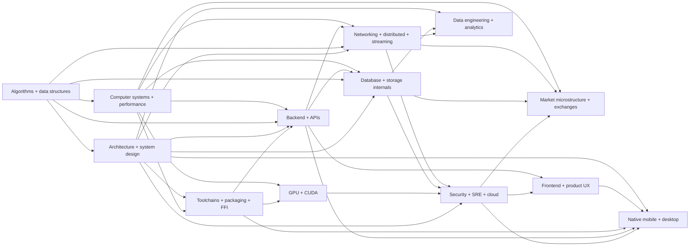

# Systems Engineering — mapa maestro de fuentes y construcción

> **Estado:** trece núcleos v1, revisión transversal y segunda pasada de código industrial público cerrados el 2026-08-21 bajo la definición de §Capa industrial. El corpus referencia 27 repositorios fijados por commit; el playbook y kit ejecutable v1 están implementados y probados. Los tres capstones pasan planificación y esperan evidencia sólo cuando se construyan como proyectos reales.
> **Propósito:** construir una biblioteca profesional, compacta y verificable para diseñar, programar, medir, desplegar y operar software desde el hardware hasta el producto.
> **Relación:** complementa la biblioteca DeepLearning.AI; no sustituye sus manuales de modelos, datos, agentes o evaluación.

## Resultado buscado

La biblioteca debe permitir que una persona o un agente Codex pueda:

- explicar el costo real de una decisión desde CPU/memoria hasta API y producto;
- convertir requisitos en arquitectura, contratos, código, pruebas, benchmarks y runbooks;
- distinguir throughput, latencia, jitter, capacidad, disponibilidad, consistencia y seguridad;
- diagnosticar con evidencia, sin optimización por intuición;
- construir servicios generales, pipelines de datos, infraestructura de IA y sistemas de baja latencia;
- reconocer cuándo una abstracción es suficiente y cuándo el hot path exige control de bajo nivel.

## Jerarquía de evidencia

| Etiqueta | Evidencia | Uso permitido |
|---|---|---|
| `[SPEC]` | estándar, RFC, manual ISA, documentación oficial versionada | semántica normativa y contratos |
| `[ACADEMIC]` | curso universitario, texto de autores expertos o paper revisado | modelos, algoritmos, razonamiento y límites |
| `[CODE]` | implementación o repositorio oficial | comprobar comportamiento real y detalles de integración |
| `[PROD]` | ingeniería publicada por operadores o autores con experiencia demostrada | prácticas de operación, incidentes y trade-offs |
| `[MEASURED]` | experimento reproducible con entorno declarado | conclusión de rendimiento dentro de ese entorno |
| `[IMPL]` | traducción de la biblioteca a diseño, código, test o runbook | instrucción operativa propia, no atribuida a la fuente |
| `[OPEN]` | pregunta o afirmación todavía no verificada | nunca tratar como recomendación cerrada |

### Regla de triangulación

Una recomendación material necesita, cuando aplique:

```text
modelo académico
    + semántica oficial
    + código o medición reproducible
    + evidencia operativa
```

Una sola charla no establece una regla universal. Una especificación define comportamiento, no rendimiento. Un benchmark demuestra un entorno, no todos los entornos. Una práctica de una gran empresa no se adopta sin comprobar que sus restricciones coinciden con las nuestras.

## Mapa documental mínimo

| Orden | Documento | Autoridad principal | Estado |
|---:|---|---|---|
| 1 | `COMPUTER_SYSTEMS_PERFORMANCE_LOW_LATENCY.md` | CPU, memoria, SO, concurrencia, profiling, C++/Rust y baja latencia | Linux source/`io_uring` + Intel/AMD/Arm + Meta `sched_ext` auditados |
| 2 | `SOFTWARE_BACKEND_API_ENGINEERING.md` | diseño de software, HTTP, REST/gRPC, contratos, auth, testing, servicios y entrega | núcleo + práctica Google/AWS/xAI auditados |
| 3 | `NETWORKING_DISTRIBUTED_STREAMING.md` | TCP/UDP/WebSocket, protocolos, consenso, replicación, Kafka/Flink y kernel bypass | núcleo + código Kafka/Flink fijado + práctica Cloudflare/AWS auditados |
| 4 | `DATABASE_STORAGE_INTERNALS.md` | índices, buffer pool, ejecución, WAL, MVCC, transacciones y storage engines | código PostgreSQL/RocksDB + SQLite + Apple/FoundationDB auditados |
| 5 | `GPU_ACCELERATED_COMPUTING.md` | GPU, CUDA, kernels, memoria, profiling, multi-GPU, NCCL y Triton | núcleo + código CUTLASS/NCCL/TensorRT fijado; cruce xAI en IA |
| 6 | `SECURITY_SRE_CLOUD_INFRASTRUCTURE.md` | AppSec, IAM, criptografía aplicada, supply chain, cloud, Kubernetes y SRE | núcleo + código Kubernetes fijado + práctica Google SRE/estándares/xAI auditados |
| 7 | `MARKET_MICROSTRUCTURE_EXCHANGE_SYSTEMS.md` | order books, matching, market data, ejecución, protocolos y controles | protocolos/rulebooks Nasdaq, CME, Eurex, FIX y cripto auditados |
| 8 | `FRONTEND_PRODUCT_ENGINEERING_UX.md` | navegador, producto/HCI, UI, accesibilidad, rendimiento y entrega | plataforma + código Chromium/React/TypeScript fijado y Web Vitals auditados |
| 9 | `ALGORITHMS_DATA_STRUCTURES_PROBLEM_SOLVING.md` | modelado, corrección, complejidad, estructuras, paradigmas, tests y medición | núcleo + Swiss Tables/F14 auditados |
| 10 | `SOFTWARE_ARCHITECTURE_SYSTEM_DESIGN.md` | drivers, quality scenarios, dominio, límites, estilos, vistas, decisiones y evolución | núcleo + práctica AWS de aislamiento/fallos auditados |
| 11 | `DATA_ENGINEERING_ANALYTICS.md` | ciclo del dato, batch/stream, formatos, calidad, lineage, modelado, analytics y gobierno | núcleo Apache + práctica Uber/Airbnb auditados |
| 12 | `TOOLCHAINS_BUILDS_PACKAGING_FFI.md` | toolchains, builds herméticos, packages, ABI/FFI, releases y supply chain | código Bazel/Buck2 fijado + ecosistemas auditados |
| 13 | `NATIVE_MOBILE_DESKTOP_ENGINEERING.md` | mobile/desktop, lifecycle, offline, permisos, performance, firma, stores y updates | código AndroidX/AOSP fijado + práctica oficial Apple/Microsoft auditada |

Para modelos, datos, agentes, evaluación, RAG, inferencia y gobierno específico de IA, elegir primero autoridad en `AI_ENGINEERING_MASTER_MAP.md` y sumar de esta tabla sólo las fronteras físicas/operativas que atraviese el proyecto. No cargar ambos corpus completos por defecto.

La capa de aplicación está en `ENGINEERING_EXECUTION_PLAYBOOK.md`: contiene router de contexto, contratos, gates y uso de `engineering_execution_kit/`. No es una autoridad técnica adicional; convierte los manuales seleccionados en requisitos, decisiones, tests, benchmarks, evidencia y release.

La capa de ensamblaje inmediato está en `CODEX_ELITE_PROJECT_BOOTSTRAP.md`. `ENTERPRISE_FULL_STACK_BLUEPRINT.md` completa las superficies, módulos, journeys, seguridad, operación y delivery de una aplicación empresarial; `LEADING_COMPANY_PUBLIC_CODE_MATRIX.md` limita qué claim aporta cada compañía líder. `REUSABLE_CODE_READINESS_ROADMAP.md` separa el estado documental actual del golden starter y de los packs ejecutables todavía pendientes. Cuando se considere incorporar código o una arquitectura pública, el agente debe pasar por `PUBLIC_CODE_ARCHITECTURE_MASTER_MAP.md` y `PUBLIC_CODE_ARCHITECTURE_ADMISSION_STANDARD.md`; sólo un estado `REUSABLE_PACK` permite adopción automática condicionada al contrato del proyecto. Los expedientes y su estado están indexados en `architecture_packs/README.md` y permanecen candidatos hasta producir evidencia G3–G8 real.

Para franquicia y captación multicanal, `markdown_system/POST_DEEPSEEK_FRANCHISE_REAUDIT_2026-09-04.md` es la auditoría vigente. `GO_OMNICHANNEL_LEAD_INGRESS` materializa Google Lead Form y Mercado Libre Questions v4 hacia hash fuente + candidato/rechazo + PostgreSQL/outbox; el adapter Mercado Libre recibe `questions`, consulta el recurso allowlisted y reconcilia `UNANSWERED`. Meta agrega webhook firmado → lote/signal durable → retrieval/import; TikTok agrega retrieval v1.3 autenticado → tres artefactos hash-linked → import al mismo owner. Promoción CRM/consentimiento sigue separada y trazable. Cuentas/permisos/suscripciones live, autenticidad inbound, receipts/status provider y producción conservan gates propios.

Para tool calling del agente, `implementation_packs/GO_OPENAI_RESPONSES_TOOL_ADAPTER.md` aplica `POST /responses`, herramientas estrictas, validación server-side, `function_call_output` y conteo de uso. El adapter aislado no es el runtime; V236 lo conecta mediante `GO_CONNECTED_CONVERSATION_RUNTIME` y cierra `LIB-FAIL-1743` con evidencia E2E durable.

## Capa de práctica industrial pública

El núcleo académico/normativo permanece como autoridad conceptual. La nueva capa busca deltas de implementación y operación publicados por líderes reales de cada dominio. “Empresa líder” se evalúa por propiedad del problema, escala demostrada, calidad técnica de la publicación, código/especificación disponible y posibilidad de verificar límites; no por capitalización o fama general.

| Especialidad | Fuentes primarias candidatas de máxima prioridad | Evidencia buscada | Estado |
|---|---|---|---|
| sistemas y baja latencia | Linux, Intel/AMD, Google, Meta, Cloudflare | scheduler, memoria, atomics, profiling, tail latency, eBPF/io_uring/DPDK | Linux source/`io_uring` + Intel/AMD/Arm + Meta `sched_ext` incorporados; añadir sólo deltas |
| backend/API | Amazon/AWS, Google, Microsoft, Stripe, xAI | RPC, idempotencia, overload, SDKs, compatibilidad y operación | Google API/SWE + AWS Builders’ Library + xAI SDK/proto incorporados; añadir sólo deltas |
| redes/distribuidos/streaming | Cloudflare, Google, Meta, AWS, LinkedIn/Apache Kafka | protocolos, congestion, consensus, sharding, queues, backpressure e incidentes | RFC + código Kafka/Flink/Pingora fijado + AWS scale inversion; añadir sólo deltas |
| bases de datos/storage | PostgreSQL, Google Spanner, Amazon Dynamo/Aurora, Apple FoundationDB, Meta RocksDB, Oracle | MVCC, WAL, replication, transactions, LSM, query/storage operation | código PostgreSQL isolation/recovery + RocksDB `db_stress` + Apple/FoundationDB incorporados; motores cloud se fijan por proyecto |
| GPU/cómputo | NVIDIA, Google, Meta, AMD, xAI | kernels, compilers, memory, parallelism, collectives y co-design | código CUTLASS/NCCL/TensorRT fijado + CUDA/Nsight/xAI; añadir sólo deltas |
| seguridad/SRE/cloud | Google SRE/Project Zero, Microsoft Security, AWS, Cloudflare, NIST/OWASP | IAM, sandbox, secure SDLC, isolation, incidents, rollout y recovery | código Kubernetes fijado + Google SRE/BSoRS + NIST/OWASP/SLSA + xAI; exploits sólo si cambian un gate |
| mercados/exchanges | Nasdaq, CME, Eurex, Coinbase, Kraken, Binance, FIX | wire protocols, sequencing, matching, recovery, risk y market-data integrity | especificaciones/rulebooks y conformance incorporados; binding exacto se fija por venue/producto |
| frontend/producto | WHATWG/W3C, Chromium/Google, Mozilla, Meta React, Microsoft TypeScript | rendering, input, accessibility, performance, state, deployment y UX evidence | plataforma + código Chromium/React/TypeScript fijado por commit + Web Vitals; meta-framework se fija por proyecto |
| algoritmos/estructuras | LLVM, Abseil/Google, Folly/Meta, Rust, Linux | implementaciones, invariantes, trade-offs de memoria/concurrencia y benchmarks | Swiss Tables + F14 incorporados; añadir sólo deltas |
| arquitectura/system design | AWS Builders’ Library, Google SRE, Microsoft, Netflix, Uber | cells, failure isolation, migration, capacity, delivery e incident learning | AWS static stability/cells/shuffle/fallback incorporado; añadir sólo deltas |
| data engineering/analytics | Netflix, Uber, LinkedIn, Airbnb, Apache projects | CDC, batch/stream, quality, lineage, experimentation, scale y costo | Apache + Uber data product + Airbnb metrics incorporados; añadir sólo deltas |
| toolchains/builds/FFI | Bazel/Google, Buck2/Meta, LLVM, Rust/Cargo, PyPA, CMake | hermeticidad, cache, monorepo, ABI, packaging y supply chain | código Bazel/Buck2 fijado + ecosistemas incorporados; añadir sólo deltas |
| mobile/desktop | Apple, Android/Google, Microsoft, Chromium/Electron, Tauri | lifecycle, process death, sandbox, performance, firma y actualización | código AndroidX/AOSP fijado + guías oficiales; SDK concreto se fija por proyecto |

Sólo se incorporará un patrón que cambie una decisión, prueba, métrica, runbook o límite. Marketing, entrevistas sin artefactos y números sin metodología pueden orientar búsqueda, pero no se convertirán en instrucciones normativas.

La línea base industrial de una especialidad se considera cerrada cuando combina: autoridad conceptual o normativa, al menos una implementación/práctica primaria de un propietario real del problema, límites de extrapolación y una puerta ejecutable de pruebas/medición/rollback. “Cerrada” no significa congelada: una fuente nueva entra únicamente si aporta un delta material y verificable, evitando convertir la biblioteca en una colección infinita de casos empresariales.

## Dependencias



## Fuentes núcleo verificadas

### 1. Sistemas, rendimiento y baja latencia

| Fuente | Autores/institución | Función |
|---|---|---|
| MIT 6.172, *Performance Engineering of Software Systems* | Charles Leiserson y Julian Shun, MIT | análisis de rendimiento, assembly, compilador, multicore, medición, caché, vectorización, allocators y sincronización |
| MIT 6.S081/6.828, *Operating System Engineering* | Robert Morris, Frans Kaashoek y equipo PDOS, MIT | kernel, procesos, memoria virtual, traps, filesystem, concurrencia e interacción hardware/software |
| CS:APP / CMU 15-213 | Randal Bryant y David O'Hallaron, CMU | visión completa del sistema desde representación y assembly hasta memoria, linking, I/O, red y concurrencia |
| OSTEP | Remzi y Andrea Arpaci-Dusseau, Wisconsin | virtualización, concurrencia, persistencia y proyectos de sistemas |
| *Systems Performance* | Brendan Gregg | metodología, observabilidad, CPU, memoria, storage, red, benchmarking, `perf`, tracing y BPF |
| Intel SDM + Optimization Reference Manual | Intel | semántica x86-64, memoria, interrupciones, PMU, instrucciones, latencia y throughput específicos |
| C++ Standard/Core Guidelines + LLVM atomics | ISO/C++ editors y LLVM | lifetime, ownership, concurrencia, atomics y consecuencias del compilador |
| Rust Book + Rustonomicon | Rust Project | ownership, `Send`/`Sync`, threads, async y límites de `unsafe` |

Fuentes oficiales:

- <https://ocw.mit.edu/courses/6-172-performance-engineering-of-software-systems-fall-2018/>
- <https://pdos.csail.mit.edu/6.828/2021/>
- <https://csapp.cs.cmu.edu/>
- <https://pages.cs.wisc.edu/~remzi/OSTEP/>
- <https://www.brendangregg.com/systems-performance-2nd-edition-book.html>
- <https://www.intel.com/content/www/us/en/developer/articles/technical/intel-sdm.html>
- <https://isocpp.github.io/CppCoreGuidelines/CppCoreGuidelines>
- <https://llvm.org/docs/Atomics.html>
- <https://doc.rust-lang.org/stable/book/>
- <https://doc.rust-lang.org/stable/nomicon/>

### 2. Backend y APIs

Núcleo v1 auditado en `SOFTWARE_BACKEND_API_ENGINEERING.md`. Autoridad verificada: las 19 lecturas oficiales de MIT 6.102 Spring 2025; RFC 9110–9114, 5789, 9457, 8446, 9700, 8725 y 6585; OpenID Connect Core; OpenAPI 3.2.0; JSON Schema 2020-12; gRPC/Protocol Buffers; los diez riesgos de OWASP API Security 2023; Google *Software Engineering at Google* y AIPs seleccionadas; Amazon Builders’ Library. El manual es independiente de framework, separa semántica HTTP, contrato de dominio e implementación y cerró sus cruces con sistemas/rendimiento, redes/distribuidos y bases de datos.

### 3. Redes, distribución y streaming

Núcleo v1 auditado en `NETWORKING_DISTRIBUTED_STREAMING.md`. Autoridad verificada: los ocho checkpoints públicos de Stanford CS144 Fall 2025; schedule y papers centrales de MIT 6.5840 Spring 2026; RFC de IETF para UDP, IP, TCP, QUIC, WebSocket, DNS, MTU y HTTP/2–3; documentación oficial de Kafka 4.3, Flink 2.3, Linux networking, DPDK 26.07 observado, AF_XDP y RDMA. La segunda pasada fijó código de Kafka (producer epochs/sequences, transaction state y recovery) y Flink (barriers, abort/subsumption y sink 2PC). Sus cruces con sistemas/rendimiento, backend/API y bases de datos están cerrados; lecturas integrales y extensiones específicas permanecen declaradas, no ocultas.

### 4. Bases de datos y almacenamiento

Núcleo v1 auditado en `DATABASE_STORAGE_INTERNALS.md`. Autoridad verificada: schedule, notas 01–24 y P0–P4 de CMU 15-445/645 Fall 2025; cobertura completa de Berkeley CS186 Spring 2026; selección analítica de CMU 15-721 Spring 2024; papers originales de System R, ARIES, LSM, arquitectura DBMS, isolation y SSI; documentación/código de PostgreSQL 18.6, RocksDB, SQLite, Faiss y pgvector. La segunda pasada fijó PostgreSQL isolation/SSI/recovery y RocksDB `db_stress`/expected-state/fault injection. Cerró sus cruces con sistemas/rendimiento, backend/API y redes/distribuidos y ofrece matriz de trazabilidad y suites de aceptación.

### 5. GPU y cómputo acelerado

Núcleo v1 auditado en `GPU_ACCELERATED_COMPUTING.md`: CMU 15-418/15-618 Fall 2025, material público oficial seleccionado de Berkeley CS267, CUDA 13.3, Nsight Compute 13.3/Systems, NCCL 2.31.2, CUTLASS 4.7.0, TensorRT 11.2.1, PyTorch 2.13, Triton, HIP/ROCm 7.x y SYCL 2020 rev. 12. La segunda pasada fijó código de CUTLASS (capability/workspace/launch), NCCL (groups/async error/abort) y TensorRT (context/profile/memory/stream lifecycle). Cubre SIMT, memoria, kernels, numérica, profiling, multi-GPU, entrenamiento, inferencia y baja latencia; sus cruces recíprocos con sistemas, backend, redes, datos y manuales de IA quedaron cerrados el 2026-08-21.

### 6. Seguridad, SRE y cloud

Núcleo v1 auditado en `SECURITY_SRE_CLOUD_INFRASTRUCTURE.md`: 17 decks públicos/1.038 páginas de Stanford CS155 Spring 2026; curso público de Dan Boneh y texto Boneh–Shoup; NIST CSF/SSDF/Zero Trust/Digital Identity/Incident Response/PQC; OWASP Top 10:2025, ASVS 5.0.0 (345 requisitos/17 capítulos) y API Security 2023; Google SRE/Workbook/*Building Secure and Reliable Systems*; SLSA/Sigstore; OpenTelemetry/Prometheus; Kubernetes 1.36 y referencias cloud oficiales. La segunda pasada fijó workqueue, Deployment controller y finalizer de Kubernetes para reconciliación desde caches/eventos imperfectos. Cubre threat model/TCB, AppSec/API/IA, IAM/crypto/secrets, host/red/privacy, supply chain/IaC/Kubernetes/cloud, SLO/overload/observabilidad, release/incident y backup/recovery. Los cruces con todas las fronteras materiales actuales quedaron cerrados el 2026-08-21; provider/compliance/hardware específicos siguen condicionados al proyecto.

### 7. Microestructura y exchanges

Núcleo general v1 auditado en `MARKET_MICROSTRUCTURE_EXCHANGE_SYSTEMS.md`: Stanford MATH 237 y papers de Glosten–Milgrom, Kyle, Cont, Avellaneda–Stoikov, Gould y queue-reactive; Nasdaq ITCH/OUCH, Eurex T7, CME MDP y FIX; Binance, Coinbase y Kraken; Uniswap v2/v3; SEC/CFTC. Cubre state machines, snapshot/delta/gap/checksum, L1/L2/L3, matching, spread/impact/inventory/colas, métricas no predictivas, spot/derivados/AMM, low-latency path, order lifecycle/risk/integridad y suites. Codecs, rulebook completo y regulación se fijan por venue/producto/proyecto; sus cruces recíprocos materiales están cerrados.

### 8. Frontend

Núcleo general v1 auditado en `FRONTEND_PRODUCT_ENGINEERING_UX.md`: las 22 lecturas y secuencia práctica pública de MIT 6.813/6.831; WHATWG HTML/DOM/Fetch/URL; ECMAScript 2026 y TypeScript 6.0; CSS/WCAG 2.2/WAI-ARIA 1.2/i18n; Chromium; Web Vitals; React 19.2, plataforma/progressive enhancement y Web Components; WPT, Testing Library y Playwright. La segunda pasada fijó código de Chromium (secuencias/lifetime/sandbox/perf), React (scheduler/Fiber/Strict Effects) y TypeScript (incremental graph/watcher races/fallback completo). Cubre task analysis y error humano, prototipos/evaluación/experimentos, navegador/rendering/input, semantic HTML/CSS, TypeScript/toolchain, state/data races, SSR/CSR/hydration/caches, accesibilidad, performance, seguridad/privacidad, i18n, design systems, tests, observabilidad y contrato para Codex. Los cruces recíprocos 1–7 quedaron cerrados el 2026-08-21; APIs especiales y meta-framework concreto se fijan por proyecto.

### 9. Algoritmos, estructuras de datos y resolución de problemas

Núcleo general v1 auditado en `ALGORITHMS_DATA_STRUCTURES_PROBLEM_SOLVING.md`: MIT 6.006 Spring 2020 (20 clases), contrato de solución de MIT 6.006 Fall 2011, MIT 6.046J Spring 2015 (24 clases) y las seis áreas de Princeton *Algorithms, 4th Edition*. Cubre especificación, prueba de corrección, modelos de costo, estructuras, sorting/searching, grafos, paradigmas, strings, complejidad, external/streaming, implementación defensiva, pruebas, benchmark y contrato para Codex. La consistencia y cruces quedaron cerrados; su contrato ejecutable se materializa en `ENGINEERING_EXECUTION_PLAYBOOK.md`.

### 10. Arquitectura de software y system design

Núcleo general v1 auditado en `SOFTWARE_ARCHITECTURE_SYSTEM_DESIGN.md`: SEI/CMU, MIT 6.102, ISO/IEC/IEEE 42010:2022, ISO/IEC 25010:2023, Google SWE, C4, arc42, ADR y Refactoring. Cubre drivers, escenarios medibles de calidad, dominio/modularidad, estilos, contratos/datos, tácticas, capacidad/fallos, vistas/decisiones, ATAM, evolución, tests de arquitectura y contrato para Codex. Integridad/cruces están cerrados y el playbook aporta ADR/quality/evidence gates ejecutables.

### 11. Data engineering y analytics

Núcleo general v1 auditado en `DATA_ENGINEERING_ANALYTICS.md`: Stanford CS246, Berkeley Data 100, Apache Beam/Spark/Airflow/Arrow/Parquet/Iceberg, OpenLineage, dbt y Kimball. Cubre contrato/ciclo del dato, captura/CDC, batch/stream/time, transformación/idempotencia, schema/format/table layout, distributed compute/orchestration, quality/lineage, dimensional/metric modeling, analytics, gobierno, CI/CD, SRE, costo y contrato para Codex. Integridad/cruces están cerrados y el playbook aporta data/evidence/release gates ejecutables.

### 12. Toolchains, builds, packaging y FFI

Núcleo general v1 auditado en `TOOLCHAINS_BUILDS_PACKAGING_FFI.md`: Reproducible Builds, Bazel, CMake, Cargo/Rustonomicon, PyPA/CPython, Go modules, npm, SemVer e Itanium C++ ABI. La segunda pasada fijó código de Bazel para action identity, cache local/remota, corrupción y sandbox hermético, complementando Buck2. Cubre artifact/target contract, hermeticidad/reproducibilidad, action graph/cache, manifests/locks, compile/link/loader/ABI, FFI/ownership/unwind, packaging polyglot, CI/supply chain, release/rollback, tests y contrato para Codex. Integridad/cruces están cerrados y el playbook aporta artifact/evidence/release gates ejecutables.

### 13. Aplicaciones nativas móviles y de escritorio

Núcleo general v1 auditado en `NATIVE_MOBILE_DESKTOP_ENGINEERING.md`: Android Developers, Apple Developer, Microsoft Windows App SDK/MSIX, Flatpak y documentación oficial de Flutter, React Native, Electron y Tauri. La segunda pasada fijó AndroidX WorkManager/SavedState/process lifecycle y AOSP Binder/Parcel/ActivityThread para process death, reejecución e IPC real. Cubre decisión native/shared/cross-platform, lifecycle/activación/process death, arquitectura/state/concurrencia, offline/sync/background, red/deep links/IPC, permisos/hardware, seguridad/privacidad, startup/frames/memoria/batería, Android/Apple/Windows/Linux, accesibilidad/testing/observabilidad y firma/store/update. Integridad/cruces están cerrados; el playbook incluye capstone offline-first y cada proyecto fija APIs/SDKs/policies/dispositivos reales.

## Qué queda cubierto

| Pregunta | Receptor |
|---|---|
| algoritmos, memoria, CPU, concurrencia, C++/Rust, profiling | Sistemas |
| backend, API, autenticación de aplicación, contratos y tests | Backend/API |
| protocolos, WebSocket, consenso, colas y streaming | Redes/distribuidos |
| SQL real, índices, WAL, MVCC y persistencia | Bases de datos |
| kernels, CUDA, memoria GPU y multi-GPU | GPU |
| ciberseguridad, cloud, Kubernetes, observabilidad y SRE | Seguridad/SRE/cloud |
| order book, matching, feed handlers y ejecución | Mercados/exchanges |
| navegador, UI, UX, accesibilidad y rendimiento percibido | Frontend |
| modelado de problemas, estructuras, algoritmos, corrección y complejidad | Algoritmos |
| drivers, límites, trade-offs, vistas, decisiones y evolución del sistema | Arquitectura/system design |
| fuentes, pipelines, formatos, calidad, lineage, métricas y analytics | Data engineering/analytics |
| build graph, toolchains, packages, ABI/FFI y release reproducible | Toolchains/builds |
| aplicaciones mobile/desktop, lifecycle, offline, permisos, firma y updates | Aplicaciones nativas |
| convertir conocimiento en contrato, ejecución, evidencia y capstone | Engineering Execution Playbook + kit |

## Puertas obligatorias por manual

1. Inventario de todas las fuentes seleccionadas, versiones, módulos y material disponible.
2. Credenciales y rol de cada fuente declarados sin argumento de autoridad automático.
3. Extracción técnica separada de ejemplos promocionales o históricos.
4. Semántica contrastada contra estándar, RFC, ISA o documentación oficial.
5. Correcciones, supuestos y divergencias registradas.
6. Traducción a contratos, algoritmos, código, tests, métricas, benchmarks y runbooks.
7. Casos de fallo, límites, seguridad y rollback incluidos.
8. Auditoría transversal con los manuales anteriores.
9. Compresión final: una idea tiene una autoridad; los demás archivos enlazan.
10. Estado `completo` únicamente cuando no quedan módulos o contradicciones materiales sin declarar.

## Política de citas y literalidad

- Se preservarán términos técnicos, ecuaciones y semántica exacta.
- Las citas literales serán breves, atribuidas y necesarias para evitar ambigüedad.
- No se reproducirán cursos o libros completos; el resultado será una síntesis profesional verificable.
- Ninguna paráfrasis se presentará entre comillas ni como palabras exactas del autor.
- Cada tecnología cambiante llevará versión o fecha de verificación.

## Frontera profesional

Esta biblioteca construye una base amplia de ingeniería de software y sistemas. No reemplaza especializaciones completas en electrónica, diseño de chips, telecomunicaciones físicas, investigación criptográfica, contabilidad/regulación financiera, diseño gráfico o gestión de producto. Cuando un proyecto entre en uno de esos dominios, deberá añadirse una fuente especializada y no improvisar desde conocimiento general.

### Gate puntual Node core — V320

Para el runtime Windows Node24.20.0 fijado, consultar
markdown_system/NODE_OFFICIAL_RUNTIME_ADVISORY_PACK_PLAN.md y
implementation_packs/NODE_OFFICIAL_RUNTIME_ADVISORY_GATE.md. Motor oficial con
datos verificados y ejecución acotada;30tests/4CLI/rebuild10/10. No representa
monitoring, SCA de todos los componentes ni admisión productiva; condiciones
exactas y G0–G8 en reconstruction_evidence/NODE_OFFICIAL_ADVISORY_GATE_V320.md.

V372 maintenance: reference telemetry implementation is returned to canonical worker0.1.5 and WINDOWS_REFERENCE_TELEMETRY_RUNTIME.md/0.1.0, with opt-in WINDOWS_REFERENCE_TELEMETRY_PACK_PLAN.md. Source-only acquirer0.4.82 remains separate from runtime admission. TEST05 closure requires the fresh integrated replay and gates in reconstruction_evidence/INTEGRATED_TELEMETRY_CONTROL_V372.md; no production acceptance or private training data inferred.

V373: opt-in HISTORY-MODEL-TRAINING-PIPELINE0.1.0/17files, HISTORY_MODEL_TRAINING_PACK_PLAN2packs/21files;26policy tests and actual earlier synthetic SFT/evaluation/rollback. Final exact reconstruction/bootstrap/E2E and TEST09 decision are recorded in reconstruction_evidence/HISTORY_MODEL_TRAINING_CONTROL_V373.md. NEW requires no history; EXISTING keeps data/model private with its own authority/quality/runtime gates. No automatic training, provider call or deployment. SDK component selection precedes AUTHORED glue; see HISTORY_TRAINING_SDK_QUALIFICATION_V373.md and HISTORY_TRAINING_SDK_GAP_V373.md. Integral franchise remains67/754.

V400: encuestas conectadas con PostgreSQL/OIDC/Next, recuperación GET,4navegadores/8respuestas/8POST y retención CLI1/1/0.23archivos nuevos AUTHORED, packs GO-CUSTOMER-SURVEY-API0.1.0 y TS-CUSTOMER-SURVEY-PORTAL0.1.0, CONDITIONED.45/48sin promoción; TEST02/03/07 siguen abiertos. Ver reconstruction_evidence/CONNECTED_CUSTOMER_SURVEYS_V400.md.
