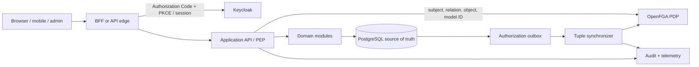

# Identity & Authorization Pack — Keycloak + OpenFGA

> **Estado:** `CANDIDATE_PACK`, plan técnico listo; promoción a `REUSABLE_PACK` pendiente de inspección profunda G3–G7 y ejecución de su harness.
> **Revisiones auditadas:** `keycloak/keycloak@ccd6f59fd8e3a27cebdf1b1f3be42a1d2d4888c4`; `openfga/openfga@60b3f451d496fb6c49ffbe233de160298cca7c16`.
> **Licencias:** Apache-2.0 en ambos snapshots; volver a verificar release, container, adapters y SDKs elegidos.
> **Problema:** autenticar personas/servicios y autorizar acciones por organización, franquicia, sucursal y recurso sin codificar permisos dispersos.
> **No-objetivo:** reemplazar reglas de dominio, validación, risk gates o transacciones por un token o una llamada al PDP.

## 1. Autoridad y evidencia

Manuales:

- `SECURITY_SRE_CLOUD_INFRASTRUCTURE.md` — identidad, least privilege, secrets, threat model, SRE y recovery;
- `SOFTWARE_BACKEND_API_ENGINEERING.md` — OIDC/OAuth, object authorization, API y errores;
- `AI_SECURITY_GOVERNANCE_PRIVACY.md` — autoridad por ejecución y agentes;
- `NETWORKING_DISTRIBUTED_STREAMING.md` — timeout, incertidumbre, cache y fallos remotos;
- `DATABASE_STORAGE_INTERNALS.md` — source of truth, outbox y migrations;
- `PUBLIC_CODE_ARCHITECTURE_ADMISSION_STANDARD.md` — licencia y admisión.

Fuentes oficiales:

- [Keycloak documentation 26.7.1](https://www.keycloak.org/docs/);
- [Keycloak production configuration](https://www.keycloak.org/server/configuration-production);
- [Keycloak Authorization Services architecture](https://www.keycloak.org/docs/latest/authorization_services/index.html);
- [OpenFGA modeling guides](https://openfga.dev/docs/modeling);
- [OpenFGA production practices](https://openfga.dev/docs/best-practices/running-in-production);
- [OpenFGA model design principles](https://openfga.dev/docs/best-practices/modeling-design-principles);
- [OpenFGA model version pinning](https://openfga.dev/docs/getting-started/cli).

## 2. Decision gate

### Usar Keycloak cuando

- se necesita OIDC/SAML, SSO, MFA/WebAuthn, federation o lifecycle de sesión;
- múltiples aplicaciones comparten identidad;
- password policies, recovery y administración exceden un proveedor simple;
- existe capacidad para operar/actualizar un IdP crítico.

### No usar Keycloak automáticamente cuando

- un OIDC administrado compatible satisface costo, residencia y exit strategy;
- el proyecto pequeño no puede operar HA, backups, upgrades y seguridad de un IdP;
- se pretende guardar perfiles/dominio completo dentro del realm.

### Usar OpenFGA cuando

- permisos dependen de organización, sucursal, ownership, jerarquía o relación;
- existen múltiples tenants y recursos compartibles;
- RBAC global produce condicionales o joins dispersos;
- el modelo requiere evolución, auditoría y pruebas separadas de endpoints.

### No usar OpenFGA automáticamente cuando

- una tabla local y constraints resuelven pocos roles estáticos;
- el equipo no puede operar otro datastore/PDP;
- la latencia/failure dependency no cabe en el SLO;
- se pretende modelar riesgo dinámico, límites financieros o invariantes de negocio como relaciones.

## 3. Separación de responsabilidades

| Componente | Posee | No posee |
|---|---|---|
| Keycloak | credenciales, login, MFA, federation, sesión, tokens y clients | pedidos, sucursales, stock, garantía o permiso final por objeto |
| aplicación | usuarios de dominio, organizaciones, recursos, invariantes, estados y risk gates | contraseñas o protocolo de identidad implementado a mano |
| OpenFGA | modelo de relaciones, tuples y decisión fina | datos completos del recurso, transacciones de negocio o autenticación humana |
| API/BFF | PEP, token/session validation, context y error semantics | policy inventada desde campos de UI |

Elegir un único PDP principal para autorización fina. No mantener reglas equivalentes y divergentes entre Keycloak Authorization Services, OpenFGA y cada endpoint.

## 4. Arquitectura



### Request path

```text
authenticate session/token
→ validate issuer/signature/audience/time/client
→ map stable principal
→ load tenant/resource context without trusting client ownership fields
→ local revocation/risk precheck
→ OpenFGA Check(model_id, user, relation, object)
→ domain invariant and current-state check
→ transaction/effect
→ audit decision and result
```

Una respuesta `allow` sólo prueba la relación consultada en el modelo/revisión indicados. No prueba que el recurso exista, esté en un estado operable, tenga stock, respete monto límite o pueda transferirse.

## 5. Identidad estable

No usar email, username, display name o número de documento como ID de autorización.

```text
principal_key = canonical_issuer_id + "|" + token.sub
```

- issuer se valida contra allowlist/config;
- `sub` se trata como opaco y estable dentro del issuer;
- el dominio mantiene su propio `principal_id` y mapping versionado;
- linking/unlinking de identidades es operación sensible y auditada;
- cuentas de servicio/agentes son principals distintos de humanos;
- impersonation/delegation conserva actor, subject, purpose y expiración.

## 6. Browser y sesión

Baseline recomendado para web sensible:

- Authorization Code Flow + PKCE;
- BFF mantiene tokens fuera de JavaScript cuando el producto lo permite;
- cookie `Secure`, `HttpOnly`, `SameSite` según journey y scope mínimo;
- CSRF defense para autenticación basada en cookie;
- rotación/revocación y session age explícitos;
- step-up MFA para administración, pagos, exportación y cambios de identidad;
- redirect URIs exactas; nunca wildcard amplio en producción;
- endpoints administrativos separados/restringidos;
- TLS end-to-end y secretos fuera de frontend/repositorio.

## 7. Modelo OpenFGA inicial para franquicias

Este modelo es propio de este pack y debe ajustarse al dominio real:

```fga
model
  schema 1.1

type user

type organization
  relations
    define owner: [user]
    define admin: [user] or owner
    define member: [user] or admin

type branch
  relations
    define organization: [organization]
    define manager: [user]
    define staff: [user]
    define view: manager or staff or admin from organization
    define manage: manager or admin from organization

type inventory_item
  relations
    define branch: [branch]
    define view: view from branch
    define adjust: manage from branch

type order
  relations
    define branch: [branch]
    define customer: [user]
    define view: customer or view from branch
    define manage: manage from branch

type supplier_contract
  relations
    define organization: [organization]
    define viewer: member from organization
    define manager: admin from organization
```

### Reglas

- modelar el dominio, no un meta-modelo genérico;
- permisos estables de aplicación viven en el model; roles custom de usuario pueden vivir como tuples tipadas;
- separar `view`, `manage`, `adjust`, `approve`, `refund`, `export` y otras acciones por costo/daño;
- no crear relación `admin_can_do_everything` sin blast radius y tests;
- catálogo público no llama OpenFGA por cada producto si no existe restricción;
- datos sensibles requieren autorización incluso si el frontend no muestra el enlace.

## 8. Versionado del modelo

OpenFGA crea modelos inmutables. Producción debe enviar un `authorization_model_id` específico.

```text
write candidate model
→ static/model tests
→ shadow checks on representative corpus
→ migrate/backfill tuples idempotently
→ compare old/new allow-deny matrix
→ pin candidate model ID in canary
→ observe false allow/deny and latency
→ promote config revision
→ retain previous model ID for rollback window
```

No usar “latest model” implícito en producción.

## 9. Sincronización dominio ↔ tuples

No existe transacción atómica automática entre PostgreSQL y OpenFGA.

### Grant fail-closed

```text
domain transaction:
  membership = PENDING_GRANT
  append outbox(grant, tuple, model_id, idempotency_key)
commit
→ worker writes tuple
→ verify/receipt
→ domain transaction marks ACTIVE
```

El PEP exige estado local `ACTIVE` y `Check=allow` para acciones sensibles.

### Revoke fail-closed

```text
domain transaction:
  membership = REVOKED
  increment policy/revocation epoch
  append outbox(delete tuple)
commit
→ PEP denies immediately from local state/epoch
→ worker removes tuple idempotently
```

Así un retraso del sincronizador pierde disponibilidad o deja basura temporal, pero no extiende acceso revocado.

### Worker obligations

- idempotency key y deterministic tuple identity;
- bounded retries + DLQ/quarantine con owner;
- deadline/cancelación;
- reconcile scan domain→FGA y FGA→domain cuando sea autorizado;
- lag, failure y oldest-pending metrics;
- no loggear tokens ni PII;
- replay por revision/model ID;
- cleanup seguro al retirar modelos.

## 10. Caching y disponibilidad

- cache key incluye tenant, principal, relation, object, model ID y policy epoch;
- TTL y staleness forman parte del security contract;
- revocación invalida o eleva epoch;
- acciones de alto daño no usan positive cache sin revocation proof;
- `deny` cacheado no debe bloquear un grant más allá del presupuesto aceptado;
- si OpenFGA no responde, política por acción: normalmente fail-closed para write/admin/export/payment;
- read público o datos no sensibles pueden usar fallback explícito independiente del PDP;
- circuit breaker nunca convierte timeout en allow.

## 11. Protección de Keycloak y OpenFGA

- redes privadas y egress/ingress mínimos;
- TLS; mTLS/OIDC para service-to-service donde corresponda;
- base de datos productiva, backups y restore drills;
- admin endpoints no expuestos junto al frontend público;
- cuentas operativas separadas, MFA y break-glass auditado;
- secrets en manager con rotación;
- rate limits y límites de payload/concurrencia;
- health/readiness sin filtrar configuración;
- images por digest, SBOM/provenance y actualización de advisories;
- logs con actor/resource/relation/model/policy/result, sin token/credential.

OpenFGA documenta su control de acceso interno como experimental/no recomendado para producción en la revisión observada. Este pack usa autenticación OIDC/TLS y aislamiento externo; no activa ese experimental por defecto.

## 12. API contract del PEP

```text
authorize(
  principal,
  tenant_context,
  relation,
  object_type,
  object_id,
  model_id,
  request_id,
  deadline
) -> ALLOW | DENY | INDETERMINATE
```

- `DENY`: identidad válida, decisión negativa o revocación;
- `INDETERMINATE`: timeout, dependencia, model mismatch o respuesta inválida;
- API externa normalmente convierte ambos a no ejecutar, pero telemetry y retry semantics difieren;
- cliente no recibe detalles que permitan enumerar recursos;
- 404 vs 403 se decide por leakage contract;
- autorización se repite en cada objeto y side effect, no sólo en route group.

## 13. Tests obligatorios

### Token/session

- issuer/audience/azp según contrato;
- signature y key rotation;
- exp/nbf/clock skew;
- token de otro realm/client/tenant;
- logout/revocation/session expiry;
- redirect/CSRF/PKCE;
- step-up y recovery;
- service account versus human.

### Model

- owner/admin/member heredados;
- manager/staff por branch;
- cross-organization deny;
- customer sólo ve su order;
- staff no ajusta stock sin relación;
- revoked deny inmediato;
- public resource bypass explícito;
- unknown type/relation/object deny;
- old/new model differential corpus.

### Synchronization/faults

- duplicate/out-of-order outbox;
- crash antes/después de tuple write;
- grant permanece cerrado hasta ACTIVE;
- revoke cierra antes de tuple delete;
- FGA timeout/partition/restart;
- Keycloak DB/cache/node loss;
- stale cache y policy epoch;
- backfill cancel/restart;
- model rollback;
- restore desde backup con reconciliation.

### Abuse/performance

- object enumeration;
- tuple explosion/deep relationship graph;
- batch limits y payload adversarial;
- hot principal/resource;
- p50/p95/p99/p99.9 por `Check` y request completo;
- cache hit/staleness;
- outbox lag y recovery goodput;
- overload sin fail-open.

## 14. Observabilidad

Métricas mínimas:

```text
authn_success/failure by safe reason
token_validation_duration
authorization_allow/deny/indeterminate
authorization_duration by relation/object class
model_id/config_revision
cache_hit/stale/invalidation
tuple_write/delete/retry/failure
outbox_depth/oldest_age/reconcile_diff
keycloak sessions/login errors/cache/db saturation
openfga check/write errors/datastore saturation
```

Trace:

```text
request → token validation → resource lookup → local fence
→ FGA check → domain decision → effect → audit receipt
```

No incluir access token, refresh token, password, full tuple dataset o atributos sensibles en telemetry.

## 15. Rollout

1. local con fake OIDC y OpenFGA real aislado;
2. model tests en CI;
3. staging con Keycloak/OpenFGA y fault injection;
4. shadow authorization sin conceder;
5. canary por tenant/branch;
6. dual model differential;
7. promoción con model/config revision inmutable;
8. rollback al model ID/config anterior y pause de tuple migrations.

## 16. Project contract mínimo

```yaml
identity:
  issuer: ""
  clients_and_flows: []
  principal_mapping: ""
  mfa_step_up: []
authorization:
  model_revision: ""
  tenants_resources_relations: []
  local_revocation_fence: ""
  failure_policy_by_action: {}
sync:
  outbox_schema: ""
  lag_slo: ""
  reconciliation: ""
security:
  admin_boundary: ""
  tls_secret_rotation: ""
  audit_retention: ""
recovery:
  rpo_rto: ""
  restore_and_reconcile: ""
```

## 17. Gates pendientes para promoción

- [x] licencias raíz verificadas en snapshots;
- [x] documentación actual de producción/modelado contrastada;
- [x] arquitectura portable y failure boundaries escritos;
- [x] modelo inicial y protocolos grant/revoke/migration;
- [x] test, telemetry, rollout y rollback definidos;
- [ ] inspección de code paths y tests upstream fijados;
- [ ] harness local del pack implementado y ejecutado;
- [ ] benchmark y fault campaign capturados;
- [ ] upgrade/restore ensayados;
- [ ] manifest del Engineering Execution Kit pasa evidence gate.

Hasta completar los últimos gates, Codex puede usar este archivo para planificar y construir un vertical slice bajo revisión; no puede declarar la combinación production-ready.
