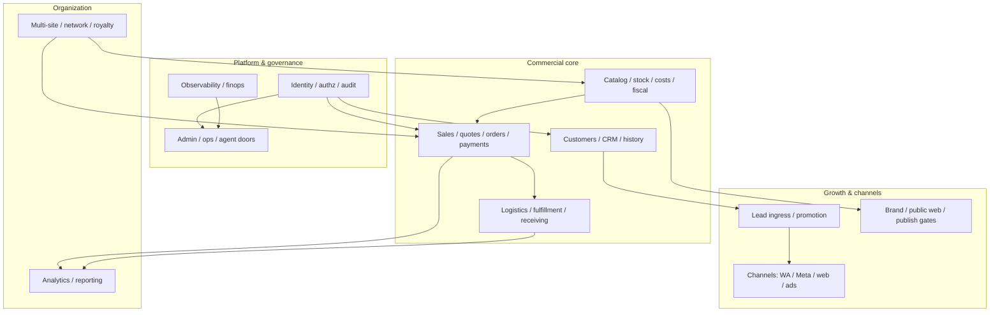

# Franchise / company architecture — elite-engineering-library

**Tip SHA:** `477358d0d7090f2c39467abe5634d81f38afae7f`  
**Scope:** documentation / architecture shape only. **No** REVESTEX product code. **No** invented implementation packs.

## Course correction (read first)

The thin **CAN / CANNOT** list in [`docs/FRANCHISE_PLAYBOOK.md`](FRANCHISE_PLAYBOOK.md) and the Nightly matrix in [`docs/ROADMAP.md`](ROADMAP.md) describe **library infrastructure / local-fixtures** wiring — not the full franchise **product** surface.

| Lens | What it answers | What it does **not** answer |
|---|---|---|
| `LIBRARY_INFRASTRUCTURE` / `LOCAL_FIXTURES` | Can I compose the **full franchise-domain** selected profile (116→120), verify local receipts, bridge a consumer? | Is my company live, multi-country, fully staffed on every channel? |
| **Franchise / company domains** (this doc) | What business domains exist end-to-end, what is on disk, what is conditioned, what is missing? | Production authorization (`production_authorized: false` in `qualification/FINAL_LIBRARY_READY_V402.json`) |

**Anti-"3 features" frame:** Selected **116→120** is the **full franchise-domain library compose** for `LOCAL_FIXTURES` — not a thin trio (compose / Lead / QR). Identity, catalog, CRM, sales, payments, logistics, fiscal, channels, network, analytics, agents, and ops surfaces are all in scope of that composition; gaps below are honest **FALTA** rows, not absence of domain intent.

**Honest catalog rule:** `implementation_packs/*.md` on disk (**214** packs @ tip) ≠ selected **116** (`markdown_system/FRANCHISE_COMPLETE_PACK_PLAN.md`) ≠ V403 extension **120** (`markdown_system/FRANCHISE_COMPLETE_EXTENSION_PACK_PLAN_V403.md`). A path cited below may be **on disk only** — the matrix column **Selected 116** states inclusion in the franchise reference composition.

## How doors relate

```text
README.md → AGENTS.md → USE_LIBRARY_V403.md → LIBRARY_HEALTH_CHECK.md
  → START_FRANCHISE.md → LIBRARY_VS_PRODUCT_GATE_V402.md → FINAL_LIBRARY_READY_V402.json
  → docs/FRANCHISE_ARCHITECTURE.md (this file) + docs/ROADMAP.md (build order)
  → FRANCHISE_COMPLETE_PACK_PLAN.md (116) or FRANCHISE_COMPLETE_EXTENSION_PACK_PLAN_V403.md (120)
  → FRANCHISE_PROJECT_OPERATING_PROTOCOL.md (consumer execution)
```

V403 experience overlays (`PUBLIC_WEB_EXPERIENCE_PACK_PLAN_V403.md`, `ADMIN_OPS_EXPERIENCE_PACK_PLAN_V403.md`, `LIBRARY_EXPERIENCE_CLOUD_EXTENSION_V403.md`) are **separate expedientes** — they do not retroactively change V402 ZIP bytes or `READY_FOR_LIBRARY_USE` scope.

## Domain dependency graph (conceptual)



Solid arrows = hard dependencies in [`architecture_packs/FRANCHISE_FULL_STACK_FOUNDATION.md`](architecture_packs/FRANCHISE_FULL_STACK_FOUNDATION.md) slice order. Dashed operational couplings (campaigns → CRM, fiscal → returns) are documented per domain row.

## Status legend

| Status | Meaning @ tip `477358d` |
|---|---|
| **HECHO** | Admitted pack(s) in selected 116 **or** 120 extension **and** reference code/contracts findable; local fixtures PROVEN_LOCAL where cited in `markdown_system/FRANCHISE_GAP_MAP.md` |
| **PARCIAL** | Function exists via conditioned packs, disk-only packs, reference code, or live gates still open (creds, IdP, visual approval, provider) |
| **NO** | No admitted pack filename for the claim; intentional GAP documented |

Live provider credentials, cloud CI, physical devices, and production admission remain **CONDITIONED** across all domains unless a receipt explicitly says otherwise.

---

## Nightly Audit Engineer inventory @ `477358d`

Verified against on-disk paths at tip. Architecture PR = **library compose claims only** — no REVESTEX product until N L says **ESTAMOS LISTOS**.

### HECHO (library compose / local fixtures)

| # | Claim | Cite @ `477358d` |
|---|---|---|
| 1 | Composition **116→120**; catalog ≠ selected | `markdown_system/FRANCHISE_COMPLETE_PACK_PLAN.md` (116 `packId` entries); `markdown_system/FRANCHISE_COMPLETE_EXTENSION_PACK_PLAN_V403.md` (+4 → 120); `implementation_packs/*.md` (**214** on disk) |
| 2 | V402 READY receipt + **READY_WITH_CAVEATS** + `production_authorized: false` | `qualification/FINAL_LIBRARY_READY_V402.json` (`library_readiness`: `READY_FOR_LIBRARY_USE`, `scope`: `LIBRARY_INFRASTRUCTURE`, `production_authorized`: false); `docs/ROADMAP.md` (`READY_WITH_CAVEATS` = local-fixtures framing) |
| 3 | Multi-domain transactional model (catalog / CRM / inventory / pricing / payment / logistics / franchise schemas) | `implementation_packs/ELECTROMOBILITY_FRANCHISE_MODULES.md` (`ELECTROMOBILITY-FRANCHISE-MODULES` in selected 116); `db/migrations/0003_electromobility_franchise_modules.up.sql` |
| 4 | Payments cluster | Selected: `implementation_packs/GO_BC_EXACT_AMOUNT_ADAPTER.md`, `GO_PAYMENT_CHECKOUT_RUNTIME.md`, `GO_OFFICIAL_PAYMENT_WEBHOOK_ADAPTERS.md`, `GO_EXACT_FX_SNAPSHOT_ACCOUNTING.md`, `TYPESCRIPT_PAYMENT_CHECKOUT_PORTAL.md`, `GO_COMMERCE_PRICING_PAYMENT_API.md` |
| 5 | Channels: Lead Form + Meta/TikTok + WA + ML (**CONDITIONED** live creds) | `GO_OMNICHANNEL_LEAD_INGRESS.md`, `GO_META_LEAD_*`, `PYTHON_TIKTOK_LEAD_ADAPTER.md`, `GO_TIKTOK_LEAD_DURABLE_IMPORT.md`, `PYTHON_META_WHATSAPP_CLOUD_ADAPTER.md`, `GO_CONNECTED_WHATSAPP_*`, `GO_MERCADOLIBRE_*`, `GO_CONNECTED_MARKETPLACE_MUTATION.md`; `markdown_system/FRANCHISE_GAP_MAP.md` (T2805 PROVEN_LOCAL, live creds pending) |
| 6 | Signed release / verify | `implementation_packs/PORTABLE_SIGNED_RELEASE_EVIDENCE_GATE.md` (`PORTABLE-SIGNED-RELEASE-EVIDENCE-GATE` in selected 116); `START_REFERENCE_V402.md` |
| 7 | AI / conversation selected cluster (**CONDITIONED** provider keys) | `GO_CONVERSATIONAL_AGENT.md`, `GO_CONVERSATION_TOOLS.md`, `GO_CONNECTED_CONVERSATION_RUNTIME.md`, `GO_APP_WIRING.md`, `GO_AGENT_DOMAIN_BINDING.md`, `GO_OPENAI_RESPONSES_TOOL_ADAPTER.md` (all in selected 116) |

### PARCIAL

| # | Claim | Cite @ `477358d` |
|---|---|---|
| 8 | QR **identity**: door-wired; **absent** from selected `packId` JSON | `implementation_packs/GO_QR_CORE.md`, `internal/qr/`; **no** `GO-QR-CORE` in `FRANCHISE_COMPLETE_PACK_PLAN.md` |
| 9 | QR **capture**: `qr_capture/` ref-only → **FALTA** admitted pack | `qr_capture/`; `markdown_system/LIBRARY_HEALTH_CHECK.md` |
| 10 | Analytics dashboards / CRM segmentation / brand DAM / admin UX — compose **cores** exist; gap-gate catalog packs or document **FALTA** | **Selected cores:** `GO_DATA_ANALYTICS_CORE.md`, `GO_CONNECTED_ROLE_METRICS_PROOF.md`; **disk / separate expediente (not selected 116/120 JSON):** `implementation_packs/GO_DASHBOARDS_CORE.md`, `implementation_packs/TYPESCRIPT_ADMIN_OPS_EXPERIENCE_V403.md` + `markdown_system/ADMIN_OPS_EXPERIENCE_PACK_PLAN_V403.md`; brand: `TYPESCRIPT_PUBLISHED_CATALOG_STOREFRONT.md`, V403 `TS-PUBLIC-WEB-EXPERIENCE-V403` (visual PENDING) — no dedicated DAM pack |
| 11 | ARCA **PROVEN_LOCAL**; live creds pending | ARCA stack in selected 116; `markdown_system/FRANCHISE_GAP_MAP.md` (`ARCA_INFRA`); `docs/ARCA_LOCAL_REFERENCE.md` |
| 12 | Multi-site: hierarchy / territory / royalty **compose**; site CMS / IaC thin; Galaxy = field guide only | **Compose:** `ELECTROMOBILITY_FRANCHISE_MODULES.md`, `GO_NETWORK_ROLE_COMPOSITION.md`, `GO_FRANCHISE_ROYALTY_SETTLEMENT_API.md`, `TYPESCRIPT_NETWORK_ROLE_PORTAL.md`; **thin:** per-site CMS/IaC not a dedicated admitted pack; Galaxy: `docs/FRANCHISE_PLAYBOOK.md` §5 (`etor6233/grok-bot-galaxy@f8546c3`, 0 `franchise` hits) |

### FALTA / NO (do not invent)

| # | Claim | Cite @ `477358d` |
|---|---|---|
| 13 | **GTM** Tag Manager (tree miss; Lead Form ≠ GTM) | No `*GTM*` under `implementation_packs/` or `markdown_system/`; `markdown_system/PACK_PER_CLAIM_INDEX.md`, `LIBRARY_HEALTH_CHECK.md` |
| 14 | Named **`*SDR*`** pack (function only via lead ingress + promotion + business-function contract) | `GO_OMNICHANNEL_LEAD_INGRESS.md`, `GO_LEAD_CANDIDATE_PROMOTION.md`, `markdown_system/BUSINESS_FUNCTION_OPERATING_CONTRACT_V403.md`, `implementation_packs/BUSINESS_FUNCTION_OPERATING_V403.md` |
| 15 | Production live / V403 successor READY / Desktop V3 from Git / Galaxy franchise e2e | `qualification/FINAL_LIBRARY_READY_V402.json`; `unified-experience-next/markdown_system/SUCCESSOR_AUTHORITY_ROUTER.md` (IN_PROGRESS); `docs/ROADMAP.md` (Desktop V3 UNKNOWN_NEVER_PUSHED); Galaxy §5 |

### Public patterns for PARCIAL (cite only — no code copy)

| PARCIAL area | Pattern (URL / title) |
|---|---|
| Identity / OIDC | [NIST SP 800-63B](https://pages.nist.gov/800-63-3/sp800-63b.html); [OpenID Connect Core 1.0](https://openid.net/specs/openid-connect-core-1_0.html) |
| GTM gap | [Google server-side Tag Manager architecture](https://developers.google.com/tag-platform/tag-manager/server-side/intro) |
| Observability / SLO | [Google SRE Book — monitoring distributed systems](https://sre.google/sre-book/monitoring-distributed-systems/) |
| ARCA / fiscal live | [AFIP WSFE documentation](https://www.afip.gob.ar/ws/documentacion/ws-factura-electronica.asp) (official manuals; compose with `MICROSOFT_ARCA_*` + `GO_ARCA_FISCAL_ISSUANCE_API.md`) |
| Fulfillment / logistics | [Amazon SP-API Fulfillment Outbound](https://developer-docs.amazon.com/sp-api/docs/fulfillment-outbound-api) |
| Multi-site / org isolation | [AWS Control Tower — multi-account governance](https://docs.aws.amazon.com/controltower/latest/userguide/what-is-control-tower.html) |
| Brand / admin UX | [Material Design](https://m3.material.io/); [Fluent 2](https://fluent2.microsoft.design/); [Adobe Spectrum](https://spectrum.adobe.com/) (method references for V403 overlays — not shipped as elite packs) |

---

## Full domain matrix

### 1. Identity / security / authorization / audit

| Status | Selected 116 | Primary paths @ `477358d` | Notes |
|---|---|---|---|
| **PARCIAL** | Yes (core); some assets disk-only | `implementation_packs/GO_OIDC_SERVICE_TOKEN_BROKER.md`, `GO_OIDC_PORTAL_SESSION.md`, `TYPESCRIPT_OIDC_PORTAL_ADAPTER.md` (`GO-OIDC-SERVICE-TOKEN-BROKER`, `GO-OIDC-PORTAL-SESSION`, `TS-OIDC-PORTAL-ADAPTER`); `implementation_packs/MICROSOFT_DEVSKIM_ADAPTED_SAST_GATE.md`; `implementation_packs/SECURE_OPERATIONS_DELIVERY_CORE.md`; `implementation_packs/GO_HUMAN_APPROVAL_CORE.md`; `reconstruction_evidence/IDENTITY_J5_RELEASE_V402.md`, `IDENTITY_PORTAL_RELEASE_V402.md`; `docs/J5_IDP_ACCESS_CONTRACT.md` | J5 access-review PROVEN_LOCAL; live IdP/MFA/federation = consumer gate. No dedicated enterprise audit-log pack in selected 116. |
| | Disk only | `implementation_packs/GO_PCI_DSS_SCOPE_CORE.md`, `GO_GDPR_CONSENT_ERASURE_CORE.md`, `GO_OTP_VERIFICATION_CORE.md` | Catalog ≠ selected; gap gate if REQUIRED. |

**Research (audit / identity):** [NIST SP 800-63B](https://pages.nist.gov/800-63-3/sp800-63b.html); [OpenID Connect Core 1.0](https://openid.net/specs/openid-connect-core-1_0.html); [AWS SaaS Lens — tenant context in logs](https://docs.aws.amazon.com/wellarchitected/latest/saas-lens/multi-tenant-microservices.html).

**Proposed elite additions:** `markdown_system/AUDIT_EVENT_PACK_PLAN.md` (proposed) — central audit schema + tenant-scoped append-only events composed from `GO-HUMAN-APPROVAL-CORE` + existing PG outbox patterns; not a fake HECHO pack.

---

### 2. Catalog / stock / PI-PL / costs / fiscal (ARCA)

| Status | Selected 116 | Primary paths @ `477358d` | Notes |
|---|---|---|---|
| **HECHO** | Yes | Schema foundation: `ELECTROMOBILITY-FRANCHISE-MODULES` + `db/migrations/0003_electromobility_franchise_modules.up.sql`; APIs: `GO-SUPPLY-FACTORY-INVENTORY-API`, `GO-CONNECTED-CATALOG-*`, `GO-CONNECTED-SERIAL-SUPPLY`, `GO-CONNECTED-SUPPLY-CREATION`; portals `TS-CATALOG-AUTHORING-PORTAL`, `TS-SERIAL-SUPPLY-PORTAL`, `TYPESCRIPT-PUBLISHED-CATALOG-STOREFRONT`; BC adapters `GO-BC-EXACT-AMOUNT-ADAPTER`, `GO-BC-SALES-CONTRACT-ADAPTER`; `GO-EXACT-FX-SNAPSHOT-ACCOUNTING`, `GO-FINOPS-CORE`, `GO-BUSINESS-POLICY-PROFILE` | Multi-domain transactional model per pack claim (catalog, CRM, inventory, pricing, payment, logistics, franchise schemas). |
| **PARCIAL** | Yes / disk | ARCA stack (`MICROSOFT-ARCA_*`, `GO-ARCA-FISCAL-ISSUANCE-API`, `ARCA-WSFE-UDS-WORKER`); `docs/ARCA_LOCAL_REFERENCE.md`; `markdown_system/FRANCHISE_GAP_MAP.md` (`ARCA_INFRA` PROVEN_LOCAL); `GO-ENTERPRISE-ACCOUNTING-LEDGER-API`; disk: `GO_I18N_CORE.md`, `GO_FX_CORE.md` | ARCA infra PROVEN_LOCAL; **live creds pending**. PI-PL = BC-derived + fixtures, not full ERP. |

**Research (inventory / fiscal live):** [Microsoft Inventory Visibility](https://learn.microsoft.com/en-us/dynamics365/supply-chain/inventory/inventory-visibility); [AFIP WSFE documentation](https://www.afip.gob.ar/ws/documentacion/ws-factura-electronica.asp).

**Proposed elite additions:** explicit `CATALOG_COST_ROLLUP_PACK_PLAN.md` bridging `GO-FINOPS-CORE` + ledger API for franchisee P&L views (doc plan only).

---

### 3. Customers + history / CRM

| Status | Selected 116 | Primary paths @ `477358d` | Notes |
|---|---|---|---|
| **HECHO** | Yes | `GO-ELECTROMOBILITY-PUBLIC-CRM-API`, `GO-FRANCHISE-CUSTOMER-JOURNEY-API`, `GO-PG-CONTACT-CHANNEL-IDENTITY`; `GO-CUSTOMER-SURVEY-API`, `TS-CUSTOMER-SURVEY-PORTAL`; `reconstruction_evidence/FRANCHISE_CUSTOMER_JOURNEY_2026-08-29_V114.md` | CRM history via journey + channel identity; not a standalone Salesforce-class CRM pack. |
| **PARCIAL** | Disk | `implementation_packs/GO_ONBOARDING_CORE.md`, `GO_APPLICANT_ONBOARDING_CORE.md` | On disk only; onboarding in selected set uses `TS-MULTIROLE-ONBOARDING`. |

**Research:** [Microsoft prospect-to-quote](https://learn.microsoft.com/en-us/dynamics365/guidance/business-processes/prospect-to-quote-overview); [Microsoft case-to-resolution](https://learn.microsoft.com/en-us/dynamics365/guidance/business-processes/case-to-resolution-introduction).

**Proposed elite additions:** `CUSTOMER_360_READ_MODEL_PACK_PLAN.md` — query composition over existing journey + CRM APIs.

---

### 4. Sales / quotes / orders / payments

| Status | Selected 116 | Primary paths @ `477358d` | Notes |
|---|---|---|---|
| **HECHO** | Yes | `GO-COMMERCE-PRICING-PAYMENT-API`, `GO-FRANCHISE-CUSTOMER-JOURNEY-API`, `GO-PAYMENT-CHECKOUT-RUNTIME`, `GO-OFFICIAL-PAYMENT-WEBHOOK-ADAPTERS`, `TS-PAYMENT-CHECKOUT-PORTAL`, `GO-INITIAL-HANDOVER-API`; return chain `GO-RETURN-*` workers; `reconstruction_evidence/FRANCHISE_QUOTE_TO_ORDER_2026-08-29_V116.md`, `FRANCHISE_AUTHENTICATED_COMMANDS_2026-08-29_V115.md` | T2802 PROVEN_LOCAL quote→order→payment fixture path. |
| **PARCIAL** | — | Live payment provider creds; `docs/payment-hosted-checkout.md`, `docs/payment-callback-reference.md` | Sandbox/fixture ≠ live acquirer. |

**Research:** [Microsoft service-to-deliver / service-to-cash](https://learn.microsoft.com/en-us/dynamics365/guidance/business-processes/service-to-cash-introduction).

---

### 5. Analytics / reporting / dashboards / CRM segmentation

| Status | Selected 116 | Primary paths @ `477358d` | Notes |
|---|---|---|---|
| **PARCIAL** | Partial | **Selected cores:** `GO-DATA-ANALYTICS-CORE`, `GO-HTTP-METRICS-REFERENCE`, `GO-CONNECTED-ROLE-METRICS-PROOF`; ads read adapters `PYTHON-*-ADS-REPORTING-ADAPTER`; CRM journey `GO-FRANCHISE-CUSTOMER-JOURNEY-API`, `GO-ELECTROMOBILITY-PUBLIC-CRM-API`; `docs/analytics/immutability-and-retention.md` | Analytics + role metrics compose; **CRM segmentation** = journey/CRM APIs, not a standalone segmentation pack. |
| **PARCIAL** | Disk / **FALTA** select | `implementation_packs/GO_DASHBOARDS_CORE.md`, `GO_SLO_CORE.md` — **not** in selected 116/120 JSON | Gap-gate or future composition select — **do not invent** dashboard pack body. |

**Research:** [Google SRE Book — monitoring distributed systems](https://sre.google/sre-book/monitoring-distributed-systems/); `markdown_system/TOTAL_SYSTEM_CAPABILITY_CONTRACT.md` (`ANALYTICS-BI`).

**Proposed elite additions:** select `GO-DASHBOARDS-CORE` via `implementation_packs/CAPABILITY_GAP_RESOLUTION_GATE.md` when consumer marks dashboards REQUIRED.

---

### 6. Multi-site / multi-sede (network / franchise org)

| Status | Selected 116 | Primary paths @ `477358d` | Notes |
|---|---|---|---|
| **PARCIAL** | Yes (compose) | `ELECTROMOBILITY-FRANCHISE-MODULES`, `GO-NETWORK-ROLE-COMPOSITION`, `TS-NETWORK-ROLE-PORTAL`, `GO-FRANCHISE-ROYALTY-SETTLEMENT-API`; `reconstruction_evidence/FRANCHISE_NETWORK_ADMINISTRATION_2026-08-30_V118.md`, `FRANCHISE_ROYALTY_SETTLEMENT_2026-08-30_V120.md` | Hierarchy / territory / royalty **compose** PROVEN_LOCAL; **site CMS / per-site IaC thin** — no dedicated admitted pack. |
| **PARCIAL** | External | Galaxy field guide only — `docs/FRANCHISE_PLAYBOOK.md` §5 | Orchestration KB; **not** franchise e2e or installable fleet IaC. |

**Research:** [AWS Control Tower — multi-account governance](https://docs.aws.amazon.com/controltower/latest/userguide/what-is-control-tower.html); [Google Identity Platform multi-tenancy](https://cloud.google.com/identity-platform/docs/multi-tenancy).

**Proposed elite additions:** `NETWORK_OPERATING_MODEL_PACK_PLAN.md` — ADR template for silo vs pool tenancy aligned to `FRANCHISE_FULL_STACK_FOUNDATION.md`.

---

### 7. Channels (WhatsApp, Messenger, Instagram, ads, email, web lead ingress)

| Sub-channel | Status | Selected 116 | Primary paths @ `477358d` | Notes |
|---|---|---|---|---|
| WhatsApp Cloud | **HECHO** | Yes | `PYTHON-META-WHATSAPP-CLOUD-ADAPTER`, `GO-CONNECTED-WHATSAPP-HOST`, `GO-CONNECTED-SCHEDULED-WHATSAPP`, `GO-CONNECTED-WHATSAPP-CAMPAIGNS`; `docs/whatsapp-connected-host.md` | T2805 PROVEN_LOCAL wiring; live token pending. |
| Meta Page publish | **HECHO** | Yes | `PYTHON-OFFICIAL-META-PAGE-WRITE-ADAPTER`, `GO-META-PAGE-PUBLISHING-INFRASTRUCTURE` | No Instagram/TikTok/LinkedIn outbound in page-write pack scope. |
| Meta / Google / TikTok leads | **HECHO** (fixtures) / **PARCIAL** (live) | Yes | `GO-OMNICHANNEL-LEAD-INGRESS` (Google Lead Form + ML Questions), `GO-META-LEAD-*`, `PYTHON-TIKTOK-LEAD-ADAPTER`, `GO-TIKTOK-LEAD-DURABLE-IMPORT`, `GO-LEAD-CANDIDATE-PROMOTION` | Nightly #5: selected cluster HECHO for LOCAL_FIXTURES; live creds **CONDITIONED** (`FRANCHISE_GAP_MAP.md` T2805). |
| Messenger / Instagram DM | **PARCIAL** | No | **Disk:** `implementation_packs/GO_MESSAGING_CHANNEL_ADAPTERS.md`; `internal/msgchannels/metagraph.go` (parse only; no outbound Instagram/Messenger claim) | Adapter on disk, **not** in selected 116. |
| Email (B2B / transactional) | **PARCIAL** | Partial | `GO-CHANNELS-CORE`, `GO-PG-OUTBOUND-DELIVERY-FENCE`; disk: `GO_MESSAGING_CHANNEL_ADAPTERS.md`, `AWS_SES_IMMUTABLE_EMAIL_RECEIVER.md`, `GO_AWS_ENTERPRISE_STORAGE_EMAIL_ADAPTERS.md` | SES pack on disk, not in 116. |
| Ads reporting | **PARCIAL** | Yes | `PYTHON-*-ADS-REPORTING-ADAPTER` (Google/Meta/TikTok) | Read-only reporting, not campaign mutation. |
| Social posting (IG/FB/TikTok/LinkedIn) | **PARCIAL** | No | **Disk:** `implementation_packs/GO_SOCIAL_POSTING_CORE.md`, `GO_MARKETING_CORE.md` | Scheduled post core exists; not selected 116. |
| Web lead ingress (public) | **HECHO** | Yes | `GO-OMNICHANNEL-LEAD-INGRESS`; V403 overlay `implementation_packs/TYPESCRIPT_PUBLIC_WEB_EXPERIENCE_V403.md` + `markdown_system/PUBLIC_WEB_EXPERIENCE_PACK_PLAN_V403.md` | Public visual approval PENDING per V403 plan. |
| **GTM / Tag Manager** | **NO** | — | **GAP** — `markdown_system/LIBRARY_HEALTH_CHECK.md`, `markdown_system/PACK_PER_CLAIM_INDEX.md` (no `*GTM*` row) | **Do not invent** GTM pack. |
| Mercado Libre / Google Merchant | **HECHO** | Yes | `GO-MERCADOLIBRE-MARKETPLACE-ADAPTER`, `GO-MERCADOLIBRE-QUESTION-OUTBOUND`, `GO-CONNECTED-MARKETPLACE-MUTATION`, `PYTHON-GOOGLE-MERCHANT-PRODUCT-SYNC-ADAPTER`, `GO-CONNECTED-GOOGLE-MERCHANT` | T2805 marketplace scope consolidated. |

**Research (GTM gap):** [Google server-side Tag Manager intro](https://developers.google.com/tag-platform/tag-manager/server-side/intro); [GTM consent mode + server-side](https://developers.google.com/tag-platform/tag-manager/server-side/consent-mode); [Client vs server-side tagging](https://support.google.com/tagmanager/answer/13387731).

**Proposed elite additions:** `GTM_SERVER_SIDE_PACK_PLAN.md` (proposed name only) — admission via `implementation_packs/CAPABILITY_GAP_RESOLUTION_GATE.md` if consumer marks `ADS-ATTRIBUTION` + web tags as REQUIRED; compose with existing consent + `GO-OMNICHANNEL-LEAD-INGRESS` boundaries.

---

### 8. Logistics / fulfillment / receiving

| Status | Selected 116 | Primary paths @ `477358d` | Notes |
|---|---|---|---|
| **HECHO** | Yes | `GO-FULFILLMENT-SERVICE-FRANCHISE-API`, `GO-CONNECTED-SUPPLY-CREATION`, `GO-CONNECTED-SERIAL-SUPPLY`, `GO-SUPPLY-FACTORY-INVENTORY-API`; `docs/inventory/MICROSOFT_BC_*_DERIVATION.md`, `docs/logistics/MICROSOFT_BC_AMAZON_CONNECTED_CARRIER_DERIVATION.md`; `reconstruction_evidence/FRANCHISE_HANDOVER_SERVER_EVIDENCE_2026-08-30_V136.md` | Receiving + handover connected in local fixtures. |
| **PARCIAL** | — | Distributed order management across many legal entities | No DOM-equivalent pack; BC derivations are pattern docs. |

**Research:** [Amazon SP-API Fulfillment Outbound](https://developer-docs.amazon.com/sp-api/docs/fulfillment-outbound-api); [Microsoft Distributed Order Management](https://learn.microsoft.com/en-us/dynamics365/commerce/dom).

**Proposed elite additions:** `FULFILLMENT_SOURCE_SELECTION_PACK_PLAN.md` — rule engine spec referencing `GO-FULFILLMENT-SERVICE-FRANCHISE-API` + network roles.

---

### 9. Brand / public web / publish gates / DAM

| Status | Selected 116 | Primary paths @ `477358d` | Notes |
|---|---|---|---|
| **PARCIAL** | Yes + extension | **Selected:** `TYPESCRIPT-PUBLISHED-CATALOG-STOREFRONT`, `GOOGLE-LIGHTHOUSE-WEB-QUALITY-GATE`, `MICROSOFT-PLAYWRIGHT-BROWSER-GATE`, `TS-GO-API-WEB-BRIDGE`, `TS-FRANCHISE-JOURNEY-PORTALS`; **V403 extension:** `TS-PUBLIC-WEB-EXPERIENCE-V403`, `TS-FRANCHISE-EXPERIENCE-V403`, `TS-DESIGN-SYSTEM-V403`; plans `markdown_system/PUBLIC_WEB_EXPERIENCE_PACK_PLAN_V403.md`, `markdown_system/FRANCHISE_EXPERIENCE_PACK_PLAN_V403.md` | Storefront + publish gates compose; visual approval **PENDING**. |
| **PARCIAL** | **FALTA** DAM | No dedicated brand DAM / asset-library pack in tree | Catalog images + `GO-CONNECTED-CATALOG-PUBLICATION` only; gap-gate if REQUIRED. |
| **PARCIAL** | Disk only | `implementation_packs/GO_SEO_CORE.md` + `src/app/sitemap.ts`, `src/platform/seo/public-indexing.ts` | SEO core on disk; Lighthouse in 116. |

**Research:** [Material Design](https://m3.material.io/); [Fluent 2](https://fluent2.microsoft.design/); [Adobe Spectrum](https://spectrum.adobe.com/) (UX method refs for V403 overlays).

---

### 10. Admin / ops / governance / agent doors / admin UX

| Status | Selected 116 | Primary paths @ `477358d` | Notes |
|---|---|---|---|
| **HECHO** | Yes (protocol / doors) | `START_FRANCHISE.md`, `markdown_system/FRANCHISE_PROJECT_OPERATING_PROTOCOL.md`, `ENGINEERING_EXECUTION_VALIDATOR.md`, `PROJECT_START_READINESS_VALIDATOR.md`; **V403 extension (120):** `BUSINESS-FUNCTION-OPERATING-V403`, `markdown_system/BUSINESS_FUNCTION_OPERATING_CONTRACT_V403.md` | Agent doors + business-function contract in 120 profile. |
| **PARCIAL** | Separate expediente | `markdown_system/ADMIN_OPS_EXPERIENCE_PACK_PLAN_V403.md` → `implementation_packs/TYPESCRIPT_ADMIN_OPS_EXPERIENCE_V403.md` (`TS-ADMIN-OPS-EXPERIENCE-V403`) — **not** in selected 116/120 JSON | Admin UX overlay exists on disk; gap-gate before treating as composed — **do not invent** pack admission. |
| **PARCIAL** | — | `markdown_system/TOTAL_SYSTEM_CAPABILITY_CONTRACT.md` (48 surfaces); training/help: `GO-CONNECTED-HUMAN-TRAINING`, `GO-CONNECTED-HELP-CMS`, `TS-CONNECTED-*-PORTAL` | 48 surfaces ≠ 48 executed apps; T2804 PROVEN_LOCAL for guides/locale. |

**Research:** [Microsoft RBAC overview](https://learn.microsoft.com/en-us/azure/role-based-access-control/overview) (cited in `BUSINESS_FUNCTION_OPERATING_CONTRACT_V403.md`); DORA capabilities linked there.

---

### 11. Lead ingress / promotion (SDR function — no invented pack)

| Status | Selected 116 | Primary paths @ `477358d` | Notes |
|---|---|---|---|
| **HECHO** | Yes (ingress + promotion) | `GO-OMNICHANNEL-LEAD-INGRESS`, `GO-LEAD-CANDIDATE-PROMOTION`, Meta/TikTok lead packs (§7) | Nightly #5 cluster; LOCAL_FIXTURES path. |
| **PARCIAL** | Yes (function only) | `markdown_system/BUSINESS_FUNCTION_OPERATING_CONTRACT_V403.md` → `#/functions/sdrs` → `GO_LEAD_CANDIDATE_PROMOTION.md` | SDR **function** without named pack. |
| **NO** | — | Named `*SDR*` workflow pack | Nightly #14 — **FALTA**; do not invent. |

**Research:** HubSpot campaign operations (method reference in business-function contract); lead handoff patterns in prospect-to-quote docs above.

**Proposed elite additions:** extend `GO-LEAD-CANDIDATE-PROMOTION` operating doc **or** admit a future `LEAD_HANDOFF_WORKFLOW_PACK_PLAN.md` via gap resolution — not a fabricated `GO-SDR-*` pack body.

---

### 12. QR identity / capture

| Status | Selected 116 | Primary paths @ `477358d` | Notes |
|---|---|---|---|
| **PARCIAL** (identity) | **No** | `implementation_packs/GO_QR_CORE.md`, `internal/qr/` | Pack on disk; **GO-QR-CORE absent** from `FRANCHISE_COMPLETE_PACK_PLAN.md` packId list (`docs/ROADMAP.md` caveat). |
| **PARCIAL** (capture) | **No** | `qr_capture/` (`worker.py`, `client.py`, `browser-capture.mjs`) | Reference code only; **FALTA** admitted capture pack (`LIBRARY_HEALTH_CHECK.md`). |

**Research:** OWASP logging / mobile capture boundaries per `GO_QR_CORE` pack upstream refs.

**Proposed elite additions:** `QR_CAPTURE_ADMISSION_PACK_PLAN.md` (proposed) — separate from identity; must pass `CAPABILITY_GAP_RESOLUTION_GATE.md`.

---

### 13. Galaxy fleet orchestration (orchestration only)

| Status | Selected 116 | Primary paths @ `477358d` | Notes |
|---|---|---|---|
| **PARCIAL** | N/A (external pin) | `docs/FRANCHISE_PLAYBOOK.md` §5 — pin `etor6233/grok-bot-galaxy@f8546c3990a165be8d17a178880a364aeeb3ac80`; how-tos only | `franchise` string hits = **0** at pin; no provisioning IaC; Duplicate/Marketplace ≠ franchise e2e. |
| **NO** | — | Installable franchise fleet product / multi-tenant bot provisioning | Orchestration field guide only. |

**Research:** Treat as ops KB — not a substitute for `GO-CONNECTED-CONVERSATION-RUNTIME` or `GO-CONVERSATIONAL-AGENT` in selected 116.

---

### 14. Additional surfaces named by elite (cross-cutting)

| Surface | Status | Paths | Notes |
|---|---|---|---|
| Conversational agent / tools | **HECHO** | `GO-CONVERSATIONAL-AGENT`, `GO-CONVERSATION-TOOLS`, `GO-CONNECTED-CONVERSATION-RUNTIME`, `GO-APP-WIRING`, `GO-AGENT-DOMAIN-BINDING`, `GO-OPENAI-RESPONSES-TOOL-ADAPTER` | Single runtime owner per composition ack. |
| Document intelligence | **PARCIAL** | `GO-CONNECTED-DOCUMENT-REFERENCE`, `GO-AWS-TEXTRACT-DOCUMENT-RUNTIME`, `MICROSOFT-AZURE-DOCUMENT-INTELLIGENCE-OFFICIAL-INVOICE-SAMPLE`, `SECURE-LOCAL-FILE-INGESTION-GATE`; T2806 PROVEN_LOCAL | Fixture pipeline; native detectors simulated. |
| Warranty / service | **HECHO** | `GO-CONNECTED-WARRANTY-CLAIM`, `GO-BC-WARRANTY-COVERAGE-ADAPTER`, `TS-WARRANTY-ROLE-PORTAL`, `GO-WARRANTY-ROLE-VIEW` | J4 connected locally. |
| Marketplace / Amazon | **PARCIAL** | `PYTHON_AMAZON_SPAPI_*` adapters on disk; selected ML/Merchant packs in 116 | Full Amazon SP-API surface not entirely in 116. |
| Cloud execution (V403) | **PARCIAL** | `FRANCHISE-CLOUD-EXECUTION-V403`, `markdown_system/FRANCHISE_CLOUD_EXECUTION_PLAN_V403.md`, `markdown_system/LIBRARY_EXPERIENCE_CLOUD_EXTENSION_V403.md` | Extension pack in 120 profile; not V402 ZIP. |
| V403 successor authority | **PARCIAL** | `unified-experience-next/markdown_system/SUCCESSOR_AUTHORITY_ROUTER.md` | IN_PROGRESS — do not inherit V402 READY. |
| Production / live franchise | **NO** | `qualification/FINAL_LIBRARY_READY_V402.json` (`production_authorized: false`); `reconstruction_evidence/LIBRARY_VS_PRODUCT_GATE_V402.md` | Library READY ≠ product READY. |

---

## Recommended build order (franchise consumer)

Aligned with [`architecture_packs/FRANCHISE_FULL_STACK_FOUNDATION.md`](architecture_packs/FRANCHISE_FULL_STACK_FOUNDATION.md) slices + selected 116 dependency reality.

| Phase | Domains | Elite owners to materialize first | Exit criteria |
|---|---|---|---|
| **0 — Gates** | Agent doors, library vs product | `START_FRANCHISE.md` bridge → `PROJECT_OPERATING_CONNECTION`; `PROJECT_START_READINESS_VALIDATOR` | Consumer `PROJECT_PACK_PLAN.md` pins 116 or 120; rounds A–H started |
| **1 — Platform** | Identity, audit baseline, observability | `PG-TX-FOUNDATION`, `GO-ENTERPRISE-BACKEND`, `GO-OIDC-*`, `SECURE-OPS-DELIVERY-CORE`, `GO-HTTP-METRICS-REFERENCE` | Fail-closed auth middleware; migration runner; structured logs |
| **2 — Org / network** | Multi-site, roles, policy | `ELECTROMOBILITY-FRANCHISE-MODULES`, `GO-NETWORK-ROLE-COMPOSITION`, `GO-BUSINESS-POLICY-PROFILE`, `TS-NETWORK-ROLE-PORTAL` | Negative authz tests per branch/HQ |
| **3 — Catalog + supply** | Stock, authoring, publication | `GO-SUPPLY-FACTORY-INVENTORY-API`, `GO-CONNECTED-CATALOG-*`, serial supply portals | Draft/publish version + ATP/reservation rules |
| **4 — CRM + leads** | Customers, ingress, promotion | `GO-ELECTROMOBILITY-PUBLIC-CRM-API`, `GO-OMNICHANNEL-LEAD-INGRESS`, `GO-LEAD-CANDIDATE-PROMOTION`, channel identity | Lead → candidate → promotion path without live spam |
| **5 — Commercial** | Quote, order, pay, handover | `GO-FRANCHISE-CUSTOMER-JOURNEY-API`, `GO-COMMERCE-PRICING-PAYMENT-API`, checkout + webhook packs, `GO-INITIAL-HANDOVER-API` | Vertical slice quote→pay→handover in fixtures |
| **6 — Fulfillment + returns** | Logistics, receiving, reversals | `GO-FULFILLMENT-SERVICE-FRANCHISE-API`, `GO-CONNECTED-SUPPLY-CREATION`, `GO-RETURN-*` workers | Receiving + return fiscal credit path |
| **7 — Fiscal** | ARCA | ARCA stack + `GO-ARCA-FISCAL-ISSUANCE-API` | PROVEN_LOCAL infra; live creds = phase 8+ |
| **8 — Channels (live)** | WA, Meta, ads, email | Meta/WA adapters, campaign packs, ads reporting | Provider creds + reconciliation receipts |
| **9 — Brand / public** | Web, SEO, publish gates | Storefront + V403 public overlay when approved | Playwright/Lighthouse gates; visual sign-off |
| **10 — Analytics + ops** | Dashboards, role metrics, training | `GO-DATA-ANALYTICS-CORE`, `GO-CONNECTED-ROLE-METRICS-PROOF`, help/training packs | Reporting freshness + help version = release version |
| **11 — Gaps (explicit)** | GTM, QR capture, named SDR, Galaxy fleet | `CAPABILITY_GAP_RESOLUTION_GATE.md` per claim | Research + admission decision recorded |

Phases may overlap only where `FRANCHISE_PROJECT_OPERATING_PROTOCOL.md` records independent owners and no duplicate writers.

---

## Gap → research → propose elite (summary)

| Gap | Status | Public pattern (URL) | Proposed elite shape |
|---|---|---|---|
| GTM / tag manager | **NO** | [Google server-side GTM architecture](https://developers.google.com/tag-platform/tag-manager/server-side/intro) | Gap gate only — Nightly #13; Lead Form ≠ GTM |
| Named SDR pack | **NO** (function **PARCIAL**) | [Prospect-to-quote](https://learn.microsoft.com/en-us/dynamics365/guidance/business-processes/prospect-to-quote-overview) | Extend `BUSINESS_FUNCTION_OPERATING_CONTRACT_V403.md` + `GO-LEAD-CANDIDATE-PROMOTION` |
| QR capture pack | **NO** (identity **PARCIAL**) | Mobile capture hardening (OWASP) | `QR_CAPTURE_ADMISSION_PACK_PLAN.md` |
| Enterprise audit stream | **PARCIAL** | [AWS SaaS Lens logging](https://docs.aws.amazon.com/wellarchitected/latest/saas-lens/multi-tenant-microservices.html) | `AUDIT_EVENT_PACK_PLAN.md` |
| Dashboards / admin UX / brand DAM | **PARCIAL** | [Google SRE Book](https://sre.google/sre-book/monitoring-distributed-systems/); Material / Fluent / Spectrum (method) | Gap-gate `GO_DASHBOARDS_CORE.md`, `TYPESCRIPT_ADMIN_OPS_EXPERIENCE_V403.md`; DAM = **FALTA** |
| Messenger/Instagram outbound | **PARCIAL** (disk adapters) | Meta Messenger Platform docs (cited in `GO_MESSAGING_CHANNEL_ADAPTERS.md`) | Compose disk pack + outbound fence tests before selecting |
| DOM / multi-LE fulfillment | **PARCIAL** | [Microsoft DOM](https://learn.microsoft.com/en-us/dynamics365/commerce/dom) | `FULFILLMENT_SOURCE_SELECTION_PACK_PLAN.md` |
| Galaxy franchise fleet | **NO** (orchestration **PARCIAL**) | External KB pin only | Do not conflate with elite packs |
| Production authorization | **NO** | `LIBRARY_VS_PRODUCT_GATE_V402.md` | Consumer target gates only |

---

## Stop line

- `READY_FOR_LIBRARY_USE` / `READY_WITH_CAVEATS` = **library infrastructure / local fixtures** only.
- **No REVESTEX product** implementation from this repo until N L says **ESTAMOS LISTOS** (`docs/FRANCHISE_PLAYBOOK.md` §6).
- Do not invent `*SDR*`, `*GTM*`, or QR capture packs as HECHO bodies.

## Related documents

| Doc | Role |
|---|---|
| [`docs/ROADMAP.md`](ROADMAP.md) | Matrices: `LIBRARY_INFRASTRUCTURE` + `FRANCHISE / COMPANY DOMAINS` build order |
| [`docs/FRANCHISE_PLAYBOOK.md`](FRANCHISE_PLAYBOOK.md) | Assemble steps; thin CAN list scoped to fixtures |
| [`markdown_system/FRANCHISE_COMPLETE_PACK_PLAN.md`](../markdown_system/FRANCHISE_COMPLETE_PACK_PLAN.md) | Selected 116 JSON |
| [`markdown_system/FRANCHISE_COMPLETE_EXTENSION_PACK_PLAN_V403.md`](../markdown_system/FRANCHISE_COMPLETE_EXTENSION_PACK_PLAN_V403.md) | 120-pack V403 profile |
| [`markdown_system/FRANCHISE_GAP_MAP.md`](../markdown_system/FRANCHISE_GAP_MAP.md) | T280x local control evidence |
| [`markdown_system/LIBRARY_HEALTH_CHECK.md`](../markdown_system/LIBRARY_HEALTH_CHECK.md) | Wiring + honest GAPs |
