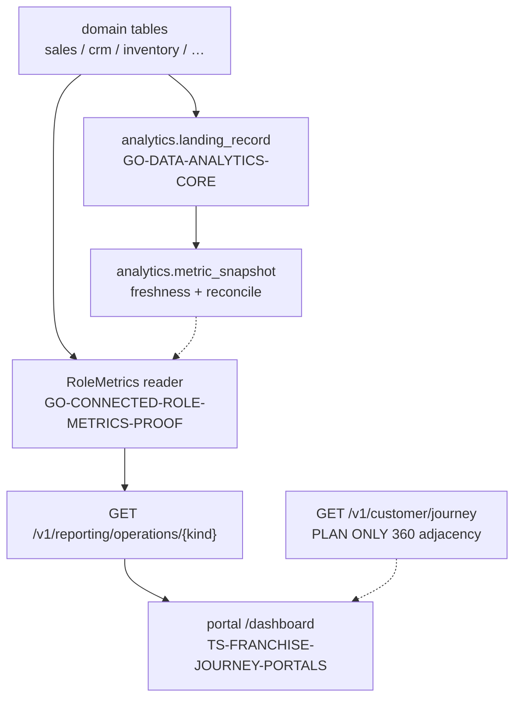

# ANALYTICS / DASHBOARDS / CRM SEGMENTATION — tangible slice compose

Tip pin: `45035406fb7e5c996e39a2cfda7ed0195260a9ed`

Status: **PARCIAL → tangible slice** (local fixtures + selected composition only). **Not** production, **not** REVESTEX, **not** a named SDR, GTM, or segmentation HECHO pack.

## 0. Architecture contract (read-only cites @ tip `4503540`)

This slice doc does **not** re-open the architecture doors; it aligns with them:

| Door | Path @ `4503540` | Analytics row |
| --- | --- | --- |
| Domain architecture | [`docs/FRANCHISE_ARCHITECTURE.md`](../FRANCHISE_ARCHITECTURE.md) § **5. Analytics / reporting / dashboards / CRM segmentation** | **PARCIAL** — selected cores + role metrics compose; disk **FALTA** select: `GO_DASHBOARDS_CORE.md`; segmentation **FALTA** |
| Nightly matrix | [`docs/FRANCHISE_ARCHITECTURE.md`](../FRANCHISE_ARCHITECTURE.md) § **PARCIAL → Analytics** | Same cite set as §5 |
| Build-order matrix | [`docs/ROADMAP.md`](../ROADMAP.md) § **FRANCHISE / COMPANY DOMAINS** → Analytics / dashboards / CRM segmentation | **PARCIAL** — `GO_DATA_ANALYTICS_CORE.md`, `GO_CONNECTED_ROLE_METRICS_PROOF.md`; dashboards disk **FALTA** select; segmentation **FALTA** |
| Phase 10 build order | [`docs/FRANCHISE_ARCHITECTURE.md`](../FRANCHISE_ARCHITECTURE.md) § **Recommended build order** phase 10 | Dashboards, role metrics, training |
| Selected JSON | [`markdown_system/FRANCHISE_COMPLETE_PACK_PLAN.md`](../markdown_system/FRANCHISE_COMPLETE_PACK_PLAN.md) | Exact `packId` + `path` + `version` per row |
| V402 receipt | [`qualification/FINAL_LIBRARY_READY_V402.json`](../qualification/FINAL_LIBRARY_READY_V402.json) | `production_authorized: false` |

## 1. Claim (narrow)

Prove an **honest analytics / dashboards / CRM-segmentation compose lane** with:

- durable **semantic ingest + metric definitions** (`analytics.*` from `GO-DATA-ANALYTICS-CORE`);
- **role-scoped operational dashboards** via connected role-metrics proof (`GET /v1/reporting/operations/{kind}` + portal `/dashboard`);
- documented **CRM segmentation adjacency** through the Customer 360 read-model plan (**PLAN ONLY**).

Disk-only `GO-DASHBOARDS-CORE` remains an **isolated alternative** — not promoted into selected 116 JSON by this slice.

## 2. Pack map (selected composition + disk honesty)

Authoritative selector: [`markdown_system/FRANCHISE_COMPLETE_PACK_PLAN.md`](../markdown_system/FRANCHISE_COMPLETE_PACK_PLAN.md) (116 packs).

### PackId → selected JSON filename (alias normalization)

| Selected JSON `packId` | Exact selected JSON `path` | Do **not** substitute |
| --- | --- | --- |
| `PG-TX-FOUNDATION` | `implementation_packs/POSTGRES_TRANSACTIONAL_FOUNDATION.md` | `POSTGRES-TRANSACTIONAL-FOUNDATION.md`, bare `POSTGRES_TRANSACTIONAL_FOUNDATION.md` |
| `GO-ENTERPRISE-BACKEND` | `implementation_packs/GO_ENTERPRISE_BACKEND_CORE.md` | `GO_ENTERPRISE_BACKEND.md`, bare `GO_ENTERPRISE_BACKEND_CORE.md` |

### Selected 116 rows (minimum analytics subset)

| Role | packId | version | Selected JSON `path` | What it owns here |
| --- | --- | --- | --- | --- |
| PostgreSQL foundation | `PG-TX-FOUNDATION` | `0.1.0` | `implementation_packs/POSTGRES_TRANSACTIONAL_FOUNDATION.md` | tenant, org, platform primitives |
| Backend shell | `GO-ENTERPRISE-BACKEND` | `0.4.8` | `implementation_packs/GO_ENTERPRISE_BACKEND_CORE.md` | HTTP/OIDC/identity wiring |
| **Analytics ingest + metrics** | `GO-DATA-ANALYTICS-CORE` | `0.1.0` | `implementation_packs/GO_DATA_ANALYTICS_CORE.md` | `analytics.landing_record`, `analytics.metric_definition`, `analytics.metric_snapshot` |
| **Role operational dashboards** | `GO-CONNECTED-ROLE-METRICS-PROOF` | `0.1.0` | `implementation_packs/GO_CONNECTED_ROLE_METRICS_PROOF.md` | twelve metric families; exact-string reporting |
| Query / reporting host | `GO-ENTERPRISE-QUERY-API` | `0.3.0` | `implementation_packs/GO_ENTERPRISE_QUERY_API.md` | `RoleMetrics` reader registration |
| HTTP metrics reference | `GO-HTTP-METRICS-REFERENCE` | `0.1.16` | `implementation_packs/GO_HTTP_METRICS_REFERENCE.md` | observability reference profile (adjacent) |
| Runtime wiring | `GO-ELECTROMOBILITY-APPLICATION` | `1.22.3` | `implementation_packs/GO_ELECTROMOBILITY_APPLICATION.md` | `cmd/electromobility-api` route activation |
| Portal BFF | `TS-OIDC-PORTAL-ADAPTER` | `0.3.1` | `implementation_packs/TYPESCRIPT_OIDC_PORTAL_ADAPTER.md` | protected GET to reporting endpoints |
| Web bridge | `TS-GO-API-WEB-BRIDGE` | `0.15.2` | `implementation_packs/TYPESCRIPT_GO_API_WEB_BRIDGE.md` | typed backend client |
| Dashboard UI | `TS-FRANCHISE-JOURNEY-PORTALS` | `0.21.0` | `implementation_packs/TYPESCRIPT_FRANCHISE_JOURNEY_PORTALS.md` | `/dashboard`, `RoleMetrics` component |

### Disk-only (catalog ≠ selected 116)

| packId | On-disk path | Status | Note |
| --- | --- | --- | --- |
| `GO-DASHBOARDS-CORE` | `implementation_packs/GO_DASHBOARDS_CORE.md` | `REBUILD_VERIFIED` on disk; **FALTA** in selected JSON | Pure KPI calculator; [`docs/ROLE_METRICS_REFERENCE.md`](../ROLE_METRICS_REFERENCE.md) — not promoted here |
| `TS-ADMIN-OPS-EXPERIENCE-V403` | `implementation_packs/TYPESCRIPT_ADMIN_OPS_EXPERIENCE_V403.md` | disk via [`markdown_system/ADMIN_OPS_EXPERIENCE_PACK_PLAN_V403.md`](../markdown_system/ADMIN_OPS_EXPERIENCE_PACK_PLAN_V403.md) | Admin UX **PARCIAL**; not ∈ 116 JSON |

### CRM segmentation adjacency (**PLAN ONLY** — not invented packs)

| Artifact | Path | Boundary |
| --- | --- | --- |
| Customer 360 read model | [`markdown_system/CUSTOMER_360_READ_MODEL_PACK_PLAN.md`](../markdown_system/CUSTOMER_360_READ_MODEL_PACK_PLAN.md) | BFF merge over journey + CRM; **not** HECHO pack |
| Analytics compose plan | [`markdown_system/ANALYTICS_DASHBOARDS_PACK_PLAN.md`](../markdown_system/ANALYTICS_DASHBOARDS_PACK_PLAN.md) | **PLAN ONLY** — not a HECHO implementation pack |
| Journey spine | `implementation_packs/GO_FRANCHISE_CUSTOMER_JOURNEY_API.md` | `GET /v1/customer/journey` — selected 116 |
| Segmentation engine | — | **FALTA** — no marketing-list pack |

## 3. Compose recipe

1. **Pin** tip `45035406fb7e5c996e39a2cfda7ed0195260a9ed`; walk doors in [`docs/FRANCHISE_PLAYBOOK.md`](../FRANCHISE_PLAYBOOK.md).
2. **Select** pack rows in §2 from [`markdown_system/FRANCHISE_COMPLETE_PACK_PLAN.md`](../markdown_system/FRANCHISE_COMPLETE_PACK_PLAN.md); resolve filenames via alias table — no shorthand.
3. **Materialize** per [`START_FRANCHISE.md`](../START_FRANCHISE.md) into consumer tree (or use repo paths under `internal/`, `db/`, `src/`).
4. **Apply migrations** at minimum:
   - `0001` — `POSTGRES_TRANSACTIONAL_FOUNDATION.md`
   - `0002` — `GO_ENTERPRISE_BACKEND_CORE.md`
   - `0041` — `GO_DATA_ANALYTICS_CORE.md`
   - `0087` — analytics immutability guards (`docs/analytics/immutability-and-retention.md`)
   - domain migrations for activated metric families (crm, sales, inventory, service_ops, logistics, stored value, surveys)
5. **Configure** local dashboard fixture: `config/role.metrics.fixture.json` enables panel/survey flags for disposable runs only.
6. **Expose** `GET /v1/reporting/operations/{kind}?organization_id=<org>` with session permissions per [`docs/ROLE_METRICS_REFERENCE.md`](../ROLE_METRICS_REFERENCE.md).
7. **Optional CRM facet** — follow Customer 360 plan for operator segmentation views; **no** unified elite 360 endpoint.
8. **Do not** materialize `GO-DASHBOARDS-CORE` into the selected 116 profile unless a separate gap-gated expediente promotes it.

Data flow (local slice):

```text
domain writes (sales, crm, inventory, …)
        ▼
GO-DATA-ANALYTICS-CORE landing + metric snapshots (analytics.*)
        ▼
GO-CONNECTED-ROLE-METRICS-PROOF → RoleMetrics reader (domain SQL, exact strings)
        ▼
GET /v1/reporting/operations/{kind}  +  portal /dashboard (BFF, no-store)
        │
        └── (adjacent, PLAN ONLY) Customer 360 BFF merge ← GET /v1/customer/journey
```



## 4. Fixtures — analytics + role dashboards

| Fixture | Path | Proves |
| --- | --- | --- |
| SQL analytics DDL | `db/tests/0041_data_analytics.test.sql` | landing replay, metric version, snapshot reconciliation |
| SQL immutability guards | `db/tests/0087_analytics_immutability.test.sql` | runtime mutation rejection; owner retention procedure |
| Go analytics unit | `internal/analytics/analytics_test.go` | ingest Fresh, metric reconcile, late-data bound |
| Go role metrics contract | `internal/rolemetrics/contract_test.go` | kind permissions, wire bounds |
| Go connected scope | `internal/platform/postgres/role_metrics_connected_integration_test.go` | 12 families, exact sums, unavailable ≠ zero |
| Go leads metrics | `internal/platform/postgres/role_metrics_leads_integration_test.go` | converted/lost lead exclusion (FAIL868 regression) |
| Go HTTP reporting | `internal/platform/httpapi/role_metrics.go` + tests | authz before body; 4s deadline; no-store |
| Browser connected (opt-in) | `internal/platform/postgres/role_metrics_browser_integration_test.go` | Chromium + JWE/JWKS + BFF + PG |
| Playwright gate | `microsoft_playwright_browser_gate/tests/role-metrics-connected.spec.mjs` | connected browser spec |
| Local fixture config | `config/role.metrics.fixture.json` | enables `/dashboard` for disposable local runs |
| Operator reference | `docs/ROLE_METRICS_REFERENCE.md`, `docs/analytics/immutability-and-retention.md` | human operator bounds |
| Evidence manifest | `docs/slices/ANALYTICS_DASHBOARDS_FIXTURE_EVIDENCE.json` | machine-readable index |

Synthetic fixture rules:

- Tokens are **RS256/JWKS loopback**, not live IdP login.
- Role metrics: max **100** operational groups; group 101 → **409**; each family has its own `observed_at`.
- BFF receives only `kind`, `organization_id`, survey program id — never tenant, actor, SQL, or client-calculated totals.
- Analytics immutability fixture runs on **disposable** DB with temporary non-superuser role only.

## 5. Verify steps (local only)

Run against a **disposable** PostgreSQL 18 database (`TEST_DATABASE_URL`).

### 5.1 SQL invariants

```bash
psql "$TEST_DATABASE_URL" -v ON_ERROR_STOP=1 -f db/tests/0041_data_analytics.test.sql
psql "$TEST_DATABASE_URL" -v ON_ERROR_STOP=1 -f db/tests/0087_analytics_immutability.test.sql
```

### 5.2 Go unit / integration

```bash
go test ./internal/analytics/... -count=1
go test ./internal/rolemetrics/... -count=1
go test ./internal/platform/postgres -run 'RoleMetrics|TestRoleMetrics' -count=1 -timeout=5m
go test ./internal/platform/httpapi -run RoleMetrics -count=1 -timeout=5m
```

### 5.3 Opt-in browser connected proof

```bash
export ELITE_ROLE_METRICS_BROWSER=1
go test ./internal/platform/postgres -run TestRoleMetricsBrowser -count=1 -timeout=5m
unset ELITE_ROLE_METRICS_BROWSER
```

Pass criteria:

- Analytics landing/metric fixtures PASS; immutability guards re-enabled after owner retention exercise.
- Role-metrics scope/precision tests PASS; unavailable metrics never surface as zero.
- No merged analytics+segmentation HTTP endpoint exists — compose is **documented** only.
- `GO-DASHBOARDS-CORE` not treated as selected-116 member.

### 5.4 Library preflight (optional)

```powershell
./VERIFY_EXECUTABLE_LIBRARY.ps1 -Mode Preflight
```

## 6. HECHO vs PARCIAL vs FALTA (honest @ `4503540`)

| Concern | Label | Why |
| --- | --- | --- |
| Selected 116 filenames for analytics core + role-metrics proof | **HECHO** (local paths) | `FRANCHISE_COMPLETE_PACK_PLAN.md` JSON rows |
| Analytics DDL + Go ingest/reconcile | **HECHO** (local) | `reconstruction_evidence/GO_DATA_ANALYTICS_CORE_2026-09-02_V179.md` |
| Role-metrics connected proof (12 families) | **HECHO** (local) | `reconstruction_evidence/ROLE_METRICS_RELEASE_V402.md` |
| Portal `/dashboard` + BFF wiring | **HECHO** (local fixtures) | `config/role.metrics.fixture.json` + browser opt-in test |
| `GO-DASHBOARDS-CORE` | **PARCIAL** (disk-only) | On disk, **FALTA** selected JSON — isolated alternative |
| CRM segmentation / Customer 360 | **PARCIAL** (plan) | `CUSTOMER_360_READ_MODEL_PACK_PLAN.md` — **PLAN ONLY** |
| Marketing segmentation engine | **FALTA** | ROADMAP analytics row |
| GTM / sGTM | **FALTA** | No `*GTM*` pack |
| Named SDR | **FALTA** | Lead ingress only |
| Warehouse / lakehouse / live BI | **FALTA** / **SPEC_ONLY** | `GO-DATA-ANALYTICS-CORE` metadata |
| Admin ops overlay dashboards | **PARCIAL** | disk plan; not ∈ 116 JSON |
| Production analytics authorization | **NO** | `production_authorized: false` |

## 7. CONDITIONED live gates (open — not PASS from fixtures)

| Gate | Owner / input | Why fixtures are insufficient |
| --- | --- | --- |
| Live IdP / HTTPS issuer | OIDC portal session | Fixture RS256/JWKS loopback only |
| Warehouse / lakehouse platform | project blueprint | `GO-DATA-ANALYTICS-CORE` metadata **SPEC_ONLY** |
| Observability backend delivery | OTel / Prometheus / Grafana | HTTP metrics reference ≠ hosted dashboards |
| Marketing segmentation lists | — | **FALTA** standalone pack |
| GTM / sGTM web analytics | — | **FALTA** `*GTM*` pack |
| Production authorization | `qualification/FINAL_LIBRARY_READY_V402.json` | `production_authorized: false` |

## 8. Public pattern gaps (cite only)

| Pattern | Reference | Local status |
| --- | --- | --- |
| Monitoring distributed systems | [Google SRE Book](https://sre.google/sre-book/monitoring-distributed-systems/) | Operational reads local; delivery dashboards **CONDITIONED** |
| Server-side tag manager | [Google sGTM intro](https://developers.google.com/tag-platform/tag-manager/server-side/intro) | **FALTA** `*GTM*` pack |
| Prospect-to-quote / case guidance | [Dynamics prospect-to-quote](https://learn.microsoft.com/en-us/dynamics365/guidance/business-processes/prospect-to-quote-overview) | CRM compose fixtures; segmentation **FALTA** |

## 9. Explicit non-claims

- Not a HECHO `implementation_packs/*` body; not added to selected 116/120 JSON.
- Did not invent SDR, GTM, Cotizador, or segmentation packs.
- Did not promote `GO-DASHBOARDS-CORE` into selected JSON.
- Did not claim dashboards or segmentation **HECHO**.
- Not production or REVESTEX authorization.

## 10. Ops bounds (Galaxy — cite only)

Fleet orchestration pin: `etor6233/grok-bot-galaxy@f8546c3` ([`docs/FRANCHISE_PLAYBOOK.md`](../FRANCHISE_PLAYBOOK.md) §5).

- Galaxy = historical field guide / KB for bot fleets — **not** franchise analytics e2e, **not** installable BI/warehouse IaC.
- `franchise` string hits = **0** at pin; Duplicate/Marketplace ≠ analytics compose.
- Analytics slice evidence = library doors + fixtures above — do **not** invent bots, dashboards, or fleet members from Galaxy how-tos.
