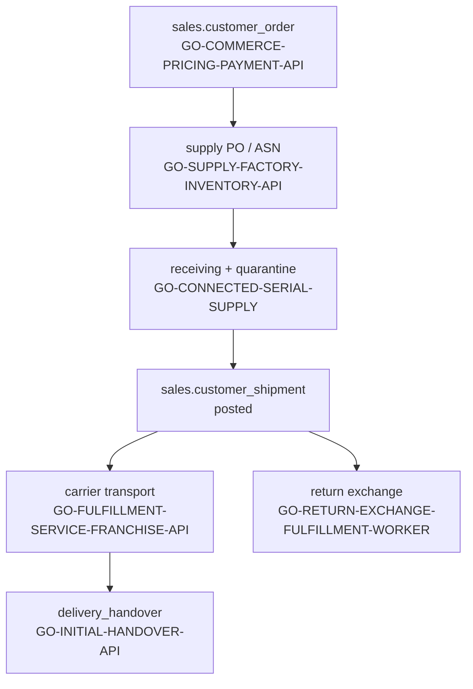

# LOGISTICS / FULFILLMENT / RECEIVING — tangible slice compose

Tip pin: `0397b2ff7d65049143b0736bfde56f76654a2599`

Status: **PARCIAL → tangible slice** (local fixtures + selected composition only). **Not** production, **not** REVESTEX, **not** a named SDR, GTM, or DOM HECHO pack.

## 0. Architecture contract (read-only cites @ tip `0397b2f`)

This slice doc does **not** re-open the architecture doors; it aligns with them:

| Door | Path @ `0397b2f` | Logistics row |
| --- | --- | --- |
| Domain architecture | [`docs/FRANCHISE_ARCHITECTURE.md`](../FRANCHISE_ARCHITECTURE.md) § **8. Logistics / fulfillment / receiving** | **PARCIAL** — selected owners + BC derivations; compose PROVEN_LOCAL; cross-entity DOM / live carrier thin |
| Nightly matrix | [`docs/FRANCHISE_ARCHITECTURE.md`](../FRANCHISE_ARCHITECTURE.md) § **PARCIAL → Logistics** | Same cite set as §8 |
| Build-order matrix | [`docs/ROADMAP.md`](../ROADMAP.md) § **FRANCHISE / COMPANY DOMAINS** → Logistics / fulfillment / receiving | **PARCIAL** — `GO_FULFILLMENT_SERVICE_FRANCHISE_API.md`, `GO_CONNECTED_SUPPLY_CREATION.md`, `GO_CONNECTED_SERIAL_SUPPLY.md`; compose PROVEN_LOCAL; DOM/live carrier thin |
| Phase 6 build order | [`docs/FRANCHISE_ARCHITECTURE.md`](../FRANCHISE_ARCHITECTURE.md) § **Recommended build order** phase 6 | Fulfillment + returns owners |
| Selected JSON | [`markdown_system/FRANCHISE_COMPLETE_PACK_PLAN.md`](../markdown_system/FRANCHISE_COMPLETE_PACK_PLAN.md) | Exact `packId` + `path` + `version` per row |
| V402 receipt | [`qualification/FINAL_LIBRARY_READY_V402.json`](../qualification/FINAL_LIBRARY_READY_V402.json) | `production_authorized: false` |

## 1. Claim (narrow)

Prove an **honest logistics / fulfillment / receiving compose lane** with:

- durable **customer shipment + carrier transport** (`GO-FULFILLMENT-SERVICE-FRANCHISE-API`);
- **serialized supply receiving** — demand → PO → factory QA → ASN → quarantine → stock release (`GO-CONNECTED-SERIAL-SUPPLY`);
- **role supply order creation** — form → quantities → receipt/reinspection (`GO-CONNECTED-SUPPLY-CREATION`);
- **commercial handover boundary** — journey owns acceptance; fulfillment owns transport (`GO-INITIAL-HANDOVER-API` + `GO-FULFILLMENT-SERVICE-FRANCHISE-API` contract);
- documented **return-exchange fulfillment adjacency** (`GO-RETURN-EXCHANGE-FULFILLMENT-WORKER`).

Disk-only Amazon SP-API adapters and proposed `FULFILLMENT_SOURCE_SELECTION_PACK_PLAN.md` remain **not selected 116** — cite only.

## 2. Pack map (selected composition + disk honesty)

Authoritative selector: [`markdown_system/FRANCHISE_COMPLETE_PACK_PLAN.md`](../markdown_system/FRANCHISE_COMPLETE_PACK_PLAN.md) (116 packs).

### PackId → selected JSON filename (alias normalization)

| Selected JSON `packId` | Exact selected JSON `path` | Do **not** substitute |
| --- | --- | --- |
| `PG-TX-FOUNDATION` | `implementation_packs/POSTGRES_TRANSACTIONAL_FOUNDATION.md` | `POSTGRES-TRANSACTIONAL-FOUNDATION.md`, bare `POSTGRES_TRANSACTIONAL_FOUNDATION.md` |
| `GO-ENTERPRISE-BACKEND` | `implementation_packs/GO_ENTERPRISE_BACKEND_CORE.md` | `GO_ENTERPRISE_BACKEND.md`, bare `GO_ENTERPRISE_BACKEND_CORE.md` |

### Selected 116 rows (minimum logistics subset)

| Role | packId | version | Selected JSON `path` | What it owns here |
| --- | --- | --- | --- | --- |
| PostgreSQL foundation | `PG-TX-FOUNDATION` | `0.1.0` | `implementation_packs/POSTGRES_TRANSACTIONAL_FOUNDATION.md` | tenant, org, platform primitives |
| Multi-domain schema | `ELECTROMOBILITY-FRANCHISE-MODULES` | `0.1.2` | `implementation_packs/ELECTROMOBILITY_FRANCHISE_MODULES.md` | catalog, CRM, inventory, pricing, payment, logistics, franchise schemas (`db/migrations/0003`) |
| Backend shell | `GO-ENTERPRISE-BACKEND` | `0.4.8` | `implementation_packs/GO_ENTERPRISE_BACKEND_CORE.md` | HTTP/OIDC/identity wiring |
| Supply / factory / inventory API | `GO-SUPPLY-FACTORY-INVENTORY-API` | `0.18.0` | `implementation_packs/GO_SUPPLY_FACTORY_INVENTORY_API.md` | PO, ASN, receiving, stock operations spine |
| **Fulfillment + franchise network + carrier** | `GO-FULFILLMENT-SERVICE-FRANCHISE-API` | `0.6.0` | `implementation_packs/GO_FULFILLMENT_SERVICE_FRANCHISE_API.md` | `sales.customer_shipment`, carrier reports, service/recall/network; connected carrier delivery |
| **Serialized supply connected** | `GO-CONNECTED-SERIAL-SUPPLY` | `0.2.0` | `implementation_packs/GO_CONNECTED_SERIAL_SUPPLY.md` | demand/PO → factory serial QA → split ASN → receiving → quarantine → distinct-human release |
| **Role supply creation** | `GO-CONNECTED-SUPPLY-CREATION` | `0.1.0` | `implementation_packs/GO_CONNECTED_SUPPLY_CREATION.md` | form order/quantities → factory/replacement → receipt/reinspection/availability |
| Supply role portal | `TS-SERIAL-SUPPLY-PORTAL` | `0.1.2` | `implementation_packs/TYPESCRIPT_SERIAL_SUPPLY_PORTAL.md` | BFF/UI for supply role writes |
| Commercial handover (journey boundary) | `GO-INITIAL-HANDOVER-API` | `0.4.0` | `implementation_packs/GO_INITIAL_HANDOVER_API.md` | customer acceptance record; **not** carrier delivery |
| Return exchange fulfillment | `GO-RETURN-EXCHANGE-FULFILLMENT-WORKER` | `0.1.0` | `implementation_packs/GO_RETURN_EXCHANGE_FULFILLMENT_WORKER.md` | exchange disposition → physical inventory effect |
| Commerce order spine (upstream) | `GO-COMMERCE-PRICING-PAYMENT-API` | `0.8.0` | `implementation_packs/GO_COMMERCE_PRICING_PAYMENT_API.md` | order allocation feeding shipment posting |
| Journey owner (handover adjacency) | `GO-FRANCHISE-CUSTOMER-JOURNEY-API` | `0.10.21` | `implementation_packs/GO_FRANCHISE_CUSTOMER_JOURNEY_API.md` | handover presentation/acceptance; fulfillment does not auto-accept |

### BC / inventory derivation docs (cite-only method maps)

| Topic | Path |
| --- | --- |
| Inventory posting model | `docs/inventory/MICROSOFT_BC_DERIVATION.md` |
| Warehouse operations | `docs/inventory/MICROSOFT_BC_WAREHOUSE_DERIVATION.md` |
| Customer shipment posting | `docs/inventory/MICROSOFT_BC_CUSTOMER_SHIPMENT_DERIVATION.md` |
| Connected carrier (Amazon) | `docs/logistics/MICROSOFT_BC_AMAZON_CONNECTED_CARRIER_DERIVATION.md` |

### Disk-only (catalog ≠ selected 116)

| packId | On-disk path | Status | Note |
| --- | --- | --- | --- |
| `PYTHON-AMAZON-SPAPI-SHIPPING-TRACKING-ADAPTER` | `implementation_packs/PYTHON_AMAZON_SPAPI_SHIPPING_TRACKING_ADAPTER.md` | disk; plan `markdown_system/AMAZON_SPAPI_SHIPPING_TRACKING_PACK_PLAN.md` | Live creds **CONDITIONED**; not in selected JSON |
| `PYTHON-AMAZON-SPAPI-FULFILLMENT-DELIVERY-EVIDENCE-ADAPTER` | `implementation_packs/PYTHON_AMAZON_SPAPI_FULFILLMENT_DELIVERY_EVIDENCE_ADAPTER.md` | disk; plan `markdown_system/AMAZON_SPAPI_FULFILLMENT_DELIVERY_EVIDENCE_PACK_PLAN.md` | Evidence fetch only; not acceptance |
| `PYTHON-AMAZON-SPAPI-EASYSHIP-HANDOVER-ADAPTER` | `implementation_packs/PYTHON_AMAZON_SPAPI_EASYSHIP_HANDOVER_ADAPTER.md` | disk; plan `markdown_system/AMAZON_SPAPI_EASYSHIP_HANDOVER_PACK_PLAN.md` | `PickedUp` = provider report; not journey handover |
| `PYTHON-AMAZON-SPAPI-EXTERNAL-FULFILLMENT-INVENTORY-ADAPTER` | `implementation_packs/PYTHON_AMAZON_SPAPI_EXTERNAL_FULFILLMENT_INVENTORY_ADAPTER.md` | disk; plan `markdown_system/AMAZON_SPAPI_EXTERNAL_FULFILLMENT_INVENTORY_PACK_PLAN.md` | External fulfillment inventory lane |
| `PYTHON-AMAZON-SPAPI-SUPPLY-SOURCES-ADAPTER` | `implementation_packs/PYTHON_AMAZON_SPAPI_SUPPLY_SOURCES_ADAPTER.md` | disk | Supply source mapping; not promoted here |

### Proposed additions (**PLAN ONLY** — not invented packs)

| Artifact | Path | Boundary |
| --- | --- | --- |
| Fulfillment source selection | `FULFILLMENT_SOURCE_SELECTION_PACK_PLAN.md` (proposed name in [`docs/FRANCHISE_ARCHITECTURE.md`](../FRANCHISE_ARCHITECTURE.md) §8) | DOM-equivalent rule engine spec — **not** on disk as admitted pack |

## 3. Compose recipe

1. **Pin** tip `0397b2ff7d65049143b0736bfde56f76654a2599`; walk doors in [`docs/FRANCHISE_PLAYBOOK.md`](../FRANCHISE_PLAYBOOK.md).
2. **Select** pack rows in §2 from [`markdown_system/FRANCHISE_COMPLETE_PACK_PLAN.md`](../markdown_system/FRANCHISE_COMPLETE_PACK_PLAN.md); resolve filenames via alias table — no shorthand.
3. **Materialize** per [`START_FRANCHISE.md`](../START_FRANCHISE.md) into consumer tree (or use repo paths under `internal/`, `db/`, `src/`).
4. **Apply migrations** at minimum:
   - `0001` — `POSTGRES_TRANSACTIONAL_FOUNDATION.md`
   - `0002` — `GO_ENTERPRISE_BACKEND_CORE.md`
   - `0003` — `ELECTROMOBILITY_FRANCHISE_MODULES.md` (logistics schema foundation)
   - `0008` — `GO_FULFILLMENT_SERVICE_FRANCHISE_API.md` (franchise network admin)
   - `0021` — `GO_RETURN_EXCHANGE_FULFILLMENT_WORKER.md`
   - `0025`+ — `GO_SUPPLY_FACTORY_INVENTORY_API.md` (serial inventory spine)
   - `0038` — customer sales shipment DDL
   - `0039` — connected carrier delivery
   - `0056` / `0068` — `GO_INITIAL_HANDOVER_API.md` handover tables
   - `0072` — `GO_CONNECTED_SERIAL_SUPPLY.md`
5. **Configure** local supply role fixture: `config/supply.role.fixture.json` and reference policy `deploy/serial-supply/plan.reference.json` for disposable runs only.
6. **Activate** serial supply host wiring via `cmd/electromobility-api/serial_supply.go` (opt-in policy hash).
7. **Respect owner boundaries** — fulfillment transport never auto-accepts `sales.delivery_handover`; journey/commerce remain authoritative for commercial acceptance.

Data flow (local slice):

```text
commerce order + allocation
        ▼
GO-SUPPLY-FACTORY-INVENTORY-API + GO-CONNECTED-SERIAL-SUPPLY
  (PO → factory QA → ASN → receiving → quarantine → ATP release)
        ▼
GO-CONNECTED-SUPPLY-CREATION (role form → receipt/reinspection)
        ▼
sales.customer_shipment posted
        ▼
GO-FULFILLMENT-SERVICE-FRANCHISE-API (carrier reports, optimistic transitions)
        │
        ├── (adjacent) GO-INITIAL-HANDOVER-API — customer acceptance (distinct boundary)
        └── (adjacent) GO-RETURN-EXCHANGE-FULFILLMENT-WORKER — exchange physical effect
```



## 4. Fixtures — logistics + receiving + carrier

| Fixture | Path | Proves |
| --- | --- | --- |
| Franchise module vertical (logistics schema) | `db/tests/0003_electromobility_franchise_modules.test.sql` | multi-domain transactional model includes logistics tables |
| Customer sales shipment DDL | `db/tests/0038_customer_sales_shipment.test.sql` | shipment posting invariants |
| Connected carrier delivery | `db/tests/0039_connected_carrier_delivery.test.sql` | provider report immutability + idempotency |
| Franchise network admin | `db/tests/0008_franchise_network_admin.test.sql` | network node hierarchy guards |
| Return exchange fulfillment | `db/tests/0021_return_exchange_fulfillment.test.sql` | exchange disposition schema |
| Delivery checklist / exception | `db/tests/0016_versioned_delivery_checklist.test.sql`, `db/tests/0017_delivery_exception_and_return_authorization.test.sql` | versioned checklist + exception lane |
| Go fulfillment service unit | `internal/fulfillment/service_test.go` | policy rejects skipped states; transport rejects invented provider completion |
| Go fulfillment integration | `internal/platform/postgres/fulfillment_integration_test.go` | service/franchise/shipment durable flow |
| Go connected carrier integration | `internal/platform/postgres/fulfillment_transport_integration_test.go` | idempotent concurrent carrier reports; never accepts handover |
| Go fulfillment HTTP | `internal/platform/httpapi/fulfillment_test.go` | authz + scope before body |
| Go serial supply connected | `internal/platform/postgres/serial_supply_connected_integration_test.go` | full J2 reference: demand → receiving → quarantine → release |
| Go serial supply create | `internal/platform/postgres/serial_supply_create_integration_test.go` | atomic role order creation + recovery |
| Go serial supply HTTP | `internal/platform/postgres/serial_supply_http_integration_test.go` | HTTP connected proof |
| Go serial supply role browser (opt-in) | `internal/platform/postgres/serial_supply_role_browser_integration_test.go` | Next/BFF/Go/PG role UI |
| Go handover preparation | `internal/platform/postgres/handover_preparation_integration_test.go` | initial handover connected postgres |
| Go return exchange | `internal/platform/postgres/returnexchange_integration_test.go` | atomic reservation; no stock retry |
| Local supply role fixture | `config/supply.role.fixture.json` | enables supply role panel for disposable runs |
| Serial supply reference policy | `deploy/serial-supply/plan.reference.json` | explicit serialized reference policy hash |
| Operator reference | `docs/SERIAL_SUPPLY_REFERENCE.md`, `docs/SUPPLY_ROLE_REFERENCE.md` | human operator bounds |
| Evidence manifest | `docs/slices/LOGISTICS_FULFILLMENT_FIXTURE_EVIDENCE.json` | machine-readable index |

Synthetic fixture rules:

- Carrier/provider tokens are **fixture labels**, not live Amazon/UPS/FedEx accounts.
- Receiving quarantine excludes ATP until a **distinct human** approves release.
- Provider pickup/delivery reports are immutable; duplicate `provider_event_id` is idempotent.
- Handover acceptance requires observed serial + optimistic version; server computes evidence hash — browser cannot inject `evidence_sha256`.
- Return exchange: single-line quantity-one same-variant same-location only in connected proof; cross-location/carrier/accounting remain **CONDITIONED**.

## 5. Verify steps (local only)

Run against a **disposable** PostgreSQL 18 database (`TEST_DATABASE_URL`).

### 5.1 SQL invariants

```bash
psql "$TEST_DATABASE_URL" -v ON_ERROR_STOP=1 -f db/tests/0003_electromobility_franchise_modules.test.sql
psql "$TEST_DATABASE_URL" -v ON_ERROR_STOP=1 -f db/tests/0038_customer_sales_shipment.test.sql
psql "$TEST_DATABASE_URL" -v ON_ERROR_STOP=1 -f db/tests/0039_connected_carrier_delivery.test.sql
psql "$TEST_DATABASE_URL" -v ON_ERROR_STOP=1 -f db/tests/0021_return_exchange_fulfillment.test.sql
```

### 5.2 Go unit / integration

```bash
go test ./internal/fulfillment/... -count=1
go test ./internal/platform/postgres -run 'Fulfillment|SerialSupply|Handover|ReturnExchange' -count=1 -timeout=5m
go test ./internal/platform/httpapi -run Fulfillment -count=1 -timeout=5m
```

### 5.3 Opt-in supply role browser connected proof

```bash
export ELITE_SUPPLY_ROLE_BROWSER=1
export PAYMENT_CONNECTED_DB_URL=postgres://127.0.0.1:5432/elite_supply_role_<suffix>?sslmode=disable
go test ./internal/platform/postgres -run TestSupplyRoleBrowser -count=1 -timeout=5m
unset ELITE_SUPPLY_ROLE_BROWSER
```

Pass criteria:

- Shipment + carrier fixtures PASS; carrier delivery never auto-accepts handover.
- Serial supply connected reference PASS: receiving quarantine → distinct-human release.
- Supply role create/recovery tests PASS.
- No DOM/source-selection admitted pack exists — compose documents **FALTA** only.
- Disk-only Amazon adapters not treated as selected-116 members.

### 5.4 Library preflight (optional)

```powershell
./VERIFY_EXECUTABLE_LIBRARY.ps1 -Mode Preflight
```

## 6. HECHO vs PARCIAL vs FALTA (honest @ `0397b2f`)

| Concern | Label | Why |
| --- | --- | --- |
| Selected 116 filenames for fulfillment + supply owners | **HECHO** (local paths) | `FRANCHISE_COMPLETE_PACK_PLAN.md` JSON rows |
| Multi-domain schema (logistics tables) | **HECHO** (local) | `ELECTROMOBILITY-FRANCHISE-MODULES` + `0003` migration |
| Serialized supply connected (receiving/quarantine/release) | **HECHO** (local) | `reconstruction_evidence/SERIAL_SUPPLY_CONNECTED_RELEASE_V402.md` (T2802 J2 PROVEN_LOCAL) |
| Supply role order creation + browser recovery | **HECHO** (local) | `reconstruction_evidence/SUPPLY_ROLE_RELEASE_V402.md` (T2804 J2 PROVEN_LOCAL) |
| Fulfillment service + franchise network core | **HECHO** (local core) | `reconstruction_evidence/GO_FULFILLMENT_SERVICE_FRANCHISE_API_2026-08-24_V1.md` |
| Connected carrier delivery fixtures | **PARCIAL** | Local idempotency proven; live carrier creds/webhooks **CONDITIONED** |
| Commercial handover acceptance | **PARCIAL** | `GO-INITIAL-HANDOVER-API` connected fixtures; live IdP/visual approval **CONDITIONED** |
| Return exchange fulfillment | **PARCIAL** | Narrow connected proof; cross-location/carrier/accounting **CONDITIONED** |
| Amazon SP-API adapters (tracking, evidence, EasyShip, external inventory) | **PARCIAL** (disk-only) | On disk; **FALTA** selected JSON; live creds **CONDITIONED** |
| DOM / multi-LE fulfillment source selection | **FALTA** | No admitted DOM-equivalent pack — proposed plan name only |
| Dedicated receiving dock / WMS product surface | **FALTA** | Receiving via supply owners; no standalone WMS pack |
| GTM / sGTM | **FALTA** | No `*GTM*` pack |
| Named SDR | **FALTA** | Lead ingress only |
| Production logistics authorization | **NO** | `production_authorized: false` |

## 7. CONDITIONED live gates (open — not PASS from fixtures)

| Gate | Owner / input | Why fixtures are insufficient |
| --- | --- | --- |
| Carrier credentials | Amazon SP-API / carrier accounts | Fixture provider references are not live seller accounts |
| Webhook / polling ingress | `GO-FULFILLMENT-SERVICE-FRANCHISE-API` transport | Local tests use synthetic provider reports |
| Live carrier tracking | `PYTHON-AMAZON-SPAPI-SHIPPING-TRACKING-ADAPTER` (disk) | Adapter not in selected 116; creds pending |
| Delivery evidence photos/signatures | `PYTHON-AMAZON-SPAPI-FULFILLMENT-DELIVERY-EVIDENCE-ADAPTER` (disk) | Evidence ≠ commercial acceptance |
| DOM / source selection | — | No admitted pack; cross-entity routing thin |
| Cross-location fulfillment | return/exchange + network owners | Connected proof is same-location narrow slice |
| Production authorization | `qualification/FINAL_LIBRARY_READY_V402.json` | `production_authorized: false` |

## 8. Public pattern gaps (cite only)

| Pattern | Reference | Local status |
| --- | --- | --- |
| Fulfillment outbound API | [Amazon SP-API Fulfillment Outbound](https://developer-docs.amazon.com/sp-api/docs/fulfillment-outbound-api) | Disk adapters + derivation doc; live creds **CONDITIONED** |
| Distributed order management | [Microsoft DOM](https://learn.microsoft.com/en-us/dynamics365/commerce/dom) | **FALTA** DOM-equivalent admitted pack |
| Inventory visibility | [Microsoft Inventory Visibility](https://learn.microsoft.com/en-us/dynamics365/supply-chain/inventory/inventory-visibility) | ATP via supply owners; not full visibility product |
| Posted shipment discipline | [BC posted sales documents](https://learn.microsoft.com/en-us/dynamics365/business-central/ui-post-sales) | BC derivation maps only — local AUTHORED owners |

## 9. Explicit non-claims

- Not a HECHO `implementation_packs/*` body; not added to selected 116/120 JSON.
- Did not invent SDR, GTM, DOM, WMS, or carrier packs.
- Did not promote disk-only Amazon adapters into selected JSON.
- Did not claim live carrier integration **HECHO**.
- Did not claim production or REVESTEX authorization.
- `FULFILLMENT_SOURCE_SELECTION_PACK_PLAN.md` is a proposed name only — **not** on disk as admitted pack.

## 10. Ops bounds (Galaxy — cite only)

Fleet orchestration pin: `etor6233/grok-bot-galaxy@f8546c3` ([`docs/FRANCHISE_PLAYBOOK.md`](../FRANCHISE_PLAYBOOK.md) §5).

- Galaxy = historical field guide / KB for bot fleets — **not** franchise logistics e2e, **not** installable WMS/carrier IaC.
- `franchise` string hits = **0** at pin; Duplicate/Marketplace ≠ fulfillment compose.
- Logistics slice evidence = library doors + fixtures above — do **not** invent bots, carriers, or fleet members from Galaxy how-tos.
