# PAYMENTS slice — HECHO-first compose (BC exact amount + checkout + webhooks)

Tip pin: `42d9f83ee6fa1536bcb59d66e6c7850b01ddd9b0`

Scope: `LIBRARY_INFRASTRUCTURE` / `LOCAL_FIXTURES` only. This slice documents how to compose admitted payment owners from the Elite Engineering Library. It does **not** authorize production charges, live provider credentials, or REVESTEX product code.

## 1. Elite path inventory (required citations)

| Role | packId | Elite path | Version | Admission |
|---|---|---|---|---|
| Exact integral amounts (BCApps translation) | `GO-BC-EXACT-AMOUNT-ADAPTER` | `implementation_packs/GO_BC_EXACT_AMOUNT_ADAPTER.md` | 0.1.0 | `REUSABLE_PACK` |
| Commerce quote → order → payment intent | `GO-COMMERCE-PRICING-PAYMENT-API` | `implementation_packs/GO_COMMERCE_PRICING_PAYMENT_API.md` | 0.8.0 | `CONDITIONED` |
| Official Stripe/MercadoPago SDK boundary | `GO-OFFICIAL-PAYMENT-WEBHOOK-ADAPTERS` | `implementation_packs/GO_OFFICIAL_PAYMENT_WEBHOOK_ADAPTERS.md` | 0.3.2 | `CONDITIONED` |
| Hosted checkout runtime + worker | `GO-PAYMENT-CHECKOUT-RUNTIME` | `implementation_packs/GO_PAYMENT_CHECKOUT_RUNTIME.md` | 0.3.0 | `CONDITIONED` |
| Customer checkout BFF/portal | `TS-PAYMENT-CHECKOUT-PORTAL` | `implementation_packs/TYPESCRIPT_PAYMENT_CHECKOUT_PORTAL.md` | 0.1.1 | `CONDITIONED` |
| FX snapshot + exact conversion (adjacent) | `GO-EXACT-FX-SNAPSHOT-ACCOUNTING` | `implementation_packs/GO_EXACT_FX_SNAPSHOT_ACCOUNTING.md` | 0.2.0 | `CONDITIONED` |
| Provider inbox / integration core | `GO-PROVIDER-INTEGRATION-CORE` | `implementation_packs/GO_PROVIDER_INTEGRATION_CORE.md` | 0.1.3 | `CONDITIONED` |
| Transactional foundation | `PG-TX-FOUNDATION` | `implementation_packs/POSTGRES_TRANSACTIONAL_FOUNDATION.md` | 0.1.0 | `REBUILD_VERIFIED` |

Composition lock (selected 116): `cloud/composition.json` (pack locks at lines 52–68 for BC exact amount + commerce payment; lines 448–481 for webhook/checkout/FX packs). Selection authority: `markdown_system/FRANCHISE_COMPLETE_PACK_PLAN.md`.

Reconstruction receipts (evidence only; do not re-open implementation):

| Receipt | Elite path |
|---|---|
| BC exact amount adaptation | `reconstruction_evidence/BC_EXACT_AMOUNT_ADAPTATION_V402.md` |
| Payment SDK pins / SCA | `reconstruction_evidence/PAYMENT_SDK_RECONCILIATION_V402.md` |
| Connected checkout → handover | `reconstruction_evidence/CONNECTED_PAYMENT_HANDOVER_V402.md` |
| Webhook adapters V1 | `reconstruction_evidence/GO_OFFICIAL_PAYMENT_WEBHOOK_ADAPTERS_2026-08-26_V1.md` |

Provenance locks:

| Topic | Elite path |
|---|---|
| BC amount derivation map | `docs/provenance/BC_AMOUNT_DERIVATION.md` |
| BC FX derivation map | `docs/provenance/BC_FX_DERIVATION.md` |
| Hosted checkout operator doc | `docs/payment-hosted-checkout.md` |
| Callback / reconciliation doc | `docs/payment-callback-reference.md` |
| Pack plan (webhook adapters) | `markdown_system/PAYMENT_WEBHOOK_ADAPTERS_PACK_PLAN.md` |

Materialized code (post-compose, cite — do not invent):

| Layer | Paths |
|---|---|
| BC exact amounts | `internal/bcamounts/amounts.go`, `internal/bcamounts/amounts_test.go`, `internal/platform/postgres/bc_accounting_sql.go`, `internal/accounting/amount_safety_test.go` |
| Commerce caller | `internal/platform/postgres/commerce.go` (`bcamounts.LineAmount` at order-line insert) |
| Official SDK module | `official_payment_webhooks/officialpayments/` |
| Payment bridge | `internal/paymentbridge/checkout.go`, `sdk_driver.go`, `webhook.go`, `customer_checkout.go` |
| HTTP API | `internal/platform/httpapi/payment_checkout.go` |
| PostgreSQL owners | `internal/platform/postgres/payment_checkout.go`, `payment_callback_processor.go`, `payment_dispatch_fence.go` |
| Host wiring | `cmd/electromobility-api/payment.go` |
| FX (when multi-currency) | `internal/bcfx/`, `internal/platform/postgres/fx_conversion.go`, `cmd/electromobility-api/fx.go` |
| Migrations | `db/migrations/0053_payment_intent_reference.up.sql`, `db/migrations/0055_payment_provider_observation.up.sql`, `db/migrations/0061_fx_conversion_receipt.up.sql` |

## 2. Compose recipe

Follow door order in `AGENTS.md` / `START_FRANCHISE.md` before materializing product code.

1. **Select composition** — use the payment-related packIds above from `markdown_system/FRANCHISE_COMPLETE_PACK_PLAN.md` (or `cloud/composition.json` pack locks). Do not add undeclared packs.
2. **Materialize** — `materialize_markdown_pack.ps1` per `START_FRANCHISE.md` and `markdown_system/FRANCHISE_PROJECT_OPERATING_PROTOCOL.md`. `GO-BC-EXACT-AMOUNT-ADAPTER` must compose **before** `GO-COMMERCE-PRICING-PAYMENT-API` (commerce calls `LineAmount`).
3. **Wire host** — enable checkout only when `PAYMENT_CHECKOUT_ENABLED=true` and every input in `docs/payment-hosted-checkout.md` is complete (`cmd/electromobility-api/payment.go`).
4. **Keep secrets out of repo** — `PAYMENT_PROVIDER_SECRET`, `PAYMENT_WEBHOOK_SECRET`, `PAYMENT_OUTBOUND_HMAC_KEY_BASE64` are future environment/secret-manager inputs; fixtures use `sk_test_fixture` / `whsec_fixture` labels only.
5. **Scope one tenant/org/provider/account/currency/mode** per host (`paymentbridge.Scope`).

### End-to-end data flow (LOCAL_FIXTURES)

```mermaid
flowchart LR
  PBE["pricing.price_book_entry\namount_minor_units"] --> LA["bcamounts.LineAmount\nGO-BC-EXACT-AMOUNT-ADAPTER"]
  LA --> OL["sales.customer_order_line\n+ order.total_minor_units"]
  OL --> PR["commerce.RequestOrderPayment\nGO-COMMERCE-PRICING-PAYMENT-API"]
  PR --> WK["paymentbridge.Worker\nGO-PAYMENT-CHECKOUT-RUNTIME"]
  WK --> SDK["officialpayments SDK\nGO-OFFICIAL-PAYMENT-WEBHOOK-ADAPTERS"]
  SDK --> WH["paymentbridge.Webhook\nsigned inbox"]
  WH --> CB["PaymentCallbackProcessor\nofficial GET reconcile"]
  CB --> OBS["payment.provider_observation"]
```



FX path (separate owner, compose when order currency ≠ ledger currency): `GO-EXACT-FX-SNAPSHOT-ACCOUNTING` → `internal/bcfx/ExchangeExact` → `fx_conversion_receipt` (migration `0061`). Payment checkout does **not** perform FX; it uses the order’s locked minor-unit total.

## 3. CONDITIONED live gates (open — not PASS from fixtures)

| Gate | Owner / input | Why fixtures are insufficient |
|---|---|---|
| Provider credentials | `PAYMENT_PROVIDER_SECRET`, account probe | Fixture tokens (`sk_test_fixture`) are not live Stripe/MercadoPago accounts |
| Webhook endpoint | `PAYMENT_WEBHOOK_SECRET`, HTTPS ingress | Local tests use `stripewebhook.GenerateTestSignedPayload`; no public URL |
| Live vs test mode | `PAYMENT_LIVE_MODE` + key prefix guard | `sdk_driver.go` rejects mode mismatch; live promotion needs provider approval |
| PCI card data | Hosted checkout only | No PAN/CVC in library paths; hosted redirect is the boundary (see gaps §5) |
| Country / fiscal settlement | ARCA and commercial release owners | Payment observation ≠ statutory invoice |
| FX rate source | `GO-EXACT-FX-SNAPSHOT-ACCOUNTING` | `config/fx/reference-rates.json` is hash-bound fixture, not a live feed |
| Production authorization | `qualification/FINAL_LIBRARY_READY_V402.json` | `production_authorized: false` |

## 4. LOCAL_FIXTURES evidence (what this slice proves)

| Evidence | Elite path | Claim |
|---|---|---|
| BC line amount + journal safety | `internal/bcamounts/amounts_test.go`, `internal/accounting/amount_safety_test.go` | Exact arithmetic oracle; overflow/negative sides rejected |
| Official SDK checkout serialization | `official_payment_webhooks/officialpayments/checkout_test.go` | Idempotency key + `unit_amount` binding |
| Signed webhook → scoped inbox + replay | `internal/paymentbridge/webhook_test.go` | Signature before inbox; duplicate `provider_event_id` idempotent |
| SDK driver checkout + callback + GET | `internal/paymentbridge/sdk_driver_test.go` | Hosted session, webhook notice, payment GET amounts match |
| **BC exact amount → checkout POST → webhook GET** | `internal/paymentbridge/sdk_driver_test.go` (`TestExactBCAmountCheckoutWebhookFixture`) | `bcamounts.LineAmount` oracle drives `unit_amount` and reconciliation |
| HTTP scope / customer checkout | `internal/platform/httpapi/payment_checkout_test.go` | Principal-bound reads; no URL injection |
| PostgreSQL checkout + fence | `internal/platform/postgres/payment_checkout_integration_test.go` | Single dispatch, observation hold |
| Connected quote → pay → webhook → handover | `internal/platform/postgres/payment_connected_integration_test.go` | Full durable path with fixture HTTP provider |
| FX connected slice | `internal/platform/postgres/fx_connected_integration_test.go` | Snapshot conversion receipts (adjacent) |

Run portable unit evidence (no database):

```bash
go test ./internal/bcamounts/... ./internal/paymentbridge/... ./internal/platform/httpapi/ -run 'ExactBCAmount|Webhook|Checkout|SDKDriver' -count=1
(cd official_payment_webhooks && go test ./officialpayments/... -run Checkout -count=1)
```

Run connected PostgreSQL evidence (disposable loopback DB required):

```bash
# Example: export PAYMENT_CONNECTED_DB_URL=postgres://127.0.0.1:5432/elite_payment_connected_<suffix>?sslmode=disable
go test ./internal/platform/postgres/ -run 'PaymentConnected' -count=1
```

Preflight library wiring:

```powershell
./VERIFY_LIBRARY.ps1
./VERIFY_EXECUTABLE_LIBRARY.ps1 -Mode Preflight
```

## 5. Gaps — public patterns (cite only; no proprietary copy)

These external references inform design; the library implements its own admitted packs and fixtures.

| Pattern | Public reference | How the slice uses it |
|---|---|---|
| Webhook authenticity | [Stripe webhook signatures](https://docs.stripe.com/webhooks/signatures) | Raw body preserved; `GO-OFFICIAL-PAYMENT-WEBHOOK-ADAPTERS` delegates verification to pinned `stripe-go` |
| Idempotent provider writes | [Stripe idempotent requests](https://docs.stripe.com/api/idempotent_requests) | Checkout POST uses payment-attempt idempotency key (`payment_connected_integration_test.go`) |
| Safe retries | [AWS: Making retries safe with idempotent APIs](https://aws.amazon.com/builders-library/making-retries-safe-with-idempotent-APIs/) | Commerce payment intent replay (`GO-COMMERCE-PRICING-PAYMENT-API` §V297) |
| PCI scope reduction | [PCI DSS overview](https://www.pcisecuritystandards.org/document_library) | Hosted checkout redirect; no card fields in `internal/paymentbridge/` or portal BFF |

**Not in this slice (honest GAPs):** SDR/GTM packs (`markdown_system/LIBRARY_HEALTH_CHECK.md`), live charge certification, REVESTEX product, production `production_authorized`.

## 6. Verify checklist (HECHO-first)

- [ ] Tip SHA matches `42d9f83ee6fa1536bcb59d66e6c7850b01ddd9b0`
- [ ] Payment packIds present in consumer composition lock
- [ ] `go test` unit fixtures green (§4)
- [ ] Optional: connected PG tests green with disposable DB
- [ ] `VERIFY_LIBRARY.ps1` reports `GO-BC-EXACT-AMOUNT-ADAPTER` in franchise profile
- [ ] Live gates in §3 recorded as **CONDITIONED**, not PASS
- [ ] No real provider secrets committed
