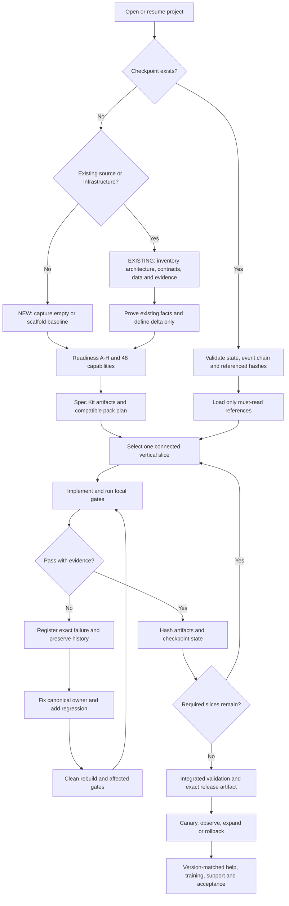

# Engineering Execution Validator Pack

## 1. Metadata

```yaml
pack_id: "EXECUTION-VALIDATOR"
pack_version: "1.3.1"
status:
  authority: SUPPORTED_REFERENCE
  implementation: REBUILD_VERIFIED
  admission: CONDITIONED
claim: "Materializa el contrato, ejemplos, capstones y validadores Python que impiden declarar plan, progreso reanudable, equivalencia contextual de implementación o evidencia sin contratos, procedencia, nueve dimensiones de aseguramiento, tareas, hashes y gates requeridos; distingue proyecto nuevo de existente y conserva checkpoints append-only sin duplicar los owners de Spec Kit/readiness."
stacks: ["Python 3.14+ standard library", "JSON Schema"]
compatible_with: []
incompatible_with: []
license_expression: "LicenseRef-Workspace-Owner"
upstream_sources: ["https://json-schema.org/draft/2020-12", "https://github.com/github/spec-kit/tree/9118ed15a0ba65053469a94c560ea5d233f75884", "https://github.com/awslabs/aidlc-workflows/tree/e49341dbeb8af82758dd85e96ed7fe9bcf38a447", "https://www.nasa.gov/reference/system-engineering-handbook-appendix/", "https://csrc.nist.gov/pubs/sp/800/218/final", "https://sre.google/sre-book/release-engineering/", "https://sre.google/sre-book/reliable-product-launches/", "https://learn.microsoft.com/en-us/compliance/assurance/assurance-microsoft-security-development-lifecycle", "https://github.com/xai-org/grok-build/tree/19d42e35c07a9c9244f03f6df0c4c353f970d4f9"]
verified_at: "2026-09-08"
```

## 2. Applicability

Se compone en todo proyecto que use esta biblioteca. Valida el engineering contract a nivel `plan` y `evidence`; además materializa un resume cursor compacto para proyecto nuevo o existente, referencias hash-bound, clasificación exacta de tareas y un checkpoint log encadenado. `implementation_assurance` impide promover código `AUTHORED`, `ADAPTED`, `VERBATIM` o mixto por compilación o reputación: exige rigor no inferior al riesgo, nueve dimensiones explícitas, método oficial, locks cuando hay upstream y evidencia separada del artefacto y release. Los capstones son fixtures de cobertura para IA, baja latencia y native offline. No sustituye los tests del producto ni convierte texto declarado en evidencia real.

## 3. Architecture contract

El contrato JSON 1.1.0 sigue siendo el source of truth del expediente de ingeniería. `PROJECT_EXECUTION_STATE.json` no lo duplica: es un índice de reanudación sobre readiness, Spec Kit, tasks, fallos, dependencias, evidencia y release. El validador separa `plan`, `resume`, `complete` y `evidence`, resuelve únicamente rutas dentro de una raíz autoridad explícita y falla si faltan owners, tareas, hashes, trazabilidad o evidencia requerida. El checkpoint log es append-only y hash-chained; no contiene secretos ni sustituye el ledger de fallos. Los capstones son fixtures, no plantillas de producción. Una evolución incompatible requiere nueva versión de schema y migración del expediente.

## 4. Exact file manifest

```text
CREATE engineering_execution_kit/capstones/ai_production_service.json
CREATE engineering_execution_kit/capstones/low_latency_order_book.json
CREATE engineering_execution_kit/capstones/offline_native_client.json
CREATE engineering_execution_kit/project.example.json
CREATE engineering_execution_kit/project.schema.json
CREATE engineering_execution_kit/README.md
CREATE engineering_execution_kit/EXECUTION_STATE_PROTOCOL.md
CREATE engineering_execution_kit/checkpoint_execution_state.py
CREATE engineering_execution_kit/execution_method_lock.json
CREATE engineering_execution_kit/execution_state.schema.json
CREATE engineering_execution_kit/execution_state.template.json
CREATE engineering_execution_kit/test_execution_state.py
CREATE engineering_execution_kit/test_validate_project.py
CREATE engineering_execution_kit/validate_execution_state.py
CREATE engineering_execution_kit/validate_project.py
```

## 5. Materialization blocks

### FILE: `engineering_execution_kit/capstones/ai_production_service.json`

```yaml
block_id: "EXECUTION-VALIDATOR:engineering-execution-kit-capstones-ai-production-service-json:v1"
operation: CREATE
provenance: AUTHORED
source: "local canonical execution kit"
license: "LicenseRef-Workspace-Owner"
sha256: "d9404c767052201344846e2fc3212f47cb26efaa12d8d83e7780a48f648ad497"
variables: []
secrets_allowed: false
```

````json
{
  "schema_version": "1.1.0",
  "project": {
    "id": "capstone-ai-production",
    "name": "Capstone IA evaluada y operable",
    "objective": "Desplegar un modelo detrás de un API con evals, seguridad, observabilidad, canary y rollback del mismo artifact.",
    "owners": ["ml-owner", "service-owner", "risk-owner"],
    "scope": ["dataset/model/eval contract", "inference API", "canary", "drift/error analysis", "rollback"],
    "out_of_scope": ["entrenamiento fundacional", "UI final", "multi-region"],
    "status": "planned"
  },
  "evidence_policy": {
    "claim_labels": ["SPEC", "ACADEMIC", "CODE", "PROD", "MEASURED", "IMPL", "OPEN"],
    "passed_requires_evidence": true,
    "hash_algorithm": "sha256"
  },
  "implementation_assurance": {
    "provenance": "MIXED",
    "risk_tier": "critical",
    "method_source_ids": ["nasa-systems-engineering-handbook", "nist-ssdf-1.1", "google-sre-release-engineering", "microsoft-sdl"],
    "source_lock_refs": ["PROJECT_EXTERNAL_SOURCE_LOCK.md"],
    "dimensions": [
      {"id": "functional_correctness", "disposition": "REQUIRED", "verification_refs": ["AITEST-01"], "reason": ""},
      {"id": "integration_contracts", "disposition": "REQUIRED", "verification_refs": ["AITEST-01"], "reason": ""},
      {"id": "security_privacy", "disposition": "REQUIRED", "verification_refs": ["AITEST-01"], "reason": ""},
      {"id": "resilience_failure", "disposition": "REQUIRED", "verification_refs": ["AITEST-01"], "reason": ""},
      {"id": "performance_efficiency", "disposition": "REQUIRED", "verification_refs": ["AIBENCH-01"], "reason": ""},
      {"id": "operability_observability", "disposition": "REQUIRED", "verification_refs": ["AITEST-01"], "reason": ""},
      {"id": "recovery_rollback", "disposition": "REQUIRED", "verification_refs": ["AITEST-01"], "reason": ""},
      {"id": "release_supply_chain", "disposition": "REQUIRED", "verification_refs": ["AITEST-01"], "reason": ""},
      {"id": "usability_accessibility", "disposition": "NONE_WITH_REASON", "verification_refs": [], "reason": "La UI final está fuera del alcance declarado del capstone."}
    ],
    "artifact_evidence_ids": [],
    "release_evidence_ids": [],
    "blockers": ["Fijar fuentes, ejecutar evals y capturar evidencia del mismo artefacto promovido."],
    "status": "planned"
  },
  "requirements": [
    {
      "id": "AIREQ-01",
      "statement": "Ningún candidate se promueve si degrada el quality/safety gate por slice o incumple el serving SLO.",
      "priority": "must",
      "source": {"label": "IMPL", "reference": "ML_PRODUCTION_LLMOPS_EVALUATION.md + AI_SECURITY_GOVERNANCE_PRIVACY.md"},
      "acceptance_test_ids": ["AITEST-01"]
    }
  ],
  "quality_scenarios": [
    {
      "id": "AIQS-01",
      "source": "rollout controller",
      "stimulus": "observa degradación del slice crítico durante canary",
      "environment": "5% de tráfico real con baseline simultáneo",
      "artifact": "candidate model/runtime/API",
      "response": "detiene promoción y vuelve tráfico al baseline",
      "measure": "acción bajo 5 min, cero mezcla de artifacts y evidencia conservada"
    }
  ],
  "architecture": {
    "context": "Cliente → API → policy/admission → model runtime → telemetry/eval store; registry y CI firman artifacts.",
    "components": [
      {"name": "evaluation-gate", "responsibility": "comparar baseline/candidate por slices"},
      {"name": "inference-service", "responsibility": "admission, batching, inference y response contract"},
      {"name": "registry", "responsibility": "model/runtime identity y lineage"}
    ],
    "data_flows": [
      {"from": "eval-dataset", "to": "evaluation-gate", "data": "versioned examples and labels", "trust_boundary": true},
      {"from": "api", "to": "inference-service", "data": "bounded authorized request", "trust_boundary": true}
    ],
    "decisions": [
      {
        "id": "AIADR-01",
        "status": "accepted",
        "context": "Offline aggregate score puede esconder regressions por slice.",
        "options": ["promover por promedio", "gates por slice + canary", "revisión manual sin métricas"],
        "decision": "Exigir gates offline por slice y canary online contra baseline.",
        "consequences": ["más datasets/telemetry", "rollback temprano", "ownership de slices"],
        "rollback_trigger": "El gate no detecta una regresión sembrada o no puede atribuir artifact/dataset."
      }
    ]
  },
  "contracts": {
    "api": [{"name": "POST /v1/infer", "limits": "schema, bytes, tokens, deadline and authz", "result": "prediction + model_version + uncertainty policy"}],
    "data": [{"name": "evaluation set", "identity": "dataset digest + split + slice definitions", "prohibitions": ["train/eval leakage", "PII in logs"]}],
    "lifecycle": [{"state": "candidate", "allowed": ["canary", "rejected"]}, {"state": "canary", "allowed": ["production", "rolled_back"]}]
  },
  "risks": [
    {
      "id": "AIRISK-01",
      "failure_or_threat": "Candidate mejora promedio pero perjudica un grupo crítico o evade safety policy.",
      "impact": "critical",
      "likelihood": "medium",
      "controls": ["slice gates", "red-team cases", "deterministic authorization", "canary rollback"],
      "test_ids": ["AITEST-01"],
      "residual": "Unknown unknowns requieren feedback, incident response y nuevos slices."
    }
  ],
  "slos": [
    {
      "id": "AISLO-01",
      "indicator": "valid successful inferences within latency and quality policy",
      "objective": ">= 99.5% and p99 <= declared budget",
      "window": "rolling 7d",
      "budget": "0.5%",
      "measurement": "server outcome joined to model/runtime digest, excluding invalid requests by contract"
    }
  ],
  "tests": [
    {
      "id": "AITEST-01",
      "level": "system",
      "requirement_ids": ["AIREQ-01"],
      "setup": "Baseline, candidate con regression sembrada, eval set versionado y canary controller.",
      "action": "Ejecutar evals por slice y simular degradación online/overload durante canary.",
      "oracle": "Promotion se bloquea o revierte; baseline sigue disponible; model/data/runtime digests y causas quedan trazados.",
      "evidence_ids": [],
      "status": "planned"
    }
  ],
  "benchmarks": [
    {
      "id": "AIBENCH-01",
      "hypothesis": "El candidate cumple quality parity y mejora goodput sin empeorar tails ni memoria pico.",
      "environment": {"hardware": "OPEN", "driver_runtime": "OPEN", "artifact_digests": "OPEN"},
      "workload": {"shapes": "production distribution + adversarial tails", "concurrency": "sweep", "duration": "steady + soak"},
      "correctness_gate": "Output/eval metrics y safety slices dentro de presupuesto.",
      "metrics": ["quality by slice", "TTFT", "TPOT", "p99", "goodput", "peak memory", "power"],
      "baseline": "OPEN",
      "candidate": "OPEN",
      "evidence_ids": [],
      "status": "planned"
    }
  ],
  "release": {
    "artifact_identity": {"model": "OPEN", "runtime": "OPEN", "code": "OPEN", "config": "OPEN", "dataset_eval": "OPEN"},
    "compatibility": ["API schema N-1/N", "runtime/model opset", "rollback without feature/schema break"],
    "rollout": ["offline eval", "shadow", "1% canary", "5%", "25%", "100%"],
    "gates": ["quality/safety slices", "serving SLO", "security", "artifact provenance", "rollback drill"],
    "rollback": "Route to preserved baseline digest; invalidate candidate outputs and retain incident/eval evidence."
  },
  "operations": {
    "observability": ["model/runtime digest", "quality proxy/sampled labels", "latency/goodput", "queue/cache/memory", "slice/error taxonomy"],
    "alerts": ["quality slice regression", "SLO burn", "OOM/queue saturation", "policy violations"],
    "runbooks": ["bad candidate", "data drift", "prompt/input abuse", "accelerator/runtime failure"],
    "backup_restore": "Registry, eval definitions, configs and audit evidence are versioned and restorable; raw sensitive inputs follow retention policy."
  },
  "codex": {
    "authority_docs": ["DEEP_LEARNING_ANDREW_NG.md", "ML_PRODUCTION_LLMOPS_EVALUATION.md", "AI_SECURITY_GOVERNANCE_PRIVACY.md", "SOFTWARE_BACKEND_API_ENGINEERING.md", "AI_INFERENCE_PERFORMANCE_HARDWARE.md", "TOOLCHAINS_BUILDS_PACKAGING_FFI.md"],
    "task_contract": "Preservar dataset/model/eval/runtime identity; implementar gates y no optimizar serving sacrificando calidad o seguridad.",
    "deliverables": ["eval harness", "service", "load/fault tests", "signed artifacts", "canary/rollback runbook"],
    "forbidden_assumptions": ["benchmark público equivale al producto", "logprob es confianza calibrada", "menor kernel time equivale a menor end-to-end", "guardrail sustituye authz"]
  },
  "evidence": []
}
````

### FILE: `engineering_execution_kit/capstones/low_latency_order_book.json`

```yaml
block_id: "EXECUTION-VALIDATOR:engineering-execution-kit-capstones-low-latency-order-book-json:v1"
operation: CREATE
provenance: AUTHORED
source: "local canonical execution kit"
license: "LicenseRef-Workspace-Owner"
sha256: "6d42626bd71207c0fdd7acfa9aa186920eb50a5b3e694c6e4b7d86b51505a344"
variables: []
secrets_allowed: false
```

````json
{
  "schema_version": "1.1.0",
  "project": {
    "id": "capstone-order-book",
    "name": "Capstone order book correcto y medible",
    "objective": "Reconstruir y monitorear un order book desde snapshot+deltas sin predecir, con gap recovery, backpressure y evidencia de latencia.",
    "owners": ["market-data-owner", "systems-owner", "operations-owner"],
    "scope": ["codec/feed", "state machine", "gap recovery", "metrics", "replay determinista"],
    "out_of_scope": ["estrategia predictiva", "order entry real", "co-location productiva"],
    "status": "planned"
  },
  "evidence_policy": {
    "claim_labels": ["SPEC", "ACADEMIC", "CODE", "PROD", "MEASURED", "IMPL", "OPEN"],
    "passed_requires_evidence": true,
    "hash_algorithm": "sha256"
  },
  "implementation_assurance": {
    "provenance": "AUTHORED",
    "risk_tier": "critical",
    "method_source_ids": ["nasa-systems-engineering-handbook", "nist-ssdf-1.1", "google-sre-release-engineering", "microsoft-sdl"],
    "source_lock_refs": [],
    "dimensions": [
      {"id": "functional_correctness", "disposition": "REQUIRED", "verification_refs": ["OBTEST-01"], "reason": ""},
      {"id": "integration_contracts", "disposition": "REQUIRED", "verification_refs": ["OBTEST-01"], "reason": ""},
      {"id": "security_privacy", "disposition": "REQUIRED", "verification_refs": ["OBTEST-01"], "reason": ""},
      {"id": "resilience_failure", "disposition": "REQUIRED", "verification_refs": ["OBTEST-01"], "reason": ""},
      {"id": "performance_efficiency", "disposition": "REQUIRED", "verification_refs": ["OBBENCH-01"], "reason": ""},
      {"id": "operability_observability", "disposition": "REQUIRED", "verification_refs": ["OBTEST-01"], "reason": ""},
      {"id": "recovery_rollback", "disposition": "REQUIRED", "verification_refs": ["OBTEST-01"], "reason": ""},
      {"id": "release_supply_chain", "disposition": "REQUIRED", "verification_refs": ["OBBENCH-01"], "reason": ""},
      {"id": "usability_accessibility", "disposition": "NONE_WITH_REASON", "verification_refs": [], "reason": "El capstone publica datos de máquina y no incluye una interfaz humana."}
    ],
    "artifact_evidence_ids": [],
    "release_evidence_ids": [],
    "blockers": ["Ejecutar replay, carga, seguridad y release sobre el binario exacto del target."],
    "status": "planned"
  },
  "requirements": [
    {
      "id": "OBREQ-01",
      "statement": "El sistema nunca publica estado LIVE después de un gap hasta aplicar snapshot compatible y replay continuo.",
      "priority": "must",
      "source": {"label": "IMPL", "reference": "MARKET_MICROSTRUCTURE_EXCHANGE_SYSTEMS.md#reconstruccion"},
      "acceptance_test_ids": ["OBTEST-01"]
    }
  ],
  "quality_scenarios": [
    {
      "id": "OBQS-01",
      "source": "feed de mercado",
      "stimulus": "omite un sequence durante una ráfaga",
      "environment": "carga pico declarada y consumer downstream lento",
      "artifact": "decoder, sequencer, book y publisher",
      "response": "marca GAP, deja de publicar LIVE, resnapshot/replay y valida continuidad",
      "measure": "cero book silenciosamente corrupto y recovery p99 bajo presupuesto declarado"
    }
  ],
  "architecture": {
    "context": "Venue feed → capture/decoder → sequencer → single-writer book → bounded publication → recorder/replay.",
    "components": [
      {"name": "decoder", "responsibility": "framing/schema/limits"},
      {"name": "sequencer", "responsibility": "duplicate/gap/session state"},
      {"name": "book", "responsibility": "venue-specific mutation invariants"},
      {"name": "publisher", "responsibility": "bounded snapshots/metrics, never invent continuity"}
    ],
    "data_flows": [
      {"from": "venue", "to": "decoder", "data": "captured packet/message + timestamps", "trust_boundary": true},
      {"from": "book", "to": "publisher", "data": "epoch + sequence + normalized state", "trust_boundary": false}
    ],
    "decisions": [
      {
        "id": "OBADR-01",
        "status": "accepted",
        "context": "Concurrent writers complican ordering y invariants del book.",
        "options": ["single writer per partition", "shared mutable book with locks", "GPU mutation"],
        "decision": "Single writer por instrument partition; readers reciben snapshots/deltas versionados.",
        "consequences": ["ordering explícito", "partition capacity requerida", "rebalance controlado"],
        "rollback_trigger": "Un partition no alcanza offered load aun con layout/batching medidos y sharding semánticamente válido."
      }
    ]
  },
  "contracts": {
    "api": [{"name": "book publication", "fields": ["venue", "instrument", "session", "epoch", "sequence", "state", "event_time", "receive_time"], "states": ["INIT", "SYNCING", "LIVE", "GAP", "STALE"]}],
    "data": [{"name": "capture", "identity": "venue/session/channel/packet order + bytes digest", "retention": "declared for deterministic replay"}],
    "lifecycle": [{"state": "GAP", "allowed": ["SYNCING", "STOPPED"]}, {"state": "SYNCING", "allowed": ["LIVE", "GAP"]}]
  },
  "risks": [
    {
      "id": "OBRISK-01",
      "failure_or_threat": "Paquete perdido o reorder produce book plausible pero incorrecto.",
      "impact": "critical",
      "likelihood": "medium",
      "controls": ["sequence/gap detector", "checksum where specified", "snapshot+replay", "state-labelled publication"],
      "test_ids": ["OBTEST-01"],
      "residual": "Una especificación de venue incompleta mantiene semántica OPEN y bloquea uso productivo."
    }
  ],
  "slos": [
    {
      "id": "OBSLO-01",
      "indicator": "correct LIVE publications within latency budget / valid feed updates",
      "objective": ">= 99.99% with zero silent sequence violations",
      "window": "session and rolling 7d",
      "budget": "0.01%; correctness violations consume all budget",
      "measurement": "hardware timestamps where available plus monotonic process stages and replay oracle"
    }
  ],
  "tests": [
    {
      "id": "OBTEST-01",
      "level": "fault",
      "requirement_ids": ["OBREQ-01"],
      "setup": "Recorded valid session with snapshot, deltas, duplicates and known final book.",
      "action": "Drop/reorder/duplicate every boundary message, slow publisher and restart during resync.",
      "oracle": "No LIVE publication crosses a gap; replay converges exactly to reference or remains explicitly GAP/STALE.",
      "evidence_ids": [],
      "status": "planned"
    }
  ],
  "benchmarks": [
    {
      "id": "OBBENCH-01",
      "hypothesis": "Single-writer layout sustains peak burst with bounded queue and lower p99.9 que baseline, preserving final book.",
      "environment": {"cpu": "OPEN", "numa": "OPEN", "nic": "OPEN", "os_kernel": "OPEN", "artifact": "OPEN"},
      "workload": {"capture_digest": "OPEN", "offered_rate": "venue peak + margin", "burst_model": "recorded", "duration": "session + soak"},
      "correctness_gate": "Final/intermediate state equals reference for every sequence; gaps never hidden.",
      "metrics": ["goodput", "p50", "p99", "p99.9", "max", "queue age", "drops", "recovery time", "CPU/cache/allocations"],
      "baseline": "OPEN",
      "candidate": "OPEN",
      "evidence_ids": [],
      "status": "planned"
    }
  ],
  "release": {
    "artifact_identity": {"source": "OPEN", "binary_digest": "OPEN", "compiler_flags": "OPEN", "venue_schema": "OPEN", "config": "OPEN"},
    "compatibility": ["venue protocol/session version", "capture format", "downstream state schema"],
    "rollout": ["offline replay", "shadow live capture", "parallel compare", "non-authoritative monitor", "authorized production"],
    "gates": ["replay oracle", "fault matrix", "sustained benchmark", "clock/timestamp audit", "rollback"],
    "rollback": "Stop candidate publication and retain baseline/capture; never merge two book writers into one epoch."
  },
  "operations": {
    "observability": ["session/sequence/state", "packet/message drops", "queue age", "stage latency", "resync count/time", "clock health"],
    "alerts": ["GAP/STALE", "sequence violation", "queue budget", "capture loss", "clock anomaly"],
    "runbooks": ["gap recovery", "venue session reset", "slow consumer", "NIC/host saturation"],
    "backup_restore": "Immutable captures and configuration permit deterministic replay; monitor state itself is reconstructible."
  },
  "codex": {
    "authority_docs": ["MARKET_MICROSTRUCTURE_EXCHANGE_SYSTEMS.md", "COMPUTER_SYSTEMS_PERFORMANCE_LOW_LATENCY.md", "NETWORKING_DISTRIBUTED_STREAMING.md", "ALGORITHMS_DATA_STRUCTURES_PROBLEM_SOLVING.md", "SECURITY_SRE_CLOUD_INFRASTRUCTURE.md"],
    "task_contract": "Implementar primero la state machine y oráculo; optimizar sólo con captura, hardware y venue declarados.",
    "deliverables": ["codec/state machine", "recorder/replay", "fault suite", "benchmark", "dashboard/runbook"],
    "forbidden_assumptions": ["TCP implica semántica de venue completa", "L2 agregado permite conocer queue position", "promedio prueba baja latencia", "GPU pertenece al mutation path por defecto"]
  },
  "evidence": []
}
````

### FILE: `engineering_execution_kit/capstones/offline_native_client.json`

```yaml
block_id: "EXECUTION-VALIDATOR:engineering-execution-kit-capstones-offline-native-client-json:v1"
operation: CREATE
provenance: AUTHORED
source: "local canonical execution kit"
license: "LicenseRef-Workspace-Owner"
sha256: "a77971d81fbf067ec642ed73a9dda061c04c395411440e9ef17f7f0d5f02f450"
variables: []
secrets_allowed: false
```

````json
{
  "schema_version": "1.1.0",
  "project": {
    "id": "capstone-offline-native",
    "name": "Capstone cliente nativo offline-first",
    "objective": "Construir un cliente mobile/desktop que preserve edición local, sincronice con conflictos explícitos y sobreviva process death/update.",
    "owners": ["client-owner", "api-owner", "security-owner"],
    "scope": ["UI accessible", "local source of truth", "outbox", "background sync", "signed staged update"],
    "out_of_scope": ["collaboration CRDT general", "custom cryptography", "unsupported OS versions"],
    "status": "planned"
  },
  "evidence_policy": {
    "claim_labels": ["SPEC", "ACADEMIC", "CODE", "PROD", "MEASURED", "IMPL", "OPEN"],
    "passed_requires_evidence": true,
    "hash_algorithm": "sha256"
  },
  "implementation_assurance": {
    "provenance": "AUTHORED",
    "risk_tier": "high",
    "method_source_ids": ["nasa-systems-engineering-handbook", "nist-ssdf-1.1", "google-sre-release-engineering", "microsoft-sdl"],
    "source_lock_refs": [],
    "dimensions": [
      {"id": "functional_correctness", "disposition": "REQUIRED", "verification_refs": ["NATTEST-01"], "reason": ""},
      {"id": "integration_contracts", "disposition": "REQUIRED", "verification_refs": ["NATTEST-01"], "reason": ""},
      {"id": "security_privacy", "disposition": "REQUIRED", "verification_refs": ["NATTEST-01"], "reason": ""},
      {"id": "resilience_failure", "disposition": "REQUIRED", "verification_refs": ["NATTEST-01"], "reason": ""},
      {"id": "performance_efficiency", "disposition": "REQUIRED", "verification_refs": ["NATBENCH-01"], "reason": ""},
      {"id": "operability_observability", "disposition": "REQUIRED", "verification_refs": ["NATTEST-01"], "reason": ""},
      {"id": "recovery_rollback", "disposition": "REQUIRED", "verification_refs": ["NATTEST-01"], "reason": ""},
      {"id": "release_supply_chain", "disposition": "REQUIRED", "verification_refs": ["NATBENCH-01"], "reason": ""},
      {"id": "usability_accessibility", "disposition": "REQUIRED", "verification_refs": ["NATTEST-01"], "reason": ""}
    ],
    "artifact_evidence_ids": [],
    "release_evidence_ids": [],
    "blockers": ["Ejecutar matrices de dispositivo, accesibilidad, seguridad y update firmado sobre el paquete exacto."],
    "status": "planned"
  },
  "requirements": [
    {
      "id": "NATREQ-01",
      "statement": "Una edición confirmada localmente sobrevive process death y se sincroniza o muestra conflicto sin pérdida silenciosa.",
      "priority": "must",
      "source": {"label": "IMPL", "reference": "NATIVE_MOBILE_DESKTOP_ENGINEERING.md#datos-locales-y-offline-first"},
      "acceptance_test_ids": ["NATTEST-01"]
    }
  ],
  "quality_scenarios": [
    {
      "id": "NATQS-01",
      "source": "usuario",
      "stimulus": "edita y confirma mientras no hay red; el OS termina el proceso",
      "environment": "dispositivo baseline con storage disponible y luego red restaurada",
      "artifact": "UI state holder, local DB, outbox y sync worker",
      "response": "restaura edición pendiente, sincroniza idempotentemente o presenta conflicto",
      "measure": "cero pérdida; local feedback bajo 100 ms; estado final explicable y auditable"
    }
  ],
  "architecture": {
    "context": "UI → state holder → repository → local DB/outbox ↔ API; OS lifecycle/background scheduler rodea el proceso.",
    "components": [
      {"name": "ui", "responsibility": "accessible state and intents"},
      {"name": "repository", "responsibility": "single source of truth and conflict policy"},
      {"name": "local-store", "responsibility": "transactional entities/outbox/tombstones"},
      {"name": "sync-worker", "responsibility": "durable idempotent reconciliation"}
    ],
    "data_flows": [
      {"from": "ui", "to": "local-store", "data": "validated user intent transaction", "trust_boundary": false},
      {"from": "sync-worker", "to": "api", "data": "authorized versioned mutation", "trust_boundary": true}
    ],
    "decisions": [
      {
        "id": "NATADR-01",
        "status": "accepted",
        "context": "Red y proceso son intermitentes y la edición no puede depender de una respuesta inmediata.",
        "options": ["network-first", "memory queue", "local DB + transactional outbox"],
        "decision": "Local DB es canonical para UI; mutation y outbox se escriben en una transacción.",
        "consequences": ["offline usable", "conflict/migration policy requerida", "background constraints"],
        "rollback_trigger": "El dominio exige validación remota irreversible antes de aceptar la operación."
      }
    ]
  },
  "contracts": {
    "api": [{"name": "sync mutation", "fields": ["entity_id", "base_version", "operation_id", "payload"], "results": ["applied", "conflict", "rejected", "retryable"]}],
    "data": [{"name": "local entity", "states": ["synced", "pending", "conflicted", "deleted"], "invariants": ["outbox in same transaction", "tombstone prevents resurrection"]}],
    "lifecycle": [{"state": "foreground", "allowed": ["background"]}, {"state": "background", "allowed": ["suspended", "foreground", "terminated"]}]
  },
  "risks": [
    {
      "id": "NATRISK-01",
      "failure_or_threat": "Process death entre guardar entidad y encolar sync pierde o duplica la intención.",
      "impact": "high",
      "likelihood": "high",
      "controls": ["same DB transaction", "idempotency key", "durable scheduler", "reconciliation UI"],
      "test_ids": ["NATTEST-01"],
      "residual": "Conflictos semánticos complejos pueden requerir decisión humana."
    }
  ],
  "slos": [
    {
      "id": "NATSLO-01",
      "indicator": "confirmed local edits preserved and eventually resolved",
      "objective": "100% durability within declared storage threat model; 99% resolved under 5 min after healthy connectivity",
      "window": "rolling 30d",
      "budget": "zero silent loss; 1% delayed resolution",
      "measurement": "local operation IDs reconciled with server outcomes, privacy-minimized"
    }
  ],
  "tests": [
    {
      "id": "NATTEST-01",
      "level": "recovery",
      "requirement_ids": ["NATREQ-01"],
      "setup": "Baseline device/OS, fake server, offline network and seeded entity version.",
      "action": "Kill process at every DB/outbox/sync transition; restore with duplicate/reorder/conflict and perform app update.",
      "oracle": "No edit disappears or applies twice; UI reports pending/conflict/confirmed accurately and remains accessible.",
      "evidence_ids": [],
      "status": "planned"
    }
  ],
  "benchmarks": [
    {
      "id": "NATBENCH-01",
      "hypothesis": "Local-first architecture meets interaction/startup budgets without unbounded memory, battery or network cost.",
      "environment": {"device": "oldest supported real device", "os": "oldest/newest", "release_artifact": "OPEN", "network_profiles": "offline/slow/normal"},
      "workload": {"entities": "small/median/p95", "pending_ops": "0/100/10000", "session": "cold start + 30 min sync"},
      "correctness_gate": "Same durable state and conflict decisions as reference after process death.",
      "metrics": ["TTID", "TTFD", "input latency", "jank", "memory", "battery", "bytes", "sync p99"],
      "baseline": "OPEN",
      "candidate": "OPEN",
      "evidence_ids": [],
      "status": "planned"
    }
  ],
  "release": {
    "artifact_identity": {"source": "OPEN", "package_digest": "OPEN", "signing_identity": "OPEN", "DB_schema": "OPEN", "API_contract": "OPEN"},
    "compatibility": ["N-2 app to current server", "N-1 DB migration", "pending outbox through update"],
    "rollout": ["unit/integration", "device matrix", "internal", "beta", "1% staged", "25%", "100%"],
    "gates": ["lifecycle/offline fault suite", "accessibility", "performance/power", "signed package install/update", "field crash/SLO"],
    "rollback": "Pause rollout/disable feature server-side; preserve pending local data and use forward recovery if store cannot downgrade."
  },
  "operations": {
    "observability": ["build/OS/device class", "crash/hang", "startup/jank", "outbox age", "sync result/conflict"],
    "alerts": ["crash-free regression", "sync backlog", "migration failure", "battery/network regression"],
    "runbooks": ["bad app release", "server incompatibility", "stuck outbox", "corrupt local DB"],
    "backup_restore": "User data/cache/secret classes have explicit backup policy; migration and restore run on real historical snapshots."
  },
  "codex": {
    "authority_docs": ["NATIVE_MOBILE_DESKTOP_ENGINEERING.md", "FRONTEND_PRODUCT_ENGINEERING_UX.md", "SOFTWARE_BACKEND_API_ENGINEERING.md", "DATABASE_STORAGE_INTERNALS.md", "SECURITY_SRE_CLOUD_INFRASTRUCTURE.md", "TOOLCHAINS_BUILDS_PACKAGING_FFI.md"],
    "task_contract": "Implementar desde lifecycle y local truth; cada estado visible debe corresponder a durable/sync reality.",
    "deliverables": ["native/client modules", "DB migrations", "sync worker", "device/fault/accessibility suites", "signed staged release"],
    "forbidden_assumptions": ["process callback final", "network availability equals reachability", "permission granted permanently", "emulator debug proves performance", "store rollback is immediate"]
  },
  "evidence": []
}
````

### FILE: `engineering_execution_kit/project.example.json`

```yaml
block_id: "EXECUTION-VALIDATOR:engineering-execution-kit-project-example-json:v1"
operation: CREATE
provenance: AUTHORED
source: "local canonical execution kit"
license: "LicenseRef-Workspace-Owner"
sha256: "f20e970db7d4869b60f9d53a26f17b3db3429b2d2e5ccf18696dfd2de67737d3"
variables: []
secrets_allowed: false
```

````json
{
  "schema_version": "1.1.0",
  "project": {
    "id": "example-service",
    "name": "Servicio de referencia verificable",
    "objective": "Aceptar una operación idempotente, persistirla y exponer su estado con evidencia operacional.",
    "owners": ["engineering-owner", "operations-owner"],
    "scope": ["API versionada", "persistencia transaccional", "observabilidad", "release gradual"],
    "out_of_scope": ["UI final", "multi-region", "predicción mediante ML"],
    "status": "planned"
  },
  "evidence_policy": {
    "claim_labels": ["SPEC", "ACADEMIC", "CODE", "PROD", "MEASURED", "IMPL", "OPEN"],
    "passed_requires_evidence": true,
    "hash_algorithm": "sha256"
  },
  "implementation_assurance": {
    "provenance": "AUTHORED",
    "risk_tier": "high",
    "method_source_ids": ["nasa-systems-engineering-handbook", "nist-ssdf-1.1", "google-sre-release-engineering", "microsoft-sdl"],
    "source_lock_refs": [],
    "dimensions": [
      {"id": "functional_correctness", "disposition": "REQUIRED", "verification_refs": ["TEST-01"], "reason": ""},
      {"id": "integration_contracts", "disposition": "REQUIRED", "verification_refs": ["TEST-02"], "reason": ""},
      {"id": "security_privacy", "disposition": "REQUIRED", "verification_refs": ["TEST-02"], "reason": ""},
      {"id": "resilience_failure", "disposition": "REQUIRED", "verification_refs": ["TEST-01"], "reason": ""},
      {"id": "performance_efficiency", "disposition": "REQUIRED", "verification_refs": ["BENCH-01"], "reason": ""},
      {"id": "operability_observability", "disposition": "REQUIRED", "verification_refs": ["BENCH-01"], "reason": ""},
      {"id": "recovery_rollback", "disposition": "REQUIRED", "verification_refs": ["TEST-01"], "reason": ""},
      {"id": "release_supply_chain", "disposition": "REQUIRED", "verification_refs": ["TEST-02"], "reason": ""},
      {"id": "usability_accessibility", "disposition": "NONE_WITH_REASON", "verification_refs": [], "reason": "La UI final está fuera del alcance declarado de este ejemplo."}
    ],
    "artifact_evidence_ids": [],
    "release_evidence_ids": [],
    "blockers": ["Ejecutar las verificaciones y capturar evidencia del artefacto y release exactos."],
    "status": "planned"
  },
  "requirements": [
    {
      "id": "REQ-01",
      "statement": "Reintentar la misma operación con la misma clave no duplica el efecto lógico.",
      "priority": "must",
      "source": {"label": "IMPL", "reference": "SOFTWARE_BACKEND_API_ENGINEERING.md#idempotencia"},
      "acceptance_test_ids": ["TEST-01"]
    },
    {
      "id": "REQ-02",
      "statement": "Una respuesta ambigua puede reconciliarse consultando el estado por operation_id.",
      "priority": "must",
      "source": {"label": "IMPL", "reference": "NETWORKING_DISTRIBUTED_STREAMING.md#resultados-ambiguos"},
      "acceptance_test_ids": ["TEST-02"]
    }
  ],
  "quality_scenarios": [
    {
      "id": "QS-01",
      "source": "cliente autenticado",
      "stimulus": "envía una operación durante carga nominal",
      "environment": "release build, dataset y hardware fijados",
      "artifact": "API, handler y base de datos",
      "response": "valida, persiste una vez y devuelve operation_id",
      "measure": "99.9% de respuestas no ambiguas bajo 250 ms en ventana de 30 días"
    }
  ],
  "architecture": {
    "context": "Cliente → API → servicio → base de datos; telemetry sin payload sensible.",
    "components": [
      {"name": "api", "responsibility": "autenticación, validación y contrato HTTP"},
      {"name": "operation-service", "responsibility": "idempotencia y transición de estado"},
      {"name": "database", "responsibility": "source of truth y uniqueness constraint"}
    ],
    "data_flows": [
      {"from": "client", "to": "api", "data": "request + idempotency key", "trust_boundary": true},
      {"from": "operation-service", "to": "database", "data": "operation transaction", "trust_boundary": false}
    ],
    "decisions": [
      {
        "id": "ADR-01",
        "status": "accepted",
        "context": "El cliente puede perder la respuesta después del commit.",
        "options": ["dedupe en memoria", "unique key transaccional", "sin retries"],
        "decision": "Persistir idempotency key y resultado en la misma transacción.",
        "consequences": ["replay seguro", "retención y tamaño de tabla explícitos"],
        "rollback_trigger": "La cardinalidad o retención incumple el budget aun después de particionar/expirar."
      }
    ]
  },
  "contracts": {
    "api": [
      {"name": "POST /v1/operations", "input": "schema v1 + Idempotency-Key", "output": "operation_id + state", "errors": ["400", "401", "409", "429", "503"]},
      {"name": "GET /v1/operations/{id}", "input": "authorized operation_id", "output": "authoritative state", "errors": ["401", "403", "404"]}
    ],
    "data": [
      {"entity": "operation", "owner": "operation-service", "invariants": ["idempotency key unique per principal", "state transitions monotonic"]}
    ],
    "lifecycle": [
      {"state": "accepted", "allowed": ["committed", "rejected"]},
      {"state": "committed", "allowed": []}
    ]
  },
  "risks": [
    {
      "id": "RISK-01",
      "failure_or_threat": "Respuesta perdida después de commit induce retry duplicado.",
      "impact": "high",
      "likelihood": "medium",
      "controls": ["unique constraint", "same-transaction result", "reconciliation endpoint"],
      "test_ids": ["TEST-01", "TEST-02"],
      "residual": "Retención expirada puede requerir política de ventana comunicada al cliente."
    }
  ],
  "slos": [
    {
      "id": "SLO-01",
      "indicator": "successful operations / valid operations",
      "objective": ">= 99.9%",
      "window": "rolling 30d",
      "budget": "0.1%",
      "measurement": "server-side committed outcomes, excluyendo requests inválidos según contrato"
    }
  ],
  "tests": [
    {
      "id": "TEST-01",
      "level": "fault",
      "requirement_ids": ["REQ-01"],
      "setup": "Base limpia y cliente autenticado; proxy puede descartar la respuesta.",
      "action": "Enviar, perder respuesta después de commit y reintentar la misma clave 20 veces.",
      "oracle": "Existe un único efecto lógico y todas las respuestas observables convergen al mismo operation_id/resultado.",
      "evidence_ids": [],
      "status": "planned"
    },
    {
      "id": "TEST-02",
      "level": "contract",
      "requirement_ids": ["REQ-02"],
      "setup": "Operación committed con respuesta inicial no observada.",
      "action": "Consultar por operation_id/principal correcto e incorrecto.",
      "oracle": "El principal correcto reconcilia el estado; otro principal recibe 404/403 sin leakage.",
      "evidence_ids": [],
      "status": "planned"
    }
  ],
  "benchmarks": [
    {
      "id": "BENCH-01",
      "hypothesis": "El índice único mantiene el SLO al throughput objetivo sin degradar corrección.",
      "environment": {"hardware": "OPEN", "os": "OPEN", "artifact_digest": "OPEN", "database": "OPEN"},
      "workload": {"offered_rps": 500, "duplicate_ratio": 0.1, "duration_s": 900, "key_distribution": "declared"},
      "correctness_gate": "Cero efectos duplicados y conteo igual al oráculo.",
      "metrics": ["goodput", "p50", "p95", "p99", "errors", "db lock wait"],
      "baseline": "OPEN",
      "candidate": "OPEN",
      "evidence_ids": [],
      "status": "planned"
    }
  ],
  "release": {
    "artifact_identity": {"source_revision": "OPEN", "build_digest": "OPEN", "config_version": "OPEN", "schema_version": "v1"},
    "compatibility": ["old/new service con schema expandido", "cliente v1 durante rollout"],
    "rollout": ["local", "CI", "staging fault tests", "1% canary", "25%", "100%"],
    "gates": ["all tests passed with evidence", "SLO and error budget healthy", "restore drill current"],
    "rollback": "Detener tráfico al candidate y promover el mismo digest baseline; schema usa expand/contract."
  },
  "operations": {
    "observability": ["rate/errors/duration", "operation state age", "duplicate replay count", "DB saturation"],
    "alerts": ["multi-window SLO burn", "stuck operation age", "restore freshness"],
    "runbooks": ["overload", "database unavailable", "idempotency conflict", "bad rollout"],
    "backup_restore": "Backup verificado y restore drill aislado con RPO/RTO medidos antes de producción."
  },
  "codex": {
    "authority_docs": [
      "SOFTWARE_ARCHITECTURE_SYSTEM_DESIGN.md",
      "SOFTWARE_BACKEND_API_ENGINEERING.md",
      "DATABASE_STORAGE_INTERNALS.md",
      "SECURITY_SRE_CLOUD_INFRASTRUCTURE.md",
      "TOOLCHAINS_BUILDS_PACKAGING_FFI.md"
    ],
    "task_contract": "Implementar sólo el scope declarado, preservar invariantes y producir evidencia para cada gate.",
    "deliverables": ["code", "migrations", "tests", "benchmark manifest/results", "release/rollback runbook"],
    "forbidden_assumptions": ["timeout significa fallo", "retry es seguro sin idempotencia", "build local equivale al artifact publicado", "passed sin evidencia"]
  },
  "evidence": []
}
````

### FILE: `engineering_execution_kit/project.schema.json`

```yaml
block_id: "EXECUTION-VALIDATOR:engineering-execution-kit-project-schema-json:v1"
operation: CREATE
provenance: AUTHORED
source: "local canonical execution kit"
license: "LicenseRef-Workspace-Owner"
sha256: "d86f123a8d6f757541fb706c371daf9685c467ae124bd0f8fcde47e9da2c31b6"
variables: []
secrets_allowed: false
```

````json
{
  "$schema": "https://json-schema.org/draft/2020-12/schema",
  "$id": "https://local.example/engineering-project.schema.json",
  "title": "Engineering execution project contract",
  "type": "object",
  "additionalProperties": false,
  "required": [
    "schema_version", "project", "evidence_policy", "implementation_assurance", "requirements",
    "quality_scenarios", "architecture", "contracts", "risks", "slos",
    "tests", "benchmarks", "release", "operations", "codex", "evidence"
  ],
  "properties": {
    "schema_version": {"const": "1.1.0"},
    "project": {
      "type": "object",
      "additionalProperties": false,
      "required": ["id", "name", "objective", "owners", "scope", "out_of_scope", "status"],
      "properties": {
        "id": {"type": "string", "minLength": 1},
        "name": {"type": "string", "minLength": 1},
        "objective": {"type": "string", "minLength": 1},
        "owners": {"type": "array", "minItems": 1, "items": {"type": "string", "minLength": 1}},
        "scope": {"type": "array", "minItems": 1, "items": {"type": "string", "minLength": 1}},
        "out_of_scope": {"type": "array", "minItems": 1, "items": {"type": "string", "minLength": 1}},
        "status": {"enum": ["planned", "active", "blocked", "complete"]}
      }
    },
    "evidence_policy": {
      "type": "object",
      "required": ["claim_labels", "passed_requires_evidence", "hash_algorithm"],
      "properties": {
        "claim_labels": {"type": "array", "uniqueItems": true, "items": {"enum": ["SPEC", "ACADEMIC", "CODE", "PROD", "MEASURED", "IMPL", "OPEN"]}},
        "passed_requires_evidence": {"const": true},
        "hash_algorithm": {"const": "sha256"}
      }
    },
    "implementation_assurance": {"$ref": "#/$defs/implementation_assurance"},
    "requirements": {"type": "array", "minItems": 1, "items": {"$ref": "#/$defs/requirement"}},
    "quality_scenarios": {"type": "array", "minItems": 1, "items": {"$ref": "#/$defs/quality"}},
    "architecture": {
      "type": "object",
      "required": ["context", "components", "data_flows", "decisions"],
      "properties": {
        "context": {"type": "string", "minLength": 1},
        "components": {"type": "array", "minItems": 1},
        "data_flows": {"type": "array", "minItems": 1},
        "decisions": {"type": "array", "minItems": 1, "items": {"$ref": "#/$defs/decision"}}
      }
    },
    "contracts": {
      "type": "object",
      "required": ["api", "data", "lifecycle"],
      "properties": {
        "api": {"type": "array", "minItems": 1},
        "data": {"type": "array", "minItems": 1},
        "lifecycle": {"type": "array", "minItems": 1}
      }
    },
    "risks": {"type": "array", "minItems": 1, "items": {"$ref": "#/$defs/risk"}},
    "slos": {"type": "array", "minItems": 1, "items": {"$ref": "#/$defs/slo"}},
    "tests": {"type": "array", "minItems": 1, "items": {"$ref": "#/$defs/test"}},
    "benchmarks": {"type": "array", "minItems": 1, "items": {"$ref": "#/$defs/benchmark"}},
    "release": {"$ref": "#/$defs/release"},
    "operations": {"$ref": "#/$defs/operations"},
    "codex": {"$ref": "#/$defs/codex"},
    "evidence": {"type": "array", "items": {"$ref": "#/$defs/evidence"}}
  },
  "$defs": {
    "id": {"type": "string", "pattern": "^[A-Z][A-Z0-9_]*-[0-9]{2,}$"},
    "source": {
      "type": "object",
      "required": ["label", "reference"],
      "properties": {
        "label": {"enum": ["SPEC", "ACADEMIC", "CODE", "PROD", "MEASURED", "IMPL", "OPEN"]},
        "reference": {"type": "string", "minLength": 1}
      }
    },
    "implementation_assurance": {
      "type": "object",
      "additionalProperties": false,
      "required": ["provenance", "risk_tier", "method_source_ids", "source_lock_refs", "dimensions", "artifact_evidence_ids", "release_evidence_ids", "blockers", "status"],
      "properties": {
        "provenance": {"enum": ["AUTHORED", "ADAPTED", "VERBATIM", "MIXED"]},
        "risk_tier": {"enum": ["low", "standard", "high", "critical"]},
        "method_source_ids": {"type": "array", "minItems": 1, "uniqueItems": true, "items": {"type": "string", "minLength": 1}},
        "source_lock_refs": {"type": "array", "uniqueItems": true, "items": {"type": "string", "minLength": 1}},
        "dimensions": {
          "type": "array",
          "minItems": 9,
          "maxItems": 9,
          "items": {"$ref": "#/$defs/assurance_dimension"}
        },
        "artifact_evidence_ids": {"type": "array", "uniqueItems": true, "items": {"$ref": "#/$defs/id"}},
        "release_evidence_ids": {"type": "array", "uniqueItems": true, "items": {"$ref": "#/$defs/id"}},
        "blockers": {"type": "array", "uniqueItems": true, "items": {"type": "string", "minLength": 1}},
        "status": {"enum": ["planned", "blocked", "proven"]}
      }
    },
    "assurance_dimension": {
      "type": "object",
      "additionalProperties": false,
      "required": ["id", "disposition", "verification_refs", "reason"],
      "properties": {
        "id": {"enum": ["functional_correctness", "integration_contracts", "security_privacy", "resilience_failure", "performance_efficiency", "operability_observability", "recovery_rollback", "release_supply_chain", "usability_accessibility"]},
        "disposition": {"enum": ["REQUIRED", "NONE_WITH_REASON"]},
        "verification_refs": {"type": "array", "uniqueItems": true, "items": {"$ref": "#/$defs/id"}},
        "reason": {"type": "string"}
      }
    },
    "requirement": {
      "type": "object",
      "required": ["id", "statement", "priority", "source", "acceptance_test_ids"],
      "properties": {
        "id": {"$ref": "#/$defs/id"},
        "statement": {"type": "string", "minLength": 1},
        "priority": {"enum": ["must", "should", "could"]},
        "source": {"$ref": "#/$defs/source"},
        "acceptance_test_ids": {"type": "array", "minItems": 1, "items": {"$ref": "#/$defs/id"}}
      }
    },
    "quality": {
      "type": "object",
      "required": ["id", "source", "stimulus", "environment", "artifact", "response", "measure"],
      "properties": {
        "id": {"$ref": "#/$defs/id"},
        "source": {"type": "string", "minLength": 1},
        "stimulus": {"type": "string", "minLength": 1},
        "environment": {"type": "string", "minLength": 1},
        "artifact": {"type": "string", "minLength": 1},
        "response": {"type": "string", "minLength": 1},
        "measure": {"type": "string", "minLength": 1}
      }
    },
    "decision": {
      "type": "object",
      "required": ["id", "status", "context", "options", "decision", "consequences", "rollback_trigger"],
      "properties": {
        "id": {"$ref": "#/$defs/id"},
        "status": {"enum": ["proposed", "accepted", "superseded", "rejected"]},
        "context": {"type": "string", "minLength": 1},
        "options": {"type": "array", "minItems": 2},
        "decision": {"type": "string", "minLength": 1},
        "consequences": {"type": "array", "minItems": 1},
        "rollback_trigger": {"type": "string", "minLength": 1}
      }
    },
    "risk": {
      "type": "object",
      "required": ["id", "failure_or_threat", "impact", "likelihood", "controls", "test_ids", "residual"],
      "properties": {
        "id": {"$ref": "#/$defs/id"},
        "failure_or_threat": {"type": "string", "minLength": 1},
        "impact": {"enum": ["low", "medium", "high", "critical"]},
        "likelihood": {"enum": ["low", "medium", "high"]},
        "controls": {"type": "array", "minItems": 1},
        "test_ids": {"type": "array", "minItems": 1, "items": {"$ref": "#/$defs/id"}},
        "residual": {"type": "string", "minLength": 1}
      }
    },
    "slo": {
      "type": "object",
      "required": ["id", "indicator", "objective", "window", "budget", "measurement"],
      "properties": {
        "id": {"$ref": "#/$defs/id"},
        "indicator": {"type": "string", "minLength": 1},
        "objective": {"type": "string", "minLength": 1},
        "window": {"type": "string", "minLength": 1},
        "budget": {"type": "string", "minLength": 1},
        "measurement": {"type": "string", "minLength": 1}
      }
    },
    "test": {
      "type": "object",
      "required": ["id", "level", "requirement_ids", "setup", "action", "oracle", "evidence_ids", "status"],
      "properties": {
        "id": {"$ref": "#/$defs/id"},
        "level": {"enum": ["unit", "property", "integration", "contract", "system", "fault", "security", "performance", "recovery", "usability"]},
        "requirement_ids": {"type": "array", "minItems": 1, "items": {"$ref": "#/$defs/id"}},
        "setup": {"type": "string", "minLength": 1},
        "action": {"type": "string", "minLength": 1},
        "oracle": {"type": "string", "minLength": 1},
        "evidence_ids": {"type": "array", "items": {"$ref": "#/$defs/id"}},
        "status": {"enum": ["planned", "running", "passed", "failed", "blocked"]}
      }
    },
    "benchmark": {
      "type": "object",
      "required": ["id", "hypothesis", "environment", "workload", "correctness_gate", "metrics", "baseline", "candidate", "evidence_ids", "status"],
      "properties": {
        "id": {"$ref": "#/$defs/id"},
        "hypothesis": {"type": "string", "minLength": 1},
        "environment": {"type": "object", "minProperties": 1},
        "workload": {"type": "object", "minProperties": 1},
        "correctness_gate": {"type": "string", "minLength": 1},
        "metrics": {"type": "array", "minItems": 1},
        "baseline": {},
        "candidate": {},
        "evidence_ids": {"type": "array", "items": {"$ref": "#/$defs/id"}},
        "status": {"enum": ["planned", "running", "passed", "failed", "blocked"]}
      }
    },
    "release": {
      "type": "object",
      "required": ["artifact_identity", "compatibility", "rollout", "gates", "rollback"],
      "properties": {
        "artifact_identity": {"type": "object", "minProperties": 1},
        "compatibility": {"type": "array", "minItems": 1},
        "rollout": {"type": "array", "minItems": 1},
        "gates": {"type": "array", "minItems": 1},
        "rollback": {"type": "string", "minLength": 1}
      }
    },
    "operations": {
      "type": "object",
      "required": ["observability", "alerts", "runbooks", "backup_restore"],
      "properties": {
        "observability": {"type": "array", "minItems": 1},
        "alerts": {"type": "array", "minItems": 1},
        "runbooks": {"type": "array", "minItems": 1},
        "backup_restore": {"type": "string", "minLength": 1}
      }
    },
    "codex": {
      "type": "object",
      "required": ["authority_docs", "task_contract", "deliverables", "forbidden_assumptions"],
      "properties": {
        "authority_docs": {"type": "array", "minItems": 1, "items": {"type": "string", "pattern": "\\.md$"}},
        "task_contract": {"type": "string", "minLength": 1},
        "deliverables": {"type": "array", "minItems": 1},
        "forbidden_assumptions": {"type": "array", "minItems": 1}
      }
    },
    "evidence": {
      "type": "object",
      "required": ["id", "path", "sha256", "claim", "generated_at", "tool", "environment", "status"],
      "properties": {
        "id": {"$ref": "#/$defs/id"},
        "path": {"type": "string"},
        "sha256": {"type": "string"},
        "claim": {"type": "string", "minLength": 1},
        "generated_at": {"type": "string"},
        "tool": {"type": "string", "minLength": 1},
        "environment": {"type": "string", "minLength": 1},
        "status": {"enum": ["planned", "captured", "verified", "rejected"]}
      }
    }
  }
}
````

### FILE: `engineering_execution_kit/README.md`

```yaml
block_id: "EXECUTION-VALIDATOR:engineering-execution-kit-readme-md:v1"
operation: CREATE
provenance: AUTHORED
source: "local canonical execution kit"
license: "LicenseRef-Workspace-Owner"
sha256: "23bf1e8ebd33e7661eaaf2ad745bdea940187fd12e7bdfb5187c454666241d85"
variables: []
secrets_allowed: false
```

````markdown
# Engineering Execution Kit

Este directorio no contiene arquitectura de producto ni código que deba copiarse al runtime. Es un gate proporcional al riesgo para comprobar que un proyecto tenga trazabilidad entre requisitos, decisiones, tests, SLO, release, operación y evidencia. También aporta un resume cursor compacto para continuar sin releer todo el corpus ni confundir trabajo nuevo con integración sobre un sistema existente.

## Cuándo usarlo

- proyectos empresariales, producción, seguridad, pagos, datos sensibles o baja latencia;
- promoción de un `CANDIDATE_PACK` a `REUSABLE_PACK`;
- release donde “passed”, “secure”, “low latency” o “production-ready” requieren artifacts verificables.

## Cuándo no hace falta completarlo entero

- explicación, investigación o diseño exploratorio;
- cambio local pequeño y reversible;
- prototipo descartable que se declara explícitamente no productivo.

Incluso en esos casos pueden reutilizarse sólo los campos/gates relevantes. El kit no debe bloquear discovery ni reemplazar los tests reales.

## Archivos

| Archivo | Función |
|---|---|
| `project.schema.json` | contrato formal del manifest |
| `project.example.json` | ejemplo de planificación |
| `validate_project.py` | valida estructura, referencias, estados, paths y evidence hashes |
| `test_validate_project.py` | regresiones del validador |
| `capstones/` | ejemplos para IA, baja latencia y cliente offline |
| `execution_method_lock.json` | identidades exactas, claims estrechos y límites de los métodos públicos |
| `execution_state.template.json` | estado inicial fail-closed que se copia como `PROJECT_EXECUTION_STATE.json` |
| `execution_state.schema.json` | contrato documental del estado de ejecución |
| `validate_execution_state.py` | valida modo NEW/EXISTING, baseline/delta, tasks, evidencias, contexto y cierre |
| `checkpoint_execution_state.py` | agrega checkpoints append-only con cadena SHA-256 y `fsync` |
| `test_execution_state.py` | regresiones de continuidad, manipulación, tareas y finalización |
| `EXECUTION_STATE_PROTOCOL.md` | flujo del agente, reanudación y comandos exactos |

## Uso

```powershell
python .\engineering_execution_kit\validate_project.py `
  .\engineering_execution_kit\project.example.json --level plan

python -m unittest discover `
  -s .\engineering_execution_kit -p 'test_*.py' -v

python .\engineering_execution_kit\validate_execution_state.py `
  .\PROJECT_EXECUTION_STATE.json --project-root . `
  --events .\PROJECT_EXECUTION_EVENTS.jsonl --level resume
```

El nivel `plan` valida definición y trazabilidad. `implementation_assurance` clasifica procedencia, deriva el rigor mínimo del riesgo y enlaza las nueve dimensiones —corrección, contratos, seguridad, resiliencia, rendimiento, operación, recovery, release y UX— con tests o benchmarks concretos. Una dimensión no aplicable necesita `NONE_WITH_REASON`; los tiers `high` y `critical` no pueden omitir las ocho dimensiones técnicas.

El nivel `evidence` exige resultados aprobados, artifacts existentes y digests SHA-256 verificables. También exige `status=proven`, cero bloqueantes, evidencia distinta para el artefacto probado y su release, source locks verificados para código `ADAPTED|VERBATIM|MIXED`, y que cada referencia de aseguramiento haya pasado con evidencia verificada. Compilar, ejecutar un único happy path o citar una empresa no satisface este gate.

El estado de ejecución no reemplaza esos artifacts. Sólo enlaza sus hashes, guarda el próximo paso y clasifica todas las tareas del `tasks.md` exacto. Un estado `COMPLETE` exige convergencia, release verificada y evidencia de validación integral, recovery/rollback, aceptación empresarial y artefacto. Producción exige además el admission record del target.
````

### FILE: `engineering_execution_kit/test_validate_project.py`

```yaml
block_id: "EXECUTION-VALIDATOR:engineering-execution-kit-test-validate-project-py:v1"
operation: CREATE
provenance: AUTHORED
source: "local canonical execution kit"
license: "LicenseRef-Workspace-Owner"
sha256: "2f755e1a597d22c58528a4054d2143465f428c58fd7b9dfb422f8d5e354e620c"
variables: []
secrets_allowed: false
```

````python
from __future__ import annotations

import copy
import hashlib
import json
import tempfile
import unittest
from pathlib import Path

from validate_project import load_json, validate_manifest


KIT = Path(__file__).resolve().parent
EXAMPLE = KIT / "project.example.json"
SCHEMA = KIT / "project.schema.json"


class ValidatorTests(unittest.TestCase):
    def setUp(self) -> None:
        self.data = load_json(EXAMPLE)

    def test_example_plan_passes(self) -> None:
        self.assertEqual(validate_manifest(self.data, EXAMPLE, "plan"), [])

    def test_all_capstone_plans_pass(self) -> None:
        for manifest in sorted((KIT / "capstones").glob("*.json")):
            with self.subTest(manifest=manifest.name):
                self.assertEqual(validate_manifest(load_json(manifest), manifest, "plan"), [])

    def test_schema_parses_and_local_refs_resolve(self) -> None:
        schema = load_json(SCHEMA)
        self.assertEqual(schema["$schema"], "https://json-schema.org/draft/2020-12/schema")
        definitions = schema["$defs"]

        def visit(value: object) -> None:
            if isinstance(value, dict):
                ref = value.get("$ref")
                if isinstance(ref, str) and ref.startswith("#/$defs/"):
                    self.assertIn(ref.removeprefix("#/$defs/"), definitions)
                for child in value.values():
                    visit(child)
            elif isinstance(value, list):
                for child in value:
                    visit(child)

        visit(schema)

    def test_duplicate_id_fails(self) -> None:
        broken = copy.deepcopy(self.data)
        broken["requirements"].append(copy.deepcopy(broken["requirements"][0]))
        errors = validate_manifest(broken, EXAMPLE, "plan")
        self.assertTrue(any("id duplicado REQ-01" in error for error in errors))

    def test_broken_requirement_reference_fails(self) -> None:
        broken = copy.deepcopy(self.data)
        broken["tests"][0]["requirement_ids"] = ["REQ-99"]
        errors = validate_manifest(broken, EXAMPLE, "plan")
        self.assertTrue(any("requirement inexistente REQ-99" in error for error in errors))

    def test_passed_without_evidence_fails(self) -> None:
        broken = copy.deepcopy(self.data)
        broken["tests"][0]["status"] = "passed"
        errors = validate_manifest(broken, EXAMPLE, "plan")
        self.assertTrue(any("passed requiere evidence_ids" in error for error in errors))

    def test_authored_code_cannot_hide_high_risk_dimension(self) -> None:
        broken = copy.deepcopy(self.data)
        dimension = next(item for item in broken["implementation_assurance"]["dimensions"] if item["id"] == "security_privacy")
        dimension["disposition"] = "NONE_WITH_REASON"
        dimension["verification_refs"] = []
        dimension["reason"] = "omitida"
        errors = validate_manifest(broken, EXAMPLE, "plan")
        self.assertTrue(any("high exige REQUIRED" in error and "security_privacy" in error for error in errors))

    def test_adapted_code_requires_source_lock(self) -> None:
        broken = copy.deepcopy(self.data)
        broken["implementation_assurance"]["provenance"] = "ADAPTED"
        errors = validate_manifest(broken, EXAMPLE, "plan")
        self.assertTrue(any("source_lock_refs: requerido para ADAPTED" in error for error in errors))

    def test_evidence_gate_rejects_compile_only_assurance(self) -> None:
        broken = copy.deepcopy(self.data)
        errors = validate_manifest(broken, EXAMPLE, "evidence")
        self.assertTrue(any("debe ser proven" in error for error in errors))
        self.assertTrue(any("exige artefacto y release exactos" in error for error in errors))

    def test_evidence_gate_checks_digest(self) -> None:
        with tempfile.TemporaryDirectory(dir=KIT) as raw_temp:
            temp = Path(raw_temp)
            artifact = temp / "result.txt"
            artifact.write_text("verified result\n", encoding="utf-8")
            digest = hashlib.sha256(artifact.read_bytes()).hexdigest()
            release_record = temp / "release.json"
            release_record.write_text('{"artifact_sha256":"' + digest + '"}\n', encoding="utf-8")
            release_digest = hashlib.sha256(release_record.read_bytes()).hexdigest()
            manifest = temp / "project.json"
            data = copy.deepcopy(self.data)
            for test in data["tests"]:
                test["status"] = "passed"
                test["evidence_ids"] = ["EVID-01"]
            for benchmark in data["benchmarks"]:
                benchmark["status"] = "passed"
                benchmark["evidence_ids"] = ["EVID-01"]
            data["evidence"] = [{
                "id": "EVID-01",
                "path": "result.txt",
                "sha256": digest,
                "claim": "Test y benchmark ejecutados en el entorno declarado.",
                "generated_at": "2026-08-21T00:00:00Z",
                "tool": "unittest fixture",
                "environment": "temporary test directory",
                "status": "verified"
            }, {
                "id": "EVID-02",
                "path": "release.json",
                "sha256": release_digest,
                "claim": "Release record enlazado al digest del artefacto probado.",
                "generated_at": "2026-08-21T00:00:00Z",
                "tool": "unittest fixture",
                "environment": "temporary test directory",
                "status": "verified"
            }]
            data["implementation_assurance"]["artifact_evidence_ids"] = ["EVID-01"]
            data["implementation_assurance"]["release_evidence_ids"] = ["EVID-02"]
            data["implementation_assurance"]["blockers"] = []
            data["implementation_assurance"]["status"] = "proven"
            manifest.write_text(json.dumps(data), encoding="utf-8")
            self.assertEqual(validate_manifest(data, manifest, "evidence"), [])
            data["evidence"][0]["sha256"] = "0" * 64
            errors = validate_manifest(data, manifest, "evidence")
            self.assertTrue(any("sha256 no coincide" in error for error in errors))

    def test_evidence_gate_rejects_same_artifact_and_release_evidence(self) -> None:
        broken = copy.deepcopy(self.data)
        broken["implementation_assurance"]["artifact_evidence_ids"] = ["EVID-01"]
        broken["implementation_assurance"]["release_evidence_ids"] = ["EVID-01"]
        errors = validate_manifest(broken, EXAMPLE, "evidence")
        self.assertTrue(any("requieren evidencias distintas" in error for error in errors))


if __name__ == "__main__":
    unittest.main()
````

### FILE: `engineering_execution_kit/validate_project.py`

```yaml
block_id: "EXECUTION-VALIDATOR:engineering-execution-kit-validate-project-py:v1"
operation: CREATE
provenance: AUTHORED
source: "local canonical execution kit"
license: "LicenseRef-Workspace-Owner"
sha256: "8f916c8f6aecab92555d1643112b2f1efc1b02247ff052dcea37bf59ca12b8b3"
variables: []
secrets_allowed: false
```

````python
#!/usr/bin/env python3
"""Valida contratos de proyecto contra gates de planificación o evidencia.

No usa dependencias externas. No ejecuta comandos del proyecto ni modifica archivos.
"""

from __future__ import annotations

import argparse
import hashlib
import json
import os
import re
import sys
from pathlib import Path
from typing import Any, Iterable


ID_RE = re.compile(r"^[A-Z][A-Z0-9_]*-[0-9]{2,}$")
SHA256_RE = re.compile(r"^[a-f0-9]{64}$")
SOURCE_LABELS = {"SPEC", "ACADEMIC", "CODE", "PROD", "MEASURED", "IMPL", "OPEN"}
ASSURANCE_DIMENSIONS = {
    "functional_correctness",
    "integration_contracts",
    "security_privacy",
    "resilience_failure",
    "performance_efficiency",
    "operability_observability",
    "recovery_rollback",
    "release_supply_chain",
    "usability_accessibility",
}
ASSURANCE_REQUIRED_BY_TIER = {
    "low": {"functional_correctness", "release_supply_chain"},
    "standard": {"functional_correctness", "integration_contracts", "security_privacy", "recovery_rollback", "release_supply_chain"},
    "high": ASSURANCE_DIMENSIONS - {"usability_accessibility"},
    "critical": ASSURANCE_DIMENSIONS - {"usability_accessibility"},
}
RISK_ORDER = {"low": 0, "standard": 1, "medium": 1, "high": 2, "critical": 3}
CORE_METHOD_SOURCES = {
    "nasa-systems-engineering-handbook",
    "nist-ssdf-1.1",
    "google-sre-release-engineering",
    "microsoft-sdl",
}
TOP_LEVEL = {
    "schema_version",
    "project",
    "evidence_policy",
    "implementation_assurance",
    "requirements",
    "quality_scenarios",
    "architecture",
    "contracts",
    "risks",
    "slos",
    "tests",
    "benchmarks",
    "release",
    "operations",
    "codex",
    "evidence",
}


class ValidationError(Exception):
    pass


def load_json(path: Path) -> dict[str, Any]:
    try:
        data = json.loads(path.read_text(encoding="utf-8"))
    except FileNotFoundError as exc:
        raise ValidationError(f"manifest inexistente: {path}") from exc
    except json.JSONDecodeError as exc:
        raise ValidationError(f"JSON inválido {path}:{exc.lineno}:{exc.colno}: {exc.msg}") from exc
    if not isinstance(data, dict):
        raise ValidationError("la raíz debe ser un objeto JSON")
    return data


def nonempty(value: Any) -> bool:
    if isinstance(value, str):
        return bool(value.strip())
    if isinstance(value, (list, dict)):
        return bool(value)
    return value is not None


def require_keys(obj: Any, keys: Iterable[str], where: str, errors: list[str]) -> None:
    if not isinstance(obj, dict):
        errors.append(f"{where}: debe ser objeto")
        return
    for key in keys:
        if key not in obj or not nonempty(obj[key]):
            errors.append(f"{where}.{key}: requerido y no vacío")


def require_list(value: Any, where: str, errors: list[str]) -> list[Any]:
    if not isinstance(value, list):
        errors.append(f"{where}: debe ser lista")
        return []
    return value


def validate_ids(items: list[Any], where: str, errors: list[str]) -> set[str]:
    seen: set[str] = set()
    for index, item in enumerate(items):
        if not isinstance(item, dict):
            errors.append(f"{where}[{index}]: debe ser objeto")
            continue
        item_id = item.get("id")
        if not isinstance(item_id, str) or not ID_RE.fullmatch(item_id):
            errors.append(f"{where}[{index}].id: usar PREFIX-01")
            continue
        if item_id in seen:
            errors.append(f"{where}: id duplicado {item_id}")
        seen.add(item_id)
    return seen


def validate_source(source: Any, where: str, errors: list[str]) -> None:
    if not isinstance(source, dict):
        errors.append(f"{where}: debe ser objeto con label y reference")
        return
    label = source.get("label")
    reference = source.get("reference")
    if label not in SOURCE_LABELS:
        errors.append(f"{where}.label: debe ser uno de {sorted(SOURCE_LABELS)}")
    if not isinstance(reference, str) or not reference.strip():
        errors.append(f"{where}.reference: requerido")


def find_workspace(manifest_path: Path) -> Path:
    configured = os.environ.get("ELITE_AUTHORITY_ROOT")
    if configured:
        root = Path(configured).resolve()
        if not (root / "SYSTEMS_ENGINEERING_MASTER_MAP.md").is_file():
            raise ValidationError("ELITE_AUTHORITY_ROOT no contiene la biblioteca autoridad")
        return root
    for parent in (manifest_path.parent, *manifest_path.parents):
        if (parent / "SYSTEMS_ENGINEERING_MASTER_MAP.md").is_file():
            return parent
    return manifest_path.parent


def safe_resolve(base: Path, raw: str, where: str, errors: list[str]) -> Path | None:
    candidate = (base / raw).resolve()
    try:
        candidate.relative_to(base.resolve())
    except ValueError:
        errors.append(f"{where}: path escapa del root permitido: {raw}")
        return None
    return candidate


def sha256_file(path: Path) -> str:
    digest = hashlib.sha256()
    with path.open("rb") as stream:
        for chunk in iter(lambda: stream.read(1024 * 1024), b""):
            digest.update(chunk)
    return digest.hexdigest()


def load_method_source_ids(errors: list[str]) -> set[str]:
    lock_path = Path(__file__).resolve().parent / "execution_method_lock.json"
    try:
        lock = load_json(lock_path)
    except ValidationError as exc:
        errors.append(f"implementation_assurance.method_source_ids: {exc}")
        return set()
    sources = lock.get("sources")
    if not isinstance(sources, list):
        errors.append("execution_method_lock.sources: debe ser lista")
        return set()
    ids: set[str] = set()
    for index, source in enumerate(sources):
        source_id = source.get("id") if isinstance(source, dict) else None
        if not isinstance(source_id, str) or not source_id:
            errors.append(f"execution_method_lock.sources[{index}].id: requerido")
        elif source_id in ids:
            errors.append(f"execution_method_lock.sources: id duplicado {source_id}")
        else:
            ids.add(source_id)
    return ids


def validate_implementation_assurance(
    assurance: Any,
    risks: list[Any],
    tests: list[Any],
    benchmarks: list[Any],
    evidence_by_id: dict[str, dict[str, Any]],
    manifest_path: Path,
    level: str,
    errors: list[str],
) -> None:
    where = "implementation_assurance"
    keys = [
        "provenance", "risk_tier", "method_source_ids", "source_lock_refs", "dimensions",
        "artifact_evidence_ids", "release_evidence_ids", "blockers", "status",
    ]
    if not isinstance(assurance, dict):
        errors.append(f"{where}: debe ser objeto")
        return
    unknown = sorted(set(assurance) - set(keys))
    missing = sorted(set(keys) - set(assurance))
    if missing:
        errors.append(f"{where}: faltan {missing}")
    if unknown:
        errors.append(f"{where}: campos desconocidos {unknown}")

    provenance = assurance.get("provenance")
    if provenance not in {"AUTHORED", "ADAPTED", "VERBATIM", "MIXED"}:
        errors.append(f"{where}.provenance: valor inválido")

    risk_tier = assurance.get("risk_tier")
    if risk_tier not in ASSURANCE_REQUIRED_BY_TIER:
        errors.append(f"{where}.risk_tier: valor inválido")
    observed_risk = "low"
    for risk in risks:
        impact = risk.get("impact") if isinstance(risk, dict) else None
        if impact in RISK_ORDER and RISK_ORDER[impact] > RISK_ORDER[observed_risk]:
            observed_risk = impact
    if risk_tier in RISK_ORDER and RISK_ORDER[risk_tier] < RISK_ORDER[observed_risk]:
        errors.append(f"{where}.risk_tier: {risk_tier} no cubre riesgo máximo {observed_risk}")

    method_refs = require_list(assurance.get("method_source_ids"), f"{where}.method_source_ids", errors)
    method_ids = load_method_source_ids(errors)
    for source_id in method_refs:
        if source_id not in method_ids:
            errors.append(f"{where}.method_source_ids: fuente inexistente {source_id}")
    if risk_tier in {"high", "critical"} and not CORE_METHOD_SOURCES.issubset(set(method_refs)):
        errors.append(f"{where}.method_source_ids: high/critical exige NASA, NIST SSDF, Google SRE y Microsoft SDL")

    source_refs = require_list(assurance.get("source_lock_refs"), f"{where}.source_lock_refs", errors)
    if provenance in {"ADAPTED", "VERBATIM", "MIXED"} and not source_refs:
        errors.append(f"{where}.source_lock_refs: requerido para {provenance}")

    tests_by_id = {item.get("id"): item for item in tests if isinstance(item, dict)}
    benchmarks_by_id = {item.get("id"): item for item in benchmarks if isinstance(item, dict)}
    verification_by_id = tests_by_id | benchmarks_by_id
    dimensions = require_list(assurance.get("dimensions"), f"{where}.dimensions", errors)
    seen: set[str] = set()
    required_dimensions: set[str] = set()
    for index, dimension in enumerate(dimensions):
        dim_where = f"{where}.dimensions[{index}]"
        if not isinstance(dimension, dict):
            errors.append(f"{dim_where}: debe ser objeto")
            continue
        expected = {"id", "disposition", "verification_refs", "reason"}
        if set(dimension) != expected:
            errors.append(f"{dim_where}: campos exactos requeridos {sorted(expected)}")
        dim_id = dimension.get("id")
        if dim_id not in ASSURANCE_DIMENSIONS:
            errors.append(f"{dim_where}.id: valor inválido")
            continue
        if dim_id in seen:
            errors.append(f"{where}.dimensions: id duplicado {dim_id}")
        seen.add(dim_id)
        disposition = dimension.get("disposition")
        refs = require_list(dimension.get("verification_refs"), f"{dim_where}.verification_refs", errors)
        reason = dimension.get("reason")
        if disposition == "REQUIRED":
            required_dimensions.add(dim_id)
            if not refs:
                errors.append(f"{dim_where}: REQUIRED exige verification_refs")
            if isinstance(reason, str) and reason.strip():
                errors.append(f"{dim_where}.reason: debe quedar vacío cuando REQUIRED")
        elif disposition == "NONE_WITH_REASON":
            if refs:
                errors.append(f"{dim_where}: NONE_WITH_REASON no admite verification_refs")
            if not isinstance(reason, str) or not reason.strip():
                errors.append(f"{dim_where}.reason: requerido cuando NONE_WITH_REASON")
        else:
            errors.append(f"{dim_where}.disposition: valor inválido")
        for ref in refs:
            if ref not in verification_by_id:
                errors.append(f"{dim_where}: verification_ref inexistente {ref}")
            elif level == "evidence":
                verification = verification_by_id[ref]
                if verification.get("status") != "passed":
                    errors.append(f"{dim_where}: {ref} no está passed")
                evidence_refs = verification.get("evidence_ids")
                if not isinstance(evidence_refs, list) or not evidence_refs:
                    errors.append(f"{dim_where}: {ref} no tiene evidence_ids")
                elif any(evidence_by_id.get(item, {}).get("status") != "verified" for item in evidence_refs):
                    errors.append(f"{dim_where}: {ref} referencia evidencia no verificada")
    if seen != ASSURANCE_DIMENSIONS:
        errors.append(f"{where}.dimensions: debe declarar exactamente las nueve dimensiones")
    if risk_tier in ASSURANCE_REQUIRED_BY_TIER:
        omitted = sorted(ASSURANCE_REQUIRED_BY_TIER[risk_tier] - required_dimensions)
        if omitted:
            errors.append(f"{where}.dimensions: {risk_tier} exige REQUIRED en {omitted}")

    artifact_ids = require_list(assurance.get("artifact_evidence_ids"), f"{where}.artifact_evidence_ids", errors)
    release_ids = require_list(assurance.get("release_evidence_ids"), f"{where}.release_evidence_ids", errors)
    blockers = require_list(assurance.get("blockers"), f"{where}.blockers", errors)
    status = assurance.get("status")
    if status not in {"planned", "blocked", "proven"}:
        errors.append(f"{where}.status: valor inválido")
    if level == "evidence":
        if status != "proven":
            errors.append(f"{where}.status: debe ser proven en evidence gate")
        if blockers:
            errors.append(f"{where}.blockers: debe quedar vacío en evidence gate")
        if not artifact_ids or not release_ids:
            errors.append(f"{where}: evidence gate exige artefacto y release exactos")
        if set(artifact_ids) & set(release_ids):
            errors.append(f"{where}: artefacto y release requieren evidencias distintas")
        for evidence_id in artifact_ids + release_ids:
            if evidence_by_id.get(evidence_id, {}).get("status") != "verified":
                errors.append(f"{where}: evidencia inexistente o no verificada {evidence_id}")
        verified_paths = {
            item.get("path") for item in evidence_by_id.values()
            if item.get("status") == "verified" and isinstance(item.get("path"), str)
        }
        for index, raw in enumerate(source_refs):
            if not isinstance(raw, str) or not raw:
                errors.append(f"{where}.source_lock_refs[{index}]: path requerido")
                continue
            target = safe_resolve(manifest_path.parent, raw, f"{where}.source_lock_refs[{index}]", errors)
            if target is not None and not target.is_file():
                errors.append(f"{where}.source_lock_refs[{index}]: archivo inexistente {raw}")
            if raw not in verified_paths:
                errors.append(f"{where}.source_lock_refs[{index}]: falta evidencia verificada del source lock")


def validate_manifest(data: dict[str, Any], manifest_path: Path, level: str) -> list[str]:
    errors: list[str] = []
    missing = sorted(TOP_LEVEL - data.keys())
    unknown = sorted(data.keys() - TOP_LEVEL)
    if missing:
        errors.append(f"raíz: faltan {missing}")
    if unknown:
        errors.append(f"raíz: campos desconocidos {unknown}")
    if data.get("schema_version") != "1.1.0":
        errors.append("schema_version: debe ser 1.1.0")

    project = data.get("project", {})
    require_keys(
        project,
        ["id", "name", "objective", "owners", "scope", "out_of_scope", "status"],
        "project",
        errors,
    )
    if isinstance(project, dict) and project.get("status") not in {"planned", "active", "blocked", "complete"}:
        errors.append("project.status: valor inválido")

    policy = data.get("evidence_policy", {})
    require_keys(policy, ["claim_labels", "passed_requires_evidence", "hash_algorithm"], "evidence_policy", errors)
    if isinstance(policy, dict):
        labels = set(policy.get("claim_labels", [])) if isinstance(policy.get("claim_labels"), list) else set()
        if labels != SOURCE_LABELS:
            errors.append("evidence_policy.claim_labels: debe declarar exactamente las siete etiquetas")
        if policy.get("passed_requires_evidence") is not True:
            errors.append("evidence_policy.passed_requires_evidence: debe ser true")
        if policy.get("hash_algorithm") != "sha256":
            errors.append("evidence_policy.hash_algorithm: debe ser sha256")

    requirements = require_list(data.get("requirements"), "requirements", errors)
    quality = require_list(data.get("quality_scenarios"), "quality_scenarios", errors)
    risks = require_list(data.get("risks"), "risks", errors)
    slos = require_list(data.get("slos"), "slos", errors)
    tests = require_list(data.get("tests"), "tests", errors)
    benchmarks = require_list(data.get("benchmarks"), "benchmarks", errors)
    evidence = require_list(data.get("evidence"), "evidence", errors)

    req_ids = validate_ids(requirements, "requirements", errors)
    validate_ids(quality, "quality_scenarios", errors)
    validate_ids(risks, "risks", errors)
    validate_ids(slos, "slos", errors)
    test_ids = validate_ids(tests, "tests", errors)
    validate_ids(benchmarks, "benchmarks", errors)
    evidence_ids = validate_ids(evidence, "evidence", errors)

    for i, req in enumerate(requirements):
        require_keys(req, ["id", "statement", "priority", "source", "acceptance_test_ids"], f"requirements[{i}]", errors)
        if isinstance(req, dict):
            validate_source(req.get("source"), f"requirements[{i}].source", errors)
            for test_id in require_list(req.get("acceptance_test_ids"), f"requirements[{i}].acceptance_test_ids", errors):
                if test_id not in test_ids:
                    errors.append(f"requirements[{i}]: test inexistente {test_id}")

    scenario_keys = ["id", "source", "stimulus", "environment", "artifact", "response", "measure"]
    for i, scenario in enumerate(quality):
        require_keys(scenario, scenario_keys, f"quality_scenarios[{i}]", errors)

    architecture = data.get("architecture", {})
    require_keys(architecture, ["context", "components", "data_flows", "decisions"], "architecture", errors)
    decisions = architecture.get("decisions", []) if isinstance(architecture, dict) else []
    decisions = require_list(decisions, "architecture.decisions", errors)
    validate_ids(decisions, "architecture.decisions", errors)
    for i, decision in enumerate(decisions):
        require_keys(
            decision,
            ["id", "status", "context", "options", "decision", "consequences", "rollback_trigger"],
            f"architecture.decisions[{i}]",
            errors,
        )

    contracts = data.get("contracts", {})
    require_keys(contracts, ["api", "data", "lifecycle"], "contracts", errors)

    for i, risk in enumerate(risks):
        require_keys(risk, ["id", "failure_or_threat", "impact", "likelihood", "controls", "test_ids", "residual"], f"risks[{i}]", errors)
        if isinstance(risk, dict):
            for test_id in require_list(risk.get("test_ids"), f"risks[{i}].test_ids", errors):
                if test_id not in test_ids:
                    errors.append(f"risks[{i}]: test inexistente {test_id}")

    for i, slo in enumerate(slos):
        require_keys(slo, ["id", "indicator", "objective", "window", "budget", "measurement"], f"slos[{i}]", errors)

    valid_status = {"planned", "running", "passed", "failed", "blocked"}
    for i, test in enumerate(tests):
        require_keys(test, ["id", "level", "requirement_ids", "setup", "action", "oracle", "status"], f"tests[{i}]", errors)
        if not isinstance(test, dict):
            continue
        if test.get("status") not in valid_status:
            errors.append(f"tests[{i}].status: valor inválido")
        for req_id in require_list(test.get("requirement_ids"), f"tests[{i}].requirement_ids", errors):
            if req_id not in req_ids:
                errors.append(f"tests[{i}]: requirement inexistente {req_id}")
        refs = require_list(test.get("evidence_ids"), f"tests[{i}].evidence_ids", errors)
        for evidence_id in refs:
            if evidence_id not in evidence_ids:
                errors.append(f"tests[{i}]: evidence inexistente {evidence_id}")
        if test.get("status") == "passed" and not refs:
            errors.append(f"tests[{i}]: passed requiere evidence_ids")

    for i, benchmark in enumerate(benchmarks):
        require_keys(
            benchmark,
            ["id", "hypothesis", "environment", "workload", "correctness_gate", "metrics", "baseline", "candidate", "status"],
            f"benchmarks[{i}]",
            errors,
        )
        if not isinstance(benchmark, dict):
            continue
        refs = require_list(benchmark.get("evidence_ids"), f"benchmarks[{i}].evidence_ids", errors)
        for evidence_id in refs:
            if evidence_id not in evidence_ids:
                errors.append(f"benchmarks[{i}]: evidence inexistente {evidence_id}")
        if benchmark.get("status") == "passed" and not refs:
            errors.append(f"benchmarks[{i}]: passed requiere evidence_ids")

    release = data.get("release", {})
    require_keys(release, ["artifact_identity", "compatibility", "rollout", "gates", "rollback"], "release", errors)
    operations = data.get("operations", {})
    require_keys(operations, ["observability", "alerts", "runbooks", "backup_restore"], "operations", errors)
    codex = data.get("codex", {})
    require_keys(codex, ["authority_docs", "task_contract", "deliverables", "forbidden_assumptions"], "codex", errors)

    workspace = find_workspace(manifest_path)
    if isinstance(codex, dict):
        for i, raw in enumerate(require_list(codex.get("authority_docs"), "codex.authority_docs", errors)):
            if not isinstance(raw, str) or not raw.endswith(".md"):
                errors.append(f"codex.authority_docs[{i}]: debe ser archivo .md")
            elif not (workspace / raw).is_file():
                errors.append(f"codex.authority_docs[{i}]: no existe en workspace: {raw}")

    evidence_by_id: dict[str, dict[str, Any]] = {}
    for i, item in enumerate(evidence):
        require_keys(item, ["id", "claim", "tool", "environment", "status"], f"evidence[{i}]", errors)
        if isinstance(item, dict):
            for optional_key in ("path", "sha256", "generated_at"):
                if optional_key not in item:
                    errors.append(f"evidence[{i}].{optional_key}: campo requerido; puede quedar vacío mientras esté planned")
        if not isinstance(item, dict) or not isinstance(item.get("id"), str):
            continue
        evidence_by_id[item["id"]] = item
        if item.get("status") not in {"planned", "captured", "verified", "rejected"}:
            errors.append(f"evidence[{i}].status: valor inválido")
        raw_path = item.get("path")
        digest = item.get("sha256")
        if item.get("status") in {"captured", "verified"}:
            if not isinstance(raw_path, str) or not raw_path:
                errors.append(f"evidence[{i}].path: requerido para evidencia capturada")
            if not isinstance(digest, str) or not SHA256_RE.fullmatch(digest):
                errors.append(f"evidence[{i}].sha256: digest inválido")

    validate_implementation_assurance(
        data.get("implementation_assurance"), risks, tests, benchmarks,
        evidence_by_id, manifest_path, level, errors,
    )

    if level == "evidence":
        if not evidence:
            errors.append("evidence gate: no hay evidencia")
        for i, item in enumerate(evidence):
            if not isinstance(item, dict):
                continue
            if item.get("status") != "verified":
                errors.append(f"evidence[{i}]: debe estar verified en evidence gate")
                continue
            raw_path = item.get("path")
            if not isinstance(raw_path, str):
                continue
            target = safe_resolve(manifest_path.parent, raw_path, f"evidence[{i}].path", errors)
            if target is None:
                continue
            if not target.is_file():
                errors.append(f"evidence[{i}]: archivo inexistente {raw_path}")
                continue
            actual = sha256_file(target)
            if actual != item.get("sha256"):
                errors.append(f"evidence[{i}]: sha256 no coincide")
        for i, test in enumerate(tests):
            if isinstance(test, dict) and test.get("status") != "passed":
                errors.append(f"evidence gate: tests[{i}] no está passed")
        for i, benchmark in enumerate(benchmarks):
            if isinstance(benchmark, dict) and benchmark.get("status") != "passed":
                errors.append(f"evidence gate: benchmarks[{i}] no está passed")

    return errors


def iter_manifests(paths: list[str]) -> list[Path]:
    results: list[Path] = []
    for raw in paths:
        path = Path(raw).resolve()
        if path.is_dir():
            results.extend(sorted(path.rglob("*.json")))
        else:
            results.append(path)
    return [path for path in results if not path.name.endswith(".schema.json")]


def main(argv: list[str] | None = None) -> int:
    parser = argparse.ArgumentParser(description=__doc__)
    parser.add_argument("paths", nargs="+", help="manifest JSON o directorio")
    parser.add_argument("--level", choices=("plan", "evidence"), default="plan")
    parser.add_argument("--authority-root", help="root fijado de la Elite Engineering Library")
    args = parser.parse_args(argv)

    if args.authority_root:
        os.environ["ELITE_AUTHORITY_ROOT"] = str(Path(args.authority_root).resolve())

    manifests = iter_manifests(args.paths)
    if not manifests:
        print("ERROR: no se encontraron manifests", file=sys.stderr)
        return 2

    failed = 0
    for manifest in manifests:
        try:
            data = load_json(manifest)
            errors = validate_manifest(data, manifest, args.level)
        except ValidationError as exc:
            errors = [str(exc)]
        if errors:
            failed += 1
            print(f"FAIL {manifest}")
            for error in errors:
                print(f"  - {error}")
        else:
            print(f"PASS {manifest} level={args.level}")
    print(f"SUMMARY manifests={len(manifests)} passed={len(manifests)-failed} failed={failed}")
    return 1 if failed else 0


if __name__ == "__main__":
    raise SystemExit(main())
````

### FILE: `engineering_execution_kit/execution_method_lock.json`

```yaml
block_id: "EXECUTION-VALIDATOR:engineering-execution-kit-execution-method-lock-json:v1"
operation: CREATE
provenance: AUTHORED
source: "local source receipt over exact GitHub Spec Kit, AWS AI-DLC, NASA, Google SRE and xAI authorities"
license: "LicenseRef-Workspace-Owner"
sha256: "588a432c05f5c6d6711aebebfb188ceef2a747f3e0a61ec8b3599dcb8a0fc1cc"
variables: []
secrets_allowed: false
```

````json
{
  "schema_version": "1.0.0",
  "observed_at": "2026-09-04",
  "sources": [
    {
      "id": "github-spec-kit",
      "organization": "GitHub",
      "version": "1.0.1",
      "commit": "9118ed15a0ba65053469a94c560ea5d233f75884",
      "license": "MIT",
      "url": "https://github.com/github/spec-kit/tree/9118ed15a0ba65053469a94c560ea5d233f75884",
      "narrow_claim": "constitution, specification, clarification, plan, checklist, dependency-ordered tasks, read-only analysis, staged implementation and append-only convergence"
    },
    {
      "id": "aws-ai-dlc",
      "organization": "AWS Labs",
      "version": "1.0.1",
      "tag_object": "e40f6a93a59d1a22be78314ff32585fdd6b60936",
      "commit": "e49341dbeb8af82758dd85e96ed7fe9bcf38a447",
      "commit_verification": "valid",
      "tag_verification": "unsigned",
      "license": "MIT-0",
      "license_sha256": "7cb750713252efd1d578837ba8785b61319109906f0c10b87adab7cf4badfc42",
      "source_archive_sha256": "d7c2029a5957a4fc16c43e688a3638f41ea833e4a97a372195ee4772215d3958",
      "source_archive_bytes": 8313631,
      "release_asset_sha256": "ac0601544b6c7ba41b541a7a96259d6ea3995ea0b94b2a58a333ae7898e22b39",
      "release_asset_bytes": 109267,
      "url": "https://github.com/awslabs/aidlc-workflows/tree/e49341dbeb8af82758dd85e96ed7fe9bcf38a447",
      "narrow_claim": "workspace detection, greenfield/brownfield routing, adaptive depth, state continuity and audit trail",
      "limitations": [
        "operations is a placeholder in v1.0.1",
        "raw prompt logging is not adopted because project privacy policy governs retained data",
        "workarounds that proceed without required tests are not adopted",
        "Elite readiness, failure learning and production admission remain stronger owners"
      ],
      "selected_file_sha256": {
        "aidlc-rules/aws-aidlc-rule-details/common/session-continuity.md": "bf6fe1565af95a8d8a68edc4be662e28be2b9a8d23adbf4107c564d7ab149074",
        "aidlc-rules/aws-aidlc-rule-details/common/error-handling.md": "31d44be84b6c10a40afb759c50024f8cd213d196fe0aafa6f104873fadc58b2e",
        "aidlc-rules/aws-aidlc-rule-details/inception/workspace-detection.md": "a833b6591df9aac4f510522952161138c6baae79661443dac51a4db59cb3d254",
        "aidlc-rules/aws-aidlc-rule-details/inception/reverse-engineering.md": "c62790812243fcdd6c534f9bbb3495179345808d16672ea8ef05a4b052604d42",
        "aidlc-rules/aws-aidlc-rule-details/construction/build-and-test.md": "a1237cb40fa073c9c888b0bfa55cadc71dd54cd6d492fd68a898d27f1c16523d",
        "aidlc-rules/aws-aidlc-rules/core-workflow.md": "af87276f1b98d07a6d13f3f620bcc44627b1f69f9e55034a00fbabc6d59619cc"
      }
    },
    {
      "id": "nasa-systems-engineering-handbook",
      "organization": "NASA",
      "observed_at": "2026-09-05",
      "url": "https://www.nasa.gov/reference/system-engineering-handbook-appendix/",
      "narrow_claim": "requirements, verification, validation and complete-system integration are distinct evidence activities"
    },
    {
      "id": "nist-ssdf-1.1",
      "organization": "NIST",
      "publication": "SP 800-218",
      "version": "1.1",
      "published_at": "2022-02-03",
      "observed_at": "2026-09-05",
      "url": "https://csrc.nist.gov/pubs/sp/800/218/final",
      "narrow_claim": "secure development practices are integrated into each SDLC implementation to reduce vulnerabilities and address root causes",
      "limitations": ["risk-based framework; it does not select product architecture or prove a particular implementation"]
    },
    {
      "id": "google-sre-release-engineering",
      "organization": "Google",
      "observed_at": "2026-09-05",
      "url": "https://sre.google/sre-book/release-engineering/",
      "narrow_claim": "self-service, high velocity, hermetic repeatable builds, policy enforcement, exact release identity and archived release evidence"
    },
    {
      "id": "google-sre-reliable-product-launches",
      "organization": "Google",
      "observed_at": "2026-09-05",
      "url": "https://sre.google/sre-book/reliable-product-launches/",
      "narrow_claim": "launch processes must be lightweight, robust, thorough, scalable, adaptable and optimized for fast common paths"
    },
    {
      "id": "microsoft-sdl",
      "organization": "Microsoft",
      "observed_at": "2026-09-05",
      "url": "https://learn.microsoft.com/en-us/compliance/assurance/assurance-microsoft-security-development-lifecycle",
      "narrow_claim": "security requirements, design, implementation, verification, release and response use mandatory checks throughout the lifecycle",
      "limitations": ["public method guidance; it does not transfer Microsoft's internal evidence or certify local code"]
    },
    {
      "id": "xai-grok-build",
      "organization": "xAI",
      "commit": "19d42e35c07a9c9244f03f6df0c4c353f970d4f9",
      "license": "Apache-2.0 for xAI-authored code with third-party notices",
      "url": "https://github.com/xai-org/grok-build/tree/19d42e35c07a9c9244f03f6df0c4c353f970d4f9",
      "narrow_claim": "observable agent runtime, sessions, tools, compaction, permissions and sandbox boundaries",
      "limitations": [
        "partial monorepo export",
        "not a complete enterprise delivery method",
        "does not prove universal agent correctness"
      ]
    }
  ]
}
````

### FILE: `engineering_execution_kit/execution_state.template.json`

```yaml
block_id: "EXECUTION-VALIDATOR:engineering-execution-kit-execution-state-template-json:v1"
operation: CREATE
provenance: AUTHORED
source: "local fail-closed project execution resume contract"
license: "LicenseRef-Workspace-Owner"
sha256: "3f5fbda983d9055850c039cb3cbace5c75dff52d8165e598e8c6714970ab55c2"
variables: []
secrets_allowed: false
```

````json
{
  "schema_version": "1.0.0",
  "revision": 0,
  "project": {
    "id": "OPEN",
    "mode": "UNDECIDED",
    "rigor": "UNDECIDED"
  },
  "phase": "DISCOVERY",
  "status": "BLOCKED",
  "baseline": {
    "kind": "UNDECIDED",
    "captured_at": "OPEN",
    "inventory_ref": null,
    "delta_scope_ref": null
  },
  "links": {
    "readiness_record": null,
    "readiness_report": null,
    "engineering_contract": null,
    "constitution": null,
    "spec": null,
    "plan": null,
    "tasks": null,
    "convergence": null,
    "failure_ledger": null,
    "dependency_record": null,
    "freshness_record": null,
    "monitoring_record": null,
    "production_admission": null
  },
  "active_slice": null,
  "task_progress": {
    "pending": [],
    "in_progress": [],
    "blocked": [],
    "completed": []
  },
  "context": {
    "summary": "OPEN",
    "must_read_refs": [],
    "reuse_without_reload_refs": []
  },
  "open": {
    "blockers": ["Complete workspace detection and readiness intake."],
    "failure_ids": []
  },
  "next_action": "Determine NEW or EXISTING mode and capture an evidence-bound baseline.",
  "release": {
    "target": "NONE",
    "id": null,
    "digest": null,
    "status": "NONE",
    "evidence_refs": []
  },
  "evidence": []
}
````

### FILE: `engineering_execution_kit/execution_state.schema.json`

```yaml
block_id: "EXECUTION-VALIDATOR:engineering-execution-kit-execution-state-schema-json:v1"
operation: CREATE
provenance: AUTHORED
source: "local JSON Schema documentation for the executable resume contract"
license: "LicenseRef-Workspace-Owner"
sha256: "60bcab714f6ed29ad34763b9bc178507762d2a489c747edc2faf63464a0c7cc9"
variables: []
secrets_allowed: false
```

````json
{
  "$schema": "https://json-schema.org/draft/2020-12/schema",
  "$id": "https://elite.local/schemas/project-execution-state-1.0.0.json",
  "title": "Elite project execution state",
  "type": "object",
  "additionalProperties": false,
  "required": ["schema_version", "revision", "project", "phase", "status", "baseline", "links", "active_slice", "task_progress", "context", "open", "next_action", "release", "evidence"],
  "properties": {
    "schema_version": {"const": "1.0.0"},
    "revision": {"type": "integer", "minimum": 1},
    "project": {
      "type": "object",
      "additionalProperties": false,
      "required": ["id", "mode", "rigor"],
      "properties": {
        "id": {"type": "string", "pattern": "^[a-z0-9][a-z0-9._-]{1,63}$"},
        "mode": {"enum": ["NEW", "EXISTING"]},
        "rigor": {"enum": ["LIGHT", "STANDARD", "HIGH", "CRITICAL"]}
      }
    },
    "phase": {"enum": ["DISCOVERY", "READINESS", "PLANNING", "IMPLEMENTATION", "VERIFICATION", "VALIDATION", "RELEASE", "OPERATIONS", "INCIDENT", "COMPLETE"]},
    "status": {"enum": ["ACTIVE", "BLOCKED", "COMPLETE"]},
    "baseline": {"type": "object"},
    "links": {"type": "object"},
    "active_slice": {"type": ["object", "null"]},
    "task_progress": {"type": "object"},
    "context": {"type": "object"},
    "open": {"type": "object"},
    "next_action": {"type": "string", "minLength": 1, "maxLength": 800},
    "release": {"type": "object"},
    "evidence": {"type": "array"}
  }
}
````

### FILE: `engineering_execution_kit/EXECUTION_STATE_PROTOCOL.md`

```yaml
block_id: "EXECUTION-VALIDATOR:engineering-execution-kit-execution-state-protocol-md:v1"
operation: CREATE
provenance: AUTHORED
source: "local integration of exact public methods with stronger Elite readiness and evidence owners"
license: "LicenseRef-Workspace-Owner"
sha256: "b902e12b4137c88ffd507541b38c6610ffc4724d7baaa3ca819b54a19e79f826"
variables: []
secrets_allowed: false
```

````markdown
# Project execution state protocol

This control extends the existing readiness and engineering contracts. It does not replace the project blueprint, Spec Kit artifacts, task list, failure ledger, dependency record, or production-admission evidence. `PROJECT_EXECUTION_STATE.json` is a compact, hash-bound resume cursor over those owners.

## Authority and limits

- GitHub Spec Kit 1.0.1 supplies the ordered constitution/specification/clarification/plan/checklist/tasks/analyze/implement/converge artifact cycle.
- AWS AI-DLC 1.0.1 supplies narrow public patterns for workspace detection, greenfield/brownfield routing, adaptive depth, state continuity and audit. Its Operations stage is a placeholder, so Elite does not adopt it as production operation. Its raw-prompt logging and permissive test workarounds are also excluded.
- NASA separates requirement verification, validation and complete-system integration.
- Google SRE requires fast common paths, proportional launch gates, repeatable builds, exact release identity and archived evidence.
- xAI Grok Build demonstrates sessions, tools, permissions, sandbox and compaction in a public partial runtime; it does not supply a complete enterprise delivery method.

Exact identities and narrow claims are recorded in `execution_method_lock.json`. This pack is `AUTHORED` control code governed by those sources; it is not falsely attributed to them.

## Required project files

Copy `execution_state.template.json` to `PROJECT_EXECUTION_STATE.json`, fill it from observed project evidence, and never store credentials, tokens, private keys, raw customer payloads or unrestricted prompts in it. Keep the append-only checkpoint log at `PROJECT_EXECUTION_EVENTS.jsonl`.

The state references existing artifacts by evidence ID and SHA-256. It does not duplicate their contents. `context.must_read_refs` is the minimal context for the next action; `context.reuse_without_reload_refs` records unchanged evidence that must not be reread indiscriminately.

## Agent flow



## Commands

```powershell
python engineering_execution_kit/validate_execution_state.py `
  PROJECT_EXECUTION_STATE.json --project-root . `
  --events PROJECT_EXECUTION_EVENTS.jsonl --level resume

python engineering_execution_kit/checkpoint_execution_state.py `
  PROJECT_EXECUTION_STATE.json --project-root . `
  --events PROJECT_EXECUTION_EVENTS.jsonl `
  --event-id EVT-0001 --event-type BASELINE_CAPTURED `
  --actor agent --summary "Observed baseline and next action"
```

Use `--level complete` only for the claimed target. It requires closed work, an exact release digest, convergence and evidence for system validation, recovery or rollback, business acceptance and the release itself. A production target additionally requires the existing production-admission artifact.

## Resume rule

At the start of every turn or after compaction:

1. validate the state and checkpoint chain;
2. read the compact summary and `next_action`;
3. load only `must_read_refs` plus files directly changed by the task;
4. verify referenced hashes before reusing earlier conclusions;
5. continue from the first incomplete task, not from memory;
6. checkpoint immediately after a demonstrated step or a material failure.

If state and artifacts disagree, artifacts and executed evidence win. Record the inconsistency as a failure, reconstruct state from observed files, and append a recovery checkpoint. Never silently mark a missing artifact complete.
````

### FILE: `engineering_execution_kit/validate_execution_state.py`

```yaml
block_id: "EXECUTION-VALIDATOR:engineering-execution-kit-validate-execution-state-py:v1"
operation: CREATE
provenance: AUTHORED
source: "local evidence-bound resume validator governed by the execution method lock"
license: "LicenseRef-Workspace-Owner"
sha256: "63b8404611790978318c25008d109895224ea1dc7510f4df32d84f284a682a03"
variables: []
secrets_allowed: false
```

````python
#!/usr/bin/env python3
"""Validate the compact, evidence-bound project execution resume state."""

from __future__ import annotations

import argparse
import hashlib
import json
import re
import sys
from pathlib import Path
from typing import Any


SCHEMA_VERSION = "1.0.0"
PHASES = (
    "DISCOVERY",
    "READINESS",
    "PLANNING",
    "IMPLEMENTATION",
    "VERIFICATION",
    "VALIDATION",
    "RELEASE",
    "OPERATIONS",
    "INCIDENT",
    "COMPLETE",
)
STATUSES = {"ACTIVE", "BLOCKED", "COMPLETE"}
MODES = {"NEW", "EXISTING"}
RIGOR = {"LIGHT", "STANDARD", "HIGH", "CRITICAL"}
BASELINES = {"EMPTY", "SCAFFOLD", "EXISTING"}
RELEASE_TARGETS = {"NONE", "LOCAL", "DEV", "STAGING", "PRODUCTION"}
RELEASE_STATUSES = {"NONE", "BUILT", "VERIFIED", "ROLLED_BACK"}
SHA_RE = re.compile(r"^[0-9a-f]{64}$")
PROJECT_RE = re.compile(r"^[a-z0-9][a-z0-9._-]{1,63}$")
TASK_RE = re.compile(r"(?mi)^\s*-\s*\[(?P<mark>[ xX])\]\s*(?P<id>T\d{3,}|[A-Z][A-Z0-9_-]*-\d{2,})\b")
FAILURE_RE = re.compile(r"^FAIL-\d{8}-\d{3,}$")
FORBIDDEN_KEY_RE = re.compile(
    r"(^|_)(password|passwd|secret|token|private_key|api_key|access_key|client_secret|credential)(_|$)",
    re.IGNORECASE,
)

ROOT_KEYS = {
    "schema_version",
    "revision",
    "project",
    "phase",
    "status",
    "baseline",
    "links",
    "active_slice",
    "task_progress",
    "context",
    "open",
    "next_action",
    "release",
    "evidence",
}
PROJECT_KEYS = {"id", "mode", "rigor"}
BASELINE_KEYS = {"kind", "captured_at", "inventory_ref", "delta_scope_ref"}
LINK_KEYS = {
    "readiness_record",
    "readiness_report",
    "engineering_contract",
    "constitution",
    "spec",
    "plan",
    "tasks",
    "convergence",
    "failure_ledger",
    "dependency_record",
    "freshness_record",
    "monitoring_record",
    "production_admission",
}
SLICE_KEYS = {"id", "objective", "journey_ids", "capability_ids", "task_ids"}
PROGRESS_KEYS = {"pending", "in_progress", "blocked", "completed"}
CONTEXT_KEYS = {"summary", "must_read_refs", "reuse_without_reload_refs"}
OPEN_KEYS = {"blockers", "failure_ids"}
RELEASE_KEYS = {"target", "id", "digest", "status", "evidence_refs"}
EVIDENCE_KEYS = {"id", "kind", "path", "sha256", "produced_at", "producer"}
EVENT_KEYS = {
    "schema_version",
    "sequence",
    "event_id",
    "recorded_at",
    "event_type",
    "actor",
    "previous_event_sha256",
    "state_sha256",
    "phase",
    "status",
    "summary",
    "event_sha256",
}


class StateError(ValueError):
    pass


def canonical_bytes(value: Any) -> bytes:
    return json.dumps(value, ensure_ascii=False, sort_keys=True, separators=(",", ":")).encode("utf-8")


def sha256_bytes(value: bytes) -> str:
    return hashlib.sha256(value).hexdigest()


def state_sha256(state: dict[str, Any]) -> str:
    return sha256_bytes(canonical_bytes(state))


def exact_keys(value: Any, expected: set[str], label: str) -> dict[str, Any]:
    if not isinstance(value, dict):
        raise StateError(f"{label} must be an object")
    actual = set(value)
    if actual != expected:
        raise StateError(f"{label} keys differ: missing={sorted(expected-actual)} extra={sorted(actual-expected)}")
    return value


def nonempty_string(value: Any, label: str, maximum: int = 1000) -> str:
    if not isinstance(value, str) or not value.strip() or len(value) > maximum:
        raise StateError(f"{label} must be a non-empty string of at most {maximum} characters")
    return value


def string_list(value: Any, label: str, *, allow_empty: bool = True) -> list[str]:
    if not isinstance(value, list) or (not allow_empty and not value):
        raise StateError(f"{label} must be a {'non-empty ' if not allow_empty else ''}list")
    result: list[str] = []
    for index, item in enumerate(value):
        result.append(nonempty_string(item, f"{label}[{index}]", 300))
    if len(result) != len(set(result)):
        raise StateError(f"{label} contains duplicates")
    return result


def reject_secret_fields(value: Any, path: str = "state") -> None:
    if isinstance(value, dict):
        for key, child in value.items():
            if FORBIDDEN_KEY_RE.search(str(key)):
                raise StateError(f"secret-bearing field name is forbidden at {path}.{key}")
            reject_secret_fields(child, f"{path}.{key}")
    elif isinstance(value, list):
        for index, child in enumerate(value):
            reject_secret_fields(child, f"{path}[{index}]")


def safe_file(project_root: Path, relative: Any, label: str) -> Path:
    rel = nonempty_string(relative, label, 500).replace("\\", "/")
    candidate_rel = Path(rel)
    if candidate_rel.is_absolute() or any(part in {"", ".", ".."} for part in candidate_rel.parts):
        raise StateError(f"{label} is not a safe project-relative path")
    root = project_root.resolve(strict=True)
    candidate = (root / candidate_rel).resolve(strict=True)
    try:
        candidate.relative_to(root)
    except ValueError as exc:
        raise StateError(f"{label} escapes project root") from exc
    if not candidate.is_file():
        raise StateError(f"{label} is not a file")
    return candidate


def contained_existing_file(project_root: Path, path: Path, label: str) -> Path:
    root = project_root.resolve(strict=True)
    candidate = path.resolve(strict=True)
    try:
        candidate.relative_to(root)
    except ValueError as exc:
        raise StateError(f"{label} escapes project root") from exc
    if not candidate.is_file() or candidate.is_symlink():
        raise StateError(f"{label} must be a regular file inside project root")
    return candidate


def validate_evidence(state: dict[str, Any], project_root: Path) -> tuple[dict[str, dict[str, Any]], dict[str, Path]]:
    evidence = state["evidence"]
    if not isinstance(evidence, list):
        raise StateError("evidence must be a list")
    by_id: dict[str, dict[str, Any]] = {}
    paths: dict[str, Path] = {}
    for index, raw in enumerate(evidence):
        item = exact_keys(raw, EVIDENCE_KEYS, f"evidence[{index}]")
        evidence_id = nonempty_string(item["id"], f"evidence[{index}].id", 100)
        if evidence_id in by_id:
            raise StateError(f"duplicate evidence id: {evidence_id}")
        nonempty_string(item["kind"], f"evidence[{index}].kind", 80)
        nonempty_string(item["produced_at"], f"evidence[{index}].produced_at", 80)
        nonempty_string(item["producer"], f"evidence[{index}].producer", 160)
        declared = nonempty_string(item["sha256"], f"evidence[{index}].sha256", 64)
        if not SHA_RE.fullmatch(declared):
            raise StateError(f"evidence[{index}].sha256 must be lowercase SHA-256")
        path = safe_file(project_root, item["path"], f"evidence[{index}].path")
        actual = sha256_bytes(path.read_bytes())
        if actual != declared:
            raise StateError(f"evidence hash mismatch for {evidence_id}")
        normalized = str(path).casefold()
        if normalized in (str(p).casefold() for p in paths.values()):
            raise StateError(f"multiple evidence IDs point to the same path: {item['path']}")
        by_id[evidence_id] = item
        paths[evidence_id] = path
    return by_id, paths


def require_refs(values: list[str], evidence: dict[str, dict[str, Any]], label: str) -> None:
    missing = [value for value in values if value not in evidence]
    if missing:
        raise StateError(f"{label} references unknown evidence IDs: {missing}")


def parse_tasks(path: Path) -> tuple[set[str], set[str]]:
    text = path.read_text(encoding="utf-8")
    all_ids: set[str] = set()
    checked: set[str] = set()
    for match in TASK_RE.finditer(text):
        task_id = match.group("id")
        if task_id in all_ids:
            raise StateError(f"tasks artifact contains duplicate task ID: {task_id}")
        all_ids.add(task_id)
        if match.group("mark").lower() == "x":
            checked.add(task_id)
    if not all_ids:
        raise StateError("tasks artifact contains no recognized checkbox task IDs")
    return all_ids, checked


def validate_state_data(state: Any, project_root: Path, level: str = "resume") -> dict[str, Any]:
    state = exact_keys(state, ROOT_KEYS, "state")
    reject_secret_fields(state)
    if state["schema_version"] != SCHEMA_VERSION:
        raise StateError(f"unsupported schema_version: {state['schema_version']}")
    if not isinstance(state["revision"], int) or isinstance(state["revision"], bool) or state["revision"] < 1:
        raise StateError("revision must be an integer >= 1")

    project = exact_keys(state["project"], PROJECT_KEYS, "project")
    if not isinstance(project["id"], str) or not PROJECT_RE.fullmatch(project["id"]):
        raise StateError("project.id must match the stable lowercase identifier contract")
    if project["mode"] not in MODES:
        raise StateError("project.mode must be NEW or EXISTING")
    if project["rigor"] not in RIGOR:
        raise StateError("project.rigor is invalid")
    if state["phase"] not in PHASES:
        raise StateError("phase is invalid")
    if state["status"] not in STATUSES:
        raise StateError("status is invalid")
    nonempty_string(state["next_action"], "next_action", 800)

    evidence, evidence_paths = validate_evidence(state, project_root)

    baseline = exact_keys(state["baseline"], BASELINE_KEYS, "baseline")
    if baseline["kind"] not in BASELINES:
        raise StateError("baseline.kind is invalid")
    nonempty_string(baseline["captured_at"], "baseline.captured_at", 80)
    for key in ("inventory_ref", "delta_scope_ref"):
        if baseline[key] is not None:
            nonempty_string(baseline[key], f"baseline.{key}", 100)
            require_refs([baseline[key]], evidence, f"baseline.{key}")
    if project["mode"] == "NEW":
        if baseline["kind"] not in {"EMPTY", "SCAFFOLD"}:
            raise StateError("NEW project requires EMPTY or SCAFFOLD baseline")
        if baseline["delta_scope_ref"] is not None:
            raise StateError("NEW project cannot declare an existing-project delta scope")
    else:
        if baseline["kind"] != "EXISTING" or not baseline["inventory_ref"] or not baseline["delta_scope_ref"]:
            raise StateError("EXISTING project requires EXISTING baseline, inventory_ref and delta_scope_ref")

    links = exact_keys(state["links"], LINK_KEYS, "links")
    for key, value in links.items():
        if value is not None:
            nonempty_string(value, f"links.{key}", 100)
            require_refs([value], evidence, f"links.{key}")
    if not links["failure_ledger"]:
        raise StateError("links.failure_ledger is required from the first checkpoint")

    context = exact_keys(state["context"], CONTEXT_KEYS, "context")
    nonempty_string(context["summary"], "context.summary", 4000)
    must_read = string_list(context["must_read_refs"], "context.must_read_refs")
    reuse = string_list(context["reuse_without_reload_refs"], "context.reuse_without_reload_refs")
    require_refs(must_read + reuse, evidence, "context")
    overlap = sorted(set(must_read) & set(reuse))
    if overlap:
        raise StateError(f"context references cannot be both must-read and reuse-without-reload: {overlap}")

    progress = exact_keys(state["task_progress"], PROGRESS_KEYS, "task_progress")
    buckets = {key: string_list(progress[key], f"task_progress.{key}") for key in PROGRESS_KEYS}
    all_progress = [task for values in buckets.values() for task in values]
    if len(all_progress) != len(set(all_progress)):
        raise StateError("a task ID appears in more than one progress bucket")
    if buckets["blocked"] and state["status"] != "BLOCKED":
        raise StateError("blocked tasks require BLOCKED state")

    open_items = exact_keys(state["open"], OPEN_KEYS, "open")
    blockers = string_list(open_items["blockers"], "open.blockers")
    failures = string_list(open_items["failure_ids"], "open.failure_ids")
    for failure in failures:
        if not FAILURE_RE.fullmatch(failure):
            raise StateError(f"invalid project failure ID: {failure}")
    if state["status"] == "BLOCKED" and not (blockers or failures or buckets["blocked"]):
        raise StateError("BLOCKED state requires a blocker, failure or blocked task")
    if state["status"] == "ACTIVE" and blockers:
        raise StateError("ACTIVE state cannot retain open blockers")

    task_ids: set[str] = set()
    checked_ids: set[str] = set()
    if links["tasks"]:
        task_ids, checked_ids = parse_tasks(evidence_paths[links["tasks"]])
        if set(all_progress) != task_ids:
            raise StateError("task_progress must classify every task from the tasks artifact exactly once")
        if set(buckets["completed"]) != checked_ids:
            raise StateError("completed task IDs must exactly match checked tasks in the tasks artifact")
    elif all_progress:
        raise StateError("task_progress must be empty until a tasks artifact is linked")

    active_slice = state["active_slice"]
    if active_slice is not None:
        active_slice = exact_keys(active_slice, SLICE_KEYS, "active_slice")
        nonempty_string(active_slice["id"], "active_slice.id", 100)
        nonempty_string(active_slice["objective"], "active_slice.objective", 1000)
        string_list(active_slice["journey_ids"], "active_slice.journey_ids", allow_empty=False)
        string_list(active_slice["capability_ids"], "active_slice.capability_ids", allow_empty=False)
        slice_tasks = string_list(active_slice["task_ids"], "active_slice.task_ids", allow_empty=False)
        if not set(slice_tasks).issubset(task_ids):
            raise StateError("active_slice.task_ids must exist in the linked tasks artifact")
    if state["phase"] in {"IMPLEMENTATION", "VERIFICATION", "VALIDATION"} and state["status"] == "ACTIVE" and active_slice is None:
        raise StateError("active implementation/verification/validation requires active_slice")

    release = exact_keys(state["release"], RELEASE_KEYS, "release")
    if release["target"] not in RELEASE_TARGETS or release["status"] not in RELEASE_STATUSES:
        raise StateError("release target or status is invalid")
    release_refs = string_list(release["evidence_refs"], "release.evidence_refs")
    require_refs(release_refs, evidence, "release.evidence_refs")
    if release["digest"] is not None:
        digest = nonempty_string(release["digest"], "release.digest", 71)
        if not digest.startswith("sha256:") or not SHA_RE.fullmatch(digest[7:]):
            raise StateError("release.digest must be sha256:<64 lowercase hex>")
    if release["id"] is not None:
        nonempty_string(release["id"], "release.id", 160)

    planning_required = {"PLANNING", "IMPLEMENTATION", "VERIFICATION", "VALIDATION", "RELEASE", "OPERATIONS", "COMPLETE"}
    if state["phase"] in planning_required:
        required_links = {
            "readiness_record",
            "readiness_report",
            "engineering_contract",
            "constitution",
            "spec",
            "plan",
            "tasks",
            "failure_ledger",
            "dependency_record",
            "freshness_record",
            "monitoring_record",
        }
        missing = sorted(key for key in required_links if not links[key])
        if missing:
            raise StateError(f"phase {state['phase']} requires linked artifacts: {missing}")

    if level == "complete" or state["status"] == "COMPLETE":
        if state["phase"] != "COMPLETE" or state["status"] != "COMPLETE":
            raise StateError("complete level requires phase/status COMPLETE")
        if active_slice is not None or any(buckets[key] for key in ("pending", "in_progress", "blocked")):
            raise StateError("complete state cannot retain active or incomplete work")
        if blockers or failures:
            raise StateError("complete state cannot retain open blockers or failures")
        if not links["convergence"]:
            raise StateError("complete state requires convergence artifact")
        if release["target"] == "NONE" or release["status"] != "VERIFIED" or not release["id"] or not release["digest"]:
            raise StateError("complete state requires an exact VERIFIED release")
        if release["target"] == "PRODUCTION" and not links["production_admission"]:
            raise StateError("PRODUCTION completion requires production_admission")
        required_kinds = {"system_validation", "rollback_or_recovery", "business_acceptance", "release"}
        release_kinds = {evidence[ref]["kind"] for ref in release_refs}
        missing_kinds = sorted(required_kinds - release_kinds)
        if missing_kinds:
            raise StateError(f"complete state lacks release evidence kinds: {missing_kinds}")
    elif state["phase"] == "COMPLETE":
        raise StateError("COMPLETE phase requires COMPLETE status")

    return state


def validate_event_log(events_path: Path, expected_state_sha256: str | None = None) -> list[dict[str, Any]]:
    if not events_path.exists():
        raise StateError(f"event log does not exist: {events_path}")
    if not events_path.is_file():
        raise StateError("event log is not a file")
    events: list[dict[str, Any]] = []
    previous = "0" * 64
    for line_number, line in enumerate(events_path.read_text(encoding="utf-8").splitlines(), 1):
        if not line.strip():
            raise StateError(f"event log contains blank line {line_number}")
        try:
            event = json.loads(line)
        except json.JSONDecodeError as exc:
            raise StateError(f"event log line {line_number} is invalid JSON") from exc
        exact_keys(event, EVENT_KEYS, f"event[{line_number}]")
        if event["schema_version"] != SCHEMA_VERSION or event["sequence"] != line_number:
            raise StateError(f"event log sequence/schema mismatch at line {line_number}")
        if event["previous_event_sha256"] != previous:
            raise StateError(f"event chain predecessor mismatch at line {line_number}")
        for key in ("state_sha256", "event_sha256", "previous_event_sha256"):
            if not isinstance(event[key], str) or not SHA_RE.fullmatch(event[key]):
                raise StateError(f"event {line_number} has invalid {key}")
        if event["phase"] not in PHASES or event["status"] not in STATUSES:
            raise StateError(f"event {line_number} has invalid phase/status")
        payload = {key: value for key, value in event.items() if key != "event_sha256"}
        actual = sha256_bytes(canonical_bytes(payload))
        if actual != event["event_sha256"]:
            raise StateError(f"event hash mismatch at line {line_number}")
        previous = actual
        events.append(event)
    if not events:
        raise StateError("event log is empty")
    if expected_state_sha256 and events[-1]["state_sha256"] != expected_state_sha256:
        raise StateError("current state is not the last durable checkpoint")
    return events


def load_json(path: Path) -> Any:
    try:
        return json.loads(path.read_text(encoding="utf-8"))
    except (OSError, json.JSONDecodeError) as exc:
        raise StateError(f"cannot read JSON from {path}: {exc}") from exc


def run(argv: list[str] | None = None) -> int:
    parser = argparse.ArgumentParser(description=__doc__)
    parser.add_argument("state", type=Path)
    parser.add_argument("--project-root", required=True, type=Path)
    parser.add_argument("--events", type=Path)
    parser.add_argument("--level", choices=("resume", "complete"), default="resume")
    args = parser.parse_args(argv)
    try:
        root = args.project_root.resolve(strict=True)
        state_path = contained_existing_file(root, args.state, "state path")
        state = validate_state_data(load_json(state_path), root, args.level)
        digest = state_sha256(state)
        event_count = 0
        if args.events:
            events_path = contained_existing_file(root, args.events, "events path")
            events = validate_event_log(events_path, digest)
            event_count = len(events)
        print(
            "EXECUTION_STATE_PASS "
            f"project={state['project']['id']} mode={state['project']['mode']} "
            f"phase={state['phase']} status={state['status']} revision={state['revision']} "
            f"evidence={len(state['evidence'])} events={event_count} state_sha256={digest}"
        )
        return 0
    except (StateError, OSError, UnicodeError) as exc:
        print(f"EXECUTION_STATE_BLOCKED: {exc}", file=sys.stderr)
        return 2


if __name__ == "__main__":
    raise SystemExit(run())
````

### FILE: `engineering_execution_kit/checkpoint_execution_state.py`

```yaml
block_id: "EXECUTION-VALIDATOR:engineering-execution-kit-checkpoint-execution-state-py:v1"
operation: CREATE
provenance: AUTHORED
source: "local append-only hash-chain checkpoint writer governed by the execution method lock"
license: "LicenseRef-Workspace-Owner"
sha256: "a935f94fa3902539f88bf0c3097949977ac5e4091293a5666f985f73c241dc08"
variables: []
secrets_allowed: false
```

````python
#!/usr/bin/env python3
"""Append a durable, hash-chained checkpoint for a validated execution state."""

from __future__ import annotations

import argparse
import json
import os
import re
import sys
from datetime import datetime, timezone
from pathlib import Path

from validate_execution_state import (
    PHASES,
    StateError,
    canonical_bytes,
    load_json,
    sha256_bytes,
    state_sha256,
    contained_existing_file,
    validate_event_log,
    validate_state_data,
)


EVENT_ID_RE = re.compile(r"^[A-Z][A-Z0-9_-]{2,63}$")
EVENT_TYPE_RE = re.compile(r"^[A-Z][A-Z0-9_]{2,63}$")


def transition_allowed(previous_phase: str, next_phase: str) -> bool:
    if previous_phase == next_phase:
        return True
    if next_phase in {"INCIDENT", "READINESS"}:
        return True
    if previous_phase == "INCIDENT" and next_phase != "COMPLETE":
        return True
    if previous_phase == "COMPLETE":
        return next_phase == "READINESS"
    ordered = [phase for phase in PHASES if phase not in {"INCIDENT", "COMPLETE"}]
    if previous_phase in ordered and next_phase in ordered:
        return ordered.index(next_phase) > ordered.index(previous_phase)
    return next_phase == "COMPLETE"


def append_checkpoint(
    state_path: Path,
    project_root: Path,
    events_path: Path,
    event_id: str,
    event_type: str,
    actor: str,
    summary: str,
) -> dict[str, object]:
    if not EVENT_ID_RE.fullmatch(event_id):
        raise StateError("event_id is invalid")
    if not EVENT_TYPE_RE.fullmatch(event_type):
        raise StateError("event_type is invalid")
    if not actor.strip() or len(actor) > 120:
        raise StateError("actor must be non-empty and at most 120 characters")
    if not summary.strip() or len(summary) > 800:
        raise StateError("summary must be non-empty and at most 800 characters")

    project_root = project_root.resolve(strict=True)
    state_path = contained_existing_file(project_root, state_path, "state path")
    events_parent = events_path.parent.resolve(strict=True)
    try:
        events_parent.relative_to(project_root)
    except ValueError as exc:
        raise StateError("events path escapes project root") from exc
    if events_path.exists() and events_path.is_symlink():
        raise StateError("events path cannot be a symlink")

    state = validate_state_data(load_json(state_path), project_root, "resume")
    digest = state_sha256(state)
    events: list[dict[str, object]] = []
    if events_path.exists():
        events = validate_event_log(events_path)
        if any(event["event_id"] == event_id for event in events):
            raise StateError(f"event_id already exists: {event_id}")
        previous = events[-1]
        if previous["state_sha256"] == digest:
            raise StateError("state already has a durable checkpoint")
        if state["revision"] != len(events) + 1:
            raise StateError("state revision must advance exactly once from event count")
        if not transition_allowed(str(previous["phase"]), state["phase"]):
            raise StateError(f"phase transition is not allowed: {previous['phase']} -> {state['phase']}")
        previous_hash = str(previous["event_sha256"])
    else:
        if state["revision"] != 1:
            raise StateError("first checkpoint requires state revision 1")
        previous_hash = "0" * 64

    event: dict[str, object] = {
        "schema_version": "1.0.0",
        "sequence": len(events) + 1,
        "event_id": event_id,
        "recorded_at": datetime.now(timezone.utc).isoformat().replace("+00:00", "Z"),
        "event_type": event_type,
        "actor": actor,
        "previous_event_sha256": previous_hash,
        "state_sha256": digest,
        "phase": state["phase"],
        "status": state["status"],
        "summary": summary,
    }
    event["event_sha256"] = sha256_bytes(canonical_bytes(event))

    events_path.parent.mkdir(parents=True, exist_ok=True)
    flags = os.O_WRONLY | os.O_CREAT | os.O_APPEND
    fd = os.open(events_path, flags, 0o600)
    try:
        with os.fdopen(fd, "ab", closefd=True) as handle:
            handle.write(canonical_bytes(event) + b"\n")
            handle.flush()
            os.fsync(handle.fileno())
    except Exception:
        try:
            os.close(fd)
        except OSError:
            pass
        raise
    validate_event_log(events_path, digest)
    return event


def run(argv: list[str] | None = None) -> int:
    parser = argparse.ArgumentParser(description=__doc__)
    parser.add_argument("state", type=Path)
    parser.add_argument("--project-root", required=True, type=Path)
    parser.add_argument("--events", required=True, type=Path)
    parser.add_argument("--event-id", required=True)
    parser.add_argument("--event-type", required=True)
    parser.add_argument("--actor", required=True)
    parser.add_argument("--summary", required=True)
    args = parser.parse_args(argv)
    try:
        event = append_checkpoint(
            args.state,
            args.project_root.resolve(strict=True),
            args.events,
            args.event_id,
            args.event_type,
            args.actor,
            args.summary,
        )
        print(
            "EXECUTION_CHECKPOINT_PASS "
            f"sequence={event['sequence']} event_id={event['event_id']} "
            f"event_sha256={event['event_sha256']}"
        )
        return 0
    except (StateError, OSError, UnicodeError) as exc:
        print(f"EXECUTION_CHECKPOINT_BLOCKED: {exc}", file=sys.stderr)
        return 2


if __name__ == "__main__":
    raise SystemExit(run())
````

### FILE: `engineering_execution_kit/test_execution_state.py`

```yaml
block_id: "EXECUTION-VALIDATOR:engineering-execution-kit-test-execution-state-py:v1"
operation: CREATE
provenance: AUTHORED
source: "local regression suite for new/existing state, tasks, evidence, completion and checkpoint chain"
license: "LicenseRef-Workspace-Owner"
sha256: "6bf33c471c0492bd90a24cc3a96e83d2c667f7ea36e04a4cdb5c96c7f5dac7f3"
variables: []
secrets_allowed: false
```

````python
from __future__ import annotations

import copy
import contextlib
import io
import subprocess
import sys
from unittest import mock
import hashlib
import json
import tempfile
import unittest
from pathlib import Path

from checkpoint_execution_state import append_checkpoint
from validate_execution_state import StateError, state_sha256, validate_event_log, validate_state_data


class ExecutionStateTests(unittest.TestCase):
    def setUp(self) -> None:
        self.temp = tempfile.TemporaryDirectory()
        self.root = Path(self.temp.name)
        self.events = self.root / "PROJECT_EXECUTION_EVENTS.jsonl"
        self.files: dict[str, Path] = {}
        self._write("failure", "PROJECT_FAILURE_LESSONS.md", "# failures\n")

    def tearDown(self) -> None:
        self.temp.cleanup()

    def _write(self, evidence_id: str, path: str, content: str) -> None:
        target = self.root / path
        target.parent.mkdir(parents=True, exist_ok=True)
        target.write_text(content, encoding="utf-8")
        self.files[evidence_id] = target

    def _evidence(self, evidence_id: str, kind: str = "artifact") -> dict[str, str]:
        path = self.files[evidence_id]
        return {
            "id": evidence_id,
            "kind": kind,
            "path": path.relative_to(self.root).as_posix(),
            "sha256": hashlib.sha256(path.read_bytes()).hexdigest(),
            "produced_at": "2026-09-04T12:00:00Z",
            "producer": "test",
        }

    def _base(self, mode: str = "NEW") -> dict[str, object]:
        evidence = [self._evidence("failure", "failure_ledger")]
        baseline: dict[str, object] = {
            "kind": "EMPTY",
            "captured_at": "2026-09-04T12:00:00Z",
            "inventory_ref": None,
            "delta_scope_ref": None,
        }
        if mode == "EXISTING":
            self._write("inventory", "evidence/inventory.txt", "observed files\n")
            self._write("delta", "evidence/delta.txt", "authorized delta\n")
            evidence.extend([self._evidence("inventory", "baseline_inventory"), self._evidence("delta", "delta_scope")])
            baseline = {
                "kind": "EXISTING",
                "captured_at": "2026-09-04T12:00:00Z",
                "inventory_ref": "inventory",
                "delta_scope_ref": "delta",
            }
        return {
            "schema_version": "1.0.0",
            "revision": 1,
            "project": {"id": "elite-test", "mode": mode, "rigor": "HIGH"},
            "phase": "READINESS",
            "status": "ACTIVE",
            "baseline": baseline,
            "links": {
                "readiness_record": None,
                "readiness_report": None,
                "engineering_contract": None,
                "constitution": None,
                "spec": None,
                "plan": None,
                "tasks": None,
                "convergence": None,
                "failure_ledger": "failure",
                "dependency_record": None,
                "freshness_record": None,
                "monitoring_record": None,
                "production_admission": None,
            },
            "active_slice": None,
            "task_progress": {"pending": [], "in_progress": [], "blocked": [], "completed": []},
            "context": {"summary": "Baseline captured.", "must_read_refs": ["failure"], "reuse_without_reload_refs": []},
            "open": {"blockers": [], "failure_ids": []},
            "next_action": "Complete readiness evidence.",
            "release": {"target": "NONE", "id": None, "digest": None, "status": "NONE", "evidence_refs": []},
            "evidence": evidence,
        }

    def _planning(self) -> dict[str, object]:
        state = self._base()
        required = {
            "readiness_record": "PROJECT_READINESS_RECORD.md",
            "readiness_report": "PROJECT_READINESS_REPORT.json",
            "engineering_contract": "engineering.json",
            "constitution": ".specify/memory/constitution.md",
            "spec": "specs/001/spec.md",
            "plan": "specs/001/plan.md",
            "tasks": "specs/001/tasks.md",
            "dependency_record": "PROJECT_DEPENDENCY_UPDATE_RECORD.md",
            "freshness_record": "PROJECT_AUTHORITY_FRESHNESS_RECORD.md",
            "monitoring_record": "PROJECT_VULNERABILITY_MONITORING_RECORD.md",
        }
        for evidence_id, path in required.items():
            content = "- [ ] T001 pending\n- [x] T002 complete\n" if evidence_id == "tasks" else f"# {evidence_id}\n"
            self._write(evidence_id, path, content)
            state["evidence"].append(self._evidence(evidence_id, evidence_id))
            state["links"][evidence_id] = evidence_id
        state["phase"] = "PLANNING"
        state["task_progress"] = {"pending": ["T001"], "in_progress": [], "blocked": [], "completed": ["T002"]}
        state["context"] = {"summary": "Plan is ready for the first slice.", "must_read_refs": ["plan", "tasks"], "reuse_without_reload_refs": ["readiness_report"]}
        state["next_action"] = "Select the first connected vertical slice."
        return state

    def test_new_and_existing_resume_states_pass(self) -> None:
        validate_state_data(self._base("NEW"), self.root)
        validate_state_data(self._base("EXISTING"), self.root)

    def test_existing_requires_inventory_and_delta(self) -> None:
        state = self._base("EXISTING")
        state["baseline"]["delta_scope_ref"] = None
        with self.assertRaisesRegex(StateError, "inventory_ref and delta_scope_ref"):
            validate_state_data(state, self.root)

    def test_new_rejects_existing_baseline(self) -> None:
        state = self._base("NEW")
        state["baseline"]["kind"] = "EXISTING"
        with self.assertRaisesRegex(StateError, "EMPTY or SCAFFOLD"):
            validate_state_data(state, self.root)

    def test_evidence_tamper_is_detected(self) -> None:
        state = self._base()
        self.files["failure"].write_text("tampered\n", encoding="utf-8")
        with self.assertRaisesRegex(StateError, "evidence hash mismatch"):
            validate_state_data(state, self.root)

    def test_context_overlap_is_rejected(self) -> None:
        state = self._base()
        state["context"]["reuse_without_reload_refs"] = ["failure"]
        with self.assertRaisesRegex(StateError, "both must-read"):
            validate_state_data(state, self.root)

    def test_planning_tasks_must_match_checkbox_truth(self) -> None:
        state = self._planning()
        validate_state_data(state, self.root)
        state["task_progress"]["completed"] = []
        state["task_progress"]["pending"] = ["T001", "T002"]
        with self.assertRaisesRegex(StateError, "checked tasks"):
            validate_state_data(state, self.root)

    def test_first_and_second_checkpoint_form_chain(self) -> None:
        state_path = self.root / "PROJECT_EXECUTION_STATE.json"
        state = self._base()
        state_path.write_text(json.dumps(state), encoding="utf-8")
        first = append_checkpoint(state_path, self.root, self.events, "EVT-0001", "BASELINE_CAPTURED", "agent", "baseline")
        self.assertEqual(first["sequence"], 1)
        state["revision"] = 2
        state["next_action"] = "Render readiness advisory A."
        state_path.write_text(json.dumps(state), encoding="utf-8")
        second = append_checkpoint(state_path, self.root, self.events, "EVT-0002", "STATE_ADVANCED", "agent", "next action")
        self.assertEqual(second["sequence"], 2)
        events = validate_event_log(self.events, state_sha256(state))
        self.assertEqual(len(events), 2)

    def test_duplicate_checkpoint_and_event_id_are_rejected(self) -> None:
        state_path = self.root / "PROJECT_EXECUTION_STATE.json"
        state = self._base()
        state_path.write_text(json.dumps(state), encoding="utf-8")
        append_checkpoint(state_path, self.root, self.events, "EVT-0001", "BASELINE_CAPTURED", "agent", "baseline")
        with self.assertRaisesRegex(StateError, "event_id already exists|already has"):
            append_checkpoint(state_path, self.root, self.events, "EVT-0001", "BASELINE_CAPTURED", "agent", "baseline")

    def test_backward_phase_transition_is_rejected(self) -> None:
        state_path = self.root / "PROJECT_EXECUTION_STATE.json"
        state = self._planning()
        state_path.write_text(json.dumps(state), encoding="utf-8")
        append_checkpoint(state_path, self.root, self.events, "EVT-0001", "PLAN_CAPTURED", "agent", "plan")
        state["revision"] = 2
        state["phase"] = "DISCOVERY"
        state["next_action"] = "Invalid backward move."
        state_path.write_text(json.dumps(state), encoding="utf-8")
        with self.assertRaisesRegex(StateError, "transition is not allowed"):
            append_checkpoint(state_path, self.root, self.events, "EVT-0002", "MOVE_BACK", "agent", "bad")

    def test_complete_requires_exact_release_evidence(self) -> None:
        state = self._planning()
        state["phase"] = "COMPLETE"
        state["status"] = "COMPLETE"
        state["task_progress"] = {"pending": [], "in_progress": [], "blocked": [], "completed": ["T001", "T002"]}
        self.files["tasks"].write_text("- [x] T001 complete\n- [x] T002 complete\n", encoding="utf-8")
        for item in state["evidence"]:
            if item["id"] == "tasks":
                item["sha256"] = hashlib.sha256(self.files["tasks"].read_bytes()).hexdigest()
        self._write("convergence", "specs/001/convergence.md", "# converged\n")
        state["evidence"].append(self._evidence("convergence", "convergence"))
        state["links"]["convergence"] = "convergence"
        with self.assertRaisesRegex(StateError, "exact VERIFIED release"):
            validate_state_data(state, self.root, "complete")

    def test_complete_dev_state_passes_with_four_evidence_kinds(self) -> None:
        state = self._planning()
        self.files["tasks"].write_text("- [x] T001 complete\n- [x] T002 complete\n", encoding="utf-8")
        for item in state["evidence"]:
            if item["id"] == "tasks":
                item["sha256"] = hashlib.sha256(self.files["tasks"].read_bytes()).hexdigest()
        state["task_progress"] = {"pending": [], "in_progress": [], "blocked": [], "completed": ["T001", "T002"]}
        self._write("convergence", "specs/001/convergence.md", "# converged\n")
        state["evidence"].append(self._evidence("convergence", "convergence"))
        state["links"]["convergence"] = "convergence"
        release_refs = []
        for kind in ("system_validation", "rollback_or_recovery", "business_acceptance", "release"):
            evidence_id = f"final-{kind}"
            self._write(evidence_id, f"evidence/{evidence_id}.json", "{}\n")
            state["evidence"].append(self._evidence(evidence_id, kind))
            release_refs.append(evidence_id)
        state["phase"] = "COMPLETE"
        state["status"] = "COMPLETE"
        state["active_slice"] = None
        state["open"] = {"blockers": [], "failure_ids": []}
        state["next_action"] = "Operate the verified release and reopen readiness on material change."
        state["release"] = {
            "target": "DEV",
            "id": "elite-test-1.0.0",
            "digest": "sha256:" + "a" * 64,
            "status": "VERIFIED",
            "evidence_refs": release_refs,
        }
        validate_state_data(state, self.root, "complete")

    def test_event_log_tamper_is_detected(self) -> None:
        state_path = self.root / "PROJECT_EXECUTION_STATE.json"
        state = self._base()
        state_path.write_text(json.dumps(state), encoding="utf-8")
        append_checkpoint(state_path, self.root, self.events, "EVT-0001", "BASELINE_CAPTURED", "agent", "baseline")
        line = json.loads(self.events.read_text(encoding="utf-8"))
        line["summary"] = "tampered"
        self.events.write_text(json.dumps(line) + "\n", encoding="utf-8")
        with self.assertRaisesRegex(StateError, "event hash mismatch"):
            validate_event_log(self.events)

    def test_checkpoint_rejects_event_path_outside_project(self) -> None:
        state_path = self.root / "PROJECT_EXECUTION_STATE.json"
        state = self._base()
        state_path.write_text(json.dumps(state), encoding="utf-8")
        with tempfile.TemporaryDirectory() as outside:
            outside_log = Path(outside) / "events.jsonl"
            with self.assertRaisesRegex(StateError, "events path escapes"):
                append_checkpoint(state_path, self.root, outside_log, "EVT-0001", "BASELINE_CAPTURED", "agent", "baseline")


    def _cli_argv(self, script, state_path, root=None, events=None):
        args = [str(state_path), '--project-root', str(root or self.root), '--events', str(events or self.events)]
        if script == 'checkpoint_execution_state.py':
            args += ['--event-id', 'EVT-0001', '--event-type', 'BASELINE_CAPTURED', '--actor', 'test', '--summary', 'CLI fixture']
        else:
            args += ['--level', 'resume']
        return args

    def _assert_cli_blocked_unchanged(self, script, args):
        before = {str(p.relative_to(self.root)): p.read_bytes() for p in self.root.rglob('*') if p.is_file()}
        result = subprocess.run([sys.executable, '-X', 'utf8', '-B', str(Path(__file__).with_name(script)), *args], capture_output=True, timeout=15)
        marker = b'EXECUTION_CHECKPOINT_BLOCKED:' if script.startswith('checkpoint') else b'EXECUTION_STATE_BLOCKED:'
        self.assertEqual(result.returncode, 2, result.stderr.decode('utf-8', errors='replace'))
        self.assertIn(marker, result.stderr)
        self.assertNotIn(b'Traceback', result.stderr)
        self.assertEqual(before, {str(p.relative_to(self.root)): p.read_bytes() for p in self.root.rglob('*') if p.is_file()})

    def test_cli_input_errors_are_actionable_without_mutation(self):
        state_path = self.root / 'PROJECT_EXECUTION_STATE.json'
        state_path.write_text(json.dumps(self._base('EXISTING')), encoding='utf-8')
        invalid_json = self.root / 'invalid.json'
        invalid_json.write_text('{', encoding='utf-8')
        invalid_utf8 = self.root / 'invalid-utf8.json'
        invalid_utf8.write_bytes(b'\xff\xfe')
        cases = [
            ('missing-root', state_path, self.root/'absent', self.events),
            ('missing-state', self.root/'absent.json', self.root, self.events),
            ('directory-state', self.root, self.root, self.events),
            ('invalid-json', invalid_json, self.root, self.events),
            ('invalid-utf8', invalid_utf8, self.root, self.events),
            ('missing-events-parent', state_path, self.root, self.root/'absent'/'events.jsonl'),
            ('directory-events', state_path, self.root, self.root),
        ]
        for script in ('validate_execution_state.py', 'checkpoint_execution_state.py'):
            for label, source, project, events in cases:
                with self.subTest(script=script, case=label):
                    self._assert_cli_blocked_unchanged(script, self._cli_argv(script, source, project, events))

    def test_cli_invalid_event_encoding_is_actionable_without_mutation(self):
        state_path = self.root / 'PROJECT_EXECUTION_STATE.json'
        state_path.write_text(json.dumps(self._base()), encoding='utf-8')
        self.events.write_bytes(b'\xff\xfe')
        for script in ('validate_execution_state.py', 'checkpoint_execution_state.py'):
            with self.subTest(script=script):
                self._assert_cli_blocked_unchanged(script, self._cli_argv(script, state_path))

    def test_cli_os_errors_are_controlled(self):
        import checkpoint_execution_state as checkpoint_cli
        import validate_execution_state as state_cli
        state_path = self.root / 'PROJECT_EXECUTION_STATE.json'
        state_path.write_text(json.dumps(self._base()), encoding='utf-8')
        before = {str(p.relative_to(self.root)): p.read_bytes() for p in self.root.rglob('*') if p.is_file()}
        for module in (state_cli, checkpoint_cli):
            script = Path(module.__file__).name
            for error in (PermissionError('synthetic denied'), OSError('synthetic I/O failure')):
                with self.subTest(script=script, error=type(error).__name__):
                    stderr = io.StringIO()
                    with mock.patch.object(module, 'contained_existing_file', side_effect=error), contextlib.redirect_stderr(stderr):
                        result = module.run(self._cli_argv(script, state_path))
                    self.assertEqual(result, 2)
                    self.assertIn('_BLOCKED:', stderr.getvalue())
                    self.assertNotIn('Traceback', stderr.getvalue())
                    self.assertEqual(before, {str(p.relative_to(self.root)): p.read_bytes() for p in self.root.rglob('*') if p.is_file()})


if __name__ == "__main__":
    unittest.main()
````

## 6. Configuration surface

| Input | Type | Safe default | Secret | Validation/effect |
|---|---|---|---|---|
| `validate_project.py --level` | `plan|evidence` | `plan` | no | evidencia exige resultados y hashes reales |
| `validate_execution_state.py --level` | `resume|complete` | `resume` | no | complete exige convergencia, release exacta y cuatro clases de evidencia |
| `--authority-root` / `ELITE_AUTHORITY_ROOT` | absolute directory | none | no | referenced authority files must remain inside it |
| manifest paths | relative JSON paths | none | no | traversal and missing files fail |
| `PROJECT_EXECUTION_STATE.json` | exact JSON object | blocked template | no | NEW/EXISTING, baseline/delta, links, tasks, context and release are validated |
| `PROJECT_EXECUTION_EVENTS.jsonl` | append-only canonical JSON lines | absent before first checkpoint | no | sequence, predecessor, state digest and event digest are verified |
| `--event-id`, `--event-type`, `--actor`, `--summary` | bounded non-secret metadata | none | no | unique event, valid transition and durable append |

## 7. Dependency bill

| Package/tool | Pin | Use | License | Scope | Official source |
|---|---|---|---|---|---|
| Python | `3.14+` standard library | validator/tests | PSF-2.0 | verification | `python.org` |
| JSON Schema | draft `2020-12` contract | schema vocabulary | specification terms | design | `json-schema.org` |
| GitHub Spec Kit | `1.0.1` / `9118ed15...` | artifact lifecycle | MIT | method/reference | `github/spec-kit` |
| AWS AI-DLC | `1.0.1` / `e49341db...` | narrow workspace detection, adaptive depth and continuity authority | MIT-0 | method/reference; no embedded upstream code | `awslabs/aidlc-workflows` |
| NASA Systems Engineering Handbook | observed `2026-09-05` | verification/validation/integration separation | public guidance | method/reference | `nasa.gov` |
| NIST SSDF SP 800-218 1.1 | published `2022-02-03`, observed `2026-09-05` | risk-based secure development and root-cause remediation | public guidance | method/reference | `csrc.nist.gov` |
| Google SRE | observed `2026-09-05` | fast launch path, hermetic release and archived evidence | public guidance | method/reference | `sre.google` |
| Microsoft SDL | observed `2026-09-05` | lifecycle security requirements, design, implementation, verification, release and response | public guidance | method/reference | `learn.microsoft.com` |
| xAI Grok Build | `19d42e35...` | narrow session/tool/permission reference | Apache-2.0 plus notices | method/reference; no embedded upstream code | `xai-org/grok-build` |

## 8. Apply order

Materializar al inicio del proyecto y mantener la biblioteca autoridad accesible. Copiar el template a `PROJECT_EXECUTION_STATE.json`; detectar NEW o EXISTING; para EXISTING inventariar primero y enlazar un delta exacto. Crear el primer checkpoint sólo después de validar el estado. Completar `plan`, implementar por vertical slices, ejecutar gates y promover el mismo expediente a `evidence`; después de cada paso demostrado o fallo material actualizar el estado y agregar un checkpoint. Rollback restaura juntos schema, validadores y manifiestos compatibles; nunca se rebaja el nivel ni se reescribe el event log para ocultar fallos.

## 9. Verification

```powershell
$env:ELITE_AUTHORITY_ROOT = "C:\ruta\a\EliteEngineeringLibrary"
python engineering_execution_kit/test_validate_project.py
python engineering_execution_kit/validate_project.py engineering_execution_kit/project.example.json --level plan --authority-root $env:ELITE_AUTHORITY_ROOT
python -m unittest discover -s engineering_execution_kit -p 'test_*.py' -v
python engineering_execution_kit/validate_execution_state.py PROJECT_EXECUTION_STATE.json --project-root . --events PROJECT_EXECUTION_EVENTS.jsonl --level resume
```

El ejemplo es deliberadamente un plan y debe fallar a nivel `evidence` hasta que un proyecto incorpore resultados reales. El template de ejecución también es deliberadamente bloqueado hasta observar modo, baseline y ledger. Los tests integrados necesitan los manuales autoridad y `SYSTEMS_ENGINEERING_MASTER_MAP.md` en el root: el pack aislado reconstruye quince archivos, pero la comprobación de rutas histórica debe ejecutarse después de componerlo con la biblioteca o pasar la raíz autoridad exacta.

Estado: `REBUILD_VERIFIED / CONDITIONED`, evidencia histórica `EXEC-VALIDATOR-20260824-V2`, ampliación `EXECUTION_STATE_CONTROL_2026-09-04_V240` y aseguramiento `IMPLEMENTATION_ASSURANCE_2026-09-05_V256`. Los quince archivos se reconstruyen de forma exacta; 24 tests pasan en una raíz limpia reconocida, incluidos 13 del estado/checkpoint y 11 del contrato de proyecto.

## 10. Reconstruction evidence

Toolchain, hashes, reconstrucción y siete pruebas históricas están detallados en `reconstruction_evidence/ENGINEERING_EXECUTION_VALIDATOR_2026-08-24_V2.md`. La ampliación NEW/EXISTING, source receipt AWS AI-DLC, controles de contexto, tareas, evidencia, cierre y cadena append-only queda en `reconstruction_evidence/EXECUTION_STATE_CONTROL_2026-09-04_V240.md`. La prueba del aseguramiento proporcional, locks, artefacto/release separados y negativos compile-only queda en `reconstruction_evidence/IMPLEMENTATION_ASSURANCE_2026-09-05_V256.md`; el gate final vuelve a comprobar manifest y bloques del pack vigente.

## V327 — corrección verificada de diagnóstico CLI

1.3.1 conserva schemas y formato de eventos. Ambos CLI convierten errores OS y
Unicode en su diagnóstico BLOCKED/exit2; la API interna sigue propagando errores
para quien la invoca. No reintentan ni reparan archivos. Tres regresiones nuevas
cubren16subcasos por subprocess y4errores de I/O inyectados; evidencia roja
10fallos/4errores contra1.3.0. Reconstrucción15/15, suite27/27 y guía NEW/EXISTING con13comandos/8helps PASS.
El claim sigue CONDITIONED; el gate de usabilidad del release final queda abierto.
Ver reconstruction_evidence/CLI_ENTRY_DIAGNOSTICS_V327.md.
