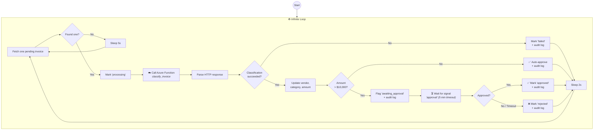

# Microsoft pg_durable Human Handoff

## 1. Metadata

```yaml
pack_id: "MICROSOFT-PG-DURABLE-HUMAN-HANDOFF"
pack_version: "0.1.0"
status:
  authority: SUPPORTED_REFERENCE
  implementation: REBUILD_VERIFIED
  admission: CONDITIONED
claim: "Materializa sin modificaciones 24 archivos del ejemplo oficial invoice-approval de Microsoft pg_durable v0.2.6, más LICENSE y NOTICE: SQL durable, señal, timeout, audit trail, Azure Function y smoke offline. Es un handoff técnico ejecutable, no una implementación completa de revisión documental autenticada."
stacks: ["PostgreSQL 17/18", "Microsoft pg_durable 0.2.6 Preview", "SQL", "Bash", "Python Azure Functions"]
compatible_with: ["POSTGRES-TRANSACTIONAL-FOUNDATION 0.2.x", "MICROSOFT-DURABLE-DOCUMENT-ORCHESTRATION 0.1.x", "STRICT-DOCUMENT-FIELD-EVALUATION-GATE 0.1.x"]
incompatible_with: ["producción automática", "imagen GHCR de evaluación en producción", "aprobador confiado sólo por payload", "persistencia sin autenticación de usuario", "corrección sin control de versión", "dependencias abiertas sin lock"]
license_expression: "PostgreSQL"
upstream_sources: ["https://github.com/microsoft/pg_durable/tree/6799781da58c7f51b9046445759362d2301610dd/examples/invoice-approval"]
verified_at: "2026-08-28"
```

## 2. Applicability

Use este pack cuando un proyecto PostgreSQL necesite estudiar o ejecutar el handoff durable oficial de una factura hacia una decisión humana con timeout, señal y audit trail. Veinticuatro archivos del ejemplo más `LICENSE.txt` y `NOTICE` son bytes VERBATIM del release oficial `v0.2.6`; no hay lógica de negocio local atribuida a Microsoft. `live_smoke_check.sh` no se embebe porque el upstream termina sin LF y el contrato Markdown no puede conservar ese byte final sin adaptación; puede obtenerse sólo desde el archive completo hash-bound.

No lo adopte como revisión documental completa. El ejemplo escribe `approver` dentro del payload, no autentica por sí mismo la identidad humana, no almacena correcciones por campo, no exige motivo de decisión, no aplica optimistic concurrency y usa `azure-functions>=1.20.0` sin lock. Microsoft declara pg_durable Preview y sus imágenes públicas sólo para evaluación/aprendizaje.

## 3. Architecture contract

El ejemplo crea tablas de factura y auditoría, clasifica mediante una Azure Function, autoaprueba importes bajos y espera `df.wait_for_signal('approval', 300)` para importes altos. El runtime oficial impide que un rol PostgreSQL señale la instancia de otro mediante RLS/ownership, pero el ejemplo no separa al dueño de la instancia del aprobador autorizado ni verifica la identidad declarada en el JSON.

La frontera admisible es: pg_durable aporta ejecución durable, señal, timeout, historial y aislamiento PostgreSQL; el proyecto debe aportar OIDC/sesión real, roles de revisión, evidencia por campo, correcciones, motivo obligatorio, versionado/conflict detection, four-eyes cuando corresponda y retención. No se ejecutan scripts Azure ni se crean recursos sin autorización explícita de cuenta/costo.

## 4. Exact file manifest

```text
CREATE microsoft_pg_durable_human_handoff/upstream/LICENSE.txt
CREATE microsoft_pg_durable_human_handoff/upstream/NOTICE
CREATE microsoft_pg_durable_human_handoff/upstream/examples/invoice-approval/.gitignore
CREATE microsoft_pg_durable_human_handoff/upstream/examples/invoice-approval/README.md
CREATE microsoft_pg_durable_human_handoff/upstream/examples/invoice-approval/without-df.md
CREATE microsoft_pg_durable_human_handoff/upstream/examples/invoice-approval/function-app/host.json
CREATE microsoft_pg_durable_human_handoff/upstream/examples/invoice-approval/function-app/requirements.txt
CREATE microsoft_pg_durable_human_handoff/upstream/examples/invoice-approval/function-app/classify_invoice/__init__.py
CREATE microsoft_pg_durable_human_handoff/upstream/examples/invoice-approval/function-app/classify_invoice/function.json
CREATE microsoft_pg_durable_human_handoff/upstream/examples/invoice-approval/scripts/cleanup_azure.sh
CREATE microsoft_pg_durable_human_handoff/upstream/examples/invoice-approval/scripts/configure_pg.sh
CREATE microsoft_pg_durable_human_handoff/upstream/examples/invoice-approval/scripts/create_function_app.sh
CREATE microsoft_pg_durable_human_handoff/upstream/examples/invoice-approval/scripts/deploy_function.sh
CREATE microsoft_pg_durable_human_handoff/upstream/examples/invoice-approval/scripts/feed_invoices.sh
CREATE microsoft_pg_durable_human_handoff/upstream/examples/invoice-approval/scripts/smoke_check.sh
CREATE microsoft_pg_durable_human_handoff/upstream/examples/invoice-approval/sql/01_schema.sql
CREATE microsoft_pg_durable_human_handoff/upstream/examples/invoice-approval/sql/02_set_vars.sql
CREATE microsoft_pg_durable_human_handoff/upstream/examples/invoice-approval/sql/03_seed_data.sql
CREATE microsoft_pg_durable_human_handoff/upstream/examples/invoice-approval/sql/04_explain.sql
CREATE microsoft_pg_durable_human_handoff/upstream/examples/invoice-approval/sql/05_start_workflow.sql
CREATE microsoft_pg_durable_human_handoff/upstream/examples/invoice-approval/sql/06_monitor.sql
CREATE microsoft_pg_durable_human_handoff/upstream/examples/invoice-approval/sql/07_approve.sql
CREATE microsoft_pg_durable_human_handoff/upstream/examples/invoice-approval/sql/08_explain_live.sql
CREATE microsoft_pg_durable_human_handoff/upstream/examples/invoice-approval/sql/09_verify.sql
CREATE microsoft_pg_durable_human_handoff/upstream/examples/invoice-approval/sql/10_cancel.sql
CREATE microsoft_pg_durable_human_handoff/upstream/examples/invoice-approval/sql/11_reset.sql
```

## 5. Materialization blocks

### FILE: `microsoft_pg_durable_human_handoff/upstream/LICENSE.txt`
```yaml
block_id: "MICROSOFT-PG-DURABLE-HANDOFF:01:v1"
operation: CREATE
provenance: VERBATIM
source: "https://github.com/microsoft/pg_durable/blob/6799781da58c7f51b9046445759362d2301610dd/LICENSE.txt"
license: "PostgreSQL"
sha256: "aab465651982b811f0dcd1f6403eb8e89282b75d3bf6ac685ada7e67023a1009"
variables: []
secrets_allowed: false
```
````text
PostgreSQL License

Copyright (c) 2025, Microsoft Corporation

Permission to use, copy, modify, and distribute this software and its
documentation for any purpose, without fee, and without a written agreement is
hereby granted, provided that the above copyright notice and this paragraph
and the following two paragraphs appear in all copies.

IN NO EVENT SHALL MICROSOFT CORPORATION BE LIABLE TO ANY PARTY FOR DIRECT,
INDIRECT, SPECIAL, INCIDENTAL, OR CONSEQUENTIAL DAMAGES, INCLUDING LOST PROFITS, ARISING OUT OF THE USE OF THIS SOFTWARE AND ITS DOCUMENTATION,
EVEN IF MICROSOFT CORPORATION HAS BEEN ADVISED OF THE POSSIBILITY OF SUCH DAMAGE.

MICROSOFT CORPORATION SPECIFICALLY DISCLAIMS ANY WARRANTIES, INCLUDING, BUT NOT
LIMITED TO, THE IMPLIED WARRANTIES OF MERCHANTABILITY AND FITNESS FOR A
PARTICULAR PURPOSE. THE SOFTWARE PROVIDED HEREUNDER IS ON AN "AS IS" BASIS, AND
MICROSOFT CORPORATION HAS NO OBLIGATIONS TO PROVIDE MAINTENANCE, SUPPORT,
UPDATES, ENHANCEMENTS, OR MODIFICATIONS.
````

### FILE: `microsoft_pg_durable_human_handoff/upstream/NOTICE`
```yaml
block_id: "MICROSOFT-PG-DURABLE-HANDOFF:02:v1"
operation: CREATE
provenance: VERBATIM
source: "https://github.com/microsoft/pg_durable/blob/6799781da58c7f51b9046445759362d2301610dd/NOTICE"
license: "PostgreSQL"
sha256: "a5b3fe6b28cdfefbbdb2bd0fd60d5329144aa531c8ab92f9794acf4f4ca06675"
variables: []
secrets_allowed: false
```
````text
pg_durable

This project incorporates or depends on third-party open source software.
The following list covers direct dependencies declared in this repository.
Before final release, generate and review a complete transitive dependency
inventory using the approved Microsoft tooling for NOTICE and SBOM compliance.

Rust dependencies declared in Cargo.toml:

- bigdecimal 0.4.10
  License: MIT/Apache-2.0
  Source: https://github.com/akubera/bigdecimal-rs

- chrono 0.4.44
  License: MIT OR Apache-2.0
  Source: https://github.com/chronotope/chrono

- cron 0.13.0
  License: MIT OR Apache-2.0
  Source: https://github.com/zslayton/cron

- duroxide 0.1.29
  License: MIT
  Source: https://github.com/microsoft/duroxide

- duroxide-pg 0.1.34
  License: MIT
  Source: https://github.com/microsoft/duroxide-pg

- pgrx 0.16.1
  License: MIT
  Source: https://github.com/pgcentralfoundation/pgrx/

- pgrx-tests 0.16.1
  License: MIT
  Source: https://github.com/pgcentralfoundation/pgrx/

- reqwest 0.12.28
  License: MIT OR Apache-2.0
  Source: https://github.com/seanmonstar/reqwest

- serde 1.0.228
  License: MIT OR Apache-2.0
  Source: https://github.com/serde-rs/serde

- serde_json 1.0.149
  License: MIT OR Apache-2.0
  Source: https://github.com/serde-rs/json

- sqlx 0.8.6
  License: MIT OR Apache-2.0
  Source: https://github.com/launchbadge/sqlx

- tokio 1.52.1
  License: MIT
  Source: https://github.com/tokio-rs/tokio

- tracing-subscriber 0.3.23
  License: MIT
  Source: https://github.com/tokio-rs/tracing

- uuid 1.23.1
  License: Apache-2.0 OR MIT
  Source: https://github.com/uuid-rs/uuid

Python dependencies declared by examples:

- azure-functions
  License: MIT License
  Source: https://pypi.org/project/azure-functions/

- tiktoken
  License: MIT License
  Source: https://pypi.org/project/tiktoken/
````

### FILE: `microsoft_pg_durable_human_handoff/upstream/examples/invoice-approval/.gitignore`
```yaml
block_id: "MICROSOFT-PG-DURABLE-HANDOFF:03:v1"
operation: CREATE
provenance: VERBATIM
source: "https://github.com/microsoft/pg_durable/blob/6799781da58c7f51b9046445759362d2301610dd/examples/invoice-approval/.gitignore"
license: "PostgreSQL"
sha256: "e3efac6d1903b32eff538716231c6f61c2fb489864f784ff5db6882b5b7bc16c"
variables: []
secrets_allowed: false
```
````text
.venv/
__pycache__/
*.pyc
local.settings.json
.azure-functions.env
````

### FILE: `microsoft_pg_durable_human_handoff/upstream/examples/invoice-approval/README.md`
```yaml
block_id: "MICROSOFT-PG-DURABLE-HANDOFF:04:v1"
operation: CREATE
provenance: VERBATIM
source: "https://github.com/microsoft/pg_durable/blob/6799781da58c7f51b9046445759362d2301610dd/examples/invoice-approval/README.md"
license: "PostgreSQL"
sha256: "f261dc2fda8b4d318aee81f92bdbe79f0a7039cc08d51905f49db181fc54ac7c"
variables: []
secrets_allowed: false
```
````markdown
# Invoice Approval Pipeline — pg_durable Demo

An always-on invoice processing pipeline that classifies invoices via an Azure Function, auto-approves small ones, and pauses for human approval on high-value invoices — all orchestrated from SQL inside PostgreSQL.

## What This Shows

| pg_durable Feature | How It Appears |
|---|---|
| **Infinite Loop** (`@>`) | Pipeline polls for new invoices continuously |
| **HTTP / Azure Functions** (`df.http()`) | Calls a deployed Azure Function to classify each invoice |
| **Human-in-the-Loop** (`df.wait_for_signal`) | High-value invoices (> $10K) pause until a human approves |
| **Conditional Branching** (`df.if`) | Routes invoices through auto-approve or approval-required paths |
| **Named Results** (`\|=>`) | Passes data between steps (invoice → request body → HTTP response → decision) |
| **Visualization** (`df.explain`) | Shows both the static graph and live execution status |
| **Monitoring** (`df.list_instances`, `df.status`) | Observe the pipeline in real time |

## Scenario (Plain English)

> Invoices arrive in a PostgreSQL table. A background pipeline picks each one up, sends it to an Azure Function that reads the amount and categorizes it (supplies, consulting, hardware, etc.). Small invoices are approved automatically. Large invoices (over $10,000) are flagged and the pipeline **waits** for a human to approve or reject them. New invoices can arrive at any time — the loop picks them up on its next pass.

## Pipeline Flowchart



## Request / Response Shape

**Request** (sent to Azure Function):
```json
{
  "invoice_id": 2,
  "description": "GlobalTech Consulting - Cloud infrastructure advisory",
  "raw_amount": "$24,500.00"
}
```

**Response** (from Azure Function):
```json
{
  "invoice_id": 2,
  "vendor": "GlobalTech Consulting",
  "category": "consulting",
  "amount": 24500.00,
  "currency": "USD",
  "requires_approval": true,
  "confidence": 0.92
}
```

## Directory Layout

```
examples/invoice-approval/
├── README.md                 ← you are here
├── function-app/
│   ├── host.json
│   ├── requirements.txt
│   └── classify_invoice/
│       ├── __init__.py       ← deterministic classifier (no AI dependency)
│       └── function.json
├── scripts/
│   ├── create_function_app.sh
│   ├── deploy_function.sh
│   ├── configure_pg.sh
│   ├── cleanup_azure.sh
│   ├── feed_invoices.sh      ← insert random invoices mid-demo
│   ├── smoke_check.sh        ← offline syntax/config validation
│   └── live_smoke_check.sh   ← deployed Azure Function check
└── sql/
    ├── 01_schema.sql         ← tables + truncate
    ├── 02_set_vars.sql       ← df.setvar for URL/key
    ├── 03_seed_data.sql      ← 2 invoices (1 small, 1 large)
    ├── 04_explain.sql        ← dry-run: preview the graph
    ├── 05_start_workflow.sql  ← launch the pipeline
    ├── 06_monitor.sql        ← check invoice status + audit trail
    ├── 07_approve.sql        ← send approval signal
    ├── 08_explain_live.sql   ← live graph with ✓/⏳ markers
    ├── 09_verify.sql         ← final state summary
    └── 10_cancel.sql         ← stop the pipeline
```

## Prerequisites

- Azure CLI (`az`) installed and logged in (`az login`)
- Azure Functions Core Tools (`func`)
- PostgreSQL with pg_durable enabled
- `psql` available (system or pgrx)

## Setup

### 1) Provision Azure Function App

```bash
cd examples/invoice-approval
chmod +x scripts/*.sh

./scripts/create_function_app.sh -l eastus
```

### 2) Deploy the classifier function

```bash
./scripts/deploy_function.sh
```

### 3) Smoke-check the function

```bash
./scripts/live_smoke_check.sh
```

### 4) Create demo schema

```bash
psql -d postgres -p 28817 -f sql/01_schema.sql
```

### 5) Configure pg_durable variables

```bash
./scripts/configure_pg.sh -d postgres -p 28817
```

### 6) Insert seed data

```bash
psql -d postgres -p 28817 -f sql/03_seed_data.sql
```

## 10-Minute Demo Script

### Minute 0–1: The Problem

> "Invoices come in. Small ones can be auto-approved, but anything over $10K needs a human to sign off. We want this to run continuously inside PostgreSQL — no external job queue, no microservices."

### Minute 1–2:30: Show the SQL

Open [sql/05_start_workflow.sql](sql/05_start_workflow.sql) and walk through the structure:
- The infinite loop (`@>`)
- The Azure Function call (`df.http`)
- The branching (`df.if` on amount threshold)
- The signal wait (`df.wait_for_signal`)

### Minute 2:30–3:30: Visualize the Graph

```bash
psql -d postgres -p 28817 -f sql/04_explain.sql
```

This shows the `df.explain()` dry-run — the tree structure of the pipeline without executing it. Also show the Mermaid diagram above.

### Minute 3:30–4:30: Start the Pipeline

```bash
psql -d postgres -p 28817 -f sql/05_start_workflow.sql
```

Note the instance ID returned. The pipeline immediately starts processing the 2 seeded invoices.

### Minute 4:30–5:30: Watch It Work

```bash
psql -d postgres -p 28817 -f sql/06_monitor.sql
```

You should see:
- Invoice #1 ($3,420 — office supplies): **auto-approved** ✅
- Invoice #2 ($24,500 — consulting): **awaiting_approval** ⏳

### Minute 5:30–6:00: Show the Live Graph

```sql
SELECT df.explain('<instance-id>');
```

The signal wait node shows ⏳. 

### Minute 6:00–6:30: Human Approves

```sql
SELECT df.signal('<instance-id>', 'approval', '{"approved": true, "approver": "demo-user"}');
```

### Minute 6:30–7:00: Confirm Approval

```bash
psql -d postgres -p 28817 -f sql/06_monitor.sql
```

Invoice #2 is now **approved**, audit trail shows the approver.

### Minute 7:00–8:00: Feed More Invoices

In another terminal:

```bash
./scripts/feed_invoices.sh -d postgres -p 28817 -n 3
```

Wait a few seconds, then monitor again — the loop picks them up automatically.

### Minute 8:00–9:00: Show the Pipeline Keeps Going

```bash
psql -d postgres -p 28817 -f sql/06_monitor.sql
```

New invoices are being processed. Any over $10K will pause for signals.

### Minute 9:00–9:30: Final State

```bash
psql -d postgres -p 28817 -f sql/09_verify.sql
```

### Minute 9:30–10:00: Wrap Up

> "This entire pipeline — HTTP calls, human approval gates, infinite loops, conditional logic — runs inside PostgreSQL. No external orchestrator. Survives crashes. All visible through SQL."

Optionally cancel the pipeline:

```sql
SELECT df.cancel('<instance-id>', 'Demo complete');
```

## Cleanup

```bash
./scripts/cleanup_azure.sh -y
```

## Operational Notes

- The classifier Azure Function is deterministic (keyword-based, no AI). It always returns consistent results for the same input.
- The $10,000 threshold is hardcoded in the SQL workflow — change it in `05_start_workflow.sql` to adjust.
- The approval signal has a 5-minute timeout. If no signal is sent, the invoice is automatically rejected.
- `feed_invoices.sh -s 10` runs continuously, inserting a batch every 10 seconds.
````

### FILE: `microsoft_pg_durable_human_handoff/upstream/examples/invoice-approval/without-df.md`
```yaml
block_id: "MICROSOFT-PG-DURABLE-HANDOFF:05:v1"
operation: CREATE
provenance: VERBATIM
source: "https://github.com/microsoft/pg_durable/blob/6799781da58c7f51b9046445759362d2301610dd/examples/invoice-approval/without-df.md"
license: "PostgreSQL"
sha256: "4b9dd8bc9b5267d9ee86dc3d91072e5b352ad04ce298d4c1c0ec1804d06ac254"
variables: []
secrets_allowed: false
```
````markdown
# Building the Invoice Pipeline Without pg_durable

What if `df.http()` was the *only* pg_durable feature you had? No `~>`, no `|=>`, no `df.if()`, no `@>` loops, no `df.wait_for_signal()`, no crash recovery. Just the ability to call an HTTP endpoint from SQL.

You'd need to build everything else yourself: polling, state machines, error handling, human approval gates, crash recovery, and observability. Here's what that looks like.

## What You Need to Build

| pg_durable gives you | You must build yourself |
|---|---|
| `@>` infinite loop | `pg_cron` job |
| `~>` sequencing | PL/pgSQL procedural code |
| `\|=>` named results | Local variables |
| `df.if()` branching | `IF/THEN/ELSE` |
| `df.wait_for_signal()` | Polling table + timeout logic |
| Crash recovery (replay) | Manual "stuck in processing" cleanup |
| `df.explain()` visualization | Nothing — you're flying blind |
| `df.cancel()` | Kill the cron job and hope for the best |

## The Code

### 1. Processing Function (~200 lines of PL/pgSQL)

```sql
CREATE OR REPLACE FUNCTION demo.process_one_invoice()
RETURNS void LANGUAGE plpgsql AS $$
DECLARE
    v_inv        RECORD;
    v_req_body   TEXT;
    v_resp       TEXT;
    v_resp_json  JSONB;
    v_ok         BOOLEAN;
    v_body       JSONB;
    v_amount     NUMERIC;
BEGIN
    -- ── Poll for one pending invoice ──
    SELECT id, description, raw_amount
    INTO v_inv
    FROM demo.invoices
    WHERE status = 'pending'
    ORDER BY id
    LIMIT 1
    FOR UPDATE SKIP LOCKED;          -- need this to avoid races

    IF NOT FOUND THEN
        RETURN;                       -- nothing to do
    END IF;

    -- ── Mark as processing ──
    UPDATE demo.invoices SET status = 'processing' WHERE id = v_inv.id;

    -- ── Build HTTP request body ──
    v_req_body := jsonb_build_object(
        'invoice_id',  v_inv.id,
        'description', v_inv.description,
        'raw_amount',  v_inv.raw_amount
    )::text;

    -- ── Call Azure Function ──
    BEGIN
        -- df.http is the ONE pg_durable feature we have
        SELECT df.start(
            df.http(
                current_setting('demo.classify_url') || '/api/classify_invoice',
                'POST',
                v_req_body,
                jsonb_build_object(
                    'Content-Type', 'application/json',
                    'x-functions-key', current_setting('demo.function_key')
                ),
                30
            )
        ) INTO v_resp;

        -- But wait — df.start() is async. We don't get the result back
        -- directly. We'd need to poll df.result() in a loop:
        FOR i IN 1..300 LOOP           -- 30 second timeout
            SELECT df.result(v_resp) INTO v_resp;
            EXIT WHEN v_resp IS NOT NULL;
            PERFORM pg_sleep(0.1);
        END LOOP;

        IF v_resp IS NULL THEN
            RAISE EXCEPTION 'HTTP call timed out';
        END IF;
    EXCEPTION WHEN OTHERS THEN
        UPDATE demo.invoices
        SET status = 'failed', processed_at = now()
        WHERE id = v_inv.id;

        INSERT INTO demo.invoice_audit (invoice_id, action, details)
        VALUES (v_inv.id, 'classification_failed',
                jsonb_build_object('error', SQLERRM));
        RETURN;
    END;

    -- ── Parse HTTP response ──
    v_resp_json := v_resp::jsonb;
    v_ok := (v_resp_json->>'ok')::boolean;
    v_body := (v_resp_json->>'body')::jsonb;

    IF NOT v_ok THEN
        UPDATE demo.invoices
        SET status = 'failed', processed_at = now()
        WHERE id = v_inv.id;

        INSERT INTO demo.invoice_audit (invoice_id, action, details)
        VALUES (v_inv.id, 'classification_failed',
                jsonb_build_object('http_status', v_resp_json->>'status'));
        RETURN;
    END IF;

    -- ── Update invoice with classification ──
    v_amount := (v_body->>'amount')::numeric;

    UPDATE demo.invoices SET
        vendor   = v_body->>'vendor',
        category = v_body->>'category',
        amount   = v_amount
    WHERE id = v_inv.id;

    INSERT INTO demo.invoice_audit (invoice_id, action, details)
    VALUES (v_inv.id, 'classified',
            jsonb_build_object(
                'vendor',   v_body->>'vendor',
                'category', v_body->>'category',
                'amount',   v_body->>'amount'));

    -- ── Branch on amount ──
    IF v_amount > 10000 THEN
        -- High value: flag for approval
        UPDATE demo.invoices
        SET status = 'awaiting_approval'
        WHERE id = v_inv.id;

        INSERT INTO demo.invoice_audit (invoice_id, action, details)
        VALUES (v_inv.id, 'awaiting_approval',
                jsonb_build_object(
                    'amount', v_body->>'amount',
                    'vendor', v_body->>'vendor',
                    'reason', 'Amount exceeds $10,000'));

        -- Can't wait here. A separate job must poll for approvals.
        -- (see process_approvals below)
    ELSE
        -- Low value: auto-approve
        UPDATE demo.invoices
        SET status = 'approved', processed_at = now()
        WHERE id = v_inv.id;

        INSERT INTO demo.invoice_audit (invoice_id, action, details)
        VALUES (v_inv.id, 'auto_approved',
                jsonb_build_object(
                    'amount', v_body->>'amount',
                    'vendor', v_body->>'vendor'));
    END IF;
END $$;
```

### 2. Approval Polling Function (separate, because you can't "wait")

```sql
-- You need a SECOND function because the first one can't block waiting
-- for human input. This polls for approval decisions.

CREATE TABLE IF NOT EXISTS demo.approval_decisions (
    invoice_id   BIGINT PRIMARY KEY REFERENCES demo.invoices(id),
    approved     BOOLEAN NOT NULL,
    approver     TEXT,
    decided_at   TIMESTAMPTZ NOT NULL DEFAULT now()
);

CREATE OR REPLACE FUNCTION demo.process_approvals()
RETURNS void LANGUAGE plpgsql AS $$
DECLARE
    v_inv    RECORD;
    v_decide RECORD;
BEGIN
    FOR v_inv IN
        SELECT id FROM demo.invoices
        WHERE status = 'awaiting_approval'
    LOOP
        -- Check if there's a decision
        SELECT * INTO v_decide
        FROM demo.approval_decisions
        WHERE invoice_id = v_inv.id;

        IF FOUND THEN
            IF v_decide.approved THEN
                UPDATE demo.invoices SET
                    status = 'approved',
                    approved_by = v_decide.approver,
                    processed_at = now()
                WHERE id = v_inv.id;

                INSERT INTO demo.invoice_audit (invoice_id, action, details)
                VALUES (v_inv.id, 'approved',
                        jsonb_build_object('approver', v_decide.approver));
            ELSE
                UPDATE demo.invoices SET
                    status = 'rejected',
                    processed_at = now()
                WHERE id = v_inv.id;

                INSERT INTO demo.invoice_audit (invoice_id, action, details)
                VALUES (v_inv.id, 'rejected',
                        jsonb_build_object('approver', v_decide.approver));
            END IF;

            DELETE FROM demo.approval_decisions WHERE invoice_id = v_inv.id;

        ELSE
            -- Check for timeout (5 minutes)
            IF (SELECT updated_at FROM demo.invoices WHERE id = v_inv.id)
               < now() - INTERVAL '5 minutes'
            THEN
                UPDATE demo.invoices SET
                    status = 'rejected',
                    processed_at = now()
                WHERE id = v_inv.id;

                INSERT INTO demo.invoice_audit (invoice_id, action, details)
                VALUES (v_inv.id, 'rejected',
                        jsonb_build_object('timed_out', true));
            END IF;
        END IF;
    END LOOP;
END $$;
```

### 3. Crash Recovery Function (because nothing is durable)

```sql
-- If PostgreSQL crashes mid-processing, invoices get stuck in 'processing'.
-- You need a cleanup job to reset them.

CREATE OR REPLACE FUNCTION demo.recover_stuck_invoices()
RETURNS void LANGUAGE plpgsql AS $$
BEGIN
    UPDATE demo.invoices
    SET status = 'pending'
    WHERE status = 'processing'
      AND updated_at < now() - INTERVAL '2 minutes';

    -- Log what we recovered
    INSERT INTO demo.invoice_audit (invoice_id, action, details)
    SELECT id, 'crash_recovery',
           jsonb_build_object('was_stuck_since', updated_at)
    FROM demo.invoices
    WHERE status = 'pending'
      AND updated_at < now() - INTERVAL '2 minutes';
END $$;
```

### 4. Scheduling (3 separate cron jobs)

```sql
-- You need pg_cron. That's another extension to install and manage.

-- Poll for new invoices every 5 seconds
SELECT cron.schedule('invoice-processor', '5 seconds',
    $$SELECT demo.process_one_invoice()$$);

-- Poll for approval decisions every 5 seconds
SELECT cron.schedule('approval-processor', '5 seconds',
    $$SELECT demo.process_approvals()$$);

-- Clean up stuck invoices every minute
SELECT cron.schedule('stuck-recovery', '* * * * *',
    $$SELECT demo.recover_stuck_invoices()$$);
```

### 5. Human Approval (manual table insert instead of signal)

```sql
-- To approve an invoice, the human inserts into a table:
INSERT INTO demo.approval_decisions (invoice_id, approved, approver)
VALUES (2, true, 'demo-user');

-- Then they wait for the cron job to pick it up. Eventually.
```

### 6. Cancellation (disable cron jobs)

```sql
SELECT cron.unschedule('invoice-processor');
SELECT cron.unschedule('approval-processor');
SELECT cron.unschedule('stuck-recovery');
-- Hope nothing was mid-flight.
```

## Side-by-Side

### Starting the pipeline

**Without pg_durable:**
```sql
-- Create 3 functions (~250 lines of PL/pgSQL)
-- Install pg_cron extension
-- Schedule 3 separate cron jobs
-- Create an extra approval_decisions table
-- Hope nothing crashes between steps
```

**With pg_durable:**
```sql
SELECT df.start(
    @> (
        ($$SELECT ... FROM demo.invoices WHERE status = 'pending'$$ |=> 'inv')
        ~> df.if_rows('inv',
            $$UPDATE ... SET status = 'processing'$$
            ~> (df.http(...) |=> 'resp')
            ~> df.if($$SELECT $r.ok$$,
                -- classify, branch, wait for signal ...
            ),
            df.sleep(5)
        )
    ),
    'invoice-approval-pipeline'
);
```

### Sending an approval

**Without pg_durable:**
```sql
INSERT INTO demo.approval_decisions (invoice_id, approved, approver)
VALUES (2, true, 'demo-user');
-- Wait up to 5 seconds for cron to pick it up
```

**With pg_durable:**
```sql
SELECT df.signal('<instance-id>', 'approval',
    '{"approved": true, "approver": "demo-user"}');
-- Immediate. The waiting orchestration resumes.
```

### Seeing what's happening

**Without pg_durable:**
```sql
-- Check cron job status? Check each table manually? grep the logs?
-- There's no unified view of the pipeline.
SELECT * FROM cron.job_run_details ORDER BY start_time DESC LIMIT 10;
```

**With pg_durable:**
```sql
SELECT df.explain('<instance-id>');
-- Shows the full execution tree with ✓/⏳/✗ on each node.
```

### Crash recovery

**Without pg_durable:** You build it yourself and pray it covers all the edge cases. What if the crash happens between the `UPDATE` and the `INSERT INTO audit`? You get inconsistent state.

**With pg_durable:** Automatic. The runtime replays from the last checkpoint. Every step is durable.

## What You're Really Building

Without pg_durable, you're building a bespoke workflow engine out of:
- **3 PL/pgSQL functions** (~250 lines) instead of 1 SQL expression (~50 lines)
- **3 cron jobs** instead of 1 `df.start()` call
- **1 extra table** (`approval_decisions`) for the approval handshake
- **1 extra extension** (`pg_cron`) for scheduling
- **Manual crash recovery** that will miss edge cases
- **No visualization** of the pipeline state
- **No clean cancellation** — just disable cron and clean up manually

And you still don't get durability. If PostgreSQL crashes between any two statements in `process_one_invoice()`, you get partial state that your crash recovery function may or may not fix correctly.
````

### FILE: `microsoft_pg_durable_human_handoff/upstream/examples/invoice-approval/function-app/host.json`
```yaml
block_id: "MICROSOFT-PG-DURABLE-HANDOFF:06:v1"
operation: CREATE
provenance: VERBATIM
source: "https://github.com/microsoft/pg_durable/blob/6799781da58c7f51b9046445759362d2301610dd/examples/invoice-approval/function-app/host.json"
license: "PostgreSQL"
sha256: "6807c805e01f645e9249b28fb65e8221873a1251802b4c112746b77f202cd2e2"
variables: []
secrets_allowed: false
```
````json
{
  "version": "2.0",
  "extensionBundle": {
    "id": "Microsoft.Azure.Functions.ExtensionBundle",
    "version": "[4.*, 5.0.0)"
  }
}
````

### FILE: `microsoft_pg_durable_human_handoff/upstream/examples/invoice-approval/function-app/requirements.txt`
```yaml
block_id: "MICROSOFT-PG-DURABLE-HANDOFF:07:v1"
operation: CREATE
provenance: VERBATIM
source: "https://github.com/microsoft/pg_durable/blob/6799781da58c7f51b9046445759362d2301610dd/examples/invoice-approval/function-app/requirements.txt"
license: "PostgreSQL"
sha256: "119e1c75628b69ee8a7a519230a9b18e1d7ccc16540a3c33c355b98f4d3e8e13"
variables: []
secrets_allowed: false
```
````text
azure-functions>=1.20.0
````

### FILE: `microsoft_pg_durable_human_handoff/upstream/examples/invoice-approval/function-app/classify_invoice/__init__.py`
```yaml
block_id: "MICROSOFT-PG-DURABLE-HANDOFF:08:v1"
operation: CREATE
provenance: VERBATIM
source: "https://github.com/microsoft/pg_durable/blob/6799781da58c7f51b9046445759362d2301610dd/examples/invoice-approval/function-app/classify_invoice/__init__.py"
license: "PostgreSQL"
sha256: "ae1ca693e1e6277c07f4ea62cb2e7886a3a61740d354a4f2d26a81e023eac207"
variables: []
secrets_allowed: false
```
````python
# Copyright (c) Microsoft Corporation.
# Licensed under the PostgreSQL License.

import json
import re
from typing import Any

import azure.functions as func


def _json_error(status_code: int, code: str, message: str) -> func.HttpResponse:
    body = {"error": code, "message": message}
    return func.HttpResponse(
        json.dumps(body),
        status_code=status_code,
        mimetype="application/json",
    )


# Simple keyword-based categorization (deterministic, no AI dependency)
CATEGORY_KEYWORDS: dict[str, list[str]] = {
    "software": ["license", "software", "saas", "subscription", "cloud", "azure", "aws"],
    "consulting": ["consulting", "advisory", "professional services", "engagement"],
    "hardware": ["server", "laptop", "hardware", "equipment", "device", "monitor"],
    "facilities": ["rent", "lease", "utilities", "maintenance", "cleaning", "office"],
    "travel": ["travel", "flight", "hotel", "airfare", "per diem", "mileage"],
    "marketing": ["marketing", "advertising", "campaign", "sponsorship", "event"],
    "supplies": ["supplies", "paper", "ink", "stationery", "office supplies"],
}


def _classify(description: str) -> str:
    lower = description.lower()
    for category, keywords in CATEGORY_KEYWORDS.items():
        if any(kw in lower for kw in keywords):
            return category
    return "other"


def _extract_amount(raw_amount: str) -> float | None:
    cleaned = re.sub(r"[^\d.,]", "", raw_amount)
    cleaned = cleaned.replace(",", "")
    try:
        return round(float(cleaned), 2)
    except ValueError:
        return None


def _extract_vendor(description: str) -> str:
    parts = description.split(" - ")
    if len(parts) >= 2:
        return parts[0].strip()
    parts = description.split(" from ")
    if len(parts) >= 2:
        return parts[-1].strip()
    words = description.split()
    if len(words) >= 2:
        return " ".join(words[:2])
    return "Unknown"


def _validate_payload(payload: dict[str, Any]) -> tuple[int, str, str] | None:
    invoice_id = payload.get("invoice_id")
    description = payload.get("description")
    raw_amount = payload.get("raw_amount")

    if not isinstance(invoice_id, int):
        return None
    if not isinstance(description, str) or not description.strip():
        return None
    if not isinstance(raw_amount, str) or not raw_amount.strip():
        return None

    return invoice_id, description, raw_amount


def main(req: func.HttpRequest) -> func.HttpResponse:
    try:
        payload = req.get_json()
    except ValueError:
        return _json_error(400, "INVALID_JSON", "Request body must be valid JSON.")

    if not isinstance(payload, dict):
        return _json_error(400, "INVALID_PAYLOAD", "Expected a JSON object.")

    validated = _validate_payload(payload)
    if validated is None:
        return _json_error(
            400,
            "MISSING_FIELDS",
            "Required: invoice_id (int), description (string), raw_amount (string).",
        )

    invoice_id, description, raw_amount = validated

    amount = _extract_amount(raw_amount)
    if amount is None:
        return _json_error(
            400, "INVALID_AMOUNT", f"Could not parse amount from: {raw_amount}"
        )

    category = _classify(description)
    vendor = _extract_vendor(description)

    result = {
        "invoice_id": invoice_id,
        "vendor": vendor,
        "category": category,
        "amount": amount,
        "currency": "USD",
        "requires_approval": amount > 10000,
        "confidence": 0.92,
    }

    return func.HttpResponse(
        json.dumps(result),
        status_code=200,
        mimetype="application/json",
    )
````

### FILE: `microsoft_pg_durable_human_handoff/upstream/examples/invoice-approval/function-app/classify_invoice/function.json`
```yaml
block_id: "MICROSOFT-PG-DURABLE-HANDOFF:09:v1"
operation: CREATE
provenance: VERBATIM
source: "https://github.com/microsoft/pg_durable/blob/6799781da58c7f51b9046445759362d2301610dd/examples/invoice-approval/function-app/classify_invoice/function.json"
license: "PostgreSQL"
sha256: "c19b9f527c7619a1609907ac713253895b9bd234932111391a59586d6067c13f"
variables: []
secrets_allowed: false
```
````json
{
  "scriptFile": "__init__.py",
  "bindings": [
    {
      "authLevel": "function",
      "type": "httpTrigger",
      "direction": "in",
      "name": "req",
      "methods": ["post"],
      "route": "classify_invoice"
    },
    {
      "type": "http",
      "direction": "out",
      "name": "$return"
    }
  ]
}
````

### FILE: `microsoft_pg_durable_human_handoff/upstream/examples/invoice-approval/scripts/cleanup_azure.sh`
```yaml
block_id: "MICROSOFT-PG-DURABLE-HANDOFF:10:v1"
operation: CREATE
provenance: VERBATIM
source: "https://github.com/microsoft/pg_durable/blob/6799781da58c7f51b9046445759362d2301610dd/examples/invoice-approval/scripts/cleanup_azure.sh"
license: "PostgreSQL"
sha256: "0e1b7918ad07e054afa5758ed63f4af66647327d84c54aa7fdf1a69123da54d1"
variables: []
secrets_allowed: false
```
````bash
#!/usr/bin/env bash
# Copyright (c) Microsoft Corporation.
# Licensed under the PostgreSQL License.

set -euo pipefail

usage() {
  echo "Usage: $0 [-g <resource-group>] [-y]"
  echo "Default: reads resource group from .azure-functions.env"
}

RESOURCE_GROUP=""
YES="false"

SCRIPT_DIR="$(cd "$(dirname "${BASH_SOURCE[0]}")" && pwd)"
ROOT_DIR="$(cd "$SCRIPT_DIR/.." && pwd)"
ENV_FILE="${ENV_FILE:-$ROOT_DIR/.azure-functions.env}"

while getopts ":g:e:yh" opt; do
  case "$opt" in
    g) RESOURCE_GROUP="$OPTARG" ;;
    e) ENV_FILE="$OPTARG" ;;
    y) YES="true" ;;
    h) usage; exit 0 ;;
    :) echo "Missing argument for -$OPTARG"; usage; exit 1 ;;
    \?) echo "Unknown option: -$OPTARG"; usage; exit 1 ;;
  esac
done

command -v az >/dev/null 2>&1 || { echo "Error: az CLI not found"; exit 1; }

if [[ -f "$ENV_FILE" ]]; then
  # shellcheck disable=SC1090
  source "$ENV_FILE"
fi

if [[ -z "$RESOURCE_GROUP" ]]; then
  RESOURCE_GROUP="${AZURE_RESOURCE_GROUP:-}"
fi

if [[ -z "$RESOURCE_GROUP" ]]; then
  echo "Error: resource group not found. Use -g <name> or set AZURE_RESOURCE_GROUP."
  exit 1
fi

if [[ "$YES" != "true" ]]; then
  echo "This will delete Azure resource group '$RESOURCE_GROUP' and all resources in it."
  read -r -p "Type the resource group name to continue: " CONFIRM
  if [[ "$CONFIRM" != "$RESOURCE_GROUP" ]]; then
    echo "Aborted."
    exit 1
  fi
fi

echo "Deleting resource group: $RESOURCE_GROUP"
az group delete --name "$RESOURCE_GROUP" --yes --no-wait

echo "Delete request submitted. Azure may take several minutes to complete."
````

### FILE: `microsoft_pg_durable_human_handoff/upstream/examples/invoice-approval/scripts/configure_pg.sh`
```yaml
block_id: "MICROSOFT-PG-DURABLE-HANDOFF:11:v1"
operation: CREATE
provenance: VERBATIM
source: "https://github.com/microsoft/pg_durable/blob/6799781da58c7f51b9046445759362d2301610dd/examples/invoice-approval/scripts/configure_pg.sh"
license: "PostgreSQL"
sha256: "439d80b70a66133e653587254b531d1e63cc0d19f1e62153e57cc6d6de2fd449"
variables: []
secrets_allowed: false
```
````bash
#!/usr/bin/env bash
# Copyright (c) Microsoft Corporation.
# Licensed under the PostgreSQL License.

set -euo pipefail

usage() {
  echo "Usage: $0 [-u <base-url>] [-k <function-key>] [-d <database>] [-h <host>] [-p <port>] [-U <user>]"
  echo "Example (auto from .env): $0 -d postgres -h localhost -p 28817 -U postgres"
  echo "Example (manual):         $0 -u https://my-func.azurewebsites.net -k abc123 -d postgres"
}

BASE_URL=""
FUNCTION_KEY=""
DB_NAME="postgres"
PGHOST_VAL="${PGHOST:-localhost}"
PGPORT_VAL="${PGPORT:-28817}"
PGUSER_VAL="${PGUSER:-$(whoami)}"

SCRIPT_DIR="$(cd "$(dirname "${BASH_SOURCE[0]}")" && pwd)"
ROOT_DIR="$(cd "$SCRIPT_DIR/.." && pwd)"
ENV_FILE="${ENV_FILE:-$ROOT_DIR/.azure-functions.env}"

if [[ -f "$ENV_FILE" ]]; then
  # shellcheck disable=SC1090
  source "$ENV_FILE"
fi

BASE_URL="${AZURE_FUNCTION_BASE_URL:-$BASE_URL}"
FUNCTION_KEY="${AZURE_FUNCTION_KEY:-$FUNCTION_KEY}"

while getopts ":u:k:e:d:h:p:U:?" opt; do
  case "$opt" in
    u) BASE_URL="$OPTARG" ;;
    k) FUNCTION_KEY="$OPTARG" ;;
    e) ENV_FILE="$OPTARG"
       if [[ -f "$ENV_FILE" ]]; then
         # shellcheck disable=SC1090
         source "$ENV_FILE"
         BASE_URL="${AZURE_FUNCTION_BASE_URL:-$BASE_URL}"
         FUNCTION_KEY="${AZURE_FUNCTION_KEY:-$FUNCTION_KEY}"
       else
         echo "Error: env file not found: $ENV_FILE"
         exit 1
       fi
       ;;
    d) DB_NAME="$OPTARG" ;;
    h) PGHOST_VAL="$OPTARG" ;;
    p) PGPORT_VAL="$OPTARG" ;;
    U) PGUSER_VAL="$OPTARG" ;;
    ?) usage; exit 0 ;;
    :) echo "Missing argument for -$OPTARG"; usage; exit 1 ;;
    \?) echo "Unknown option: -$OPTARG"; usage; exit 1 ;;
  esac
done

if [[ -z "$BASE_URL" || -z "$FUNCTION_KEY" ]]; then
  echo "Error: missing base URL or function key."
  if [[ -f "$ENV_FILE" ]]; then
    echo "Checked env file: $ENV_FILE"
  else
    echo "Env file not found: $ENV_FILE"
  fi
  echo "Run deploy_function.sh first, or pass -u and -k explicitly."
  usage
  exit 1
fi

resolve_psql() {
  if [[ -n "${PSQL_BIN:-}" ]]; then
    if [[ -x "$PSQL_BIN" ]]; then
      echo "$PSQL_BIN"
      return 0
    fi
    echo "Error: PSQL_BIN is set but not executable: $PSQL_BIN" >&2
    return 1
  fi

  if command -v psql >/dev/null 2>&1; then
    command -v psql
    return 0
  fi

  local pgrx_psql=""
  pgrx_psql="$(ls -1d "$HOME"/.pgrx/*/pgrx-install/bin/psql 2>/dev/null | head -n 1 || true)"
  if [[ -n "$pgrx_psql" && -x "$pgrx_psql" ]]; then
    echo "$pgrx_psql"
    return 0
  fi

  echo "Error: psql not found on PATH and no pgrx psql discovered." >&2
  return 1
}

PSQL_CMD="$(resolve_psql)"

export PGHOST="$PGHOST_VAL"
export PGPORT="$PGPORT_VAL"
export PGUSER="$PGUSER_VAL"

export AZURE_FUNCTION_BASE_URL="$BASE_URL"
export AZURE_FUNCTION_KEY="$FUNCTION_KEY"

"$PSQL_CMD" -d "$DB_NAME" -f "$ROOT_DIR/sql/02_set_vars.sql"

echo "pg_durable variables configured (classify_url, function_key)."
````

### FILE: `microsoft_pg_durable_human_handoff/upstream/examples/invoice-approval/scripts/create_function_app.sh`
```yaml
block_id: "MICROSOFT-PG-DURABLE-HANDOFF:12:v1"
operation: CREATE
provenance: VERBATIM
source: "https://github.com/microsoft/pg_durable/blob/6799781da58c7f51b9046445759362d2301610dd/examples/invoice-approval/scripts/create_function_app.sh"
license: "PostgreSQL"
sha256: "2702f212dcfc74915c59109a6c7cdcc7c052c543a81e71945b5ad16161421cb5"
variables: []
secrets_allowed: false
```
````bash
#!/usr/bin/env bash
# Copyright (c) Microsoft Corporation.
# Licensed under the PostgreSQL License.

set -euo pipefail

usage() {
  echo "Usage: $0 [-l <location>]"
  echo "  -l (optional):   Azure location (default: eastus)"
  echo ""
  echo "Creates a resource group, storage account, and Function App."
  echo "Writes settings to .azure-functions.env."
}

LOCATION="eastus"

while getopts ":l:h" opt; do
  case "$opt" in
    l) LOCATION="$OPTARG" ;;
    h) usage; exit 0 ;;
    :) echo "Missing argument for -$OPTARG"; usage; exit 1 ;;
    \?) echo "Unknown option: -$OPTARG"; usage; exit 1 ;;
  esac
done

shift $((OPTIND - 1))

if [[ $# -gt 0 ]]; then
  usage
  exit 1
fi

RAND5="$(openssl rand -hex 3 | cut -c1-5)"
BASE_NAME="pgd_ex_ia_${RAND5}"

RG="$BASE_NAME"
APP_NAME="$(echo "$RG" \
  | tr '[:upper:]' '[:lower:]' \
  | sed -E 's/_+/-/g' \
  | sed -E 's/[^a-z0-9-]//g' \
  | sed -E 's/^-+//; s/-+$//; s/-{2,}/-/g')"

if [[ ${#APP_NAME} -gt 60 ]]; then
  APP_NAME="${APP_NAME:0:60}"
  APP_NAME="$(echo "$APP_NAME" | sed -E 's/-+$//')"
fi
if [[ -z "$APP_NAME" ]]; then
  echo "Error: derived Function App name is empty after sanitization."
  exit 1
fi

command -v az >/dev/null 2>&1 || { echo "Error: az CLI not found"; exit 1; }

STORAGE_NAME="$(echo "$RG" | tr '[:upper:]' '[:lower:]' | tr -cd 'a-z0-9')"
if [[ ${#STORAGE_NAME} -lt 3 ]]; then
  STORAGE_NAME="${STORAGE_NAME}ia0"
fi
if [[ ${#STORAGE_NAME} -gt 24 ]]; then
  STORAGE_NAME="${STORAGE_NAME:0:24}"
fi

SCRIPT_DIR="$(cd "$(dirname "${BASH_SOURCE[0]}")" && pwd)"
ROOT_DIR="$(cd "$SCRIPT_DIR/.." && pwd)"
ENV_FILE="${ENV_FILE:-$ROOT_DIR/.azure-functions.env}"

upsert_env_var() {
  local key="$1"
  local value="$2"
  touch "$ENV_FILE"
  chmod 600 "$ENV_FILE"
  if grep -q "^${key}=" "$ENV_FILE"; then
    sed -i "s|^${key}=.*|${key}=${value}|" "$ENV_FILE"
  else
    printf '%s=%s\n' "$key" "$value" >> "$ENV_FILE"
  fi
}

unset_env_var() {
  local key="$1"
  touch "$ENV_FILE"
  chmod 600 "$ENV_FILE"
  if grep -q "^${key}=" "$ENV_FILE"; then
    sed -i "/^${key}=/d" "$ENV_FILE"
  fi
}

run_status() {
  local status="$1"
  upsert_env_var "AZURE_LAST_CREATE_STATUS" "$status"
  upsert_env_var "AZURE_LAST_CREATE_AT" "$(date -u +%Y-%m-%dT%H:%M:%SZ)"
}

run_status "started"
upsert_env_var "AZURE_REQUESTED_BASE_NAME" "$BASE_NAME"

unset_env_var "AZURE_RESOURCE_GROUP"
unset_env_var "AZURE_LOCATION"
unset_env_var "AZURE_FUNCTION_APP_NAME"
unset_env_var "AZURE_STORAGE_ACCOUNT_NAME"
unset_env_var "AZURE_FUNCTION_BASE_URL"
unset_env_var "AZURE_FUNCTION_NAME"
unset_env_var "AZURE_FUNCTION_KEY"

upsert_env_var "AZURE_RESOURCE_GROUP" "$RG"
upsert_env_var "AZURE_LOCATION" "$LOCATION"
upsert_env_var "AZURE_FUNCTION_APP_NAME" "$APP_NAME"
upsert_env_var "AZURE_STORAGE_ACCOUNT_NAME" "$STORAGE_NAME"

echo "Creating/ensuring resource group: $RG"
az group create --name "$RG" --location "$LOCATION" --output table >/dev/null
upsert_env_var "AZURE_RESOURCE_GROUP_CREATED" "true"

echo "Creating storage account: $STORAGE_NAME"
az storage account create \
  --name "$STORAGE_NAME" \
  --location "$LOCATION" \
  --resource-group "$RG" \
  --sku Standard_LRS \
  --kind StorageV2 \
  --min-tls-version TLS1_2 \
  --https-only true \
  --allow-blob-public-access false \
  --output table >/dev/null
upsert_env_var "AZURE_STORAGE_ACCOUNT_CREATED" "true"

echo "Creating Function App: $APP_NAME"
az functionapp create \
  --name "$APP_NAME" \
  --resource-group "$RG" \
  --storage-account "$STORAGE_NAME" \
  --consumption-plan-location "$LOCATION" \
  --runtime python \
  --runtime-version 3.11 \
  --functions-version 4 \
  --os-type Linux \
  --output table >/dev/null
upsert_env_var "AZURE_FUNCTION_APP_CREATED" "true"

APP_URL="https://${APP_NAME}.azurewebsites.net"

upsert_env_var "AZURE_RESOURCE_GROUP" "$RG"
upsert_env_var "AZURE_LOCATION" "$LOCATION"
upsert_env_var "AZURE_FUNCTION_APP_NAME" "$APP_NAME"
upsert_env_var "AZURE_STORAGE_ACCOUNT_NAME" "$STORAGE_NAME"
upsert_env_var "AZURE_FUNCTION_BASE_URL" "$APP_URL"
run_status "completed"

echo
echo "Function App created."
echo "App URL: $APP_URL"
echo "Resource group: $RG"
echo "Function app:   $APP_NAME"
echo "Storage acct:   $STORAGE_NAME"
echo "Wrote settings to: $ENV_FILE"
echo "Next: run deploy_function.sh to publish code."
````

### FILE: `microsoft_pg_durable_human_handoff/upstream/examples/invoice-approval/scripts/deploy_function.sh`
```yaml
block_id: "MICROSOFT-PG-DURABLE-HANDOFF:13:v1"
operation: CREATE
provenance: VERBATIM
source: "https://github.com/microsoft/pg_durable/blob/6799781da58c7f51b9046445759362d2301610dd/examples/invoice-approval/scripts/deploy_function.sh"
license: "PostgreSQL"
sha256: "f484895eaca057a9188e92bf7691f0cad7af4d0397c94f20ca143c4f6c555212"
variables: []
secrets_allowed: false
```
````bash
#!/usr/bin/env bash
# Copyright (c) Microsoft Corporation.
# Licensed under the PostgreSQL License.

set -euo pipefail

usage() {
  echo "Usage: $0"
  echo "  Reads app/resource-group from .azure-functions.env"
  echo "  Deploys the classify_invoice function and retrieves the function key."
}

if [[ "${1:-}" == "-h" || "${1:-}" == "--help" ]]; then
  usage
  exit 0
fi

if [[ $# -gt 0 ]]; then
  usage
  exit 1
fi

command -v func >/dev/null 2>&1 || { echo "Error: Azure Functions Core Tools (func) not found"; exit 1; }
command -v az >/dev/null 2>&1 || { echo "Error: az CLI not found"; exit 1; }

SCRIPT_DIR="$(cd "$(dirname "${BASH_SOURCE[0]}")" && pwd)"
ROOT_DIR="$(cd "$SCRIPT_DIR/.." && pwd)"
FUNC_APP_DIR="$ROOT_DIR/function-app"
ENV_FILE="${ENV_FILE:-$ROOT_DIR/.azure-functions.env}"

FUNCTION_NAME="classify_invoice"

if [[ -f "$ENV_FILE" ]]; then
  # shellcheck disable=SC1090
  source "$ENV_FILE"
fi

APP_NAME="${AZURE_FUNCTION_APP_NAME:-}"
RESOURCE_GROUP="${AZURE_RESOURCE_GROUP:-}"

if [[ -z "$APP_NAME" ]]; then
  echo "Error: AZURE_FUNCTION_APP_NAME not found in .azure-functions.env"
  echo "Run create_function_app.sh first."
  exit 1
fi

if [[ -z "$RESOURCE_GROUP" ]]; then
  echo "Error: AZURE_RESOURCE_GROUP not found in .azure-functions.env"
  echo "Run create_function_app.sh first."
  exit 1
fi

upsert_env_var() {
  local key="$1"
  local value="$2"
  touch "$ENV_FILE"
  chmod 600 "$ENV_FILE"
  if grep -q "^${key}=" "$ENV_FILE"; then
    sed -i "s|^${key}=.*|${key}=${value}|" "$ENV_FILE"
  else
    printf '%s=%s\n' "$key" "$value" >> "$ENV_FILE"
  fi
}

unset_env_var() {
  local key="$1"
  touch "$ENV_FILE"
  chmod 600 "$ENV_FILE"
  if grep -q "^${key}=" "$ENV_FILE"; then
    sed -i "/^${key}=/d" "$ENV_FILE"
  fi
}

run_status() {
  local status="$1"
  upsert_env_var "AZURE_LAST_DEPLOY_STATUS" "$status"
  upsert_env_var "AZURE_LAST_DEPLOY_AT" "$(date -u +%Y-%m-%dT%H:%M:%SZ)"
}

run_status "started"
upsert_env_var "AZURE_FUNCTION_NAME" "$FUNCTION_NAME"
unset_env_var "AZURE_FUNCTION_KEY"

if [[ ! -d "$FUNC_APP_DIR" ]]; then
  echo "Error: function-app directory not found at $FUNC_APP_DIR"
  exit 1
fi

pushd "$FUNC_APP_DIR" >/dev/null

echo "Publishing function app code to: $APP_NAME"
func azure functionapp publish "$APP_NAME" --python
upsert_env_var "AZURE_FUNCTION_PUBLISHED" "true"

popd >/dev/null

echo
echo "Deployment completed."
echo "Function endpoint: https://${APP_NAME}.azurewebsites.net/api/${FUNCTION_NAME}"
echo
echo "Fetching function key..."
if ! az functionapp function show \
  --name "$APP_NAME" \
  --resource-group "$RESOURCE_GROUP" \
  --function-name "$FUNCTION_NAME" \
  --output none >/dev/null 2>&1; then
  echo "Error: Function '$FUNCTION_NAME' was not found in app '$APP_NAME'."
  echo "Tip: wait ~30-60s after publish and retry, or confirm function name."
  exit 1
fi

FUNCTION_KEY="$(az functionapp function keys list \
  --name "$APP_NAME" \
  --resource-group "$RESOURCE_GROUP" \
  --function-name "$FUNCTION_NAME" \
  --query default \
  -o tsv)"

if [[ -z "$FUNCTION_KEY" ]]; then
  echo "Error: Function key retrieval returned empty."
  echo "Try again in 30-60s; key creation can lag after deployment."
  exit 1
fi

BASE_URL="https://${APP_NAME}.azurewebsites.net"
upsert_env_var "AZURE_RESOURCE_GROUP" "$RESOURCE_GROUP"
upsert_env_var "AZURE_FUNCTION_APP_NAME" "$APP_NAME"
upsert_env_var "AZURE_FUNCTION_NAME" "$FUNCTION_NAME"
upsert_env_var "AZURE_FUNCTION_BASE_URL" "$BASE_URL"
upsert_env_var "AZURE_FUNCTION_KEY" "$FUNCTION_KEY"
run_status "completed"

echo "Function key retrieved."
echo "  classify_url = ${BASE_URL}"
echo "  function_key = ${FUNCTION_KEY}"
echo
echo "Saved to: $ENV_FILE"
echo "Next: run configure_pg.sh to set df variables."
````

### FILE: `microsoft_pg_durable_human_handoff/upstream/examples/invoice-approval/scripts/feed_invoices.sh`
```yaml
block_id: "MICROSOFT-PG-DURABLE-HANDOFF:14:v1"
operation: CREATE
provenance: VERBATIM
source: "https://github.com/microsoft/pg_durable/blob/6799781da58c7f51b9046445759362d2301610dd/examples/invoice-approval/scripts/feed_invoices.sh"
license: "PostgreSQL"
sha256: "771d2498d84db90df188525ef50fa549e1aee84f817f60d8f1fbee5181dae731"
variables: []
secrets_allowed: false
```
````bash
#!/usr/bin/env bash
# Copyright (c) Microsoft Corporation.
# Licensed under the PostgreSQL License.

set -euo pipefail

usage() {
  echo "Usage: $0 [-d <database>] [-h <host>] [-p <port>] [-U <user>] [-n <count>] [-s <sleep>]"
  echo "  -n  Number of invoices per batch (default: 2)"
  echo "  -s  Seconds between batches, 0 = one-shot (default: 0)"
  echo "Example: $0 -d postgres -p 28817 -n 3 -s 10"
}

DB_NAME="postgres"
PGHOST_VAL="${PGHOST:-localhost}"
PGPORT_VAL="${PGPORT:-28817}"
PGUSER_VAL="${PGUSER:-postgres}"
BATCH_SIZE=2
SLEEP_SEC=0

while getopts ":d:h:p:U:n:s:?" opt; do
  case "$opt" in
    d) DB_NAME="$OPTARG" ;;
    h) PGHOST_VAL="$OPTARG" ;;
    p) PGPORT_VAL="$OPTARG" ;;
    U) PGUSER_VAL="$OPTARG" ;;
    n) BATCH_SIZE="$OPTARG" ;;
    s) SLEEP_SEC="$OPTARG" ;;
    ?) usage; exit 0 ;;
    :) echo "Missing argument for -$OPTARG"; usage; exit 1 ;;
    \?) echo "Unknown option: -$OPTARG"; usage; exit 1 ;;
  esac
done

resolve_psql() {
  if [[ -n "${PSQL_BIN:-}" ]] && [[ -x "$PSQL_BIN" ]]; then
    echo "$PSQL_BIN"
    return 0
  fi
  if command -v psql >/dev/null 2>&1; then
    command -v psql
    return 0
  fi
  local pgrx_psql=""
  pgrx_psql="$(ls -1d "$HOME"/.pgrx/*/pgrx-install/bin/psql 2>/dev/null | head -n 1 || true)"
  if [[ -n "$pgrx_psql" && -x "$pgrx_psql" ]]; then
    echo "$pgrx_psql"
    return 0
  fi
  echo "Error: psql not found" >&2
  return 1
}

PSQL_CMD="$(resolve_psql)"

export PGHOST="$PGHOST_VAL"
export PGPORT="$PGPORT_VAL"
export PGUSER="$PGUSER_VAL"

# Realistic invoice descriptions and amounts
DESCRIPTIONS=(
  "Contoso Ltd - Annual software license renewal"
  "Northwind Traders - Office furniture order"
  "Fabrikam Inc - Cloud infrastructure advisory engagement"
  "AdventureWorks - Marketing campaign Q3"
  "WideWorld Importers - Server hardware procurement"
  "Tailspin Toys - Travel expenses reimbursement"
  "Alpine Ski House - Facility maintenance contract"
  "Proseware Inc - Data analytics consulting retainer"
  "Trey Research - Laboratory supplies quarterly order"
  "Consolidated Messenger - Advertising sponsorship deal"
  "Graphic Design Institute - SaaS subscription bundle"
  "Litware Inc - Network equipment upgrade"
)

AMOUNTS=(
  "\$1,250.00"
  "\$4,890.00"
  "\$18,750.00"
  "\$7,200.00"
  "\$32,400.00"
  "\$950.00"
  "\$3,100.00"
  "\$45,000.00"
  "\$2,340.00"
  "\$15,500.00"
  "\$6,780.00"
  "\$28,900.00"
)

insert_batch() {
  local count="$1"
  local total="${#DESCRIPTIONS[@]}"
  local sql="INSERT INTO demo.invoices (description, raw_amount) VALUES"
  local sep=""

  for (( i=0; i<count; i++ )); do
    local idx=$(( RANDOM % total ))
    local desc="${DESCRIPTIONS[$idx]}"
    local amt="${AMOUNTS[$idx]}"
    sql+="${sep} ('${desc}', '${amt}')"
    sep=","
  done
  sql+=" RETURNING id, description, raw_amount, status;"

  echo "--- Inserting $count invoice(s) ---"
  "$PSQL_CMD" -d "$DB_NAME" -c "$sql"
}

insert_batch "$BATCH_SIZE"

if [[ "$SLEEP_SEC" -gt 0 ]]; then
  echo "Continuous mode: inserting $BATCH_SIZE invoice(s) every ${SLEEP_SEC}s. Ctrl-C to stop."
  while true; do
    sleep "$SLEEP_SEC"
    insert_batch "$BATCH_SIZE"
  done
fi
````

### FILE: `microsoft_pg_durable_human_handoff/upstream/examples/invoice-approval/scripts/smoke_check.sh`
```yaml
block_id: "MICROSOFT-PG-DURABLE-HANDOFF:16:v1"
operation: CREATE
provenance: VERBATIM
source: "https://github.com/microsoft/pg_durable/blob/6799781da58c7f51b9046445759362d2301610dd/examples/invoice-approval/scripts/smoke_check.sh"
license: "PostgreSQL"
sha256: "cbf8a30bc7bf25983efcaae16431d4819232c4880be9b7824a2824bddf43048e"
variables: []
secrets_allowed: false
```
````bash
#!/usr/bin/env bash
# Copyright (c) Microsoft Corporation.
# Licensed under the PostgreSQL License.

set -euo pipefail

SCRIPT_DIR="$(cd "$(dirname "${BASH_SOURCE[0]}")" && pwd)"
EXAMPLE_DIR="$(cd "$SCRIPT_DIR/.." && pwd)"

cd "$EXAMPLE_DIR"

echo "[smoke] Checking shell script syntax"
bash -n scripts/*.sh

echo "[smoke] Checking Python syntax"
python3 -m py_compile function-app/classify_invoice/__init__.py

echo "[smoke] Validating JSON files"
python3 -m json.tool function-app/host.json > /dev/null
python3 -m json.tool function-app/classify_invoice/function.json > /dev/null

echo "[smoke] Invoice approval example smoke checks passed"
````

### FILE: `microsoft_pg_durable_human_handoff/upstream/examples/invoice-approval/sql/01_schema.sql`
```yaml
block_id: "MICROSOFT-PG-DURABLE-HANDOFF:17:v1"
operation: CREATE
provenance: VERBATIM
source: "https://github.com/microsoft/pg_durable/blob/6799781da58c7f51b9046445759362d2301610dd/examples/invoice-approval/sql/01_schema.sql"
license: "PostgreSQL"
sha256: "5a2eed5b252b324918291e97e077a7bc9ca389c83dcb5908e85e1c848bffc8b3"
variables: []
secrets_allowed: false
```
````sql
-- Copyright (c) Microsoft Corporation.
-- Licensed under the PostgreSQL License.

-- Invoice Approval Pipeline — demo schema
-- Run once to create tables. Safe to re-run (uses IF NOT EXISTS + TRUNCATE).

CREATE EXTENSION IF NOT EXISTS pg_durable;

CREATE SCHEMA IF NOT EXISTS demo;

-- Main invoices table
CREATE TABLE IF NOT EXISTS demo.invoices (
    id BIGSERIAL PRIMARY KEY,
    description TEXT NOT NULL,
    raw_amount TEXT NOT NULL,
    vendor TEXT,
    category TEXT,
    amount NUMERIC,
    status TEXT NOT NULL DEFAULT 'pending',
    -- Status lifecycle: pending → processing → approved | awaiting_approval → approved | rejected | failed
    instance_id TEXT,
    approved_by TEXT,
    created_at TIMESTAMPTZ NOT NULL DEFAULT now(),
    processed_at TIMESTAMPTZ
);

-- Audit trail
CREATE TABLE IF NOT EXISTS demo.invoice_audit (
    id BIGSERIAL PRIMARY KEY,
    invoice_id BIGINT NOT NULL REFERENCES demo.invoices(id) ON DELETE CASCADE,
    action TEXT NOT NULL,
    details JSONB,
    created_at TIMESTAMPTZ NOT NULL DEFAULT now()
);

-- Reset for clean demo
TRUNCATE TABLE demo.invoice_audit, demo.invoices RESTART IDENTITY;

SELECT 'Schema ready.' AS result;
````

### FILE: `microsoft_pg_durable_human_handoff/upstream/examples/invoice-approval/sql/02_set_vars.sql`
```yaml
block_id: "MICROSOFT-PG-DURABLE-HANDOFF:18:v1"
operation: CREATE
provenance: VERBATIM
source: "https://github.com/microsoft/pg_durable/blob/6799781da58c7f51b9046445759362d2301610dd/examples/invoice-approval/sql/02_set_vars.sql"
license: "PostgreSQL"
sha256: "340d14a266caf6bd4b9d2929e17e5cd53a5b002037af1c7efc194d5aef4925a5"
variables: []
secrets_allowed: false
```
````sql
-- Copyright (c) Microsoft Corporation.
-- Licensed under the PostgreSQL License.

-- Set per-session variables before running the workflow.
-- Preferred path: source .azure-functions.env then run this script with psql.
--
-- Example:
--   set -a && source .azure-functions.env && set +a
--   psql -d postgres -f sql/02_set_vars.sql

\getenv azure_function_base_url AZURE_FUNCTION_BASE_URL
\getenv azure_function_key AZURE_FUNCTION_KEY

DO $$
DECLARE
    v_base_url TEXT := :'azure_function_base_url';
    v_function_key TEXT := :'azure_function_key';
BEGIN
    IF COALESCE(length(trim(v_base_url)), 0) = 0 THEN
        RAISE EXCEPTION 'AZURE_FUNCTION_BASE_URL is not set. Source .azure-functions.env first.';
    END IF;

    IF COALESCE(length(trim(v_function_key)), 0) = 0 THEN
        RAISE EXCEPTION 'AZURE_FUNCTION_KEY is not set. Source .azure-functions.env first.';
    END IF;
END $$;

SELECT df.setvar('classify_url', :'azure_function_base_url');
SELECT df.setvar('function_key', :'azure_function_key');

SELECT df.getvar('classify_url') AS classify_url;
SELECT CASE
    WHEN df.getvar('function_key') IS NULL THEN 'missing'
    WHEN length(df.getvar('function_key')) > 0 THEN 'configured'
    ELSE 'empty'
END AS function_key_state;
````

### FILE: `microsoft_pg_durable_human_handoff/upstream/examples/invoice-approval/sql/03_seed_data.sql`
```yaml
block_id: "MICROSOFT-PG-DURABLE-HANDOFF:19:v1"
operation: CREATE
provenance: VERBATIM
source: "https://github.com/microsoft/pg_durable/blob/6799781da58c7f51b9046445759362d2301610dd/examples/invoice-approval/sql/03_seed_data.sql"
license: "PostgreSQL"
sha256: "c4cc1e17cc4080a02880920117f80fff9ab0cbe674de5079fd99fa0d85a38f24"
variables: []
secrets_allowed: false
```
````sql
-- Copyright (c) Microsoft Corporation.
-- Licensed under the PostgreSQL License.

-- Seed data: two invoices for the initial demo.
-- One small (auto-approved), one large (needs human approval).

INSERT INTO demo.invoices (description, raw_amount) VALUES
    ('Acme Corp - Office supplies order Q2', '$3,420.00'),
    ('GlobalTech Consulting - Cloud infrastructure advisory engagement', '$24,500.00');

SELECT id, description, raw_amount, status
FROM demo.invoices
ORDER BY id;
````

### FILE: `microsoft_pg_durable_human_handoff/upstream/examples/invoice-approval/sql/04_explain.sql`
```yaml
block_id: "MICROSOFT-PG-DURABLE-HANDOFF:20:v1"
operation: CREATE
provenance: VERBATIM
source: "https://github.com/microsoft/pg_durable/blob/6799781da58c7f51b9046445759362d2301610dd/examples/invoice-approval/sql/04_explain.sql"
license: "PostgreSQL"
sha256: "bdb413ae553be796185f8bc5c2af6c02651fb79bab6417d00807b7888df246a6"
variables: []
secrets_allowed: false
```
````sql
-- Copyright (c) Microsoft Corporation.
-- Licensed under the PostgreSQL License.

-- Invoice Approval Pipeline — main durable function
--
-- This starts an infinite-loop workflow that:
--   1. Polls for pending invoices
--   2. Calls Azure Function to classify each one
--   3. Auto-approves low-value invoices (≤ $10,000)
--   4. Pauses for human approval on high-value invoices (> $10,000)
--   5. Loops back to check for more work
--
-- The loop runs until cancelled. Insert new invoices any time and they
-- will be picked up on the next iteration.

-- ── Preview the graph structure (dry-run, nothing executes) ──

SELECT df.explain(

    @> (
        -- Poll: fetch one pending invoice
        ($$SELECT id, description, raw_amount
            FROM demo.invoices
            WHERE status = 'pending'
            ORDER BY id LIMIT 1$$ |=> 'inv')

        ~> df.if_rows('inv',

            -- ═══ PROCESS INVOICE ═══

            -- Mark as processing
            $$UPDATE demo.invoices SET status = 'processing' WHERE id = $inv.id$$

            -- Build HTTP request body
            ~> ($$SELECT jsonb_build_object(
                    'invoice_id', $inv.id::int,
                    'description', $inv.description,
                    'raw_amount',  $inv.raw_amount
                )::text$$ |=> 'req_body')

            -- Call Azure Function to classify
            ~> (df.http(
                    '{classify_url}/api/classify_invoice',
                    'POST',
                    '$req_body',
                    '{"Content-Type":"application/json","x-functions-key":"{function_key}"}'::jsonb,
                    30
                ) |=> 'resp')

            -- Parse HTTP envelope
            ~> ($$SELECT ($resp::jsonb->>'ok')::boolean AS ok,
                         $resp::jsonb->>'body' AS body$$ |=> 'r')

            -- Branch on classification success
            ~> df.if(
                $$SELECT $r.ok$$,

                -- ── Classification succeeded ──
                ($$UPDATE demo.invoices SET
                    vendor   = ($r.body)::jsonb->>'vendor',
                    category = ($r.body)::jsonb->>'category',
                    amount   = (($r.body)::jsonb->>'amount')::numeric
                    WHERE id = $inv.id$$

                ~> $$INSERT INTO demo.invoice_audit (invoice_id, action, details)
                    VALUES ($inv.id, 'classified',
                        jsonb_build_object(
                            'vendor',   ($r.body)::jsonb->>'vendor',
                            'category', ($r.body)::jsonb->>'category',
                            'amount',   ($r.body)::jsonb->>'amount'))$$

                -- Branch on amount threshold
                ~> df.if(
                    $$SELECT (($r.body)::jsonb->>'amount')::numeric > 10000$$,

                    -- ── HIGH VALUE: human approval required ──
                    ($$UPDATE demo.invoices
                        SET status = 'awaiting_approval'
                        WHERE id = $inv.id$$

                    ~> $$INSERT INTO demo.invoice_audit (invoice_id, action, details)
                        VALUES ($inv.id, 'awaiting_approval',
                            jsonb_build_object(
                                'amount', ($r.body)::jsonb->>'amount',
                                'vendor', ($r.body)::jsonb->>'vendor',
                                'reason', 'Amount exceeds $10,000'))$$

                    -- Wait for human signal (5 minute timeout)
                    ~> (df.wait_for_signal('approval', 300) |=> 'sig')

                    ~> df.if(
                        $$SELECT NOT ($sig::jsonb->>'timed_out')::boolean
                            AND ($sig::jsonb->'data'->>'approved')::boolean$$,

                        -- Approved by human
                        $$UPDATE demo.invoices SET
                            status = 'approved',
                            approved_by = $sig::jsonb->'data'->>'approver',
                            processed_at = now()
                            WHERE id = $inv.id$$
                        ~> $$INSERT INTO demo.invoice_audit (invoice_id, action, details)
                            VALUES ($inv.id, 'approved', $sig::jsonb->'data')$$,

                        -- Rejected or timed out
                        $$UPDATE demo.invoices SET
                            status = 'rejected',
                            processed_at = now()
                            WHERE id = $inv.id$$
                        ~> $$INSERT INTO demo.invoice_audit (invoice_id, action, details)
                            VALUES ($inv.id, 'rejected',
                                jsonb_build_object(
                                    'timed_out', ($sig::jsonb->>'timed_out')::boolean))$$
                    )),

                    -- ── LOW VALUE: auto-approve ──
                    $$UPDATE demo.invoices SET
                        status = 'approved',
                        processed_at = now()
                        WHERE id = $inv.id$$
                    ~> $$INSERT INTO demo.invoice_audit (invoice_id, action, details)
                        VALUES ($inv.id, 'auto_approved',
                            jsonb_build_object(
                                'amount', ($r.body)::jsonb->>'amount',
                                'vendor', ($r.body)::jsonb->>'vendor'))$$
                )),

                -- ── Classification failed ──
                $$UPDATE demo.invoices SET
                    status = 'failed',
                    processed_at = now()
                    WHERE id = $inv.id$$
                ~> $$INSERT INTO demo.invoice_audit (invoice_id, action, details)
                    VALUES ($inv.id, 'classification_failed',
                        jsonb_build_object(
                            'http_status', $resp::jsonb->>'status'))$$
            )

            -- Pause between processing iterations
            ~> df.sleep(2),

            -- ═══ NO WORK: wait before polling again ═══
            df.sleep(5)
        )
    )

);
````

### FILE: `microsoft_pg_durable_human_handoff/upstream/examples/invoice-approval/sql/05_start_workflow.sql`
```yaml
block_id: "MICROSOFT-PG-DURABLE-HANDOFF:21:v1"
operation: CREATE
provenance: VERBATIM
source: "https://github.com/microsoft/pg_durable/blob/6799781da58c7f51b9046445759362d2301610dd/examples/invoice-approval/sql/05_start_workflow.sql"
license: "PostgreSQL"
sha256: "11bf11a2d8ecb6e22dbf24be31ffb636b72407232c010bfbd04cd06452f2505d"
variables: []
secrets_allowed: false
```
````sql
-- Copyright (c) Microsoft Corporation.
-- Licensed under the PostgreSQL License.

-- Invoice Approval Pipeline — start the workflow
--
-- Prerequisites:
--   1. Run 01_schema.sql (create tables)
--   2. Run 02_set_vars.sql (configure Azure Function URL/key)
--   3. Run 03_seed_data.sql (insert test invoices)
--
-- This starts the infinite-loop pipeline. It will process all pending
-- invoices and then poll for new ones every 5 seconds.
-- Insert new invoices at any time to see them picked up.
-- Cancel the instance to stop the loop.

SELECT df.start(

    @> (
        -- Poll: fetch one pending invoice
        ($$SELECT id, description, raw_amount
            FROM demo.invoices
            WHERE status = 'pending'
            ORDER BY id LIMIT 1$$ |=> 'inv')

        ~> df.if_rows('inv',

            -- ═══ PROCESS INVOICE ═══

            -- Mark as processing
            $$UPDATE demo.invoices SET status = 'processing' WHERE id = $inv.id$$

            -- Build HTTP request body
            ~> ($$SELECT jsonb_build_object(
                    'invoice_id', $inv.id::int,
                    'description', $inv.description,
                    'raw_amount',  $inv.raw_amount
                )::text$$ |=> 'req_body')

            -- Call Azure Function to classify
            ~> (df.http(
                    '{classify_url}/api/classify_invoice',
                    'POST',
                    '$req_body',
                    '{"Content-Type":"application/json","x-functions-key":"{function_key}"}'::jsonb,
                    30
                ) |=> 'resp')

            -- Parse HTTP envelope
            ~> ($$SELECT ($resp::jsonb->>'ok')::boolean AS ok,
                         $resp::jsonb->>'body' AS body$$ |=> 'r')

            -- Branch on classification success
            ~> df.if(
                $$SELECT $r.ok$$,

                -- ── Classification succeeded ──
                ($$UPDATE demo.invoices SET
                    vendor   = ($r.body)::jsonb->>'vendor',
                    category = ($r.body)::jsonb->>'category',
                    amount   = (($r.body)::jsonb->>'amount')::numeric
                    WHERE id = $inv.id$$

                ~> $$INSERT INTO demo.invoice_audit (invoice_id, action, details)
                    VALUES ($inv.id, 'classified',
                        jsonb_build_object(
                            'vendor',   ($r.body)::jsonb->>'vendor',
                            'category', ($r.body)::jsonb->>'category',
                            'amount',   ($r.body)::jsonb->>'amount'))$$

                -- Branch on amount threshold
                ~> df.if(
                    $$SELECT (($r.body)::jsonb->>'amount')::numeric > 10000$$,

                    -- ── HIGH VALUE: human approval required ──
                    ($$UPDATE demo.invoices
                        SET status = 'awaiting_approval'
                        WHERE id = $inv.id$$

                    ~> $$INSERT INTO demo.invoice_audit (invoice_id, action, details)
                        VALUES ($inv.id, 'awaiting_approval',
                            jsonb_build_object(
                                'amount', ($r.body)::jsonb->>'amount',
                                'vendor', ($r.body)::jsonb->>'vendor',
                                'reason', 'Amount exceeds $10,000'))$$

                    -- Wait for human signal (5 minute timeout)
                    ~> (df.wait_for_signal('approval', 300) |=> 'sig')

                    ~> df.if(
                        $$SELECT NOT ($sig::jsonb->>'timed_out')::boolean
                            AND ($sig::jsonb->'data'->>'approved')::boolean$$,

                        -- Approved by human
                        $$UPDATE demo.invoices SET
                            status = 'approved',
                            approved_by = $sig::jsonb->'data'->>'approver',
                            processed_at = now()
                            WHERE id = $inv.id$$
                        ~> $$INSERT INTO demo.invoice_audit (invoice_id, action, details)
                            VALUES ($inv.id, 'approved', $sig::jsonb->'data')$$,

                        -- Rejected or timed out
                        $$UPDATE demo.invoices SET
                            status = 'rejected',
                            processed_at = now()
                            WHERE id = $inv.id$$
                        ~> $$INSERT INTO demo.invoice_audit (invoice_id, action, details)
                            VALUES ($inv.id, 'rejected',
                                jsonb_build_object(
                                    'timed_out', ($sig::jsonb->>'timed_out')::boolean))$$
                    )),

                    -- ── LOW VALUE: auto-approve ──
                    $$UPDATE demo.invoices SET
                        status = 'approved',
                        processed_at = now()
                        WHERE id = $inv.id$$
                    ~> $$INSERT INTO demo.invoice_audit (invoice_id, action, details)
                        VALUES ($inv.id, 'auto_approved',
                            jsonb_build_object(
                                'amount', ($r.body)::jsonb->>'amount',
                                'vendor', ($r.body)::jsonb->>'vendor'))$$
                )),

                -- ── Classification failed ──
                $$UPDATE demo.invoices SET
                    status = 'failed',
                    processed_at = now()
                    WHERE id = $inv.id$$
                ~> $$INSERT INTO demo.invoice_audit (invoice_id, action, details)
                    VALUES ($inv.id, 'classification_failed',
                        jsonb_build_object(
                            'http_status', $resp::jsonb->>'status'))$$
            )

            -- Pause between processing iterations
            ~> df.sleep(2),

            -- ═══ NO WORK: wait before polling again ═══
            df.sleep(5)
        )
    ),

    'invoice-approval-pipeline'
) AS instance_id;
````

### FILE: `microsoft_pg_durable_human_handoff/upstream/examples/invoice-approval/sql/06_monitor.sql`
```yaml
block_id: "MICROSOFT-PG-DURABLE-HANDOFF:22:v1"
operation: CREATE
provenance: VERBATIM
source: "https://github.com/microsoft/pg_durable/blob/6799781da58c7f51b9046445759362d2301610dd/examples/invoice-approval/sql/06_monitor.sql"
license: "PostgreSQL"
sha256: "a3e702a973a1ea6e17e7ec5407f160779641eb2a06e54f7f3df972af48b069d3"
variables: []
secrets_allowed: false
```
````sql
-- Copyright (c) Microsoft Corporation.
-- Licensed under the PostgreSQL License.

-- Monitor the invoice approval pipeline.
-- Run this repeatedly to observe progress.

\pset pager off

\echo '\n=== INVOICES ==='
SELECT id, description, left(raw_amount, 12) AS raw_amount,
       status, vendor, category, amount, approved_by
FROM demo.invoices
ORDER BY id;

\echo '\n=== AUDIT TRAIL ==='
SELECT a.id, a.invoice_id, a.action,
       a.details::text AS details,
       to_char(a.created_at, 'HH24:MI:SS') AS at
FROM demo.invoice_audit a
ORDER BY a.id;
````

### FILE: `microsoft_pg_durable_human_handoff/upstream/examples/invoice-approval/sql/07_approve.sql`
```yaml
block_id: "MICROSOFT-PG-DURABLE-HANDOFF:23:v1"
operation: CREATE
provenance: VERBATIM
source: "https://github.com/microsoft/pg_durable/blob/6799781da58c7f51b9046445759362d2301610dd/examples/invoice-approval/sql/07_approve.sql"
license: "PostgreSQL"
sha256: "eefb437da3d82c84f01b571bec6b222524c36f7ab60d1e62ef55177a0db3fa30"
variables: []
secrets_allowed: false
```
````sql
-- Copyright (c) Microsoft Corporation.
-- Licensed under the PostgreSQL License.

-- Approve a high-value invoice that is waiting for a signal.
--
-- Automatically finds the running pipeline instance and sends the approval signal.
-- Just run:  psql -f sql/07_approve.sql

-- Show which invoices are waiting for approval
SELECT id, description, amount, status
FROM demo.invoices
WHERE status = 'awaiting_approval'
ORDER BY id;

-- Send approval signal to the most recent active pipeline instance
SELECT df.signal(i.id, 'approval', '{"approved": true, "approver": "demo-user"}')
FROM df.instances i
JOIN df.list_instances() li ON li.instance_id = i.id
WHERE li.label = 'invoice-approval-pipeline'
  AND li.status = 'Running'
ORDER BY i.created_at DESC
LIMIT 1;
````

### FILE: `microsoft_pg_durable_human_handoff/upstream/examples/invoice-approval/sql/08_explain_live.sql`
```yaml
block_id: "MICROSOFT-PG-DURABLE-HANDOFF:24:v1"
operation: CREATE
provenance: VERBATIM
source: "https://github.com/microsoft/pg_durable/blob/6799781da58c7f51b9046445759362d2301610dd/examples/invoice-approval/sql/08_explain_live.sql"
license: "PostgreSQL"
sha256: "e6be3350212dad8bdb8a80559e3a2f2ced4d88fc671ee362c3524804d6f13a50"
variables: []
secrets_allowed: false
```
````sql
-- Copyright (c) Microsoft Corporation.
-- Licensed under the PostgreSQL License.

-- Show the live graph with execution status.
--
-- Usage: set the instance_id psql variable before running:
--   \set instance_id '''<your-instance-id>'''
--   \i sql/08_explain_live.sql
--
-- Or run directly:
--   SELECT df.explain('<instance-id>');

-- Show running instances so you can pick one
SELECT * FROM df.list_instances('Running') LIMIT 5;

-- Uncomment with your instance ID:
-- SELECT df.explain('<instance-id>');
````

### FILE: `microsoft_pg_durable_human_handoff/upstream/examples/invoice-approval/sql/09_verify.sql`
```yaml
block_id: "MICROSOFT-PG-DURABLE-HANDOFF:25:v1"
operation: CREATE
provenance: VERBATIM
source: "https://github.com/microsoft/pg_durable/blob/6799781da58c7f51b9046445759362d2301610dd/examples/invoice-approval/sql/09_verify.sql"
license: "PostgreSQL"
sha256: "c5cee9e30eb1639cc75a687ef6d8c0a5f92be41d8f871b6cc58672e388e50d4e"
variables: []
secrets_allowed: false
```
````sql
-- Copyright (c) Microsoft Corporation.
-- Licensed under the PostgreSQL License.

-- Final verification: show all invoices and their audit trail.

SELECT '=== INVOICES ===' AS section;
SELECT id, description, raw_amount, status, vendor, category,
       amount, approved_by,
       to_char(processed_at, 'HH24:MI:SS') AS processed_at
FROM demo.invoices
ORDER BY id;

SELECT '=== AUDIT TRAIL ===' AS section;
SELECT a.invoice_id, a.action, a.details::text,
       to_char(a.created_at, 'HH24:MI:SS') AS at
FROM demo.invoice_audit a
ORDER BY a.id;

SELECT '=== PIPELINE STATUS ===' AS section;
SELECT * FROM df.list_instances() LIMIT 10;
````

### FILE: `microsoft_pg_durable_human_handoff/upstream/examples/invoice-approval/sql/10_cancel.sql`
```yaml
block_id: "MICROSOFT-PG-DURABLE-HANDOFF:26:v1"
operation: CREATE
provenance: VERBATIM
source: "https://github.com/microsoft/pg_durable/blob/6799781da58c7f51b9046445759362d2301610dd/examples/invoice-approval/sql/10_cancel.sql"
license: "PostgreSQL"
sha256: "3fe19a9cffb334a477fa99cb11d20b8c3bcf334c19bae9685cb6ee64239f4c0f"
variables: []
secrets_allowed: false
```
````sql
-- Copyright (c) Microsoft Corporation.
-- Licensed under the PostgreSQL License.

-- Cancel the running pipeline instance.
--
-- Usage: replace <instance-id> with your actual instance ID.
--   SELECT df.cancel('<instance-id>', 'Demo complete');

-- Show running instances
SELECT * FROM df.list_instances('Running') LIMIT 5;

-- Cancel the pipeline
SELECT df.cancel(i.id, 'Demo complete')
FROM df.instances i
JOIN df.list_instances() li ON li.instance_id = i.id
WHERE li.label = 'invoice-approval-pipeline'
  AND li.status = 'Running'
ORDER BY i.created_at DESC
LIMIT 1;
````

### FILE: `microsoft_pg_durable_human_handoff/upstream/examples/invoice-approval/sql/11_reset.sql`
```yaml
block_id: "MICROSOFT-PG-DURABLE-HANDOFF:27:v1"
operation: CREATE
provenance: VERBATIM
source: "https://github.com/microsoft/pg_durable/blob/6799781da58c7f51b9046445759362d2301610dd/examples/invoice-approval/sql/11_reset.sql"
license: "PostgreSQL"
sha256: "45e4e2defc048a9f4f9a5ee97705f3ef31a750b1ab9fd3335e0ddd4506b6d6b8"
variables: []
secrets_allowed: false
```
````sql
-- Copyright (c) Microsoft Corporation.
-- Licensed under the PostgreSQL License.

-- Full reset: cancel all pipeline instances, clean duroxide state, reset demo tables.
-- After running this, go back to 03_seed_data.sql (or feed_invoices.sh) then 05_start_workflow.sql.
--
-- Requires superuser (for duroxide schema cleanup).

-- 1. Cancel all running pipeline instances
DO $$
DECLARE
    r RECORD;
    cnt INT := 0;
BEGIN
    FOR r IN
        SELECT i.id
        FROM df.instances i
        JOIN df.list_instances() li ON li.instance_id = i.id
        WHERE li.label = 'invoice-approval-pipeline'
          AND li.status = 'Running'
        ORDER BY i.created_at DESC
    LOOP
        PERFORM df.cancel(r.id, 'reset');
        cnt := cnt + 1;
    END LOOP;
    RAISE NOTICE 'Cancelled % running instance(s).', cnt;
END $$;

-- 2. Clean up df extension tables (instances + nodes)
TRUNCATE TABLE df.nodes, df.instances;

-- 3. Clean up duroxide engine state.
-- The provider schema is '_duroxide' on fresh installs and 'duroxide' on
-- installs upgraded from <= 0.2.2; resolve it via df.duroxide_schema().
DO $$
DECLARE
    dx_schema TEXT := df.duroxide_schema();
BEGIN
    EXECUTE format(
        'TRUNCATE TABLE %1$I.history, %1$I.executions, %1$I.instances, '
        '%1$I.instance_locks, %1$I.orchestrator_queue, %1$I.worker_queue, '
        '%1$I.kv_delta, %1$I.kv_store, %1$I.sessions',
        dx_schema
    );
END $$;

-- 4. Reset demo tables
TRUNCATE TABLE demo.invoice_audit, demo.invoices RESTART IDENTITY;

SELECT 'Reset complete. Run 03_seed_data.sql (or feed_invoices.sh) then 05_start_workflow.sql.' AS result;
````


## 6. Configuration surface

| Variable/surface | Tipo | Default upstream | Validación/admisión | Secreto | Efecto |
|---|---|---|---|---|---|
| `PGHOST` / `PGPORT` / `PGUSER` | conexión PostgreSQL | `localhost` / `28817` / usuario local o `postgres` | instancia pg_durable v0.2.6 autorizada; TLS/auth del proyecto | según DSN | destino del ejemplo |
| `PSQL_BIN` | path | autodetección | ejecutable exacto y confiable | no | cliente SQL |
| `AZURE_FUNCTION_BASE_URL` | URL HTTPS | vacío | cuenta/proyecto autorizado | no | endpoint clasificador |
| `AZURE_FUNCTION_KEY` | token | vacío | secret store; nunca commit/log | sí | autenticación Function |
| `AZURE_RESOURCE_GROUP` / `AZURE_FUNCTION_APP_NAME` | identificadores Azure | vacío/generado | autorización y presupuesto explícitos | no | recursos cloud |
| `ENV_FILE` | path | `.azure-functions.env` | fuera de versionado; permisos mínimos | contiene secreto | handoff local |
| threshold/timeout | SQL del ejemplo | USD 10.000 / 300 s | parametrizar y aprobar en el proyecto | no | ruta auto/humana |

## 7. Dependency bill

| Package/image/tool | Pin exacto | Uso | Licencia | Runtime/build | Fuente oficial |
|---|---|---|---|---|---|
| Microsoft pg_durable | `v0.2.6`, commit `6799781da58c7f51b9046445759362d2301610dd` | runtime durable | PostgreSQL | runtime | GitHub Microsoft |
| source archive | `pg_durable-0.2.6.tar.gz`, SHA-256 `54b7dd75d7361844bec01ce1645da13b0a3c583e3e25a838249b25c1aeac8e60` | reconstrucción | PostgreSQL | source | release Microsoft |
| Debian PG17 | SHA-256 `a2bab86756d33f765b8b55b2a261552946b1641b65ac156d2da330c78fe6514c` | paquete release | PostgreSQL + notices | runtime | release Microsoft |
| Debian PG18 | SHA-256 `b3bc653ed63be24602a27cf37aa5eb400f20360aace84e7fe5ce1aad18f2f5b0` | paquete release | PostgreSQL + notices | runtime | release Microsoft |
| `azure-functions` | upstream declara `>=1.20.0` | Function demo | MIT | runtime | PyPI/Microsoft | 

El rango Python abierto impide una instalación reproducible directa. El proyecto debe resolver y aprobar un lock bajo expediente de dependencia; no se inventa un pin y no se modifica el archivo VERBATIM.

## 8. Apply order

1. Materializar en destino vacío y verificar hashes.
2. Leer licencia, NOTICE, README y `without-df.md`.
3. Obtener el runtime completo sólo desde el release/hash fijado o paquete Microsoft exacto.
4. Ejecutar `scripts/smoke_check.sh` sin cuentas ni red.
5. Completar autenticación, autorización de revisores, motivo, correcciones, versionado/conflictos y evidencia mediante packs admitidos del proyecto.
6. Sólo con cuenta y costo autorizados, evaluar los scripts Azure en sandbox.
7. Ejecutar E2E PG17/18, abuso cross-user, timeout, reinicio, replay, backup/restore y rollback antes de producción.

Rollback: retirar el flujo del routing, drenar/cancelar instancias según el runbook Microsoft, restaurar el camino anterior y conservar audit/evidencia. Microsoft advierte drenar trabajo en vuelo al actualizar versiones pre-1.0.

## 9. Verification

- SHA del archive y `SHA256SUMS` oficial deben coincidir.
- Los 26 archivos materializados (24 del ejemplo más licencia y NOTICE) deben coincidir byte a byte con el release.
- `bash scripts/smoke_check.sh` debe finalizar con `Invoice approval example smoke checks passed`.
- El commit fijado debe conservar verdes: Format, Source Install, Example Smoke, Clippy & Tests PG17/PG18, Docker E2E, package build/validation y release upload.
- Negative gate obligatorio: Bob no puede `df.signal` sobre instancia de Alice; está demostrado por el test oficial `tests/e2e/sql/15_rls.sql`, pero el proyecto debe repetirlo con su despliegue completo.
- La admisión de producción falla mientras `Preview`, identidad humana, reason/correction/version conflict, dependency lock, backup/restore y rollback no estén demostrados.

## 10. Reconstruction evidence

La evidencia V1 debe fijar release, commit, firma del commit, archive/hash, 18 checks oficiales, cuatro smokes locales, hashes de los 26 archivos reconstruidos y límites de seguridad. El estado `CONDITIONED` no puede promoverse por el PASS del ejemplo.
