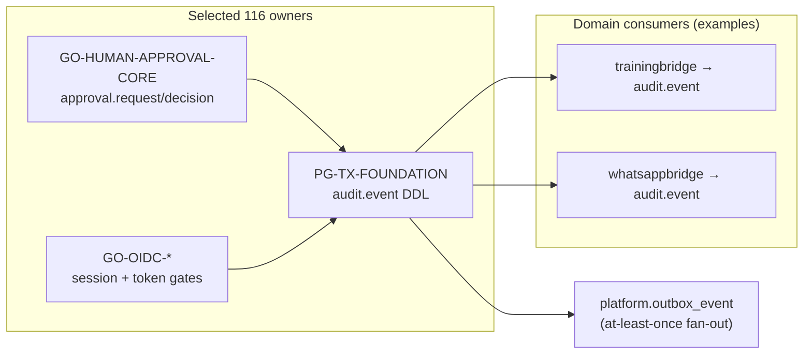

# Enterprise audit event stream — compose plan (not a HECHO pack)

**Revision:** `AUDIT-EVENT-PLAN-0.1.0`  
**Status:** **PLAN** — authorized compose recipe only. **Not** `REUSABLE_PACK`, **not** selected-116 `packId`, **not** `implementation_packs/*AUDIT*` admission.  
**Tip authority:** `docs/FRANCHISE_ARCHITECTURE.md` §1 *Identity / security / authorization / audit* @ `227c6e0033eaab96cb42fa809ac6c37b758f84f4`; `docs/ROADMAP.md` Identity row; `docs/slices/IDENTITY_SECURITY_COMPOSE.md`.

## What this plan is

This document closes the **library-side PARCIAL** gap for a **central tenant-scoped audit schema** by composing **existing** admitted owners. It does **not** materialize a new `GO-AUDIT-*` or `*AUDIT*` HECHO pack. Nightly and franchise architecture may cite this plan as the honest path from distributed audit surfaces to a single append-only event contract.

`production_authorized: false` remains false (`qualification/FINAL_LIBRARY_READY_V402.json`). Live IdP, MFA, OP conformance, and production SIEM export are **out of scope**.

## Authority chain (read-only cites)

| Need | Elite path |
|---|---|
| Domain status (**PARCIAL**) | `docs/FRANCHISE_ARCHITECTURE.md` §1 |
| Build order / nightly row | `docs/ROADMAP.md` → Identity / security / authz / audit |
| Identity compose slice | `docs/slices/IDENTITY_SECURITY_COMPOSE.md` |
| Selected 116 JSON | `markdown_system/FRANCHISE_COMPLETE_PACK_PLAN.md` |
| Claim routing | `markdown_system/PACK_PER_CLAIM_INDEX.md` (row *enterprise audit stream*) |
| Capability row (identity) | `markdown_system/CAPABILITY_CATALOG.md` row 46 |
| Library health / GAP honesty | `markdown_system/LIBRARY_HEALTH_CHECK.md` |

## Compose owners (existing only)

| Role | Selected 116 `packId` | Elite path | Audit contribution |
|---|---|---|---|
| Append-only audit ledger DDL | `PG-TX-FOUNDATION` | `implementation_packs/POSTGRES_TRANSACTIONAL_FOUNDATION.md` | `audit.event` schema, `audit.reject_mutation()` trigger, tenant FK |
| Platform migration (materialized) | (via PG-TX) | `db/migrations/0001_platform_foundation.up.sql` | `create table audit.event (...)` + append-only trigger |
| Transactional outbox (same migration) | `PG-TX-FOUNDATION` | `db/migrations/0001_platform_foundation.up.sql` | `platform.outbox_event` tenant-scoped publish path |
| Human approval audit trail | `GO-HUMAN-APPROVAL-CORE` | `implementation_packs/GO_HUMAN_APPROVAL_CORE.md` | Immutable `approval.request` / `approval.decision`; sha-bound evidence; tenant-scoped |
| Identity admission receipt binding | — (semantic gate) | `production_admission_gate/validate_identity_authorization_admission.py` | `audit_event_observed` on session revocation cases |
| Portal session / revocation counters | `GO-OIDC-PORTAL-SESSION` | `implementation_packs/GO_OIDC_PORTAL_SESSION.md`, `docs/PORTAL_IDENTITY_LIFECYCLE.md` | Session lifecycle obligations reference audit visibility |
| Service token authority | `GO-OIDC-SERVICE-TOKEN-BROKER` | `implementation_packs/GO_OIDC_SERVICE_TOKEN_BROKER.md` | Tenant/permission rejection evidence |
| Secure ops / release evidence | `SECURE-OPS-DELIVERY-CORE` | `implementation_packs/SECURE_OPERATIONS_DELIVERY_CORE.md` | Composition security receipts (`reconstruction_evidence/COMPOSITION_SECURITY_RELEASE_V402.md`) |
| ASVS / security suites | — (manual) | `SECURITY_SRE_CLOUD_INFRASTRUCTURE.md` §23 | `security_authz`, `security_identity` suite names |

**Adjacent (catalog ≠ selected 116; cite only, do not select into JSON):**

| Role | Elite path | When REQUIRED |
|---|---|---|
| CDC / Debezium outbox router | `implementation_packs/DEBEZIUM_POSTGRES_OUTBOX_RUNTIME.md` | Project needs Kafka/Connect capture of `platform.outbox_event` — not an immutable audit ledger |
| PCI DSS scope registry | `implementation_packs/GO_PCI_DSS_SCOPE_CORE.md` | Cardholder-data environment scope before PAN/SAD paths — gap gate via `implementation_packs/CAPABILITY_GAP_RESOLUTION_GATE.md` |
| GDPR consent / erasure | `implementation_packs/GO_GDPR_CONSENT_ERASURE_CORE.md` | Consent ledger + erasure state machine — gap gate if privacy claim is REQUIRED |
| OTP verification | `implementation_packs/GO_OTP_VERIFICATION_CORE.md` | Email/phone proof before onboarding — gap gate if step-up channel proof is REQUIRED |

## Central audit event schema (composed contract)

Canonical store: `audit.event` from `PG-TX-FOUNDATION` / `0001_platform_foundation.up.sql`.

| Field | Type (PG) | Obligation |
|---|---|---|
| `tenant_id` | `uuid` FK → `platform.tenant` | **Required** — every event is tenant-scoped |
| `event_id` | `uuid` | **Required** — unique per tenant |
| `actor_subject` | `text` | **Required** — OIDC `sub` or service principal label |
| `action` | `text` | **Required** — stable action name (`business-profile.activate`, `whatsapp.status_job.completed`, …) |
| `resource_type` | `text` | **Required** |
| `resource_id` | `text` | **Required** |
| `decision` | `allowed` \| `denied` \| `system` | **Required** |
| `evidence` | `jsonb` object | Default `{}`; sha-bound payloads from approval owners |
| `occurred_at`, `trace_id`, `source_ip`, `reason_code` | optional | Propagate when known |

**Invariants (library PROVEN_LOCAL):**

1. **Append-only** — `audit_event_reject_update_or_delete` trigger; see `db/tests/0001_platform_foundation.test.sql`.
2. **Tenant isolation** — FK + unique `(tenant_id, event_id)`; cross-tenant reads are a consumer gate.
3. **Outbox is not the audit ledger** — `platform.outbox_event` enables at-least-once delivery; Debezium runtime explicitly disclaims immutable audit (`DEBEZIUM_POSTGRES_OUTBOX_RUNTIME.md` README).

Domain owners write audit rows in the **same transaction** as the business effect (training bridge, WhatsApp status worker, approval decisions). This plan does not introduce a second write path.

## Compose recipe

Materialize **one claim at a time**. Compositor: `implementation_packs/MARKDOWN_COMPOSITOR_CORE.md` (`MARKDOWN-COMPOSITOR` — adjacent, not ∈ selected 116).

```powershell
# 1) PostgreSQL foundation (audit.event + outbox)
pwsh -File ./materialize_markdown_pack.ps1 `
  -PackFile ./implementation_packs/POSTGRES_TRANSACTIONAL_FOUNDATION.md `
  -Destination <pg-dest>

# 2) Human approval owner (approval tables + immutable decisions)
pwsh -File ./materialize_markdown_pack.ps1 `
  -PackFile ./implementation_packs/GO_HUMAN_APPROVAL_CORE.md `
  -Destination <approval-dest>

# 3) Identity owners (portal session + service token) — same franchise 116 profile
#    Use markdown_system/ENTERPRISE_BACKEND_PACK_PLAN.md or FRANCHISE_COMPLETE_PACK_PLAN.md
#    for packId rows GO-OIDC-PORTAL-SESSION, GO-OIDC-SERVICE-TOKEN-BROKER, GO-HUMAN-APPROVAL-CORE.
```

Apply migrations in order: `0001_platform_foundation` → domain migrations → `0042_human_approval` → consumers that insert into `audit.event`.

Optional CDC lane (project gate, disk-only pack):

```text
implementation_packs/DEBEZIUM_POSTGRES_OUTBOX_RUNTIME.md
  → captures platform.outbox_event only
  → does NOT replace audit.event
  → consumer inbox required (at-least-once)
```

## Verify steps (`LOCAL_FIXTURES`)

| Step | Command | Pass criterion |
|---|---|---|
| V1 | `python3 ci/verify_identity_security_fixture.py --workspace . --skip-go` | Fixture schema + tenant-scoped `audit_obligation_fields` + owner doors |
| V2 | `python3 -m unittest ci.test_verify_identity_security_fixture -v` | Verifier unit tests green |
| V3 | `python3 -m unittest production_admission_gate.test_validate_identity_authorization_admission -v` | `audit_event_observed` semantics on session cases |
| V4 | PostgreSQL (when available) | `db/tests/0001_platform_foundation.test.sql` — append-only rejection |

Slice evidence index: `docs/slices/IDENTITY_SECURITY_COMPOSE.md` §4–§5.

## Owner map (who writes what)



## Public patterns (remaining **FALTA** — cite only, no code copy)

| Pattern | URL | Honest elite gap |
|---|---|---|
| [NIST SP 800-63B — Authentication](https://pages.nist.gov/800-63-3/sp800-63b.html) | Memorized secrets, replay-resistant auth, verifier compromise | **FALTA:** target IdP AAL/IAL receipt on production issuer |
| [NIST SP 800-63B — Session management](https://pages.nist.gov/800-63-3/sp800-63b.html#sec5) | Session binding, re-auth, termination | **FALTA:** step-up policy per journey on deployed `application_url` |
| [OIDC Core 1.0](https://openid.net/specs/openid-connect-core-1_0.html) | `sub`, `aud`, token validation | **FALTA:** live OP conformance (`OIDC_CONFORMANCE` observation) |
| [AWS SaaS Lens — Multi-tenant microservices](https://docs.aws.amazon.com/wellarchitected/latest/saas-lens/multi-tenant-microservices.html) | Tenant context in logs and observability | **FALTA:** centralized SIEM/export with tenant partition on target cloud |

## Explicit non-claims

- **No** new `implementation_packs/*AUDIT*` HECHO pack or selected-116 `packId`.
- **No** `GO-QR-CORE`, PCI, GDPR, or OTP smuggling into `FRANCHISE_COMPLETE_PACK_PLAN.md` JSON.
- **No** live IdP, MFA, or OpenID OP conformance closed by this plan.
- **No** REVESTEX product code or production authorization.
- **No** exactly-once audit delivery — append-only PG + at-least-once outbox only.
- **No** wipe or rewrite of `docs/FRANCHISE_ARCHITECTURE.md` / `docs/ROADMAP.md` status matrices; this plan is cited as the proposed elite addition already named there.

## Nightly evidence commands (for PR / HQ)

```bash
python3 ci/verify_identity_security_fixture.py --workspace . --skip-go
python3 -m unittest ci.test_verify_identity_security_fixture -v
python3 -m unittest production_admission_gate.test_validate_identity_authorization_admission -v
```

Optional when PostgreSQL is available:

```bash
# per project harness — not required for library slice PASS
psql -f db/tests/0001_platform_foundation.test.sql
```
