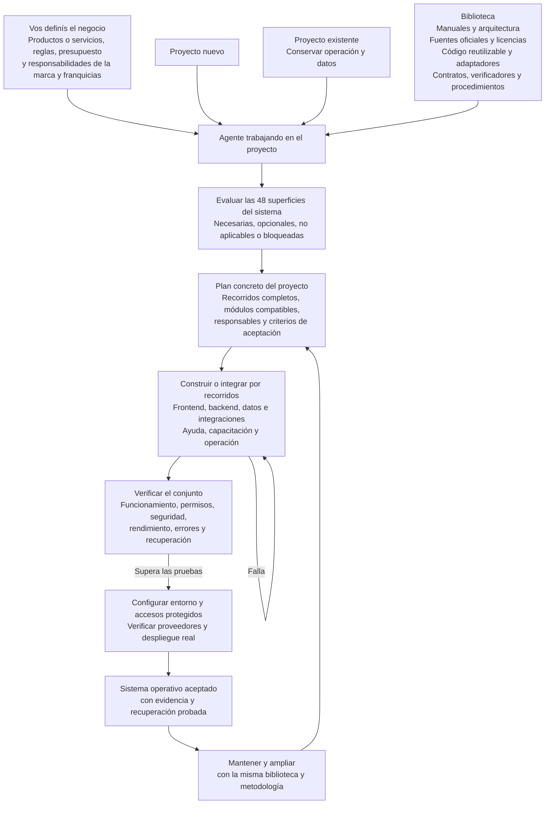
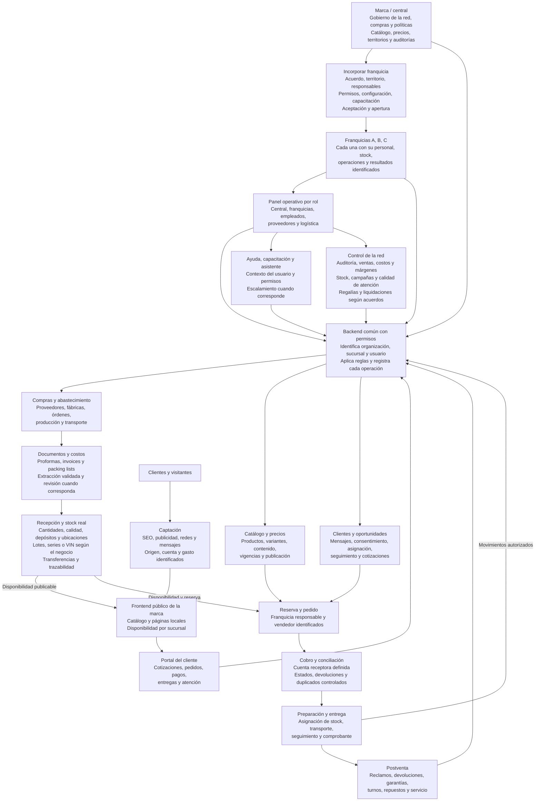
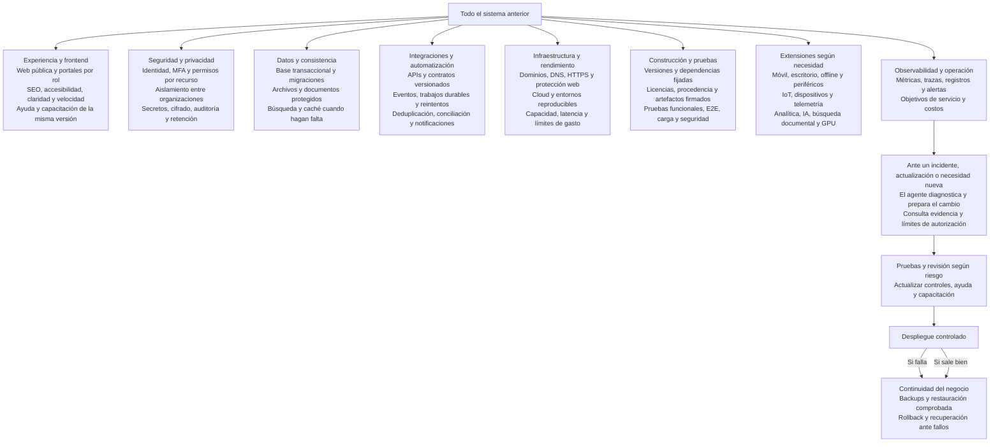

# Mapa de la biblioteca para personas

Alcance planificado. Síntesis para leer en minutos. No certifica que cada recuadro ya esté implementado ni aceptado en producción.

Una persona lee estos tres gráficos. Un agente no los usa como corpus: busca una ruta en `LIBRARY_SEARCH_INDEX.md`, abre ese archivo y una sola fila de estado si hace falta.

```bash
rg -n -F "término" markdown_system/LIBRARY_SEARCH_INDEX.md
```

El índice nombra cada manual, pack y evidencia. Nada queda fuera de la búsqueda. El detalle sigue en su archivo.

## 01. De la biblioteca al sistema

El negocio, un proyecto nuevo o uno existente, y la biblioteca llegan al mismo agente. El agente elige superficies, arma un plan, construye por recorridos y solo sigue si las pruebas pasan.



## 02. Operación de la red de franquicias

La marca gobierna. Cada franquicia opera con su personal, stock y resultados. Un backend común identifica organización, sucursal y usuario, aplica reglas y registra cada operación. El cliente ve la marca. La franquicia reserva, cobra, entrega y atiende la postventa.



## 03. Ingeniería, protección y mantenimiento

Todo el sistema anterior se sostiene con experiencia, seguridad, datos, integraciones, infraestructura, pruebas, extensiones y operación. Un incidente no se parchea a ciegas: se diagnostica, se prueba según el riesgo y se despliega con vuelta atrás.



El proyecto selecciona las capacidades necesarias. Las reglas específicas y los accesos se verifican en su entorno real.
